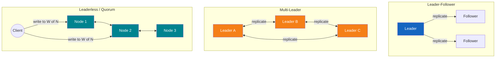
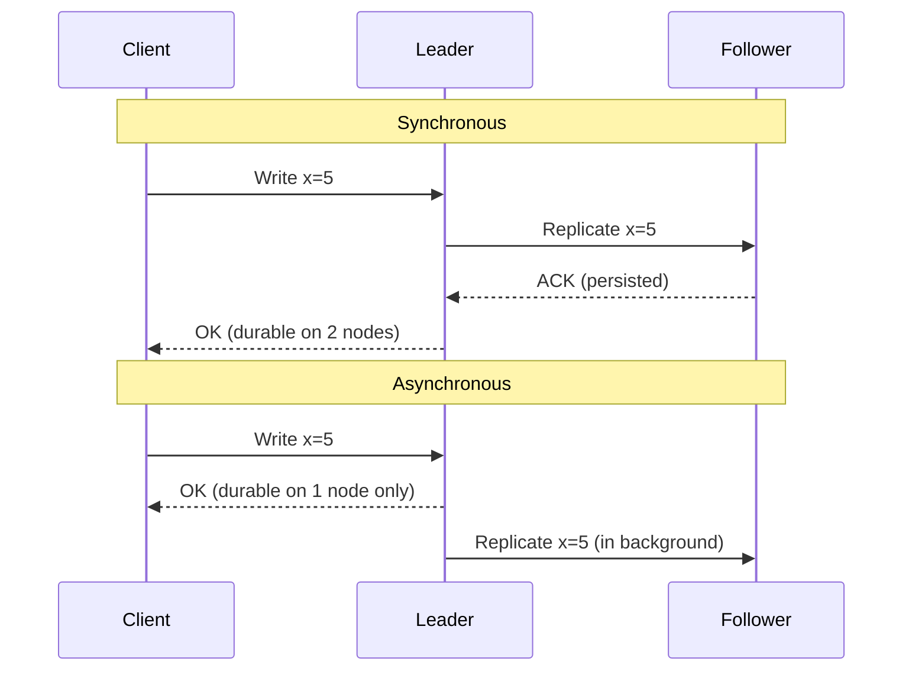

# Replication

**Prerequisites:** [Consistency Models](consistency-models.md), [CAP Theorem](cap-theorem.md)

[← Consistency Models](consistency-models.md) | [Next: Consensus & Raft →](raft.md)

---

## Why This Exists

Every distributed database keeps multiple copies of the same data — for durability (a disk dies, you don't lose data), for availability (a node dies, you still serve traffic), and for latency (serve reads from the datacenter closest to the user). The moment you have more than one copy, you have to answer: **who is allowed to write, and how do the other copies find out?**

Every answer to that question is a replication topology, and every topology trades off latency, durability, and availability differently. Pick the wrong one and you either lose acknowledged writes on failover, silently serve stale reads, or build a system that can't tell two conflicting writes apart.

!!! tip "Mental Model"
    Think of a single Google Doc (leader-follower), a group of people each editing their own offline copy and merging later (multi-leader), or a group text message where everyone can post and everyone reconciles who said what and when (leaderless). The topology you choose determines whether "who wins" is decided up front (one writer) or after the fact (conflict resolution).

---

## The Three Topologies



### Leader-Follower (Primary-Replica)

One node (the leader) accepts all writes. It streams a change log to followers, which apply it and can serve reads. Simple mental model: one writer, many readers.

- **Used by:** PostgreSQL streaming replication, MySQL replication, MongoDB replica sets, Kafka partitions.
- **Failure mode:** if the leader dies, someone must be promoted — see [Failover](#failover-mechanics) below.

### Multi-Leader

Multiple nodes (often one per datacenter) each accept writes and replicate to each other. Good for multi-region write locality — a European user writes to the EU leader, an Asian user writes to the APAC leader — but two leaders can accept conflicting writes to the same record before either replicates to the other.

- **Used by:** multi-datacenter MySQL/Postgres setups, CouchDB, some CDN edge configs.
- **Failure mode:** conflicting writes require resolution — see [Conflict Resolution](#conflict-resolution) below.

### Leaderless / Quorum-Based (Dynamo-style)

No node is special. Clients (or a coordinator) write to `W` of `N` replicas and read from `R` of `N` replicas directly, relying on `R + W > N` overlap (see [Consistency Models — Quorums](consistency-models.md#quorums-r-w-n)) to surface the latest write. Replicas gossip and repair themselves (read repair, anti-entropy, hinted handoff) rather than relying on a single replication stream.

- **Used by:** Amazon DynamoDB, Apache Cassandra, Riak.
- **Failure mode:** concurrent writes to the same key from different clients — resolved via LWW, version vectors, or CRDTs.

---

## How It Works Internally

### Synchronous vs Asynchronous Replication

The leader has a choice for every write: wait for followers to confirm before acknowledging the client (**synchronous**), or acknowledge immediately and replicate in the background (**asynchronous**).



| | Synchronous | Asynchronous |
|--|-------------|----------------|
| **Latency** | Higher — client waits for follower ACK | Lower — client only waits on leader |
| **Durability** | Write survives leader crash | Write can be lost if leader crashes before replicating |
| **Availability** | Leader can't ack writes if follower is unreachable (unless it demotes to async) | Leader keeps accepting writes even if followers are down/slow |

Most production systems use a middle ground: **semi-synchronous** — wait for acknowledgment from at least one follower (not all), so durability improves without fully coupling availability to every follower's health.

### Replication Lag

Asynchronous followers apply the log some delay behind the leader — replication lag. This is the mechanism, not an edge case; it's the direct cost of choosing lower write latency.

**Production symptoms:**
- **Stale reads:** a user writes, then reads from a lagging follower and doesn't see their own write (a read-your-writes violation — see [Consistency Models](consistency-models.md)).
- **Monotonic-read violations:** a user refreshes and sees older data than they did a moment ago, because their read was load-balanced to a *more* lagged replica than last time.
- **Split-brain risk:** if lag detection is broken or the leader/follower roles are ambiguous during a network hiccup, two nodes can both believe they're the leader and accept writes independently — the most dangerous replication failure, because it silently creates two divergent histories.

### Failover Mechanics

When the leader dies (crash, network partition, disk failure), something has to pick a new one:

1. **Detect** the leader is gone — usually a missed-heartbeat timeout.
2. **Elect** a new leader — the follower with the most up-to-date log (or, in consensus-based systems, a majority vote; see [Raft](raft.md) for exactly how term-based election and log-completeness voting works).
3. **Reconfigure** clients and other followers to point at the new leader.
4. **Reconcile** any writes the old leader accepted but never replicated — these are typically lost if the old leader used async replication, or discarded/re-applied depending on the system's rules.

Naive (human-operated) failover takes minutes and risks promoting a follower that's missing the last few writes. Consensus-based failover (Raft, Paxos) automates steps 1–2 safely: a candidate can only win an election if its log is at least as complete as a majority of voters, which is exactly the mechanism that prevents promoting a follower that would silently drop committed writes. See [Consensus & Raft](raft.md) for the full mechanics of terms, elections, and commit index.

### Conflict Resolution

In multi-leader and leaderless topologies, two writes to the same key can happen concurrently on different nodes before either has heard about the other. Something must decide the outcome when they meet:

| Strategy | How it works | Trade-off |
|----------|---------------|-----------|
| **Last-Write-Wins (LWW)** | Attach a timestamp to each write; highest timestamp wins, other write is silently discarded | Simple, but clock skew can make the "wrong" write win, and it *silently drops data* — dangerous for anything you can't afford to lose |
| **Vector clocks** | Each write carries a per-node counter vector; nodes can tell if one write causally preceded another, or if they're truly concurrent | Correctly detects real conflicts (vs false ones), but grows with cluster size and requires the app to handle concurrent versions explicitly |
| **Version vectors** | Similar to vector clocks but tracked per-key rather than per-operation; used by systems like Riak/Dynamo to return "sibling" versions on concurrent writes | Pushes conflict resolution to the application (or client) — correct but adds complexity to every read path |
| **CRDTs** (Conflict-free Replicated Data Types) | Data structures (counters, sets, maps) mathematically designed so concurrent updates always merge deterministically without coordination | Eliminates the conflict-resolution decision entirely for the operations they support, but only works for structures with well-defined merge semantics (not arbitrary business logic) — worth knowing exists, not something to deep-dive in most interviews |

---

## Worked Example: Global E-Commerce Checkout

A checkout service replicates order data across 3 regions.

**Leader-follower, async, single US leader:** EU customers write across the Atlantic (100ms+ RTT) to the leader — slow checkout, but no conflicts. A US region outage means the leader is gone; failover takes a manual runbook or a consensus layer, and any order acknowledged in the last replication window may vanish.

**Multi-leader, one leader per region:** EU customers write locally (low latency). But if the same customer opens two tabs and one checkout hits the EU leader while a duplicate-click retry hits the US leader before they've synced, you get two "orders" for one cart — needs LWW (risky — could silently drop a real order) or, better, idempotency keys generated client-side so duplicate writes are detected as *the same* write rather than a conflict to resolve.

**Leaderless, N=3, W=2, R=2 quorum:** Any node accepts the write; `R+W > N` guarantees a read overlaps a write. Handles regional outages gracefully (any 2 of 3 nodes suffice), but concurrent duplicate submissions still need idempotency keys or version vectors at the application layer — quorum consistency doesn't remove the need for conflict-aware design, it just changes where the seams are.

In all three, the actual fix for "duplicate order" is the same: an idempotency key on the client request, independent of the replication topology. The topology determines *latency and failover behavior*; correctness under concurrent client mistakes is usually an application-layer concern layered on top.

---

## Failure Modes

| Failure | Symptom | Root cause | Mitigation |
|---------|---------|------------|------------|
| Async replication lag spike | Stale reads, read-your-writes violations | Follower falling behind (disk I/O, network, GC pause) | Monitor lag; route read-your-writes traffic to leader or a caught-up replica |
| Split-brain after failover | Two nodes both accepting writes, diverging histories | Old leader didn't step down cleanly after a network partition; failover happened without fencing | Use consensus-based leader election (Raft/Paxos) with fencing tokens, not just heartbeat timeouts |
| Lost writes on failover | Acknowledged write disappears after promotion | Async replication; leader crashed before replicating the write | Synchronous or semi-synchronous replication for durability-critical writes |
| Silent conflict drop (LWW) | Data that was written "disappears" with no error | Clock skew or coincidental timestamp collision under LWW | Prefer version vectors/CRDTs for data where silent loss is unacceptable |
| Replication storm / thundering herd on rejoin | A recovering node saturates network/disk catching up | Large replication backlog after extended downtime | Rate-limit catch-up replication; use snapshotting instead of full log replay |

---

## Production Debugging

```
Symptom: users report stale or missing data intermittently

1. Check replication lag per replica
   → seconds behind leader; is one replica consistently worse?
2. Check which replica served the read
   → load balancer / router logs; is read routing sticky or random?
3. Check leader election history
   → how many failovers in the last 24h? Flapping leader = deeper problem (disk, GC, network)
4. Check for split-brain indicators
   → two nodes both claiming leadership in logs/metrics at the same timestamp
5. Check write acknowledgment mode
   → was this write sync or async? Does durability expectation match reality?
6. Check for conflict resolution activity (multi-leader/leaderless)
   → sibling/version counts, LWW discard rate — is conflict volume higher than expected?
```

**Key metrics to monitor:**
- Replication lag (p50/p99, per follower)
- Leader election / failover count and duration
- Write acknowledgment latency (sync vs async paths, separately)
- Conflict/merge rate in multi-leader or leaderless systems
- Fsync and disk I/O latency on the leader (root cause of most lag spikes)

---

## Scaling Limits

- **Leader-follower** scales reads horizontally (add followers) but write throughput is capped by a single leader's disk and CPU — this is the same ceiling discussed in [Raft's scaling limits](raft.md#scaling-limits).
- **Multi-leader** scales writes across regions but conflict-resolution cost grows with concurrent write rate to the same keys — fine for mostly-partitioned key spaces (each region owns its own users), painful for shared hot keys.
- **Leaderless/quorum** scales writes best of the three (no single write bottleneck) but pays a tunable latency cost per operation (`R`/`W` round trips) and pushes correctness work into the application via conflict resolution.
- All three are ultimately bounded by network RTT between replicas for any synchronous guarantee — physics, not configuration, sets the floor.

---

## Trade-offs

| Dimension | Leader-Follower | Multi-Leader | Leaderless / Quorum |
|-----------|------------------|---------------|----------------------|
| Write latency | Low (local) for leader region, high for others | Low everywhere (local leader) | Tunable via W |
| Write throughput | Single-leader bound | Higher (parallel leaders) | Highest (no single bottleneck) |
| Conflict handling | None needed (one writer) | Required | Required |
| Failover complexity | Moderate (election needed) | N/A per-leader, but merge on rejoin | Self-healing (read repair, hinted handoff) |
| Consistency | Strong possible (sync) or eventual (async) | Eventual by design | Tunable (R+W vs N) |
| Operational complexity | Low–Medium | High (conflict + topology) | Medium–High (tuning, repair processes) |
| Best for | Most OLTP systems, single-region-primary apps | Multi-region write locality, offline-first apps | High-write-throughput, availability-first systems |

---

## Interview Questions

=== "Basic"
    **Q: What's the difference between synchronous and asynchronous replication?**

    "Synchronous replication means the leader waits for at least one follower to acknowledge the write before telling the client it succeeded — this guarantees the write survives a leader crash, at the cost of higher latency. Asynchronous replication means the leader acknowledges immediately and replicates in the background — lower latency, but a leader crash before replication completes can lose an acknowledged write."

=== "Senior"
    **Q: Your leader-follower Postgres cluster failed over, and afterward a customer says their last order is missing. What happened, and how do you prevent it?**

    "This is almost certainly an async replication write that was acknowledged by the old leader but never replicated before it crashed — the newly promoted follower didn't have it. To confirm, I'd check the old leader's WAL position at time of failure versus the new leader's applied position. To prevent it going forward, I'd move to synchronous or semi-synchronous replication for the order-write path specifically — accepting the latency hit for durability-critical writes — while leaving less critical writes async. I'd also add fencing to the failover process so the old leader, if it comes back, can't accidentally re-accept writes as a zombie leader."

=== "Staff"
    **Q: You're designing a multi-region order system. Leader-follower with a single region, multi-leader, or leaderless — walk through your decision and how you'd handle conflicts.**

    "I'd start by asking whether writes actually need multi-region locality — a lot of 'we need multi-leader' requirements dissolve once you check whether customers write in their own region 95% of the time, in which case leader-follower with regional read replicas and accepted cross-region write latency for the rare case is simpler and safer. If genuine low-latency multi-region writes are required, I'd lean toward partitioning the key space by region ownership — each order belongs to the region it originated in — so 'multi-leader' becomes many independent leader-follower systems rather than one system fighting over shared keys, sidestepping most conflict resolution entirely. Where true concurrent writes to the same entity are unavoidable, I'd use idempotency keys at the API layer first, and only reach for version vectors or CRDTs for the specific fields that need automatic merge (e.g. an inventory counter as a CRDT). I would avoid naive last-write-wins on anything financial — silent data loss under clock skew is not an acceptable trade for an order system."

---

## Reasoning Exercises

1. **Multi-region social feed**: posts should appear near-instantly to the author's region, but eventually everywhere. Which topology, and what happens to a post if two regions partition from each other for 10 minutes?

2. **Inventory counter under multi-leader replication**: two regions both decrement the same item's stock concurrently, dropping it below zero when merged with LWW. Redesign the conflict resolution to make this impossible — what data structure or protocol would you reach for, and why?

3. **Failover blast radius**: a leader-follower cluster promotes a follower that was 30 seconds behind. What's the actual impact on clients mid-request, and how would synchronous replication, consensus-based election (Raft), and idempotency keys each independently reduce the damage?

---

## Key Takeaways

!!! success "Remember"
    1. Every replication topology answers "who can write" differently: one writer (leader-follower), several coordinated writers (multi-leader), or no fixed writer (leaderless/quorum).
    2. Synchronous replication buys durability at the cost of latency and availability; asynchronous buys speed at the cost of possible data loss on failover.
    3. Replication lag isn't a bug — it's the visible cost of the sync/async choice, and it directly produces the consistency violations described in [Consistency Models](consistency-models.md).
    4. Safe failover requires knowing the new leader's log is complete — naive heartbeat-based promotion risks lost writes; consensus (see [Raft](raft.md)) makes this safe and automatic.
    5. Conflict resolution (LWW, version vectors, CRDTs) is the price of multi-writer topologies — pick the mechanism based on what you can afford to lose, not by default.

**Previous:** [Consistency Models](consistency-models.md) | **Next:** [Consensus & Raft](raft.md)
