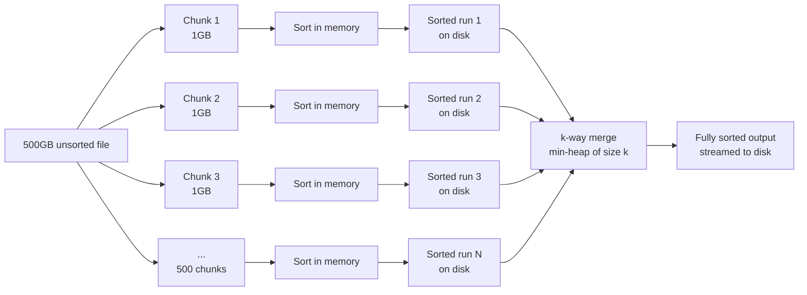

# Sorting Algorithms

**Difficulty:** Medium | **Pattern Type:** Comparison-based ordering

[← DSA Overview](index.md) | [← Backtracking](backtracking.md) | [Next: Tries →](tries.md)

---

## Why This Topic Exists

Sorting is rarely the final answer in an interview — it's usually the O(n log n) step that *unlocks* something else: binary search, two pointers, greedy interval scheduling, deduplication. Knowing the sorting algorithms' internals matters less than knowing their **properties**: is it stable, is it in-place, what's the worst case, and does it need extra memory. Those properties decide which one is right for a given constraint, and interviewers probe exactly that.

Python's built-in `sorted()`/`.sort()` uses **Timsort** (a hybrid of merge sort and insertion sort) — you should never hand-roll a sort in production, but you're expected to implement one from scratch and reason about its trade-offs on demand.

---

## Mental Model

Three families, three trade-offs:

```
Quicksort:  pick a pivot, partition < pivot | pivot | > pivot, recurse both halves.
            Fast average case, in-place, but O(n²) worst case on adversarial input.

Merge sort: split in half, sort each half, merge two sorted halves.
            Guaranteed O(n log n), stable, but needs O(n) extra space.

Heapsort:   build a max-heap, repeatedly swap root (max) to the end, shrink, sift down.
            Guaranteed O(n log n), in-place, but not stable and poor cache locality.
```

**Quicksort** and **merge sort** are both divide-and-conquer, but they divide at different points: quicksort does the hard work (partitioning) *before* recursing, merge sort does the hard work (merging) *after*. That's why quicksort can be in-place and merge sort naturally can't — merging two separately-sorted halves needs a buffer.

---

## Interactive Sort Comparison

<div class="sim-container">
  <div class="sim-title">📊 Quicksort / Merge Sort / Heapsort</div>

  <div class="sim-stats">
    <div class="sim-stat"><div class="sim-stat-label">Comparisons</div><div class="sim-stat-value" id="sort-compares">0</div></div>
    <div class="sim-stat"><div class="sim-stat-label">Swaps / Writes</div><div class="sim-stat-value" id="sort-swaps">0</div></div>
  </div>

  <div class="sim-controls">
    <button class="sim-btn success" onclick="window._sort && window._sort.quicksort()">▶ Quicksort</button>
    <button class="sim-btn success" onclick="window._sort && window._sort.mergesort()">▶ Merge Sort</button>
    <button class="sim-btn success" onclick="window._sort && window._sort.heapsort()">▶ Heapsort</button>
    <button class="sim-btn success" onclick="window._sort && window._sort.bucketSort()">▶ Bucket Sort</button>
    <button class="sim-btn danger" onclick="window._sort && window._sort.reset()">New Random Array</button>
  </div>

  <canvas id="sort-canvas" style="width:100%;height:240px;"></canvas>

  <div style="margin:0.5rem 0;font-size:0.8rem">
    <span style="background:#1565c0;padding:2px 8px;border-radius:4px;color:#fff">Bar (unsorted position)</span>
    <span style="background:#b71c1c;padding:2px 8px;border-radius:4px;color:#fff;margin-left:8px">Active comparison / swap</span>
  </div>

  <div class="sim-log" id="sort-log"></div>
</div>

Run each algorithm on the same array and compare comparison/swap counts — quicksort with a bad pivot choice can spike, merge sort and heapsort stay predictable.

---

## Implementation

### Quicksort (Lomuto partition, in-place)

```python
def quicksort(arr: list[int], lo: int = 0, hi: int | None = None) -> None:
    """In-place. Partitions around arr[hi] (last element as pivot)."""
    if hi is None:
        hi = len(arr) - 1
    if lo >= hi:
        return

    pivot = arr[hi]
    i = lo
    for j in range(lo, hi):
        if arr[j] < pivot:
            arr[i], arr[j] = arr[j], arr[i]
            i += 1
    arr[i], arr[hi] = arr[hi], arr[i]  # pivot lands at its final sorted position

    quicksort(arr, lo, i - 1)
    quicksort(arr, i + 1, hi)
    # Time: O(n log n) average, O(n²) worst case (already-sorted input + last-element pivot)
    # Space: O(log n) recursion stack average, O(n) worst case
    # Not stable — the partition swap can reorder equal elements
```

!!! tip "Fixing quicksort's worst case"
    Always-sorted input is adversarial for a fixed pivot choice. **Randomized pivot** (swap `arr[hi]` with a random index first) makes the O(n²) case require adversarial *knowledge of your randomness*, not just adversarial input — this is the standard production fix.

### Merge Sort (stable, guaranteed O(n log n))

```python
def merge_sort(arr: list[int]) -> list[int]:
    """Returns a new sorted list. Not in-place — needs O(n) auxiliary space."""
    if len(arr) <= 1:
        return arr

    mid = len(arr) // 2
    left = merge_sort(arr[:mid])
    right = merge_sort(arr[mid:])
    return _merge(left, right)
    # Time: O(n log n) always — no worst-case degradation
    # Space: O(n) for the merge buffers


def _merge(left: list[int], right: list[int]) -> list[int]:
    merged = []
    i = j = 0
    while i < len(left) and j < len(right):
        if left[i] <= right[j]:      # <= (not <) preserves stability: ties keep left's order
            merged.append(left[i]); i += 1
        else:
            merged.append(right[j]); j += 1
    merged.extend(left[i:])
    merged.extend(right[j:])
    return merged
```

### Heapsort (in-place, not stable)

```python
def heapsort(arr: list[int]) -> None:
    """In-place. Build a max-heap, then repeatedly move the max to the end."""
    n = len(arr)

    for i in range(n // 2 - 1, -1, -1):  # bottom-up heapify, O(n)
        _sift_down(arr, i, n)

    for end in range(n - 1, 0, -1):
        arr[0], arr[end] = arr[end], arr[0]  # max is always at root
        _sift_down(arr, 0, end)              # restore heap property in the shrunk heap
    # Time: O(n log n) always — heapify O(n) + n sift-downs of O(log n)
    # Space: O(1) extra — sorts in place


def _sift_down(arr: list[int], i: int, n: int) -> None:
    while True:
        left, right, largest = 2 * i + 1, 2 * i + 2, i
        if left < n and arr[left] > arr[largest]:
            largest = left
        if right < n and arr[right] > arr[largest]:
            largest = right
        if largest == i:
            break
        arr[i], arr[largest] = arr[largest], arr[i]
        i = largest
```

### Bucket Sort (distribute, sort each bucket, concatenate)

**Mental model:** if you know your input is roughly uniformly distributed across a value range, don't compare every element against every other element — throw each element into a bucket keyed by its approximate value, sort each (small) bucket cheaply, then walk the buckets in order and concatenate. You've replaced most of the comparisons with a single O(1) bucket-assignment step per element.

```
Values:     0.42  0.19  0.87  0.33  0.71  0.05

Buckets (5, range [0.0, 1.0)):
  [0.0, 0.2): 0.19, 0.05
  [0.2, 0.4): 0.33
  [0.4, 0.6): 0.42
  [0.6, 0.8): 0.71
  [0.8, 1.0): 0.87

Sort each bucket individually → concatenate in bucket order → done.
```

This is the same "trade comparisons for a lookup" move that hash maps make elsewhere: instead of a full comparison-based sort, use the *value itself* to compute where an element roughly belongs.

```python
def bucket_sort(arr: list[float], bucket_count: int = 10) -> list[float]:
    """Assumes values are roughly uniformly distributed over [0, 1).
    For integers, adapt the bucket-index formula to your value range."""
    if not arr:
        return arr

    buckets: list[list[float]] = [[] for _ in range(bucket_count)]
    for v in arr:
        idx = min(bucket_count - 1, int(v * bucket_count))  # O(1) bucket assignment
        buckets[idx].append(v)

    for b in buckets:
        b.sort()  # insertion sort in practice — buckets are small

    result = []
    for b in buckets:
        result.extend(b)
    return result
    # Time: O(n + k) average, when input is uniformly distributed across k buckets
    #        (each bucket gets ~n/k elements, so sorting all buckets is
    #        k * O((n/k)²) = O(n²/k) — with k ≈ n, that's O(n))
    # Time: O(n²) worst case — all elements land in one bucket (skewed input)
    # Space: O(n + k) for the buckets
    # Stable if the per-bucket sort is stable (e.g. insertion sort)
```

!!! tip "When bucket sort beats comparison sorts"
    Comparison-based sorts (quicksort, merge sort, heapsort) have an information-theoretic floor of **O(n log n)** — you cannot do better by comparing elements pairwise. Bucket sort (like counting sort and radix sort) sidesteps that floor by using the *value* to place elements directly, achieving **O(n + k) average case**. The catch: it only works when you can compute a good bucket index cheaply and the input is close to uniformly distributed — an adversarial or heavily skewed distribution degrades it to O(n²) (one giant bucket, sorted by the fallback comparison sort).

The visualizer's "Bucket Sort" button shows this directly: watch the bars get reassigned into bucket order first (a single pass), then each bucket segment gets a small in-place insertion sort — noticeably fewer comparisons than quicksort/heapsort on the same array when the values are spread out.

---

## Sorting Data That Doesn't Fit in Memory

### Why This Exists

Every algorithm above assumes the entire array lives in RAM and you can random-access any element in O(1). That assumption breaks the moment your dataset is a 500 GB log file, a multi-terabyte database table, or the intermediate output of a distributed join — you cannot load it all into memory, and even if you could, thrashing virtual memory would make an in-memory O(n log n) sort effectively O(n log n) *disk seeks*, which is catastrophically slower than the same complexity in RAM.

**External sorting** solves this: sort data that lives on disk (or across a network) using only a bounded amount of memory, at the cost of controlled, sequential disk I/O instead of random access.

### Mental Model

Split, sort, spill, merge — the same divide-and-conquer shape as merge sort, but the "divide" boundary is *how much fits in memory*, not an arbitrary midpoint:

```
1. SPLIT:  break the input into chunks that each fit in memory (e.g. 1 GB chunks
           from a 500 GB file).

2. SORT:   load each chunk into memory, sort it with any in-memory algorithm
           (quicksort/Timsort), write the sorted chunk back to disk as a "run".

3. MERGE:  open all sorted runs simultaneously, read only their next unread
           element into memory at a time, and repeatedly pull the global
           minimum across all runs using a min-heap of size k (k = number of
           runs) — this is a k-way merge, and it only ever needs O(k) elements
           in memory at once, regardless of total data size.
```



### How the k-Way Merge Works

Each of the k sorted runs only ever needs its *next unread element* in memory. A min-heap holding one element per run gives you the global minimum in O(log k), and after popping it you pull the next element from that same run and push it back:

```python
import heapq

def k_way_merge(sorted_chunk_iterators: list) -> list:
    """Merge k already-sorted, disk-backed iterators using O(k) memory.
    Each iterator yields its chunk's elements in ascending order."""
    heap = []  # (value, chunk_index) — heapq compares tuples, ties break on chunk_index
    iterators = [iter(chunk) for chunk in sorted_chunk_iterators]

    for i, it in enumerate(iterators):
        first = next(it, None)
        if first is not None:
            heapq.heappush(heap, (first, i))

    result = []
    while heap:
        value, i = heapq.heappop(heap)
        result.append(value)
        nxt = next(iterators[i], None)
        if nxt is not None:
            heapq.heappush(heap, (nxt, i))

    return result
    # Time: O(n log k) — n total elements, each push/pop is O(log k)
    # Space: O(k) in memory — only one element per run resident at a time,
    #        plus whatever output buffering you choose
```

Note the shape: this is exactly the ["merge k sorted lists" heap pattern](heaps.md) applied at disk scale — the heap never grows beyond k elements no matter how large the total dataset is.

### Where This Shows Up in Practice

| System | How it uses external sort |
|--------|---------------------------|
| **Database query engines** (Postgres, MySQL) | `ORDER BY` / `GROUP BY` / merge joins on datasets larger than `work_mem` spill sorted runs to disk, then k-way merge — visible in `EXPLAIN` as "external merge Disk" |
| **MapReduce / Spark** | The shuffle phase sorts each mapper's output by key into spill files, then the reducer performs a k-way merge across all mapper outputs for a given key range |
| **Unix `sort` command** | `sort` automatically spills to temp files once input exceeds a memory threshold (`--buffer-size`), sorts each chunk, and k-way merges — `sort -m` explicitly merges pre-sorted files |
| **Search index construction** (e.g. building an inverted index) | Postings lists are built in memory-sized chunks, flushed sorted, then merged — the classic "SPIMI" (Single-Pass In-Memory Indexing) approach |

### Trade-offs

| Factor | In-memory sort | External merge sort |
|--------|----------------|----------------------|
| Memory required | O(n) | O(chunk size), independent of n |
| I/O pattern | None (or one load) | Sequential reads/writes — chunk write, then k-way merge read |
| Time complexity | O(n log n) compute | O(n log n) compute + O(n) sequential I/O, dominated by disk/network throughput in practice |
| When it breaks down | Data exceeds RAM → thrashing | Very high k (too many small chunks) increases merge-heap overhead — mitigated by multi-pass merging (merge k runs into fewer, larger runs, repeat) |

!!! tip "Multi-pass merging"
    If you have thousands of sorted runs, merging them all in one k-way pass makes the heap itself expensive and can exceed file-descriptor limits. Production external sorts merge in *passes*: merge groups of k runs into fewer, larger sorted runs, repeat until one run remains — the same shape as a merge sort's binary tree, just with a wider branching factor per level.

---

## When to Use Which

| Requirement | Choose | Why |
|-------------|--------|-----|
| General-purpose, don't care about worst case | **Quicksort** (randomized pivot) | Best average constant factor, in-place, cache-friendly |
| Need **stability** (equal elements keep relative order) | **Merge sort** | Naturally stable; bucket sort is stable too if its per-bucket sort is |
| Need **guaranteed** O(n log n), no O(n²) risk | **Merge sort or heapsort** | Both avoid quicksort's adversarial-input blowup |
| Memory is tight, can't afford O(n) extra space | **Quicksort or heapsort** | Both sort in-place; merge sort and bucket sort need a buffer |
| Values uniformly distributed over a known range | **Bucket sort** | O(n + k) average — beats the O(n log n) comparison floor by not comparing |
| Data doesn't fit in memory (disk/network-backed) | **External merge sort** (chunk, sort, spill, k-way merge) | Bounded O(chunk size) memory regardless of total data size — see below |
| Nearly-sorted input | **Insertion sort** (not covered above) or Timsort | O(n) best case for insertion sort; Timsort exploits existing runs |
| Small n (< ~20) | **Insertion sort** | Lower constant factor beats O(n log n) algorithms at small scale — this is why Timsort falls back to it |
| Production code in Python | **`sorted()` / `.sort()`** | Timsort: stable, O(n log n) worst case, exploits pre-sorted runs — never hand-roll this |

**Stability matters** whenever you sort by one key but want ties broken by original order or a previous sort — e.g., sort employees by department, then (stably) by hire date, and each department stays hire-date ordered.

---

## Common Problems and Patterns

### Merge Intervals (Sort First, Then Sweep)

```python
def merge_intervals(intervals: list[list[int]]) -> list[list[int]]:
    """Sorting by start makes overlap checking a single linear pass."""
    intervals.sort(key=lambda iv: iv[0])
    merged = [intervals[0]]

    for start, end in intervals[1:]:
        if start <= merged[-1][1]:          # overlaps the last merged interval
            merged[-1][1] = max(merged[-1][1], end)
        else:
            merged.append([start, end])

    return merged
    # Time: O(n log n) for the sort, O(n) for the sweep
```

### Kth Largest Element (Quickselect — Quicksort's Partition, Without Full Recursion)

```python
import random

def find_kth_largest(nums: list[int], k: int) -> int:
    """Quickselect: only recurse into the side containing the answer. O(n) average."""
    target = len(nums) - k  # k-th largest = index (n-k) in ascending sorted order

    def partition(lo: int, hi: int) -> int:
        pivot_idx = random.randint(lo, hi)
        nums[pivot_idx], nums[hi] = nums[hi], nums[pivot_idx]
        pivot = nums[hi]
        i = lo
        for j in range(lo, hi):
            if nums[j] < pivot:
                nums[i], nums[j] = nums[j], nums[i]
                i += 1
        nums[i], nums[hi] = nums[hi], nums[i]
        return i

    lo, hi = 0, len(nums) - 1
    while True:
        p = partition(lo, hi)
        if p == target:
            return nums[p]
        elif p < target:
            lo = p + 1
        else:
            hi = p - 1
    # Time: O(n) average (halves the search space like binary search), O(n²) worst case
```

### Sort Colors (Dutch National Flag — Single-Pass Three-Way Partition)

```python
def sort_colors(nums: list[int]) -> None:
    """In-place sort of 0s, 1s, 2s in one pass — the partition step of 3-way quicksort."""
    low, mid, high = 0, 0, len(nums) - 1

    while mid <= high:
        if nums[mid] == 0:
            nums[low], nums[mid] = nums[mid], nums[low]
            low += 1; mid += 1
        elif nums[mid] == 1:
            mid += 1
        else:
            nums[mid], nums[high] = nums[high], nums[mid]
            high -= 1  # don't advance mid — the swapped-in value is unexamined
    # Time: O(n), single pass  Space: O(1)
```

---

## Complexity Summary

| Algorithm | Best | Average | Worst | Space | Stable | In-place |
|-----------|------|---------|-------|-------|--------|----------|
| Quicksort | O(n log n) | O(n log n) | O(n²) | O(log n) | No | Yes |
| Merge sort | O(n log n) | O(n log n) | O(n log n) | O(n) | Yes | No |
| Heapsort | O(n log n) | O(n log n) | O(n log n) | O(1) | No | Yes |
| Insertion sort | O(n) | O(n²) | O(n²) | O(1) | Yes | Yes |
| Timsort (Python default) | O(n) | O(n log n) | O(n log n) | O(n) | Yes | No |
| Bucket sort | O(n + k) | O(n + k) | O(n²) | O(n + k) | Yes* | No |
| External merge sort | — | O(n log n) compute + O(n) I/O | — | O(chunk size) | Yes | No |

\* Bucket sort is stable only if the per-bucket sort used is stable.

---

## Interview Follow-ups

1. **"Why is quicksort usually faster than merge sort in practice despite the same average complexity?"** — Smaller constant factor: in-place partitioning has better cache locality than merge sort's buffer allocation and copying.
2. **"How do you make quicksort worst-case-safe?"** — Randomized pivot selection defeats adversarial fixed-pivot inputs; **introsort** (used by C++ `std::sort`) switches to heapsort if recursion depth exceeds a threshold, guaranteeing O(n log n).
3. **"Why does Python's `sorted()` need a `key` function instead of a comparator?"** — Key functions are computed once per element (O(n) calls) vs. a comparator's O(n log n) calls; also composes cleanly with `stable` sorting on multiple criteria.
4. **"When would you pick heapsort over merge sort?"** — When O(n) extra space is unacceptable but you still need the O(n log n) worst-case guarantee that quicksort can't promise.
5. **"Why doesn't bucket sort violate the O(n log n) comparison lower bound?"** — Because it isn't a comparison sort — it uses the value to compute a bucket index directly (like an array access), so the information-theoretic argument for O(n log n) (built on counting possible orderings via pairwise comparisons) doesn't apply. The trade is that it needs a well-distributed key it can hash/bucket cheaply.
6. **"How would you sort a file too big for memory?"** — External merge sort: split into memory-sized chunks, sort each in memory, spill sorted runs to disk, then k-way merge with a min-heap of size k — memory stays bounded at O(chunk size) regardless of total data size.

---

## Key Takeaways

!!! success "Remember"
    1. **Quicksort**: fast average case, in-place, O(n²) worst case on adversarial/sorted input — fix with randomized pivot.
    2. **Merge sort**: guaranteed O(n log n), **stable**, needs O(n) extra space — the right choice for external sorting or when stability matters.
    3. **Heapsort**: guaranteed O(n log n), in-place (O(1) space), **not stable**, weaker cache locality than quicksort.
    4. **Stability** = equal elements keep relative order — only merge sort (and insertion sort, and Timsort) give you this naturally.
    5. Python's `sorted()` is **Timsort** — never hand-roll a sort in production; know the trade-offs to explain *why* the built-in is usually right.
    6. **Quickselect** (quicksort's partition step, one-sided recursion) finds the k-th element in O(n) average — don't fully sort when you only need one element.
    7. **Bucket sort** breaks the O(n log n) comparison floor with O(n + k) average case — but only on uniformly distributed input; skewed input degrades it to O(n²).
    8. **External merge sort** (chunk → sort → spill → k-way merge with a min-heap) is how databases, MapReduce/Spark shuffle, and Unix `sort` handle data that doesn't fit in memory — bounded memory, sequential I/O.
