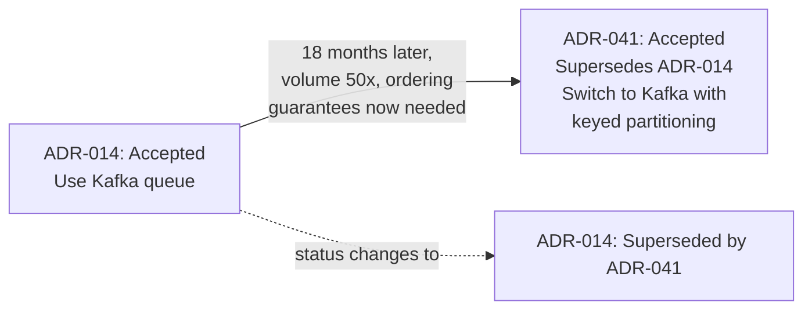

# Architecture Decision Records

**Prerequisites:** [System Design Framework](framework.md)

[← Foundations](index.md) | **Next:** [Architecture Reviews](architecture-reviews.md)

---

## Why This Exists

Six months after a decision, someone new joins the team, looks at the code, and asks "why is this a queue instead of a direct call?" The person who made that call has since left, or just doesn't remember — it was one decision among hundreds. Without a record, the team has two bad options: reverse-engineer the reasoning from the code (slow, often wrong), or re-litigate the decision from scratch (wastes the original analysis entirely, and might reach a worse answer without the context the first team had).

**An Architecture Decision Record (ADR) is a short, permanent document that captures one significant decision, the context that drove it, and the alternatives that were rejected — written at the time the decision is made, not reconstructed later.** It isn't a design doc (which explores a space) and it isn't a runbook (which describes how to operate something) — it's a *decision*, frozen at the moment it was made, including the reasoning that will otherwise evaporate.

---

## Mental Model: A Decision Has a Half-Life

The reasoning behind a decision decays fast. The tradeoffs felt obvious in the room — obvious enough that nobody wrote them down — and six months later "obvious" is gone, replaced by "well, that's just how it is." An ADR is a deliberate act against that decay: it's cheaper to spend fifteen minutes writing the reasoning down while it's fresh than to spend an afternoon reconstructing it later, multiplied by every future person who has the same question.

---

## The Format

ADRs are deliberately short — one page, not a design doc. The canonical structure (Michael Nygard's original format, still the industry default):

```markdown
# ADR-014: Use a message queue between order-service and inventory-service

## Status
Accepted (2026-03-12)

## Context
order-service currently calls inventory-service synchronously to decrement
stock on checkout. Under peak load, inventory-service latency spikes cause
checkout timeouts even though the order itself is valid — the two services'
availability is now coupled, and inventory-service is the slower, more
failure-prone of the two (it has a heavier write pattern to the DB).

## Decision
Introduce a message queue (Kafka) between the two services. order-service
publishes an "order-placed" event and returns success immediately;
inventory-service consumes asynchronously and decrements stock.

## Alternatives Considered
- Keep synchronous call, add a circuit breaker: reduces cascading failure
  but doesn't fix the coupling — checkout still fails when inventory is slow.
- Synchronous call with a longer timeout: pushes the problem to p99 latency
  instead of fixing it.

## Consequences
- Checkout is now decoupled from inventory-service availability.
- Stock decrement is eventually consistent — a checkout can succeed for an
  item that goes out of stock moments later (overselling risk); mitigated
  with a reservation hold at checkout time, tracked in ADR-015.
- Adds operational surface: a new queue to monitor, and a new failure mode
  (consumer lag) that didn't exist before.
```

**Why each section earns its place:** *Context* is the part most ADRs skip and the part that matters most — without it, "we use a queue" reads as arbitrary six months later. *Alternatives Considered* is what stops the next person from re-proposing the same rejected option and wasting a meeting re-deriving why it doesn't work. *Consequences* is the honest ledger — including the costs, not just the win — which is what separates an ADR from a justification memo.

---

## When to Write One

Not every decision needs an ADR — that would just create noise nobody reads. The bar is roughly: **would a reasonable engineer, six months from now, looking at this part of the system, wonder "why was it built this way," and be unable to tell from the code alone?**

| Write an ADR | Skip it |
|---|---|
| Choosing between a queue and a synchronous call for a cross-service integration | Naming conventions, formatting — captured in a style guide, not an ADR |
| Picking a database or a major dependency for a new service | A local refactor that doesn't change any external contract |
| A consistency-model trade-off (e.g. accepting eventual consistency somewhere) | An implementation detail with no architectural consequence — a private helper function's internal structure |
| Reversing a previous ADR | A decision that's genuinely, cheaply reversible and low-stakes either way |

---

## Reversing a Decision: Superseding, Not Deleting

Decisions age. New information arrives, requirements change, the thing that was true in ADR-014 stops being true. **The discipline is to write a new ADR that supersedes the old one — not to edit or delete the original.**



This preserves the history: a reader hitting ADR-014 today sees it's superseded and follows the chain to ADR-041, which explains *why* the original decision stopped being right — which is itself valuable context (the system's scale assumptions changed, not that the original decision was a mistake). Deleting or silently editing ADR-014 destroys that trail and makes the next reversal harder to reason about too, because there's no record of what was tried before.

!!! tip "An ADR being superseded isn't a failure"
    A decision that was correct given the information and scale at the time, and later gets superseded as things changed, is the system working as intended. The failure mode is not writing the ADR at all — then nobody can tell if the current state is "a deliberate, since-superseded decision" or "nobody ever decided this on purpose."

---

## Where They Live

ADRs work best co-located with the code they describe — a `docs/adr/` or `docs/decisions/` directory in the repo, numbered sequentially, committed via normal PR review like any other change. This matters more than it sounds: an ADR in a wiki that isn't linked from the code is one nobody finds when they actually need it (mid-debugging, wondering "why is this built this way"); an ADR in the same repo, referenced in a comment near the relevant code, gets found by the person who needs it, when they need it.

---

## Interview Questions

=== "Foundation"
    **Q: What's the difference between an ADR and a design doc?**

    "A design doc explores a space — it lays out the problem, several candidate solutions, and works toward a recommendation; it's often long and iterative, written before a decision is made. An ADR is the output: a short, permanent record of the specific decision that was reached, the context that drove it, and what was rejected and why. A team might write one design doc and, out of it, one or several ADRs for the individual decisions the doc converged on."

=== "Senior"
    **Q: A teammate says ADRs are bureaucratic overhead that slows the team down. How do you respond?**

    "I'd agree they're overhead if used for everything — nobody should write an ADR for a variable name. But for decisions that are genuinely hard to reverse or that a future engineer will need the reasoning for, the fifteen minutes it takes to write one is much cheaper than the alternative, which is that same reasoning getting re-derived from scratch by every person who later asks 'why is this built this way' — and re-derived worse, because they don't have the context the original team had. The overhead argument usually means the team is writing ADRs for the wrong things, not that ADRs themselves are the problem — the fix is a sharper bar for what qualifies, not abandoning the practice."

=== "Staff"
    **Q: You're joining a team with no ADR history and a codebase full of decisions nobody can explain. How do you introduce the practice without it feeling like process for its own sake?**

    "I wouldn't start by mandating ADRs for everything going forward — that reads as bureaucracy and gets ignored. I'd start by writing a handful myself, for the next few genuinely significant decisions that come up naturally, and make sure they're short, useful, and actually get referenced in a PR discussion or an onboarding conversation — let the value be visible before asking anyone else to adopt the format. For the backlog of undocumented historical decisions, I wouldn't try to backfill all of them — I'd backfill only the ones that keep coming up as live questions (the queue-vs-sync-call kind of thing new hires keep asking about), framed as 'best reconstruction, not contemporaneous record' so nobody mistakes it for something it isn't. The goal is the team reaching for the format because it solved a real problem for them once, not because a policy says to."

---

## Key Takeaways

!!! success "Remember"
    1. **An ADR captures one decision, its context, and its rejected alternatives — written at decision time, not reconstructed later.**
    2. **Context and Alternatives Considered are the sections that matter most** — they're what stops the next person from re-deriving or re-proposing what was already settled.
    3. **The bar for writing one: would a future engineer wonder "why" and be unable to tell from the code alone?** Not every decision clears that bar.
    4. **Supersede, don't delete** — a new ADR that references and replaces an old one preserves the reasoning trail; editing history away makes future reversals harder to reason about.
    5. **They only work if they're findable at the moment someone needs them** — co-located with the code, not buried in a wiki nobody links to.

**Previous:** [System Design Framework](framework.md) | **Next:** [Architecture Reviews](architecture-reviews.md)
