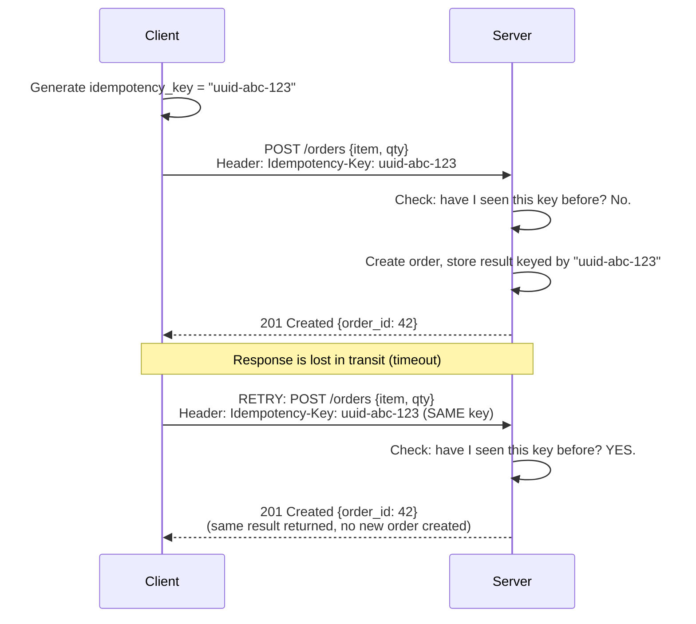
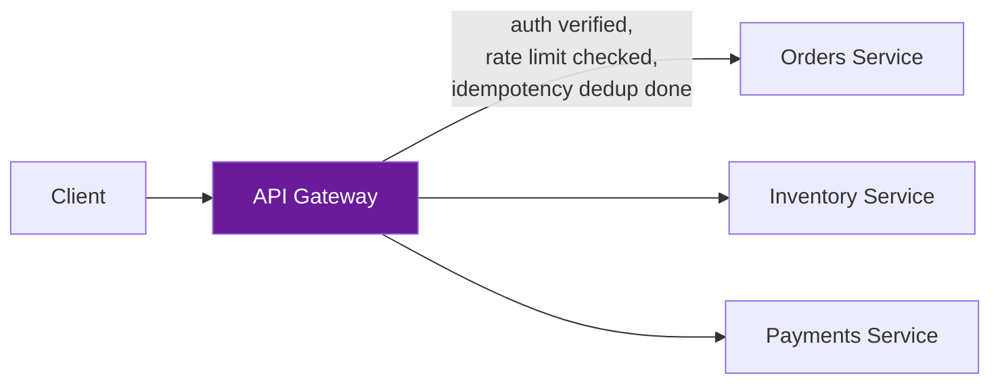

# API Design

**Prerequisites:** [Stateless vs Stateful Applications](stateless-vs-stateful.md)

[← Stateless vs Stateful](stateless-vs-stateful.md) | [Next: System Design Framework →](framework.md)

---

## Why This Exists

Every page in this repo about retries, timeouts, and circuit breakers quietly assumes one thing: **that retrying a request is safe.** It usually isn't, unless the API was designed to make it safe.

```
Client calls POST /orders with { item: "widget", qty: 1 }
Server creates the order, charges the card... then the response is lost
  (network blip, proxy timeout, doesn't matter which).

Client sees a timeout. Client, per the retry policy in Circuit Breakers,
retries the same request.

POST /orders arrives again. Server has no way to know this is a retry.
→ Second order created. Second charge. Customer billed twice.
```

**This is not a network problem — it's an API design problem.** The network will always eventually lose a response (that's a law, not a bug to fix). The only question is whether the API was designed so a client can safely retry without knowing whether the first attempt succeeded. That's what this page is actually about — REST and GraphQL are the vocabulary; idempotency is the property that makes the rest of this repo's resilience patterns (retries, timeouts, at-least-once delivery) safe to use at all.

---

## REST: Resources, Verbs, and the Contract They Imply

REST models an API as **resources** (nouns: `/orders`, `/users/42`) manipulated by a small, fixed set of **HTTP verbs**, each with a specific, promised behavior.

```
GET    /orders/42        → read order 42, no side effects
POST   /orders           → create a new order
PUT    /orders/42        → replace order 42 entirely
PATCH  /orders/42        → partially update order 42
DELETE /orders/42        → remove order 42
```

**The verbs are a contract, not just a naming convention.** Each one carries specific promised properties that clients, proxies, and caches are allowed to rely on:

| Verb | Safe? (no side effects) | Idempotent? (repeating it = same effect as once) |
|---|---|---|
| GET | Yes | Yes |
| PUT | No | **Yes** |
| DELETE | No | **Yes** (deleting an already-deleted resource is still "deleted") |
| PATCH | No | Depends on the patch semantics |
| POST | No | **No, by default** |

```python
# ✗ Violates the contract: GET with a side effect
@app.route("/orders/42/cancel", methods=["GET"])
def cancel_order():
    orders[42].status = "cancelled"   # A GET should never mutate state!
    # A prefetcher, a browser's "open link in new tab", or a crawler
    # following this link will silently cancel real orders.

# ✓ Respects the contract
@app.route("/orders/42/cancel", methods=["POST"])
def cancel_order():
    orders[42].status = "cancelled"
```

**Why this matters beyond style**: browsers, CDNs, and proxies are allowed to cache GET responses and retry GET requests automatically, *because* GET is contractually safe. Break that contract (a GET with side effects) and you get bugs that look inexplicable — a cancelled order nobody meant to cancel, because a browser prefetched a link.

### PUT vs. POST: The Idempotency Line

This is the single most interview-relevant REST distinction, and the one candidates get backwards most often.

```
PUT /orders/42 { status: "shipped" }
  Called once: order 42's status becomes "shipped".
  Called five times in a row: order 42's status is STILL "shipped".
  → Idempotent. Repeating it is safe by definition — "replace this
    resource with this exact state" produces the same end state
    no matter how many times you say it.

POST /orders { item: "widget" }
  Called once: one order created.
  Called five times in a row: FIVE orders created.
  → Not idempotent by default. Each call means "create a new thing."
```

**This is exactly the retry-safety property from the opening example.** A client that isn't sure whether its `PUT` succeeded can simply send it again — no harm done. A client that isn't sure whether its `POST` succeeded is in genuine trouble: retry and risk a duplicate, or don't retry and risk silently losing the order. Neither is acceptable for something like a payment. The fix is below.

---

## Idempotency Keys: Making POST Safe to Retry

Since `POST` can't be made idempotent just by definition, the fix is to make it idempotent **by contract**, using a client-generated key.



```python
def create_order(request):
    idempotency_key = request.headers.get("Idempotency-Key")

    # Have we already processed this exact request?
    existing = idempotency_store.get(idempotency_key)
    if existing:
        return existing.response   # Return the ORIGINAL result. Do not redo the work.

    order = orders_db.insert(request.body)
    response = {"order_id": order.id, "status": "created"}

    # Store the result BEFORE returning, atomically with the order creation,
    # so a crash between "create order" and "store idempotency result"
    # can't cause the same bug we're trying to prevent.
    idempotency_store.set(idempotency_key, response, ttl="24h")
    return response
```

**Why the key is client-generated, not server-generated**: the whole point is that the client can retry *without knowing* if the first attempt reached the server. If the server generated the key, the client would need a successful response to learn it — which is exactly the thing that might not have arrived. The client generates a UUID once, before the first attempt, and reuses that same UUID for every retry of that logical operation.

**Why the idempotency store needs its own durability guarantee**: if "create order" and "store idempotency key" aren't atomic (or at least sequenced so the key is stored only after the order durably exists), a crash between them reopens the exact race this mechanism exists to close. This is the same atomicity concern as the outbox pattern in [Messaging Patterns](../messaging/patterns.md) — writing the side effect and recording "I did this" have to be coupled, not two independent hopes.

**Interview signal**: "Any endpoint that has an external side effect a client might retry — charging a card, sending a message, placing an order — needs an idempotency key, because the network guarantees at-least-once delivery of the *request*, and only the API's own idempotency design can turn that into effectively-once *processing*."

---

## GraphQL: One Query Shape, Not One Endpoint Per View

REST's resource model runs into a specific pain in practice: the shape of data a client needs rarely matches the shape a single resource returns.

```
REST: mobile home screen needs { user.name, user.avatar, recent_orders[3],
  unread_notification_count }

  Option A: 4 separate REST calls (GET /user, GET /orders?limit=3,
    GET /notifications/count, ...) — 4 round trips, mobile latency adds up.

  Option B: a bespoke /home-screen endpoint that returns exactly this shape
    — fast, but now you maintain a custom endpoint per screen/client,
    and it inevitably drifts out of sync as screens evolve.
```

**GraphQL's answer**: one endpoint, and the client specifies the exact shape of data it wants in the query itself.

```graphql
query HomeScreen {
  user {
    name
    avatar
  }
  recentOrders(limit: 3) {
    id
    total
    status
  }
  unreadNotificationCount
}
```

```json
{
  "data": {
    "user": { "name": "Alice", "avatar": "https://..." },
    "recentOrders": [{ "id": 1, "total": 42.50, "status": "shipped" }],
    "unreadNotificationCount": 3
  }
}
```

**One request, exactly the fields needed, no over-fetching (REST returning fields you don't use) or under-fetching (REST requiring N follow-up calls).** The server resolves each field, potentially from different underlying services, and assembles exactly this response shape.

### What GraphQL Actually Costs

```
✗ The naive resolver: the N+1 query problem
  query { orders { id, user { name } } }   // 10 orders

  Resolver logic, naively written:
    for each of 10 orders: fetch order.user  → 10 separate DB queries
  → "get 10 orders" turns into 11 queries (1 + N), invisible from the
    GraphQL query itself, only visible once you look at what the
    resolvers are doing underneath.

✓ Batch resolution (DataLoader pattern): collect all the user_ids
  needed across the whole request, issue ONE query for all of them,
  then distribute results back to each resolver.
  for each of 10 orders: queue user_id for batch fetch
  → ONE query: SELECT * FROM users WHERE id IN (...)
```

```
✗ No fixed set of endpoints means no simple per-endpoint rate limiting
  or caching — a single query can be arbitrarily expensive (deeply
  nested, requesting huge lists) in a way a REST URL never varies.

✓ Query cost analysis: assign a cost to each field/depth level, reject
  or rate-limit queries above a cost threshold BEFORE executing them —
  otherwise a client can accidentally (or maliciously) submit a query
  that fans out into thousands of underlying calls.
```

**Interview signal**: "GraphQL solves over-fetching/under-fetching for clients with diverse, evolving data needs — typically mobile/web clients hitting the same backend with different screen shapes. It costs you: the N+1 problem unless resolvers batch properly, harder caching (no stable URL per resource to cache against), and the need for query cost limits since query complexity is no longer bounded by a fixed set of endpoints. I wouldn't reach for it just because REST feels chatty — I'd reach for it when the client-shape diversity is real and ongoing, not a one-time integration."

---

## API Gateway: Where These Contracts Get Enforced at the Edge

None of the above — verb contracts, idempotency, GraphQL cost limits — is useful if every backend service has to reimplement it independently and inconsistently. The **API Gateway** pattern centralizes the concerns that are the same across every endpoint, at the single point where all external traffic already passes through.



```
Without a gateway: every one of Orders, Inventory, Payments independently
  implements auth verification, rate limiting, request logging, and
  idempotency-key deduplication. Inconsistently. Some get it wrong.
  A bug in one service's auth check is a security hole specific to that service.

With a gateway: auth verification, rate limiting, and idempotency
  deduplication happen ONCE, at the edge, before a request ever reaches
  a backend service. Backend services can trust that anything reaching
  them has already passed these checks — they focus on business logic.
```

**What a gateway is responsible for** (and what it deliberately is not):

```
✓ Authentication verification (is this token valid?) — see
  Authentication & Authorization Fundamentals for the token mechanics itself
✓ Rate limiting per client
✓ Request routing to the correct backend service
✓ Idempotency-key deduplication for retried requests, centrally
✓ Request/response logging and tracing (attaching the correlation ID
  discussed in Event-Driven Architecture)
✓ Protocol translation (public REST/GraphQL in, internal gRPC out —
  see gRPC vs HTTP)

✗ Business logic (does alice own this specific order?) — that's
  authorization at the service level, not the gateway; the gateway proves
  WHO is calling, the service decides WHAT they're allowed to touch
✗ Being a single point of failure that takes down everything if it's slow —
  a gateway sitting in front of every request must be held to the tightest
  latency and availability budget in the whole system, since its failure
  mode is universal, not scoped to one feature
```

**The gateway's own failure mode is the thing to interrogate in an interview**: because every request passes through it, a slow or down gateway takes down everything behind it, even if every backend service is healthy. This is why gateway deployments lean hard on the patterns from [Circuit Breakers](../reliability/circuit-breakers.md) (fail fast to a degraded backend rather than queuing) and horizontal scaling with no shared state (the gateway itself must be stateless, or scaling it doesn't help — see [Stateless vs Stateful](stateless-vs-stateful.md)).

---

## Common Mistakes (Interviews)

### 1. Using GET for State-Changing Actions

```
✗ GET /orders/42/cancel — breaks the safe/cacheable contract, can be
  triggered by a prefetch or crawler with real side effects.
✓ POST /orders/42/cancel — or PUT/PATCH if updating the order's status field.
```

### 2. Assuming POST Retries Are Free

```
✗ "We use exponential backoff retries everywhere" without checking
  whether the retried endpoint is idempotent — a naive retry on a bare
  POST /charge-card is a duplicate-charge bug waiting to happen.
✓ Idempotency keys on every POST with an external side effect; retries
  are then genuinely safe, which is the entire premise the rest of this
  repo's resilience patterns (Circuit Breakers, at-least-once delivery
  in Messaging Patterns) depend on.
```

### 3. GraphQL Without Query Cost Limits

```
✗ Exposing a GraphQL schema with unbounded query depth/breadth — a
  single malicious or just poorly written client query can fan out
  into thousands of backend calls, effectively a self-inflicted DoS.
✓ Cost analysis and depth limiting on every query before execution,
  not just relying on rate limiting the number of requests (one
  request can still be arbitrarily expensive).
```

### 4. Putting Business Logic in the Gateway

```
✗ "Is alice allowed to see order 42" (an authorization decision that
  needs order-specific context) implemented in the shared gateway layer
  — now every backend service's authorization rules live in one
  monolithic, cross-cutting layer that has to understand every service's
  domain model.
✓ Gateway proves identity (authentication); each service decides its
  own authorization using that identity — keeps domain logic where the
  domain knowledge actually lives.
```

---

## Interview Questions

=== "Foundation"
    **Q: What's the difference between PUT and POST, and why does it matter?**

    "PUT is idempotent — calling it N times has the same effect as calling it once, because it means 'the resource should now look like this.' POST is not idempotent by default — each call means 'create a new thing,' so N calls create N things. It matters because idempotency determines whether a client can safely retry a request after a timeout without knowing if the first attempt succeeded. A lost response to a PUT is harmless to retry; a lost response to a POST risks creating a duplicate unless the API adds an idempotency key."

=== "Senior"
    **Q: A client reports occasional duplicate orders and duplicate charges under high network latency. Walk me through the fix.**

    "First confirm the mechanism: is the client retrying POST /orders on timeout, and is the server treating each retry as a brand-new order? That's almost certainly it if there's no idempotency key involved. The fix: require an Idempotency-Key header on the order-creation endpoint, generated once by the client per logical attempt (not regenerated on each retry). Server-side, before creating the order, check if that key has already been processed — if so, return the original response instead of creating a new order. Critically, the order creation and the idempotency-key record need to be written atomically (or the key written only after the order durably commits) — otherwise a server crash between the two reopens the exact race. I'd also check the charge itself is downstream of the idempotent order creation, not triggered independently on each retry, so a deduplicated order request can't still trigger a duplicate charge through a separate path."

=== "Staff"
    **Q: You're designing a public API platform used by 50+ internal teams and external partners. How do REST, GraphQL, and the gateway pattern fit together at that scale?**

    "I wouldn't pick one universally — I'd match tool to consumer. External partners integrating against a stable, cacheable, well-documented contract are usually better served by REST — predictable URLs, standard HTTP semantics, works with every HTTP client and caching layer without custom tooling. Internal mobile/web clients with fast-evolving, diverse screen requirements benefit more from GraphQL, since the alternative is a proliferation of bespoke REST endpoints per screen or chronic over/under-fetching. Both sit behind a single API gateway that handles the concerns orthogonal to REST-vs-GraphQL: authentication, rate limiting per partner, idempotency-key deduplication, and request tracing. The gateway also does protocol translation — public REST/GraphQL in, internal gRPC between our own services, since gRPC's stricter contracts and lower overhead are the better fit for high-volume internal service-to-service calls where clients aren't third parties. The one non-negotiable across both REST and GraphQL surfaces: every mutating operation exposed publicly gets an idempotency contract, because external retries are guaranteed to happen and we don't control the partner's retry logic."

---

## Key Takeaways

!!! success "Remember"
    1. **HTTP verbs are a contract, not a naming convention** — GET must be safe (no side effects) and cacheable; breaking this causes bugs that look inexplicable (prefetchers triggering real mutations)
    2. **PUT and DELETE are idempotent by definition; POST is not** — this single distinction determines whether a client can safely retry a request after a lost response
    3. **Idempotency keys make POST safe to retry** — client-generated (not server-generated, since the client may never see the server's response), checked before redoing any side-effecting work
    4. **The idempotency record and the side effect must be written atomically** — otherwise a crash between them reopens the exact duplicate-processing bug the key exists to prevent
    5. **GraphQL solves shape-mismatch (over/under-fetching), not "REST but better"** — it costs you the N+1 query problem (fixed by batching resolvers) and the loss of simple per-URL caching/rate-limiting, replaced by query cost analysis
    6. **An API Gateway centralizes cross-cutting concerns (auth, rate limiting, idempotency dedup, routing) so backend services don't reimplement them inconsistently** — but it must never hold business/authorization logic, and its own availability budget is the tightest in the system since every request depends on it
    7. **Retry safety, not verb choice, is the actual point** — every resilience pattern elsewhere in this repo (circuit breakers, at-least-once delivery, exponential backoff) silently assumes the endpoint being retried is idempotent; if it isn't, retries convert transient failures into data corruption instead of preventing it

**Previous:** [Stateless vs Stateful Applications](stateless-vs-stateful.md) | **Next:** [System Design Framework](framework.md)
