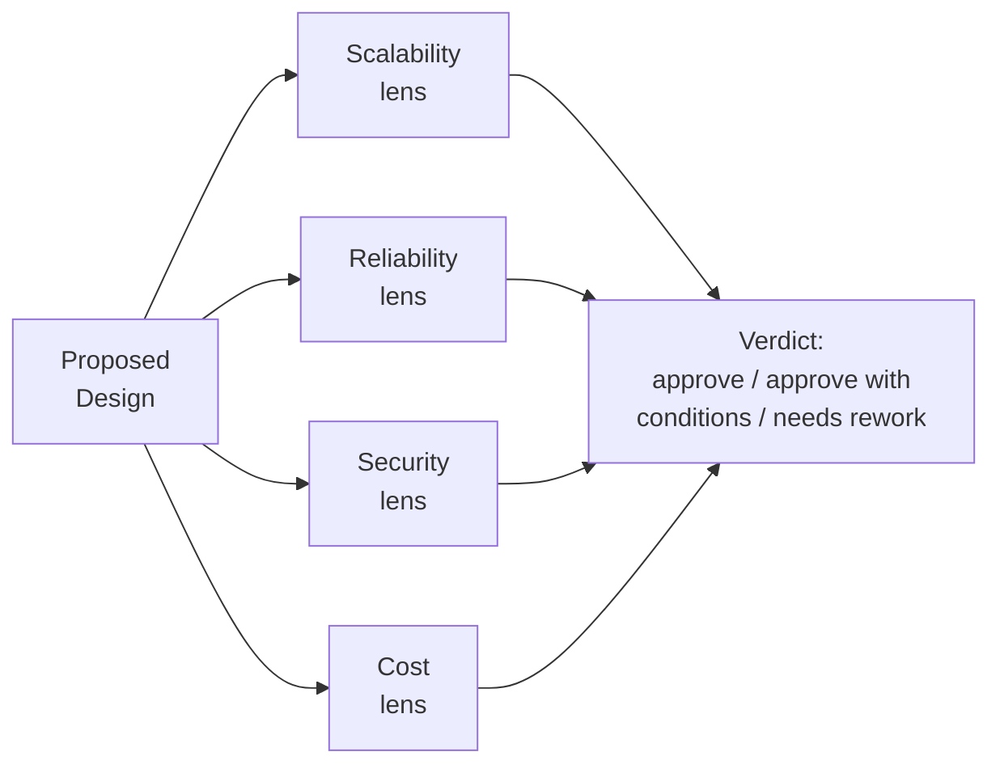

# Architecture Reviews

**Prerequisites:** [System Design Framework](framework.md), [Architecture Decision Records](adrs.md)

[← Foundations](index.md) | **Previous:** [Architecture Decision Records](adrs.md)

---

## Why This Exists

A system design *interview* is one person designing under time pressure, narrating their own thinking. A system design *review* is different in a way that catches people off guard the first time they run one: **you're evaluating someone else's design, in a room with other reviewers, and your job isn't to design it yourself — it's to find the gaps before production does.** The skills overlap but the job is different: less "here's my design," more "here's the question that reveals whether this design has actually been thought through."

The failure mode on both sides is well known. As a reviewer: rubber-stamping because pushing back feels adversarial, or the opposite — nitpicking implementation details while missing the one load-bearing risk. As a presenter: defending every choice instead of treating the review as free risk-detection before the system meets real traffic.

---

## The Four-Lens Framework

Most architecture reviews drift toward whatever the reviewer happens to know best — a database person interrogates the schema, a security person interrogates auth, and the system leaves the room with one lens applied thoroughly and three unexamined. **A structured review runs all four lenses deliberately, in order, so the discussion doesn't stall on the first interesting tangent.**

### Scalability

- What's the actual load today, and the load this needs to handle at the *next* growth milestone — not "web scale" in the abstract? (See [Requirements & Estimation](requirements-estimation.md).)
- Where's the bottleneck if load 10x's? Is it the database, a single hot partition, a synchronous chain of calls? Every design has one first bottleneck — has the presenter identified theirs, or do they believe it scales uniformly?
- Does the design assume a stateless, horizontally-scalable component, or does something (a sticky session, a single-writer node) cap the ceiling?

### Reliability

- Walk the request path: [where's the single point of failure](../reliability/single-points-of-failure.md)? Is there exactly one of anything critical?
- What's the blast radius of the most likely failure — one instance dying, one dependency going slow, one region going dark? Does a slow dependency degrade gracefully or cascade? (See [Circuit Breakers](../reliability/circuit-breakers.md).)
- What's the RTO/RPO story, if this needs one? (See [Multi-Region & DR](../distributed-systems/multi-region-dr.md).)

### Security

- What's the trust boundary — where does untrusted input first touch this system, and is it validated there? (See [Threat Modeling](../security/threat-modeling.md).)
- Who's authorized to do what, and is that enforced at the service boundary or trusted to the caller? (See [Authentication & Authorization](../security/authentication-authorization.md).)
- Does the design touch regulated or personal data, and if so, has [data privacy](../security/data-privacy-compliance.md) been considered, or only bolted on as an afterthought?

### Cost

- What's the cost driver, and does it scale linearly with usage or does it have a step function (a new instance type, a new region, a licensing tier)?
- Is there a cheaper design that meets the *actual* requirement, or is this over-engineered for a scale that may never arrive? (See the "senior answer" pattern in [Single Points of Failure](../reliability/single-points-of-failure.md) — more redundancy isn't automatically the right call.)
- Who owns the ongoing operational cost (on-call load, patching, monitoring) — not just the infrastructure bill?

!!! tip "Order matters"
    Running the lenses in this order — scalability and reliability before security and cost — surfaces structural problems (a SPOF, a bottleneck) before the discussion narrows into a specific detail (a missing auth check) that can consume the entire review time budget if raised first.

---

## Running the Review: Roles and Ground Rules

- **The presenter's job is to have already run their own review before the room does** — a design walking in with an unexamined SPOF wastes the room's time re-deriving what a five-minute self-check would have caught. Present the trade-offs made, not just the chosen path — "we considered X, rejected it because Y" is a stronger signal of rigor than a design with no visible alternatives.
- **The reviewer's job is to ask the question that changes the design, not to demonstrate expertise.** "Have you load-tested this at the target number?" is more useful than a tangent about a database internals detail nobody in the room will act on.
- **Findings need a severity, or the review produces a list nobody prioritizes.** Blocking (must fix before ship), should-fix (fix soon, doesn't block), and noted-for-later (acceptable now, revisit if X changes) — without this split, "the review found 12 issues" is indistinguishable from "the review found 1 real risk and 11 opinions."
- **A review that ends without a written verdict didn't happen** — capture the outcome (approved / approved with conditions / needs rework) and any resulting decisions as an [ADR](adrs.md), so the reasoning survives past the meeting the same way any other significant decision should.

---

## Realistic Example

A team proposes moving from a single Postgres instance to a sharded setup ahead of an expected 5x traffic increase from a new market launch. The review surfaces, in order: **(scalability)** the proposed shard key is `user_id`, but 40% of traffic is from bulk admin queries that scan across all users — those would fan out to every shard, undermining the point of sharding for that path; **(reliability)** the migration plan has no rollback story if the cutover fails mid-flight; **(security)** unchanged — the access pattern doesn't touch the trust boundary; **(cost)** the proposed shard count (16) is sized for 5 years of growth, not the 18-month horizon the launch actually needs, tripling infrastructure cost for headroom nobody asked for. Verdict: approved with conditions — resolve the admin-query fan-out (a read replica or a separate analytics path) and cut shard count to match the actual horizon, revisit at the next growth milestone. That's a stronger outcome than either rubber-stamping the original plan or a review that only caught one of the four issues because it stopped at the first interesting tangent.

---

## Interview Questions

=== "Foundation"
    **Q: What's the difference between a system design interview and an architecture review?**

    "In an interview, I'm designing the system myself, out loud, under time pressure, and being evaluated on my own reasoning. In a review, someone else has designed it — my job is to evaluate their design against a structured set of lenses (scalability, reliability, security, cost) and find gaps before production does, not to redesign it myself. The skills overlap, but a review is fundamentally about asking the right question, not producing the right answer."

=== "Senior"
    **Q: You're reviewing a design and you think it's over-engineered for the actual requirement. How do you raise that without just being the person who says no?**

    "I'd tie the pushback to a specific cost, not a vague feeling — 'this shard count is sized for 5 years of growth but the launch horizon is 18 months, and that's roughly 3x the infra spend for headroom we don't need yet' is something the room can evaluate, whereas 'this feels like too much' isn't. I'd also frame it as a question first — 'what's the growth assumption behind this shard count?' — because sometimes there's a real reason I'm missing, and starting with a question instead of a verdict keeps the review collaborative rather than adversarial. If the assumption really doesn't hold, the fix is usually 'right-size now, revisit at the next real growth milestone' rather than blocking the whole design."

=== "Staff"
    **Q: You're setting up an architecture review process for an org that's never had one. What do you actually build, and what do you deliberately avoid building?**

    "I'd build the four-lens checklist as a lightweight template, not a gate — a one-page 'here's what a presenter should have already thought through' doc, because the goal is designs arriving to review already self-examined, not a review that catches everything the presenter skipped. I'd insist on a severity split on findings (blocking vs. should-fix vs. noted) from day one, because without it the first few reviews produce unprioritized laundry lists that make teams dread the process. And I'd require a written verdict — approved / approved with conditions / needs rework — captured as an ADR when it results in a real decision, so the review's value doesn't evaporate the moment the meeting ends.

    What I'd avoid: making it a mandatory gate for every change, which turns it into a bottleneck teams route around, and letting reviewer expertise silently set the agenda — if the strongest voice in the room is a database expert, the review will interrogate the schema and wave through the security lens, which is exactly the failure mode a structured framework exists to prevent. I'd also resist over-formalizing early — a heavyweight process introduced before anyone's seen the lightweight version work gets resented before it's proven useful."

---

## Key Takeaways

!!! success "Remember"
    1. **A review evaluates someone else's design against structure — it isn't a second designer's opinion.** The job is finding gaps, not redesigning.
    2. **Run all four lenses (scalability, reliability, security, cost) deliberately** — an unstructured review drifts to whatever the loudest reviewer knows best and leaves the other three unexamined.
    3. **Findings need a severity (blocking / should-fix / noted) or the output is an unprioritized list nobody acts on.**
    4. **The presenter's job is to arrive with their own review already done** — visible trade-offs and rejected alternatives are a stronger signal than a design with no acknowledged weaknesses.
    5. **A review without a written verdict didn't happen** — capture the outcome, and turn resulting decisions into an [ADR](adrs.md).

**Previous:** [Architecture Decision Records](adrs.md) | **Back to:** [Foundations](index.md)
