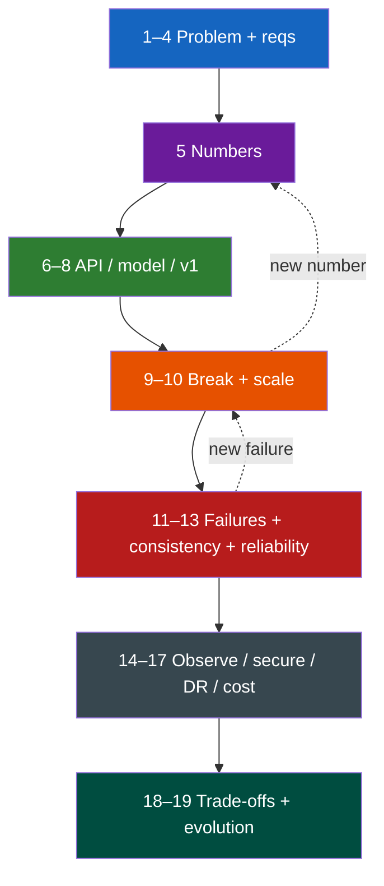

# System Design Framework

**Prerequisites:** [Requirements & Estimation](requirements-estimation.md), HTTP APIs

[← Stateless vs Stateful](stateless-vs-stateful.md) | [Next: Engineering Mathematics →](math.md)

---

## Why This Exists

Interviewer: *"Design a notification system."*

Most candidates draw boxes — API, Kafka, workers, FCM, Postgres — then freeze when asked *"10% of devices are offline for 3 days. What happens?"* The boxes never encoded retries, fan-out, or cost.

```
API + DB + "send loop"          → works for a demo
50M DAU Super Bowl spike?       → one table, one pool, one process
celebrity post → 10M fans?      → write amplification
device offline 3 days?          → retry storm + SMS bill
APNs slow?                      → thread pool death, p99 = 30s
```

Interviews test **how constraints change the design**, not whether you remember a reference architecture. This page is the 19-step method that forces that reasoning.

!!! tip "Mental Model"
    A design interview is a vice. Each step tightens one constraint. Start with the smallest system that works. If a later step does not change the drawing, you skipped the pressure.

    `understand → measure → draw the dumb thing → break it → add only the piece that fixes the break`

---

## Naive System → What Breaks

**Problem:** "Send a push when someone likes your photo."

Naive: `POST /notify` writes a row, a cron `SELECT * FROM pending` and calls FCM.

| Pressure | What breaks |
|----------|-------------|
| 1B notifies/day | Cron + table scan; lock contention; 11k avg QPS writes |
| Peak 10× | Connection pool (50) saturates; p99 explodes while CPU is 40% |
| Celebrity fan-out | 10M inserts in one request; API timeout |
| Offline devices | Infinite retry; APNs rate-limit; SMS fallback burns cash |
| Worker crash | Duplicate push (or silent drop) — no idempotency key |
| Region loss | Entire send path gone — no DR story |

The rest of this page is how each of the 19 steps *changes* that drawing.

---

## The Concept

Nineteen steps, always in this order. Skip one and you will be surprised in production — or in the follow-up question.

| # | Step | Question it answers |
|---|------|---------------------|
| 1 | Understand the problem | What job does the user hire this system to do? |
| 2 | Clarifying questions | What is *out* of scope today? |
| 3 | Functional requirements | What must be true for the product to exist? |
| 4 | Non-functional requirements | How wrong can we be, how often, how slow? |
| 5 | Scale estimation | How big is "big"? QPS, bytes, connections |
| 6 | APIs | What is the contract? Idempotency? |
| 7 | Data model | What is the source of truth? Access pattern? |
| 8 | Simplest architecture | What is the smallest thing that works? |
| 9 | Bottlenecks | Where does v1 die first? |
| 10 | Scale each bottleneck | Add *one* lever per bottleneck |
| 11 | Failure analysis | Process, disk, AZ, dependency, poison message |
| 12 | Consistency | What may be stale? For how long? |
| 13 | Reliability | Timeouts, retries, circuit breakers, bulkheads |
| 14 | Observability | SLIs, traces, the first dashboard |
| 15 | Security | Authn/z, PII, abuse |
| 16 | Disaster recovery | RPO/RTO, region story |
| 17 | Cost | $ per million sends; the surprise bill |
| 18 | Trade-offs | What you explicitly will not do |
| 19 | Migration / evolution | How v1 becomes v2 without a flag day |

---

## Architecture



---

## Mechanics — Walkthrough: Notification System

Concrete product: Instagram-like *likes, comments, DMs* → push + in-app + optional SMS.

### Steps 1–4 — Problem, questions, FRs, NFRs

**Understand:** A user wants to know something happened. They do *not* hire you to "run Kafka."

**Ask (or die):** channels (iOS/Android/web/email/SMS)? delivery SLA (chat vs like)? user preferences? mute/rate-limit? read receipts? marketing vs transactional (compliance + unsubscribe)?

**Functional (in):** enqueue from product events; honor prefs; at-least-once push; in-app inbox; unsubscribe.

**Functional (out for v1):** rich marketing campaigns, SMS two-way, read receipts.

**NFRs you write down before drawing:**

| NFR | Target | Why it changes the design |
|-----|--------|---------------------------|
| Latency | chat push p99 < 2s; like p99 < 30s | Two queues, not one |
| Availability | 99.9% enqueue; send is best-effort | Enqueue CP, send AP |
| Durability | no silent drop of transactional | WAL / Kafka, not Redis-only |
| Fan-out | 10M followers in < 60s | Precomputed follower graph, not N inserts in request |

### Step 5 — Scale (the numbers that kill v1)

```
50M DAU × 20 notifies/user/day = 1.0B/day
1.0B / 86,400 ≈ 11,600 avg QPS
peak 10× evening = 116k enqueue QPS
payload ~500 B → peak ingest 116k × 500 ≈ 58 MB/s
inbox retain 30 days → 1B × 30 × 500 B ≈ 15 TB logical
RF=3 → ~45 TB stored
```

If you cannot say these out loud, you cannot justify Kafka vs a table.

### Steps 6–8 — API, model, simplest architecture

```
POST /v1/events            {event_id, type, actor, object, occurred_at}
                           Idempotent on event_id
GET  /v1/inbox?cursor=     user-scoped, paginated
PUT  /v1/prefs             channel × type matrix
POST /v1/devices           token, platform, user_id
```

**v1 data:** `events(event_id PK)`, `inbox(user_id, ts, event_id)`, `prefs`, `devices`, `delivery_attempts(event_id, device, status)`.

**v1 drawing (do this first):** one write API, Postgres, one worker pool calling FCM/APNs. No Kafka. It is legal. It teaches you what to break next.

### Steps 9–10 — Bottlenecks, then scale each

| Bottleneck | Symptom | Lever you add |
|------------|---------|---------------|
| Inbox writes | celebrity 10M-row txn | Fan-out-on-write for normal; fan-out-on-read for celebrities |
| Worker pool | APNs 800ms p99, threads stuck | Separate pools per channel (bulkhead) |
| Postgres WAL | 116k inserts/s | Kafka as ingest; workers batch-write inbox |
| Hot user inbox | one partition / one row range | shard inbox by `user_id` |
| Token lookup | 116k reads/s | cache devices by user; 15 min TTL |

*Only add a box that kills a named bottleneck.* "Add Redis because interviews have Redis" is how you fail staff rounds.

### Steps 11–13 — Failure, consistency, reliability

- Worker dies mid-send → at-least-once + `event_id+device` unique. Duplicate push is OK; double-SMS is not (provider idempotency key).
- APNs 503 for 12 min → [circuit breaker](../reliability/circuit-breakers.md) on that channel; do not retry the world.
- Inbox replica lag 4s → chat badge may be stale; user who just sent a DM must read-your-write (session sticky to primary).
- Poison payload → DLQ after 5 attempts; never block the partition.

### Steps 14–17 — Observe, secure, DR, cost

**Observe:** enqueue QPS, send QPS, **queue depth**, **consumer lag**, APNs p50/p95/p99, error rate by channel, retry amplification, pool utilization, GC pause, lock wait.

**Secure:** device tokens are credentials; prefs are PII; SMS is an abuse surface (rate-limit per user + per dest).

**DR:** RPO 0 for enqueue (multi-AZ Kafka); RTO 15 min for send path; inbox is rebuildable from events (event log is the source of truth).

**Cost:** APNs/FCM ≈ $0; SMS $0.0075; 1% fallback of 1B = 10M SMS = **$75k/day**. This single number kills "SMS fallback for everything."

### Steps 18–19 — Trade-offs and evolution

Ship v1: Postgres + workers, likes only, no SMS. v2: Kafka + fan-out service when enqueue p99 > 200ms. v3: celebrity path when one event exceeds 100k inbox writes. Dual-write inbox schema; backfill; flip read; delete old path. No flag day.

---

## Realistic Example With Numbers

A like event for a user with 400 followers:

```
enqueue 1 event              1 write, 0.4 ms
expand followers             400 ids from graph cache (hit 99%)
inbox batch insert           400 rows × 200 B = 80 KB
push fan-out                 400 device lookups, 2 batches to FCM
end-to-end p50               180 ms
```

Same event, 12M followers (celebrity):

```
naive fan-out-on-write       12M inbox rows = 2.4 GB, 40s of inserts
correct path                 write 1 "pointer" to celebrity timeline
                             readers merge at GET /inbox
                             push via sharded notify topics (100 partitions)
                             12M / 100 = 120k/partition, 20 workers → ~60s
```

The methodology is what made you split the path *before* the incident.

---

## Interactive Explainer

Step through the 19 steps. Watch the notification design *change* — boxes appear only when a prior step creates pressure.

<div class="sim-container">
  <div class="sim-title">19-Step Design Walkthrough — Notifications</div>
  <div class="sim-controls">
    <button class="sim-btn" onclick="window._fw && window._fw.prev()">◀ Prev</button>
    <button class="sim-btn success" onclick="window._fw && window._fw.next()">Next step ▶</button>
    <button class="sim-btn" onclick="window._fw && window._fw.reset()">Reset</button>
  </div>
  <div class="sim-stats">
    <div class="sim-stat"><div class="sim-stat-label">Step</div><div class="sim-stat-value" id="fw-step">1/19</div></div>
    <div class="sim-stat"><div class="sim-stat-label">Surface</div><div class="sim-stat-value" id="fw-surface">problem</div></div>
    <div class="sim-stat"><div class="sim-stat-label">Boxes in design</div><div class="sim-stat-value" id="fw-boxes">1</div></div>
  </div>
  <div id="fw-body" style="background:#111122;border:1px solid #333355;border-radius:8px;padding:1rem;min-height:140px;font-size:0.85rem;line-height:1.5;"></div>
  <div class="sim-log" id="fw-log"></div>
</div>

---

## Failure Modes

| Failure | If you skipped the step | What you should have designed |
|---------|-------------------------|-------------------------------|
| Silent drop on worker crash | Step 11 | Outbox / Kafka + idempotent send |
| $200k SMS weekend | Step 17 | Channel policy + budget circuit |
| Super Bowl enqueue 5xx | Step 5 + 10 | Kafka buffer, autoscale workers |
| Duplicate password-reset SMS | Step 6 + 13 | Idempotency key to provider |
| "It's slow" with no owner | Step 14 | SLI per channel, trace IDs on events |

!!! warning "Production Trap"
    Drawing Kafka in minute two hides the actual question: *what is the source of truth, and what is allowed to be lost?* Candidates who start at step 8 get destroyed at step 11.

---

## Production Debugging

When "notifications are late" pages you, do not start in the FCM console.

```
1. CPU          worker CPU 90%? or 15% and stuck on I/O?
2. Memory / GC  old-gen climb + 800ms pauses → send p99 = pause + RTT
3. Disk         Kafka disk > 80% → produce latency, ISR shrinks
4. Network      APNs packet loss; DNS to provider
5. Queue depth  notify.priority vs notify.bulk — which is backing up?
6. Lag          consumer lag on push-workers group (msgs and seconds)
7. Pools        FCM HTTP/2 pool, DB pool, thread pool — saturation ≠ CPU
8. Latency      p50 fine, p99 12s → tail (HOL, slow 1% dep), not "the app"
9. Error rate   429 from APNs vs 5xx from us — different levers
10. Timeouts    client 3s, worker 10s, FCM 30s → retry amplification
11. Retries     downstream RPS / inbound RPS > 1.5 → storm
12. Locks       inbox hot-row updates for unread_count
```

---

## Scaling Limits

- One inbox table dies around tens of k writes/s — shard by `user_id` before 50k.
- One Kafka partition is one consumer — celebrity push needs many partitions.
- APNs/FCM have their own quotas; your 116k QPS is not their 116k QPS.
- Fan-out-on-write storage grows as `events × avg_followers` — celebrities make this super-linear.
- Multi-region send is easy; multi-region *prefs + unread* is a consistency product.

---

## Trade-offs

| Dimension | Push-now (sync) | Queue + workers | Log + rebuildable inbox |
|-----------|-----------------|-----------------|-------------------------|
| Latency | Best p50 | +10–100ms | +merge on read |
| Throughput | Pool-bound | Partition-bound | Replay-bound |
| Availability | Coupled to FCM | Enqueue survives FCM | Enqueue + rebuild |
| Consistency | Immediate badge | Seconds of lag | Merge rules |
| Durability | Process memory | Disk / Kafka | Event log is SoT |
| Complexity | Low | Medium | High |
| Cost | Wasted retries | Infra + idle workers | Storage + compute |
| Ops | None until page | Lag / rebalance | Schema + backfill |

---

## Interview Questions

=== "Foundation"
    **Q: Walk me through designing a notification system.**

    "I'd start with the job: a user learns that something happened. I'd ask channels, SLA by type, prefs, and whether marketing is in scope. Functional: enqueue, honor prefs, at-least-once push, inbox. NFRs: chat p99 2s, likes 30s, 99.9% enqueue. Then numbers — 50M DAU × 20/day ≈ 12k QPS avg, ~100k peak — which already says a single `pending` table will not hold. I'd draw the smallest system (API + DB + workers), name the first bottleneck (writes + third-party RTT), then add a queue and split pools by channel. I would not start with Kafka unless the numbers demand a buffer."

=== "Senior"
    **Q: A celebrity posts. How does that change the design you just drew?**

    "Fan-out-on-write becomes a thundering write: 10M inbox rows in one event. I'd classify users: normal fan-out-on-write, celebrity fan-out-on-read — store one pointer, merge on inbox read. Push still has to happen, so I shard the notify topic by `user_id` and accept a 30–60s send SLA for that class, not the chat SLA. I'd also isolate celebrity traffic onto its own consumer group so it cannot HOL-block DMs."

=== "Staff"
    **Q: We already have this in production. SMS fallback last weekend cost $180k. What do you change — architecture, policy, or org?**

    "All three, in that order of blast radius. Architecture: a budget circuit breaker on the SMS provider (open when spend/hour exceeds N, or when push success rate is already > X). Policy: SMS only for transactional classes (OTP, security), never for likes. Org: the on-call runbook must include `sms_spend_usd` next to lag — this was a FinOps incident misfiled as reliability. I'd also add a dark launch: fallback sampled at 1% for a week so we see the bill before the Super Bowl. Migration: dual-write a `channel_decision` record so we can audit why SMS fired."

---

## Reasoning Exercises

1. Re-run steps 5, 9, 10, 17 for **chat** (WhatsApp-style, p99 400ms) instead of likes. Which boxes disappear? Which become mandatory?
2. You are at step 8 with 10 engineers and 6 weeks. Which three steps do you still refuse to skip, and why?
3. Marketing wants the same pipeline. Walk steps 15 and 17. What new entities appear (consent, frequency cap, suppression list)?
4. Inbox is in Postgres. Step 19: migrate to a wide-column store. Write the dual-write / backfill / flip order and the consistency hole you will accept.

---

## Key Takeaways

!!! success "Remember"
    1. Interviews grade how constraints *change* the drawing, not the first drawing.
    2. Numbers (step 5) and failures (step 11) create boxes; fashion does not.
    3. Add one lever per named bottleneck — Kafka is a buffer, not a personality.
    4. Cost and SMS/provider quotas are reliability; treat them as SLIs.
    5. v1 must be able to evolve (step 19) or you designed a demo.

**Previous:** [Stateless vs Stateful](stateless-vs-stateful.md) | **Next:** [Engineering Mathematics](math.md)

!!! info "Staff Engineer Lens"
    The 19 steps are an architecture review checklist, not an interview trick. In a design doc, steps 5, 11, 17, and 19 are the ones execs and on-call actually read. If you cannot name the first bottleneck, the first unrecoverable failure, the $ / million, and the migration off this design, you are not done — you have a diagram.

!!! note "Interview Insight 🎯"
    If you stall, say the step out loud: *"I am at scale estimation — 12k QPS avg, 100k peak, so a single primary is the first death."* Interviewers hire the narration. Silence after a pretty diagram is a no-hire; a boring v1 with a kill list is a senior signal.
