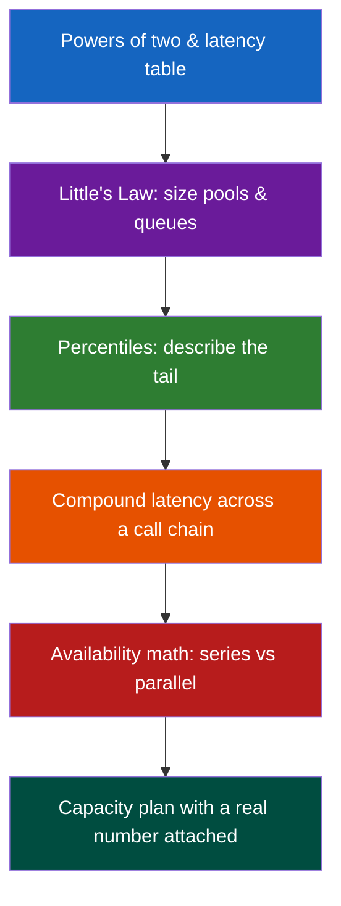

# Engineering Mathematics for System Design

**Prerequisites:** [Requirements & Estimation](requirements-estimation.md), [System Design Framework](framework.md)

[← System Design Framework](framework.md) | [Foundations →](index.md)

---

## Why This Exists

"We'll add a cache, it'll be fine." Fine by what number?

```
p50 latency looks great           → 40ms
ship it                           → users complain "it's slow"
p99 is 4,200ms                    → 1% of 2M req/day = 20,000 miserable users/day
five services in the call chain   → each p99 1% of requests, compounds to ~5% overall
"two nines is basically one nine" → no: 99% × 99% in series ≈ 98%, not 99%
```

Every one of those mistakes is a five-minute mental-math problem an interviewer expects you to do out loud. Staff engineers are the ones in the room who can say "that's wrong, and here's the number that's right" before the meeting ends.

!!! tip "Mental Model"
    Four tools, reused everywhere: **powers of two** (size things), **Little's Law** (relate concurrency, rate, and time), **percentiles** (describe reality, not the fantasy of "typical"), **availability math** (multiply probabilities correctly across dependency graphs).

    `size it → relate rate to concurrency → describe the tail → multiply the failure modes`

---

## Naive System → What Breaks

You estimate a thread pool "big enough" and a dependency chain "should be fast enough."

| Naive assumption | What actually happens |
|---|---|
| "Average latency is 50ms, we're fine" | p99 is 2,000ms; 1 in 100 users has a terrible time, every time |
| "Pool of 50 threads should cover 1,000 req/s" | Little's Law says you need 1,000 × 0.3s = 300 in flight — pool exhausts, queue explodes |
| "Each dependency is 99.9% available, we have 5, so we're ~99.9%" | Availability multiplies: 0.999^5 ≈ 99.5% — 5× more downtime than any one dependency |
| "We added a replica for redundancy" | Redundancy in *parallel* raises availability; redundancy described but wired in *series* lowers it — the topology is the whole answer |
| "Round trip to the DB is basically free, it's in the same building" | Same-datacenter RTT is ~0.5ms; cross-region is 50-150ms — 100-300× — and that's before disk seeks |

The rest of this page is the arithmetic that catches each of these before they ship.

---

## The Concept

Four load-bearing tools:

1. **Powers of two & latency numbers** — know the constants before you multiply them.
2. **Little's Law** (`L = λW`) — the only formula relating concurrency, arrival rate, and time-in-system.
3. **Percentiles over averages** — a mean describes no real request; a percentile describes the one your on-call gets paged for.
4. **Availability math** — series multiplies failure probability up; redundant parallel multiplies it down.

---

## Architecture



---

## Mechanics

### Powers of two you should have memorized

```
2^10 ≈ 10^3  = 1 thousand   (KB)
2^20 ≈ 10^6  = 1 million    (MB)
2^30 ≈ 10^9  = 1 billion    (GB)
2^40 ≈ 10^12 = 1 trillion   (TB)
```

Rule of thumb: `2^N ≈ 10^(N×0.3)`. This is how you convert "2^32 unique IDs" into "about 4 billion" without a calculator.

### Latency numbers every engineer should know

The numbers below are the ones interviewers expect memorized to an order of magnitude — exact nanosecond counts drift by hardware generation, the *ratios* between rows do not.

| Operation | Latency | Relative to L1 |
|---|---|---|
| L1 cache reference | ~1 ns | 1× |
| L2 cache reference | ~4 ns | 4× |
| Branch mispredict | ~5 ns | 5× |
| Mutex lock/unlock | ~25 ns | 25× |
| Main memory (RAM) reference | ~100 ns | 100× |
| Compress 1 KB with Zippy | ~3 µs | 3,000× |
| Send 1 KB over 1 Gbps network | ~10 µs | 10,000× |
| Read 1 MB sequentially from RAM | ~10 µs | 10,000× |
| SSD random read | ~100 µs–150 µs | ~100,000× |
| Read 1 MB sequentially from SSD | ~1 ms | ~1,000,000× |
| Round trip within same datacenter | ~0.5 ms | ~500,000× |
| Disk seek (spinning) | ~10 ms | ~10,000,000× |
| Read 1 MB sequentially from disk | ~20 ms | ~20,000,000× |
| Round trip cross-region (e.g. US↔EU) | ~50–150 ms | ~100,000,000× |

!!! note "Interview Insight 🎯"
    The single most useful fact on this table: **SSD random read (~100 µs) is roughly 1,000× slower than RAM, and a same-datacenter round trip (~0.5 ms) is roughly 5× slower than that.** That ordering — RAM < SSD < same-DC network < disk seek < cross-region — is what tells you whether to add a cache, a replica, or a CDN.

### Little's Law: L = λW

**L** = average number of items in a system (in-flight requests, queue depth, connections)
**λ** (lambda) = average arrival rate (requests/second)
**W** = average time an item spends in the system (latency, including queueing)

It holds for *any* stable queueing system — no assumptions about arrival distribution needed. That's what makes it a universal sizing tool.

**Worked example — sizing a thread pool:**

```
Service receives 1,000 req/s (λ = 1,000/s)
Each request takes 300ms end-to-end, including DB call (W = 0.3s)

L = λ × W = 1,000 × 0.3 = 300

You need ~300 concurrent in-flight requests handled at any instant.
A pool of 50 threads is undersized by 6×.
Requests queue, queueing adds to W, which raises L further — a death spiral.
```

**Worked example — sizing a DB connection pool:**

```
API does 200 req/s (λ = 200/s)
Each request holds a DB connection for 40ms (W = 0.04s)

L = 200 × 0.04 = 8 connections needed on average

Provision for the *peak*, not the average — say peak is 3× (600 req/s):
L_peak = 600 × 0.04 = 24 connections

A pool of 20 will saturate at peak; pool of 30 gives headroom.
```

Little's Law also explains *why* p99 latency spikes cause pool exhaustion: if W jumps from 40ms to 400ms during a GC pause while λ stays the same, L jumps 10× — the pool that was fine a second ago is now 10× undersized.

### Probability for capacity planning: percentiles vs averages

The mean is dragged around by outliers in one direction and hides them in the other. A service with p50 = 40ms and p99 = 4,000ms has a *mean* around 80ms — which tells a reader nothing about the 1-in-100 request that took 100× longer.

Why p99 (or p999) matters more than the mean:

- **Users don't experience the mean.** Each user experiences one request. If 1% are terrible, that's not "acceptable noise" — it's 1% of your *daily active users* having a terrible time, every day.
- **Tail latency compounds across a call chain.** If a page makes 20 backend calls and each has a 1% chance of hitting its own p99, the chance that *at least one* call is slow is much higher than 1%.

**Worked example — compounding across a call chain:**

```
A request fans out to 20 independent backend calls, each with a 1% chance
of being "slow" (hitting its own p99 or worse).

P(no call is slow) = (1 - 0.01)^20 = 0.99^20 ≈ 0.818

P(at least one call is slow) = 1 - 0.818 ≈ 18.2%

So a page that looks "1% slow per dependency" is actually slow for
nearly 1 in 5 users, because the user waits on the SLOWEST of the 20 calls.
```

This is why staff engineers push back on "just add another microservice call" — every additional independent dependency in a fan-out multiplies the chance that *someone* on the critical path is having a bad day. It's also why **p99 of p99s is not p99** — the aggregate tail is always worse than any single component's tail.

### Availability math: how "nines" combine

**Series (dependent, all required):** if A depends on B depends on C, and each must succeed, multiply availabilities.

```
A_total = A_1 × A_2 × ... × A_n
```

```
Two services in series, each 99.9% available:
A = 0.999 × 0.999 = 0.998001 ≈ 99.80%

That's worse than either service alone (99.9%) — you've gone from
~43 min/month downtime to ~86 min/month by chaining a second dependency.

Five services in series, each 99.9%:
A = 0.999^5 ≈ 99.501%  → ~3.6 hours/month downtime

Five services in series, each "three nines and a bit better" (99.99%):
A = 0.9999^5 ≈ 99.95%  → ~22 min/month
```

**Redundant parallel (either one suffices):** availability of the *combined unit* is much higher than any single instance, because both must fail simultaneously.

```
A_parallel = 1 - (1 - A)^n
```

```
Two redundant instances, each 99.9% available, either one can serve traffic:
A = 1 - (1 - 0.999)^2 = 1 - (0.001)^2 = 1 - 0.000001 = 99.9999%

That's "six nines" from two "three nines" boxes — assuming failures
are INDEPENDENT. Correlated failures (same AZ, same deploy, same bad config)
break this assumption completely — redundancy across the same failure
domain buys you almost nothing.
```

| Nines | Availability | Downtime/year | Downtime/month |
|---|---|---|---|
| 90% (one nine) | 90% | 36.5 days | 3 days |
| 99% (two nines) | 99% | 3.65 days | 7.3 hours |
| 99.9% (three nines) | 99.9% | 8.76 hours | 43.8 min |
| 99.99% (four nines) | 99.99% | 52.6 min | 4.4 min |
| 99.999% (five nines) | 99.999% | 5.26 min | 26 sec |

!!! warning "Production Trap"
    "We built in redundancy" means nothing without knowing the topology. Two databases behind a load balancer where *either* can serve reads is parallel — availability goes up. Two services chained A → B where a request needs both is series — availability goes DOWN with every service you add, even if each one individually looks great on a dashboard. Staff reviews should ask "is this AND or OR?" before believing an availability number.

---

## Realistic Example With Numbers

Checkout flow: API gateway → auth service → inventory service → payment service → order-write DB. All in series, all required for a successful checkout.

```
Each service individually: 99.95% available (SLA on the dashboard, looks great)

Series availability:
0.9995^5 ≈ 0.9975 = 99.75%

Downtime budget spent: 8.76h/year × 5 ≈ ~22 hours/year of checkout failures,
even though every single dashboard says "99.95%, green."
```

Fix: make payment service redundant (2 independent instances, active-active) and cut the chain length by merging auth+inventory into one hop with a shared cache.

```
Payment redundancy: 1 - (1 - 0.9995)^2 = 1 - 0.00000025 ≈ 99.99999975%
  → payment's contribution to series failure becomes negligible

New chain: gateway → combined-auth-inventory → payment(redundant) → DB
4 hops effectively, one hop's failure probability now ~0

0.9995^3 × (~1.0) ≈ 99.85%  → downtime ≈ ~13 hours/year

Still not great — but concretely better, and you can defend the number.
```

Now size the connection pool for the order-write DB using Little's Law: peak checkout rate 500 req/s, each write held for 25ms.

```
L = λW = 500 × 0.025 = 12.5 connections at peak → provision 20-25 for headroom.
```

---

## Failure Modes

| Failure | Root cause | Fix |
|---|---|---|
| Pool exhaustion under load | Sized pool from λ, ignored W under stress (GC, slow query) | Recompute `L = λW` using p99 W, not average W |
| "It's 99.9% available" surprises everyone with outages | Multiplied nines wrong, or ignored series topology | Draw the dependency graph; classify each edge as AND (series) or OR (parallel) |
| Cache sized from average object size | Skewed distribution — a few huge objects blow the memory budget | Size from p99 object size, not mean |
| "Redundant" pair still went down together | Both replicas in same AZ / same deploy — correlated failure | Redundancy requires an independent failure domain, not just a second copy |
| Dashboard shows p50 green, users angry | Averaging hides the tail | Track and alert on p95/p99/p999, not just mean |

---

## Interview Questions

=== "Basic"
    **Q: What's the difference between mean latency and p99 latency, and why do we care about p99?**

    "Mean is the average across all requests — a few very slow outliers get averaged away by many fast ones. p99 is the latency below which 99% of requests fall — it tells you what the slowest 1% of your users actually experience. We care about p99 because every user experiences exactly one request at a time; if 1% of requests are terrible, that's 1% of your daily users having a bad day, every day, and averages hide that completely."

=== "Senior"
    **Q: You have a service handling 2,000 req/s where each request takes 150ms on average. How many concurrent connections/threads do you need to provision?**

    "Little's Law: L = λW = 2,000 × 0.15 = 300 concurrent requests in flight on average. But I'd provision for the tail, not the average — if p99 latency is, say, 800ms during a GC pause or a slow downstream call, L spikes to 2,000 × 0.8 = 1,600 momentarily. I'd size the pool with headroom above the average case and put backpressure (bounded queue + fast failure) in front of it so a latency spike degrades gracefully instead of exhausting the pool and cascading."

=== "Staff"
    **Q: Your service has five downstream dependencies, each individually reporting 99.95% availability on their dashboards. Leadership wants to advertise 99.95% for your service. What do you tell them?**

    "First question: are those five dependencies all required for every request (series), or is there redundancy (parallel)? If it's series — checkout needs auth AND inventory AND payment AND the DB — multiplying five 99.95%s gives roughly 99.75%, not 99.95%. That's the difference between ~4.4 hours and ~22 hours of downtime a year, and it's the number I'd put in the SLA, not the per-dependency number. Second, I'd push to break the chain: which of those five calls can be made optional, cached, or async so a failure degrades the feature instead of failing the whole request? Third, if any dependency truly must be in the critical path, I'd ask whether it can be made redundant in an independent failure domain — that's the only lever that multiplies availability up instead of down. I would not let the org advertise a number that's mathematically wrong just because each component's dashboard looks good in isolation."

---

## Reasoning Exercises

1. A request fan-out hits 8 backend services in parallel and waits for all 8 to respond before rendering. Each has a 2% chance of being slow. What's the probability the page is slow? What single architectural change reduces this the most?
2. You're told "we added a hot standby, so we're now five nines." The standby is in the same rack, same power circuit, same top-of-rack switch as the primary. Is the parallel-availability formula still valid? Why or why not?
3. A payments API does 800 req/s at p50 = 20ms but p99 = 900ms (a downstream card-network call occasionally stalls). Using Little's Law, compute L at p50 vs p99, and explain what happens to your connection pool during a 30-second stall.
4. Given the latency table, estimate end-to-end latency for: cache miss → SSD read → build response (10 µs compute) → cross-region replica read for a secondary field → serialize (5 µs). Which single number dominates, and what would you do about it?

---

## Key Takeaways

!!! success "Remember"
    1. Memorize the latency ladder — RAM ≪ SSD ≪ same-DC network ≪ disk seek ≪ cross-region — the ratios are what matter in an interview.
    2. `L = λW` sizes any pool or queue; recompute with p99 latency, not average, to size for reality.
    3. p99 (not mean) is what a real user experiences; tail probabilities compound across a call chain — `1 - (1-p)^n` gets ugly fast.
    4. Series dependencies multiply availability *down*; independent redundant parallel paths multiply unavailability *down*, which multiplies availability *up*. Know which topology you're looking at.
    5. Redundancy only helps if the failure domains are actually independent — same AZ/rack/deploy is not redundancy, it's a shared blast radius.

**Previous:** [System Design Framework](framework.md) | **Next:** [Foundations](index.md)

!!! info "Staff Engineer Lens"
    This is the math that turns a design review from vibes into a defensible decision. When someone says "should be fine," the staff move is to write the formula on the whiteboard — `L = λW`, `0.999^n`, `1 - (1-p)^n` — and plug in the real numbers from *this* system. Most bad availability and capacity decisions survive exactly until someone does the five minutes of arithmetic in this page.

    !!! note "Interview Insight 🎯"
        Say the formula before the number: *"By Little's Law, L equals lambda times W, so at peak that's..."* Interviewers are grading whether you reach for the right tool, not whether you have a calculator memorized. Getting the arithmetic slightly wrong out loud beats getting a suspiciously round number with no derivation.
