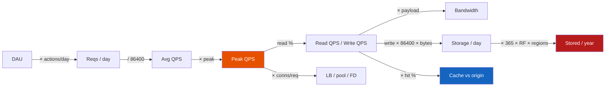

# Requirements & Capacity Estimation

**Prerequisites:** HTTP basics, [System Design Framework](framework.md) (pair this with steps 3–5)

[← Foundations](index.md) | [Next: Stateless vs Stateful →](stateless-vs-stateful.md)

---

## Why This Exists

"Design WhatsApp." Two candidates draw the same boxes. Only one can say:

```
2B users, 50% DAU → 1B DAU
40 msgs/user/day  → 40B msgs/day
40B / 86,400      → ~460k avg msg/s
peak 5–10×        → 2–5M msg/s
100 B text        → 40 TB/day raw
RF=3 + media      → this is a storage company that also chats
```

Without those numbers you cannot choose Postgres vs a log, one region vs three, or a 4-core box vs a fleet. Estimation is not accounting — it is *which physics applies*.

!!! tip "Mental Model"
    Capacity is a funnel. DAU × actions/day becomes QPS. QPS × bytes becomes bandwidth and disk. Disk × RF × regions becomes the invoice. Cache hit rate is the only free lunch, and it is never free at miss.

    `DAU → daily reqs → avg QPS → peak QPS → R/W split → bytes → disk/net → connections`

---

## Naive System → What Breaks

You hear "10 million users" and size a single 16-core API + one Postgres primary.

| Missed factor | What actually happens |
|---------------|------------------------|
| 10M **DAU**, not registered | If registered is 80M, you undersized 8× |
| 20 req/user/day | 200M req/day ≈ 2,300 avg QPS — fine |
| Peak 8–20× (lunch, launch) | 20k–45k QPS — the primary's pool of 100 is gone |
| 90% reads | You needed replicas / cache, not a bigger primary |
| 2 KB payload | Peak 20k × 2 KB = 40 MB/s — trivial. 1 MB photos? 20 GB/s |
| RF=3, 3 regions | Storage × 9. "30 GB" became 270 GB plus snapshots |

The naive system dies at **connections and tails**, not at "we ran out of CPU."

---

## The Concept

**Functional requirements** are *what* the product does. **Non-functional requirements (NFRs)** are *how wrong / how slow / how often* that is allowed.

WhatsApp-shaped example:

| Kind | Requirement | Design consequence |
|------|-------------|--------------------|
| Functional | 1:1 and group text, online ticks, media | Chat store + presence + blob store |
| Functional | Message delivered while receiver offline | Durable queue, not RAM |
| NFR | p99 send-ack < 400ms on-net | Co-located region, no cross-DC sync write |
| NFR | No silent loss (durability) | fsync / quorum before ACK |
| NFR | 99.99% message API | Multi-AZ, not multi-region sync |
| NFR | Last 30 days on device + cloud | Hot tier vs cold object store |

If you list "highly available and fast" you have not written NFRs. Write **numbers**.

!!! note "Interview Insight 🎯"
    Interviewers listen for the sentence: *"That's a functional requirement — it adds an entity. This other one is an NFR — it adds a replica, a cache, or a queue."* Mixing them is how designs grow random boxes.

---

## Architecture



---

## Mechanics

**Seconds in a day = 86,400.** Memorize 10^5 ≈ day. `N / 10^5` is avg QPS within 15%.

```
10M DAU × 20 req/user/day = 200M req/day
200M / 86,400             ≈ 2,315 avg QPS
peak multiplier 8–10×     ≈ 18–23k peak QPS
read 90%                  ≈ 21k read / 2.3k write at peak
payload 2 KB              ≈ 23k × 2 KB ≈ 46 MB/s peak
```

**Reads vs writes.** Writes hit the source of truth and the WAL. Reads hit cache, then replicas. A 90/10 split is a cache problem. A 10/90 split (ingest, telemetry) is a log problem.

**Payload.** Control plane (JSON 1–2 KB) and data plane (photos, video chunks) must be estimated separately. One 1 MB avatar upload at 1% of users/day swamps the 2 KB chat ACKs.

**Bandwidth both ways.** Response often larger than request (feeds). Count `QPS × (in + out)`.

**Storage.**

```
writes/day × avg_bytes × 365 × RF × regions × (1 + index overhead ~0.3)
```

Do not forget indexes, WAL, snapshots, and "deleted" rows you still keep for 30 days.

**Replication.** RF=3 is three copies **plus** repair traffic. Cross-region RF is a latency and conflict decision, not just a multiplier.

**Cache.** Origin QPS ≈ `read_QPS × (1 − hit_rate)`. 80% hit on 21k read QPS → 4.2k origin. 50% hit → 10.5k. The DB you buy is the *miss* fleet.

**Connections.**

```
peak QPS × latency_s = in-flight   (Little's Law)
in-flight / pods = conns per pod
```

20k QPS × 0.08s = 1,600 in-flight. 20 pods → 80 conns each — fine. p99 = 2s under GC → 40k in-flight → pool wait → death spiral. See [Tail Latency](../performance/tail-latency.md).

---

## Realistic Example With Numbers

Feed service: **10M DAU, 20 req/user/day, peak ×8, 90% read, 2 KB, 1 region, RF=3, 80% cache hit.**

```
Daily reqs          200,000,000
Avg QPS             2,315
Peak QPS            18,519
Peak read / write   16,667 / 1,852
Cache hits          13,333 QPS
Origin reads        3,333 QPS
Peak NIC (in+out)   ~74 MB/s  (2 KB each way)
Avg write QPS       2,315 × 10% ≈ 232 write/s   (peak write QPS is 1,852)
Writes / day        232 write/s × 86,400 × 2 KB ≈ 40 GB/day   (use average, not peak)
Year logical        40 GB × 365 ≈ 14.6 TB
With RF=3           ~44 TB  (+indexes/WAL → budget ~60 TB)
In-flight @ 80ms    18.5k × 0.08 ≈ 1,480
```

Estimates, not accounting. Being within 2–3× is a pass. Being off by 100× (forgot peak, or stored every read) is a fail.

!!! warning "Production Trap"
    Peak is not "a bit more than average." Consumer apps see 5–10×. Market open, drop drops, and ticket onsale see 20–50×. If you provision for average, you provision for the incident.

---

## Interactive Explainer

Change DAU, peak, payload, RF, and hit rate. Flags fire when the physics stops fitting a "single primary + app."

<div class="sim-container">
  <div class="sim-title">Capacity Calculator</div>
  <div class="cap-grid" style="display:grid;grid-template-columns:repeat(auto-fit,minmax(160px,1fr));gap:.75rem;">
    <label>DAU <input id="cap-dau" type="number" value="10000000"></label>
    <label>Req/user/day <input id="cap-rpd" type="number" value="20"></label>
    <label>Peak multiplier <input id="cap-peak" type="number" value="8"></label>
    <label>Read % <input id="cap-readpct" type="number" value="90"></label>
    <label>Payload bytes <input id="cap-payload" type="number" value="2048"></label>
    <label>Regions <input id="cap-regions" type="number" value="1"></label>
    <label>Replication factor <input id="cap-rf" type="number" value="3"></label>
    <label>Cache hit % <input id="cap-hit" type="number" value="80"></label>
  </div>
  <div class="sim-controls">
    <button class="sim-btn success" onclick="window._cap && window._cap.compute()">Calculate</button>
    <button class="sim-btn" onclick="window._cap && window._cap.reset()">Reset</button>
  </div>
  <div class="sim-stats" id="cap-stats"></div>
  <div id="cap-flags"></div>
  <div class="sim-log" id="cap-log"></div>
</div>

---

## Failure Modes

| Miss | Symptom in prod | Fix in the estimate |
|------|-----------------|---------------------|
| Used registered users as DAU | Fleet idle, then Saturday melts | DAU + MAU/DAU ratio |
| Forgot peak | p99 death at 12:05, CPU 35% at 04:00 | Peak multiplier by product |
| Stored reads | 100 TB "capacity" plan | Writes only + compaction |
| Hit rate 99% fantasy | Origin 10× the plan on launch | Sensitivity: 50 / 80 / 95% |
| One connection per QPS | `too many clients` at 5k QPS | Little's Law + pooling |
| Payload 2 KB including media | Egress bill 50× | Split control vs blob |

---

## Production Debugging

Capacity mistakes show up as *saturation*, not as a wrong spreadsheet.

```
CPU         high + p99 high     → you undersized compute; scale out
CPU         low  + p99 high     → not a capacity miss — tail, lock, dep
Memory      OOM / cache evict   → working set > RAM; hit rate lie
Disk        WAL / log fill      → writes/day × RF you forgot
Network     NIC 80% + retrans   → payload × QPS; jumbo / compression
Queue depth Kafka / SQS climb   → consumer QPS < peak write QPS
Lag         seconds growing     → same; partitions or slow handler
Pools       wait > 10ms         → in-flight = QPS × latency; add pods or cut p99
p50/p95/p99 p50 ok p99 5s       → see tail latency; averages hide this
Error rate  503/429             → limiter or overload; you hit a real limit
Timeouts    climbing with load  → pool + retry amplification
Retries     downstream RPS 3×   → your estimate used client QPS, not amplified
GC          pause == p99        → heap sized for peak live set, not avg
Locks       row / global        → write QPS concentrated on one key
```

---

## Scaling Limits

- A single 16-core app pod: ~5–15k simple QPS. 20k peak ⇒ more than one pod *before* Kafka.
- One Postgres primary: low-single-digit k durable writes/s before you talk shards or a log.
- One Redis shard: 50–150k simple GET/s; hot key is the real limit, not the average.
- NIC: 1–2 GB/s before you think "this is a CDN / blob problem."
- File descriptors and conntrack fill before CPU at chat-scale connection counts.
- Multi-region RF turns every write into a WAN RTT unless you accept eventual.

---

## Trade-offs

| Dimension | Conservative (×3 headroom) | Tight (on-demand) |
|-----------|----------------------------|-------------------|
| Latency | Stable p99 | Fine until peak |
| Throughput | Idle 70% of day | Throttle at peak |
| Availability | Survive 2× surprise | First launch is an incident |
| Consistency | Extra replicas | Read-your-write only on primary |
| Durability | RF=3 + backups | RF=2, cheaper, scarier |
| Complexity | More boxes day one | Re-shard under fire |
| Cost | Overpay 2–3× | Overpay in pages |
| Ops | Boring capacity reviews | Heroic evenings |

---

## Interview Questions

=== "Foundation"
    **Q: 10M DAU, 20 requests/user/day. What is average and peak QPS?**

    "200M requests/day ÷ 86,400 ≈ 2,300 average QPS. I assume a peak multiplier of 8–10× for a consumer app, so 18–23k peak. I would ask about launch spikes and whether this is read-heavy before I pick a database."

=== "Senior"
    **Q: Same numbers, 90% read, 2 KB, 80% cache hit. Size the database.**

    "Peak 20k QPS → ~18k reads, ~2k writes. Cache serves ~14k reads; origin sees ~4k reads and 2k writes. Writes/day ≈ 230/s × 86k × 2 KB ≈ 40 GB/day, ~15 TB/year logical, ~45 TB at RF=3. I would not shard Postgres on day one at 2k durable writes/s — I *would* put a cache in front and plan replicas for the 4k origin reads. I'd also sanity-check payload: if 10% of requests are images, the NIC story changes completely."

=== "Staff"
    **Q: Finance says your 3-region RF=3 plan is 9× storage. They want RF=2, one region. What do you negotiate?**

    "Split the data classes. User passwords and ledger rows: RF=3, multi-AZ, backups with tested RPO. Chat media: RF=2 in object storage, one region + async copy, 24h RPO. Presence: RF=1, ephemeral. Then I show the real cost driver is often egress and SMS, not disks. I will not 'save money' by dropping quorum on the money path. I'd also replace a blanket 9× with: RF=3 locally, async cross-region for DR — that's ~4× plus lag, which matches a 1-hour RPO."

---

## Reasoning Exercises

1. WhatsApp: 1B DAU, 40 msgs/user/day, 80% text (100 B), 20% media (200 KB). Compute daily storage and peak msg/s. Which component do you scale first?
2. Your cache hit rate drops from 90% to 60% after a deploy (key namespace change). Using the calculator defaults, what happens to origin QPS and to the primary?
3. A trading venue: 2k avg QPS, peak 80× at open. Why is "size for 2k" malpractice? What NFR do you write instead?
4. 10k long-lived WebSockets per box, 200k users online. How many boxes for connections only? How does that differ from the QPS fleet?

---

## Key Takeaways

!!! success "Remember"
    1. Functional reqs add features; NFRs add replicas, caches, queues, and SLOs — write numbers.
    2. `DAU × req/day / 86,400 × peak` is the only QPS formula you need.
    3. Size the **miss** path and the **write** path; hits are a discount, not a plan.
    4. RF × regions × indexes is the storage number finance will see.
    5. Estimates within 2–3× are useful; 100× misses come from forgetting peak, payload, or what you actually persist.

**Previous:** [Foundations](index.md) | **Next:** [Stateless vs Stateful](stateless-vs-stateful.md)

!!! info "Staff Engineer Lens"
    Capacity reviews fail when they are annual spreadsheets. Tie estimates to SLIs: if p99 or origin QPS leaves the envelope, the estimate was a hypothesis and production falsified it. The staff move is a sensitivity table (hit 50/80/95, peak 5/10/20) in the design doc — not a single bold number.

!!! note "Interview Insight 🎯"
    Say the formula before the arithmetic. Interviewers forgive 86,400 ≈ 10^5. They do not forgive skipping peak, read/write split, or "I'll cache it" with no hit-rate assumption.
