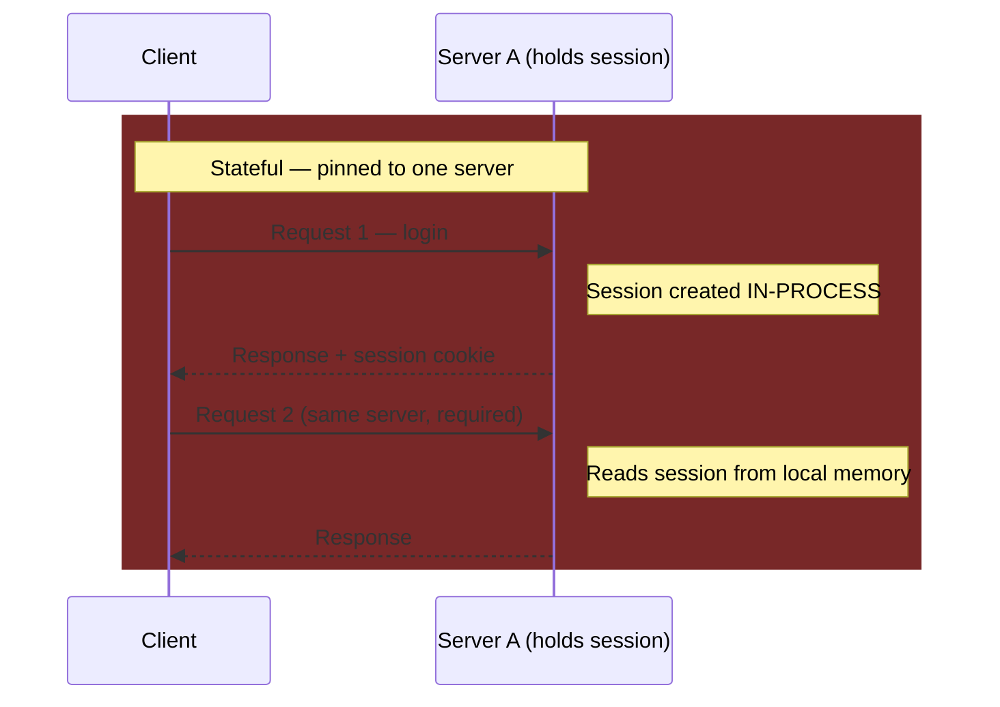
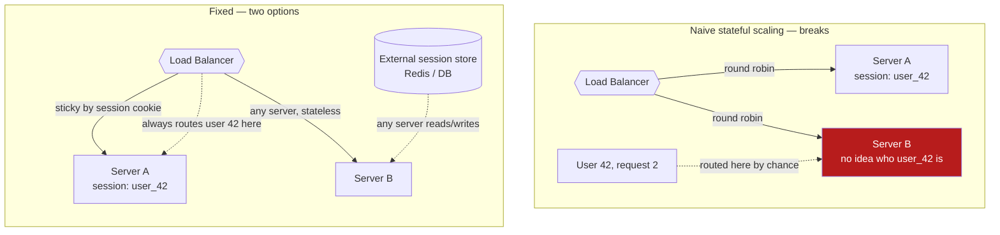

# Stateless vs Stateful Applications

**Prerequisites:** [Requirements & Estimation](requirements-estimation.md)

[← Requirements & Estimation](requirements-estimation.md) | [Next: API Design →](api-design.md)

---

## Why This Exists

"Can we just add another server?" The honest answer is always "it depends where the state lives," and most candidates never say that sentence out loud — they jump straight to "yes, horizontal scaling." If a user's session lives in that one server's memory, adding a tenth server does nothing for the nine users already pinned to servers one through nine, and it actively breaks the one whose next request gets load-balanced somewhere that's never heard of them.

This is not a niche distinction — it is the single decision that determines whether horizontal scaling is a config change or a redesign. Every [load balancer](../networking/load-balancing.md) algorithm, every [sharding](../databases/sharding.md) scheme, and half of the trade-offs in the [trade-off matrix](../reference/tradeoff-matrix.md) assume you already know which one you're building.

!!! tip "Mental model"
    **Stateless: every request carries everything the server needs to answer it.** The server is a pure function of the request — no memory between calls. **Stateful: the server remembers something about you from a previous request** — in process memory, on local disk, or pinned to a specific instance. The test that actually matters: *if this server died right now, mid-session, what does the user lose?* Stateless: nothing, the next request just lands on a different, equally-capable server. Stateful: whatever that server was holding, unless it was externalized somewhere durable.

---

## How Each One Actually Works

```mermaid
sequenceDiagram
    participant C as Client
    participant S1 as Server A
    participant S2 as Server B

    rect rgb(30, 90, 40)
    Note over C,S2: Stateless — any server, any time
    C->>S1: Request 1 (full context: token, params)
    S1-->>C: Response
    C->>S2: Request 2 (full context again)
    Note right of S2: Server B never talked to Server A.<br/>Doesn't matter — it didn't need to.
    S2-->>C: Response
    end
```

The stateless server didn't do anything clever to survive Request 2 landing on a different instance — it just never depended on Request 1 having happened anywhere in particular. The stateful server's correctness depends on Request 2 arriving at the same physical process that handled Request 1.

---

## Key Differences

| Feature | Stateless | Stateful |
|---|---|---|
| Server memory | Stores no client context | Stores client context (session) |
| Request dependency | Independent — any request, any order, any server | Depends on prior interactions on the *same* server |
| Scalability | High — add a server, it's immediately useful | Lower — new servers can't serve existing sessions |
| Complexity | Lower per-server; state management pushed to client/store | Higher — session lifecycle, replication, eviction |
| Fault tolerance | Better — any healthy instance can take the next request | Worse — losing the instance loses the session, unless replicated |
| Examples | REST APIs, JWT auth, serverless functions | Traditional web apps with server-side sessions, stateful WebSocket connections |

---

## Advantages and Disadvantages

**Stateless**

- Highly scalable — [load balancers](../networking/load-balancing.md) can use simple round-robin or least-connections with no session-affinity constraint
- Better fault tolerance — any instance can serve any request; a dead instance loses nothing durable
- Easier caching — a stateless response for the same input is cacheable at the CDN/edge without worrying about whose session it belongs to
- Cost: more data must travel in each request (a JWT on every call vs. a small session-id cookie); slightly more bandwidth

**Stateful**

- Simpler client — the client just sends a session ID; the server does the remembering
- Useful for genuinely stateful workflows: a multi-step checkout, a live collaborative document, a WebSocket-based game
- Cost: harder to scale (session pinning or replication required), memory consumption grows with concurrent sessions, and a single server failure can drop live sessions unless mitigated

---

## The Scaling Consequence, Concretely

This is the part the interview is actually testing — not the definitions, but what breaks when you scale a stateful design naively.

Two ways to fix a stateful design at scale, and they trade off differently:

1. **Sticky sessions** (session affinity) — the load balancer routes the same client to the same backend every time, usually via a cookie. Cheap to add, but it caps your scalability to "however evenly sticky routing happens to distribute," and a server failure still drops every session pinned to it.
2. **Externalize the state** — move session data out of process memory into a shared store (Redis, a database) that every server can read. This is the honest fix: it makes the *application servers* stateless again, and pushes the actual state-management problem to a system built for it — which is exactly the [distributed KV store](../system-design-exercises/distributed-kv-store.md) or cache tier problem, with its own replication and consistency trade-offs.

!!! warning "Sticky sessions are a scaling limit you're choosing, not removing"
    Sticky sessions make a stateful design *behave* like it scales, right up until the pinned server gets a disproportionate share of long-lived sessions and becomes hot while its siblings sit idle — [least-connections beats round-robin exactly because of this uneven-cost problem](../networking/load-balancing.md), and sticky routing reintroduces a milder version of it deliberately. It's a legitimate short-term fix, not a substitute for actually externalizing state.

---

## Token-Based Auth: Stateless by Design

JWTs are the canonical example of *engineering* statelessness into something that used to be inherently stateful (login sessions). The token itself carries the claims (`user_id`, `roles`, `exp`) signed by the server — any instance can verify it with the shared signing key, without a shared session store at all.

| | Server-side session | JWT (stateless token) |
|---|---|---|
| Where state lives | Server (memory/store) + a session-id cookie on the client | Entirely in the token, on the client |
| Revocation | Instant — delete the server-side session | Hard — the token is valid until it expires, unless you add a server-side blocklist (which reintroduces state) |
| Server scaling | Needs a shared store or sticky routing | Any instance can verify independently — no coordination |
| Payload size | Small cookie | Larger — the token travels on every request |

This table is itself the trade-off: JWTs buy you stateless horizontal scaling and cost you easy revocation. A system that needs instant "log this user out everywhere, right now" (a compromised account) either accepts a short token TTL, or reintroduces a small piece of state (a revocation list) — there is no free lunch, only a different place to put the complexity.

---

## When to Use What

**Use stateless when:**

- You need to scale horizontally on demand (autoscaling, bursty traffic)
- You're building public APIs or microservices other teams/services call
- You want high availability — no single instance is special
- Token-based auth (JWT) fits your revocation requirements
- You want to leverage CDN/edge caching

**Use stateful when:**

- The workflow is genuinely session-oriented and short-lived (a multi-step wizard, a live game session, an interactive terminal/WebSocket)
- You're managing a bounded, known number of concurrent users where pinning is operationally acceptable
- The cost of externalizing state (extra network hop to Redis on every request) isn't worth it for your latency budget

---

## Trade-offs

| Choice | Win | Cost |
|--------|-----|------|
| Fully stateless + external store | Any instance serves any request; trivial autoscaling | Extra network hop to the store on every request that needs state |
| Stateless with JWT | No store at all — verify locally | Hard revocation; larger request payloads |
| Sticky sessions | Cheap to bolt onto an existing stateful app | Uneven load; session lost if that instance dies; doesn't scale as smoothly |
| In-memory stateful, no mitigation | Fastest possible reads (no network hop) | Doesn't survive scaling, deploys, or instance failure — usually a toy-app-only choice |

---

## Interview Questions

=== "Foundation"
    **Q: What's the practical difference between a stateless and a stateful application, and why does it matter for scaling?**

    "Stateless means every request carries everything the server needs — no server holds memory of a previous request from that client. Stateful means the server remembers something, usually in process memory, tied to a specific instance. It matters for scaling because a stateless server is fungible — a load balancer can send any request to any instance and it just works, so adding a tenth instance immediately absorbs more traffic. A stateful server pins a client to wherever their session lives; adding a tenth instance does nothing for existing sessions, and that instance dying loses whatever it was holding unless that state was replicated or externalized."

=== "Senior"
    **Q: Your team's web app uses in-memory sessions and you need to scale from 2 instances to 20 for a traffic spike. What are your options, and what would you actually recommend?**

    "Two real options. Sticky sessions via the load balancer is the fastest fix — no code change, just routing config — but it caps how evenly you can actually distribute load, since session-heavy clients stay pinned wherever they started, and any instance failure drops every session pinned to it, which is a bad trade during a traffic spike specifically because that's when instances are under the most stress. The real fix is externalizing session state to Redis or a similar store — that makes every app instance stateless again, so the load balancer can use plain round-robin or least-connections, and losing an instance loses zero sessions. I'd recommend externalizing state as the actual fix, with sticky sessions only as a same-day stopgap if there's no time to wire up Redis before the traffic spike hits."

=== "Staff"
    **Q: A service currently uses stateless JWT auth for scalability, but security now requires the ability to instantly revoke a compromised user's access — 'log them out everywhere, right now.' How do you reconcile that with statelessness?**

    "This is a case where the pure stateless model and a hard product requirement are directly in tension, and the honest answer is you can't have both for free — you're choosing where to put a small amount of state back in, deliberately and minimally, rather than reverting to full server-side sessions. I'd add a lightweight revocation store — a Redis set of revoked token IDs or user IDs with a TTL matching the token's own expiry, checked on the hot path. That's still far cheaper than a full session store: it's one small, fast lookup, not per-request session hydration, and every app server stays otherwise stateless and horizontally scalable. I'd also shorten token TTLs so the revocation list's effective disaster window is small even in the (should never happen) case where the check is bypassed. The lesson for the team: 'stateless' is a spectrum, not an absolute — the goal is minimizing the state you reintroduce and being explicit about why each piece exists, not achieving zero state as an ideology."

---

## Key Takeaways

!!! success "Remember"
    1. The test that matters: if this server died mid-request, what does the user lose? Nothing → stateless. Something → stateful.
    2. Stateless scales by adding servers; stateful scales by either pinning (sticky sessions, a scaling *limit* you're choosing) or externalizing state to a shared store
    3. JWTs engineer statelessness into auth — the cost is hard revocation, mitigated with a small, deliberate reintroduction of state (a revocation list), not a full session store
    4. Externalizing state doesn't eliminate the state-management problem — it moves it to a system built for it ([distributed KV store](../system-design-exercises/distributed-kv-store.md), with its own replication trade-offs)
    5. "Stateless" is a spectrum in practice — the goal is minimizing and being explicit about the state you keep, not treating statelessness as an absolute rule

**Previous:** [Requirements & Estimation](requirements-estimation.md) | **Next:** [API Design](api-design.md)
