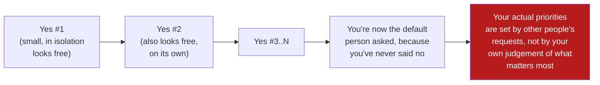

# Don't Say Yes When You Mean No

**Prerequisites:** [Growth Mindset](index.md), [Protecting Your Sanity](sustainable-pace.md)

[← Growth Mindset](index.md) | **Previous:** [Protecting Your Sanity](sustainable-pace.md) | **Next:** [The Strong Engineer](strong-engineer.md)

---

## Why This Exists

[Saying No](../behavioural/saying-no.md) teaches you to narrate a no as a polished interview story, told after the fact with a clean structure. This page is about the messier thing underneath: **the actual moment, in real time, when someone asks you for something and your honest answer is no — and the reflex to say yes anyway fires before you've even finished processing the ask.** That reflex is worth naming explicitly, because it doesn't feel like weakness in the moment. It feels like being agreeable, being a team player, not wanting to be difficult. **The cost shows up later, compounded, and by then it's much harder to trace back to the original yes.**

---

## Why the Reflexive Yes Happens

A yes given immediately, before you've actually evaluated the ask, is rarely a considered decision — it's usually the path of least resistance in the moment: saying no requires justifying yourself, risking friction, possibly disappointing someone, right now, in front of them. Saying yes defers all of that discomfort to later, to a future version of you who has to actually do the thing. **The reflexive yes trades a small, immediate social cost for a larger, delayed, and diffuse cost** — which is exactly the kind of trade humans are systematically bad at evaluating correctly in the moment, because the immediate cost is vivid and the delayed cost is abstract until it isn't.

**Concrete example:** a colleague asks in a hallway conversation, "can you just quickly review this PR before end of day?" It's Tuesday, you have two things already due Thursday, and "quickly" turns out to mean a 40-file refactor. The honest answer, evaluated for five seconds, is "not today, but I can do it tomorrow morning." The reflexive answer, given in half a second because saying no to a quick, friendly hallway ask feels disproportionately awkward, is "sure, no problem" — and now Thursday's two things are at risk, not because the review itself was unreasonable, but because it was accepted without being weighed against what was already committed.

---

## The Compounding Cost

A single reflexive yes rarely causes visible damage on its own — that's exactly what makes the pattern dangerous. The cost is in the accumulation, and in what the accumulation trains other people to expect.

Each individual yes was locally reasonable-sounding — "it's just a small favor," "it'll only take an hour," "I don't want to seem unhelpful." What compounds is the *pattern being visible to others*: the reflexive-yes engineer becomes the default person routed every ask that anyone predicts will get an easy yes, which is a self-reinforcing loop that has nothing to do with whether that engineer is actually the right person for any specific ask.

**Concrete example, at the compounded stage:** an engineer known for never turning anything down gets asked to be the informal point person for three different cross-team integration questions, on top of their actual project, because each requester independently thought "they'll probably say yes and they're helpful." No single ask was unreasonable. The sum is a person doing four jobs' worth of context-switching, with none of it reflected in their actual assigned scope of work, and no one single person to point to as the cause — because the cost was distributed across many small, individually-defensible yeses.

---

## Building the Habit of a Considered Answer

The fix isn't "say no more" — a considered yes is often still the right call. The fix is inserting a real evaluation step between the ask and the answer, even a short one, so the answer reflects an actual decision instead of a reflex.

- **Buy the five seconds, explicitly, if you need them.** "Let me check what I've got on my plate and get back to you in an hour" is a completely normal, professional response — it isn't evasive, and almost nobody reads it as a rejection. Concrete script: *"I want to give you a real answer, not a reflexive one — let me look at my week and reply by end of day."*
- **Ask what "quick" or "small" actually means, before agreeing to it.** "How big is the PR, roughly?" takes five seconds and often reveals that the ask isn't what it was described as — the hallway "quick review" that's actually a 40-file refactor is a different decision than the one being reflexively agreed to.
- **Notice the physical tell of a reflexive yes.** For a lot of people it's a felt sense of the answer leaving your mouth before you've actually thought about it — a slight flinch, a rushed tone. That tell is worth training yourself to catch, because by the time you notice it after the fact, the yes is already given.
- **Practice the considered no on low-stakes asks first.** The first few times you deliberately pause and consider before answering, do it on something genuinely low-stakes — a request you could reasonably decline without any real cost — so the discomfort of pausing gets practiced somewhere cheap, before you need the skill somewhere expensive.

!!! tip "A considered no said kindly costs less trust than an overcommitted yes that fails later"
    People remember and forgive a clear, well-reasoned no far more easily than they remember and forgive a yes that turned into a missed deadline or a half-finished favor. The reflexive yes optimizes for the wrong moment — it avoids discomfort at the ask, at the cost of a worse outcome at the deadline.

---

## Interview Questions

=== "Foundation"
    **Q: Describe a time you agreed to something you shouldn't have, and what you learned.**

    "A PM asked me in a hallway conversation to 'just quickly' review a PR before end of day, and I said yes without checking what was actually on my plate — it turned out to be a large refactor, not a quick review, and it put my own committed work at risk for the rest of the week. What I took from it: I now ask what 'quick' actually means, concretely, before agreeing to anything described in vague, minimizing terms, and I give myself a beat to check my actual workload instead of answering in the moment a request is made."

=== "Senior"
    **Q: How do you decide what to say no to when everything feels urgent?**

    "I try to insert an actual evaluation step instead of answering reflexively — even a short one, like 'let me check what I've committed to and get back to you today.' That alone catches most of the reflexive yeses, because articulating my current commitments out loud usually makes the conflict obvious to me before I've agreed to anything. For genuinely close calls, I weigh the actual cost of saying yes against what's already committed — not a vague feeling of being busy, but a specific 'if I take this on, X slips by roughly this much' — and I'll say that trade-off out loud to the person asking, because it's often information they don't have and would want before insisting."

=== "Staff"
    **Q: You notice a strong engineer on your team has become the default person everyone routes small favors to, and it's quietly eating their capacity for their real priorities. How do you address it?**

    "I'd name the pattern directly and specifically, with them — not 'you're too busy,' but the actual shape of it: 'you're the person three different teams route ad hoc questions to, and none of that is reflected in what we've actually planned for you this quarter.' I'd point out that no single one of those asks was unreasonable on its own, which is exactly why it's easy for the pattern to go unnoticed by everyone involved, including the person living it. Concretely, I'd help them build a specific, low-stakes script for the next ask — 'let me check my week and get back to you' — and encourage them to practice it on something cheap first, since the skill of pausing before answering is one most people haven't built, especially people who got rewarded early in their career specifically for being reliably helpful.

    I'd also look at whether I, as their manager, need to make some of those asks visible and explicitly deprioritized in writing, because an individual habit change is fragile against an organizational pattern of routing work to whoever says yes — if the underlying incentive doesn't change, the same engineer (or the next helpful one) ends up back in the same spot."

---

## Key Takeaways

!!! success "Remember"
    1. **A reflexive yes trades a small, immediate social cost for a larger, delayed, and diffuse one** — humans are systematically bad at weighing that trade correctly in the moment.
    2. **The damage is in the compounding, not any single yes** — each one looks locally reasonable, and the pattern becomes visible to others before it becomes visible to you.
    3. **Buy five real seconds before answering** — "let me check and get back to you" is a normal, professional response, not evasion.
    4. **Ask what "quick" or "small" actually means before agreeing** — the described size of an ask and its real size are often different, and that gap is exactly what a reflexive yes skips checking.
    5. **A clear, considered no is remembered and forgiven far more easily than an overcommitted yes that fails later** — the reflexive yes optimizes for the wrong moment.

**Previous:** [Protecting Your Sanity](sustainable-pace.md) | **Next:** [The Strong Engineer](strong-engineer.md)
