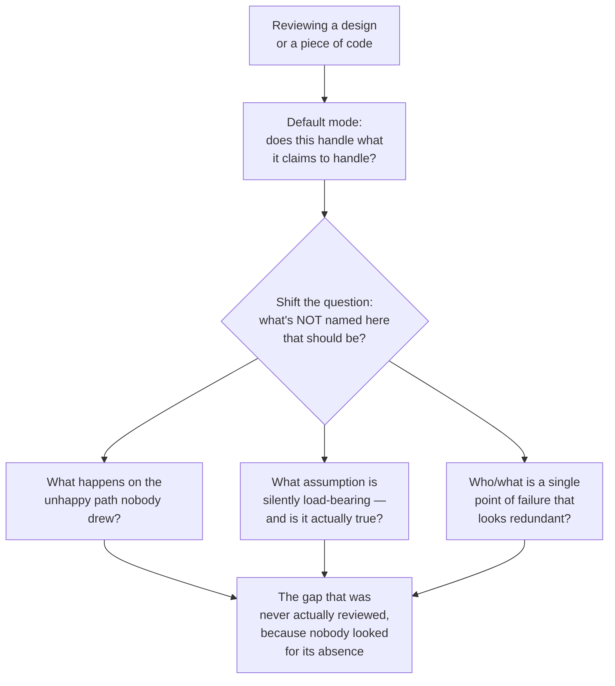

# Seeing What Others Miss

**Prerequisites:** [Growth Mindset](index.md), [The Strong Engineer](strong-engineer.md)

[← Growth Mindset](index.md) | **Previous:** [The Strong Engineer](strong-engineer.md)

---

## Why This Exists

Every team has a story about the engineer who looked at a design everyone else had already approved and asked the one question that unraveled it — "what happens if this call succeeds but the acknowledgment is lost?" — a question nobody else thought to ask, not because they were less capable, but because they were looking at the same diagram through a different habit of attention. **This is usually described as talent, which makes it feel unlearnable. It's mostly a set of specific, nameable habits, and the habits transfer.**

---

## The Habit: Asking What's Absent, Not Just What's Present

Most review, by default, evaluates what's in front of you: does this code do what it claims, does this design handle the cases it names. **The habit that catches what others miss is a deliberate shift to asking what's *not* there** — what case wasn't named, what failure mode wasn't in the diagram, what assumption is silently load-bearing.

**Concrete example:** a design review walks through a payment retry flow — client times out, retries the charge. Everyone in the room nods; the retry logic is clean, the code is well-tested. The question that catches the actual bug: "is the retry idempotent, or can this double-charge a customer if the first attempt actually succeeded and only the *response* was lost?" Nothing in the diagram was wrong. The diagram just never drew the case where the request succeeded and only the acknowledgment failed — because that case doesn't show up unless you're specifically looking for what's missing, not evaluating what's present.

---

## Pattern-Matching From a Wider Library

Part of "seeing what others miss" is genuinely just **having seen more failure modes before, and recognizing the shape of one recurring.** This is less mystical than it sounds — it's the direct payoff of studying [the failure library](../reliability/failure-library.md), reading postmortems (your own team's and other companies' public ones), and treating every incident you're near as a pattern to file away, not just a fire to put out.

**Concrete example:** an engineer who has previously debugged a thundering-herd cache stampede recognizes the shape of the same problem in an unrelated system — a scheduled job that refreshes thousands of feature-flag configs on a fixed 5-minute boundary, all at once — even though the domain (feature flags, not a cache) is completely different. The recognition isn't magic; it's "this has the shape of every-client-refreshes-at-the-same-instant, which I've seen cause a load spike before," pattern-matched from an unrelated incident months earlier. The engineer who hasn't seen that shape before has no hook to hang the recognition on, no matter how carefully they read the design — this is why the habit compounds specifically with deliberate exposure to failure modes, not just years of experience in the abstract.

---

## Slowing Down at the Point Everyone Else Speeds Up

A specific, learnable habit: **the part of a design or a plan that feels most "obviously fine" is disproportionately likely to be where the gap is**, precisely because it's the part nobody scrutinized. Confidence in a room is contagious and travels faster than verification — once two or three people nod at a section, the social pressure to also just nod is real, and it compounds exactly where a second look was most needed.

**Concrete example:** in a system design interview or a real review, the data model gets intense scrutiny (normalized correctly? indexed right?) while the deployment plan gets a single sentence — "we'll roll this out gradually" — because it sounds obviously reasonable and nobody wants to be the person asking a "basic" question about something that sounds settled. The engineer who catches what others miss is the one who asks, specifically, into that unscrutinized sentence: "gradually by what dimension — traffic percentage, region, tenant? And what's the rollback trigger, concretely, not just 'if something looks wrong'?" That single unscrutinized sentence is very often where the actual operational risk was hiding, exactly because its apparent obviousness was what let it go unexamined.

---

## Building the Habit Deliberately

- **Keep a running list of "the thing that got missed" from every incident you're near**, your own team's and others', with the specific gap named in one sentence — not the fix, the *shape* of what wasn't looked at. Reread the list before reviewing something new; it primes exactly the pattern-matching described above.
- **In any review, deliberately ask "what's the sentence in this doc that everyone nodded at without really reading?"** — it's almost always identifiable in retrospect, and asking the question prospectively catches it before it becomes the postmortem's opening line.
- **Practice naming the absent case out loud, even when you're not sure it matters.** "What happens if this succeeds but the response is lost" costs ten seconds to ask and, most of the time, gets a quick "oh, that's already handled" — the cost of asking is low, and the rare time it isn't already handled is worth all the times it was.
- **Separate "I don't understand this" from "this isn't explained."** Both feel identical from the inside — a moment of confusion reading a design — but they call for different responses. The engineer who reflexively assumes "I must be missing something" every time stays quiet exactly when the gap is real; the one who asks "wait, where does this handle X" even at the risk of it having an obvious answer is the one who occasionally surfaces the thing nobody actually explained because nobody had actually thought about it.

!!! tip "The tell that separates genuine insight from contrarianism"
    A useful "what others missed" observation is falsifiable and specific — someone can check it and confirm or refute it in minutes. "I have a bad feeling about this" is not that; it's unfalsifiable, and repeated unfalsifiable objections read as reflexive contrarianism rather than insight, which is the fastest way to get your genuinely sharp observations discounted along with the noise.

---

## Interview Questions

=== "Foundation"
    **Q: Tell me about a time you caught a problem in a design or plan that everyone else had missed.**

    "In a design review for a notification service, everyone focused on the delivery mechanism — which queue, what retry policy — and the data model got a quick nod as 'obviously fine.' I asked specifically what happened if a user's notification preferences changed between when an event was queued and when it was actually delivered, since nothing in the design named that case. It turned out there was no handling for it — a user who'd just unsubscribed could still get an email in flight, and nobody had thought about it because the section describing preferences read as simple and settled. The fix was small once named, but nobody had actually looked for the gap because that part of the design felt too obvious to scrutinize."

=== "Senior"
    **Q: How do you develop the ability to spot the problem others don't see, rather than relying on luck or general experience?**

    "I treat it as a specific, buildable habit rather than an innate trait. Concretely: I keep notes on the shape of every gap I've seen cause an incident — not the fix, the pattern, like 'everything refreshing on the same fixed schedule causes a load spike' — and I deliberately reread that list before reviewing something new, because pattern recognition needs something to match against, and a wider library of patterns directly increases what I'm able to catch. I also specifically watch for the part of any review that gets the least scrutiny because it sounds obviously fine — that's usually where the unexamined assumption is hiding, precisely because its apparent simplicity is what let everyone else skip past it."

=== "Staff"
    **Q: How do you build a review culture where more people develop this skill, instead of it staying concentrated in one or two senior people?**

    "I make the habit explicit and teachable rather than treating it as an innate trait some people have and others don't, because if it's framed as talent, people who don't already have it don't try to build it. Concretely, I coach people to ask two specific questions in every review: 'what's the sentence here that everyone's nodding at without really reading' and 'what case isn't named in this diagram that should be' — those two questions alone catch a large fraction of what I'd otherwise catch through years of accumulated pattern-matching, and they're immediately usable by anyone, not just someone with a long failure-library in their head.

    I also make postmortems explicitly about the *pattern*, not just the specific incident — closing every postmortem with 'what's the general shape of this, and where else might it exist' turns each incident into a reusable pattern for the whole team, not just a fix for one instance, which is how the pattern-matching library that senior engineers build individually over years gets built collectively and faster. And I protect the person who asks the 'obvious' question that turns out to matter — if asking 'wait, does this handle X' ever gets treated as slowing the room down, people stop asking it, and that's exactly the question that catches the most."

---

## Key Takeaways

!!! success "Remember"
    1. **The core habit is asking what's absent, not evaluating what's present** — most default review only checks whether what's shown works, not what case was never drawn at all.
    2. **Pattern recognition is genuinely learnable through deliberate exposure** — a wider library of failure modes (your own incidents, others' postmortems) directly increases what you're able to recognize, it isn't fixed talent.
    3. **The most confidently unscrutinized part of a design is disproportionately likely to hide the gap** — confidence in a room travels faster than verification, especially past the sentence everyone nods at.
    4. **A useful observation is falsifiable and specific, checkable in minutes** — "I have a bad feeling" is not that, and repeating unfalsifiable objections gets your real insights discounted along with the noise.
    5. **This skill can be taught, not just modeled** — two concrete, repeatable questions ("what's unscrutinized here," "what case isn't named") transfer the habit faster than years of osmosis.

**Previous:** [The Strong Engineer](strong-engineer.md) | **Back to:** [Growth Mindset](index.md)
