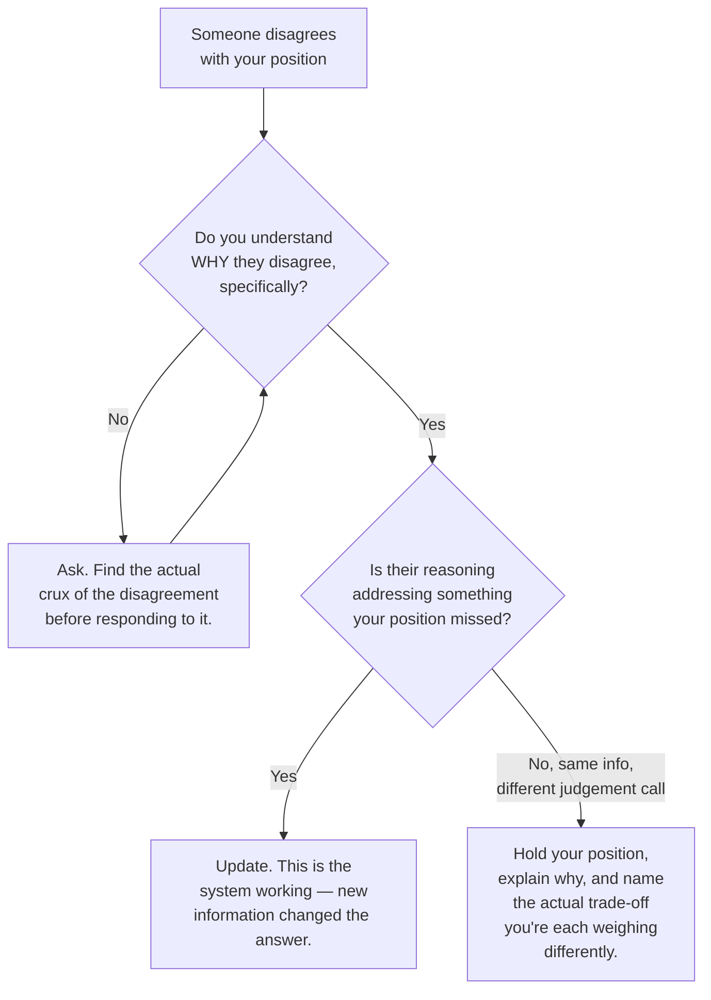

# Respect — Yourself and Others

**Prerequisites:** [Growth Mindset](index.md)

[← Growth Mindset](index.md) | **Next:** [Standing Your Ground, Professionally](standing-your-ground.md)

---

## Why This Exists

Respecting yourself sounds like a personal virtue — nice to have, orthogonal to whether you're good at the job. It isn't orthogonal. **An engineer who doesn't respect their own judgement defers on everything, contributes nothing distinctive, and becomes load-bearing infrastructure for other people's decisions instead of a source of decisions themselves.** An engineer who doesn't respect *others'* judgement stops listening, stops being correctable, and eventually gets isolated from the information that would have caught their next mistake. Both failure modes look different from the outside — one reads as meek, the other as arrogant — but they come from the same root: **an inaccurate model of whose judgement is worth how much weight, including your own.**

---

## Self-Respect Is Not the Same as Confidence

Confidence is a feeling — it goes up when you're winning and evaporates the moment you're wrong in public. Self-respect is closer to a standing policy: **you treat your own reasoning as worth stating clearly, worth defending until someone actually engages with it, and worth revising when someone does** — regardless of how the room's mood is trending in the moment. The tell that separates the two: a confident-but-not-self-respecting engineer goes quiet the instant a senior voice disagrees, not because they were convinced, but because the social pressure of disagreement outweighed the substance of their own point. A self-respecting engineer stays in the argument long enough to actually be convinced or to actually convince — and can tell you afterward which one happened and why.

!!! tip "The question that tells you which one you have"
    After a meeting where you backed off a position, ask yourself: *"Did I change my mind because of something they said, or because they said it with more confidence than me?"* If it's consistently the second one, that's a self-respect gap, not a judgement gap — your reasoning may have been right and you abandoned it for the wrong reason.

---

## Respecting Others Is Not the Same as Agreeing With Them

The opposite failure is treating disagreement as disrespect — reading every pushback as an attack on your competence rather than information about a gap between your model and theirs. **Respecting someone else's judgement means taking their disagreement seriously enough to find out *why* they hold it before deciding they're wrong** — not the same as deferring to it automatically, and not the same as dismissing it because you've already decided you're right.

The failure mode at each branch is skipping straight to a conclusion — either caving without understanding *why* (self-respect gap) or holding firm without ever checking whether they saw something you didn't (respect-for-others gap). Both skip the actual work, which is finding the crux.

---

## Where It Curdles

- **Self-respect curdles into arrogance** the moment "my reasoning deserves to be heard" becomes "my reasoning doesn't need to be checked." The tell: you stop being able to name the strongest argument *against* your own position — if you can't state the other side's best case in a way they'd recognize as fair, you've stopped actually engaging with it.
- **Respect for others curdles into deference** the moment "their disagreement deserves consideration" becomes "their seniority settles the question." Seniority is a reasonable prior — a more experienced engineer's intuition is evidence — but it isn't a proof, and treating it as one means you stop contributing the one thing you're actually there for: a second, independently-derived opinion. If you'd have reached the same conclusion regardless of who was in the room, that's not respect, that's abdication.

!!! warning "The trap that catches strong engineers specifically"
    Being right often, early in a career, teaches a dangerous lesson: that being right is evidence you should stop checking. The engineers who stay good for decades are the ones who keep the habit of checking anyway — not because they doubt themselves generally, but because they know the base rate of "felt certain, was wrong" doesn't go to zero just because it's gone down.

---

## Interview Questions

=== "Foundation"
    **Q: How do you know the difference between healthy self-respect and being defensive when your work is criticized?**

    "Self-respect means I engage with the criticism to find out if it's right — I ask what specifically they're seeing that I'm not, and I update if their reasoning holds up. Defensiveness means I'm arguing to protect how I feel about the work, not to find out whether the work is actually right. The tell for me is whether I can restate their critique back to them in a way they'd agree is fair — if I can't, I'm probably defending instead of listening."

=== "Senior"
    **Q: Tell me about a time you initially deferred to someone more senior and later realized you shouldn't have.**

    "Early on, a staff engineer pushed back on a caching approach I'd proposed, and I dropped it immediately — not because his argument addressed something I'd missed, but because he said it with more certainty than I had. Three weeks later the alternative he'd pushed for turned out to have the exact scaling problem I'd originally been trying to avoid, and we ended up back at something close to my original design, at the cost of the three weeks. What I took from it: I hadn't actually understood *why* he disagreed before I capitulated — I'd responded to his confidence, not his reasoning. Now when someone senior disagrees, I ask for the specific mechanism behind their objection before I decide whether to hold my position, rather than reading seniority itself as the answer."

=== "Staff"
    **Q: How do you build a culture where junior engineers push back on senior ones, without it turning into people arguing for the sake of arguing?**

    "I'd separate two things that get conflated: encouraging disagreement, and rewarding disagreement regardless of whether it's grounded. What actually builds a healthy culture is normalizing the *process* — ask 'what am I missing' before agreeing, ask 'what would change your mind' before disagreeing — and modeling it visibly myself, including publicly updating when a junior engineer catches something I missed, because that's the signal that disagreement is actually welcome, not just tolerated in theory. I'd be explicit that the goal isn't disagreement for its own sake — it's finding the crux fast and updating on real information, and a junior engineer who reflexively contradicts senior positions without engaging with the reasoning is making the same mistake as one who reflexively defers, just in the opposite direction."

---

## Key Takeaways

!!! success "Remember"
    1. **Self-respect is a standing policy about your own reasoning, not a mood** — the tell for a gap is caving to confidence rather than to a better argument.
    2. **Respecting someone's disagreement means understanding it, not automatically deferring to it** — seniority is evidence, not proof.
    3. **Both failure modes curdle the same way: skipping the actual work of finding the crux** — either caving without checking, or holding firm without checking.
    4. **If you can't state the strongest case against your own position fairly, you've stopped engaging with it, not defending it.**
    5. **Being right early in your career is not evidence you should stop checking** — it's a trap that specifically catches engineers who were right often enough to trust the feeling of certainty over the process of verifying it.

**Previous:** [Growth Mindset](index.md) | **Next:** [Standing Your Ground, Professionally](standing-your-ground.md)
