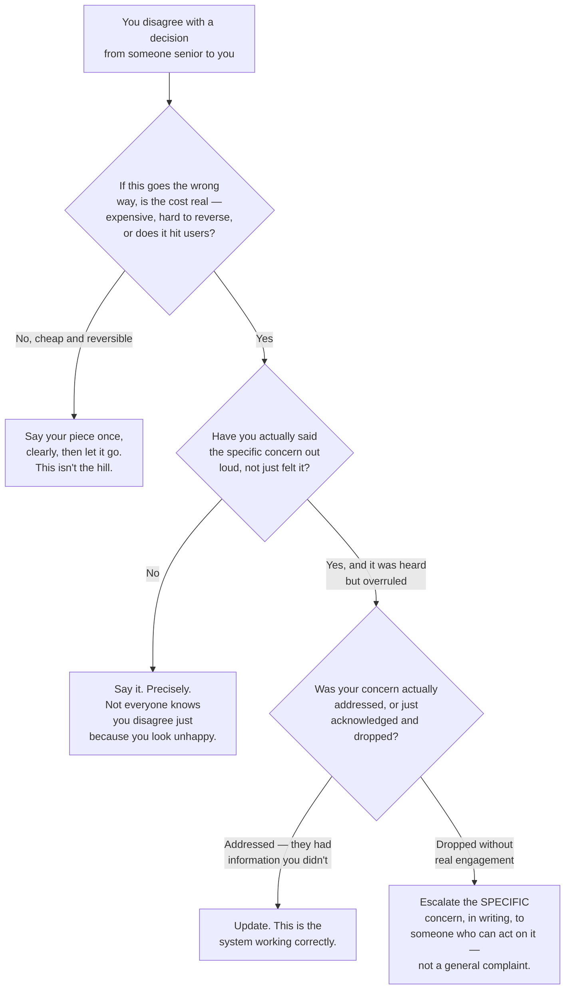

# Standing Your Ground, Professionally

**Prerequisites:** [Growth Mindset](index.md), [Respect — Yourself and Others](self-respect.md)

[← Growth Mindset](index.md) | **Previous:** [Respect — Yourself and Others](self-respect.md) | **Next:** [Crucial Conversations](crucial-conversations.md)

---

## Why This Exists

At some point, someone with more authority than you will be wrong about something that matters, in a room where saying so carries real risk. This is not a hypothetical for a long career — it's a certainty, and how you handle it the first few times sets a pattern that's hard to unlearn later. **The failure most engineers are warned about is folding — going quiet, deferring, letting a bad decision through because pushing back felt too costly.** The failure almost nobody warns you about, because it's less common but more career-limiting when it happens, is the opposite: **conflating "I believe I'm right" with "this is worth spending my credibility on," and turning every disagreement into a stand.**

The skill is not "always push back" or "always defer" — it's knowing which situations are actually worth the cost of pushing back, and then doing it in a way that preserves your ability to do it again next time.

---

## Conviction Is Not the Same as Volume

The people who are best at this are, counterintuitively, usually the calmest in the room when they disagree — not because they don't feel strongly, but because they've separated **being right** from **needing to win the moment**. Someone who's actually confident in their reasoning can afford to be patient: state the position, name the specific risk, let the other person process it, and trust that a good argument doesn't need to be loud to eventually land. Someone who's performing conviction — trying to convince the room through intensity rather than substance — is usually compensating for an argument that isn't actually strong enough to stand on its own.

```
LOUD, EARLY                            CALM, SPECIFIC
────────────                           ──────────────
"This is a terrible idea"              "I think this breaks under
General, unfalsifiable                  X specific condition —
Reads as ego, not analysis              here's why, and here's
Escalates fast, resolves slow           what I'd want confirmed
                                         before I'm comfortable."
                                        Falsifiable, inviting a
                                         real answer
                                        Escalates only if the
                                         specific concern is
                                         actually dismissed unaddressed
```

---

## The Decision: Is This Actually Worth It?

Not every disagreement deserves a stand. Spending credibility on something low-stakes just because you have a strong opinion is how you run out of credibility for the time it actually matters.



The branch most people skip is the second one: **actually saying the concern precisely, out loud, before deciding whether to escalate.** A surprising number of "I raised this and got overruled" stories, examined closely, turn out to be "I looked unhappy about it and nobody engaged with an argument I never actually made explicit."

---

## What Makes Pushback Land Instead of Just Register

- **Name the specific mechanism, not a general feeling.** "This will cause problems" is a feeling. "This removes the retry-safe guarantee our downstream consumers depend on, and I don't see where that gets replaced" is an argument someone can actually engage with or refute.
- **Say it to the person who can act on it, not around them.** Complaining to peers about a decision you never actually contested to its owner is the quiet version of not standing your ground at all — it feels like you did something, and changes nothing.
- **Time it before the decision is public and hardened, if you can.** A concern raised in the room before a decision is announced is a contribution to the decision. The same concern raised loudly after it's announced reads as an attempt to relitigate, even if the substance is identical — timing changes how the same argument lands.
- **Be willing to lose and say so cleanly.** "I disagree, I've said why, it's your call, I'll support it" is a complete, professional sentence. Continuing to relitigate after a genuine hearing — not being ignored, but actually heard and overruled — is what turns a respected dissent into a reputation for being difficult.

!!! warning "The line between principled and difficult is drawn by other people's experience of you, not your own intent"
    You can believe every one of your stands was principled and still develop a reputation for being hard to work with, if the people on the other side of those stands experienced them as relentless rather than considered. This isn't about being right — it's about whether the *manner* of your pushback made people want to bring you the next hard call, or want to route around you.

---

## Interview Questions

=== "Foundation"
    **Q: Tell me about a time you disagreed with a decision from someone more senior than you.**

    "A tech lead wanted to ship a schema change without a migration plan for existing rows, on the reasoning that we'd 'backfill later.' I said directly that shipping without the backfill plan meant we'd have inconsistent data in production with no clear path to fix it, and asked what the plan actually was for the existing rows — not a general objection, the specific gap. It turned out there wasn't a plan yet; my question surfaced that the timeline had been set before that piece was actually solved. We delayed two days to write the backfill script first, which was a much smaller cost than discovering the gap in production."

=== "Senior"
    **Q: Describe a time you pushed back, were overruled, and it turned out you were right. How did you handle it afterward?**

    "I flagged that a proposed rate-limiting change would fail closed under a specific failure mode — the rate limiter's own backing store going down — and argued we should fail open instead, given the blast radius of blocking all traffic versus the blast radius of temporarily under-limiting. My lead disagreed, reasoning that under-limiting risked a cascading failure downstream, and made the call to fail closed. I said my piece once, clearly, made sure the trade-off was documented, and then supported the decision rather than continuing to argue it. Three months later the backing store did have an outage, and failing closed did cause exactly the incident I'd flagged. When it happened, I didn't lead with 'I told you so' — I focused the postmortem on the actual trade-off and the fix, and separately, in a private conversation, made sure the decision-making process (not just the outcome) got revisited so a similar call next time would weigh both failure modes explicitly instead of defaulting to fail-closed. Being right about the outcome mattered less to the relationship than how I handled being overruled in the first place."

=== "Staff"
    **Q: How do you decide which disagreements are worth escalating, given that escalating too often burns trust and escalating too rarely lets bad decisions stand?**

    "I weigh it against two things: how expensive and reversible the outcome is, and whether my concern has actually been heard and engaged with — not just registered. If the cost is small and reversible, I say my piece once and let the decision-owner decide; that's not worth spending organizational capital on. If the cost is real — hard to reverse, expensive, or affects users or data integrity — and I've raised the specific concern and it genuinely wasn't engaged with (dismissed without addressing the mechanism I named, not just decided against after real consideration), that's when I escalate, and I escalate the specific unaddressed concern in writing to someone who can actually act on it, not a general complaint about the decision or the person who made it.

    The discipline that keeps this calibrated is being honest with myself about the difference between 'overruled after being heard' and 'dismissed without engagement' — it's tempting to reclassify every loss as the second one because it feels better, and doing that consistently is exactly what erodes the trust that makes escalation effective when it's genuinely needed."

---

## Key Takeaways

!!! success "Remember"
    1. **Calm and specific beats loud and general** — a falsifiable, mechanism-level concern invites a real answer; a general objection invites defensiveness.
    2. **Not every disagreement is worth a stand** — weigh the actual cost and reversibility before spending credibility.
    3. **Most "I raised this and got overruled" stories skip a step** — actually saying the specific concern out loud, to the person who can act on it, before deciding whether to escalate.
    4. **Being heard and overruled is different from being dismissed** — know which one happened, and respond accordingly; relitigating a genuine hearing is what damages your reputation, not the original disagreement.
    5. **The line between principled and difficult is drawn by how the other person experienced it, not your own certainty about your intent.**

**Previous:** [Respect — Yourself and Others](self-respect.md) | **Next:** [Crucial Conversations](crucial-conversations.md)
