# The Strong Engineer — Characteristics and Conduct

**Prerequisites:** [Growth Mindset](index.md)

[← Growth Mindset](index.md) | **Previous:** [Don't Say Yes When You Mean No](boundaries.md) | **Next:** [Seeing What Others Miss](seeing-what-others-miss.md)

---

## Why This Exists

"Be a strong engineer" is advice with no content until it's split into two different things that get conflated constantly: **characteristics** — the traits and habits of mind someone has, largely invisible until they produce an outcome — and **conduct** — the specific, observable things they do, in specific moments, that other people actually see and remember. A team can have brilliant characteristics and still be miserable to work with if the conduct doesn't match — and conversely, disciplined conduct without the underlying characteristics tends to feel hollow, procedural, correct-on-paper but not actually trustworthy. **Both matter, and they're worth naming separately because they're built differently.**

---

## Characteristics: What a Strong Engineer Has

These aren't skills you study directly — they're outcomes of how someone habitually thinks, visible only in the pattern of their decisions over time.

- **Calibration.** Knows the difference between "I'm confident" and "I'm right," and can state a real probability instead of a binary. A strong engineer says "I'm fairly sure this handles the common case, but I haven't tested the concurrent-write path" — not because they're less confident than a weaker engineer, but because they've separated confidence from certainty and report both accurately.
- **A short feedback loop with reality.** Strong engineers test their assumptions early and cheaply, rather than building on an unverified assumption for weeks and discovering it was wrong at the worst possible time. This shows up as a bias toward the smallest experiment that would falsify the current plan, run before the plan is fully committed to.
- **Comfort holding two things at once: conviction and doubt.** Able to advocate strongly for a position while genuinely remaining open to being wrong — not performing openness while actually being closed, and not performing conviction while actually being unsure. This is rarer than either extreme alone.
- **A bias toward the root cause over the symptom.** When something breaks, the instinct is "why did this become possible" rather than just "how do I make this instance go away" — see the mid/senior/staff distinction in [Behavioural — Mental Model](../behavioural/index.md#mental-model-what-level-is-this-story) for how this exact trait shows up as scope of impact in an interview story.
- **Genuine curiosity that survives being busy.** The habit of asking "wait, why does it actually work that way" doesn't switch off under deadline pressure for a strong engineer — it gets deferred, tracked, and returned to, rather than permanently suppressed. An engineer who's stopped being curious under pressure has usually also stopped noticing the things curiosity would have caught.

---

## Conduct: What a Strong Engineer Does

Conduct is the visible layer — the specific behaviors a teammate would describe if asked "what's it like to work with them."

```mermaid
flowchart LR
    subgraph Char["Characteristics (internal, inferred)"]
        C1["Calibration"]
        C2["Short feedback loops"]
        C3["Conviction + doubt"]
        C4["Root-cause bias"]
        C5["Durable curiosity"]
    end
    subgraph Cond["Conduct (external, observed)"]
        D1["Reviews code like the<br/>author is present"]
        D2["Credits others specifically,<br/>not generically"]
        D3["Escalates problems early,<br/>not after they're unfixable"]
        D4["Documents decisions,<br/>not just outcomes"]
        D5["Shows up the same on<br/>a bad day as a good one"]
    end
    Char -.->|"produces, but is<br/>not identical to"| Cond
```

- **Reviews code as if the author will read the comment out loud to their face.** Not softer — specific and kind can coexist with direct. "This function does three unrelated things, which is why the bug slipped through — splitting it would make the next change safer too" lands completely differently than "this is a mess," even though both are honest.
- **Credits people specifically, not generically.** "The team did great work" is true and forgettable. "Priya's idea to shard by tenant instead of by date is why this held up under the traffic spike" is specific, verifiable, and the kind of credit that actually changes how people are perceived by others in the room.
- **Escalates problems while they're still cheap to fix.** A strong engineer's default is surfacing a concern the week it's noticed, even at the cost of sounding like they're raising something small — because the alternative, staying quiet until it's undeniable, means the problem arrives at its most expensive and least fixable moment.
- **Writes down the reasoning behind a decision, not just the decision** — see [Architecture Decision Records](../foundations/adrs.md) for the concrete mechanism. This is conduct, not just a technical practice: it's a habit of treating future colleagues (including your future self) as people who deserve the reasoning, not just the conclusion.
- **Shows up consistently regardless of mood.** The single most corrosive conduct failure on a team isn't any one bad day — it's unpredictability, where teammates can't tell in advance whether raising something with this person today will get a fair hearing or a curt dismissal depending on how their morning went. Consistency, even at a slightly lower peak, builds more trust than brilliance with volatility.

---

## Where the Two Diverge

The interesting failure cases are where characteristics and conduct pull apart:

| Pattern | What's happening | Why it's a problem |
|---|---|---|
| Brilliant characteristics, poor conduct | Genuinely excellent judgement, but delivered in ways that alienate people — blunt reviews, credit not shared, escalations that feel like blame | People stop bringing this person information because the cost of interacting with them outweighs the value of their judgement — the org loses access to good judgement it technically still has |
| Disciplined conduct, shallow characteristics | Says all the right things — asks for feedback, documents decisions, uses inclusive language — but the underlying calibration and root-cause instinct aren't there | Reads as performative once decisions start being scrutinized; the conduct is correct-shaped but doesn't hold up when the substance underneath doesn't back it |
| Both present, inconsistently | Good on a good day, poor conduct under real pressure | Teammates learn to route around this person during exactly the moments — incidents, deadlines — when their good judgement would matter most |

!!! tip "The honest self-check"
    Ask a peer you trust, specifically: *"Is there a gap between how good my judgement is and how good it is to actually work with me on a bad day?"* Most people can self-assess characteristics reasonably well. Almost nobody can self-assess their own conduct under pressure accurately — that one needs an outside view.

---

## Interview Questions

=== "Foundation"
    **Q: What do you think separates a strong engineer from a merely skilled one?**

    "Skill is being able to solve the problem in front of you. Strength, the way I think about it, is two additional things: calibration — knowing how confident you actually should be, not just how confident you feel — and conduct, meaning the judgement actually shows up consistently, in how you review code, escalate problems, and treat people, not just in the technical decisions themselves. I've worked with technically brilliant engineers whose judgement effectively didn't reach the team, because the way they delivered it made people stop asking them."

=== "Senior"
    **Q: Tell me about someone you consider a genuinely strong engineer, and what specifically makes you say that.**

    "A staff engineer I worked with under a production incident stayed completely calm, but more specifically: she narrated her reasoning out loud as she debugged — 'I'm ruling out the cache layer because the error pattern doesn't match a cache-miss storm, checking the connection pool next' — which meant everyone in the incident channel could follow and contribute, instead of watching a black box. Afterward, in the postmortem, she named the specific gap that let the bug ship (a missing integration test for a particular failure path) rather than a vague 'we should test more,' and she credited the engineer who'd actually found the root cause by name, in the written summary, not just verbally in the room. None of that was flashy. All of it was the reason people trusted her judgement enough to actually change their own behavior based on it."

=== "Staff"
    **Q: How do you evaluate 'strong engineer' as a criterion when hiring or promoting, given how much of it is conduct rather than a demonstrable technical skill?**

    "I look for evidence in both categories separately, because they don't correlate as tightly as people assume. For characteristics, I probe for calibration directly — I'll ask someone to estimate their confidence in a past technical call and then ask what specifically would have changed their mind, because a well-calibrated engineer usually has a concrete answer and a poorly-calibrated one usually doesn't. For conduct, I weight peer and cross-functional feedback heavily, specifically asking not 'is this person skilled' but 'does this person's skill actually reach you, or do you find yourself working around them' — because that question surfaces the conduct gap that a purely technical interview loop misses entirely.

    I'm also explicit that these can diverge, and I don't let strong characteristics excuse poor conduct in a promotion decision, because promoting someone whose judgement doesn't reach the team due to how they deliver it teaches everyone watching that conduct doesn't actually matter here — which erodes the exact behavior (specific credit, calm escalation, consistency under pressure) the org needs more of as it scales."

---

## Key Takeaways

!!! success "Remember"
    1. **Characteristics are internal and inferred from patterns over time; conduct is external and observed in specific moments** — a team feels the second one directly, regardless of how strong the first one is.
    2. **Calibration — separating "I'm confident" from "I'm right"** — is one of the highest-leverage characteristics, and it's directly testable by asking what would change someone's mind.
    3. **Specific credit ("Priya's idea to shard by tenant") lands completely differently from generic credit ("the team did great work")** — and it's a conduct choice, not a characteristic.
    4. **Brilliant judgement delivered badly gets routed around** — the org effectively loses access to good judgement it technically still employs.
    5. **Nobody can accurately self-assess their own conduct under pressure** — that read requires an outside perspective, unlike characteristics, which are more self-assessable.

**Previous:** [Don't Say Yes When You Mean No](boundaries.md) | **Next:** [Seeing What Others Miss](seeing-what-others-miss.md)
