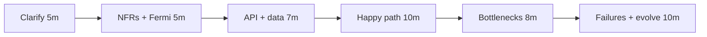

# Interview Framework

Interviewers at senior and staff loops are not grading whether you have seen Kafka. They are grading whether they would **let you own a system on a bad Friday**. This page is how that evaluation works, how to use this academy's modes, and how to ask questions that buy you the right design.

---

## How you are actually evaluated

Most loops score some version of these axes. A perfect architecture with a zero on communication still fails.

| Axis | What they listen for | What fails |
|------|----------------------|------------|
| **Reasoning** | You derive the next component from a requirement or a bottleneck | You recite a blog architecture |
| **Prioritization** | You sequence: requirements → numbers → API → data → path → failures | You draw Kafka before QPS |
| **Trade-offs** | Every choice names what you gave up | "We'll use Redis" with no alternative |
| **Depth** | You can go one layer down *when asked* (how the hash ring remaps) | You dump internals unprompted **or** bounce on the first "how" |
| **Communication** | Structure, signposts, diagrams, check-ins | Monologue; interviewer cannot redirect |
| **Ambiguity** | You make a default, state it, invite correction | You freeze until the prompt is complete |

!!! tip "The hidden rubric"
    Senior: can you design a coherent system and defend two forks? Staff: can you change the **problem** — scope, org, multi-year evolution, cost — and still leave a path the team can ship in a quarter?

---

## Modes in this academy

Use one mode at a time. Mixing "learn" and "solution" is how you get déjà vu in the real interview and no recall.

=== "Learn"
    Read the full page: problem, mental model, internals, failures. Do not skip failure modes. Goal: *I could teach this tomorrow.*

=== "Practice"
    Close the solution. Pick a design exercise or a reasoning question. Timebox 35–45 minutes. Speak out loud. Whiteboard or paper — not an editor.

=== "Hint"
    After you are stuck for real (5+ minutes). Use a nudge: "what is the write path?" not the answer. The academy's `??? question` blocks are hints.

=== "Interview"
    Explain as if a stranger is scoring you. Start with the problem restatement. Check in: "I'll assume 10M DAU unless you want another scale." Stop after each major choice.

=== "Solution"
    Only after you have a design. Diff yours vs the page. The delta is the study plan, not the page itself.

=== "Staff"
    Re-open the same problem with: org boundaries, 3-year evolution, compliance, cost, migration, "what if we are wrong." Staff tabs on concept pages are this lens.

---

## How to ask clarifying questions

You are not buying time. You are **collapsing a design space**. Ask questions whose answers change the architecture.

**Good** (answer changes the drawing):

- Write vs read ratio? Peak vs average?
- Can we lose an event, or is money involved?
- Single region or must we survive a region loss?
- Who is the client — browser, mobile, other services? Idempotent?
- Consistency: read-your-writes for the author?
- Latency SLO: 50ms p99 or 500ms?
- Existing constraints: "we already have Kafka / we cannot add a database"?

**Weak** (answer is trivia):

- "What language?"
- "How many engineers?"
- A laundry list you memorized and then ignore

**Protocol:**

1. Restate the product in one sentence.
2. Ask 4–8 questions in **clusters** (scale, consistency, failure, clients).
3. **State defaults** when they shrug: "I'll assume 100M DAU, 10:1 reads, one region, 200ms p99."
4. Write NFRs on the board. They become the scorecard for later trade-offs.

!!! warning "Ambiguity is the test"
    If the prompt is vague and you wait, you fail the staff bar. If you invent a social network when they wanted a bank, you also fail. The move is: default + confirm.

---

## 45-minute system design spine

1. **Clarify** — users, actions, constraints.
2. **Numbers** — QPS, storage, payload. Little's Law if concurrency matters.
3. **API + records** — if you cannot name the entities, you cannot shard them.
4. **Simplest design that works** — one region, one primary, a cache if the numbers demand it.
5. **Stress it** — what dies at 10×? Where is the lock? What is the hot key?
6. **Failures** — instance, AZ, poison message, deploy.
7. **Evolve** — year 2, second region, compliance. Staff if they still have time.

Do not implement Raft in minute 8.

---

## Staff lens questions

Ask these of *your own* design before the interviewer does.

- **What is the unit of ownership?** If two teams must deploy for one checkout, the architecture is an org bug.
- **What is the reversible decision?** Shard key and event contract are not. Cache vendor is.
- **What is the cost curve?** 3 nines vs 4 vs 5 — see [Calculators](../reference/calculators.md).
- **How do we migrate?** Dual-write, shadow read, backfill, rollback. "Big bang cutover" is not a plan.
- **What will be true in 3 years?** Data gravity, new product lines, a region in APAC.
- **What do we *not* build?** Staff is subtraction.
- **How will this fail in a way dashboards miss?** Empty Kubernetes endpoints, sticky sessions to a dead box, saga compensation stuck.

---

## Communication habits that score

- Narrate the board: "This box is the write path; ignore reads for 2 minutes."
- When interrupted, **take the hint**. They are steering you to the rubric.
- If you don't know a product (Spanner, Dynamo): say the **property** you need ("global linearizability") and a cheaper stand-in.
- Close: "The risks I would prototype first are X and Y."

---

## Mapping academy pages to the loop

| Loop signal | Practice on |
|-------------|-------------|
| Ambiguous product | [How to study](../how-to-use.md) + a design exercise with the solution covered |
| Capacity | [Calculators](../reference/calculators.md) |
| Data split | [Sharding](../databases/sharding.md), [Consistent hashing](../databases/consistent-hashing.md) |
| Cross-service write | [Sagas](../architecture-patterns/sagas.md) |
| "It's slow" | [HTTP & TCP](../networking/http-tcp.md), [Load balancing](../networking/load-balancing.md) |
| "It's 502" | [Kubernetes](../kubernetes/index.md) |
| Behavioural | [STAR + incidents](../behavioural/framework.md) |

---

## Key Takeaways

!!! success "Remember"
    1. They score **reasoning and judgment**, not component bingo
    2. Clarifying questions must **change the design**
    3. Defaults + confirmation beat silence
    4. Use academy modes separately — Learn then Practice then Solution
    5. Staff is scope, org, cost, and migration — not a thicker sequence diagram
