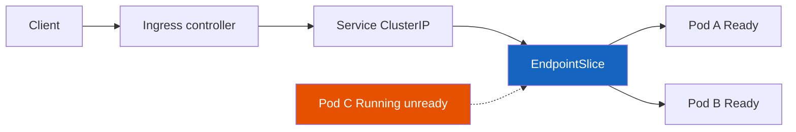

# Kubernetes

**Prerequisites:** [HTTP & TCP](../networking/http-tcp.md), [Load Balancing](../networking/load-balancing.md)

[← Cloud](../cloud/index.md) | [Next: Observability →](../observability/debugging-playbook.md)

---

## Why This Exists

Your Deployment says `3/3 Ready`. Grafana is green. Users get **504**.

Kubernetes did not "lose the request." The request walked **Client → Ingress → Service → Endpoints → Pod** and fell off at a hop you did not look at. The most expensive K8s skill is not writing YAML — it is knowing **which object is lying** and which `kubectl` command makes it confess.

This page is a field guide: the objects, the path, the probes, then a diagnosis playbook for the failures that actually page you.

!!! tip "Mental Model"
    A **Pod** is a rented room (one or more containers, one network namespace, one IP). A **Deployment** is the hotel manager that keeps N rooms occupied. A **Service** is the front-desk phone number (stable virtual IP) — it does **not** run your app. **Endpoints / EndpointSlice** is the current list of room numbers that are *Ready*. **Ingress** is the street address and the bouncer (HTTP routing / TLS). If the phone list is empty, calling the front desk fails even if rooms exist.

---

## The Objects That Matter

| Object | What it actually is | Common lie |
|--------|---------------------|------------|
| **Pod** | Smallest deployable; IP + volumes + containers | `Running` ≠ serving traffic |
| **Deployment / ReplicaSet** | Desired replica count + rolling update | `Available` can be true while the *new* RS is broken if you mis-set maxUnavailable |
| **Service** | Virtual IP + iptables/IPVS / kube-proxy rules | Exists even with **zero** endpoints |
| **EndpointSlice** | Ready pod IPs for that selector | Empty when readiness fails *or* selector is wrong |
| **Ingress** | L7 route to a Service | 404 from the controller is not your app 404 |
| **Probe** | kubelet asking the container a question | Liveness that hits the DB suicides the fleet |

**Requests / limits** (the other page-causer):

- **request** — scheduler + bin-packing. Too low: noisy neighbor. Too high: Pending forever.
- **limit** — cgroup cap. CPU limit → throttle (latency). Memory limit → **OOMKilled** (restart).
- Unset limit: the node OOM killer picks a victim (maybe not you). Unset request: you are scheduled as if you were tiny.

---

## Request Flow



1. DNS: `api.shop.com` → Ingress controller (or external LB).
2. Ingress matches host/path → **Service name** (not a pod).
3. kube-proxy (or dataplane: Cilium, Istio) NATs ClusterIP to a **Ready** endpoint.
4. Pod network: container port. App accepts.

If Endpoints is empty, the Service still has an IP. Packets go to a black hole or the LB returns **503**. `kubectl get pods` can look perfect.

---

## Interactive Simulation

<div class="sim-container">
  <div class="sim-title">Kubernetes Request Flow</div>
  <div class="sim-controls">
    <button class="sim-btn success" onclick="window._k8s && window._k8s.run()">Send request</button>
    <button class="sim-btn" onclick="window._k8s && window._k8s.reset()">Reset</button>
    <button class="sim-btn danger" onclick="window._k8s && window._k8s.failEndpoints()">Empty endpoints</button>
    <button class="sim-btn danger" onclick="window._k8s && window._k8s.failReadiness()">Fail readiness</button>
    <button class="sim-btn danger" onclick="window._k8s && window._k8s.crashLoop()">CrashLoop</button>
    <button class="sim-btn success" onclick="window._k8s && window._k8s.heal()">Heal</button>
  </div>
  <canvas id="k8s-canvas" class="sim-canvas" style="width:100%;height:280px;"></canvas>
  <div class="sim-stats">
    <div class="sim-stat"><div class="sim-stat-label">Path</div><div class="sim-stat-value" id="k8s-path">idle</div></div>
    <div class="sim-stat"><div class="sim-stat-label">Result</div><div class="sim-stat-value" id="k8s-result">—</div></div>
  </div>
  <div class="sim-log" id="k8s-log"></div>
</div>

**Try:** Fail readiness, then Send request. The pod is still "there." The Service will not send it work.

---

## Probes — Three Different Questions

| Probe | Question | Failure action |
|-------|----------|----------------|
| **Startup** | Has the process finished booting? | Disable the other probes until it passes |
| **Liveness** | Is this process wedged? | **Kill and restart** the container |
| **Readiness** | Should it receive traffic *right now*? | Remove from Endpoints; **do not** restart |

!!! warning "Production Trap"
    Liveness that calls the database: when the DB is slow, kubelet kills every pod. You turn a dependency blip into a full restart storm. Liveness = "is *this process* deadlocked?" (local HTTP `/live` that does not fan out). Readiness = "can I do useful work?" (optionally shallow checks). Startup = give JVM/migration time so liveness does not murder a slow boot.

---

## kubectl You Will Actually Type

```bash
kubectl get pods -o wide
kubectl describe pod $POD          # events at the bottom. Always the bottom.
kubectl logs $POD -c app
kubectl logs $POD --previous       # the crash you just missed
kubectl exec -it $POD -- sh
kubectl get events --sort-by=.lastTimestamp
kubectl top pod
kubectl get endpointslices -l kubernetes.io/service-name=$SVC
kubectl get svc,ing,ep -o wide
```

`describe` > dashboards when the object never became Ready. Events are the API server's diary: `FailedScheduling`, `FailedMount`, `Unhealthy`, `Killing`, `Pulled`.

---

## Guided Diagnosis

Work top-down: **schedule → pull → start → live → ready → route → serve**.

### Pending
- **Look:** `describe pod` → `FailedScheduling`.
- **Causes:** requests bigger than any node; taints; missing PVC; affinity; `Insufficient cpu/memory`.
- **Move:** `kubectl describe nodes | grep -A5 Allocated`; shrink requests or add nodes. Do not "just remove requests."

### ImagePullBackOff
- **Look:** events: `401 Unauthorized`, `not found`, `tls`.
- **Causes:** wrong tag, private registry without `imagePullSecrets`, rate limit (Docker Hub).
- **Move:** pull the exact image from a node; fix the secret; pin digest not `:latest`.

### CrashLoopBackOff
- **Look:** `logs --previous`, `describe` restart count, exit code.
- **Causes:** bad config, missing secret, crash on boot, liveness too aggressive.
- **Exit 137** often OOM; **exit 1** is the app. Backoff is exponential — waiting is not a fix.

### OOMKilled
- **Look:** `Last State: Reason: OOMKilled`, `kubectl top`, container limit.
- **Causes:** limit too low; leak; one request materializes a huge JSON.
- **Move:** raise limit *and* find the allocation. A higher limit without a request change can still evict neighbors.

### Failed readiness probe
- **Look:** pod `Running` but `0/1 Ready`; Endpoints empty.
- **Causes:** app still warming, wrong port/path, dependency down (if you wired it that way).
- **Move:** `kubectl get ep`; curl the probe from inside the pod. Users see 502; you see a green Deployment if minReadySeconds/replicas are sloppy.

### DNS failure (in-cluster)
- **Look:** `nslookup kubernetes.default` from the pod; CoreDNS logs; `ndots` search path.
- **Causes:** CoreDNS down, network policy, using `http://svc` without namespace, Alpine musl + search domains.
- **Move:** FQDN `svc.ns.svc.cluster.local`; check `kube-dns` endpoints.

### Unreachable Service
- **Look:** ClusterIP exists, `get endpoints` empty **or** endpoints exist but packets drop.
- **Causes:** selector labels ≠ pod labels (the classic typo); readiness; NetworkPolicy; kube-proxy / CNI bug.
- **Move:** diff labels. `kubectl get pod --show-labels` vs `spec.selector`.

### Ingress failure
- **Look:** controller logs, Ingress `address`, HTTP 404 from nginx vs 502.
- **Causes:** wrong Service name/port (`servicePort` vs named port), no TLS secret, controller not watching the namespace, path `Prefix` vs `Exact`.
- **Move:** curl the controller pod directly; bypass DNS.

### High CPU
- **Look:** `kubectl top pod`, CPU throttle (`container_cpu_cfs_throttled_seconds`).
- **Causes:** limit too tight (throttle looks like "mystery latency"), real hot loop, HPA not firing (wrong metric).
- **Move:** throttle stats first; then profiles. HPA on CPU when you are I/O bound will not save you.

### Memory pressure (node)
- **Look:** node condition `MemoryPressure`, evicted pods, `describe node`.
- **Causes:** sum of working sets > allocatable; cache; one burstable hog.
- **Move:** requests that match reality; PriorityClass for critical daemon; don't run CI on the same nodes as checkout.

---

## Realistic Example

Checkout: 3 replicas, readiness `GET /ready` → 200 after Redis ping. Redis flaps 2s.

- If **readiness** includes Redis: all 3 pods go unready → Endpoints empty → Ingress 502. You "failed closed" the whole app because a cache blinked.
- If **liveness** includes Redis: kubelet restarts all 3. Cold JVM + CrashLoop. Worse.
- If **readiness** is local (`/ready` = event loop alive) and Redis failures are handled in-process (degrade, timeout): traffic continues; checkout may be slower or use a fallback. That is usually what you wanted.

---

## Failure Modes (Cluster Level)

| Mode | Symptom | Mitigation |
|------|---------|------------|
| Rolling update with readiness wrong | New pods Ready immediately, then crash | `readinessProbe` + `minReadySeconds`; surge |
| PDB blocks drain | Node upgrade stuck; or you delete PDB and evict checkout | PDB `minAvailable` vs surge capacity |
| HPA + cluster autoscaler lag | 10 min of 500s before nodes exist | pre-warm, scheduled scaling, queue shedding |
| ConfigMap change not mounted | Pods run old config until bounce | `reloader`, or hash annotation on pod template |

---

## Production Debugging

```
Symptom: Ingress 502, Deployment 3/3

1. kubectl get endpointslices -l kubernetes.io/service-name=checkout
   → empty? selector / readiness. not empty? hop is Ingress or CNI.
2. kubectl describe pod | tail
   → Unhealthy, OOMKilled, FailedMount
3. kubectl logs --previous
   → the crash that is no longer the current container
4. From a debug pod: curl checkout:80/ready  and  curl checkout.prod.svc:80
5. kubectl get ing -o yaml   vs  actual Service port name
6. Node: kubectl top node; describe node  (pressure, taints)
```

---

## Trade-offs

| Choice | Win | Cost |
|--------|-----|------|
| Many small Deployments | Independent rollout | Mesh, DNS, and on-call surface |
| Tight memory limits | Predictable nodes | OOM on legitimate spikes |
| Deep readiness | Don't take traffic broken | Coupled outages |
| ClusterIP + Ingress | Standard | Extra hop, extra timeout to tune |
| HPA on CPU | Simple | Wrong signal for queue-based apps |

---

## Interview Questions

=== "Foundation"
    **Q: A Service has a ClusterIP but curl times out. Pods are Running. What do you check?**

    "Running is not Ready. I check Endpoints — if the list is empty, the Service has nobody to NAT to. That's usually a label selector mismatch or a failing readiness probe. I describe the pod for Unhealthy events, curl the probe path from inside the pod, and only then blame CNI."

=== "Senior"
    **Q: How do you roll a Deployment without dropping in-flight requests?**

    "Readiness must fail as soon as we get SIGTERM (or a preStop that unregisters), then sleep longer than the Ingress/LB deregistration delay, then exit. Termination grace period covers in-flight. PDB keeps minAvailable during the surge. Clients retry only idempotent methods. I load-test the deploy itself — that's when people discover keep-alives still pinned to terminating pods."

=== "Staff"
    **Q: Every microservice added a liveness probe that hits its database. What do you do organizationally?**

    "This is a fleet-wide suicide pact. I'd publish a probe standard: liveness is local and dumb; readiness may be shallow; dependency health is a metric and a SLO, not a kill switch. I'd add a CI policy or admission check for liveness HTTP that points at known data stores, and a tabletop: 'Redis 500ms timeout — do we restart 400 pods?' Then give teams a golden Dockerfile/Helm snippet so the easy path is the safe path. Fixing one YAML is a senior task; changing the default is a staff task."

---

## Key Takeaways

!!! success "Remember"
    1. The path is **Ingress → Service → Endpoints → Pod**. Empty Endpoints is the usual ghost outage
    2. `Running` is not `Ready`; `Ready` is not "dependencies are up"
    3. Liveness restarts; readiness only removes traffic — do not confuse them
    4. `describe` + `logs --previous` + `endpoints` beat guessing
    5. Requests schedule; limits kill or throttle — set both on purpose

**Previous:** [HTTP & TCP](../networking/http-tcp.md) | **Next:** [Sagas](../architecture-patterns/sagas.md)
