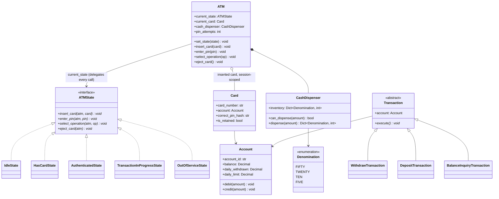
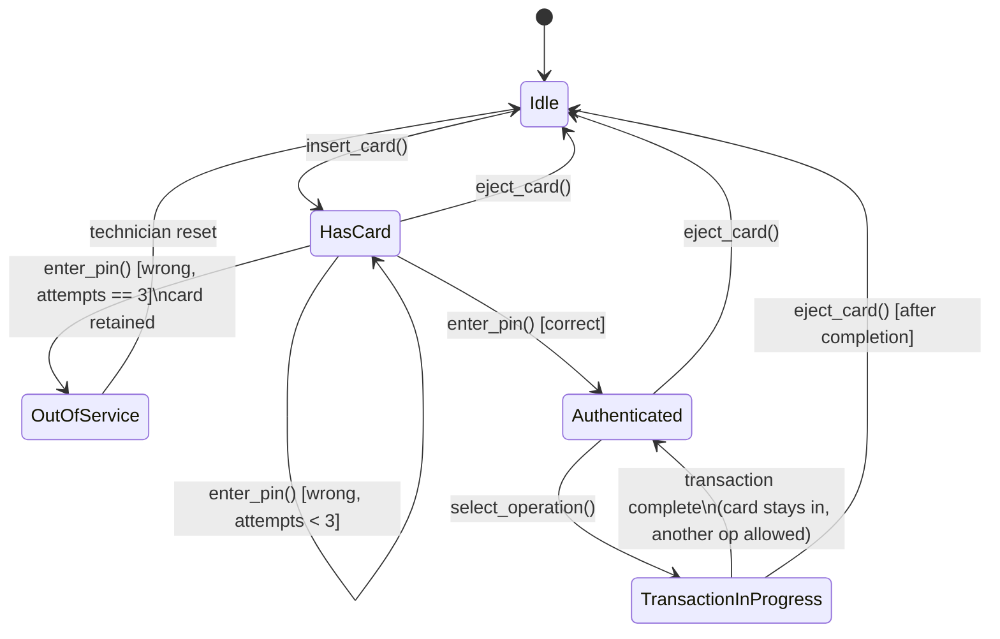

# LLD: ATM

**Difficulty:** Intermediate | **Time:** 40–50 minutes

!!! note "Instructions"
    Design it yourself first — entities, classes, relationships — before reading past step 3. This page follows the [9-step approach](../low-level-design/index.md#the-9-step-approach-use-it-on-every-problem).

---

## 1. Problem Statement

Design the software for a single ATM machine. It accepts a card, validates a PIN (with a retry limit before the card is retained), lets the authenticated user pick an operation — withdraw, deposit, or check balance — dispenses cash respecting the machine's available denominations and the account's daily withdrawal limit, and must leave both the machine and the account in a consistent state even if something fails mid-transaction, such as the cash-dispensing hardware jamming *after* the account has already been debited.

---

## 2. Requirements

**Functional (in scope):**

- Insert card → enter PIN → select operation → complete or cancel, as a strict sequence
- PIN validation with a retry limit (3 attempts); the card is retained after the limit is exceeded
- Withdraw: validate against account balance, daily withdrawal limit, and the ATM's available cash before dispensing
- Deposit and balance-check operations
- Cash dispensing that resolves a requested amount into physical bills using the ATM's on-hand denominations
- The card can be ejected/the session cancelled at any point before a transaction commits
- A failure between debiting the account and successfully dispensing cash must not lose or fabricate money

**Explicitly out of scope for v1:** multi-bank/interbank routing, contactless or cardless withdrawal, cheque deposits, receipt printing, physical bill-jam recovery hardware protocol (only the software-visible outcome — "dispense failed" — is modeled).

??? question "Clarifying questions worth asking out loud"
    - Is this one ATM's software, or does it also cover the bank's core-banking side (account ledger, fraud checks)? Assume the ATM talks to an `Account`/bank service behind a boundary we control for this exercise, but don't over-model the bank itself.
    - Single currency, single set of denominations, or should the design anticipate multiple cassette types?
    - Is the daily withdrawal limit per-card, per-account, or configurable per ATM (e.g. a stricter cap at an unattended kiosk)?
    - Should a wrong PIN attempt count reset on a successful login later, or does retention apply cumulatively across sessions?
    - Is the "debit then dispense" sequence assumed to be within a single ATM's local process, or could a network partition strand the debit call itself in an unknown state (sent, but response lost)?

---

## 3. Entities

The nouns in the problem statement: `ATM` (the context/controller), `Card`, `Account`, `CashDispenser` (holding `Denomination` counts), `Transaction`, and the `ATMState` hierarchy — `IdleState`, `HasCardState`, `AuthenticatedState`, `TransactionInProgressState`, `OutOfServiceState`.

---

## 4. Class Design





**Why `ATMState` is an interface with one implementing class per state, not one `ATM` class switching on a `current_step: Enum`:** every state supports the *same four verbs* (`insert_card`, `enter_pin`, `select_operation`, `eject_card`), but which ones are legal — and what "legal" even means — differs completely per state. An enum-and-if/else version of `enter_pin()` would need `if current_step == PIN_ENTRY: ... elif current_step == IDLE: raise ... elif current_step == TRANSACTION: raise ...` repeated inside *every one* of the four methods — the state variable and the behavior it gates live in different places, and adding a fifth state means touching four existing methods to add a new branch to each. With `ATMState` as a real interface, `IdleState.enter_pin()` doesn't need an `if` at all — it simply doesn't make sense there, so the method for that state either raises immediately or is left out of that class's responsibility in the reader's mind, and a new state is a wholly new class, not four new branches in existing ones. See [Open/Closed](../low-level-design/solid-principles.md#o-openclosed-principle).

---

## 5. Patterns Applied

- **State** is the headline pattern for this problem — see [Design Patterns](../low-level-design/design-patterns.md). That page doesn't carry a dedicated State section; State is the natural generalization of **Strategy** one step further: Strategy swaps out *one algorithm* (e.g. `PricingStrategy.calculate()`) while the object's other behavior stays fixed, but State swaps out the object's *entire behavior set* at once, and — the part that makes it State rather than just "Strategy with a longer interface" — the currently-active implementation is also responsible for deciding what the *next* active implementation should be. `HasCardState.enter_pin()` doesn't just validate a PIN; on success it calls `atm.set_state(AuthenticatedState())`, and on the third failure it calls `atm.set_state(OutOfServiceState())`. The state transition table lives distributed across the state classes themselves, not centralized in `ATM`. This mirrors [Elevator System](elevator-system.md#5-patterns-applied)'s treatment, except that exercise notes the State pattern only conceptually (gating on an `ElevatorState` enum without dedicated classes per state, because the elevator's states don't each carry distinct multi-method behavior); the ATM earns the *formal* class-per-state version because each state here legitimately overrides multiple methods differently, which is exactly the condition under which the added ceremony of real subclasses pays for itself.
- **Strategy** (minor, arguable) for the cash-dispensing denomination algorithm — `CashDispenser` could be built around a `DispenseStrategy` interface so a greedy largest-denomination-first algorithm can be swapped for an exact-change-preserving one (e.g. one that keeps a healthy mix of small bills for future withdrawals rather than always draining $50s first) without touching `CashDispenser`'s inventory bookkeeping. Not fully built out below because the problem statement only asks for *a* correct dispensing algorithm, not a choice between several — see the same "don't earn a pattern you can't name a pressure for" discipline as [Parking Lot](parking-lot.md#5-patterns-applied) applies to Factory.
- Explicitly **not** Observer for a "notify the bank's fraud system on every PIN failure" hook — a real bank ATM would want this, but it's not named in the problem statement; note it as a plausible v2 extension point (`HasCardState` is exactly where that call would go) rather than building it in speculatively.

---

## 6. Core Code

```python
from abc import ABC, abstractmethod
from dataclasses import dataclass, field
from decimal import Decimal
from enum import Enum
from threading import Lock
from typing import Optional
import uuid


# ---------------------------------------------------------------------------
# Money-holding entities
# ---------------------------------------------------------------------------

class InsufficientFundsError(Exception): ...
class DailyLimitExceededError(Exception): ...


class Account:
    def __init__(self, account_id: str, balance: Decimal, daily_limit: Decimal):
        self.account_id = account_id
        self.balance = balance
        self.daily_limit = daily_limit
        self.daily_withdrawn = Decimal("0")
        self._lock = Lock()                    # guards balance + daily_withdrawn together

    def debit(self, amount: Decimal) -> None:
        """Raises without mutating anything if either check fails — check-then-act, one lock."""
        with self._lock:
            if self.daily_withdrawn + amount > self.daily_limit:
                raise DailyLimitExceededError(
                    f"withdrawing {amount} would exceed daily limit {self.daily_limit}"
                )
            if amount > self.balance:
                raise InsufficientFundsError(f"balance {self.balance} < requested {amount}")
            self.balance -= amount
            self.daily_withdrawn += amount

    def deposit(self, amount: Decimal) -> None:
        """Add new money without changing withdrawal-limit accounting."""
        with self._lock:
            self.balance += amount

    def reverse_debit(self, amount: Decimal) -> None:
        """Compensate a specific failed withdrawal, including its limit consumption."""
        with self._lock:
            self.balance += amount
            self.daily_withdrawn -= amount


@dataclass
class Card:
    card_number: str
    account: Account
    correct_pin_hash: str
    is_retained: bool = False

    def pin_matches(self, pin: str) -> bool:
        # a real implementation hashes with a salt; simplified here for focus on the state machine
        return self.correct_pin_hash == pin


# ---------------------------------------------------------------------------
# Cash dispensing
# ---------------------------------------------------------------------------

class Denomination(Enum):
    FIFTY = 50
    TWENTY = 20
    TEN = 10
    FIVE = 5


class DenominationUnavailableError(Exception): ...
class InsufficientCashError(Exception): ...


class CashDispenser:
    def __init__(self, inventory: dict[Denomination, int]):
        self.inventory = inventory
        self._lock = Lock()

    def _plan(self, amount: Decimal) -> dict[Denomination, int]:
        """Greedy largest-denomination-first breakdown. Doesn't mutate inventory —
        callers must confirm the plan then commit it atomically (see dispense())."""
        remaining = int(amount)
        plan: dict[Denomination, int] = {}
        for denom in sorted(Denomination, key=lambda d: -d.value):
            available = self.inventory.get(denom, 0)
            take = min(remaining // denom.value, available)
            if take:
                plan[denom] = take
                remaining -= take * denom.value
        if remaining != 0:
            # either the ATM is out of the right mix, or the amount isn't representable
            # at all (e.g. $15 with only $20/$50 bills on hand)
            raise DenominationUnavailableError(
                f"cannot represent {amount} with available denominations"
            )
        return plan

    def can_dispense(self, amount: Decimal) -> bool:
        with self._lock:
            try:
                self._plan(amount)
                return True
            except DenominationUnavailableError:
                return False

    def reserve(self, amount: Decimal) -> dict[Denomination, int]:
        """Atomically remove a note plan from available inventory before account debit."""
        with self._lock:
            plan = self._plan(amount)
            for denom, count in plan.items():
                self.inventory[denom] -= count
            return plan

    def release(self, plan: dict[Denomination, int]) -> None:
        """Return a reservation when debit or physical dispensing fails."""
        with self._lock:
            for denom, count in plan.items():
                self.inventory[denom] = self.inventory.get(denom, 0) + count

    def dispense_reserved(self, plan: dict[Denomination, int]) -> dict[Denomination, int]:
        """Hand an already-reserved note plan to the hardware layer."""
        # A real adapter can raise CashDispenseHardwareError here. Inventory was
        # reserved before the debit, so no competing withdrawal can consume it.
        return plan


# ---------------------------------------------------------------------------
# The debit-then-dispense operation, with compensation on hardware failure
# ---------------------------------------------------------------------------

class CashDispenseHardwareError(Exception):
    """Raised by the (simulated) dispenser hardware layer — jam, out of paper track, etc.
    Distinct from InsufficientCashError/DenominationUnavailableError, which are checked
    BEFORE the debit and never leave money in a torn state."""


def perform_withdrawal(account: Account, dispenser: CashDispenser, amount: Decimal) -> dict[Denomination, int]:
    """The 'hard part' of this exercise: money must be neither lost nor duplicated.

    Ordering is deliberate:
      1. Atomically reserve a concrete note plan, removing the TOCTOU gap between
         "can dispense" and "dispense" while concurrent withdrawals are running.
      2. Debit the account — if debit fails, release the reserved notes.
      3. Physically dispense. If this throws, the debit already happened, so we must
         credit the account back (the compensating action) before propagating the error,
         rather than leaving the customer's money gone with no cash in hand.

    This is intentionally NOT a distributed two-phase commit — it's a single process,
    so the compensation step is a plain synchronous call, not a saga with its own
    persistence. The real-world equivalent (ATM crashes between debit and credit-back)
    is why production ATMs log the debit to durable storage BEFORE calling the dispenser,
    so a reconciliation job can find and reverse orphaned debits after a restart — noted
    here, not built, since durable logging is infrastructure, not a class-design concern.
    """
    try:
        plan = dispenser.reserve(amount)          # step 1 — notes cannot be stolen by another withdrawal
    except DenominationUnavailableError as exc:
        raise InsufficientCashError(f"ATM cannot dispense {amount} with current cash on hand") from exc

    try:
        account.debit(amount)                     # step 2 — funds committed to leaving
    except Exception:
        dispenser.release(plan)                   # debit rejected; make the notes available again
        raise

    try:
        return dispenser.dispense_reserved(plan)  # step 3 — physical dispense
    except CashDispenseHardwareError:
        dispenser.release(plan)                   # hardware delivered nothing, so restore both resources
        account.reverse_debit(amount)             # compensating action — undo step 2 exactly
        raise                                     # surface the failure; caller ends the session, doesn't retry blindly


# ---------------------------------------------------------------------------
# The State pattern: one class per ATM state
# ---------------------------------------------------------------------------

class Operation(Enum):
    WITHDRAW = "withdraw"
    DEPOSIT = "deposit"
    BALANCE_INQUIRY = "balance_inquiry"


class IllegalATMOperationError(Exception): ...


class ATMState(ABC):
    """Every state implements the full verb set. A verb that makes no sense in a given
    state raises rather than silently no-op-ing — a caller pressing 'withdraw' with no
    card inserted should get a clear error, not a UI that mysteriously does nothing."""

    @abstractmethod
    def insert_card(self, atm: "ATM", card: Card) -> None: ...

    @abstractmethod
    def enter_pin(self, atm: "ATM", pin: str) -> None: ...

    @abstractmethod
    def select_operation(self, atm: "ATM", operation: Operation, amount: Optional[Decimal] = None) -> None: ...

    @abstractmethod
    def eject_card(self, atm: "ATM") -> None: ...


class IdleState(ATMState):
    def insert_card(self, atm: "ATM", card: Card) -> None:
        if card.is_retained:
            raise IllegalATMOperationError("this card has been retained by an ATM; cannot be used")
        atm.current_card = card
        atm.pin_attempts = 0
        atm.set_state(HasCardState())

    def enter_pin(self, atm: "ATM", pin: str) -> None:
        raise IllegalATMOperationError("no card inserted")

    def select_operation(self, atm: "ATM", operation: Operation, amount: Optional[Decimal] = None) -> None:
        raise IllegalATMOperationError("no card inserted")

    def eject_card(self, atm: "ATM") -> None:
        raise IllegalATMOperationError("no card to eject")


class HasCardState(ATMState):
    MAX_PIN_ATTEMPTS = 3

    def insert_card(self, atm: "ATM", card: Card) -> None:
        raise IllegalATMOperationError("a card is already inserted")

    def enter_pin(self, atm: "ATM", pin: str) -> None:
        assert atm.current_card is not None
        if atm.current_card.pin_matches(pin):
            atm.pin_attempts = 0
            atm.set_state(AuthenticatedState())
            return
        atm.pin_attempts += 1
        if atm.pin_attempts >= self.MAX_PIN_ATTEMPTS:
            atm.current_card.is_retained = True
            retained_card, atm.current_card = atm.current_card, None
            atm.set_state(OutOfServiceState(reason=f"card {retained_card.card_number} retained"))
        # else: stay in HasCardState, caller re-prompts for PIN

    def select_operation(self, atm: "ATM", operation: Operation, amount: Optional[Decimal] = None) -> None:
        raise IllegalATMOperationError("PIN not yet verified")

    def eject_card(self, atm: "ATM") -> None:
        atm.current_card = None
        atm.set_state(IdleState())


class AuthenticatedState(ATMState):
    def insert_card(self, atm: "ATM", card: Card) -> None:
        raise IllegalATMOperationError("a card is already inserted and authenticated")

    def enter_pin(self, atm: "ATM", pin: str) -> None:
        raise IllegalATMOperationError("already authenticated")

    def select_operation(self, atm: "ATM", operation: Operation, amount: Optional[Decimal] = None) -> None:
        atm.set_state(TransactionInProgressState())
        try:
            atm.run_transaction(operation, amount)
        finally:
            # whether the transaction succeeded or raised, the card stays in and the
            # session returns to Authenticated so the customer can do another operation
            atm.set_state(AuthenticatedState())

    def eject_card(self, atm: "ATM") -> None:
        atm.current_card = None
        atm.set_state(IdleState())


class TransactionInProgressState(ATMState):
    """A deliberately narrow state: while a transaction is executing, every verb is
    rejected outright (including eject_card) rather than allowed to interleave with
    a debit/dispense sequence already underway."""

    def insert_card(self, atm: "ATM", card: Card) -> None:
        raise IllegalATMOperationError("transaction in progress")

    def enter_pin(self, atm: "ATM", pin: str) -> None:
        raise IllegalATMOperationError("transaction in progress")

    def select_operation(self, atm: "ATM", operation: Operation, amount: Optional[Decimal] = None) -> None:
        raise IllegalATMOperationError("a transaction is already in progress")

    def eject_card(self, atm: "ATM") -> None:
        raise IllegalATMOperationError("cannot eject card mid-transaction")


class OutOfServiceState(ATMState):
    """Entered on card retention or a technician-triggered fault. No card-facing verb
    succeeds here — the machine needs a technician reset (set_state back to Idle),
    modeled as an operational action outside the customer-facing verb set."""

    def __init__(self, reason: str):
        self.reason = reason

    def insert_card(self, atm: "ATM", card: Card) -> None:
        raise IllegalATMOperationError(f"ATM out of service: {self.reason}")

    def enter_pin(self, atm: "ATM", pin: str) -> None:
        raise IllegalATMOperationError(f"ATM out of service: {self.reason}")

    def select_operation(self, atm: "ATM", operation: Operation, amount: Optional[Decimal] = None) -> None:
        raise IllegalATMOperationError(f"ATM out of service: {self.reason}")

    def eject_card(self, atm: "ATM") -> None:
        raise IllegalATMOperationError(f"ATM out of service: {self.reason}")


class ATM:
    """The context object. Holds shared state (current card, dispenser, PIN attempt
    count) and delegates every customer-facing call to current_state — ATM itself
    contains no branching on 'what step are we at.'"""

    def __init__(self, cash_dispenser: CashDispenser):
        self.cash_dispenser = cash_dispenser
        self.current_state: ATMState = IdleState()
        self.current_card: Optional[Card] = None
        self.pin_attempts = 0

    def set_state(self, state: ATMState) -> None:
        self.current_state = state

    def insert_card(self, card: Card) -> None:
        self.current_state.insert_card(self, card)

    def enter_pin(self, pin: str) -> None:
        self.current_state.enter_pin(self, pin)

    def select_operation(self, operation: Operation, amount: Optional[Decimal] = None) -> None:
        self.current_state.select_operation(self, operation, amount)

    def eject_card(self) -> None:
        self.current_state.eject_card(self)

    def run_transaction(self, operation: Operation, amount: Optional[Decimal]) -> None:
        assert self.current_card is not None
        account = self.current_card.account
        if operation is Operation.WITHDRAW:
            assert amount is not None
            perform_withdrawal(account, self.cash_dispenser, amount)
        elif operation is Operation.DEPOSIT:
            assert amount is not None
            account.deposit(amount)
        elif operation is Operation.BALANCE_INQUIRY:
            pass  # read-only; ATM class or caller reads account.balance directly
```

---

## 7. Edge Cases

| Case | Handling |
|------|----------|
| Wrong PIN 3 times | `HasCardState.enter_pin` increments `pin_attempts`; on the 3rd failure it sets `card.is_retained = True`, clears `atm.current_card`, and transitions to `OutOfServiceState` — the card is gone from the machine's session and physically retained |
| Insufficient account funds | `Account.debit` raises `InsufficientFundsError` before any balance mutation — checked and rejected atomically inside the account's own lock |
| ATM has insufficient cash to fulfill an otherwise-valid withdrawal | `perform_withdrawal` atomically reserves a concrete note plan *before* touching the account. If no plan exists, reservation fails and the customer's balance is never debited |
| Requested amount not representable by available denominations (e.g. $15 with only $20/$50 bills) | `CashDispenser._plan` raises `DenominationUnavailableError` when the greedy breakdown leaves a nonzero remainder; `perform_withdrawal` translates it to `InsufficientCashError` before debit |
| Power/hardware failure between debit and dispense | The handler releases the reserved notes and calls `account.reverse_debit(amount)` before propagating a software-visible hardware failure — see [Core Code](#6-core-code) for why process or power loss still requires durable reconciliation |
| Card removed mid-transaction | Structurally prevented, not handled after the fact — `TransactionInProgressState.eject_card` raises rather than allowing it; the physical card reader is assumed to not release the card until the state machine returns to `AuthenticatedState` or `IdleState` |

---

## 8. Concurrency

The same `Account` can be touched by this ATM's withdrawal and, simultaneously, a mobile-app transfer hitting the bank's core system directly. Two concurrent withdrawal requests racing past a balance check on the same account is the textbook [race condition](../low-level-design/concurrency-basics.md#race-conditions): both read `balance = 100`, both see "withdraw 80 is fine," both proceed, and the account ends up at -60.

`Account.debit` closes this the same way `ParkingSpot.try_occupy` does in [Parking Lot](parking-lot.md#8-concurrency): the balance/limit check and the mutation are collapsed into one critical section under a single per-account [lock](../low-level-design/concurrency-basics.md#locks), so "check daily limit and balance" and "subtract" happen atomically — a second concurrent `debit()` call blocks until the first one has either committed its subtraction or raised without mutating anything, and then sees the *updated* balance, not the stale pre-debit one.

**Why per-account locking, not a global bank-wide lock:** two different customers withdrawing from two different accounts at two different ATMs must not serialize against each other — only concurrent operations on the *same* account need to be mutually exclusive.

**Compare-and-set alternative:** if `Account` lived behind a distributed core-banking service rather than in-process, a lock wouldn't be available across machines — the equivalent fix there is an atomic compare-and-set on balance (`UPDATE accounts SET balance = balance - :amt WHERE account_id = :id AND balance >= :amt`, checking rows-affected), which gets the same "check and mutate as one indivisible step" guarantee without a shared in-memory lock. The `Account.debit` method above is written as if this ATM has exclusive in-process access to the `Account` object; in a real deployment the ATM would call an account service that implements one of these two guarantees internally, and `perform_withdrawal`'s compensation logic (credit back on dispense failure) stays identical either way — it's a property of the *withdrawal sequence*, not of how the account happens to enforce atomicity.

---

## 9. Extensibility

| New requirement | What changes | What doesn't |
|---|---|---|
| Deposit with cash counting (validate physical bills inserted match claimed amount) | New logic inside `DepositTransaction`/`AuthenticatedState.select_operation`'s deposit branch, plus a bill-counting hardware adapter | `ATMState` interface, `CashDispenser`, withdrawal logic |
| "Transfer between accounts" operation | New `Operation.TRANSFER` value handled in `ATM.run_transaction`, reusing `Account.debit`/`credit` on two accounts (with the same lock-ordering discipline as any two-account operation — see the deadlock note below) | `ATMState` classes — the state machine doesn't care *which* transaction type is running once it's inside `TransactionInProgressState` |
| Multi-bank/interbank ATM support | `Account` becomes an interface with a local implementation and a remote-bank-API implementation behind it; `Card` gains a bank identifier used to route to the right one | `ATMState` hierarchy, `CashDispenser`, `ATM`'s delegation logic |
| Contactless/cardless withdrawal via phone | New entry point that constructs a session without going through `IdleState.insert_card` — e.g. a `begin_cardless_session(otp)` that lands directly in `AuthenticatedState` — the rest of the state machine (operation selection, transaction execution, compensation) is reused unchanged | `TransactionInProgressState`, `CashDispenser`, `perform_withdrawal` |

!!! note "The transfer-between-accounts extension is where the deadlock lesson from Parking Lot reappears"
    A transfer needs to lock two `Account` objects at once (debit one, credit the other, atomically). Just like the [valet-swap staff question in Parking Lot](parking-lot.md#interview-questions), locking them in call-site argument order risks deadlock if two transfers run concurrently in opposite directions — the fix is the same: always acquire locks in a consistent order (e.g. sort by `account_id`), never by argument position. See [Deadlocks](../low-level-design/concurrency-basics.md#deadlocks).

---

## Interview Questions

=== "Foundation"
    **Q: Why does `ATM.insert_card()` just delegate to `self.current_state.insert_card(self, card)` instead of `ATM` checking `if self.current_card is None` itself?**

    "Because 'is a card already inserted' isn't the only rule that decides whether `insert_card` should succeed — in `OutOfServiceState`, for example, it must fail even with no card present, for a completely different reason. If `ATM` centralized these checks, every verb's method would grow its own little `if current_state == X: ... elif current_state == Y: ...` block, and that logic would live far from the state it's actually about. Delegating to `current_state` means each state class only has to answer 'does this verb make sense *for me*,' and `ATM` itself stays a thin dispatcher with no branching logic to get wrong."

=== "Senior"
    **Q: Your `HasCardState.enter_pin()` mutates `atm.pin_attempts` and can call `atm.set_state(...)` from inside a method on the *old* state object. Isn't it strange for a state to be the one deciding what the next state is?**

    "It's actually the defining feature of State versus a simpler pattern like Strategy — a `PricingStrategy` never decides to swap itself out, but an ATM state legitimately needs to, because the *outcome* of the current action determines what's legal next, and only the current state has enough context to know that outcome. `HasCardState` is uniquely positioned to know 'this was the 3rd wrong PIN' the instant it happens; if I made `ATM` responsible for deciding transitions instead, `ATM` would need to re-derive that same context — attempt count, which state we're leaving, what event just happened — duplicating logic the state class already has for free. The one discipline I keep is that state classes only ever call `atm.set_state()`, never reach into another state class's internals — so the *transition* is centralized through one seam even though the *decision* of which transition is distributed."

=== "Staff"
    **Q: Walk me through what happens if the ATM loses power exactly between `account.debit(amount)` succeeding and `dispenser.dispense_reserved(plan)` completing. How do you guarantee the customer's money is neither lost nor duplicated?**

    "In the code as written, that window is protected by a `try`/`except CashDispenseHardwareError` that releases the reserved notes and reverses the debit if dispensing throws — but that only covers a *software-visible* failure, like the dispenser reporting a jam. A power loss is worse: the process dies mid-sequence, so there's no `except` block left to run at all, and on restart the ATM has no memory of ever having called `debit()`. The real fix is the same idea as the compare-and-set discussion in Concurrency, pushed one level further: before calling `dispenser.dispense_reserved()`, persist a durable record — 'debit of $X against account Y, dispense pending' — to storage that survives the crash, not just to an in-memory variable. On restart, a reconciliation process scans for any transaction left in `dispense pending` state and either confirms the cash was physically dispensed (via the dispenser's own audit log, which is separate hardware with its own count) or issues the compensating reversal. That's the same shape as a saga pattern in distributed systems — each step needs a recorded intent *before* it executes and a defined compensating action if the next step never confirms — except here it's scoped to a single machine's local disk rather than a network of services. The property I'm protecting is invariant regardless of failure mode: at every observable point, `debited_amount` must equal `dispensed_amount` plus `pending_compensation`, and the durable log is what lets me re-establish that after a crash, since in-memory state alone can't survive one."

---

## Key Takeaways

!!! success "Remember"
    1. State earns its own class hierarchy (not just an enum) when each state legitimately overrides *multiple* methods differently — the ATM's four verbs behave differently across five states, which is exactly that condition
    2. State is Strategy generalized: instead of swapping one algorithm, you swap the object's whole behavior set, and the current state is trusted to decide the next one
    3. Reserving a concrete note plan before `account.debit()` removes the check/use race between concurrent withdrawals; releasing that reservation plus `reverse_debit()` compensates a software-visible hardware failure
    4. In-process atomicity (a lock) and cross-service atomicity (compare-and-set) protect the same invariant — no concurrent withdrawal should observe a stale balance — just at different layers of the stack
    5. A crash-safe version of debit-then-dispense needs a durable, recoverable record of intent before the risky step, not just a try/except — that's the difference between "the fault I anticipated" and "the fault that kills the process"

**Previous:** [Splitwise](splitwise.md) | **Next:** [Vending Machine](vending-machine.md)
