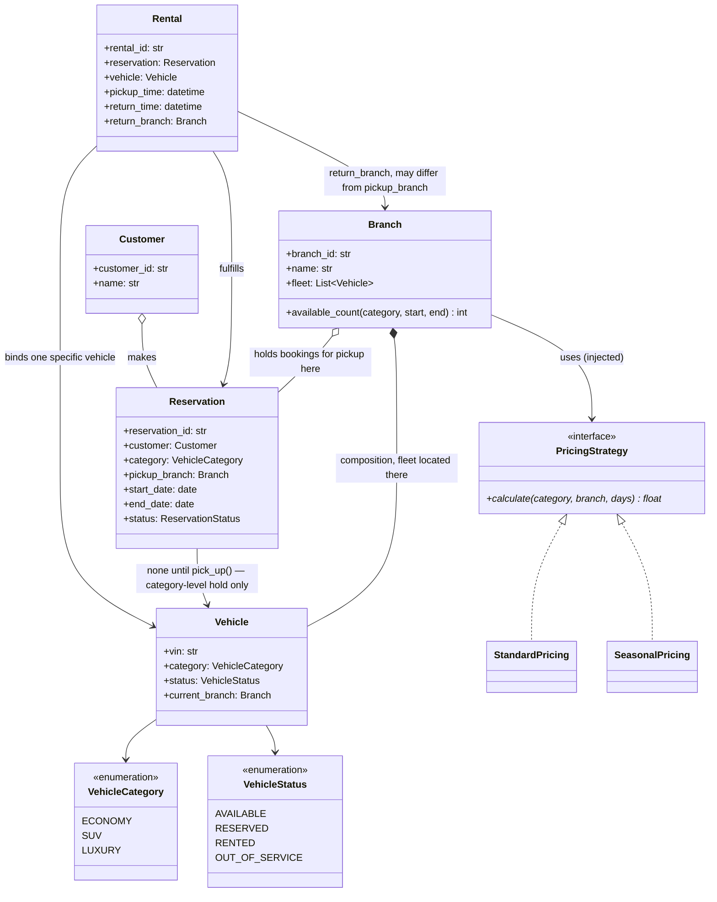

# LLD: Car Rental

**Difficulty:** Intermediate | **Time:** 40–50 minutes

!!! note "Instructions"
    Design it yourself first — entities, classes, relationships — before reading past step 3. This page follows the [9-step approach](../low-level-design/index.md#the-9-step-approach-use-it-on-every-problem).

---

## 1. Problem Statement

Design a car rental system for a company with multiple branches (physical pickup/drop-off locations). Each branch has a fleet of vehicles across categories (economy, SUV, luxury). A customer searches availability for a category, a branch, and a date range; if available, they make a reservation. On the reservation's start date, the customer picks up a specific vehicle, converting the reservation into an active rental. The vehicle is returned — possibly at a different branch than it was picked up from (a one-way rental) — closing out the rental. Pricing varies by category, rental duration, and branch.

---

## 2. Requirements

**Functional (in scope):**

- Multiple branches, each holding a fleet of vehicles across categories (economy, SUV, luxury)
- `search_availability(category, branch, start_date, end_date)` — how many vehicles of that category are free for the whole window
- `reserve(...)` — hold a vehicle of a category for a date range without binding a specific VIN yet
- `pick_up(reservation)` — binds a specific in-branch vehicle to the reservation and starts an active `Rental`
- `return_vehicle(rental, return_branch)` — closes the rental; `return_branch` may differ from the pickup branch (one-way rental)
- Pricing varies by category, duration, and branch

**Explicitly out of scope for v1:** payment processing, insurance/add-on products (touched on in Extensibility), loyalty tiers (Extensibility), fleet rebalancing logistics for one-way imbalance (Edge Cases notes it as a business problem, not this system's job), damage assessment workflow beyond marking a vehicle out of service.

??? question "Clarifying questions worth asking out loud"
    - Are one-way rentals (pickup branch != return branch) allowed, or is every rental round-trip to the same branch?
    - What's the overbooking policy — is a reservation a hard guarantee of *a* vehicle in that category, or just of *availability at time of booking* (which a same-day cancellation could still break)?
    - Does the customer get a guaranteed *specific* vehicle, or just a guaranteed *category* (with vehicle assigned at pickup)?
    - Insurance and add-ons (GPS, child seat) — priced per-item on top of the base rate, or out of scope for v1?
    - Does a reservation expire if the customer doesn't show up by some cutoff (a no-show hold)?

---

## 3. Entities

`Vehicle`, `VehicleCategory`, `Branch`, `Customer`, `Reservation` (a category+date-range hold, no specific vehicle bound yet), `Rental` (an active, post-pickup binding of one `Vehicle` to one `Reservation`), `PricingStrategy`.

---

## 4. Class Design

```mermaid
stateDiagram-v2
    [*] --> HELD : reserve()
    HELD --> PICKED_UP : pick_up()\n(binds a Vehicle, starts a Rental)
    HELD --> CANCELLED : cancel()
    HELD --> NO_SHOW : start_date passes, never picked up\n(v1 gap — no automatic sweep, see Edge Cases)
    PICKED_UP --> [*] : return_vehicle()\n(closes the Rental; reservation stays PICKED_UP)
    CANCELLED --> [*]
    NO_SHOW --> [*]
```





**Why `Branch *-- Vehicle` is composition, but `Vehicle.current_branch` still changes over time:** a vehicle is physically located at exactly one branch at any instant and is meaningless outside some branch's fleet — that's the composition test from [Class Relationships](../low-level-design/solid-principles.md#class-relationships-uml-basics). What's *unusual* compared to [Parking Lot](parking-lot.md)'s simpler composition (`Level *-- ParkingSpot`, spots never move levels) is that a one-way rental moves a `Vehicle` from one composing `Branch` to another as a side effect of `return_vehicle()`. This is still composition, not aggregation — the vehicle doesn't "outlive" branch ownership the way a `Ticket` outlives being tracked by a lot — but it's composition with a **transfer operation**: `return_vehicle` must remove the vehicle from the pickup branch's fleet and add it to the return branch's fleet atomically, or the vehicle would transiently appear in neither (or both) fleets. That's the one real structural twist this problem has over parking-lot's model.

**Why `Reservation` doesn't reference a `Vehicle` directly:** at booking time, the customer is guaranteed a *category*, not a specific VIN — which specific car they get is decided at `pick_up()`, when a concrete vehicle from that branch's fleet is bound. This mirrors why `search_availability` counts by category rather than checking individual vehicles one by one (see Patterns Applied below). `Rental` is the class that finally holds a real `Vehicle` reference.

---

## 5. Patterns Applied

- **Strategy** for `PricingStrategy` — rate varies by category, duration, branch, and plausibly season/demand, which is exactly the "real variation point" test: `Branch`/`Rental` depend on the interface, and a new pricing scheme (seasonal, surge) is a new class with zero edits to the rental flow. See [Design Patterns](../low-level-design/design-patterns.md#strategy-swap-the-algorithm-without-touching-the-class-that-uses-it).
- **The actual crux of this problem isn't a GoF pattern — it's date-range overlap checking**, and it deserves the same weight parking-lot gives concurrency. Two designs are worth naming explicitly, because the choice has real cost implications:
    - **Per-vehicle interval tracking:** each `Vehicle` (or the branch, keyed by VIN) keeps a sorted list of `(start_date, end_date)` reservation intervals. Checking whether *this specific* vehicle is free for `[start, end)` means checking that `[start, end)` doesn't overlap any existing interval — `O(log n)` with a sorted structure (bisect to the insertion point, check the immediate neighbors), or `O(n)` with a naive scan. This is necessary if the business promises a *specific* vehicle to a customer (e.g., a VIP always gets the same car).
    - **Per-category count-based availability (the approach taken here):** if the customer only cares about *category*, not *which specific car*, you don't need to check every vehicle's individual calendar — you only need to know how many units of that category are booked for any date that overlaps `[start, end)`, and compare against fleet size. This is the standard interview answer for "count-based inventory" and is what `search_availability` implements below: maintain reservations per category (not per VIN) and count overlaps, rather than doing an `O(vehicles × reservations_per_vehicle)` scan. Concrete VIN assignment is deferred to `pick_up()`, which only needs to find *one* free vehicle in the category at that moment — a much cheaper check than validating the whole future window per vehicle.
    - Two overlapping date ranges `[a_start, a_end)` and `[b_start, b_end)` overlap iff `a_start < b_end and b_start < a_end` — the standard half-open-interval overlap test, used identically in both approaches.

---

## 6. Core Code

```python
from abc import ABC, abstractmethod
from dataclasses import dataclass, field
from datetime import date, datetime
from enum import Enum, auto
from threading import Lock
import uuid


class VehicleCategory(Enum):
    ECONOMY = auto()
    SUV = auto()
    LUXURY = auto()


class VehicleStatus(Enum):
    AVAILABLE = auto()
    RESERVED = auto()
    RENTED = auto()
    OUT_OF_SERVICE = auto()


class ReservationStatus(Enum):
    HELD = auto()
    PICKED_UP = auto()
    CANCELLED = auto()
    NO_SHOW = auto()


def date_ranges_overlap(a_start: date, a_end: date, b_start: date, b_end: date) -> bool:
    # half-open intervals: end date is the return day, not itself occupied
    return a_start < b_end and b_start < a_end


class Vehicle:
    def __init__(self, vin: str, category: VehicleCategory, branch: "Branch"):
        self.vin = vin
        self.category = category
        self.status = VehicleStatus.AVAILABLE
        self.current_branch = branch


@dataclass
class Customer:
    customer_id: str
    name: str


@dataclass
class Reservation:
    reservation_id: str
    customer: Customer
    category: VehicleCategory
    pickup_branch: "Branch"
    start_date: date
    end_date: date
    status: ReservationStatus = ReservationStatus.HELD


@dataclass
class Rental:
    rental_id: str
    reservation: Reservation
    vehicle: Vehicle
    pickup_time: datetime
    return_time: datetime | None = None
    return_branch: "Branch | None" = None


class PricingStrategy(ABC):
    @abstractmethod
    def calculate(self, category: VehicleCategory, branch: "Branch", days: int) -> float: ...


class StandardPricing(PricingStrategy):
    DAILY_RATE = {VehicleCategory.ECONOMY: 30.0, VehicleCategory.SUV: 55.0, VehicleCategory.LUXURY: 120.0}

    def calculate(self, category: VehicleCategory, branch: "Branch", days: int) -> float:
        return round(self.DAILY_RATE[category] * days, 2)


class Branch:
    def __init__(self, branch_id: str, name: str, pricing: PricingStrategy):
        self.branch_id = branch_id
        self.name = name
        self.pricing = pricing                      # injected — see Dependency Inversion
        self.fleet: list[Vehicle] = []
        # category -> list of (start_date, end_date) for HELD/PICKED_UP reservations
        self._reservation_intervals: dict[VehicleCategory, list[tuple[date, date]]] = {}
        self._lock = Lock()

    def add_vehicle(self, vehicle: Vehicle) -> None:
        self.fleet.append(vehicle)

    def _fleet_size(self, category: VehicleCategory) -> int:
        # only vehicles physically able to serve a rental count toward capacity
        return sum(1 for v in self.fleet if v.category == category and v.status != VehicleStatus.OUT_OF_SERVICE)

    def _booked_overlap_count(self, category: VehicleCategory, start: date, end: date) -> int:
        intervals = self._reservation_intervals.get(category, [])
        return sum(1 for (s, e) in intervals if date_ranges_overlap(start, end, s, e))

    def available_count(self, category: VehicleCategory, start: date, end: date) -> int:
        """Count-based check: fleet size for the category minus reservations
        that overlap this window — O(reservations in this category), not
        O(vehicles x reservations per vehicle), since we never inspect
        individual vehicle calendars until pick_up()."""
        with self._lock:
            return self._fleet_size(category) - self._booked_overlap_count(category, start, end)

    def reserve(self, customer: Customer, category: VehicleCategory, start: date, end: date) -> Reservation:
        if start >= end:
            raise ValueError("start_date must be before end_date")
        with self._lock:                              # check-then-decrement must be atomic
            available = self._fleet_size(category) - self._booked_overlap_count(category, start, end)
            if available <= 0:
                raise ValueError(f"no {category.name} vehicles available at {self.name} for that window")
            self._reservation_intervals.setdefault(category, []).append((start, end))

        return Reservation(
            reservation_id=str(uuid.uuid4()),
            customer=customer,
            category=category,
            pickup_branch=self,
            start_date=start,
            end_date=end,
        )

    def pick_up(self, reservation: Reservation, now: datetime | None = None) -> Rental:
        if reservation.status != ReservationStatus.HELD:
            raise ValueError(f"reservation {reservation.reservation_id} is not in a pickup-able state")
        if reservation.pickup_branch is not self:
            raise ValueError("reservation must be picked up at its pickup_branch")

        with self._lock:
            candidate = next(
                (v for v in self.fleet
                 if v.category == reservation.category and v.status == VehicleStatus.AVAILABLE),
                None,
            )
            if candidate is None:
                # count said one was free, but every AVAILABLE unit in this category
                # is either mid-rental on an earlier leg or out of service — inventory drifted
                raise RuntimeError("no vehicle physically free to bind despite a held reservation")
            candidate.status = VehicleStatus.RENTED
            reservation.status = ReservationStatus.PICKED_UP

        return Rental(
            rental_id=str(uuid.uuid4()),
            reservation=reservation,
            vehicle=candidate,
            pickup_time=now or datetime.now(),
        )

    def cancel(self, reservation: Reservation) -> None:
        with self._lock:
            if reservation.status != ReservationStatus.HELD:
                raise ValueError("only a HELD reservation can be cancelled")
            intervals = self._reservation_intervals.get(reservation.category, [])
            intervals.remove((reservation.start_date, reservation.end_date))
            reservation.status = ReservationStatus.CANCELLED


def return_vehicle(rental: Rental, return_branch: Branch, now: datetime | None = None) -> float:
    """Close out a rental, possibly at a different branch than pickup (one-way)."""
    if rental.return_time is not None:
        raise ValueError(f"rental {rental.rental_id} was already closed out")

    rental.return_time = now or datetime.now()
    rental.return_branch = return_branch
    days = max(1, (rental.return_time.date() - rental.pickup_time.date()).days)
    fee = return_branch.pricing.calculate(rental.vehicle.category, rental.reservation.pickup_branch, days)

    vehicle = rental.vehicle
    pickup_branch = rental.reservation.pickup_branch
    if return_branch is not pickup_branch:
        pickup_branch.fleet.remove(vehicle)          # transfer: composition moves with the vehicle
        return_branch.fleet.append(vehicle)
        vehicle.current_branch = return_branch

    vehicle.status = VehicleStatus.AVAILABLE
    return fee
```

---

## 7. Edge Cases

| Case | Handling |
|------|----------|
| Two customers reserve the last available car in a category for overlapping dates | `Branch.reserve()` wraps the availability check and interval insertion in one critical section (see Concurrency) — the second caller's check runs after the first's interval is already recorded, so it correctly sees zero available and is rejected |
| Reservation not picked up by the start date (no-show) | v1 as written has no automatic expiry — the interval stays booked forever unless explicitly cancelled. State this as a gap: a real system needs a no-show cutoff job that transitions `HELD` → `NO_SHOW` and removes the interval after some grace period past `start_date` |
| Return at a different branch than pickup (one-way) | `return_vehicle` explicitly supports this — it transfers the `Vehicle` between `Branch.fleet` lists. The resulting fleet imbalance (all cars end up at the airport branch, none downtown) is a real operational problem but is out of scope for *this* system — it's a fleet-logistics/rebalancing concern, not a correctness concern here (see Extensibility) |
| Vehicle damaged or taken out of service mid-reservation-window | Setting `vehicle.status = OUT_OF_SERVICE` removes it from `_fleet_size()`'s count immediately, but any *reservation intervals already held* against that category are untouched — if that pushes booked count above adjusted fleet size, the branch is now oversold for that window and needs a real mitigation path (reassign from another vehicle in the category, or contact the affected customer); the count-based model doesn't self-heal this automatically, and that limitation is worth naming |
| Extending an active rental when another reservation is queued for that vehicle right after | `pick_up()` only checks `VehicleStatus`, not future reservations against that specific VIN — because reservations are category-level, not VIN-level, there's no direct link from "this vehicle" to "the next reservation waiting on it." An extension request should re-run `available_count` for the category over the extended window before approving, exactly like a fresh `reserve()` — if the category is at capacity because this same vehicle is the one covering that other booking, the extension must be rejected even though the *physical* car is sitting right there |

---

## 8. Concurrency

Two customers both call `reserve()` for the last available unit of a category, for overlapping windows, at the same instant. The hazard is identical in shape to [Parking Lot](parking-lot.md#8-concurrency)'s spot double-booking, but the resource being contended is a *count derived from an interval scan*, not a single boolean flag — which makes the check-then-act window larger and more tempting to get wrong.

**Why the whole check-then-insert must be one critical section, not two calls:** if `available_count()` and "append the interval" were separate calls (e.g., caller checks availability, then calls a separate `add_reservation()`), two threads could both read "1 available" before either has inserted its interval, and both would proceed — an overbooked category. `Branch.reserve()` above closes this the same way `ParkingSpot.try_occupy()` did: one `Lock` wraps both the read (`_fleet_size` minus `_booked_overlap_count`) and the write (appending to `_reservation_intervals`), so the second caller's check necessarily observes the first caller's reservation. This is the [race condition](../low-level-design/concurrency-basics.md#race-conditions) this design has to close, and a per-branch-per-category lock (rather than a lock per interval) is the right granularity — fine enough that reservations against *different* categories or *different* branches never contend, coarse enough that the count-then-insert can't be observed mid-update.

**Alternative: optimistic concurrency instead of a held lock.** Rather than blocking, attach a version number to each category's interval list; `reserve()` reads the count and version without a lock, builds the new interval, then does a compare-and-swap ("only commit if the version is still what I read") and retries on conflict. This trades a blocking [lock](../low-level-design/concurrency-basics.md#locks) for a retry loop — worth it if reservation contention on a single popular category is high enough that pessimistic locking becomes a throughput bottleneck, but it's a strict complexity increase over the lock-based version above, so it should be named as a scaling response to a measured problem, not a default.

**What this does *not* protect against:** `reserve()`'s lock guarantees no two reservations overbook the category at booking time — it says nothing about `pick_up()` finding a physical vehicle later, which is a separate critical section on the same `_lock`. The "vehicle damaged mid-window" edge case above is exactly the gap this leaves: the count-based guarantee is only as good as the fleet count staying accurate between `reserve()` and `pick_up()`.

---

## 9. Extensibility

| New requirement | What changes | What doesn't |
|---|---|---|
| Loyalty/membership tiers with different pricing | New `PricingStrategy` implementation that takes the customer's tier into account (or wraps a base strategy and applies a discount) | `Branch.reserve`, `pick_up`, `return_vehicle` |
| Insurance and add-on products | `Reservation`/`Rental` gains a list of add-ons, each with its own price, summed alongside `PricingStrategy.calculate` at checkout | The category-availability counting logic |
| Dynamic/surge pricing by demand | New `PricingStrategy` that reads current `available_count` for the category/window and scales the rate — composes naturally since pricing is already decoupled from availability | `Branch`'s reservation/interval machinery |
| Fleet rebalancing recommendations for one-way imbalance | A new reporting/analytics component reading `Vehicle.current_branch` distribution across the network and suggesting transfers — sits *above* this system, doesn't touch `reserve`/`pick_up`/`return_vehicle` | `Rental`, `Branch`, `Vehicle` themselves |

---

## Interview Questions

=== "Foundation"
    **Q: Why doesn't `Reservation` hold a reference to a specific `Vehicle`?**

    "Because at booking time the customer is only guaranteed a *category* — economy, SUV, luxury — not a specific VIN. Which physical car they get is decided later, at pickup, when I bind one from whatever's actually sitting at the branch that day. If `Reservation` held a `Vehicle` reference from the moment of booking, I'd either have to pick a specific car way ahead of time (wasteful — that car can't serve any other overlapping booking even though the customer doesn't care which car it is) or the reference would be meaningless until pickup anyway. `Rental` is the class that finally holds a real `Vehicle`, because that's the point where a specific car's identity actually matters."

=== "Senior"
    **Q: Two customers both try to book the last SUV at a branch for overlapping dates, at the same time. Walk through how your design prevents both from succeeding.**

    "`Branch.reserve()` wraps the entire read-then-write in one lock: it computes `available = fleet_size - booked_overlap_count` and, if positive, appends the new interval, all inside the same critical section. Both threads might both read the branch's SUV state, but only one acquires the lock first — it sees one SUV available, inserts its interval, and releases. The second thread then acquires the lock, recomputes availability, and now sees the interval the first thread just added counted against it — zero available, rejected. The key discipline, same as `ParkingSpot.try_occupy` in Parking Lot, is that I never let 'check availability' and 'commit the reservation' be two separate lock acquisitions — that gap is exactly where the race would live."

=== "Staff"
    **Q: You modeled availability as a per-category count rather than tracking each vehicle's individual calendar. What did that cost you, and when would you switch?**

    "Per-category counting is cheap to query — `search_availability` is one scan over that category's reservation intervals, independent of fleet size, and I never touch an individual vehicle's history until `pick_up()` needs to bind one concrete VIN. The cost is that I've given up the ability to promise a customer *that specific car* ahead of time — if a VIP always wants the same Model X, or the business wants to guarantee 'the car you drove last time' for a repeat renter, per-category counting can't express that, because reservations aren't tied to a VIN until pickup, and which VIN they get is essentially whichever one happens to be `AVAILABLE` in the branch at that moment.

    The alternative — per-vehicle interval tracking, where each VIN has its own sorted list of booked ranges — buys back that guarantee: I can reserve *this exact car* for a window and check overlap against just its own calendar. But it's strictly more expensive to query at scale: `search_availability` for a category now means checking every vehicle in that category's individual calendar rather than one aggregate count, and it also removes the flexibility count-based booking gives operations (any of N interchangeable cars can cover a given reservation, so a vehicle going out of service doesn't necessarily break a specific promise — it only breaks the aggregate count).

    I'd switch to per-vehicle tracking the moment a real product requirement names vehicle-identity guarantees — a loyalty tier promising 'your car,' or corporate accounts reserving a fleet of specific VINs by plate number. Absent that, per-category counting is the right default: cheaper to query, and it degrades gracefully (fewer available units, not broken promises) when a vehicle goes out of service. This is the same 'don't build the more expensive abstraction until the requirement earns it' discipline as not reaching for Strategy or per-vehicle locking before the problem statement asks for it."

---

## Key Takeaways

!!! success "Remember"
    1. `Reservation` (category + date range) and `Rental` (a bound, specific `Vehicle`) are deliberately separate classes — vehicle identity doesn't matter until pickup, and collapsing them forces an early, unnecessary VIN commitment.
    2. The core algorithmic problem is date-range overlap, not a GoF pattern — decide up front whether availability needs to be per-vehicle (identity guarantees) or per-category count (cheaper, more flexible), and be explicit about which one you're building and why.
    3. `Branch.reserve()`'s check-then-insert must be one atomic critical section — same shape as `ParkingSpot.try_occupy()`, just guarding a derived count instead of a single flag.
    4. A one-way return is a `Vehicle` transfer between two composing `Branch` fleets — must be atomic (remove from one, add to the other) or the vehicle transiently belongs to neither or both.
    5. Strategy for pricing is earned because rate is explicitly named as varying by category, duration, and branch — and it composes cleanly with later surge/loyalty pricing without touching the reservation machinery.
    6. Count-based availability can drift from physical reality (a vehicle taken out of service after being counted as available) — name that gap rather than pretending the count is a hard guarantee.

**Previous:** [Chess](chess.md) | **Next:** [Rate Limiter (LLD)](rate-limiter.md)
