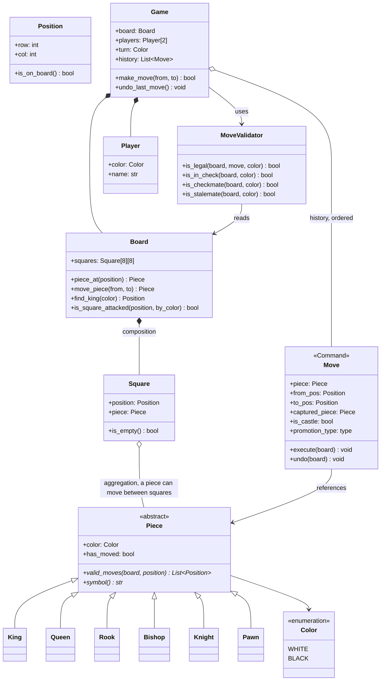
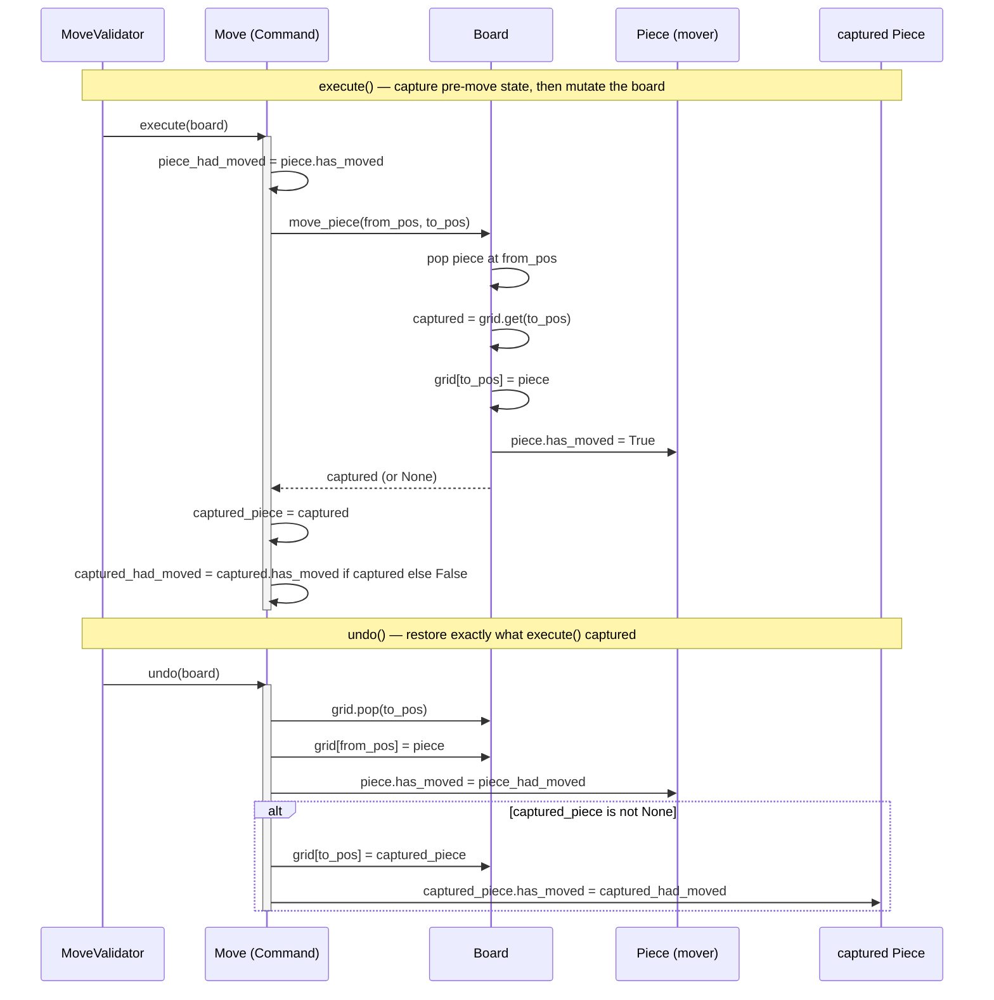

# LLD: Chess

**Difficulty:** Intermediate | **Time:** 45–60 minutes

!!! note "Instructions"
    Design it yourself first — entities, classes, relationships — before reading past step 3. This page follows the [9-step approach](../low-level-design/index.md#the-9-step-approach-use-it-on-every-problem).

---

## 1. Problem Statement

Design a two-player chess engine: an 8x8 board, standard piece movement and capture rules, check and checkmate detection, and a move history that supports undo.

**Scope boundary, stated up front:** this is the rules engine, not a tournament system. No chess clocks, no player ratings, no PGN network protocol, no AI opponent in the base version (it comes up in Extensibility). The two genuinely hard parts of this problem — the ones worth spending most of your interview time on — are **check detection** (deciding whether a square, specifically the king's square, is under attack) and **undo** (reversing a move cleanly, including its side effects like captures). Everything else is bookkeeping around those two.

---

## 2. Requirements

**Functional (in scope):**

- 8x8 board, standard starting position, alternating turns (White moves first)
- Legal movement and capture rules for all six piece types
- Check detection: is the side-to-move's king currently attacked?
- Checkmate detection: is the side-to-move in check with no legal move that escapes it?
- Stalemate detection: is the side-to-move *not* in check but has no legal move at all?
- Move history with **undo** (Command pattern — see Section 5)
- **Castling** (kingside and queenside, with all its preconditions)
- **Pawn promotion** (a pawn reaching the back rank must become a Queen/Rook/Bishop/Knight)

**Explicitly out of scope for v1:** en passant (name it as a known gap — same shape as castling, a special-cased pawn capture, but skipped here to keep the code sample focused), threefold repetition and the fifty-move rule (draw conditions — mentioned in Edge Cases as a stretch goal), chess clocks/timers (Extensibility), an AI opponent (Extensibility), PGN/algebraic notation export (Extensibility), tournament rules (touch-move, illegal-move penalties).

**Why castling and promotion are in scope but en passant isn't:** castling and pawn promotion are the two special rules interviewers ask about most often as follow-ups — leaving them out invites "what about castling?" as the very next question, so build the seam for them now. En passant is rarer as a follow-up and has the same *shape* of solution (a move that captures a piece not standing on the destination square, requiring the `Move` object to record more than "from/to"), so naming it as a one-line extension is enough; implementing all three would triple the code sample without teaching anything new.

??? question "Clarifying questions worth asking out loud"
    - Is this a two-player local game (shared board, alternating input) or does it need to support a networked/online setup? (Assume local for the base design; touched on in Concurrency.)
    - Do we need to validate that a *proposed* move is legal (reject illegal input), or can we assume moves are always pre-validated by a UI that only offers legal moves?
    - Should the engine detect draws (stalemate, threefold repetition, insufficient material), or just checkmate?
    - Is move history needed for display/replay (PGN-style), or purely to support undo?
    - Does undo need to support *redo* too, or is one-directional undo sufficient?

---

## 3. Entities

The nouns in the problem statement: `Board`, `Square`, `Piece` (abstract) with six concrete subtypes (`King`, `Queen`, `Rook`, `Bishop`, `Knight`, `Pawn`), `Player`, `Move`, `Game`, `MoveValidator`.

---

## 4. Class Design



**Why each `Piece` subtype owns its own `valid_moves(board, position)` instead of one giant `switch` on piece type:** the alternative — a single function with a branch per `PieceType` enum — is the textbook case [OOP Fundamentals](../low-level-design/oop-fundamentals.md#polymorphism) warns about: every new rule change (or new variant piece) means editing a function that already knows about five other pieces, and the branches for unrelated pieces sit right next to each other with no compiler-enforced boundary. Polymorphism moves the branch to a place the language already understands — a virtual dispatch on `piece.valid_moves(...)` — so `Rook`'s movement logic literally cannot see or accidentally corrupt `Bishop`'s. It also means `Board` and `MoveValidator` never need to know the concrete piece types exist; they just call the interface.

**Why `Square o-- Piece` is aggregation, not composition:** a piece's lifecycle isn't owned by the square it currently sits on — moving a piece is *reassigning* which square references it, not destroying and recreating the piece. Contrast with `Board *-- Square`, which is composition: the 64 squares are fixed for the lifetime of the board and have no meaning outside it.

---

## 5. Patterns Applied

- **Polymorphism / Strategy-shaped piece movement** — each `Piece` subclass implements `valid_moves(board, position)` independently. This is functionally a Strategy (the "algorithm" for generating candidate moves varies by piece and is selected by the object's own type via dispatch, not by a caller-supplied strategy object), applied through plain inheritance rather than composition, because the variation is fixed at piece-creation time and never needs to be swapped at runtime. See [OOP Fundamentals — Polymorphism](../low-level-design/oop-fundamentals.md#polymorphism).
- **Command pattern for `Move`** — this pattern doesn't appear in [Design Patterns](../low-level-design/design-patterns.md)'s catalog, so it's worth defining here: a Command object represents *an action* as data, with `execute()` to perform it and `undo()` to reverse it, so the action can be logged, queued, replayed, or rolled back without the caller needing to know what the action actually did. It's the same family as Strategy — both are "make a behavior a first-class object instead of a hardcoded call" — but Strategy varies *how an algorithm computes a result*, while Command varies *what action gets performed and when*, and specifically buys reversibility. Each `Move` here captures everything needed to undo itself: the piece that moved, the captured piece (if any, so it can be resurrected), whether it was a castle (so the rook's matching move undoes too), and the pre-move `has_moved` flags (so undoing a first pawn move correctly restores its two-square-advance eligibility). Without capturing that state at execution time, `undo()` would have no way to know what to restore.
- **Factory**, worth naming for constructing the initial board setup (`Board.standard_setup()` placing all 32 pieces) — centralizes a piece of logic that would otherwise be duplicated wherever a fresh game starts (standard game, puzzle setup, tests). Not shown in full below to keep the code sample focused, but it's the natural home for "given a starting configuration, build the piece objects."

---

## 6. Core Code

```python
from abc import ABC, abstractmethod
from dataclasses import dataclass, field
from enum import Enum, auto


class Color(Enum):
    WHITE = auto()
    BLACK = auto()

    def opposite(self) -> "Color":
        return Color.BLACK if self == Color.WHITE else Color.WHITE


@dataclass(frozen=True)
class Position:
    row: int  # 0-7
    col: int  # 0-7

    def is_on_board(self) -> bool:
        return 0 <= self.row < 8 and 0 <= self.col < 8

    def offset(self, d_row: int, d_col: int) -> "Position":
        return Position(self.row + d_row, self.col + d_col)


class Piece(ABC):
    def __init__(self, color: Color):
        self.color = color
        self.has_moved = False  # needed for castling and pawn double-advance

    @abstractmethod
    def valid_moves(self, board: "Board", position: Position) -> list[Position]:
        """Pseudo-legal moves: obeys this piece's movement pattern and doesn't
        capture its own color, but does NOT check whether the move leaves the
        mover's own king in check — that filtering happens one layer up in
        MoveValidator, because it requires simulating the move on the whole
        board, not just this piece's local movement rule."""
        ...

    @abstractmethod
    def symbol(self) -> str: ...


class Rook(Piece):
    DIRECTIONS = [(1, 0), (-1, 0), (0, 1), (0, -1)]

    def valid_moves(self, board: "Board", position: Position) -> list[Position]:
        return _sliding_moves(board, position, self.color, Rook.DIRECTIONS)

    def symbol(self) -> str:
        return "R"


class Bishop(Piece):
    DIRECTIONS = [(1, 1), (1, -1), (-1, 1), (-1, -1)]

    def valid_moves(self, board: "Board", position: Position) -> list[Position]:
        return _sliding_moves(board, position, self.color, Bishop.DIRECTIONS)

    def symbol(self) -> str:
        return "B"


class Queen(Piece):
    # A queen is exactly "rook directions + bishop directions" — reusing
    # _sliding_moves with the union is the composition Rook/Bishop already earn.
    DIRECTIONS = Rook.DIRECTIONS + Bishop.DIRECTIONS

    def valid_moves(self, board: "Board", position: Position) -> list[Position]:
        return _sliding_moves(board, position, self.color, Queen.DIRECTIONS)

    def symbol(self) -> str:
        return "Q"


class Knight(Piece):
    OFFSETS = [(2, 1), (2, -1), (-2, 1), (-2, -1), (1, 2), (1, -2), (-1, 2), (-1, -2)]

    def valid_moves(self, board: "Board", position: Position) -> list[Position]:
        moves = []
        for d_row, d_col in Knight.OFFSETS:
            target = position.offset(d_row, d_col)
            if target.is_on_board() and not board.has_own_piece(target, self.color):
                moves.append(target)
        return moves

    def symbol(self) -> str:
        return "N"


class Pawn(Piece):
    def valid_moves(self, board: "Board", position: Position) -> list[Position]:
        moves = []
        direction = -1 if self.color == Color.WHITE else 1  # White advances toward row 0
        start_row = 6 if self.color == Color.WHITE else 1

        one_step = position.offset(direction, 0)
        if one_step.is_on_board() and board.piece_at(one_step) is None:
            moves.append(one_step)
            two_step = position.offset(2 * direction, 0)
            if position.row == start_row and board.piece_at(two_step) is None:
                moves.append(two_step)  # double-advance only from the starting rank

        for d_col in (-1, 1):
            capture = position.offset(direction, d_col)
            if capture.is_on_board() and board.has_opponent_piece(capture, self.color):
                moves.append(capture)  # pawns capture diagonally, never straight

        return moves  # en passant intentionally omitted — see Requirements scope note

    def symbol(self) -> str:
        return "P"


def _sliding_moves(
    board: "Board", position: Position, color: Color, directions: list[tuple[int, int]]
) -> list[Position]:
    """Shared by Rook/Bishop/Queen: walk each direction until board edge,
    own piece (stop before), or opponent piece (include, then stop)."""
    moves = []
    for d_row, d_col in directions:
        current = position.offset(d_row, d_col)
        while current.is_on_board():
            occupant = board.piece_at(current)
            if occupant is None:
                moves.append(current)
            elif occupant.color != color:
                moves.append(current)  # capture, then this ray is blocked
                break
            else:
                break  # own piece blocks the ray entirely
            current = current.offset(d_row, d_col)
    return moves


class Board:
    def __init__(self):
        self._grid: dict[Position, Piece] = {}

    def piece_at(self, position: Position) -> Piece | None:
        return self._grid.get(position)

    def has_own_piece(self, position: Position, color: Color) -> bool:
        occupant = self.piece_at(position)
        return occupant is not None and occupant.color == color

    def has_opponent_piece(self, position: Position, color: Color) -> bool:
        occupant = self.piece_at(position)
        return occupant is not None and occupant.color != color

    def place(self, piece: Piece, position: Position) -> None:
        self._grid[position] = piece

    def move_piece(self, from_pos: Position, to_pos: Position) -> Piece | None:
        """Moves whatever piece is at from_pos to to_pos, returning anything
        captured. Pure board mutation — legality is MoveValidator's job, not
        Board's; Board just executes what it's told."""
        piece = self._grid.pop(from_pos)
        captured = self._grid.get(to_pos)
        self._grid[to_pos] = piece
        piece.has_moved = True
        return captured

    def find_king(self, color: Color) -> Position:
        for position, piece in self._grid.items():
            if isinstance(piece, King) and piece.color == color:
                return position
        raise ValueError(f"no {color} king on the board — invalid game state")

    def is_square_attacked(self, position: Position, by_color: Color) -> bool:
        """The elegant part: reuse valid_moves() to answer 'is this square
        under attack' instead of writing separate attack-pattern logic per
        piece type. Any opposing piece whose valid_moves includes this
        square is, by definition, attacking it."""
        for pos, piece in self._grid.items():
            if piece.color == by_color and position in piece.valid_moves(self, pos):
                return True
        return False


class King(Piece):
    OFFSETS = [(-1, -1), (-1, 0), (-1, 1), (0, -1), (0, 1), (1, -1), (1, 0), (1, 1)]

    def valid_moves(self, board: Board, position: Position) -> list[Position]:
        moves = []
        for d_row, d_col in King.OFFSETS:
            target = position.offset(d_row, d_col)
            if target.is_on_board() and not board.has_own_piece(target, self.color):
                moves.append(target)
        # Castling is a MoveValidator-level concern (needs check + rook state
        # + empty-path checks), not part of King's raw movement pattern.
        return moves

    def symbol(self) -> str:
        return "K"


@dataclass
class Move:
    """Command pattern: captures everything needed to reverse itself."""
    piece: Piece
    from_pos: Position
    to_pos: Position
    captured_piece: Piece | None = None
    captured_had_moved: bool = False
    piece_had_moved: bool = False  # pre-move state, for undo

    def execute(self, board: Board) -> None:
        self.piece_had_moved = self.piece.has_moved
        captured = board.move_piece(self.from_pos, self.to_pos)
        self.captured_piece = captured
        self.captured_had_moved = captured.has_moved if captured else False

    def undo(self, board: Board) -> None:
        board._grid.pop(self.to_pos)
        board._grid[self.from_pos] = self.piece
        self.piece.has_moved = self.piece_had_moved
        if self.captured_piece is not None:
            board._grid[self.to_pos] = self.captured_piece
            self.captured_piece.has_moved = self.captured_had_moved


class MoveValidator:
    def is_in_check(self, board: Board, color: Color) -> bool:
        king_pos = board.find_king(color)
        return board.is_square_attacked(king_pos, color.opposite())

    def is_legal(self, board: Board, move: Move, color: Color) -> bool:
        """A move is legal only if, after simulating it, the mover's own
        king is not in check. Simulate-and-check is simpler and far less
        error-prone than trying to precompute every pin by hand — see the
        Staff interview question for the complexity trade-off this implies."""
        move.execute(board)
        king_still_safe = not self.is_in_check(board, color)
        move.undo(board)
        return king_still_safe

    def is_checkmate(self, board: Board, color: Color) -> bool:
        return self.is_in_check(board, color) and not self._has_any_legal_move(board, color)

    def is_stalemate(self, board: Board, color: Color) -> bool:
        return not self.is_in_check(board, color) and not self._has_any_legal_move(board, color)

    def _has_any_legal_move(self, board: Board, color: Color) -> bool:
        for pos, piece in list(board._grid.items()):
            if piece.color != color:
                continue
            for target in piece.valid_moves(board, pos):
                candidate = Move(piece=piece, from_pos=pos, to_pos=target)
                if self.is_legal(board, candidate, color):
                    return True
        return False
```



Only Rook, Bishop/Queen (which reuse the same sliding-move helper), Knight, and Pawn are shown as fully distinct shapes — `King`'s raw movement is one more `OFFSETS` list in the same pattern as `Knight`, and castling, promotion, and en passant are each a thin special case layered on top of `MoveValidator`/`Move` rather than a change to any `Piece.valid_moves` implementation.

---

## 7. Edge Cases

| Case | Handling |
|------|----------|
| Moving into check (king moves to an attacked square) | Rejected by `MoveValidator.is_legal` — the simulate-then-check catches this the same as any other move, since it's really just "does this move leave my king in check," and a king moving itself into an attack is a special case of that same question |
| Pinned piece (moving it exposes the king to attack, even though the piece's raw movement pattern is legal) | Also caught by `is_legal` — `valid_moves()` doesn't know about pins at all (a pinned rook's raw movement is unrestricted), but simulating the move and re-checking `is_in_check` catches it after the fact. This is deliberate: pin detection is folded into the general "does this move cause check" test rather than being special-cased per piece |
| Castling through check (king passes through or ends on an attacked square, even if it isn't currently in check) | Must be validated as three separate conditions before allowing it: king not currently in check, king's start square not attacked, king's destination square not attacked, *and* the square it passes through not attacked — "the king may not pass through check" is stricter than "the king may not end in check" |
| Pawn promotion | When a pawn's `to_pos.row` is the far rank (0 for White, 7 for Black), `Move` must carry a `promotion_type` and `execute()` replaces the pawn with the chosen piece — `undo()` must restore the original pawn, not just remove the promoted piece |
| Stalemate vs. checkmate | Both are "no legal move exists" (`_has_any_legal_move` returns `False`); the *only* distinguishing signal is whether the side-to-move is currently in check — get the boolean order right, this is a classic off-by-logic bug |
| Threefold repetition / fifty-move rule | Out of scope for v1 (noted in Requirements) — name it as a stretch goal: it needs a position-hash history (e.g. Zobrist hashing) separate from the `Move` list, since it's about *board state* recurring, not moves recurring |

---

## 8. Concurrency

A single local game has no concurrency problem at all — it's inherently strict turn-taking, one writer at a time, which is a different flavor of "concurrency question" than [Parking Lot](parking-lot.md#8-concurrency)'s. The interesting version of this problem is an **online multiplayer server**: two players, each submitting moves from their own client, and the server must ensure only the current turn's player's move is ever applied.

Two hazards, both from [Concurrency Basics — Race Conditions](../low-level-design/concurrency-basics.md#race-conditions):

1. **Both players submit a move at nearly the same instant.** Only one of them is actually on turn, but a naive `if move.color == game.turn: apply(move)` check-then-act has the same race window as `ParkingSpot.try_occupy` did before it was fixed — two requests could both read `game.turn == WHITE` before either write lands. The fix is the same shape: wrap "check whose turn it is" and "apply the move and flip `turn`" in a single critical section (one lock per game, since a game has exactly one active writer by design — there's no throughput reason to go finer-grained here the way per-spot locking mattered for parking).
2. **A client retries a move it isn't sure landed** (dropped ack over a flaky connection) and resubmits the identical move. Without protection, the server could apply the same move twice — once from the original request, once from the retry, now working with a board state the client never intended. The fix is **idempotency via a move sequence number**: each submitted move carries the client's expected `move_number` (or the `game.history` length it believes it's extending). The server only applies a move if `move_number == len(game.history)`; a retry arriving after the first copy already landed now has a stale sequence number and is rejected as a no-op rather than double-applied. This is the same idempotency-key pattern used for retried API requests generally — the sequence number *is* the idempotency key here, and it falls out naturally from the fact that `Game.history` is already an ordered list.

---

## 9. Extensibility

| New requirement | What changes | What doesn't |
|---|---|---|
| Add a chess clock/timer per player | New `Clock` composed into `Game`, ticking on `turn` changes and flagging a timeout as a loss condition | `Piece`, `Board`, `MoveValidator` — timing is orthogonal to legality |
| Support variant rule sets (e.g. Chess960 / Fischer Random) | New `Board.chess960_setup()` factory for the randomized starting position; castling-legality logic needs generalizing since king/rook starting squares vary | `Piece.valid_moves` implementations — movement rules themselves don't change, only the starting layout and castling's specific square logic |
| Add an AI opponent | A `move_generator` that runs minimax (or alpha-beta) over the game tree — and this is exactly where the `valid_moves()` polymorphism pays for itself twice: the same interface that made check detection elegant (`is_square_attacked` reusing it) is precisely what a minimax search needs to enumerate each node's children, with zero new methods on `Piece` | `Piece`, `Board`, `MoveValidator` — the AI is a new consumer of existing interfaces, not a change to them |
| Move-history / PGN export | A `PGNFormatter` that walks `Game.history` and renders each `Move` in algebraic notation, needing enough context per move (piece type, disambiguation, check/checkmate suffix) that's already captured or derivable from `Move` + a `MoveValidator` call | `Move`'s core fields — PGN needs read access to history, not a different history representation |

---

## Interview Questions

=== "Foundation"
    **Q: Why does `Piece.valid_moves()` take `board` and `position` as parameters instead of the piece just knowing its own position and holding a reference to the board?**

    "Because a `Piece` shouldn't own its own position — the `Board` owns the mapping from position to piece, and a piece can move between squares without becoming a different object. If `Piece` held its own `position` field and a `board` reference, I'd have two sources of truth for 'where is this piece' — the board's grid and the piece's own field — and they could drift out of sync the moment a move updates one but not the other. Passing `position` in as a parameter to `valid_moves()` keeps `Board` as the single source of truth and makes `Piece` a stateless-with-respect-to-location strategy object: given *any* position and *any* board, tell me your legal moves from there."

=== "Senior"
    **Q: Walk me through how `is_square_attacked` gives you check detection almost for free, and why that's a better design than writing separate 'can this piece attack this square' logic.**

    "`is_square_attacked` just asks: for every opposing piece, does its `valid_moves()` list include this square? That's it — no separate attack-pattern code. The reason that works is that 'can I move here' and 'do I attack this square' are the same question for every piece except the pawn's forward move, which can't capture — and Pawn's `valid_moves()` already correctly excludes the forward-move squares from being 'attacks' in the capture sense, because I only add diagonal squares when there's an opponent piece there. If I'd written a separate `attacks(square)` method per piece, I'd be maintaining two parallel movement-rule implementations per piece type that have to stay consistent by hand — a bug in one and not the other would silently break either move legality or check detection without the other one catching it. Reusing `valid_moves()` means there's exactly one place each piece's movement rule lives."

=== "Staff"
    **Q: Your `is_legal()` simulates every candidate move and rescans the whole board for attacks on the king to check for pins and moving-into-check. For a position with, say, 30 pieces on the board and ~30 candidate moves per turn, what's the actual complexity of generating all legal moves for a side, and how would you improve it if profiling showed this was the bottleneck?**

    "As written, generating all legal moves for one side is roughly O(P × M × P) — for each of the P pieces, generate its ~M pseudo-legal moves, and for *each* of those, simulate it and rescan all P opposing pieces' `valid_moves()` to check if the king is now attacked. With P around 16 per side and M averaging maybe 6-8, that's not disastrous at this scale, but it's clearly quadratic in piece count, and it's wasteful because the vast majority of moves aren't anywhere near a pin — you're paying a full board rescan to rule out check for moves that obviously couldn't expose the king.

    The improvement is to stop simulating and rescanning for every candidate, and instead precompute pins directly, once per turn: cast a ray from the king's square in each of the 8 directions (4 rook-lines, 4 bishop-lines) until you hit a piece. If that first piece is your own, and the *next* piece along the same ray is an enemy rook/queen (on a straight line) or bishop/queen (on a diagonal), your piece is pinned to that line — and its legal moves are restricted to squares along that same ray, which you can compute directly without simulation. Do the same check for knight-shaped squares around the king for a checking knight. This turns the check into O(directions × board size) — effectively O(1) relative to piece count — done once per turn, rather than O(P) rescans done once per *candidate move*. The complexity trade-off is real, though: the ray-cast approach is more code and easier to get subtly wrong (it needs to handle 'two enemy pieces block the same ray, so it's not actually a pin' correctly), versus the simulate-and-check version, which is almost impossible to get wrong because it reuses the exact same `is_in_check` logic everything else uses. I'd ship the simulate-and-check version first — it's provably correct because it shares code with the rest of the engine — and only replace it with ray-casting if profiling on real games showed move generation was actually a bottleneck, which for a non-AI two-player engine it almost certainly wouldn't be. It matters a lot more once you're running minimax at depth and generating legal moves millions of times a second."

---

## Key Takeaways

!!! success "Remember"
    1. `Piece.valid_moves(board, position)` as a polymorphic, stateless-per-call interface is the single design decision that makes the rest of the engine simple — check detection, checkmate, and even an eventual AI's move generation all reuse it instead of duplicating movement logic
    2. Command (`Move.execute()`/`undo()`) earns its place because undo is a stated requirement — capture *everything* needed to reverse a move (captured piece, prior `has_moved` state) at execution time, not just the destination square
    3. "Is this move legal" and "is the king in check" collapse into one operation — simulate the move, check `is_in_check`, undo — which is why pins don't need separate detection code, only a slower one until profiling says otherwise
    4. Checkmate and stalemate differ by exactly one bit (is the side-to-move in check) layered on top of the same "no legal move exists" test — don't write two separate no-legal-move scans
    5. The multiplayer-server version of this problem's concurrency question isn't resource contention (there's one writer at a time by design) — it's turn enforcement plus idempotency against client retries, solved with one lock per game and a move sequence number

**Previous:** [Vending Machine](vending-machine.md) | **Next:** [Car Rental](car-rental.md)
