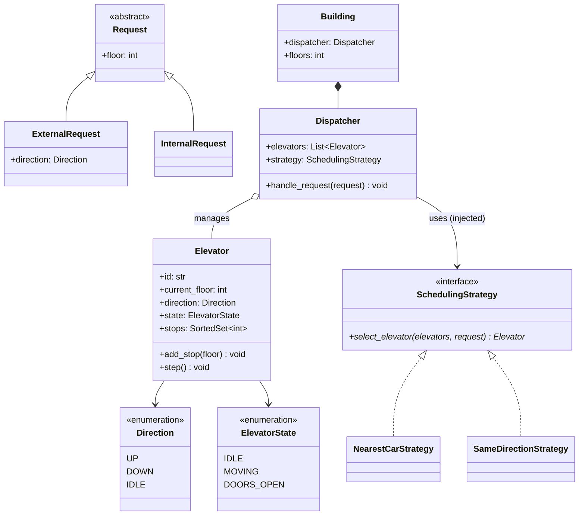
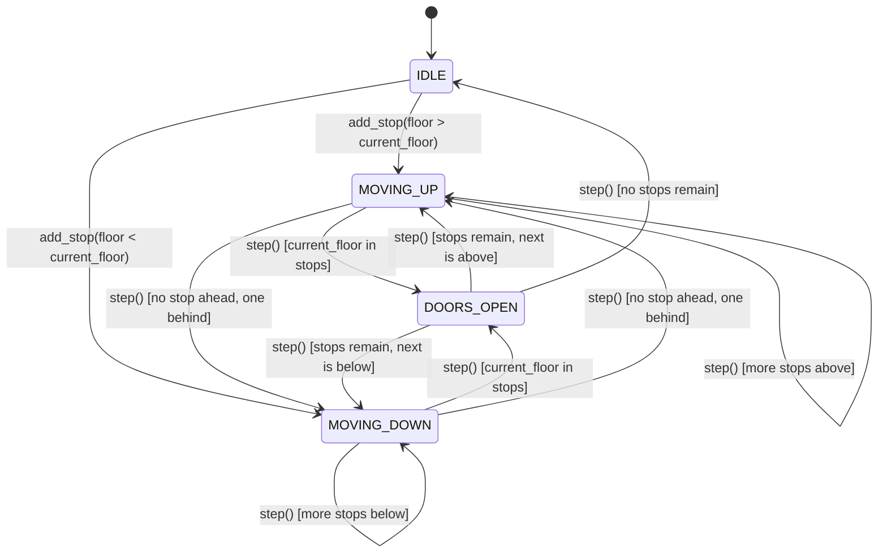

# LLD: Elevator System

**Difficulty:** Intermediate | **Time:** 40–50 minutes

!!! note "Instructions"
    Design it yourself first. This is the exercise where "start coding immediately" fails hardest — the state machine has to be right before any method body makes sense.

---

## 1. Problem Statement

Design the control system for a bank of elevators in a building. A user on any floor can press up/down to request an elevator; a user inside a car can select a destination floor. The system must assign requests to elevators and move each elevator through its stops efficiently.

---

## 2. Requirements

**Functional (in scope):**

- N elevators serving F floors
- External request: floor + direction (up/down)
- Internal request: destination floor, made from inside a car
- Each elevator tracks its current floor, direction, and door state
- A dispatcher assigns external requests to the "best" elevator
- Elevator stops at intermediate floors along its current direction if requested

**Explicitly out of scope for v1:** express elevators serving only certain floor ranges, weight limits, emergency/fire-service mode, multiple dispatch zones.

??? question "Clarifying questions worth asking out loud"
    - How many elevators, how many floors — does scale change the dispatch algorithm choice?
    - Should a moving elevator pick up a same-direction request along its path, or only idle elevators get dispatched?
    - Door timing — is that in scope, or assume instantaneous for this exercise?
    - Is starvation acceptable (a request that never gets served because closer requests keep winning), or must there be a fairness guarantee?

---

## 3. Entities

`Elevator`, `ElevatorState` (IDLE/MOVING_UP/MOVING_DOWN/DOORS_OPEN), `Request` (internal/external), `Dispatcher`, `SchedulingStrategy`, `Building`.

---

## 4. Class Design





**Why `Dispatcher` is a separate class from `Elevator`:** an individual `Elevator` should only know how to move itself and manage its own stop set — it should not know how to compare itself against sibling elevators to decide who "wins" a request. That comparison logic is a different responsibility ([SRP](../low-level-design/solid-principles.md#s-single-responsibility-principle)) and belongs to the `Dispatcher`, with the actual comparison algorithm pulled out one level further into `SchedulingStrategy`.

---

## 5. Patterns Applied

- **Strategy** for elevator selection — "assign the *best* elevator" is inherently going to have multiple competing definitions of "best" (nearest idle car vs. same-direction car already passing the floor vs. load-balancing across cars), so `Dispatcher` depends on `SchedulingStrategy`, not a hardcoded comparison.
- **State** (conceptually, even without a formal `State` class per state) — `Elevator.state` drives which transitions are legal; door state, movement, and stop-handling are gated by current state, not scattered `if` checks on flags.
- Explicitly **not** Observer for now — a plausible extension (notify a floor display when an elevator arrives) would earn it, but the base problem statement doesn't require it.

---

## 6. Core Code

```python
from abc import ABC, abstractmethod
from dataclasses import dataclass, field
from enum import Enum, auto
from threading import Lock


class Direction(Enum):
    UP = auto()
    DOWN = auto()
    IDLE = auto()


class ElevatorState(Enum):
    IDLE = auto()
    MOVING = auto()
    DOORS_OPEN = auto()


@dataclass
class ExternalRequest:
    floor: int
    direction: Direction


@dataclass
class InternalRequest:
    floor: int


class Elevator:
    def __init__(self, elevator_id: str, num_floors: int):
        self.id = elevator_id
        self.num_floors = num_floors
        self.current_floor = 0
        self.direction = Direction.IDLE
        self.state = ElevatorState.IDLE
        self._stops: set[int] = set()
        self._lock = Lock()

    def add_stop(self, floor: int) -> None:
        if not 0 <= floor < self.num_floors:
            raise ValueError(f"floor {floor} is outside this building (0..{self.num_floors - 1})")
        with self._lock:
            self._stops.add(floor)
            if self.direction == Direction.IDLE:
                self.direction = Direction.UP if floor > self.current_floor else Direction.DOWN
                self.state = ElevatorState.MOVING

    def step(self) -> None:
        """Advance one floor toward the next stop; called on a timer/event loop."""
        with self._lock:
            if self.state == ElevatorState.DOORS_OPEN:
                # doors close on this tick; movement (if any) happens next tick
                if self._stops:
                    self.state = ElevatorState.MOVING
                else:
                    self.state = ElevatorState.IDLE
                    self.direction = Direction.IDLE
                return

            if not self._stops:
                self.state = ElevatorState.IDLE
                self.direction = Direction.IDLE
                return

            if self.current_floor in self._stops:
                self._stops.discard(self.current_floor)
                self.state = ElevatorState.DOORS_OPEN
                return                          # door handling is a separate step; simplified here

            # reverse if no remaining stop lies ahead in the current direction
            if self.direction == Direction.UP and not any(f > self.current_floor for f in self._stops):
                self.direction = Direction.DOWN
            elif self.direction == Direction.DOWN and not any(f < self.current_floor for f in self._stops):
                self.direction = Direction.UP

            if self.direction == Direction.UP:
                self.current_floor += 1
            elif self.direction == Direction.DOWN:
                self.current_floor -= 1

    def snapshot(self) -> "ElevatorSnapshot":
        """A single locked read of every field the scheduler needs together.

        Taking one lock here — instead of `step()`'s lock plus separate calls
        to `distance_to`/`is_moving_toward` each re-acquiring it — guarantees
        floor, direction, and state all come from the *same* instant, not
        three snapshots interleaved with a concurrently running `step()`.
        """
        with self._lock:
            return ElevatorSnapshot(self.id, self.current_floor, self.direction, self.state)


@dataclass(frozen=True)
class ElevatorSnapshot:
    elevator_id: str
    current_floor: int
    direction: Direction
    state: ElevatorState

    def distance_to(self, floor: int) -> int:
        return abs(self.current_floor - floor)

    def is_moving_toward(self, floor: int, direction: Direction) -> bool:
        if self.direction != direction:
            return False
        if direction == Direction.UP:
            return self.current_floor <= floor
        if direction == Direction.DOWN:
            return self.current_floor >= floor
        return False


class SchedulingStrategy(ABC):
    @abstractmethod
    def select_elevator(self, elevators: list[Elevator], request: ExternalRequest) -> Elevator: ...


class NearestCarStrategy(SchedulingStrategy):
    """Prefer an idle car nearest the request; fall back to a car already headed that way."""

    def select_elevator(self, elevators: list[Elevator], request: ExternalRequest) -> Elevator:
        snapshots = {e.id: e.snapshot() for e in elevators}  # one consistent read per elevator
        candidates = [e for e in elevators if snapshots[e.id].state == ElevatorState.IDLE] or [
            e for e in elevators if snapshots[e.id].is_moving_toward(request.floor, request.direction)
        ] or elevators                            # last resort: everyone's a candidate
        return min(candidates, key=lambda e: snapshots[e.id].distance_to(request.floor))


class Dispatcher:
    def __init__(self, elevators: list[Elevator], strategy: SchedulingStrategy):
        self.elevators = elevators
        self.strategy = strategy                  # injected — see Dependency Inversion

    def handle_external_request(self, request: ExternalRequest) -> Elevator:
        chosen = self.strategy.select_elevator(self.elevators, request)
        chosen.add_stop(request.floor)
        return chosen

    def handle_internal_request(self, elevator: Elevator, request: InternalRequest) -> None:
        elevator.add_stop(request.floor)
```

---

## 7. Edge Cases

| Case | Handling |
|------|----------|
| All elevators are busy, none idle | `NearestCarStrategy` falls back to "already moving toward the request," then to plain nearest — never returns nothing; someone always gets assigned, possibly suboptimally |
| A request floor equals an elevator's current floor exactly | `add_stop` still adds it; the very next `step()` call sees `current_floor in self._stops` and opens doors immediately rather than moving away first |
| Internal request for a floor "behind" the elevator's current direction | v1 as written adds it to the same `_stops` set — the elevator will serve it on this pass only if it hasn't passed that floor yet; a real system would need a **direction-aware stop set** (separate up-stops and down-stops) to avoid backtracking mid-run, worth naming explicitly as a v2 refinement |
| Elevator reaches the top/bottom floor with a stop still queued | `step()` flips `direction` once no remaining stop lies ahead in the current direction, so the car reverses instead of overshooting the last real stop |
| A request names a floor outside the building (`floor < 0` or `floor >= num_floors`) | `add_stop` validates the range and raises before the floor ever reaches `_stops` — this is what actually keeps `current_floor` in bounds; `step()`'s direction-reversal only handles valid floors, it does not sanitize input |
| Two external requests for the same floor, opposite directions, simultaneously | Two separate `ExternalRequest`s (`UP` and `DOWN` are different requests) — could be served by the same or different elevators depending on the strategy; not a conflict, just two independent dispatch decisions |

---

## 8. Concurrency

Multiple floor-call buttons and multiple in-car destination buttons can fire concurrently across a real system, and multiple `Elevator.step()` calls (one timer tick per car) may run on separate threads. Two hazards:

1. **`add_stop` racing with `step`** on the same elevator — a stop could be added to `_stops` in the middle of a `step()` iterating or mutating that set. Fixed here by wrapping both in the same per-elevator `Lock`, the same pattern as `ParkingSpot.try_occupy` in [Parking Lot](parking-lot.md#8-concurrency): one lock guards every read *and* write of `_stops` and `direction` together, not just the write.

2. **The dispatcher assigning two requests to the same elevator "simultaneously" isn't actually a race** the way spot-double-booking was — an elevator *can* legitimately be assigned multiple stops, that's normal operation. The real hazard is `select_elevator` reading `current_floor`/`direction`/`state` on multiple elevators while `step()` threads are concurrently mutating those same fields — a classic read-while-write race that could pick a stale "nearest" elevator, or worse, combine a floor read before a `step()` tick with a direction read after it. The fix implemented above: `Elevator.snapshot()` takes `_lock` once and returns all three fields from that single critical section; `distance_to`/`is_moving_toward` then read only the immutable `ElevatorSnapshot`, never the live elevator, so the strategy can't observe a torn read across two different instants.

!!! warning "Where this problem tries to trick you into a deadlock"
    If `Dispatcher.handle_external_request` ever needed to lock *two* elevators at once (e.g., a "rebalance load between cars" feature), that's the same two-lock hazard as the bank-transfer and valet-swap examples — consistent lock ordering by `elevator.id` would be required. The base problem as scoped never locks two elevators simultaneously, so name this only if asked "what if we add load rebalancing."

---

## 9. Extensibility

| New requirement | What changes | What doesn't |
|---|---|---|
| Add express elevators serving only floors 20-40 | New `SchedulingStrategy` implementation that filters candidates by floor range before picking nearest | `Elevator`, `Dispatcher.handle_external_request` |
| Notify a floor display when a car arrives | Add an `Observer` list to `Elevator`, notify on `state == DOORS_OPEN` | `Dispatcher`, `SchedulingStrategy` implementations |
| Add weight limits (reject internal request if overloaded) | `Elevator.add_stop` gains a precondition check against a new `current_load` field | `Dispatcher`, `SchedulingStrategy` |
| Swap the dispatch algorithm for a load-balancing one under heavy traffic | New `SchedulingStrategy`, injected into `Dispatcher` at construction (or swapped at runtime) | Every other class |

---

## Interview Questions

=== "Foundation"
    **Q: Why does `Elevator` not decide for itself which requests it should serve — why is that the `Dispatcher`'s job?**

    "Because deciding 'which elevator is best for this request' requires comparing across all elevators, and an individual `Elevator` shouldn't need to know its siblings exist — that's a Single Responsibility split. `Elevator` owns moving itself and tracking its own stops; `Dispatcher` owns the cross-elevator comparison. If I merged them, every `Elevator` instance would need a reference to every other elevator just to make a local decision, which couples them unnecessarily and makes each one harder to test in isolation."

=== "Senior"
    **Q: Your `NearestCarStrategy` can starve a far-away request indefinitely if closer requests keep arriving. How would you address that, and does it change your class design?**

    "It's a real risk with a pure greedy-nearest strategy under sustained load. I wouldn't hardcode a fix into `NearestCarStrategy` — I'd either add aging (a request's effective priority increases the longer it waits, so eventually it wins even against a 'nearer' new request) as a new `SchedulingStrategy` implementation, or maintain that as a configurable trade-off between the two strategies and let the dispatcher be constructed with whichever the building's traffic profile calls for. The class design already supports this without touching `Dispatcher` or `Elevator` — that's the payoff of having pulled scheduling out as an injected `Strategy` in the first place rather than hardcoding nearest-car logic inside `Dispatcher`."

=== "Staff"
    **Q: The building is adding 40 more elevators and traffic patterns show most requests cluster in the morning (everyone going up from the lobby) and evening (everyone going down). How does your design need to evolve, and what stays the same?**

    "This is a scheduling-algorithm problem, not a class-structure problem — which is exactly the signal that pulling `SchedulingStrategy` out as its own abstraction earlier was the right call. I'd introduce a strategy that's traffic-pattern-aware: pre-position idle cars near the lobby before the morning rush, or bias `select_elevator` toward zone-based assignment (some cars dedicated to low floors, some to high) during known peak windows. That's a new `SchedulingStrategy` implementation, potentially swapped by time-of-day, with zero changes to `Elevator` or `Dispatcher`'s core interface. What *would* force a bigger change is if peak-time behavior needed elevators to coordinate with each other directly rather than just being independently scored by one dispatcher — at that scale I'd look at whether dispatch itself needs to be zone-partitioned across multiple `Dispatcher` instances, which is the same sharding conversation as at the system-design layer, just applied to elevator banks instead of database shards."

---

## Key Takeaways

!!! success "Remember"
    1. Splitting `Elevator` (self-movement) from `Dispatcher` (cross-elevator comparison) is SRP — don't let one class need visibility into its siblings just to make a local decision
    2. Strategy for elevator selection is earned because "best elevator" has multiple competing, real definitions — nearest idle, already-moving-toward, load-balanced
    3. State (`IDLE` / `MOVING` / `DOORS_OPEN`) should gate which transitions are legal — resist the urge to model it as loose boolean flags
    4. The concurrency hazard here isn't "two elevators claim the same stop" (that's fine) — it's a strategy reading stale/mid-mutation state while comparing elevators; both writers and readers of shared elevator state need the same lock
    5. A new dispatch algorithm, a new elevator class (express), or a new notification requirement should each be additive — if adding one means editing `Elevator`'s core move logic, the abstraction seam was in the wrong place

**Previous:** [Parking Lot](parking-lot.md) | **Next:** [LRU Cache](lru-cache.md)
