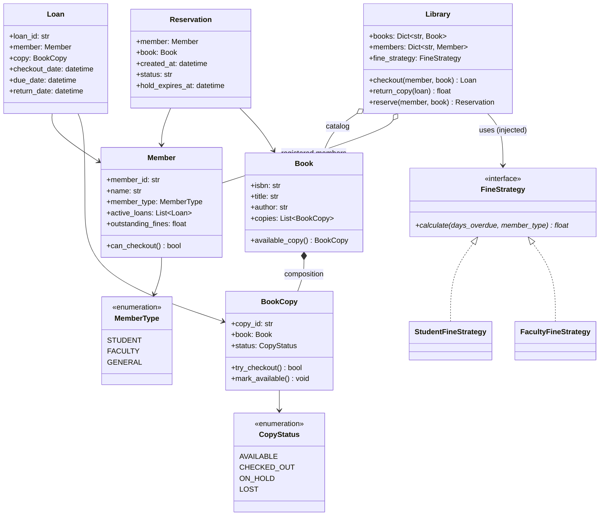

# LLD: Library Management

**Difficulty:** Beginner | **Time:** 30–40 minutes

!!! note "Instructions"
    Design it yourself first — entities, classes, relationships — before reading past step 3. This page follows the [9-step approach](../low-level-design/index.md#the-9-step-approach-use-it-on-every-problem).

---

## 1. Problem Statement

Design a library management system. The library has a catalog of books, where each title can have multiple physical copies. Members can check out and return copies. If every copy of a title is checked out, a member can join a reservation (hold) queue and gets notified when a copy becomes available. Loans have a due date, and returning a copy late accrues a fine.

---

## 2. Requirements

**Functional (in scope):**

- Catalog of `Book` titles, each backed by one or more physical `BookCopy` items
- `checkout(member, book)` — hands out an available copy, records a due date
- `return_copy(loan)` — marks the copy back in circulation, calculates any overdue fine
- If no copy is available, a member can reserve the title and joins a wait queue
- When a copy is returned and the queue is non-empty, the copy is held for the next member in line rather than returned to general circulation
- Fine calculation varies by member type (e.g. student vs. faculty)
- A member with unpaid fines or too many active loans cannot check out further copies

**Explicitly out of scope for v1:** e-book/digital lending, multi-branch inter-branch transfers, payment processing for fines (touched on in Extensibility), self-checkout kiosk hardware integration.

??? question "Clarifying questions worth asking out loud"
    - Is the reservation queue FIFO, or can it be reprioritized (e.g. faculty ahead of students)?
    - When a held copy isn't picked up in time, does the hold expire and roll to the next person, or does it just sit there?
    - Is the checkout limit the same for every member, or does it vary by membership tier?
    - Do fines accrue per day, or is it a flat late fee?
    - Single branch, or does `Library` need to represent one of many locations (affects whether copies are branch-scoped)?

---

## 3. Entities

The nouns in the problem statement: `Book`, `BookCopy`, `Member`, `Loan`, `Reservation`, `Library`, `FineStrategy`.

---

## 4. Class Design



**Why `Book *-- BookCopy` is composition, not aggregation:** a physical copy has no meaning without its title record — you don't create a `BookCopy` independent of a `Book`, and if a title is withdrawn from the catalog, its copies are withdrawn with it. But each copy still needs to be tracked *individually* (one copy can be checked out while three others sit on the shelf), which is exactly why `BookCopy` is its own class rather than the `Book` just holding a `copies_available: int` counter — a counter can't tell you *which* physical item a given `Loan` refers to. **Why `Library o-- Member` and `Library o-- Book` are aggregation, not composition:** members and catalog entries have a lifecycle independent of any single `Library` instance conceptually (a member's identity or a title's metadata isn't *owned* by the checkout system the way a copy's shelf status is) — see [Class Relationships](../low-level-design/solid-principles.md#class-relationships-uml-basics).

---

## 5. Patterns Applied

- **Strategy** for `FineStrategy` — the requirement explicitly names "fine calculation varies by member type," a real variation point, so `Library` depends on the interface and a new member tier's fine rule is a new class with zero edits to checkout/return logic. See [Design Patterns](../low-level-design/design-patterns.md#strategy-swap-the-algorithm-without-touching-the-class-that-uses-it).
- **Observer** for the reservation queue — when a copy is returned and members are waiting, the library needs to notify "whoever is interested in this title," without `Library.return_copy()` hardcoding who that is or how notification happens (email vs. SMS vs. in-app). The reservation queue for a `Book` is the subject; each `Reservation` is effectively a subscriber notified on copy availability. See [Design Patterns](../low-level-design/design-patterns.md#observer-notify-interested-parties-without-hard-coding-who-they-are).
- Explicitly **not** using Factory for `BookCopy` creation — copies are added to a catalog by a librarian action, a single straightforward constructor call, not a family of related objects requiring centralized creation logic. Adding it here would be pattern-matching without a real variation point.

---

## 6. Core Code

```python
from abc import ABC, abstractmethod
from dataclasses import dataclass, field
from datetime import datetime, timedelta
from collections import deque
from enum import Enum, auto
from threading import Lock
import uuid


class CopyStatus(Enum):
    AVAILABLE = auto()
    CHECKED_OUT = auto()
    ON_HOLD = auto()      # reserved for pickup by the front of the wait queue
    LOST = auto()


class MemberType(Enum):
    STUDENT = auto()
    FACULTY = auto()
    GENERAL = auto()


LOAN_PERIOD_DAYS = {MemberType.STUDENT: 14, MemberType.FACULTY: 28, MemberType.GENERAL: 21}
MAX_ACTIVE_LOANS = {MemberType.STUDENT: 5, MemberType.FACULTY: 15, MemberType.GENERAL: 8}
HOLD_PICKUP_WINDOW_DAYS = 3


class BookCopy:
    def __init__(self, copy_id: str, book: "Book"):
        self.copy_id = copy_id
        self.book = book
        self.status = CopyStatus.AVAILABLE
        self._lock = Lock()

    def try_checkout(self) -> bool:
        with self._lock:                       # check-then-act made atomic
            if self.status != CopyStatus.AVAILABLE:
                return False
            self.status = CopyStatus.CHECKED_OUT
            return True

    def try_claim_for_hold(self) -> bool:
        """Move an AVAILABLE copy to ON_HOLD for the next reservation, atomically."""
        with self._lock:
            if self.status != CopyStatus.AVAILABLE:
                return False
            self.status = CopyStatus.ON_HOLD
            return True

    def mark_available(self) -> None:
        with self._lock:
            self.status = CopyStatus.AVAILABLE


class Book:
    def __init__(self, isbn: str, title: str, author: str):
        self.isbn = isbn
        self.title = title
        self.author = author
        self.copies: list[BookCopy] = []

    def add_copy(self, copy_id: str) -> BookCopy:
        copy = BookCopy(copy_id, self)
        self.copies.append(copy)
        return copy

    def find_available_copy(self) -> BookCopy | None:
        for copy in self.copies:
            if copy.status == CopyStatus.AVAILABLE and copy.try_checkout():
                return copy
        return None


class Member:
    def __init__(self, member_id: str, name: str, member_type: MemberType):
        self.member_id = member_id
        self.name = name
        self.member_type = member_type
        self.active_loans: list["Loan"] = []
        self.outstanding_fines: float = 0.0

    def can_checkout(self) -> bool:
        if self.outstanding_fines > 0:
            return False
        return len(self.active_loans) < MAX_ACTIVE_LOANS[self.member_type]


@dataclass
class Loan:
    member: Member
    copy: BookCopy
    checkout_date: datetime
    due_date: datetime
    return_date: datetime | None = None
    loan_id: str = field(default_factory=lambda: str(uuid.uuid4()))


@dataclass
class Reservation:
    member: Member
    book: Book
    created_at: datetime
    status: str = "WAITING"                    # WAITING -> READY_FOR_PICKUP -> FULFILLED/EXPIRED
    hold_expires_at: datetime | None = None


class FineStrategy(ABC):
    @abstractmethod
    def calculate(self, days_overdue: int, member_type: MemberType) -> float: ...


class StudentFineStrategy(FineStrategy):
    def calculate(self, days_overdue: int, member_type: MemberType) -> float:
        return round(days_overdue * 0.25, 2)


class FacultyFineStrategy(FineStrategy):
    def calculate(self, days_overdue: int, member_type: MemberType) -> float:
        # faculty get a 5-day grace period before fines start accruing
        return round(max(0, days_overdue - 5) * 0.10, 2)


class Library:
    def __init__(self, fine_strategy: FineStrategy):
        self.books: dict[str, Book] = {}
        self.members: dict[str, Member] = {}
        self.fine_strategy = fine_strategy      # injected — see Dependency Inversion
        self._active_loans: dict[str, Loan] = {}
        self._reservation_queues: dict[str, deque[Reservation]] = {}
        self._lock = Lock()                     # guards queue mutation + copy hand-off together

    def checkout(self, member: Member, book: Book) -> Loan:
        if not member.can_checkout():
            raise ValueError(f"{member.name} cannot check out: fines owed or loan limit reached")

        copy = book.find_available_copy()
        if copy is None:
            raise ValueError(f"no available copy of {book.title!r} — consider reserve()")

        now = datetime.now()
        loan = Loan(
            member=member,
            copy=copy,
            checkout_date=now,
            due_date=now + timedelta(days=LOAN_PERIOD_DAYS[member.member_type]),
        )
        self._active_loans[loan.loan_id] = loan
        member.active_loans.append(loan)
        return loan

    def return_copy(self, loan: Loan) -> float:
        if loan.return_date is not None or self._active_loans.get(loan.loan_id) is not loan:
            raise ValueError(f"loan {loan.loan_id!r} is not active — already returned or unknown")

        loan.return_date = datetime.now()
        del self._active_loans[loan.loan_id]
        loan.member.active_loans.remove(loan)

        days_overdue = max(0, (loan.return_date - loan.due_date).days)
        fine = self.fine_strategy.calculate(days_overdue, loan.member.member_type)
        loan.member.outstanding_fines += fine

        self._hand_off_copy(loan.copy)
        return fine

    def _hand_off_copy(self, copy: BookCopy) -> None:
        """After a return, either fulfill the front of the reservation queue or
        release the copy to general circulation — never both."""
        with self._lock:                        # atomic: pop queue + claim copy together
            queue = self._reservation_queues.get(copy.book.isbn)
            copy.mark_available()
            while queue:
                reservation = queue[0]
                if not copy.try_claim_for_hold():
                    return                       # someone else already claimed it; bail
                queue.popleft()
                reservation.status = "READY_FOR_PICKUP"
                reservation.hold_expires_at = datetime.now() + timedelta(days=HOLD_PICKUP_WINDOW_DAYS)
                self._notify(reservation, copy)
                return

    def reserve(self, member: Member, book: Book) -> Reservation:
        reservation = Reservation(member=member, book=book, created_at=datetime.now())
        with self._lock:
            self._reservation_queues.setdefault(book.isbn, deque()).append(reservation)
        return reservation

    def _notify(self, reservation: Reservation, copy: BookCopy) -> None:
        # Observer hook — pluggable (email/SMS/in-app); logging stands in here
        print(f"[notify] {reservation.member.name}: {reservation.book.title!r} is ready for pickup "
              f"(hold expires {reservation.hold_expires_at:%Y-%m-%d})")
```

`_hand_off_copy` is the crux of the design: it decides whether a returned copy goes back to the shelf or straight into the next reservation holder's hands, and it does so under the same lock that guards the queue — see Concurrency below for why that matters.

---

## 7. Edge Cases

| Case | Handling |
|------|----------|
| Member has reached their max active-loan limit | `Member.can_checkout()` is checked first in `checkout()`, before any copy is touched — reject cleanly, no partial state |
| Checking out a book where every copy is already loaned out | `find_available_copy()` returns `None`; `checkout()` raises, telling the caller to `reserve()` instead of silently failing or returning a falsy `Loan` |
| Returning a copy that was already returned (double return) | `return_copy()` checks `loan.return_date is not None` **and** that the loan is still the tracked active one, so a stale or reused `Loan` object can neither double-credit a return nor double-release a copy |
| A copy is returned while members are waiting in the reservation queue | `_hand_off_copy()` claims the copy for the front of the queue (`ON_HOLD`) instead of leaving it `AVAILABLE` for general checkout — first-come-first-served on the queue beats first-come-first-served on the shelf |
| Member with unpaid fines tries to check out another book | `Member.can_checkout()` returns `False` whenever `outstanding_fines > 0`, blocking checkout until fines are settled — same gate as the loan-limit check |

---

## 8. Concurrency

Two members calling `checkout()` for the same title at the same instant, with exactly one copy left, must not both succeed. `Book.find_available_copy()` iterates copies and calls `BookCopy.try_checkout()`, which wraps the check (`status == AVAILABLE`) and the act (`status = CHECKED_OUT`) inside a single per-copy `Lock` — the same closed race window as `ParkingSpot.try_occupy()` in [Parking Lot](parking-lot.md#8-concurrency): whichever thread wins the lock claims the copy, the other moves on and finds nothing available (or a different copy, if one exists). See [Race Conditions](../low-level-design/concurrency-basics.md#race-conditions).

**Why per-copy locking, not one lock around the whole `Library`:** two members checking out *different* titles shouldn't block on each other. Locking at `BookCopy` granularity lets unrelated checkouts proceed concurrently — see [Locks](../low-level-design/concurrency-basics.md#locks).

A second, subtler race lives in `_hand_off_copy()`: returning a copy while the reservation queue is non-empty involves *two* pieces of shared state — the queue itself and the copy's status — and they must change together. If popping the queue and claiming the copy were two separate locked operations, a window opens where a concurrent `checkout()` call could steal the just-returned copy via `try_checkout()` between the two steps, leaving the popped reservation "fulfilled" against a copy that's actually in someone else's hands. The fix is holding `Library._lock` across the read-queue-then-claim-copy sequence, so the pop and the claim are one atomic unit — not per-copy locking here, because the invariant being protected ("this copy and this queue move together") spans two objects, not one.

---

## 9. Extensibility

| New requirement | What changes | What doesn't |
|---|---|---|
| E-books / digital lending | New `DigitalCopy` type with no physical-shelf constraint (effectively unlimited or license-capped "copies"); `Book` composes a mix of `BookCopy` and `DigitalCopy` | `Library.checkout`/`return_copy` signatures, `FineStrategy` |
| Multi-branch library with inter-branch transfers | `Library` becomes one of several `Branch` instances behind a directory; a transfer moves a `BookCopy` from one branch's inventory to another's | `BookCopy`, `Loan`, `FineStrategy` |
| Tiered membership with different loan limits | New entries in the `MAX_ACTIVE_LOANS`/`LOAN_PERIOD_DAYS` policy tables, or promote them to an injected `MembershipPolicy` strategy | `checkout()`/`return_copy()` control flow |
| Self-checkout kiosk integration | New client (kiosk UI) calling the existing `checkout()`/`return_copy()` API over a different interface (barcode scan instead of librarian input) | `Library`, `BookCopy`, `Loan` — the API doesn't care who the caller is |

---

## Interview Questions

=== "Foundation"
    **Q: Why is `BookCopy` a separate class from `Book` instead of `Book` just tracking a count of available copies?**

    "Because a `Loan` needs to point at a *specific physical item*, not just decrement a counter — if two copies of the same title are both checked out, I need to know which one comes back from which member, and whether a particular copy is lost or damaged versus just circulating normally. A counter can tell you 'how many,' but not 'which one,' and 'which one' is exactly what a `Loan` and a return need. That's why I modeled it as composition — `Book *-- BookCopy` — the copies don't exist independently of the title, but each one carries its own status."

=== "Senior"
    **Q: Two members both try to check out the last available copy of a book at the same instant. Walk through how your design prevents both from succeeding.**

    "`find_available_copy()` scans a book's copies and calls `try_checkout()` on each, which wraps the read of `status` and the write to `CHECKED_OUT` inside one per-copy lock. Both members' threads can reach the same copy in their scan, but only one wins the lock and sees `status == AVAILABLE`; the other, once it gets the lock, sees `CHECKED_OUT` already and moves to the next copy — finding none, since this was the last one. The important decision was collapsing 'check status' and 'set status' into a single atomic method; if those were two separate calls, there'd be a race window between them no matter how carefully the calling code was written."

=== "Staff"
    **Q: A copy comes back, gets held for the next person in the reservation queue, but they never show up to collect it. How does your design handle that, and how do you avoid introducing a new race condition while fixing it?**

    "Each `Reservation` that reaches `READY_FOR_PICKUP` gets a `hold_expires_at`, set when `_hand_off_copy()` claims the copy — three days out in my default. If the member doesn't check the copy out by then, the hold needs to expire and roll to the next person in line, which means something has to periodically sweep for expired holds — either a background job scanning `ON_HOLD` copies past their expiry, or a lazy check at the top of `checkout()`/`reserve()` that expires a stale hold before doing anything else. The race to watch for is the same shape as the original return-and-hand-off race: expiring a hold and re-offering the copy to the *next* person in the queue has to be one atomic operation under `Library._lock`, exactly like the original hand-off — otherwise two concurrent expiry sweeps (or an expiry sweep racing a legitimate late pickup) could both try to reassign the same copy, or the original holder could show up and successfully check it out at the exact moment it's being reassigned to someone else. I'd route hold expiry through the *same* `_hand_off_copy`-style method rather than writing a second, parallel code path, so there's only one place that ever moves a copy from 'available-to-someone' to 'available-to-someone-else' — a second path is how these bugs actually get introduced in production."

---

## Key Takeaways

!!! success "Remember"
    1. `Book *-- BookCopy` composition lets the system track individual physical items (status, current loan) instead of a bare count — a counter can't answer "which copy," and returns need that answer
    2. Strategy earns its place for `FineStrategy` because the fine rule is explicitly named as varying by member type — don't hardcode a single formula
    3. Observer earns its place for the reservation queue because "notify whoever's waiting" shouldn't require `Library` to know how notification happens
    4. `try_checkout()` collapsing check-and-act into one atomic, per-copy-locked method closes the last-copy race; the queue hand-off needs a *second*, coarser lock because it spans two objects (queue + copy) at once
    5. A returned copy with a non-empty reservation queue never goes to general availability — it goes to the front of the queue, and hold expiry has to route through the same atomic hand-off path, not a second one

**Previous:** [Tic Tac Toe](tic-tac-toe.md) | **Next:** [Splitwise](splitwise.md)
