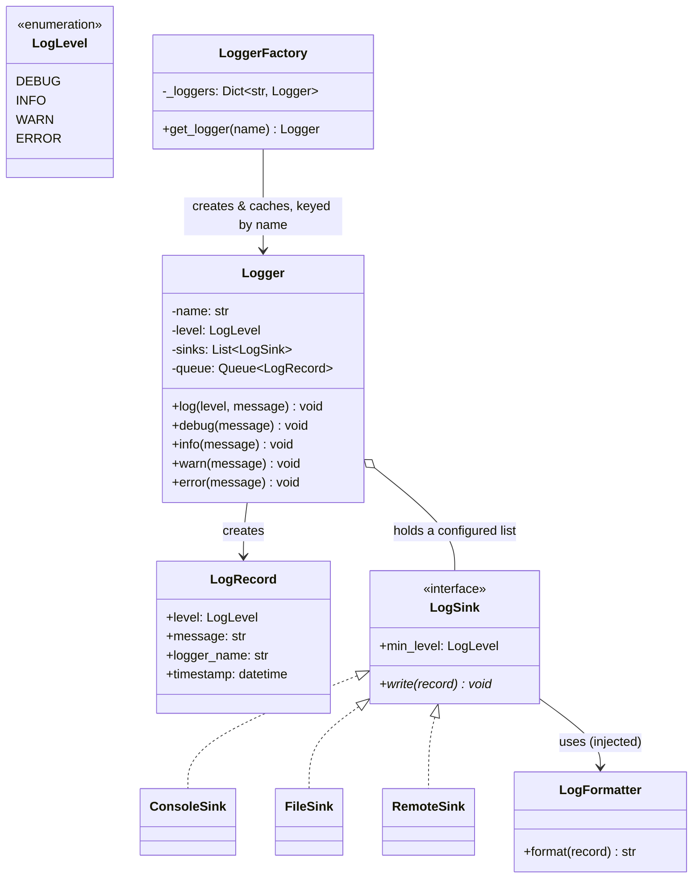
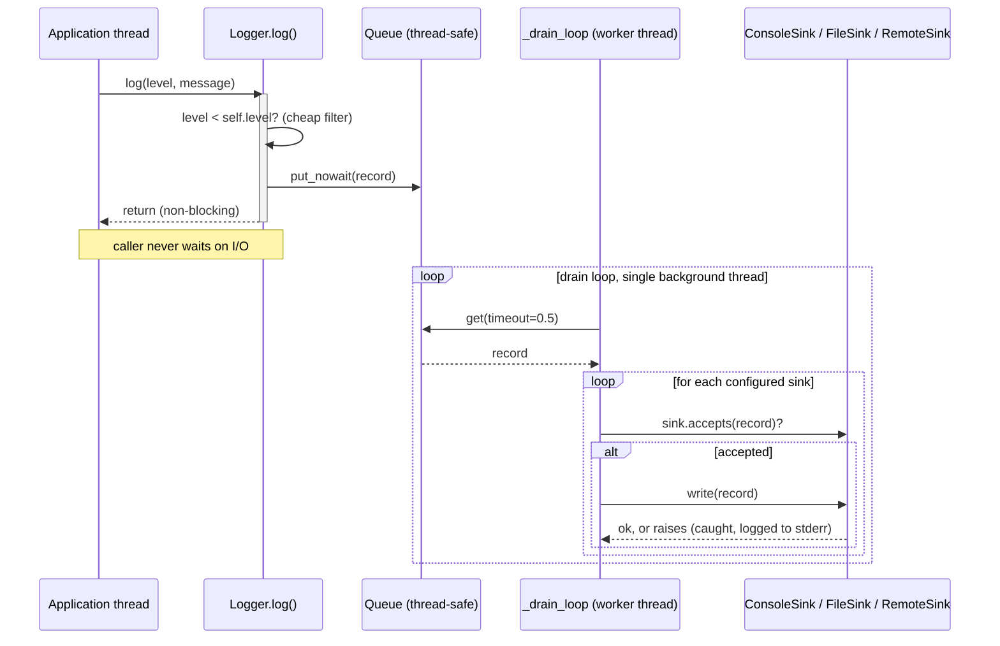

# LLD: Logger

**Difficulty:** Advanced | **Time:** 35–45 minutes

!!! note "Instructions"
    Design it yourself first — entities, classes, relationships — before reading past step 3. This page follows the [9-step approach](../low-level-design/index.md#the-9-step-approach-use-it-on-every-problem).

---

## 1. Problem Statement

Design a logging library. Callers log messages at different severity levels (`DEBUG`, `INFO`, `WARN`, `ERROR`). Each log record can be written to multiple output sinks simultaneously — console, a local file, a remote log-aggregation service — and each sink has its own configurable minimum level (e.g. console shows `INFO`+, a remote sink only ships `WARN`+ to save bandwidth). A slow sink, especially the network one, must never block the calling thread. The logger is called from many application threads concurrently and must not corrupt output or lose writes.

---

## 2. Requirements

**Functional (in scope):**

- `log(level, message)` (and convenience `debug()`/`info()`/`warn()`/`error()`) accepts a record and routes it to all configured sinks
- Each sink has its own minimum level filter, independent of the others
- At least three sink types: console, file, remote/network
- `log()` returns immediately — the calling thread never blocks on I/O, even if a sink (e.g. the network sink) is slow or temporarily unavailable
- Safe to call from many threads at once without corrupting a sink's output or the logger's internal state

**Explicitly out of scope for v1:** structured/JSON log querying, log aggregation/search on the server side, distributed tracing correlation IDs (a real extension, noted below), guaranteed delivery across a process crash (a fundamental limit of async logging, discussed in Edge Cases).

??? question "Clarifying questions worth asking out loud"
    - Should filtering happen once globally, or per-sink (a sink might want a stricter level than the logger's own threshold)? (Standard answer: both — a global floor, then a per-sink floor on top.)
    - Is *some* log loss acceptable under extreme load, or must every call to `log()` be durable? (This determines the queue-overflow policy — see Edge Cases and the Staff interview question.)
    - One `Logger` instance for the whole app, or one per module/class (e.g. `get_logger(__name__)`, like Python's `logging` or SLF4J)? This is the question that decides the Singleton-vs-DI design — see Class Design below.
    - Do different loggers need different sink configurations (e.g. a `payments` logger also ships to an audit sink), or is sink configuration global?

---

## 3. Entities

The nouns in the problem statement: `LogLevel`, `LogRecord`, `LogSink` (interface, with `ConsoleSink`, `FileSink`, `RemoteSink` implementations), `LogFormatter`, `Logger`.

---

## 4. Class Design



**The Singleton trap, resolved.** The [index page's warning](index.md) is right to flag `Logger` as the textbook Singleton example done badly: a global `Logger.instance()` hides a dependency (any class can silently reach for it), can't be swapped for a fake in a test, and — the moment logging is concurrent, which this exercise requires — turns any accidental shared mutable state on that global into a bug that's hard to reproduce. So `Logger` here is never accessed through a global accessor. It's a normal object: constructed with a name, a level, and a list of sinks, and handed to whatever needs it via **constructor injection**, exactly as `PricingStrategy` was injected into `ParkingLot` — see [Dependency Inversion](../low-level-design/solid-principles.md#d-dependency-inversion-principle). A class under test receives a fake `Logger` (or a real one pointed at an in-memory sink) with zero global state to reset between tests.

The wrinkle is ergonomics: nobody wants to thread a `Logger` through every constructor by hand for something this cross-cutting, and `logging.getLogger(__name__)` / SLF4J's `LoggerFactory.getLogger(Foo.class)` are popular for a reason — call-site convenience matters. `LoggerFactory.get_logger(name)` gives that convenience **without** collapsing back into a Singleton: it's a cache keyed by name, not a single hidden instance. Each named logger (`"payments"`, `"auth"`, `"db.pool"`) is independently configurable — different levels, different sinks — and, critically, still injectable: production code calls `get_logger(__name__)` at the module level for convenience, but a class that wants to be strictly unit-testable still accepts a `Logger` in its constructor and defaults to `get_logger(...)` only if none is supplied. That default-with-override is the same pattern behind [Design Patterns' discussion of avoiding hidden global state](../low-level-design/design-patterns.md) while keeping the common case terse.

---

## 5. Patterns Applied

- **Strategy** for `LogSink` — the requirement ("write to console, file, and network simultaneously, each independently configured") is a real variation point that's explicitly named, so `Logger` holds a `List[LogSink]` and depends only on the interface. Adding a new sink (e.g. shipping to Datadog) is a new class with zero edits to `Logger`. See [Design Patterns](../low-level-design/design-patterns.md#strategy-swap-the-algorithm-without-touching-the-class-that-uses-it).
- **Builder**, lightly, for `Logger` construction — a logger has several optional, order-independent configuration knobs (level, formatter, list of sinks, queue size) and a builder (`LoggerBuilder().with_level(...).add_sink(...).build()`) keeps the constructor from becoming a five-positional-argument mess as sinks accumulate. See [Design Patterns](../low-level-design/design-patterns.md#builder-construct-a-complex-object-step-by-step-keep-the-constructor-sane). This is optional polish, not load-bearing — a plain constructor taking `sinks: list[LogSink]` is equally correct for the interview; mention the builder if config keeps growing.
- **Singleton — when it's actually correct here, and when it isn't.** The `Logger` object itself should never be a singleton, for the reasons above. But there's a narrower thing that *is* legitimately process-wide: a single **file handle registry** for `FileSink`. If two independently-constructed `Logger` instances both write to `app.log`, two open file handles interleaving writes at the OS level can corrupt lines (one handle's partial `write()` gets scheduled between another's). The fix isn't making `Logger` a singleton — it's making the *file handle* a singleton resource, shared via a small process-wide registry (`FileHandleRegistry.get(path)` returns the same handle + lock for a given path, however many `FileSink` or `Logger` instances reference it). That's the legitimate case for a true singleton: one physical, non-shareable resource (a file descriptor, a network socket, a hardware lock) that genuinely must have exactly one owner in the process — not a convenience object like `Logger` that has no such physical constraint and every reason to be many independently-testable instances.

---

## 6. Core Code

```python
from abc import ABC, abstractmethod
from dataclasses import dataclass, field
from datetime import datetime
from enum import IntEnum
from queue import Queue, Full, Empty
from threading import Lock, Thread
import sys


class LogLevel(IntEnum):
    DEBUG = 10
    INFO = 20
    WARN = 30
    ERROR = 40


@dataclass
class LogRecord:
    level: LogLevel
    message: str
    logger_name: str
    timestamp: datetime = field(default_factory=datetime.now)


class LogFormatter:
    def format(self, record: LogRecord) -> str:
        return f"{record.timestamp.isoformat()} [{record.level.name}] {record.logger_name}: {record.message}"


class LogSink(ABC):
    def __init__(self, min_level: LogLevel = LogLevel.DEBUG, formatter: LogFormatter | None = None):
        self.min_level = min_level
        self.formatter = formatter or LogFormatter()

    def accepts(self, record: LogRecord) -> bool:
        return record.level >= self.min_level

    @abstractmethod
    def write(self, record: LogRecord) -> None: ...


class ConsoleSink(LogSink):
    def write(self, record: LogRecord) -> None:
        stream = sys.stderr if record.level >= LogLevel.WARN else sys.stdout
        print(self.formatter.format(record), file=stream)


class FileSink(LogSink):
    def __init__(self, path: str, min_level: LogLevel = LogLevel.DEBUG, formatter: LogFormatter | None = None):
        super().__init__(min_level, formatter)
        self._path = path
        self._file = open(path, "a", encoding="utf-8")
        self._write_lock = Lock()          # guards this sink's own handle — see Concurrency

    def write(self, record: LogRecord) -> None:
        line = self.formatter.format(record) + "\n"
        with self._write_lock:
            self._file.write(line)
            self._file.flush()

    def close(self) -> None:
        self._file.close()


class RemoteSink(LogSink):
    """Ships records to a network log collector. Slow/flaky by nature — this is
    exactly why sinks are never called on the caller's thread (see Logger below)."""

    def __init__(self, endpoint: str, min_level: LogLevel = LogLevel.WARN, formatter: LogFormatter | None = None):
        super().__init__(min_level, formatter)
        self._endpoint = endpoint

    def write(self, record: LogRecord) -> None:
        payload = self.formatter.format(record)
        self._send(payload)                 # network I/O — can block or raise; handled by the worker, not the caller

    def _send(self, payload: str) -> None:
        ...  # actual HTTP/gRPC call to self._endpoint


class Logger:
    """Never a global. Constructed with its sinks and handed out via
    constructor injection or LoggerFactory.get_logger() — see Class Design."""

    def __init__(self, name: str, level: LogLevel, sinks: list[LogSink], queue_size: int = 10_000):
        self.name = name
        self.level = level
        self.sinks = sinks
        self._queue: Queue[LogRecord | None] = Queue(maxsize=queue_size)
        self._worker = Thread(target=self._drain_loop, name=f"logger-{name}", daemon=True)
        self._worker.start()

    # --- producer side: called from arbitrary application threads ---

    def log(self, level: LogLevel, message: str) -> None:
        if level < self.level:
            return                          # cheap global filter before touching the queue at all
        record = LogRecord(level=level, message=message, logger_name=self.name)
        try:
            self._queue.put_nowait(record)  # never blocks the caller — see Edge Cases for overflow policy
        except Full:
            sys.stderr.write(f"[logger:{self.name}] queue full, dropping record\n")

    def debug(self, message: str) -> None:
        self.log(LogLevel.DEBUG, message)

    def info(self, message: str) -> None:
        self.log(LogLevel.INFO, message)

    def warn(self, message: str) -> None:
        self.log(LogLevel.WARN, message)

    def error(self, message: str) -> None:
        self.log(LogLevel.ERROR, message)

    # --- consumer side: the single background thread ---

    def _drain_loop(self) -> None:
        while True:
            try:
                record = self._queue.get(timeout=0.5)
            except Empty:
                continue
            if record is None:              # shutdown sentinel
                break
            for sink in self.sinks:
                if not sink.accepts(record):
                    continue
                try:
                    sink.write(record)
                except Exception as exc:      # a broken sink must not take down the worker or the other sinks
                    sys.stderr.write(f"[logger:{self.name}] sink {sink!r} failed: {exc!r}\n")

    def shutdown(self) -> None:
        self._queue.put(None)                 # sentinel: worker finishes records queued before this, then exits
        self._worker.join(timeout=5)


class LoggerFactory:
    """Gives get_logger(name) convenience without a hidden global instance —
    each name is independently configured and still just an injectable object."""

    _loggers: dict[str, Logger] = {}
    _lock = Lock()

    @classmethod
    def get_logger(cls, name: str, level: LogLevel = LogLevel.INFO, sinks: list[LogSink] | None = None) -> Logger:
        with cls._lock:
            if name not in cls._loggers:
                cls._loggers[name] = Logger(name, level, sinks or [ConsoleSink()])
            return cls._loggers[name]
```



The producer/consumer split is the crux: `log()` (producer, called from N application threads) only validates the level and does a non-blocking `queue.put_nowait`, then returns — no I/O happens on the caller's thread. `_drain_loop()` (consumer, exactly one background thread per `Logger`) is the only code that ever calls a sink's `write()`, so all sink I/O — including a slow `RemoteSink._send()` — happens off the critical path of every caller.

---

## 7. Edge Cases

| Case | Handling |
|------|----------|
| Producers outpace the consumer, queue fills up | Policy choice, stated explicitly here: **drop the new record and log a warning to stderr** (`put_nowait` + `Full` handler above), rather than blocking the caller (defeats the entire point of async logging) or growing the queue unbounded (risks OOM under sustained overload). See the Staff interview question for the full trade-off. |
| A sink's `write()` throws (e.g. `RemoteSink` gets a connection error) | Caught per-sink inside `_drain_loop`'s loop body — one broken sink logs its own failure and is skipped for that record, but the loop continues to the *next* sink for the same record and to the *next* record on the next iteration. A `FileSink` exception must never prevent `ConsoleSink` from getting the same record. |
| Process crashes with records still in the queue | Those records are lost — permanently. This is a **fundamental durability limit of async, in-memory-queued logging**, not a bug to patch around; if durability across crashes is a hard requirement, the honest answer is a different architecture (write-ahead to disk synchronously, or accept the trade-off explicitly and document it), not a cleverer queue. |
| A sink's error-handling path itself calls back into `log()` (e.g. `RemoteSink` logs its own connection failures through the same logger) | Risks infinite recursion / feedback loops if not caught — the `except Exception` in `_drain_loop` deliberately writes failures to raw `sys.stderr`, never back through `self.log()`, precisely to break that cycle. Any sink implementation that logs its own errors must do the same. |
| `Logger.shutdown()` called while records are still queued | The sentinel (`None`) is enqueued *behind* whatever's already there, so `_drain_loop` finishes every record queued before shutdown was called, then exits on the sentinel — nothing queued before shutdown is silently dropped. Records enqueued *after* `shutdown()` starts are a genuine race the caller must avoid (stop producers first). |

---

## 8. Concurrency

Many application threads call `log()` on the same `Logger` concurrently. Two things must not happen: the queue must not be corrupted by concurrent `put`s, and two records must never interleave into a *partial* write on the same sink (e.g. two log lines' bytes interleaving mid-line in a file).

**The producer-consumer queue solves both, for a different reason each:**

- **Queue safety:** `queue.Queue` is internally thread-safe — it wraps its own mutex and condition variables — so N threads calling `put_nowait` concurrently is already correctly synchronized without this design writing a single lock itself. This is the "thread-safety without hand-rolled locks" case from [Concurrency Basics](../low-level-design/concurrency-basics.md#thread-safety-without-locks): reach for a higher-level, already-correct primitive before reaching for `Lock()` directly.
- **No interleaved writes to a sink:** because there is exactly **one** consumer thread per `Logger` (the `_drain_loop` worker), and that worker processes records one at a time, no two threads ever call `sink.write()` concurrently for sinks owned by that logger — the ordering is serialized by construction, not by a lock around `write()`. `FileSink` still takes its own `_write_lock` (see Core Code) defensively, in case the same underlying file handle is ever shared across more than one `Logger` instance (exactly the scenario the `FileHandleRegistry` singleton in Patterns Applied is meant to prevent) — but under the single-consumer-per-logger design, that lock is uncontended in the common case, matching the [locks discussion](../low-level-design/concurrency-basics.md#locks) on preferring the smallest lock that's actually needed.
- **What a naive alternative would get wrong:** if `log()` called `sink.write()` directly from the caller's thread instead of enqueueing, every sink would need its own lock, held for the full duration of potentially slow I/O — turning `log()` into a blocking call and reintroducing exactly the throughput and latency problem the queue exists to remove.

---

## 9. Extensibility

| New requirement | What changes | What doesn't |
|---|---|---|
| Add structured/JSON logging | New `LogFormatter` implementation (`JsonFormatter`) passed to a sink at construction | `Logger`, `LogSink` interface, existing sinks' `write()` logic |
| Log rotation for `FileSink` | `FileSink` gains rotation logic (size- or time-based) around its own file handle, or delegates to a rotation-aware handle from `FileHandleRegistry` | `Logger`, other sink types, the queue/worker mechanism |
| Sample high-volume `DEBUG` logs (e.g. keep 1 in 100) | A `SamplingLogSink` decorator wrapping any `LogSink`, or a sampling check in `Logger.log()` before enqueueing — either is defensible; state which layer owns the decision | The wrapped sink's own `write()` logic is untouched either way |
| Add a remote sink with batching + retry | `RemoteSink` (or a `BatchingRemoteSink` variant) accumulates records and flushes on a size/time threshold, with retry-with-backoff on failure — all internal to that sink, still driven by the same single consumer thread | `Logger`, the queue, every other sink type |

---

## Interview Questions

=== "Foundation"
    **Q: Isn't Logger the textbook example of when Singleton is the right pattern? Why are you passing it around instead of just calling `Logger.instance()`?**

    "It's the textbook example of Singleton being *tempting*, not correct. A global `Logger.instance()` hides a dependency — any class can silently reach for logging without it showing up in its constructor or its tests — and it can't be swapped for a fake, so testing a class that logs means either asserting against real stdout or resetting global state between tests, which gets ugly fast. And the moment logging has to be concurrent, which this problem requires, a global mutable object is exactly the kind of shared state that turns into hard-to-reproduce bugs. So I construct `Logger` with its sinks and level and inject it — same as I'd inject any other collaborator. The convenience people actually want from a global — not having to thread a logger through every constructor — I get from `LoggerFactory.get_logger(name)` instead, which is a cache keyed by name, not a hidden singleton instance: each named logger is independently configurable, and a class that wants strict testability still just takes a `Logger` in its constructor. I get the ergonomics without the global mutable state."

=== "Senior"
    **Q: Walk me through what happens, end to end, when `log()` is called from an application thread — why doesn't it block even if the remote sink is down?**

    "`log()` does two cheap things on the caller's thread: checks the record's level against the logger's own threshold, and — if it passes — builds a `LogRecord` and calls `queue.put_nowait()`. That's it; it returns. All the actual work — filtering per-sink, formatting, and the I/O of `write()` for each sink — happens on a single dedicated background thread that pulls off the queue in a loop. So a `RemoteSink` that's hanging on a socket call only stalls that one worker thread, not any of the N application threads calling `log()`. The design decision that makes this correct rather than just fast is putting the per-sink `accepts()` check and the `write()` call *inside* the worker loop, not before the enqueue — if I filtered by sink level before enqueueing, I'd need to enqueue once per sink or duplicate filtering logic on the caller's thread, which reintroduces work on the hot path I'm trying to keep cheap."

=== "Staff"
    **Q: Under sustained high log volume, the queue fills up faster than the worker can drain it. What's your overflow policy, and what are you trading off?**

    "There are three real options, and I want to be explicit that this is a deliberate trade-off, not a detail to gloss over. Block the caller until there's room — that's the one option that's actually disqualified, because it defeats the entire premise of async logging; a slow log sink would then apply backpressure all the way into application request latency, which is worse than losing some debug lines. Let the queue grow unbounded — simple, and doesn't lose anything under a transient spike, but under *sustained* overload it's a slow-motion OOM: the queue becomes an unbounded buffer for a problem that was never going to resolve itself, and it fails catastrophically instead of gracefully. My default is a bounded queue that drops the newest record and logs a one-line warning when full — it fails gracefully, it's O(1) to check, and losing some log lines under extreme load is an acceptable trade-off for a system whose job is diagnostics, not transactions. The one refinement worth naming: drop the newest, not the oldest — an unbounded 'drop oldest to make room for newest' policy requires evicting from a queue, which is more expensive and, more importantly, throws away exactly the debugging context (the earliest signal of what started going wrong) that's most valuable when you're already in an overload scenario. If a caller genuinely needs zero-loss logging for specific high-value events — audit logs, say — that's a signal those events don't belong in this best-effort pipeline at all; they need their own durable, synchronous write path, not a tweak to this queue's policy."

---

## Key Takeaways

!!! success "Remember"
    1. Singleton-vs-DI is the signature lesson here: a global `Logger.instance()` hides dependencies and can't be faked in tests; constructor injection plus a `LoggerFactory.get_logger(name)` cache gives the same call-site convenience without a hidden global mutable instance.
    2. A true singleton is legitimate only for a genuinely unshareable physical resource (a file handle, a socket) — not for a convenience object like `Logger` that has every reason to be many independently-testable instances.
    3. The producer-consumer split (caller enqueues, one background thread drains and writes) is what makes `log()` non-blocking — it's not a lock around `write()`, it's moving `write()` off the caller's thread entirely.
    4. `queue.Queue` is already thread-safe internally — reach for that higher-level primitive before hand-rolling a `Lock` around a list.
    5. A broken sink must be caught per-sink inside the worker loop so one bad sink (or one bad record) never takes down delivery to the others.
    6. Queue overflow, sink failures, and crash-durability are all explicit, named trade-offs in an async logger, not bugs — state the policy out loud rather than pretending the system can be lossless.

**Previous:** [Rate Limiter (LLD)](rate-limiter.md) | **Next:** [Notification System (LLD)](notification-system.md)
