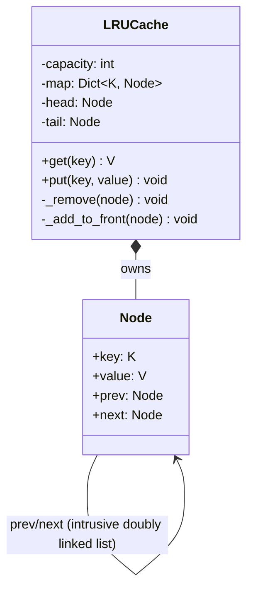
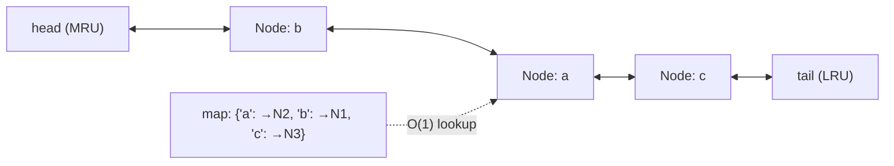

# LLD: LRU Cache

**Difficulty:** Advanced | **Time:** 30–40 minutes

!!! note "Instructions"
    The constraint that makes this an LLD problem instead of a two-line `dict` wrapper is **O(1) for both `get` and `put`, including eviction.** Design the data structure before writing any method body.

---

## 1. Problem Statement

Design an in-memory cache with a fixed capacity. When the cache is full and a new key is inserted, evict the **least recently used** entry. Both `get(key)` and `put(key, value)` must run in O(1) time.

This is the class-level version of the problem; [Cache Strategies](../performance/cache-strategies.md) and [Distributed Cache](../system-design-exercises/distributed-cache.md) cover the same eviction idea at the system-design layer — where the cache lives, how it's sharded, what happens when a node holding the cache dies. Here, the constraint is purely algorithmic: one process, one thread of reasoning about a data structure.

---

## 2. Requirements

**Functional (in scope):**

- `get(key) -> value | None` — returns the value and marks the key as most-recently-used; `None`/miss if absent
- `put(key, value)` — inserts or updates; marks as most-recently-used; evicts the LRU entry if capacity is exceeded
- Fixed capacity, set at construction

**Explicitly out of scope for v1:** TTL-based expiry (a real addition, noted in Extensibility), persistence, distributed/multi-node caching (see [Distributed Cache](../system-design-exercises/distributed-cache.md) for that version of the problem).

??? question "Clarifying questions worth asking out loud"
    - Is "used" defined by `get` only, or does `put` on an existing key also count as a use? (Standard answer: both.)
    - Thread safety — single-threaded assumption, or must this be safe under concurrent access? (Assume yes for a senior-level bar; see Concurrency.)
    - What should `get` return on a miss — `None`, raise, or a sentinel? Pin this down before writing code.

---

## 3. Entities

`Node` (the linked-list element holding key + value), `LRUCache` (owns the hash map and the list).

---

## 4. Class Design



**Why a hash map *and* a doubly linked list, not one or the other:** a hash map alone gives O(1) `get`/`put` but has no notion of "order of use" — finding the LRU entry to evict would be O(n). A linked list alone gives O(1) reordering (move a node to the front) but O(n) lookup by key. **Combining them is the entire trick**: the hash map gives O(1) *access* to a node, and the doubly linked list gives O(1) *reordering* of that node once you have it — no scan required for either operation.



---

## 5. Patterns Applied

- No Gang-of-Four pattern is the "right answer" here — this is a data-structure design problem, not a behavior-variation problem, and that distinction is itself worth stating out loud: not every LLD problem has a pattern waiting to be named, and reaching for one anyway (e.g. wrapping eviction in an unnecessary Strategy for a single, fixed policy) is the over-engineering failure mode called out in [Design Patterns](../low-level-design/design-patterns.md).
- **Strategy legitimately earns its place only if the requirement is "support multiple eviction policies" (LRU today, LFU later)** — see Extensibility below for exactly that variation.

---

## 6. Core Code

```python
from threading import Lock
from typing import Generic, TypeVar

K = TypeVar("K")
V = TypeVar("V")


class Node(Generic[K, V]):
    __slots__ = ("key", "value", "prev", "next")

    def __init__(self, key: K, value: V):
        self.key = key
        self.value = value
        self.prev: "Node[K, V] | None" = None
        self.next: "Node[K, V] | None" = None


class LRUCache(Generic[K, V]):
    def __init__(self, capacity: int):
        if capacity <= 0:
            raise ValueError("capacity must be positive")
        self.capacity = capacity
        self._map: dict[K, Node[K, V]] = {}
        # sentinel head/tail avoid null-checks on every insert/remove
        self._head = Node(None, None)          # MRU side
        self._tail = Node(None, None)           # LRU side
        self._head.next = self._tail
        self._tail.prev = self._head
        self._lock = Lock()

    def _remove(self, node: Node[K, V]) -> None:
        node.prev.next = node.next
        node.next.prev = node.prev

    def _add_to_front(self, node: Node[K, V]) -> None:
        node.next = self._head.next
        node.prev = self._head
        self._head.next.prev = node
        self._head.next = node

    def get(self, key: K) -> V | None:
        with self._lock:
            node = self._map.get(key)
            if node is None:
                return None
            self._remove(node)
            self._add_to_front(node)            # mark as most-recently-used
            return node.value

    def put(self, key: K, value: V) -> None:
        with self._lock:
            if key in self._map:
                node = self._map[key]
                node.value = value
                self._remove(node)
                self._add_to_front(node)
                return

            if len(self._map) >= self.capacity:
                lru = self._tail.prev            # node just before sentinel tail
                self._remove(lru)
                del self._map[lru.key]

            node = Node(key, value)
            self._map[key] = node
            self._add_to_front(node)
```

Every operation — lookup (`_map.get`), reorder (`_remove` + `_add_to_front`, both pure pointer surgery), and eviction (`_tail.prev`, a direct pointer, not a scan) — is O(1). No loop anywhere in `get` or `put`.

---

## 7. Edge Cases

| Case | Handling |
|------|----------|
| `get` on a missing key | Returns `None` without touching the list — a miss is not a "use" |
| `put` on an existing key | Updates the value **and** counts as a use — moved to front, no eviction triggered since size doesn't grow |
| Capacity of 1 | Works unmodified — every `put` either updates the single resident node or evicts it and inserts the new one; sentinel head/tail avoid special-casing a list of length 1 |
| Evicting when the cache is empty | Can't happen — eviction only runs inside `put` when `len(self._map) >= capacity`, and capacity is validated `> 0` at construction |
| Sentinel nodes accidentally exposed to callers | `_head`/`_tail` never appear in `_map` and are never returned from `get`/`put` — they exist purely to eliminate null-checks in `_remove`/`_add_to_front` |

!!! tip "The sentinel-node trick is worth stating explicitly"
    Without sentinel `head`/`tail` nodes, `_remove` and `_add_to_front` need special-case branches for "node is the actual first/last real entry." Two dummy nodes that always exist make every real node's `prev`/`next` non-null, so the pointer surgery has no edge case to special-case. This is a small design choice that interviewers notice — it's the difference between clean O(1) code and O(1) code riddled with `if node.prev is None` branches.

---

## 8. Concurrency

Unlike [Parking Lot](parking-lot.md#8-concurrency), where per-resource locking bought real concurrency, an LRU cache's `get` mutates shared list pointers on *every call, including reads* — a `get` isn't read-only, because it reorders the list. That structural fact changes the trade-off:

- **A single lock around the whole cache** (as in the code above) is the correct default here, not a premature pessimization — because `get` isn't actually read-only, a read-write lock wouldn't help: every `get` needs the same exclusive access a `put` does, since both mutate the linked list.
- **What would make a finer-grained lock worth it:** if reads vastly outnumbered writes and "most recently used" tracking could tolerate being slightly stale (e.g., approximate LRU via a periodic background sweep instead of pointer surgery on every read) — that's a real production technique (e.g., Redis's approximate LRU using random sampling) but it's a deliberate accuracy-for-throughput trade you should name explicitly, not silently substitute for exact LRU.
- **Where a genuine race would bite without the lock:** two threads both calling `get` on the *same* key concurrently could interleave their `_remove`/`_add_to_front` pointer writes and corrupt the list (a node's `next`/`prev` pointing somewhere inconsistent) — this is a worse failure mode than the parking-lot double-booking, because a corrupted linked list can silently break *every subsequent* operation, not just one contested resource.

---

## 9. Extensibility

| New requirement | What changes | What doesn't |
|---|---|---|
| Add TTL-based expiry alongside LRU | Store an `expires_at` on `Node`; check-and-evict-if-expired at the top of `get`/`put`, or a background sweep thread | The core hash-map + doubly-linked-list mechanism |
| Support LFU (least *frequently* used) instead of LRU as a configurable policy | This is where Strategy genuinely earns its place: an `EvictionPolicy` interface with `on_access(node)` / `select_victim()`, `LRUEvictionPolicy` wrapping today's list logic, `LFUEvictionPolicy` tracking access counts instead | `LRUCache`'s public `get`/`put` signatures |
| Make it thread-safe for very high read concurrency | Swap the exact-LRU pointer-surgery approach for approximate LRU (sampling-based), as Redis does | The external contract (`get`/`put` semantics from the caller's point of view) |
| Scale beyond one process's memory | This becomes [Distributed Cache](../system-design-exercises/distributed-cache.md) — sharding by key, replication, cache-node failure — a different problem class, not an extension of this one |

---

## Interview Questions

=== "Foundation"
    **Q: Why can't you get O(1) `get` and `put` with just a hash map, or just a linked list?**

    "A hash map alone gives O(1) lookup by key but has no ordering — finding which entry is least-recently-used to evict means scanning, which is O(n). A doubly linked list alone gives O(1) reordering *once you have a node reference* — moving a node to the front, or removing the tail — but finding a node by key means walking the list, also O(n). Combining them: the hash map maps a key straight to its node in O(1), and the doubly linked list lets you remove and re-insert that node at the front in O(1) once you have it. Neither structure alone gets you both operations at O(1); together they do."

=== "Senior"
    **Q: Would you use a fine-grained locking scheme here, like you might for a different concurrent data structure, to improve read throughput?**

    "No, and that's actually the interesting part of this problem — a `get` in an LRU cache isn't a pure read, it mutates the linked list to record recency. So a read-write lock, which would let multiple `get`s run concurrently, doesn't apply the way it would for a genuinely read-heavy structure, because every `get` still needs exclusive access to the shared list. A single lock around the whole structure is the correct default. If read throughput under heavy contention became a real bottleneck, the actual fix isn't finer locking, it's relaxing exactness — approximate LRU via sampling, the way Redis does it — which is a different trade-off (approximate recency for much better concurrency), not a locking optimization on the exact version."

=== "Staff"
    **Q: Product wants to add LFU as an alternative eviction policy, selectable per cache instance, without breaking existing callers of `LRUCache`. How do you evolve the design?**

    "I'd extract an `EvictionPolicy` interface — something like `on_access(node)` called on every get/put, and `select_victim()` called when eviction is needed — and have today's exact LRU logic become the default `LRUEvictionPolicy` implementation, unchanged in behavior. `Cache` (renamed from `LRUCache`, or kept with `LRUCache` as a thin subclass/factory-constructed default for backward compatibility) delegates to the injected policy instead of hardcoding the doubly-linked-list reordering inline. Existing callers who just construct `LRUCache(capacity)` see no behavior change — they're implicitly getting the LRU policy. New callers who need LFU construct `Cache(capacity, LFUEvictionPolicy())`. The key design discipline is the same as picking Strategy anywhere else: I'm not adding this abstraction speculatively — the requirement explicitly names a second policy, so the seam is earned, not preemptive."

---

## Key Takeaways

!!! success "Remember"
    1. O(1) `get` **and** `put` requires two structures working together — hash map for lookup, doubly linked list for reordering and eviction — neither alone suffices
    2. Sentinel head/tail nodes eliminate null-check branches in the pointer surgery — small detail, real signal
    3. Not every LLD problem has a pattern waiting to be applied — this one is a data-structure problem; naming Strategy without a second policy in the requirements is over-engineering
    4. `get` in an LRU cache isn't read-only (it reorders), so a read-write lock doesn't help the way it would for a genuinely read-heavy structure — a single lock is the correct default
    5. Approximate LRU (sampling-based) is the real production answer to lock contention at scale — a deliberate accuracy trade-off, not a locking trick
    6. Adding LFU as a second policy is exactly when Strategy is earned — extract `EvictionPolicy` only once a second policy is actually requested

**Previous:** [Elevator System](elevator-system.md) | **Next:** [LLD Problem Roadmap](index.md)
