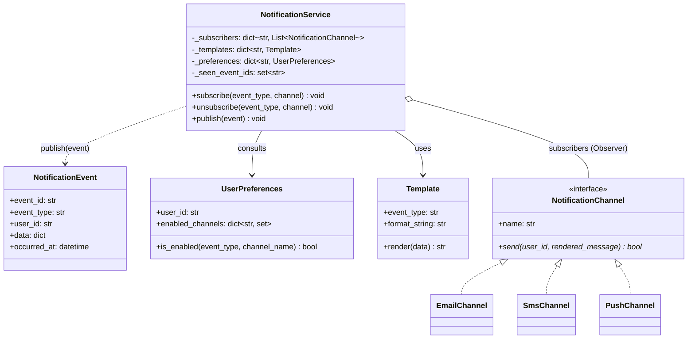
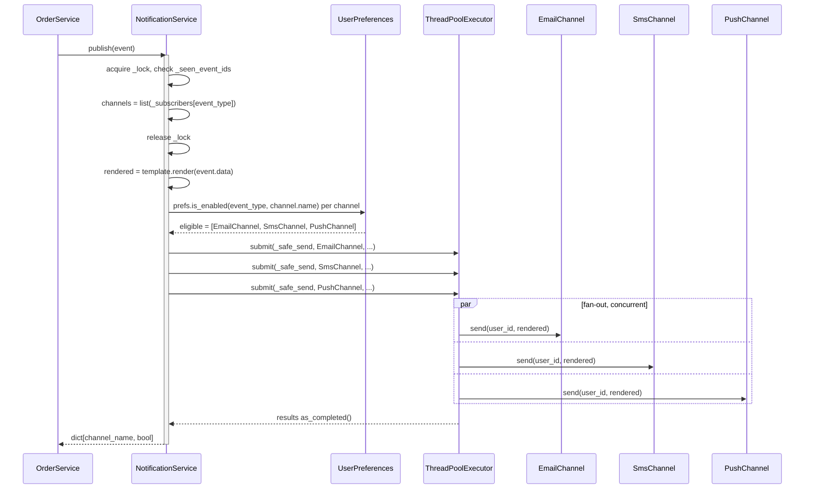

# LLD: Notification System

**Difficulty:** Advanced | **Time:** 40–50 minutes

!!! note "Instructions"
    Design it yourself first — entities, classes, relationships — before reading past step 3. This page follows the [9-step approach](../low-level-design/index.md#the-9-step-approach-use-it-on-every-problem).

!!! info "This is the class-level version"
    This is the single-process, class-level version. For how this scales to millions of users across queues and delivery workers, see [Notification System](../system-design-exercises/notification-system.md).

---

## 1. Problem Statement

Design a notification service, running inside a single process, that supports multiple delivery channels (email, SMS, push), multiple event types that trigger notifications ("order shipped," "password reset," "comment on your post"), per-user preferences for which channels a user has opted into for each event type, and template-based rendering of the outgoing message.

---

## 2. Requirements

**Functional (in scope):**

- Producers (e.g. an `OrderService`) publish an event without knowing which channels or handlers care about it
- Each registered channel decides, per event, whether the target user wants to be notified on that channel
- A `Template` renders a human-readable message from an event's data
- A channel that fails to send does not prevent other channels from sending for the same event
- New channels can be added without modifying the dispatch class

**Explicitly out of scope for this exercise:** durable queues, at-least-once delivery guarantees, retry-with-backoff, dead-letter queues, fan-out to millions of recipients, cross-process/cross-service delivery, provider circuit breakers. All of that belongs to the distributed version — see [Notification System](../system-design-exercises/notification-system.md).

??? question "Clarifying questions worth asking out loud"
    - Is this an in-process notify-and-forget, or does it need to survive a process crash mid-dispatch? (Assume in-process for this exercise — that assumption is what justifies Observer over a message broker.)
    - Can a user have zero channels enabled for an event type? What should happen then?
    - Should channel dispatch be synchronous (caller waits for all sends) or fire-and-forget?
    - Do templates need localization, or is a single-locale format string enough for v1?
    - Can channels be registered/unregistered while the service is running, or only at startup?

---

## 3. Entities

The nouns in the problem statement: `NotificationEvent`, `NotificationChannel` (with concrete `EmailChannel`, `SmsChannel`, `PushChannel`), `UserPreferences`, `Template`, `NotificationService`.

`NotificationService` plays the role of **Subject** in the Observer pattern; each `NotificationChannel` is an **Observer** that subscribes to event types it can potentially handle, then self-filters per delivery using `UserPreferences`.

---

## 4. Class Design



**Why `NotificationService` doesn't hold a reference *into* each channel's internals:** the Subject/Observer relationship is deliberately one-directional and shallow — `NotificationService` knows only that a channel exposes `send()`, not how `EmailChannel` talks to an SMTP server. That's the same interface-over-implementation boundary as `PricingStrategy` in [Parking Lot](parking-lot.md#4-class-design), just applied to Observer instead of Strategy.

---

## 5. Patterns Applied

- **Observer** is the headline pattern here. `OrderService` (or any producer) calls `notification_service.publish(event)` without knowing or caring which channels are subscribed to `"order.shipped"` — it might be zero channels, or three. Adding a new channel later means calling `subscribe()` once at startup, not editing every producer that might trigger a notification. See [Design Patterns — Observer](../low-level-design/design-patterns.md#observer-notify-interested-parties-without-hard-coding-who-they-are).
- **Strategy** for per-channel send logic. `NotificationChannel` is an interface; `EmailChannel.send()`, `SmsChannel.send()`, and `PushChannel.send()` each encapsulate a completely different mechanism (SMTP call, SMS gateway call, push provider call) behind the same signature, so `NotificationService.publish()` never branches on channel type. See [Design Patterns — Strategy](../low-level-design/design-patterns.md#strategy-swap-the-algorithm-without-touching-the-class-that-uses-it).
- **Template Method**, lightly, for rendering: `Template.render(data)` is a single fixed step (format-string substitution) rather than a full class hierarchy, because the problem statement doesn't name a real variation point in *how* rendering happens yet — only *what* gets rendered. If per-channel formatting rules emerged (push needs a 178-character truncation, SMS needs plain text), that would justify promoting `Template` into a Strategy of its own; don't build that speculatively.
- Explicitly **not** using a full pub/sub broker or async queue in-process — that's the distributed system's job. Doing it here would add threading/serialization complexity that this exercise's scope (single process, synchronous producers) doesn't call for.

---

## 6. Core Code

```python
from abc import ABC, abstractmethod
from collections import defaultdict
from concurrent.futures import ThreadPoolExecutor, as_completed
from dataclasses import dataclass, field
from datetime import datetime
from threading import RLock
import uuid


@dataclass
class NotificationEvent:
    event_type: str
    user_id: str
    data: dict
    event_id: str = field(default_factory=lambda: str(uuid.uuid4()))
    occurred_at: datetime = field(default_factory=datetime.now)


class UserPreferences:
    def __init__(self, user_id: str, enabled_channels: dict[str, set[str]]):
        self.user_id = user_id
        # event_type -> set of channel names the user has opted into
        self.enabled_channels = enabled_channels

    def is_enabled(self, event_type: str, channel_name: str) -> bool:
        return channel_name in self.enabled_channels.get(event_type, set())


class Template:
    def __init__(self, event_type: str, format_string: str):
        self.event_type = event_type
        self.format_string = format_string

    def render(self, data: dict) -> str:
        return self.format_string.format(**data)


class NotificationChannel(ABC):
    name: str

    @abstractmethod
    def send(self, user_id: str, rendered_message: str) -> bool:
        """Return True on success. Must not raise for expected send failures —
        raise only for programmer errors, so the service can isolate real faults."""
        ...


class EmailChannel(NotificationChannel):
    name = "email"

    def send(self, user_id: str, rendered_message: str) -> bool:
        # In production: call an SMTP client / SES SDK here.
        print(f"[email] to={user_id}: {rendered_message}")
        return True


class SmsChannel(NotificationChannel):
    name = "sms"

    def send(self, user_id: str, rendered_message: str) -> bool:
        print(f"[sms] to={user_id}: {rendered_message}")
        return True


class PushChannel(NotificationChannel):
    name = "push"

    def send(self, user_id: str, rendered_message: str) -> bool:
        print(f"[push] to={user_id}: {rendered_message}")
        return True


class NotificationService:
    def __init__(self, max_workers: int = 8):
        self._subscribers: dict[str, list[NotificationChannel]] = defaultdict(list)
        self._templates: dict[str, Template] = {}
        self._preferences: dict[str, UserPreferences] = {}
        self._seen_event_ids: set[str] = set()      # idempotency guard
        self._lock = RLock()                          # protects subscriber list mutation
        self._executor = ThreadPoolExecutor(max_workers=max_workers)

    def register_template(self, template: Template) -> None:
        self._templates[template.event_type] = template

    def set_preferences(self, prefs: UserPreferences) -> None:
        self._preferences[prefs.user_id] = prefs

    def subscribe(self, event_type: str, channel: NotificationChannel) -> None:
        with self._lock:
            self._subscribers[event_type].append(channel)

    def unsubscribe(self, event_type: str, channel: NotificationChannel) -> None:
        with self._lock:
            if channel in self._subscribers.get(event_type, []):
                self._subscribers[event_type].remove(channel)

    def publish(self, event: NotificationEvent) -> dict[str, bool]:
        # Idempotency: a duplicate event_id (retried producer call, etc.) is a no-op.
        with self._lock:
            if event.event_id in self._seen_event_ids:
                return {}
            self._seen_event_ids.add(event.event_id)
            # Snapshot the subscriber list under the lock so a concurrent
            # subscribe()/unsubscribe() mid-dispatch can't mutate the list
            # we're about to iterate.
            channels = list(self._subscribers.get(event.event_type, []))

        if not channels:
            return {}

        template = self._templates.get(event.event_type)
        if template is None:
            raise ValueError(f"no template registered for event_type={event.event_type!r}")
        rendered = template.render(event.data)

        # Snapshot preferences once per publish — a preference change that lands
        # after this snapshot is taken applies to the *next* event, not this one.
        prefs = self._preferences.get(event.user_id)
        eligible = [
            ch for ch in channels
            if prefs is not None and prefs.is_enabled(event.event_type, ch.name)
        ]
        if not eligible:
            return {}                                  # opted out of every channel — silent no-op

        return self._dispatch(event.user_id, rendered, eligible)

    def _dispatch(self, user_id: str, rendered: str, channels: list[NotificationChannel]) -> dict[str, bool]:
        # Fan out to channels concurrently so a slow SMS gateway doesn't delay
        # email/push for the same event.
        futures = {
            self._executor.submit(self._safe_send, ch, user_id, rendered): ch.name
            for ch in channels
        }
        results: dict[str, bool] = {}
        for future in as_completed(futures):
            channel_name = futures[future]
            results[channel_name] = future.result()    # _safe_send never raises
        return results

    @staticmethod
    def _safe_send(channel: NotificationChannel, user_id: str, rendered: str) -> bool:
        # A failure in one channel must never take down dispatch for the others.
        try:
            return channel.send(user_id, rendered)
        except Exception:
            return False
```

---

## 7. Edge Cases

| Case | Handling |
|------|----------|
| User has opted out of every channel for this event type | `publish()` computes `eligible` as empty and returns without calling any channel — a silent no-op, not an error, since "don't notify me" is a valid, expected state |
| A channel's `send()` raises or returns `False` | `_safe_send` catches exceptions per-channel; `_dispatch` still submits and awaits every other channel independently, so one broken provider doesn't block the rest |
| Same event delivered twice (producer retries, double-call) | `_seen_event_ids` keyed by `event_id` short-circuits `publish()` on the second call — this is the in-process analog of the delivery-log idempotency key in the [distributed version](../system-design-exercises/notification-system.md#12-delivery-tracking-and-idempotency) |
| A user's preferences change while a `publish()` for them is mid-flight | The preference snapshot is taken once, under the lock, before dispatch starts — the in-progress call uses that snapshot; the *next* `publish()` sees the new preferences. Don't re-check preferences per-channel mid-dispatch, or a slow channel could observe a different preference state than a fast one for the same event |
| No template registered for an event type | `publish()` raises `ValueError` immediately — this is a configuration bug (a producer publishing an event type nobody wired up a template for), not a runtime condition to swallow silently |
| A channel is unsubscribed while `publish()` is iterating | Can't happen mid-iteration: the subscriber list is copied under `self._lock` before dispatch starts, so `_dispatch` always iterates a consistent snapshot rather than a list another thread is mutating |

---

## 8. Concurrency



Two distinct concurrency concerns, and they're solved differently.

**Fan-out to channels for one event.** `_dispatch` submits every eligible channel's `send()` to a `ThreadPoolExecutor` and gathers results with `as_completed`, rather than looping and calling `send()` synchronously one channel at a time. If `SmsChannel.send()` blocks for 2 seconds on a slow gateway and it ran first in a serial loop, email and push for the *same event* would wait behind it for no reason — see [Concurrency Basics — Race Conditions](../low-level-design/concurrency-basics.md#race-conditions) for why "looks safe because it's sequential" is itself a common source of latency bugs, not just correctness bugs. Concurrent dispatch removes that head-of-line blocking.

**Thread-safety of the subscriber list.** If channels can be registered or unregistered at runtime (e.g. an admin panel enabling a new `PushChannel` without a restart), `subscribe()`/`unsubscribe()` mutate `self._subscribers[event_type]` — a plain Python list — while `publish()` might be reading it concurrently on another thread. Two things make this safe here:

1. **All three methods take `self._lock`.** `subscribe`/`unsubscribe` wrap their list mutation in the lock; `publish` takes the same lock just long enough to check-and-mark `_seen_event_ids` and copy the current subscriber list into a new list. This is the standard fix from [Concurrency Basics — Locks](../low-level-design/concurrency-basics.md#locks): protect the shared mutable structure, not the code that merely reads a copy of it.
2. **The lock's critical section is deliberately tiny.** It covers "mark this event seen" and "copy the list," not the actual sends — `_dispatch`'s network-bound channel calls run entirely outside the lock. Holding the lock across `send()` calls would serialize every publish behind whichever one is currently mid-dispatch, defeating the point of the thread pool.

`RLock` (not a plain `Lock`) is used because a future extension might have `publish()` call another service method that also needs the lock on the same thread — reentrant locking avoids a self-deadlock in that case, at negligible cost here.

---

## 9. Extensibility

| New requirement | What changes | What doesn't |
|---|---|---|
| Add a Slack/webhook channel | One new `NotificationChannel` implementation, one `subscribe()` call at startup | `NotificationService`, every existing channel — zero edits, this is the Open/Closed payoff of Observer + Strategy together |
| Rate-limit notifications per user per channel | Wrap or decorate `NotificationChannel.send()` with a check against a token-bucket/sliding-window counter before calling the real channel — same shape as the [Rate Limiter](../reliability/rate-limiting.md) exercise, applied per-channel instead of per-API-endpoint | `NotificationEvent`, `Template`, `NotificationService.publish()` |
| A/B test template variants | `Template` gains a variant key and a selection rule (hash user_id → variant); `_templates` becomes keyed by `(event_type, variant)` | `NotificationChannel` implementations, dispatch/fan-out logic |
| Scale to millions of recipients across a fleet of workers | This whole class becomes one node behind a queue-fed worker pool; `publish()`'s in-process fan-out becomes a durable per-channel queue, and preference/template lookups move to a shared cache — this is exactly the jump documented in [Notification System (distributed)](../system-design-exercises/notification-system.md), and this class-level design is the thing that gets embedded inside each worker, not thrown away | The Observer/Strategy interfaces themselves — `NotificationChannel.send()` still has the same shape, it's just called from a queue consumer instead of a synchronous `publish()` |

---

## Interview Questions

=== "Foundation"
    **Q: Why is `NotificationChannel` an interface with multiple implementations instead of a single class with an `if channel_type == "email"` branch?**

    "Because the set of channels is a named variation point — the problem statement lists email, SMS, and push today, and a Slack channel or webhook tomorrow is entirely plausible. An `if/elif` chain means every new channel is an edit to `NotificationService`, which violates Open/Closed and makes the dispatch method grow forever. Making `NotificationChannel` an ABC with a `send()` method means adding a channel is a new class, and `NotificationService` never needs to change or even know the concrete channel types exist."

=== "Senior"
    **Q: Walk me through what happens, end to end, when `OrderService` publishes an `order.shipped` event for a user who has email enabled but SMS disabled for that event type.**

    "`publish()` first checks `_seen_event_ids` for idempotency, then takes the lock just long enough to snapshot the subscriber list for `order.shipped` — say that's `[EmailChannel, SmsChannel]`. It renders the message once from the registered `Template`. Then it filters that channel list against the user's `UserPreferences.is_enabled('order.shipped', channel.name)` — `email` passes, `sms` doesn't, so `eligible` ends up as just `[EmailChannel]`. That's submitted to the thread pool, `EmailChannel.send()` runs, and the result comes back in the returned dict. The SMS channel is never touched — not called and skipped, just never in the eligible list to begin with. The key design point is that the filtering happens once, centrally, in `NotificationService`, not inside each channel — a channel shouldn't need to know about preferences at all, it just sends what it's told to send."

=== "Staff"
    **Q: How is the Observer pattern you've built here different from a real pub/sub message queue, and when would you graduate from this design to the distributed one?**

    "The core difference is durability and coupling to the caller's lifetime. What I've built is in-process, synchronous-from-the-publisher's-perspective Observer: `publish()` calls `subscriber.send()` directly (via a thread pool, but still within the same process), so if the process crashes between accepting the event and a channel finishing its send, that notification is just gone — there's no persistence layer backing it. A message broker like Kafka or SQS decouples producer and consumer completely: the event is durably persisted before the producer's call even returns, consumers can be down and catch up later, and you get at-least-once delivery guarantees independent of any single process staying alive.

    I'd graduate from this design the moment any of three pressures show up: first, volume — if fan-out targets thousands or millions of recipients per event, in-process thread-pool dispatch doesn't scale and you need queue-backed workers that can be scaled horizontally. Second, durability — if a notification silently disappearing on a crash is unacceptable (a password-reset email, say), you need the event persisted before ack, which this design doesn't do. Third, cross-process producers — if `OrderService` and the notification dispatcher aren't literally the same running process, Observer's direct method-call model doesn't even apply anymore; you need a network-addressable broker in between regardless of scale.

    What's worth calling out explicitly in an interview: this class-level design isn't wasted work when that migration happens. The `NotificationChannel` interface, the preference-filtering logic, and the template rendering all get reused nearly as-is inside each queue consumer/worker in the distributed version — what changes is what sits *in front* of them, not the dispatch logic itself."

---

## Key Takeaways

!!! success "Remember"
    1. Observer decouples event producers from the set of interested channels — `publish()` never names a concrete channel type, so adding one is a new class, not an edit.
    2. Strategy is what makes each channel's `send()` swappable and independently testable — `NotificationService` depends on the `NotificationChannel` interface, never a concrete implementation.
    3. Filter by user preference centrally, once, before dispatch — not inside each channel — so a channel's only job is "send what I'm told," and preference logic lives in exactly one place.
    4. Concurrent per-channel dispatch (thread pool) prevents one slow channel from delaying the others for the same event; keep the subscriber-list lock's critical section tiny so it doesn't serialize the sends it's meant to parallelize.
    5. This design's ceiling is the process boundary: no durability, no cross-process fan-out. That's not a flaw to fix here — it's precisely the reason the distributed version exists as a separate exercise.

**Previous:** [Logger](logger.md) | **Next:** [Pub/Sub](pub-sub.md)
