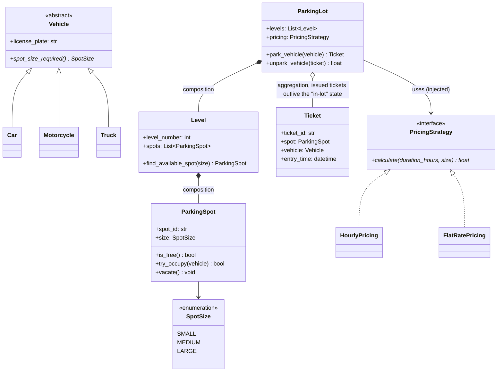

# LLD: Parking Lot

**Difficulty:** Beginner | **Time:** 30–40 minutes

!!! note "Instructions"
    Design it yourself first — entities, classes, relationships — before reading past step 3. This page follows the [9-step approach](../low-level-design/index.md#the-9-step-approach-use-it-on-every-problem).

---

## 1. Problem Statement

Design a parking lot with multiple levels. It has spots of different sizes (motorcycle, compact, large), accepts different vehicle types, tracks which spots are occupied, issues a ticket on entry, and calculates a fee on exit.

---

## 2. Requirements

**Functional (in scope):**

- Multiple levels, each with a fixed number of spots per size
- A vehicle can only park in a spot sized appropriately for it (a motorcycle can use any spot, a car needs compact or larger)
- Issue a `Ticket` on entry recording entry time and spot
- Calculate fee on exit based on duration and a configurable pricing strategy
- Report available spot counts by size, per level

**Explicitly out of scope for v1:** reservations ahead of time, payment processing integration, multiple entry/exit gates coordinating in real time (touched on in Concurrency), EV charging spots.

??? question "Clarifying questions worth asking out loud"
    - Multiple vehicle types beyond car/motorcycle/truck?
    - Is pricing flat, hourly, or does it vary by vehicle size?
    - Should the system pick the *nearest* available spot, or just *any* available spot?
    - What happens if the lot is full — reject, or queue?
    - Single lot or a chain of lots (affects whether `ParkingLot` should be a singleton per building)?

---

## 3. Entities

The nouns in the problem statement: `Vehicle`, `ParkingSpot`, `Level`, `ParkingLot`, `Ticket`, `PricingStrategy`.

---

## 4. Class Design



**Why composition for `ParkingLot *-- Level *-- ParkingSpot`:** spots don't exist independently of the lot — delete the lot, the spots are gone. **Why aggregation for `ParkingLot o-- Ticket`:** a `Ticket` is handed to the driver and conceptually outlives "being tracked by the lot" (it becomes a receipt) — see [Class Relationships](../low-level-design/solid-principles.md#class-relationships-uml-basics).

---

## 5. Patterns Applied

- **Strategy** for `PricingStrategy` — the requirement ("pricing may vary by lot or promotion") is a real variation point, so `ParkingLot` depends on the interface, not a concrete pricing class, and a new pricing scheme is a new class with zero edits to `ParkingLot`. See [Design Patterns](../low-level-design/design-patterns.md#strategy-swap-the-algorithm-without-touching-the-class-that-uses-it).
- **Factory**, only if vehicle creation logic is centralized somewhere (e.g. parsing entry-gate sensor input into the right `Vehicle` subtype) — not shown here because the problem statement doesn't name that pressure; don't add it speculatively.
- Explicitly **not** using Singleton for `ParkingLot` even though "there's only one lot" is tempting — a chain of lots is a plausible v2, and a singleton would need to be unwound later. Pass the single instance around via dependency injection instead.

---

## 6. Core Code

```python
from abc import ABC, abstractmethod
from dataclasses import dataclass, field
from datetime import datetime
from enum import Enum
from threading import Lock
import uuid


class SpotSize(Enum):
    SMALL = 1
    MEDIUM = 2
    LARGE = 3


class Vehicle(ABC):
    def __init__(self, license_plate: str):
        self.license_plate = license_plate

    @abstractmethod
    def spot_size_required(self) -> SpotSize: ...


class Motorcycle(Vehicle):
    def spot_size_required(self) -> SpotSize:
        return SpotSize.SMALL


class Car(Vehicle):
    def spot_size_required(self) -> SpotSize:
        return SpotSize.MEDIUM


class Truck(Vehicle):
    def spot_size_required(self) -> SpotSize:
        return SpotSize.LARGE


class ParkingSpot:
    def __init__(self, spot_id: str, size: SpotSize):
        self.spot_id = spot_id
        self.size = size
        self._occupied_by: Vehicle | None = None
        self._lock = Lock()

    def is_free(self) -> bool:
        return self._occupied_by is None

    def try_occupy(self, vehicle: Vehicle) -> bool:
        with self._lock:                      # check-then-act made atomic
            if self._occupied_by is not None:
                return False
            self._occupied_by = vehicle
            return True

    def vacate(self) -> None:
        with self._lock:
            self._occupied_by = None

    def fits(self, vehicle: Vehicle) -> bool:
        # a motorcycle fits any spot >= SMALL; a car needs >= MEDIUM; a truck needs LARGE
        return self.size.value >= vehicle.spot_size_required().value


class Level:
    def __init__(self, level_number: int, spots: list[ParkingSpot]):
        self.level_number = level_number
        self.spots = spots

    def park(self, vehicle: Vehicle) -> ParkingSpot | None:
        for spot in self.spots:
            if spot.fits(vehicle) and spot.is_free() and spot.try_occupy(vehicle):
                return spot
        return None


class PricingStrategy(ABC):
    @abstractmethod
    def calculate(self, duration_hours: float, size: SpotSize) -> float: ...


class HourlyPricing(PricingStrategy):
    RATES = {SpotSize.SMALL: 1.0, SpotSize.MEDIUM: 2.0, SpotSize.LARGE: 3.0}

    def calculate(self, duration_hours: float, size: SpotSize) -> float:
        return round(duration_hours * self.RATES[size], 2)


@dataclass
class Ticket:
    spot: ParkingSpot
    vehicle: Vehicle
    entry_time: datetime
    ticket_id: str = field(default_factory=lambda: str(uuid.uuid4()))


class ParkingLot:
    def __init__(self, levels: list[Level], pricing: PricingStrategy):
        self.levels = levels
        self.pricing = pricing              # injected — see Dependency Inversion
        self._active_tickets: dict[str, Ticket] = {}
        self._by_plate: dict[str, Ticket] = {}
        self._lock = Lock()

    def park_vehicle(self, vehicle: Vehicle) -> Ticket | None:
        for level in self.levels:
            spot = level.park(vehicle)
            if spot:
                ticket = Ticket(spot=spot, vehicle=vehicle, entry_time=datetime.now())
                with self._lock:
                    if vehicle.license_plate in self._by_plate:
                        spot.vacate()
                        raise ValueError(f"{vehicle.license_plate} already has an active ticket")
                    self._active_tickets[ticket.ticket_id] = ticket
                    self._by_plate[vehicle.license_plate] = ticket
                return ticket
        return None                          # lot full for this vehicle's size class

    def unpark_vehicle(self, ticket: Ticket) -> float:
        with self._lock:                      # validate-and-consume must be atomic with the lookup
            if self._active_tickets.get(ticket.ticket_id) is not ticket:
                raise ValueError(f"ticket {ticket.ticket_id!r} is not active — already exited or unknown")
            del self._active_tickets[ticket.ticket_id]
            self._by_plate.pop(ticket.vehicle.license_plate, None)

        duration_hours = (datetime.now() - ticket.entry_time).total_seconds() / 3600
        fee = self.pricing.calculate(duration_hours, ticket.spot.size)
        ticket.spot.vacate()
        return fee
```

---

## 7. Edge Cases

| Case | Handling |
|------|----------|
| Lot is full for the vehicle's size class | `park_vehicle` returns `None`; caller (entry gate) displays "Lot Full" and does not issue a ticket |
| Vehicle already has an active ticket (re-entry without exit) | Reject at the gate — track active tickets by `license_plate`, refuse a second `park_vehicle` for the same plate |
| Ticket presented at exit doesn't match any tracked active ticket (unknown, already used, or a stale copy for a spot since reassigned) | `unpark_vehicle` looks the ticket up by `ticket_id` in `_active_tickets` and raises if it isn't the tracked active ticket for that ID, so a reused or forged ticket can neither double-charge nor vacate a spot it no longer owns |
| A `Truck` arrives and only `SMALL` spots remain | `fits()` correctly returns `False` — this is why size is an ordered enum, not a string match |
| Two gates issue tickets for the same spot simultaneously | Covered in Concurrency below — this is the core correctness question for this problem |
| Fee calculation for a duration under 1 hour | Decide up front: round up to a full hour, or pro-rate — state the choice, both are defensible, just be explicit |

---

## 8. Concurrency

Two entry gates calling `park_vehicle()` at the same instant must not both succeed in claiming the same `ParkingSpot`. The design above already handles this: `ParkingSpot.try_occupy()` wraps the check-then-act in a per-spot `Lock`, so the race window from [Concurrency Basics](../low-level-design/concurrency-basics.md#race-conditions) is closed at the smallest possible granularity — one spot, not the whole lot.

**Why per-spot locking, not a lock around the whole `ParkingLot`:** a coarse lock would serialize every `park_vehicle()` call lot-wide, even when two vehicles are headed for spots on different levels. Locking at the `ParkingSpot` level lets unrelated spots be claimed concurrently — the throughput win described in [Concurrency Basics](../low-level-design/concurrency-basics.md#locks).

**What would introduce a deadlock risk:** if a future requirement needed to atomically move a vehicle between two spots (e.g. valet re-parking), that operation would need to lock two `ParkingSpot`s at once — at that point, a consistent lock ordering (e.g., always lock the lower `spot_id` first) becomes mandatory, exactly as in the [transfer-between-accounts example](../low-level-design/concurrency-basics.md#deadlocks).

A second, separate race exists on exit: two gates presenting the *same* ticket at the same instant must not both succeed in vacating the spot and collecting a fee — and a ticket for a spot that has since been reassigned to another vehicle must not be able to vacate that new occupant's spot. `ParkingLot._active_tickets` closes this with its own coarse `_lock`: the "is this ticket still active" check and its removal from the map happen atomically, so only the first caller to win the lock proceeds, and every other presentation of that ticket ID sees it already gone. This lock is intentionally lot-wide rather than per-ticket — exits are far less frequent than the per-spot contention `try_occupy()` handles, so the extra serialization here is not the throughput concern coarse locking is elsewhere in this design.

---

## 9. Extensibility

| New requirement | What changes | What doesn't |
|---|---|---|
| Add EV charging spots | New `SpotSize` or a composed `ChargingCapability` on `ParkingSpot`; `fits()` gets one more condition | `ParkingLot`, `Level`, `Ticket` — untouched |
| Add a "find nearest spot to elevator" allocation policy | Swap `Level.park()`'s linear scan for a different allocation `Strategy` | `ParkingSpot`, `ParkingLot.park_vehicle` |
| Add dynamic/surge pricing | New `PricingStrategy` implementation | `ParkingLot`, `Ticket`, every existing pricing class |
| Support a chain of lots across a city | `ParkingLot` becomes one of several instances behind a `ParkingLotDirectory`; no internal change to `ParkingLot` itself | `Level`, `ParkingSpot`, `Ticket` |

---

## Interview Questions

=== "Foundation"
    **Q: Why is `ParkingSpot` composed inside `Level` rather than `Level` and `ParkingSpot` being independent, loosely-associated classes?**

    "Because a spot has no meaning or lifecycle outside its level — if a level is decommissioned, its spots go with it. That's the definition of composition versus aggregation: does the child outlive the parent conceptually? Here, no. Compare that to `Ticket`, which I modeled as aggregation — a ticket is handed to the driver and conceptually outlives the moment the vehicle is 'in' the lot, so the lot references it but doesn't own its lifecycle the same way."

=== "Senior"
    **Q: Two vehicles arrive at two different entry gates at the exact same moment and are both routed to the same spot. Walk through how your design prevents a double-booking.**

    "`Level.park()` iterates spots and calls `try_occupy()`, which wraps a check (`is_free`) and an act (set `_occupied_by`) inside a single per-spot lock. Both gates' threads might both reach that spot in their scan, but only one will successfully acquire the lock and see `_occupied_by is None`; the other blocks briefly, then sees it's already occupied and moves to the next candidate spot. The critical design decision was collapsing 'check if free' and 'mark as occupied' into one atomic method — if I'd left them as two separate calls, there'd be a race window between them regardless of how careful the calling code looked."

=== "Staff"
    **Q: The business now wants valet parking, where an attendant can move a vehicle from a temporary spot to a permanent one, potentially swapping two vehicles between spots. How does this change your concurrency model, and what's the systemic risk?**

    "A single vehicle move is still one atomic `try_occupy` on the destination plus a `vacate` on the source — that's safe as long as I do destination-first (never vacate the source until the destination successfully claims), so a crash mid-move fails safe by leaving the vehicle in its original spot rather than losing it entirely. A *swap* between two spots is the riskier case: it needs both spots locked simultaneously, which is exactly the two-lock scenario that risks deadlock if two swaps run concurrently and grab their two spots in opposite order. The systemic fix is the same as the bank-transfer example — never let call-site argument order decide lock acquisition order; always sort the two spot IDs and lock the lower one first, and I'd enforce that through a single `swap_spots()` helper that's the *only* code path allowed to hold two spot locks at once, rather than trusting every future caller to remember the ordering rule."

---

## Key Takeaways

!!! success "Remember"
    1. Composition vs. aggregation is decided by lifecycle: does the child outlive the parent? Spots don't; issued tickets do.
    2. Strategy earns its place here because pricing is explicitly named as something that varies — don't add Factory or Singleton speculatively.
    3. `try_occupy()` collapsing check-and-act into one atomic, lock-protected method is the entire concurrency fix — get the interface right and the lock is trivial.
    4. Per-spot locking beats a lot-wide lock for throughput; only reach for multi-lock ordering discipline when an operation genuinely needs two locks at once (e.g. valet swap).
    5. A new spot type, pricing scheme, or allocation policy should each be a new class, not an edit to `ParkingLot` — that's Open/Closed paying off.

**Previous:** [LLD Problem Roadmap](index.md) | **Next:** [Elevator System](elevator-system.md)
