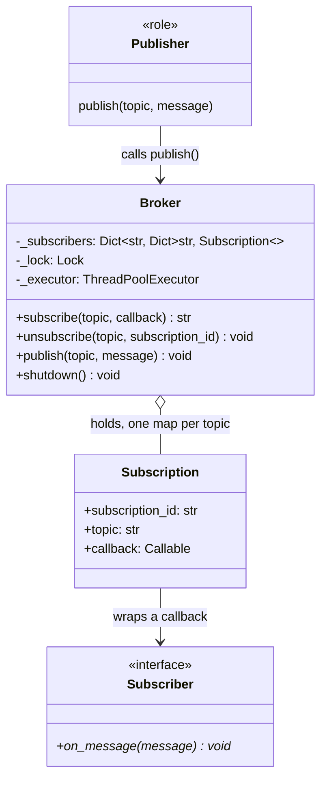

# LLD: Pub/Sub

**Difficulty:** Advanced | **Time:** 40–50 minutes

!!! note "Instructions"
    Design it yourself first — entities, classes, relationships — before reading past step 3. This page follows the [9-step approach](../low-level-design/index.md#the-9-step-approach-use-it-on-every-problem).

---

## 1. Problem Statement

Design an in-process publish-subscribe broker. Publishers publish messages to named topics without knowing who — if anyone — is listening. Subscribers subscribe to a topic by name and receive every message published to it *after* they subscribe. The system supports many independent topics at once, and a subscriber can unsubscribe at any time. Design for many subscribers per topic and frequent, high-volume publish calls — this is a mechanism other in-process components build on, not a one-off feature.

---

## 2. Requirements

**Functional (in scope):**

- Create/address topics implicitly by name (publishing or subscribing to an unknown topic name just works — no separate "create topic" step)
- `subscribe(topic, callback)` registers a callback and returns a subscription handle/id
- `unsubscribe(topic, subscription_id)` removes that subscriber from that topic
- `publish(topic, message)` delivers the message to every subscriber currently on that topic
- Many topics, many subscribers per topic, frequent publishes — this must not degrade badly as either number grows
- One subscriber's callback misbehaving (throws, or is slow) must not prevent delivery to the other subscribers on the same topic

**Explicitly out of scope for v1:** durability (messages surviving a process restart), cross-process or cross-machine delivery, consumer groups / partitioning, persistence/replay of missed messages. That's the job of a real message broker — see [Kafka Deep Dive](../messaging/kafka.md) for the distributed, durable version of this same idea. This page is about the in-process primitive: a fan-out mechanism living inside one process's memory.

??? question "Clarifying questions worth asking out loud"
    - Synchronous delivery (publisher blocks until every subscriber's callback returns) or asynchronous (publisher hands off and returns immediately)?
    - What happens if a subscriber's callback throws an exception — does it break delivery to the rest, or crash the publisher?
    - What happens if a subscriber's callback is slow — can it block the publisher, or other subscribers, or other topics?
    - What ordering guarantee is expected — do subscribers on the same topic need to see messages in publish order, and does that ordering need to hold per-subscriber or globally across concurrent publishers?
    - Is at-least-once delivery within the process enough, or does a subscriber need a guarantee it won't miss a message published while it was mid-processing the previous one?

---

## 3. Entities

The nouns in the problem statement: `Topic` (really just a name — a key in the broker's internal map, not a class of its own here), `Publisher` (any caller of `publish()` — not a class either, just a role), `Subscriber` (an interface: something with an `on_message` callback), `Subscription` (the handle returned by `subscribe()`, needed to unsubscribe later), and the `Broker` (a.k.a. `PubSubSystem`) that owns the topic → subscriber-list mapping and does the dispatching.

---

## 4. Class Design



This is Observer generalized from "one subject, one observer list" to "N independent subjects (topics), each with its own observer list, addressed by name instead of by object reference." The `ParkingLot` in the [Observer pattern writeup](../low-level-design/design-patterns.md#observer-notify-interested-parties-without-hard-coding-who-they-are) has exactly one `_observers: list[Observer]`. Here the broker owns `_subscribers: dict[str, dict[str, Subscription]]` — topic name maps to a collection of subscriptions.

**Why a dict of dicts, not a dict of lists:** the inner collection needs to support `unsubscribe(topic, subscription_id)` — find-and-remove one specific subscriber out of potentially thousands. A `list[Subscriber]` makes that an O(n) linear scan; a `dict[str, Subscription]` keyed by `subscription_id` makes it O(1). At "many subscribers per topic" scale, that difference is the entire point of the exercise (see Patterns Applied below) — pick the data structure for the operation you'll actually be doing frequently, not just the one that's simplest to write.

---

## 5. Patterns Applied

- **Observer** is the whole pattern here — one topic publishing a message is exactly "notify interested parties without hard-coding who they are." See [Design Patterns — Observer](../low-level-design/design-patterns.md#observer-notify-interested-parties-without-hard-coding-who-they-are). The generalization from the textbook version is going from one subject to N named subjects (topics) sharing one broker, which is why the broker's core state is a *map of* observer collections, not a single one.

- **What breaks in the naive Observer implementation at this scale**, concretely:
    - The textbook `Observer` example uses `self._observers: list[Observer]` and `self._observers.append(observer)` for subscribe. Removing one specific subscriber (`list.remove(observer)`) is O(n) — acceptable for a handful of dashboard widgets watching one `ParkingLot`, but not when a topic can have thousands of subscribers and subscribe/unsubscribe churn is frequent (e.g. UI components mounting/unmounting, each subscribing on mount and unsubscribing on unmount). At that scale, O(n) unsubscribe under contention becomes a measurable bottleneck. The fix is keying the collection by a `subscription_id` in a dict/set, making both subscribe and unsubscribe O(1).
    - The textbook example calls `obs.update(event)` directly in a loop inside `_notify()`, on the calling thread. That's fine when observers are trusted, fast, local objects. It is not fine at pub/sub scale where subscribers are arbitrary, possibly slow, possibly buggy callbacks — the whole reason this page treats **dispatch strategy** (sync in-line vs. thread pool) as a first-class design decision rather than an implementation detail. See Core Code and Concurrency below.
    - Iterating the live observer list while another thread mutates it (a subscribe or unsubscribe arriving mid-publish) is exactly the "RuntimeError: set/dict changed size during iteration" failure mode — not present in the single-threaded textbook example, front and center here.

---

## 6. Core Code

```python
from __future__ import annotations

import logging
import threading
import uuid
from concurrent.futures import ThreadPoolExecutor
from dataclasses import dataclass
from typing import Callable

logger = logging.getLogger(__name__)

Message = object          # any payload; kept generic on purpose
Callback = Callable[[Message], None]


@dataclass(frozen=True)
class Subscription:
    subscription_id: str
    topic: str
    callback: Callback


class Broker:
    """In-process publish-subscribe broker.

    Delivery is asynchronous (dispatched via a thread pool) and best-effort
    at-least-once within the process: a subscriber that's registered when
    publish() is called will be handed the message exactly once, unless its
    own callback raises after partially processing it (out of scope to
    de-duplicate that — see Edge Cases).
    """

    def __init__(self, max_workers: int = 16):
        self._subscribers: dict[str, dict[str, Subscription]] = {}
        self._lock = threading.Lock()
        self._executor = ThreadPoolExecutor(max_workers=max_workers)

    def subscribe(self, topic: str, callback: Callback) -> str:
        subscription_id = str(uuid.uuid4())
        sub = Subscription(subscription_id, topic, callback)
        with self._lock:
            self._subscribers.setdefault(topic, {})[subscription_id] = sub
        return subscription_id

    def unsubscribe(self, topic: str, subscription_id: str) -> None:
        with self._lock:
            topic_subs = self._subscribers.get(topic)
            if topic_subs is not None:
                topic_subs.pop(subscription_id, None)   # no-op if already gone

    def publish(self, topic: str, message: Message) -> None:
        # Snapshot under the lock, then release before dispatching — a publish
        # must never hold the lock while calling into subscriber code (see
        # Concurrency). list() copies the values out of the dict at this instant;
        # subscribes/unsubscribes that happen after this line don't affect this
        # publish's delivery set.
        with self._lock:
            subs = list(self._subscribers.get(topic, {}).values())

        if not subs:
            return                                        # zero subscribers: no-op, not an error

        for sub in subs:
            self._executor.submit(self._deliver, sub, message)

    def _deliver(self, sub: Subscription, message: Message) -> None:
        # Runs on a worker thread. Exception isolation: one subscriber's
        # callback throwing must not prevent delivery to any other subscriber,
        # nor propagate back to the publisher's thread.
        try:
            sub.callback(message)
        except Exception:
            logger.exception(
                "subscriber %s on topic %r raised while handling a message; "
                "isolated, other subscribers unaffected",
                sub.subscription_id, sub.topic,
            )

    def shutdown(self, wait: bool = True) -> None:
        self._executor.shutdown(wait=wait)
```

**Why `ThreadPoolExecutor.submit` per subscriber, not a synchronous loop calling every callback in turn:** a synchronous loop means `publish()` doesn't return until the *slowest* subscriber's callback finishes, and one subscriber that hangs blocks delivery to every other subscriber on that publish call, and blocks the publisher itself. Dispatching each delivery as an independent submitted task means the publisher returns as soon as the snapshot is taken and the tasks are queued — a slow or hung subscriber only delays itself.

---

## 7. Edge Cases

| Case | Handling |
|------|----------|
| `publish()` to a topic with zero subscribers | Returns immediately after finding an empty (or absent) subscriber map for that topic — a no-op, not an error, since publishers don't know or care who's listening |
| `subscribe`/`unsubscribe` racing with an in-flight `publish` on the same topic | `publish` snapshots the subscriber collection under the lock before dispatching (see Concurrency) — a subscribe arriving after the snapshot simply won't receive that message (correct: it wasn't subscribed "yet" from the broker's point of view), and an unsubscribe arriving after the snapshot may still receive one already-in-flight message, which is consistent with "at-least-once, not exactly-once" |
| A subscriber's callback raises an exception | Caught and logged inside `_deliver`, isolated per-subscriber; delivery to every other subscriber on that topic (and every other topic) proceeds unaffected |
| A subscriber never unsubscribes (e.g. a component that leaked its reference) | Unbounded memory growth in `_subscribers` — the broker itself can't tell "abandoned" from "still interested." Mitigation: hold subscriber callbacks via `weakref.WeakMethod` (for bound methods) so a garbage-collected subscriber's entry can be pruned lazily, at the cost of needing to prune the resulting dead references somewhere; simplest is still an explicit `unsubscribe` contract enforced by convention (e.g. via a context manager) |
| Two different topics named identically by accident (typo) vs. intentionally shared | Not the broker's problem to solve — topic names are just strings; if collision-avoidance matters, that's a naming convention on top (e.g. namespacing `orders.created` vs. `billing.created`), not a broker feature |
| Publisher publishes before any subscriber exists, expecting a late subscriber to catch up | Explicitly not supported — "receive every message published *after* they subscribe" is the requirement; no replay buffer. A subscriber that needs history should ask for a replay-capable broker (see Extensibility) |

---

## 8. Concurrency

This is the crux of the exercise — "Observer at scale, thread-safe subscriber management." Three operations touch the same shared state (`_subscribers`) from different threads at will: `subscribe`, `unsubscribe`, and `publish`.

**The bug a naive version has:** iterate the live subscriber collection directly inside `publish()` while another thread calls `subscribe()` or `unsubscribe()` on the same topic. Mutating a `dict`/`set` while another thread iterates it raises `RuntimeError: dict changed size during iteration` (or, without that safety check, silently skips or double-visits entries) — the same class of race as [Race Conditions](../low-level-design/concurrency-basics.md#race-conditions), just surfacing as a crash instead of a lost update.

**The fix — snapshot, then release, then dispatch:**

```python
with self._lock:
    subs = list(self._subscribers.get(topic, {}).values())   # copy, under the lock
# lock is released here — before any subscriber callback runs
for sub in subs:
    self._executor.submit(self._deliver, sub, message)
```

`list(...)` copies the *values* out of the dict while the lock is held, so the copy is internally consistent — no other thread can be mid-mutation of that dict at the moment of the copy. Once the copy exists, the lock is released immediately; nothing about calling `_deliver` (or even just `submit`-ing it) happens while the lock is held.

**Why the lock must not be held across dispatch:** this is the exact same lesson as "don't hold a lock across I/O" from [Locks](../low-level-design/concurrency-basics.md#locks) — a subscriber's callback is arbitrary code the broker doesn't control, potentially slow, potentially making a network call. If `publish()` held `self._lock` for the duration of calling every subscriber's callback:

- every other `publish()` call — even to a *different* topic, since this implementation uses one broker-wide lock — would serialize behind it, meaning the whole system's publish throughput degrades to the speed of the single slowest subscriber callback anywhere.
- `subscribe()`/`unsubscribe()` calls would also block for that same duration, since they need the same lock.
- worst case, a subscriber callback that itself calls `broker.subscribe()` or `broker.unsubscribe()` (e.g. "unsubscribe myself after handling this message") would deadlock outright — the callback is running on a thread that's waiting to re-acquire a lock its own call stack is already holding.

Copy-then-release avoids all three: the lock's critical section is just "copy references out of a dict," which is fast and bounded, never proportional to subscriber count or subscriber behavior.

**Why a broker-wide lock instead of a per-topic lock:** subscribe/unsubscribe/snapshot are all O(1)-ish dict operations already — the critical section is short regardless of topic count, so a single lock's contention cost is low compared to the complexity of managing one lock per topic (including the bookkeeping of creating/tearing down per-topic locks as topics come and go). If profiling showed the single lock was a bottleneck under many concurrent topics, sharding to a per-topic lock (or a `dict` of locks keyed by topic name) would be the natural next step — the same "coarse vs. fine-grained" trade-off discussed in the [Parking Lot exercise](parking-lot.md#8-concurrency).

---

## 9. Extensibility

| New requirement | What changes | What doesn't |
|---|---|---|
| Wildcard/pattern topic subscriptions (e.g. subscribe to `orders.*`) | `subscribe` needs a pattern-matching pass (or a trie/prefix index) instead of a single exact-key dict lookup in `publish`; `_subscribers` keyed lookup becomes a match over registered patterns | `Subscription`, exception isolation, dispatch-via-thread-pool |
| Message filtering/predicates per subscriber (only deliver if `predicate(message)` is true) | Add an optional `predicate: Callable[[Message], bool]` to `Subscription`; `_deliver` (or the snapshot step) checks it before calling the callback | Locking/snapshot strategy, topic structure |
| Upgrade to at-least-once *with* ack/retry (subscriber must confirm receipt, broker retries on timeout) | Needs per-message, per-subscriber delivery state (an outbox/ack table) and a retry scheduler — a materially bigger design, edging toward what a real message queue does | The `subscribe`/`unsubscribe` API shape can stay the same |
| Promote to a distributed, durable broker | Out of scope for this in-process design entirely — that's [Kafka Deep Dive](../messaging/kafka.md): partitions, replication, consumer groups, and durability all solve problems this in-memory `Broker` doesn't attempt to | The in-process `Broker` remains useful as a building block *within* one node of a distributed system |

---

## Interview Questions

=== "Foundation"
    **Q: Why does `publish()` return without waiting for subscriber callbacks to finish?**

    "Because I dispatch each delivery to a thread pool instead of calling callbacks synchronously in a loop. If I called them synchronously, `publish()` wouldn't return until every subscriber's callback finished — including a subscriber that's slow, or hung, or making a blocking network call. That would mean the publisher's own performance depends on code it doesn't control and can't predict. Submitting each delivery as an independent task means `publish()` only pays for taking a snapshot of the subscriber list and queuing the work, which is fast and bounded regardless of what any subscriber does."

=== "Senior"
    **Q: A subscriber unsubscribes from a topic at the exact moment a publish to that topic is in flight. What does your design guarantee, and why?**

    "I snapshot the subscriber collection under the lock at the start of `publish()` — `list(self._subscribers.get(topic, {}).values())` — before dispatching anything. So the guarantee is: whoever was subscribed at the instant the snapshot was taken gets the message, even if they unsubscribe microseconds later while their delivery task is still queued or running. That's a deliberate choice, not an accident — it means delivery is 'at-least-once relative to subscription state at publish time,' which is simpler to reason about than trying to cancel in-flight deliveries when an unsubscribe races in. The alternative — checking subscription-still-active right before calling the callback — adds complexity for a guarantee ('never deliver after unsubscribe') that the requirements didn't actually ask for."

=== "Staff"
    **Q: Why not just hold the lock for the entire `publish()` call, including while calling every subscriber's callback? It would be simpler — no separate snapshot step.**

    "Two independent reasons, and either one alone would kill it. First, throughput: if the lock is held across every callback invocation, every other `publish()` call across the *whole broker* — not just this topic, since it's one lock — has to wait its turn behind however long this topic's subscribers take to run. One slow subscriber on one topic would throttle publishing to every other topic in the system. Second, and worse: it's a deadlock waiting to happen. Subscriber callbacks are arbitrary code I don't control — if one of them calls `broker.unsubscribe()` on itself, or subscribes a follow-up handler, from inside its own `on_message`, that call needs the same lock the publish call is already holding on the same thread. With a plain `Lock` that's an immediate deadlock; even with a reentrant `RLock` it'd only be safe for that exact thread re-entering, not for correctness in general, and it's fragile to rely on. The fix is copy-then-release: hold the lock only long enough to snapshot the subscriber list into a plain Python list, release it, and only then start calling out to subscriber code. That converts the lock's critical section from 'unbounded, depends on subscriber behavior' into 'a few dict reads,' which is the same 'never hold a lock across a call you don't control' discipline as not holding a lock across I/O or a network call."

---

## Key Takeaways

!!! success "Remember"
    1. Pub/Sub is Observer generalized from one subject to N named subjects sharing one broker — the topic → subscriber-collection map is the entire structural difference.
    2. Keying subscribers by `subscription_id` in a dict (not a list) turns unsubscribe from O(n) into O(1) — the thing that actually matters "at scale."
    3. Dispatch via a thread pool, not a synchronous loop, so one slow or hung subscriber can't block the publisher or other subscribers; wrap each callback invocation in its own try/except so one throwing subscriber can't stop delivery to the rest.
    4. Snapshot the subscriber collection under the lock, then release the lock *before* dispatching — never hold a lock across a call into code you don't control. This is both a throughput fix and a deadlock fix (a subscriber callback that re-enters the broker would otherwise deadlock against itself).
    5. Durability, replay, and cross-process delivery are explicitly out of scope — that's what a real broker like Kafka adds on top of this same fan-out idea.

**Previous:** [Notification System (LLD)](notification-system.md) | **Next:** [Task Scheduler](task-scheduler.md)
