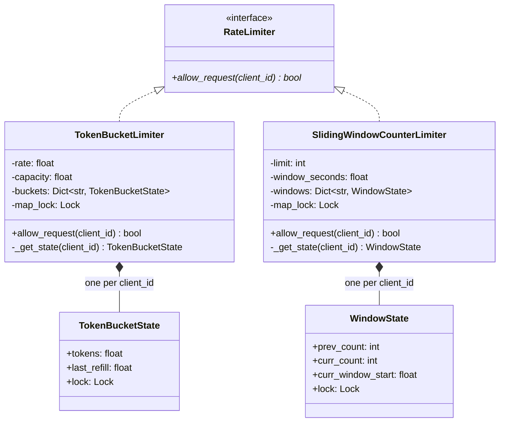

# LLD: Rate Limiter

**Difficulty:** Advanced | **Time:** 40–50 minutes

!!! note "Instructions"
    Design it yourself first — entities, classes, relationships — before reading past step 3. This page follows the [9-step approach](../low-level-design/index.md#the-9-step-approach-use-it-on-every-problem).

This is the single-process, class-level version of rate limiting. For how this scales across multiple servers with a shared counter store, see [Rate Limiting](../reliability/rate-limiting.md).

---

## 1. Problem Statement

Design an in-process rate limiter that a service can use to throttle requests per client — a client being an API key, a user ID, or an IP address. The limiter must support multiple algorithms (token bucket, sliding window log, sliding window counter, fixed window) behind one clean interface, and expose a single method — `allow_request(client_id) -> bool` — that middleware can call on every incoming request.

---

## 2. Requirements

**Functional (in scope):**

- Per-client limits: each client is tracked and throttled independently
- A single, algorithm-agnostic entry point: `allow_request(client_id) -> bool`
- Support swapping the underlying algorithm (token bucket, sliding window, etc.) without changing any caller
- Thread-safe under concurrent calls, including many concurrent calls for the *same* client

**Explicitly out of scope for v1:** distributed coordination across multiple processes or machines — a shared counter store (Redis, etc.), clock synchronization between nodes, and the "10 pods × local limit = 10× the intended rate" problem are all covered in [Rate Limiting](../reliability/rate-limiting.md). This page is deliberately scoped to one process, one shared-memory address space, one clock.

??? question "Clarifying questions worth asking out loud"
    - Is the limit global-per-client, or does it also need to vary per endpoint (e.g. `/search` vs `/checkout`)? (Touched on in Extensibility.)
    - Should a rejected request block/wait for a token, or fail fast with `False`/429? (Assume fail-fast — a blocking variant is a legitimate but different design.)
    - Do all requests cost the same "1 unit," or can some cost more (e.g. a bulk-export endpoint costs 10)? (Touched on in Extensibility.)
    - Is this single-process only, or does it need to survive a process restart / be shared across processes? (Pin down early — it's the line between this page and the distributed version.)

---

## 3. Entities

`RateLimiter` (the Strategy interface), `TokenBucketLimiter` and `SlidingWindowCounterLimiter` (concrete algorithms), and per-client state — `TokenBucketState` / `WindowState` — held in a map keyed by `client_id`.

---

## 4. Class Design



**Why per-client state is a separate object with its own lock, not a field on the limiter itself:** the limiter instance is shared across every client; the state (`tokens`, `last_refill`, or window counts) is not. Modeling `TokenBucketState` as its own small object — one per `client_id`, each with its own `Lock` — is what makes per-client locking possible instead of a single lock serializing every client through the same limiter. This mirrors [Parking Lot](parking-lot.md#8-concurrency)'s per-spot lock, not [LRU Cache](lru-cache.md#8-concurrency)'s single whole-structure lock — the reasoning for which is in Concurrency below.

---

## 5. Patterns Applied

- **Strategy** is the entire point of this exercise: `RateLimiter` is an interface, and `TokenBucketLimiter` / `SlidingWindowCounterLimiter` / a future `FixedWindowLimiter` are interchangeable implementations. Middleware depends on `RateLimiter.allow_request()` and never knows which algorithm is behind it — swap the algorithm by swapping the constructor argument, with zero edits to any call site. See [Design Patterns](../low-level-design/design-patterns.md#strategy-swap-the-algorithm-without-touching-the-class-that-uses-it).
- The real content of this problem isn't the pattern — it's the algorithm trade-off the pattern is hiding behind one interface:

**Token bucket.** A bucket holds up to `capacity` tokens, refilled at `rate` tokens/second; each request consumes one. Refill is computed lazily — on each `allow_request` call, from elapsed wall-clock time since the last check — rather than via a background thread ticking a counter, which is both an O(1) trick (no timer thread, no wasted wakeups for idle clients) and simpler to reason about (no separate thread touching shared state). **Allows bursts up to `capacity`** by design — an idle client that's been accumulating tokens can legitimately spend them all at once, which is a feature (see Edge Cases) not a bug. Memory: O(1) per client (two numbers: `tokens`, `last_refill`). This is the default choice when burst tolerance is acceptable.

**Sliding window log.** Store the exact timestamp of every request in the current window (e.g. in a per-client deque or sorted set); on each check, drop timestamps older than `window_seconds` and compare the remaining count to the limit. **Fully accurate** — no boundary-spike artifact, no approximation — but memory is O(requests-in-window) *per client*, which is the real cost: a client sending 10,000 req/window needs a structure holding 10,000 timestamps, indefinitely, as long as they keep that rate up. This is the right choice only when exactness is a hard requirement (e.g. billing-relevant quotas) and per-client request volume is bounded.

**Sliding window counter (approximate).** Keep two fixed-window counters per client — the just-completed window and the current one — and estimate the sliding count as `curr_count + prev_count × (fraction of previous window still "in" the sliding view)`. O(1) memory per client (two integers plus a window-start timestamp), and in practice close enough to exact that it's the standard production compromise: cheap like fixed window, without fixed window's boundary-spike vulnerability (a client can no longer send `limit` requests at 00:00:59.999 and `limit` more at 00:01:00.001 for `2×limit` in 2ms, because the weighted previous-window count still counts against them).

**Fixed window counter.** One integer per client, reset every `window_seconds`. Cheapest of all (O(1) memory, one comparison), but has the boundary-spike problem above. Mentioned for completeness; not implemented below since sliding window counter dominates it at nearly the same cost.

The table in [Rate Limiting](../reliability/rate-limiting.md#trade-offs) covers the same four algorithms at the distributed-systems layer (Redis-backed); the trade-offs above are the same shape, just paid for in local memory and lock contention instead of Redis round-trips and network partitions.

---

## 6. Core Code

```python
from abc import ABC, abstractmethod
from dataclasses import dataclass, field
from threading import Lock
import time


class RateLimiter(ABC):
    @abstractmethod
    def allow_request(self, client_id: str) -> bool: ...


# ---------------------------------------------------------------------------
# Token Bucket
# ---------------------------------------------------------------------------

@dataclass
class TokenBucketState:
    tokens: float
    last_refill: float
    lock: Lock = field(default_factory=Lock)


class TokenBucketLimiter(RateLimiter):
    def __init__(self, rate: float, capacity: float):
        self.rate = rate                     # tokens added per second
        self.capacity = capacity             # max tokens a bucket can hold
        self._buckets: dict[str, TokenBucketState] = {}
        self._map_lock = Lock()              # protects _buckets structure only, not bucket contents

    def _get_state(self, client_id: str) -> TokenBucketState:
        # fast path: bucket already exists, no need to hold the map lock
        state = self._buckets.get(client_id)
        if state is not None:
            return state
        with self._map_lock:                 # slow path: creating a new client's bucket must be atomic
            state = self._buckets.get(client_id)
            if state is None:
                state = TokenBucketState(tokens=self.capacity, last_refill=time.time())
                self._buckets[client_id] = state
            return state

    def allow_request(self, client_id: str) -> bool:
        state = self._get_state(client_id)
        with state.lock:                     # per-client lock — other clients proceed uncontended
            now = time.time()
            elapsed = now - state.last_refill
            if elapsed > 0:                  # guards against a backward clock jump (see Edge Cases)
                state.tokens = min(self.capacity, state.tokens + elapsed * self.rate)
                state.last_refill = now

            if state.tokens >= 1:
                state.tokens -= 1
                return True
            return False


# ---------------------------------------------------------------------------
# Sliding Window Counter (approximate)
# ---------------------------------------------------------------------------

@dataclass
class WindowState:
    prev_count: int = 0
    curr_count: int = 0
    curr_window_start: float = field(default_factory=time.time)
    lock: Lock = field(default_factory=Lock)


class SlidingWindowCounterLimiter(RateLimiter):
    def __init__(self, limit: int, window_seconds: float):
        self.limit = limit
        self.window_seconds = window_seconds
        self._windows: dict[str, WindowState] = {}
        self._map_lock = Lock()

    def _get_state(self, client_id: str) -> WindowState:
        state = self._windows.get(client_id)
        if state is not None:
            return state
        with self._map_lock:
            state = self._windows.get(client_id)
            if state is None:
                state = WindowState()
                self._windows[client_id] = state
            return state

    def allow_request(self, client_id: str) -> bool:
        state = self._get_state(client_id)
        with state.lock:
            now = time.time()
            elapsed_in_window = now - state.curr_window_start

            if elapsed_in_window >= self.window_seconds:
                windows_passed = int(elapsed_in_window // self.window_seconds)
                if windows_passed == 1:
                    state.prev_count = state.curr_count
                else:
                    state.prev_count = 0     # more than one window idle — previous window is stale
                state.curr_count = 0
                state.curr_window_start += windows_passed * self.window_seconds
                elapsed_in_window = now - state.curr_window_start

            prev_weight = max(0.0, 1 - elapsed_in_window / self.window_seconds)
            estimated = state.curr_count + state.prev_count * prev_weight

            if estimated < self.limit:
                state.curr_count += 1
                return True
            return False
```

Both limiters share the same two-tier locking shape: a `_map_lock` that protects only the *structure* of the client dictionary (inserting a never-seen client), and a per-client `lock` that protects that client's counters. A request for client A never blocks on a request for client B — see Concurrency below for why that split matters.

---

## 7. Edge Cases

| Case | Handling |
|------|----------|
| System clock moves backward (NTP correction, VM pause/resume) | `TokenBucketLimiter` guards with `if elapsed > 0` — a negative `elapsed` is skipped rather than refilling a negative number of tokens or, worse, being interpreted as a huge elapsed time if using monotonic-vs-wall-clock inconsistently. Prefer `time.monotonic()` over `time.time()` in production for this exact reason; `time.time()` is used above for readability against the window-boundary math. |
| A client is idle for a long time, then bursts | Token bucket handles this correctly *by design*: tokens accumulate up to `capacity` while idle, so the first burst after idle time is allowed up to the bucket's capacity, then throttled at the steady-state `rate` after that. This is the intended behavior, not a bug — a client that hasn't used its allowance shouldn't be penalized for using it all at once, as long as the burst doesn't exceed capacity. |
| Unbounded growth of distinct `client_id`s (memory leak from tracking every client forever) | Neither limiter above ever evicts an entry — every new `client_id` grows the map permanently. This needs the same fix as [LRU Cache](lru-cache.md): wrap the per-client map in an LRU eviction structure (hash map + doubly linked list) keyed by last-seen time, so idle clients' state is reclaimed instead of accumulating forever. |
| Very high cardinality clients (per-IP limiting on a public API — millions of distinct IPs) | Even with LRU eviction, the *working set* of concurrently active IPs can itself be large enough that the per-client dict is a real memory line item, not just a leak to patch. At that scale this typically pushes the design toward the distributed version — a shared, sharded counter store — rather than a bigger in-process map; see [Rate Limiting](../reliability/rate-limiting.md) for that architecture. |
| `capacity` or `limit` of 0 | Every request rejected immediately — should be validated at construction with a clear error rather than silently always returning `False`. |
| Two different algorithms configured for the same client by mistake (e.g. one instance per code path) | Not a limiter bug but a wiring bug — this is exactly why `RateLimiter` should be constructed once per logical limit and injected everywhere that limit applies, not instantiated ad hoc per call site. |

---

## 8. Concurrency

This is the crux of the exercise: many threads call `allow_request(client_id)` concurrently, frequently for the *same* `client_id` (a single hot API key hammering the service), and the design has to stay correct without letting the lock itself become the bottleneck.

**Per-client lock granularity, not a global lock.** Each `TokenBucketState` / `WindowState` carries its own `Lock`. Two threads handling requests for *different* clients never block each other — they acquire different locks and proceed fully in parallel. This is the same reasoning as [Parking Lot](parking-lot.md#8-concurrency)'s per-spot lock over a lot-wide lock: contention should be scoped to the smallest unit that actually shares mutable state, and unrelated clients share nothing. A single lock around the whole limiter — the [LRU Cache](lru-cache.md#8-concurrency) approach — would be wrong here for the opposite reason it was right there: LRU's `get` mutates a *shared* list on every call, so every operation genuinely needs exclusive access to the same structure; here, per-client state is genuinely independent, so a shared lock would serialize unrelated clients for no correctness reason at all.

**The two-tier lock split (`_map_lock` vs per-client `lock`) is what makes this work without a race on client creation.** The very first request from a never-before-seen `client_id` needs to atomically check-and-insert into `self._buckets` — that's a real race (two threads both see the key missing, both create a fresh `TokenBucketState`, one overwrites the other, and a token or two is silently lost from whichever state loses the race). `_get_state`'s double-checked pattern — an unlocked fast-path read, then re-checking under `_map_lock` before inserting — closes that window ([race conditions](../low-level-design/concurrency-basics.md#race-conditions)) while keeping the map lock held only for the rare "first request from this client" case, not every request. See [Locks](../low-level-design/concurrency-basics.md#locks) for the general check-then-act pattern this follows.

**Where per-client locking itself becomes the bottleneck.** Per-client granularity solves cross-client contention, but does nothing for a *single* extremely hot client — if one API key alone is generating 500K req/s, every one of those requests still serializes on that one client's lock, and lock acquisition/release overhead can become the actual ceiling on throughput for that client, independent of the rate limit's own math. The next step past a `Lock` here is a lock-free implementation: represent `tokens` as an atomic value and update it with compare-and-swap (read the current value, compute the refilled-and-decremented value, atomically swap only if nothing else changed it in between, retry on failure) instead of a mutex. Python's GIL makes this a less pressing concern for a pure-Python implementation than it would be in Go, Java, or C++, but the principle — [thread safety without locks](../low-level-design/concurrency-basics.md#thread-safety-without-locks) via CAS — is the right answer to name when an interviewer pushes on "what if the lock itself is now the bottleneck."

---

## 9. Extensibility

| New requirement | What changes | What doesn't |
|---|---|---|
| Switch from token bucket to sliding window counter (or any other algorithm) | Construct a different `RateLimiter` implementation and inject it | Every call site — they all depend on `RateLimiter.allow_request()`, not a concrete class |
| Add per-endpoint limits in addition to per-client (e.g. `/search` gets a looser limit than `/checkout`) | Key the per-client state map by `(client_id, endpoint)` instead of `client_id` alone — or compose a two-level check: a limiter per endpoint, each internally keyed by client | The `RateLimiter` interface itself — `allow_request` still returns a bool for one logical key |
| Add a "cost per request" weighting (a bulk-export endpoint costs 10 units, a simple GET costs 1) | `allow_request(client_id, cost: int = 1)` — token bucket checks `tokens >= cost` and subtracts `cost`; sliding window counter compares `estimated + cost <= limit` | The lock granularity and refill/window math stay identical — cost is just a different threshold, not a different algorithm |
| Scale beyond one process — multiple servers behind a load balancer, all enforcing the same limit | This is exactly [Rate Limiting](../reliability/rate-limiting.md): the per-client state moves from an in-process dict to a shared store (Redis), the lazy-refill/window math gets reimplemented atomically server-side (Lua script), and "per-client lock" becomes "per-client atomic Redis operation." The `RateLimiter` interface and the algorithm trade-offs above carry over unchanged — only where the state lives changes. | The Strategy shape, and the core algorithmic reasoning in section 5 |

---

## Interview Questions

=== "Foundation"
    **Q: Walk me through why the token bucket's refill happens on read (lazy, computed from elapsed time) instead of a background thread that adds tokens every N milliseconds.**

    "A background ticking thread means one extra thread per bucket — or one thread ticking every client's bucket on a schedule — running and waking up constantly even for clients making zero requests, which is pure waste and adds a second piece of shared state to reason about. Computing elapsed time lazily, right when `allow_request` is called, gets the exact same result — the bucket has accumulated `elapsed × rate` tokens since it was last touched — with zero background work and zero idle cost. It's the same trick as computing a cache entry's age lazily instead of expiring it on a timer: do the work only when someone actually asks."

=== "Senior"
    **Q: Your limiter uses a lock per client. Why not just one lock for the whole `TokenBucketLimiter` instance — wouldn't that be simpler and still correct?**

    "It would still be correct, but it throws away nearly all the concurrency the problem has to offer. Client A's request and client B's request touch completely disjoint state — different dictionary entries, different token counts — so there's no correctness reason to make B wait for A. A single limiter-wide lock would serialize every request through the entire service regardless of which client it's for, which turns the rate limiter itself into the throughput bottleneck it's supposed to be protecting the service from. This is the same lesson as the parking lot's per-spot lock: lock at the granularity where contention actually exists, which here is per-client, not per-limiter. The one place I do use a broader lock is the map-structure lock for inserting a brand-new client's state — that's genuinely a shared resource, but it's held only for the rare first-touch case, not on every request."

=== "Staff"
    **Q: When would you actually choose sliding window log over sliding window counter, given that the counter is 'close enough' and vastly cheaper? And when would either lose to plain token bucket?**

    "Sliding window log is the right call when the number itself has to be exactly right, not approximately right — think a billing-relevant quota where 'the customer's contract says exactly 10,000 calls this hour' and being off by the counter's smoothing approximation is a customer-facing correctness bug, not a rounding error. It's also more attractive when you know per-client request volume in-window is bounded and small, since the O(requests-in-window) memory cost only bites you at high per-client volume — for a client capped at 50 requests/minute, storing 50 timestamps is nothing. Once you're rate-limiting something like a public API where a single client can legitimately push thousands of requests into a window, sliding window log's memory cost per client stops being a rounding error and becomes a real capacity-planning line item, and that's when sliding window counter's O(1)-per-client footprint wins even though it's an approximation — in practice the error is small because it's weighted by how much of the previous window is still 'in view,' not a coarse average.

    Token bucket wins over both when the actual product requirement is 'smooth this client's average rate but let them burst' rather than 'enforce a hard ceiling in any given window' — a client that's been quiet and suddenly needs to catch up on missed polling, for instance. The tell in an interview is whether the interviewer's requirement uses the word 'burst' approvingly (token bucket) or says 'must never exceed N in any T-second window, full stop' (sliding window, log if exact, counter if N is large and exactness can bend). I'd also flag that these aren't mutually exclusive in a real system — an API gateway often runs a local token bucket as a fast, generous L1 check and a Redis-backed sliding window as the authoritative L2 limit, trading a small amount of over-admission for keeping the hot path off the network almost all the time."

---

## Key Takeaways

!!! success "Remember"
    1. Strategy is the whole shape of this problem: one `RateLimiter` interface, multiple algorithms, zero changes to call sites when swapping
    2. Token bucket's lazy, elapsed-time-based refill is an O(1) trick that avoids a background thread entirely — refill on read, not on a timer
    3. The token bucket vs. sliding window log vs. sliding window counter choice is a real accuracy-vs-memory trade-off, not a "just pick the best one" question — state which requirement (exactness vs. cost) is driving the choice
    4. Per-client lock granularity is correct here for the opposite reason a single whole-structure lock was correct for LRU Cache: independent clients share no mutable state, so locking per-client buys real parallelism instead of false safety
    5. A two-tier lock (map-structure lock for first-touch client creation, per-client lock for the hot path) closes the client-creation race without paying map-lock cost on every request
    6. At extreme single-client QPS, the per-client lock itself can become the bottleneck — the next step is compare-and-swap on the token count, not a smarter lock
    7. This page stops at one process; the moment the requirement becomes "consistent across multiple servers," it's a different problem — see [Rate Limiting](../reliability/rate-limiting.md)

**Previous:** [Car Rental](car-rental.md) | **Next:** [Logger](logger.md)
