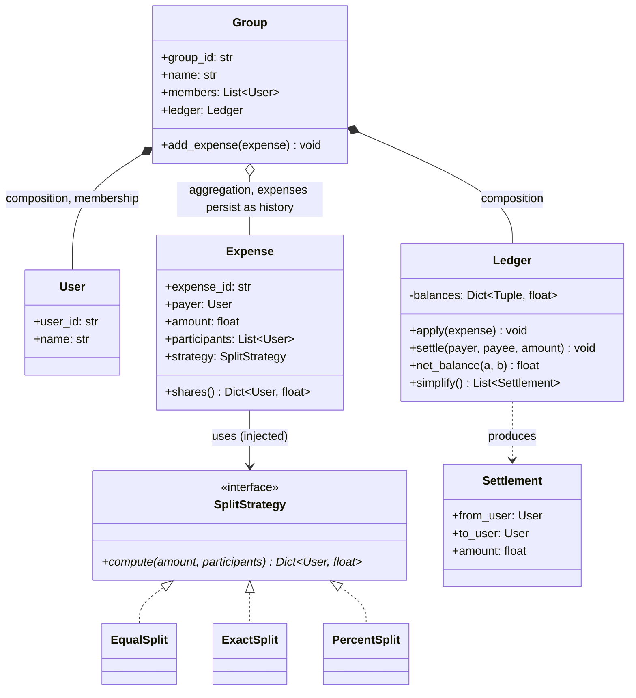

# LLD: Splitwise

**Difficulty:** Beginner | **Time:** 30–40 minutes

!!! note "Instructions"
    Design it yourself first — entities, classes, relationships — before reading past step 3. This page follows the [9-step approach](../low-level-design/index.md#the-9-step-approach-use-it-on-every-problem).

---

## 1. Problem Statement

Design an expense-splitting system (think Splitwise). Users belong to groups. An expense is added by one user (the payer) on behalf of a set of participants, and is split among them — equally, by exact amounts, or by percentage. The system tracks who owes whom, and can produce a **simplified summary** of net balances — the minimum set of payments that settles all debts — rather than a raw list of every individual expense.

---

## 2. Requirements

**Functional (in scope):**

- Add a user to one or more groups
- Add an `Expense`: payer, amount, participants, and a split strategy (equal / exact / percentage)
- Maintain a running balance between every pair of users who have ever shared an expense
- Show a user's net balance with each other user, and a group's overall balance sheet
- Simplify debts: given all pairwise balances, compute the minimum number of transactions that zeroes everyone out
- Record a settlement (partial or full payment) between two users

**Explicitly out of scope for v1:** multi-currency and FX conversion (touched on in Extensibility), recurring/scheduled expenses, actually moving money through a payment processor, itemized receipt splitting (who ordered which line item).

??? question "Clarifying questions worth asking out loud"
    - Single currency only for v1, or does every expense need an FX-aware amount? (Assume single currency; see Extensibility.)
    - Can an expense be split among a *subset* of a group's members, or always the whole group?
    - Does "simplify debts" run per-group, or globally across all groups a user is in? (Assume per-group — cross-group netting is a real but separate extension.)
    - Is settling up a first-class transaction (recorded like an expense), or just a balance adjustment?
    - What's the rounding rule when an equal split doesn't divide evenly into cents?

---

## 3. Entities

The nouns in the problem statement: `User`, `Group`, `Expense`, `Split` (abstract, with `EqualSplit` / `ExactSplit` / `PercentSplit`), and a `Ledger` that owns the pairwise balance sheet and the simplification algorithm.

---

## 4. Class Design



**Why composition for `Group *-- Ledger`:** a ledger has no meaning outside its group — delete the group, its balance sheet goes with it. **Why aggregation for `Group o-- Expense`:** an expense is a historical record — even if a user leaves the group, the expense they were part of stays in the group's history, so expenses conceptually outlive membership (see [Class Relationships](../low-level-design/solid-principles.md#class-relationships-uml-basics)). Note `Expense` doesn't touch balances directly — it only knows how to compute *shares* via its `SplitStrategy`; applying those shares to the running balance sheet is the `Ledger`'s job. That separation matters: `Expense` answers "how much does each participant owe for *this* expense," `Ledger` answers "who owes whom *overall*."

---

## 5. Patterns Applied

- **Strategy** for `SplitStrategy` — "equal, exact, or percentage" is named directly in the requirements as a real variation point, so `Expense` depends on the `SplitStrategy` interface rather than branching on a split-type enum. A new split type (e.g. "by shares," like 2 shares for one roommate and 1 for another) is a new class with zero edits to `Expense` or `Ledger`. See [Design Patterns](../low-level-design/design-patterns.md#strategy-swap-the-algorithm-without-touching-the-class-that-uses-it).
- **Debt simplification is a graph problem, not a GoF pattern** — and naming it as one would be forcing a fit. Model each group as a directed, weighted graph: nodes are users, an edge `u → v` with weight `w` means "u owes v amount w." After netting every pairwise edge down to at most one direction, the "simplify" operation is: given a set of nodes each with a net balance (positive = net creditor, negative = net debtor), find the *minimum number of edges* that transports every debtor's balance to some creditor and zeroes everyone out. This is the real algorithmic core of the problem, and it's worth stating out loud in an interview that it's a **greedy min-cash-flow** problem, not a design-pattern problem.
- The greedy approach — repeatedly match the largest creditor with the largest debtor — is not provably minimal in the worst case (the exact minimum-transaction problem is NP-hard in general), but it's the standard, interview-acceptable answer: it's simple, fast, and produces a good-enough reduction in practice. Naming that trade-off explicitly is worth more than pretending the greedy result is provably optimal.

---

## 6. Core Code

```python
from abc import ABC, abstractmethod
from collections import defaultdict
from dataclasses import dataclass, field
from threading import Lock
import heapq
import itertools
import uuid


@dataclass(frozen=True)
class User:
    user_id: str
    name: str


class SplitStrategy(ABC):
    @abstractmethod
    def compute(self, amount: float, participants: list[User], **kwargs) -> dict[User, float]:
        """Return each participant's share. Must sum to `amount` (validated by caller)."""
        ...


class EqualSplit(SplitStrategy):
    def compute(self, amount: float, participants: list[User], **kwargs) -> dict[User, float]:
        n = len(participants)
        base = round(amount / n, 2)
        shares = {p: base for p in participants}
        # rounding remainder: the payer absorbs the leftover cent(s) rather than
        # silently under- or over-charging one arbitrary participant
        remainder = round(amount - base * n, 2)
        if remainder:
            payer = kwargs.get("payer")
            target = payer if payer in shares else participants[0]
            shares[target] = round(shares[target] + remainder, 2)
        return shares


class ExactSplit(SplitStrategy):
    def compute(self, amount: float, participants: list[User], amounts: dict[User, float] = None, **kwargs) -> dict[User, float]:
        amounts = amounts or {}
        total = round(sum(amounts.get(p, 0.0) for p in participants), 2)
        if total != round(amount, 2):
            raise ValueError(f"exact amounts sum to {total}, expected {amount}")
        return {p: amounts.get(p, 0.0) for p in participants}


class PercentSplit(SplitStrategy):
    def compute(self, amount: float, participants: list[User], percentages: dict[User, float] = None, **kwargs) -> dict[User, float]:
        percentages = percentages or {}
        total_pct = round(sum(percentages.get(p, 0.0) for p in participants), 2)
        if total_pct != 100.0:
            raise ValueError(f"percentages sum to {total_pct}, expected 100")
        return {p: round(amount * percentages.get(p, 0.0) / 100, 2) for p in participants}


@dataclass
class Expense:
    payer: User
    amount: float
    participants: list[User]
    strategy: SplitStrategy
    strategy_kwargs: dict = field(default_factory=dict)
    expense_id: str = field(default_factory=lambda: str(uuid.uuid4()))

    def shares(self) -> dict[User, float]:
        return self.strategy.compute(
            self.amount, self.participants, payer=self.payer, **self.strategy_kwargs
        )


@dataclass
class Settlement:
    from_user: User
    to_user: User
    amount: float


class Ledger:
    """Owns the pairwise balance sheet for one group and the debt-simplification algorithm."""

    def __init__(self):
        # (debtor, creditor) -> amount owed; only ever positive, one direction per pair at a time
        self._balances: dict[tuple[User, User], float] = defaultdict(float)
        self._lock = Lock()

    def _adjust(self, debtor: User, creditor: User, amount: float) -> None:
        # additive increment, not a read-then-overwrite — see Concurrency
        if debtor == creditor or amount == 0:
            return
        with self._lock:
            self._balances[(debtor, creditor)] += amount
            self._normalize(debtor, creditor)

    def _normalize(self, a: User, b: User) -> None:
        # collapse (a owes b) and (b owes a) into a single net direction
        forward = self._balances.get((a, b), 0.0)
        backward = self._balances.get((b, a), 0.0)
        net = round(forward - backward, 2)
        self._balances.pop((a, b), None)
        self._balances.pop((b, a), None)
        if net > 0:
            self._balances[(a, b)] = net
        elif net < 0:
            self._balances[(b, a)] = -net

    def apply(self, expense: Expense) -> None:
        shares = expense.shares()
        for participant, share in shares.items():
            if participant is expense.payer:
                continue
            self._adjust(debtor=participant, creditor=expense.payer, amount=share)

    def settle(self, payer: User, payee: User, amount: float) -> None:
        """Record a real-world payment: payer pays payee, reducing what payer owes payee."""
        # Validation and mutation are one critical section. Calling _adjust()
        # after an unlocked read would let two concurrent settlements both
        # validate against the same old balance and overpay it.
        with self._lock:
            current = self._balances.get((payer, payee), 0.0)
            if amount > current:
                raise ValueError(f"{payer.name} only owes {payee.name} {current}, cannot settle {amount}")
            self._balances[(payer, payee)] -= amount
            self._normalize(payer, payee)

    def net_balance(self, a: User, b: User) -> float:
        return self._balances.get((a, b), 0.0) - self._balances.get((b, a), 0.0)

    def simplify(self) -> list[Settlement]:
        """
        Greedy min-transaction settlement: repeatedly pay the largest creditor
        from the largest debtor. Uses two max-heaps so each step is O(log n)
        instead of an O(n) linear scan for the largest balance.
        """
        net: dict[User, float] = defaultdict(float)
        for (debtor, creditor), amount in self._balances.items():
            net[debtor] -= amount
            net[creditor] += amount

        # heapq is a min-heap, so negate to simulate a max-heap
        debtors = [(-bal, next(_tiebreak), u) for u, bal in net.items() if bal < -0.01]
        creditors = [(bal, next(_tiebreak), u) for u, bal in net.items() if bal > 0.01]
        heapq.heapify(debtors)
        heapq.heapify(creditors)

        settlements: list[Settlement] = []
        while debtors and creditors:
            neg_debt, _, debtor = heapq.heappop(debtors)
            credit, _, creditor = heapq.heappop(creditors)
            debt = -neg_debt

            amount = round(min(debt, credit), 2)
            settlements.append(Settlement(from_user=debtor, to_user=creditor, amount=amount))

            remaining_debt = round(debt - amount, 2)
            remaining_credit = round(credit - amount, 2)
            if remaining_debt > 0.01:
                heapq.heappush(debtors, (-remaining_debt, next(_tiebreak), debtor))
            if remaining_credit > 0.01:
                heapq.heappush(creditors, (remaining_credit, next(_tiebreak), creditor))

        return settlements


_tiebreak = itertools.count()  # breaks heap ties without comparing User objects
```

**Why the greedy loop terminates in at most `n - 1` transactions for `n` participants with nonzero balance:** every iteration fully zeroes out at least one side of the pair popped (whichever of debt/credit was smaller), removing at least one node from further consideration. You cannot zero out more than `n` participants in fewer than `n - 1` transfers overall (the last remaining pair still needs one transaction between them), so the greedy bound is exactly the same lower bound as the general minimum — the greedy result is optimal in the common case where debts don't have adversarial fractional overlaps, and close to optimal otherwise. That's the proof intuition to say out loud, not a full NP-hardness derivation.

---

## 7. Edge Cases

| Case | Handling |
|------|----------|
| Equal split doesn't divide evenly (e.g. $10.00 / 3) | `EqualSplit` rounds each share to the cent, then the **payer** absorbs the remainder (`payer` passed through `Expense.shares()`). State this choice; first-participant is the common alternative — pick one and match the code |
| `ExactSplit` amounts don't sum to the expense total | `compute()` raises `ValueError` before the ledger is touched — reject at validation time, never silently rescale |
| `PercentSplit` percentages don't sum to 100% | Same: raise before touching the ledger, not after |
| Expense split among a subset of group members, not the whole group | `Expense.participants` is independent of `Group.members` — participants just need to *be* group members, but the expense doesn't have to include all of them |
| A user is removed from a group with an outstanding balance | Reject the removal (or require settle-up first) while `net_balance(user, anyone) != 0` for any other member — a departed user with a nonzero balance either owes money that becomes uncollectible or is owed money that becomes unclaimed; the system should surface this as a blocking precondition, not silently drop the balance |
| Settling up partially vs. fully | `settle()` takes an arbitrary `amount` and just decrements the existing debt — a partial settlement is the same code path as a full one, it just leaves a smaller positive balance instead of zero |
| Settling more than is actually owed | `settle()` raises rather than flipping the direction of the debt — a settlement is a payment against an existing debt, not a new expense in the other direction |

---

## 8. Concurrency

Two expenses touching an overlapping set of users can be added concurrently — e.g. Alice adds "dinner, split with Bob," while at the same instant Bob adds "cab fare, split with Alice." Both mutate the `(Alice, Bob)` balance pair in the same `Ledger`.

**Why naive last-write-wins on a shared balance dict is wrong:** if `_adjust` were written as a read-modify-write — `current = balances[(a, b)]; balances[(a, b)] = current + amount` — two threads could both read the same starting value, compute their own updated value from it, and the second write would clobber the first, silently losing one expense's contribution to the balance. This is the classic [race condition](../low-level-design/concurrency-basics.md#race-conditions): the bug doesn't show up as a crash, it shows up as a balance sheet that's quietly wrong.

**The fix in the code above is twofold:**

- `_adjust` wraps the read-modify-write in a lock (`_lock`), so the increment is atomic — no thread can observe a partially-applied update.
- Just as important as the lock: the operation itself is expressed as an **additive increment** (`self._balances[(debtor, creditor)] += amount`) rather than a set-to-value assignment. Even with a lock, a design that computed a new absolute balance from a stale read and then *set* it would be fragile against reordering; expressing every mutation as "add this delta" makes the operation naturally commutative — two expenses applied in either order land on the same final balance, exactly the property you want under concurrency. See [Locks](../low-level-design/concurrency-basics.md#locks).

**Why lock per-`Ledger` (i.e., per-group) rather than one global lock or one lock per user-pair:** per-group is the natural grain — expenses within a group frequently touch overlapping pairs (the same small set of members), so per-pair locking would mean acquiring 2-3 locks per expense with an ordering-discipline requirement (see the deadlock note in [Parking Lot](parking-lot.md#8-concurrency)) for a payoff that's marginal, since most contention in this domain is already confined to one group. A single group-wide lock is coarser but simpler and correct, and groups are typically small enough (tens of members) that lock hold time per `apply()` call is negligible. A global lock across *all* groups would be the wrong call — it would serialize unrelated groups' expenses for no reason.

---

## 9. Extensibility

| New requirement | What changes | What doesn't |
|---|---|---|
| Multi-currency support with FX conversion | `Expense` gains a `currency` field; `Ledger` either normalizes every amount to a base currency at `apply()` time via an injected `FxRateProvider`, or tracks balances per-currency-pair | `SplitStrategy` implementations — they operate on a numeric amount regardless of currency |
| Recurring expenses | A new `RecurringExpense` that generates concrete `Expense` instances on a schedule and calls `Ledger.apply()` for each | `Expense`, `Ledger`, every `SplitStrategy` |
| Itemized/unequal-shares receipts (splitting a restaurant bill by item) | A new `SplitStrategy` (e.g. `ItemizedSplit`) that takes a list of (item, price, assigned users) and computes per-user totals, including a fair split of shared items like tax/tip | `Expense`'s public shape (`strategy` is still just injected), `Ledger` |
| Export to a payment integration (actually settling via a payment API) | A new component wraps `Ledger.simplify()`'s output and calls out to a payment provider per `Settlement`, then calls `Ledger.settle()` on success | The simplification algorithm itself — it already produces exactly the (from, to, amount) triples a payment API needs |

---

## Interview Questions

=== "Foundation"
    **Q: Why is `Split` (or `SplitStrategy`) modeled as an interface with three implementations instead of an `Expense` method that branches on a `split_type` enum?**

    "Because the requirements name three split types up front — equal, exact, percentage — and say that's how expenses get divided. That's a genuine variation point, not a hypothetical one, so I made `Expense` depend on a `SplitStrategy` interface and injected the concrete strategy at construction time. If I'd used a branch on an enum inside `Expense`, adding a fourth split type — say, splitting by shares, like 2:1 between roommates — would mean editing `Expense` itself and re-testing every existing branch. With Strategy, it's a new class that implements `compute()`, and `Expense` never changes. That's Open/Closed paying off exactly where the problem statement told me it would."

=== "Senior"
    **Q: Two users each add an expense involving each other at the same moment. Walk through how your design prevents the balance from ending up wrong.**

    "Both expenses ultimately call `Ledger._adjust()` for the same `(Alice, Bob)` pair. If that method did a plain read-modify-write — read the current balance, compute a new value, write it back — the two calls could interleave: both read the same starting balance, both compute their own new value from it, and whichever writes second wins, silently discarding the other expense's effect on the balance. I close that two ways. First, `_adjust` holds a lock around the read-modify-write, making the whole operation atomic — only one thread's update happens at a time. Second, and just as important, I model the operation as an *additive increment* rather than an absolute set — `balances[pair] += amount`, not `balances[pair] = computed_value`. That makes the two updates commutative: however they get interleaved by the scheduler, applying 'Alice owes Bob $12' and 'Bob owes Alice $8' in either order nets to the same final balance. The lock prevents corruption; the additive design is what makes the operation safe to reorder in the first place."

=== "Staff"
    **Q: `simplify()` recomputes the full settlement plan by scanning every balance in the ledger. For a group of 100 people with thousands of expenses, is that a problem, and would you recompute it on every single expense added?**

    "Two separate concerns here. First, complexity: `simplify()` itself doesn't scan expenses — it scans the *net balance state*, which is at most one entry per ordered pair of users, so at most O(n²) pairs for n members, and in practice far fewer since most pairs never transact directly. Building the two heaps is O(n log n), and the greedy loop does at most n-1 pops-and-pushes, each O(log n), so the whole thing is O(n log n) for n participants with nonzero balance — for a 100-person group that's trivially fast, not a scaling concern by itself.

    Second, and this is the real question: should I run `simplify()` synchronously inside `apply()` every time an expense is added? No — `apply()` only needs to update the pairwise balance sheet, which is already O(1) per expense. `simplify()` is a *read-time* operation, not something the write path needs to maintain continuously. I'd compute it lazily, on demand, when a user asks 'show me the simplified summary' for a group — and if that view is requested often enough to matter, cache the last computed settlement plan and invalidate it only when `apply()` or `settle()` actually changes a balance, rather than recomputing greedily on every mutation. That decouples the O(1) write path from the O(n log n) read path, which is the right shape for a system where expenses are added far more often than the simplified view is viewed."

---

## Key Takeaways

!!! success "Remember"
    1. `Expense` computes *shares* via an injected `SplitStrategy`; `Ledger` owns the *running balance sheet* — don't collapse these two responsibilities into one class.
    2. Strategy earns its place because the problem statement names three split types directly — equal, exact, percentage — not because "split types might vary" is a plausible guess.
    3. Debt simplification is a graph/greedy-algorithm problem, not a design pattern — model it honestly as min-cash-flow over net balances, and say out loud that greedy is the standard, near-optimal, interview-acceptable answer, not a provably minimal one.
    4. Every balance mutation must be an additive increment under a lock, never a read-modify-write set — that combination is what makes concurrent expense additions land on a correct balance regardless of interleaving.
    5. `simplify()` is a read-time operation over O(n) net balances, not something to recompute inside the O(1) write path on every expense — compute it lazily and cache it.

**Previous:** [Library Management](library-management.md) | **Next:** [ATM](atm.md)
