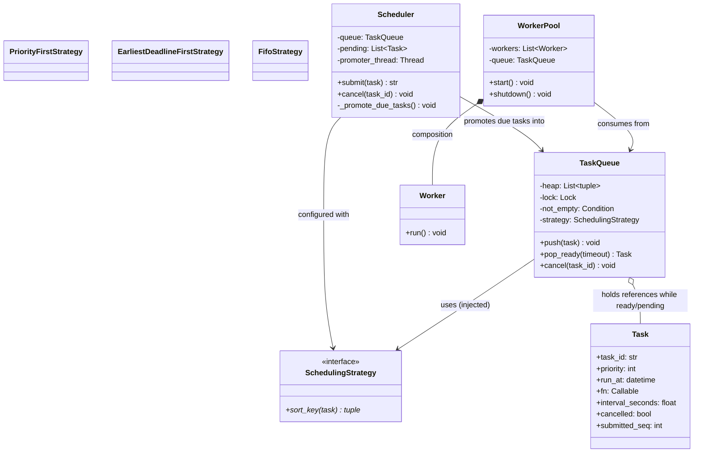

# LLD: Task Scheduler

**Difficulty:** Advanced | **Time:** 45–60 minutes

!!! note "Instructions"
    Design it yourself first — entities, classes, relationships — before reading past step 3. This page follows the [9-step approach](../low-level-design/index.md#the-9-step-approach-use-it-on-every-problem).

---

## 1. Problem Statement

Design an in-process task scheduler. Callers submit tasks with a **priority** and/or a **scheduled execution time** — run now, run at a specific timestamp, or run after a delay. A fixed-size pool of worker threads executes submitted tasks concurrently. Among tasks that are currently eligible to run, higher-priority tasks execute before lower-priority ones. As a stretch goal, support **recurring** tasks that re-fire every N seconds until cancelled.

This is the single-process version of the problem. [Distributed Job Scheduler](../system-design-exercises/distributed-job-scheduler.md) covers the same idea at the system-design layer — leader election, leases, exactly-once execution across machines. Here, the constraint is purely about data-structure and concurrency correctness inside one process.

---

## 2. Requirements

**Functional (in scope):**

- `submit(task, priority, run_at=None, delay=None)` — schedule a task for immediate or future execution at a given priority
- A fixed-size worker pool (`N` threads) pulls and executes tasks
- Among tasks whose scheduled time has arrived, the highest-priority task runs next
- `cancel(task_id)` — prevent a not-yet-started task from running
- Stretch: recurring tasks (`interval_seconds`) that re-enqueue themselves after each successful run, until cancelled

**Explicitly out of scope for v1:** distributed/cross-machine scheduling, leader election, durability across process restarts, and exactly-once execution guarantees when a worker crashes mid-task — all covered by [Distributed Job Scheduler](../system-design-exercises/distributed-job-scheduler.md), which picks up exactly where this one stops: single process → many machines.

??? question "Clarifying questions worth asking out loud"
    - When priority and scheduled time conflict — a low-priority task that's overdue vs. a high-priority task that just became due — which wins? (This page's answer: due tasks are ordered by time first, then priority, among tasks with the same due status — see Class Design.)
    - Is cancellation best-effort ("don't start it if it hasn't started") or must it interrupt a task already running? (Assume best-effort; interrupting a running thread mid-execution is a much harder, largely unsolved problem in most languages.)
    - What happens to a task if all workers are busy when it becomes due? (It waits in the ready queue — that's the whole point of decoupling submission from execution.)
    - Should a failed task retry automatically, or is that the caller's responsibility? (Assume caller's responsibility for v1; noted in Extensibility as dead-letter handling.)

---

## 3. Entities

The nouns in the problem statement: `Task`, `TaskQueue` (the priority/delay-aware ready queue), `Scheduler` (the promoter that moves due tasks into the ready queue), `WorkerPool` / `Worker`, `SchedulingStrategy`.

---

## 4. Class Design



**Why a min-heap keyed on `(scheduled_time, priority, submitted_seq)`, and not a plain FIFO queue or a plain priority queue alone:**

- A **plain FIFO queue** loses priority entirely — a `priority=10` task submitted after a `priority=1` task would still run second. That directly violates "higher-priority tasks execute before lower-priority ones."
- A **plain priority queue keyed on priority alone** loses time — it would happily pop a `run_at` two hours from now ahead of a lower-priority task that's due immediately, because nothing in the key encodes *when* a task becomes eligible. Priority only makes sense to compare **among tasks that are already due** — comparing priorities across "due now" and "due in two hours" is comparing the wrong axis.
- The fix is a **composite ordering key**, not a single scalar: sort primarily by due-status/time, then by priority as the tiebreak among tasks that are equally due, then by submission order (`submitted_seq`) as a final deterministic tiebreak (see Edge Cases). This is exactly the tuple-comparison trick `heapq` gives you for free — Python compares tuples lexicographically, so `(run_at, -priority, submitted_seq)` as the heap key does the right thing without a custom comparator class.
- That still leaves a second problem a single heap doesn't solve on its own: a task due two hours from now sitting in the *same* heap as tasks due right now must **not** be poppable early just because it's the smallest item once its neighbors finish. The heap's job is *ordering* candidates for the moment they're actually eligible, not *gating* eligibility. This design keeps that gate explicit — see the single-threaded promoter in Core Code — rather than baking "am I due yet" into every worker's pop logic.

**Why `WorkerPool *-- Worker` is composition:** workers have no identity or lifecycle outside the pool that spawned them — shut down the pool, the worker threads terminate. **Why `TaskQueue o-- Task` is aggregation:** a submitted `Task` is a caller-owned unit of work the queue tracks and hands off, not something the queue's lifecycle defines — see [Class Relationships](../low-level-design/solid-principles.md#class-relationships-uml-basics).

---

## 5. Patterns Applied

- **Strategy** for `SchedulingStrategy` — "priority order" vs. "pure FIFO" vs. "earliest-deadline-first" are named, real variation points (the problem statement itself names two of them), so `TaskQueue` depends on the `sort_key()` interface rather than a hardcoded comparison, and a new policy is a new class with zero edits to `TaskQueue`. See [Design Patterns](../low-level-design/design-patterns.md#strategy-swap-the-algorithm-without-touching-the-class-that-uses-it).
- **Producer-consumer**, the load-bearing concurrency pattern here (not a GoF pattern — a concurrency idiom): submitting threads are producers pushing `Task`s onto the shared queue, worker threads are consumers popping them off. The entire Concurrency section below is this pattern done correctly — bounded coordination through one shared, lock-protected structure with condition-variable signaling, instead of workers polling or submitters blocking on worker availability.
- Explicitly **not** using Observer for "notify on task completion" even though it's tempting — nothing in the problem statement asks for multiple interested listeners per task; a plain callback or `Future`-style result object covers it without the indirection. Don't add a pattern the requirements don't ask for.

---

## 6. Core Code

Two structural decisions worth stating before the code: (1) the ready queue is `heapq` protected by a `Lock` + `Condition` rather than `queue.PriorityQueue` — shown explicitly here so the wait/notify mechanics are visible; `queue.PriorityQueue` is a thin wrapper around exactly this (its own `Lock`, two `Condition`s for not-full/not-empty, a `heapq` list) and is the right call in production code once you don't need to explain what's inside it. (2) Delayed tasks are held in a **separate min-heap of not-yet-due tasks**, promoted into the ready queue by a single dedicated promoter thread that sleeps until the next due time — the `sched`-module approach — rather than encoding due-time directly into the ready heap and having every worker re-check it. A single promoter means the "is it due yet" logic exists in exactly one place, sleeping precisely until it next has work, instead of N workers each re-deriving that logic and busy-checking.

```python
from __future__ import annotations

import heapq
import itertools
import threading
import time
import uuid
from dataclasses import dataclass, field
from datetime import datetime, timedelta
from typing import Callable, Protocol


# ---------- Task ----------

@dataclass
class Task:
    fn: Callable[[], None]
    priority: int = 0                 # higher runs first among equally-due tasks
    run_at: datetime = field(default_factory=datetime.now)
    interval_seconds: float | None = None   # stretch: recurring tasks
    task_id: str = field(default_factory=lambda: str(uuid.uuid4()))
    submitted_seq: int = 0            # tiebreak — assigned at submission, see Edge Cases
    cancelled: bool = False           # lazy-deletion flag, see Edge Cases


# ---------- Scheduling strategy ----------

class SchedulingStrategy(Protocol):
    def sort_key(self, task: Task) -> tuple: ...


class PriorityFirstStrategy:
    """Among due tasks, highest priority first; ties broken by submission order."""
    def sort_key(self, task: Task) -> tuple:
        return (task.run_at, -task.priority, task.submitted_seq)


class FifoStrategy:
    """Ignore priority entirely — pure submission order among due tasks."""
    def sort_key(self, task: Task) -> tuple:
        return (task.run_at, task.submitted_seq)


class EarliestDeadlineFirstStrategy:
    """Due time is the only axis that matters; priority is a pure tiebreak."""
    def sort_key(self, task: Task) -> tuple:
        return (task.run_at, task.submitted_seq, -task.priority)


# ---------- Ready queue: thread-safe, condition-variable-backed ----------

class TaskQueue:
    """Holds tasks that are currently eligible to run, ordered by SchedulingStrategy."""

    def __init__(self, strategy: SchedulingStrategy):
        self._strategy = strategy
        self._heap: list[tuple[tuple, Task]] = []
        self._lock = threading.Lock()
        self._not_empty = threading.Condition(self._lock)

    def push(self, task: Task) -> None:
        with self._not_empty:                      # acquire, then notify under the same lock
            heapq.heappush(self._heap, (self._strategy.sort_key(task), task))
            self._not_empty.notify()                # wake exactly one waiting worker

    def pop_ready(self, timeout: float | None = None) -> Task | None:
        """Block until a non-cancelled task is available, or timeout elapses."""
        with self._not_empty:
            deadline = None if timeout is None else time.monotonic() + timeout
            while True:
                while not self._heap:
                    remaining = None if deadline is None else deadline - time.monotonic()
                    if remaining is not None and remaining <= 0:
                        return None
                    self._not_empty.wait(remaining)  # releases lock while blocked; no CPU spin
                _, task = heapq.heappop(self._heap)
                if task.cancelled:                   # lazy deletion — skip and keep looping
                    continue
                return task

    def cancel(self, task_id: str) -> bool:
        """O(1) lazy cancellation: mark and let pop_ready skip it — see Edge Cases."""
        with self._lock:
            for _, task in self._heap:
                if task.task_id == task_id:
                    task.cancelled = True
                    return True
            return False


# ---------- Scheduler: owns the not-yet-due tasks and promotes them ----------

class Scheduler:
    """Holds tasks scheduled for the future and promotes them into the ready
    TaskQueue exactly when they become due, via one dedicated promoter thread."""

    def __init__(self, ready_queue: TaskQueue):
        self._ready_queue = ready_queue
        self._pending: list[tuple[datetime, int, Task]] = []  # sequence prevents Task comparison on equal run_at
        self._lock = threading.Lock()
        self._wakeup = threading.Condition(self._lock)
        self._seq_counter = itertools.count()
        self._all_tasks: dict[str, Task] = {}
        self._running = True
        self._promoter = threading.Thread(target=self._promote_due_tasks, daemon=True)
        self._promoter.start()

    def submit(self, fn: Callable[[], None], priority: int = 0,
               run_at: datetime | None = None, delay: float | None = None,
               interval_seconds: float | None = None) -> str:
        if run_at is None:
            run_at = datetime.now() + timedelta(seconds=delay or 0)
        task = Task(fn=fn, priority=priority, run_at=run_at,
                    interval_seconds=interval_seconds,
                    submitted_seq=next(self._seq_counter))
        with self._wakeup:
            self._all_tasks[task.task_id] = task
            if run_at <= datetime.now():
                self._ready_queue.push(task)          # already due — skip the pending heap
            else:
                heapq.heappush(self._pending, (run_at, task.submitted_seq, task))
                self._wakeup.notify()                  # promoter may need to wake earlier now
        return task.task_id

    def cancel(self, task_id: str) -> bool:
        task = self._all_tasks.get(task_id)
        if task is None:
            return False
        task.cancelled = True                          # lazy — cheap regardless of which heap it's in
        return True

    def reschedule_recurring(self, task: Task) -> None:
        """Called by a worker after a recurring task completes successfully."""
        if task.cancelled or task.interval_seconds is None:
            return
        next_run = datetime.now() + timedelta(seconds=task.interval_seconds)
        self.submit(task.fn, task.priority, run_at=next_run,
                    interval_seconds=task.interval_seconds)

    def shutdown(self) -> None:
        with self._wakeup:
            self._running = False
            self._wakeup.notify()
        self._promoter.join(timeout=1.0)

    def _promote_due_tasks(self) -> None:
        """Single promoter thread — sleeps exactly until the next task is due,
        instead of every worker polling 'am I due yet' independently."""
        with self._wakeup:
            while self._running:
                if not self._pending:
                    self._wakeup.wait()                 # nothing scheduled — sleep until submit() wakes us
                    continue
                run_at, _, _ = self._pending[0]
                remaining = (run_at - datetime.now()).total_seconds()
                if remaining > 0:
                    self._wakeup.wait(remaining)         # sleep exactly until the next due time
                    continue
                _, _, task = heapq.heappop(self._pending)
                if not task.cancelled:
                    self._ready_queue.push(task)


# ---------- Worker pool: producer-consumer, N concurrent consumers ----------

class WorkerPool:
    def __init__(self, ready_queue: TaskQueue, scheduler: Scheduler, num_workers: int):
        self._queue = ready_queue
        self._scheduler = scheduler
        self._threads = [threading.Thread(target=self._worker_loop, daemon=True)
                          for _ in range(num_workers)]
        self._running = True

    def start(self) -> None:
        for t in self._threads:
            t.start()

    def shutdown(self) -> None:
        self._running = False
        for t in self._threads:
            self._queue.push(Task(fn=lambda: None, run_at=datetime.min))  # unblock waiters
        for t in self._threads:
            t.join(timeout=1.0)

    def _worker_loop(self) -> None:
        while self._running:
            task = self._queue.pop_ready(timeout=0.5)
            if task is None or task.cancelled:
                continue
            try:
                task.fn()                                # isolate failures — see Edge Cases
            except Exception:
                pass                                       # a task's exception must not kill the worker
            else:
                if task.interval_seconds is not None:
                    self._scheduler.reschedule_recurring(task)
```

---

## 7. Edge Cases

| Case | Handling |
|------|----------|
| Two tasks share the same priority and the same scheduled time | Not a tie in practice — unique `submitted_seq` is included in both heap entries, so ordering is deterministic (FIFO by submission) instead of falling through to comparison of unorderable `Task` objects |
| A task is cancelled after submission but before execution | `cancel()` sets `task.cancelled = True` — O(1) — rather than scanning and removing the entry from whichever heap holds it (O(n), and would need to know which of two heaps to search). `pop_ready()` and the promoter both check the flag and silently skip cancelled tasks; this is the classic **lazy deletion** trade: cancellation is cheap, at the cost of cancelled tasks sitting as dead weight in the heap until popped. Acceptable because cancellation is expected to be rare relative to submission/execution |
| A long-running task blocks a worker while higher-priority tasks pile up | This is worker-pool starvation, not a queue bug — the queue correctly orders by priority, but a busy worker can't be preempted mid-task. Mitigations: size the pool for the expected concurrent long-task count, give long-running work its own dedicated sub-pool, or require task authors to chunk long work and re-submit continuations rather than blocking a worker thread for minutes |
| A submitted task's function raises an exception | Caught per-task inside `_worker_loop`'s `try/except` around `task.fn()` — an exception in one task must never propagate out and kill the worker thread it ran on, or the pool silently shrinks by one every time a task misbehaves |
| `run_at` is in the past (e.g. delay was negative, or clock drift) | `submit()` compares against `datetime.now()` and pushes directly to the ready queue rather than the pending heap — a "past" due time is just treated as "due now," not an error |
| Pool is shut down while tasks remain pending or ready | `shutdown()` pushes one dummy sentinel task per worker to unblock any thread waiting in `pop_ready()`, so shutdown doesn't require waiting out the full `timeout` on every worker |

---

## 8. Concurrency

This is the exercise's crux: multiple submitter threads calling `submit()` concurrently, one promoter thread moving due tasks from the pending heap into the ready queue, and `N` worker threads concurrently popping from that same ready queue — three populations of threads touching two shared heaps.

**Why a `Condition`, not polling.** A naive worker loop —

```python
while True:
    if not queue.empty():
        task = queue.pop()
        ...
    else:
        time.sleep(0.1)
```

— has two real costs. First, **wasted CPU**: every idle worker wakes up 10 times a second forever, even when the queue is empty for hours, multiplied by every worker in the pool. Second, **latency**: a task that becomes ready right after a worker just checked and found nothing waits up to a full poll interval before any worker notices it — and that interval is a tension between "responsive" and "not burning CPU," with no value that's good at both. `TaskQueue.pop_ready()` avoids both: `Condition.wait()` blocks the thread with **zero CPU usage** while releasing the lock, and `push()` calls `notify()` **at the moment** a task becomes available, waking exactly one blocked worker immediately rather than after some polling delay. This is the same wait/notify discipline covered in [Concurrency Basics — Locks](../low-level-design/concurrency-basics.md#locks).

**Why the pending-heap promoter also uses a `Condition` and not a fixed-interval sleep.** `_promote_due_tasks()` computes exactly how long until the next pending task is due and calls `wait(remaining)` — it sleeps precisely that long, not "poll every second and see." Crucially, `submit()` calls `notify()` after pushing a new task into `_pending`, which matters when the new task is due *sooner* than whatever the promoter was already sleeping toward: without that notify, a task submitted with `run_at` five seconds from now could sit unpromoted for up to however long the promoter's *previous* sleep had left to run.

**Why `notify()`, not `notify_all()`, in `push()`.** Exactly one task became available, so exactly one blocked worker needs to wake and claim it; waking all of them would have every worker but one immediately re-check the heap, find it empty (or find the one item already claimed), and go back to waiting — correct, but pure wasted wakeup for a pool of any size. This is the "efficiency," not just "correctness," half of the thread-safety story — see [Concurrency Basics — Thread Safety Without Locks](../low-level-design/concurrency-basics.md#thread-safety-without-locks) for the broader point that a correct-but-inefficient synchronization scheme is still a design smell worth naming out loud in an interview.

**Why the ready-queue lock and the pending-heap lock are separate.** `TaskQueue` and `Scheduler` each own their own `Lock`/`Condition` pair rather than sharing one. A submitter pushing a future task only ever touches the pending heap and its lock; a worker popping a ready task only ever touches the ready queue and its lock. Sharing one lock across both would serialize submitters against workers for no reason — they operate on different data. The only thread that legitimately needs both is the promoter, and it always acquires the pending lock (implicitly, as the owner of `_wakeup`) before calling `ready_queue.push()`, which acquires the ready lock — a single fixed acquisition order, so there's no two-lock deadlock risk of the kind discussed in [Concurrency Basics — Deadlocks](../low-level-design/concurrency-basics.md#deadlocks).

---

## 9. Extensibility

| New requirement | What changes | What doesn't |
|---|---|---|
| Recurring/cron-style tasks | Already modeled — `interval_seconds` on `Task`, `Scheduler.reschedule_recurring()` re-enqueues with the next fire time after a successful run; a stretch requirement could add jitter or a `max_runs` cap here | `TaskQueue`, `WorkerPool` — a recurring task is just a task that happens to resubmit itself |
| Task dependencies (task B waits for task A) | A `depends_on: list[task_id]` field on `Task`; a task only becomes eligible for the ready queue once its dependencies report success — effectively a DAG scheduler layered on top, likely needing a separate "blocked" holding area the promoter also checks | `TaskQueue`'s ordering logic, `WorkerPool`'s execution loop |
| Distributed scaling across machines | Out of scope for this page by design — see [Distributed Job Scheduler](../system-design-exercises/distributed-job-scheduler.md) for leader election, leases, and exactly-once semantics across a fleet | The single-process `Task`/`Strategy` model largely carries over conceptually, even though the queue itself gets replaced by a distributed store |
| Dead-letter handling for repeatedly-failing tasks | A `failure_count` on `Task`, incremented in the worker's `except` block; after N failures, route to a dead-letter list/queue instead of silently dropping (current v1 behavior) or retrying forever | `TaskQueue`'s core ordering; this is purely additional bookkeeping around the existing `try/except` in `_worker_loop` |

---

## Interview Questions

=== "Foundation"
    **Q: Why does `Task`'s ordering need both `run_at` and `priority` in the sort key — why can't you just use a regular FIFO queue and check priority when a worker is free?**

    "Because a plain FIFO queue can't express 'this task shouldn't run yet.' If I only used priority and ignored time, a high-priority task scheduled two hours from now would jump ahead of a low-priority task that's due right now — priority only makes sense to compare *among tasks that are already eligible to run*. So the sort key has to encode both: `run_at` first, so due-status and time order dominates, then `priority` as the tiebreak among tasks that are equally due. That's why I used a tuple as the heap key — `heapq` compares tuples lexicographically, so `(run_at, -priority, submitted_seq)` gets both axes right without writing a custom comparator."

=== "Senior"
    **Q: Walk me through what happens, end to end, when a task is submitted with `delay=5` while three worker threads are all currently blocked waiting for work.**

    "`submit()` computes `run_at` as five seconds out, sees it's in the future, and pushes it onto the `Scheduler`'s pending heap under `_wakeup`'s lock, then calls `notify()`. That wakes the promoter thread, which was either sleeping indefinitely (nothing pending) or sleeping toward some other task's due time. It recomputes: 'the earliest pending task is now due in 5 seconds,' and calls `wait(5.0)` — a fresh, shorter sleep if this new task is more urgent than whatever it was waiting on. Five seconds later, `wait()` times out, the promoter pops the task, and pushes it into the `TaskQueue`'s ready heap, which calls `notify()` on its own condition. Exactly one of the three blocked workers wakes, re-checks the ready heap, finds the task, pops it, and runs it — the other two stay blocked, no wasted wakeup. Two separate condition variables, two separate handoffs, no polling anywhere in the path."

=== "Staff"
    **Q: You chose lazy deletion for cancellation and condition-variable signaling over polling for worker wakeup. Justify both, and tell me what you'd measure to know if either choice was wrong.**

    "Both are the same underlying trade: pay a little extra bookkeeping later in exchange for making the common-case operation cheap and correct. For cancellation — removing an arbitrary element from a `heapq` is O(n), and worse, `cancel()` doesn't even know which of two heaps (pending or ready) currently holds the task without threading that state through, so an eager remove would need either a linear scan or a parallel index just to find it. Marking `cancelled = True` is O(1) and works identically regardless of which heap the task is sitting in — the cost is deferred to the pop, which was already going to happen. That's correct as long as cancellation is much rarer than submission and execution; if a caller started cancelling, say, 90% of submitted tasks, the heap would fill with dead weight between real pops, and I'd revisit — probably with an index from `task_id` to heap position plus `heapq`'s undocumented-but-common 'sift and re-heapify' removal trick, or periodic compaction.

    For signaling — the whole point of `Condition.wait()`/`notify()` over polling is that it's simultaneously more correct *and* more efficient, which is unusual; normally you trade one for the other. Polling wastes CPU proportional to `(number of idle workers) × (poll frequency)` indefinitely, and its latency floor is the poll interval itself — turning that dial down to fix latency directly burns more CPU. A condition variable has neither problem: zero CPU while blocked, and wakeup latency bounded by OS scheduling, not by a chosen interval. The place I'd actually worry is thundering-herd — if I'd used `notify_all()` instead of `notify()`, every idle worker wakes for one available task, and N-1 of them immediately go back to sleep, which is correct but wasteful at scale. What I'd measure in either case: for cancellation, the ratio of cancelled-but-still-in-heap entries to live entries over time, to catch heap bloat; for signaling, p99 time from a task becoming due to a worker actually starting it, which should track OS scheduler latency, not any interval I chose — if it doesn't, something's still polling somewhere."

---

## Key Takeaways

!!! success "Remember"
    1. Priority and due-time are different axes — neither a plain FIFO queue nor a plain priority queue captures both; the fix is a composite sort key (`heapq` on a tuple), not a bigger data structure.
    2. Separating "not-yet-due" (pending heap + promoter thread) from "eligible now" (ready heap workers pop from) keeps the "am I due yet" logic in exactly one place instead of duplicated across every worker.
    3. Lazy deletion (mark-and-skip) beats eager removal from a heap whenever removal is rare relative to insertion/pop — O(1) now, deferred cost later, and it sidesteps "which heap is this task even in."
    4. `Condition.wait()`/`notify()` beats polling on both efficiency and latency simultaneously — a genuinely rare case where there's no trade-off to argue about, only a mechanism to know.
    5. Isolating a task's exception inside the worker loop's `try/except` is a one-line fix for a fatal failure mode: an unhandled exception must never be allowed to silently shrink the pool by killing a worker thread.
    6. This exercise is the capstone of the roadmap for a reason — it's the first problem where the data structure (heap), the pattern (Strategy), and the concurrency model (producer-consumer with condition variables) are all load-bearing at once, none of them decorative.

**Previous:** [Pub/Sub](pub-sub.md) | **Next:** [LLD Problem Roadmap](index.md)
