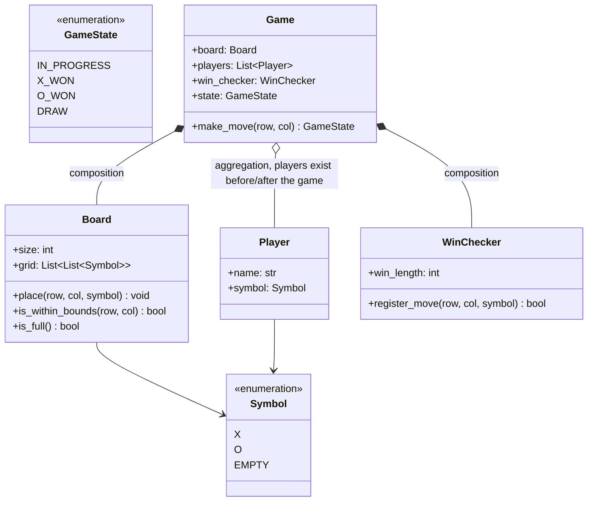

# LLD: Tic Tac Toe

**Difficulty:** Beginner | **Time:** 20–30 minutes

!!! note "Instructions"
    Design it yourself first — entities, classes, relationships — before reading past step 3. This page follows the [9-step approach](../low-level-design/index.md#the-9-step-approach-use-it-on-every-problem).

---

## 1. Problem Statement

Design a two-player Tic Tac Toe game on an N×N board (default N=3). Players alternate placing their symbol on an empty cell; the game detects a win (N in a row, horizontally, vertically, or diagonally) or a draw (board full, no winner), and rejects invalid moves.

The board size should not be hardcoded to 3 — design so N is a parameter, and so a future "Connect 4"-style variant (bigger board, win condition is K-in-a-row where K < N, not "fill the whole row") is a plausible extension, not a rewrite. That constraint is what makes this an actual LLD problem: the naive approach — after every move, rescan every row, column, and both diagonals for N-in-a-row — is O(N) per move and gets worse as the board grows for the Connect-4 variant, where you'd otherwise rescan windows across the whole board. A good design instead maintains running counters that make the win check after each move O(1), independent of N.

---

## 2. Requirements

**Functional (in scope):**

- N×N board, N configurable at game construction (default 3)
- Two players, alternating turns, each with a distinct symbol (`X` / `O`)
- Reject a move on an occupied cell, an out-of-bounds cell, or a move made after the game has ended
- Detect a win — N symbols in a row, column, or either diagonal — in O(1) time after the move that causes it
- Detect a draw — board full, no winner
- Report game state (`IN_PROGRESS`, `X_WON`, `O_WON`, `DRAW`) after each move

**Explicitly out of scope for v1:** an AI opponent (touched on in Extensibility), a networked multiplayer transport layer (touched on in Concurrency), move undo/redo, board sizes where N is even and the diagonal win condition is ambiguous (assume square boards with well-defined diagonals).

??? question "Clarifying questions worth asking out loud"
    - Is the board always square (N×N), or could it be rectangular? (Assume square — simplifies diagonal logic; state the assumption.)
    - Is the win condition always "fill an entire row/column/diagonal" (classic 3x3), or should the design support K-in-a-row on a larger board (Connect-4-style)? This changes whether counters are booleans-per-line or bounded running counts.
    - Exactly two players, or should the design leave room for more symbols later? (Assume exactly two — a third player breaks "not X's turn implies O's turn" turn logic and is a real redesign, not a config change.)
    - Should an out-of-bounds or occupied-cell move raise an exception, return a boolean, or silently no-op? (Pin this down — it affects every caller.)

---

## 3. Entities

The nouns in the problem statement: `Symbol`, `Player`, `Board`, `WinChecker`, `Game`.

---

## 4. Class Design



**Why composition for `Game *-- Board` and `Game *-- WinChecker`:** neither has meaning outside a specific game — a `Board` isn't shared across games, and a `WinChecker`'s running counters are only valid for the single board it was tracking. Delete the game, both go with it. **Why aggregation for `Game o-- Player`:** a `Player` (name, chosen symbol, and in a real system an account/session) exists before the game starts and after it ends — the game references two players, it doesn't own their lifecycle — see [Class Relationships](../low-level-design/solid-principles.md#class-relationships-uml-basics).

`WinChecker` is deliberately a separate class from `Board`, not a method on it: `Board` owns *what's on the grid*; `WinChecker` owns *whether the current grid state is a win*, including the running-counter state that makes that check fast. Splitting them keeps `Board` a dumb, reusable grid and keeps the win-detection algorithm swappable (see Patterns below) without touching grid storage.

---

## 5. Patterns Applied

- **Strategy**, legitimately, only if the requirement is "support multiple win-condition rules" — e.g. classic N-in-a-row-fills-everything on a 3x3 versus K-in-a-row-on-a-bigger-board (Connect-4-style) versus some custom variant. In that case `WinChecker` becomes an interface with `register_move()` as the seam, and each rule set is its own implementation sharing nothing but the interface. See [Strategy](../low-level-design/design-patterns.md#strategy-swap-the-algorithm-without-touching-the-class-that-uses-it). For a single fixed rule set (classic 3x3), don't introduce the interface — a concrete `WinChecker` class is enough, and adding the abstraction speculatively is over-engineering for a problem this small.
- Explicitly **not** using Singleton for `Game` — it's tempting because "there's only one game on screen right now," but a server hosting many concurrent games (see Concurrency) needs one `Game` instance per game session, and a singleton would have to be unwound the moment that requirement shows up. Construct and pass around `Game` instances normally.
- No Factory here — there's nothing to centralize; `Player` and `Board` construction is trivial and doesn't vary by input in a way that earns a creational pattern.

---

## 6. Core Code

The interesting part of this problem is entirely in `WinChecker`: instead of rescanning the board after every move, it maintains a running count per row, per column, and per diagonal, incremented (or decremented, for the other player) on each placement, so `register_move` is O(1) regardless of board size.

```python
from dataclasses import dataclass
from enum import Enum


class Symbol(Enum):
    EMPTY = 0
    X = 1
    O = -1          # signed values let counters cancel out when players share a line


class GameState(Enum):
    IN_PROGRESS = "in_progress"
    X_WON = "x_won"
    O_WON = "o_won"
    DRAW = "draw"


@dataclass
class Player:
    name: str
    symbol: Symbol


class Board:
    def __init__(self, size: int = 3):
        self.size = size
        self.grid: list[list[Symbol]] = [[Symbol.EMPTY] * size for _ in range(size)]

    def is_within_bounds(self, row: int, col: int) -> bool:
        return 0 <= row < self.size and 0 <= col < self.size

    def is_occupied(self, row: int, col: int) -> bool:
        return self.grid[row][col] != Symbol.EMPTY

    def place(self, row: int, col: int, symbol: Symbol) -> None:
        self.grid[row][col] = symbol

    def is_full(self) -> bool:
        return all(cell != Symbol.EMPTY for row in self.grid for cell in row)


class WinChecker:
    """
    Classic win rule: N-in-a-row fills an entire row, column, or diagonal.

    Why running counters instead of rescanning the board after every move:
    a full rescan is O(N) per move (N cells in the affected row/col, plus
    the diagonals) and the naive "check the whole board" version is O(N^2).
    Neither is expensive for N=3, but the design should scale to a larger
    board without changing shape — and it costs nothing to do it right here.

    Each line (row i, column j, main diagonal, anti-diagonal) gets a running
    signed sum. X contributes +1 per cell, O contributes -1 (see Symbol).
    After incrementing the relevant line(s) for a move, the sum reaching
    +size means X completed that line; -size means O did. This turns "did
    this move complete a line" into an O(1) check: at most 3 lines (row,
    column, and 0-2 diagonals) are touched by any single move, never the
    whole board.
    """

    def __init__(self, size: int):
        self.size = size
        self._row_counts = [0] * size
        self._col_counts = [0] * size
        self._diag_count = 0          # top-left to bottom-right
        self._anti_diag_count = 0     # top-right to bottom-left

    def register_move(self, row: int, col: int, symbol: Symbol) -> bool:
        delta = symbol.value                      # +1 for X, -1 for O
        self._row_counts[row] += delta
        self._col_counts[col] += delta
        if row == col:
            self._diag_count += delta
        if row + col == self.size - 1:
            self._anti_diag_count += delta

        target = self.size * delta                # +size for an X win, -size for an O win
        return (
            self._row_counts[row] == target
            or self._col_counts[col] == target
            or self._diag_count == target
            or self._anti_diag_count == target
        )


class Game:
    def __init__(self, players: list[Player], size: int = 3):
        if len(players) != 2 or players[0].symbol == players[1].symbol:
            raise ValueError("tic tac toe requires exactly two players with distinct symbols")
        self.board = Board(size)
        self.players = players
        self.win_checker = WinChecker(size)
        self.state = GameState.IN_PROGRESS
        self._turn_index = 0                       # players[0] moves first

    def make_move(self, row: int, col: int) -> GameState:
        if self.state != GameState.IN_PROGRESS:
            raise ValueError("game has already ended")
        if not self.board.is_within_bounds(row, col):
            raise ValueError(f"({row}, {col}) is out of bounds for a {self.board.size}x{self.board.size} board")
        if self.board.is_occupied(row, col):
            raise ValueError(f"cell ({row}, {col}) is already occupied")

        player = self.players[self._turn_index]
        self.board.place(row, col, player.symbol)

        if self.win_checker.register_move(row, col, player.symbol):
            self.state = GameState.X_WON if player.symbol == Symbol.X else GameState.O_WON
        elif self.board.is_full():
            self.state = GameState.DRAW
        else:
            self._turn_index = 1 - self._turn_index   # only advance turn if the game continues

        return self.state
```

---

## 7. Edge Cases

| Case | Handling |
|------|----------|
| Move on an already-occupied cell | `make_move` raises before touching the board or the win checker — caller (UI/network layer) re-prompts the same player |
| Move after the game has already ended (win or draw) | `state != IN_PROGRESS` is checked first, before bounds/occupancy — raises immediately, no side effects |
| Move out of bounds (row/col negative or >= size) | `is_within_bounds` rejects before any grid access — prevents an `IndexError` from becoming the caller's problem |
| Board fills completely with no winner | `is_full()` is only checked *after* confirming the move didn't win — so a move that simultaneously completes the last empty cell and a winning line is correctly reported as a win, not a draw |
| Board size of 1 (degenerate) | A single placement instantly "wins" every line through that cell — technically correct under the same counters, worth calling out explicitly rather than special-casing |
| Two players given the same symbol, or more/fewer than two players | Rejected in `Game.__init__` — this is a construction-time invariant, not a runtime move error |

---

## 8. Concurrency

A single in-memory game played by two people sharing one screen has no concurrency concern — `make_move` is called serially. The concurrency question shows up the moment this becomes a networked/multiplayer game: two clients, each representing one player, could submit a move for the *same game* at close to the same instant (e.g. a slow network makes a stale client retry, or a buggy client double-submits).

Two race conditions matter here, both instances of the [race condition](../low-level-design/concurrency-basics.md#race-conditions) pattern:

- **Turn violation:** without a check, both clients' moves could be applied even though only one player's symbol should be allowed to move — e.g. O sneaks in a move immediately after X's, before O's `_turn_index` update was visible. The fix already in `make_move` — reading `self._turn_index` to determine whose turn it is, and only advancing it after a successful move — must happen inside the same critical section as the board write, or the read-turn/write-board/advance-turn sequence itself becomes the race.
- **Double-write to the same cell:** two near-simultaneous calls to `make_move` (even from the correct alternating players, if a client retries) could both pass the `is_occupied` check before either has written, then both write — corrupting the board and potentially awarding a win to the wrong symbol.

The fix is a single per-game lock — not per-cell, unlike [Parking Lot](parking-lot.md#8-concurrency)'s per-spot locking. That asymmetry is deliberate: a parking lot has many independent spots where fine-grained locking buys real concurrency between unrelated resources, but a tic-tac-toe game has exactly one shared resource (the whole board plus whose-turn-it-is state) and exactly two contending clients — there's no unrelated work to parallelize, so a single [lock](../low-level-design/concurrency-basics.md#locks) around `make_move` costs nothing in practice and eliminates both races at once:

```python
from threading import Lock

class Game:
    def __init__(self, players: list[Player], size: int = 3):
        ...
        self._lock = Lock()

    def make_move(self, row: int, col: int, requesting_player: Player) -> GameState:
        with self._lock:
            if requesting_player != self.players[self._turn_index]:
                raise ValueError("not this player's turn")
            # ... existing bounds/occupancy/state checks and board write, unchanged
```

Note the added `requesting_player` parameter and the turn check as the *first* thing inside the lock — in a networked version, the caller can no longer be trusted to only call `make_move` when it's actually their turn; that trust boundary moves from "the local UI only lets you click when it's your turn" to "the server must verify identity server-side."

---

## 9. Extensibility

| New requirement | What changes | What doesn't |
|---|---|---|
| Support a 4x4 board (still classic "fill the whole line" rule) | Nothing — `Board(size=4)` and `WinChecker(size=4)` already parameterize on `size` | `Game`, `WinChecker` logic, `Board` logic |
| Support Connect-4-style N-in-a-row on a larger board (e.g. win at 5-in-a-row on a 10x10 board) | `WinChecker` becomes an interface (Strategy, see Patterns) with a `win_length` distinct from `size`; counters change from "sum reaches ±size" to "a sliding window of `win_length` consecutive same-symbol cells exists," which needs a different (still better-than-full-rescan) incremental structure per line | `Board`, `Game.make_move`'s call sites — they depend on the `WinChecker` interface, not the counting internals |
| Add an AI opponent (minimax) | New `Player` subtype or a `MoveSource` abstraction (`HumanMoveSource` reads input, `AIMoveSource` runs minimax over `Board`/`WinChecker` state) that produces `(row, col)`; `Game.make_move` itself is unaffected — it still just receives a move | `Board`, `WinChecker`, `Game.make_move`'s signature and validation |
| Support undo | `Game` needs a move history stack; undoing a move requires `WinChecker` to support decrementing a line's counters (symmetric with `register_move`'s increment) and `state` to be recomputed, not just left at its pre-undo value | `Board`'s grid representation, the O(1) counter *technique* itself (decrement is exactly as cheap as increment) |

---

## Interview Questions

=== "Foundation"
    **Q: Why not just rescan the affected row, column, and diagonals after every move to check for a win? For a 3x3 board that's at most 3 cells each — is the counter approach even worth the extra state?**

    "For a fixed 3x3 board, you're right that a rescan is cheap in absolute terms — a handful of comparisons. I'd still default to the counter approach for two reasons. First, the problem statement asks for a board size that isn't hardcoded, and a rescan's cost scales with N while the counter check stays O(1) regardless of N — so the design doesn't quietly get worse as N grows, which matters the moment someone asks for a bigger board. Second, the counter version isn't actually more complex to read or reason about — `register_move` is a handful of lines, and it makes the 'this is checked incrementally, not by scanning' decision explicit in the code rather than something you'd have to infer. So it's not really a performance-versus-simplicity trade here; the incremental version is both faster asymptotically and about equally simple."

=== "Senior"
    **Q: Walk me through why `Player` is aggregation into `Game` while `Board` and `WinChecker` are composition. What would break if you got this backwards?**

    "A `Board` and a `WinChecker` only make sense in the context of one specific game — the `WinChecker`'s running counters are meaningless detached from the exact board they were tracking, and nobody reuses a board across games. So `Game` owns their full lifecycle: construct them, and they're destroyed with the game. `Player`, on the other hand, represents a person or account that exists before the game starts and keeps existing after it ends — they might play another game next. If I modeled `Player` as composition, the natural implementation would construct `Player` objects inside `Game.__init__`, which forces a new `Player` identity every game and loses any notion of 'this is the same person across games' — you couldn't track a win/loss record across games without bolting on an external ID anyway, at which point the composition modeling bought nothing. Getting it backwards — aggregating `Board` — would be worse: it invites some other component to hold a reference to a board after its game ends and mutate it, which is exactly the kind of dangling-shared-mutable-state bug composition is meant to rule out."

=== "Staff"
    **Q: Your O(1) win check relies on summing to exactly `+size` or `-size` for classic tic-tac-toe. If we now need Connect-4-style play — win at exactly 5-in-a-row on a 10x10 board, not 'fill the whole line' — does that counter trick still work, and if not, what replaces it?**

    "It doesn't work as-is, and it's important to say precisely why: the sum-to-`±size` check only detects 'every cell in this entire line is the same symbol' — it can't distinguish '5 in a row somewhere in the middle of a 10-cell row' from '3 X's and 2 empties scattered across that row,' because a plain sum loses positional information about *where* the matching cells are, only how many there are net. For K-in-a-row on a longer line, I need something that tracks contiguous runs, not just a count. The standard incremental structure is: for each line, track the length of the current 'run' of the same symbol ending at each position, or equivalently, track for each direction (from the just-placed cell) how far the run extends left/right/up/down/diagonally, then check if left-run + right-run + 1 (the placed cell) reaches `win_length` — still O(1) per move because you're only walking outward from the single new cell along at most 4 directions, capped at `win_length` steps each, not rescanning the board. This is also exactly the moment the `WinChecker` interface (Strategy) earns its keep: I'd keep `ClassicWinChecker` for the sum-based version — it's simpler and correct for its narrower case — and add a `RunLengthWinChecker` for the general K-in-a-row case, selected at `Game` construction time, rather than generalizing the classic checker's simpler counters to handle a case they were never designed for."

---

## Key Takeaways

!!! success "Remember"
    1. The naive "rescan the board after every move" approach isn't wrong, just non-scaling — running per-line counters turn the win check into O(1) per move, independent of board size, at negligible extra complexity.
    2. Signed symbol values (`X = +1`, `O = -1`) let a single running sum per line double as the win check for both players — no need for separate per-player counters.
    3. `WinChecker` is a separate class from `Board` on purpose: `Board` owns grid storage, `WinChecker` owns the win-detection algorithm and its incremental state — splitting them is what makes Strategy a clean extension point later, without forcing it in now.
    4. Composition (`Board`, `WinChecker`) versus aggregation (`Player`) is decided by lifecycle, same rule as every other exercise on this site: does the object outlive the game conceptually?
    5. A single per-game lock, not per-cell locking, is correct here — there's exactly one shared resource and two contenders, unlike Parking Lot's many independent spots.
    6. Don't reach for Strategy or a `WinChecker` interface until a second win-condition rule (e.g. Connect-4-style K-in-a-row) is actually a named requirement — a concrete class is enough for the classic game.

**Previous:** [LLD Problem Roadmap](index.md) | **Next:** [Library Management](library-management.md)
