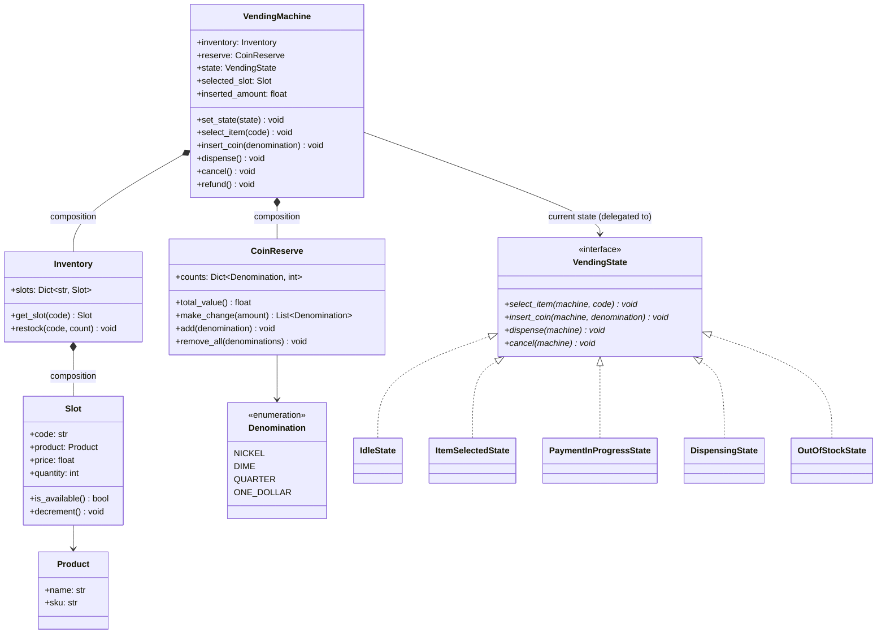
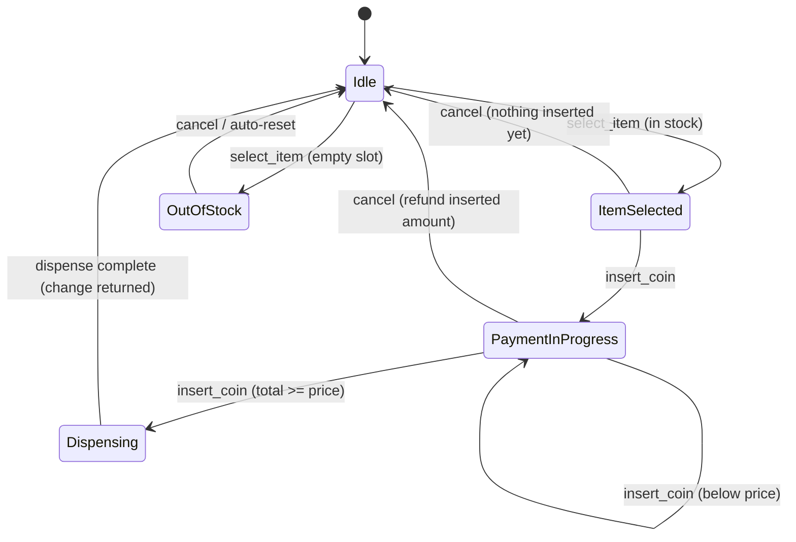

# LLD: Vending Machine

**Difficulty:** Intermediate | **Time:** 35–45 minutes

!!! note "Instructions"
    Design it yourself first — entities, classes, relationships — before reading past step 3. This page follows the [9-step approach](../low-level-design/index.md#the-9-step-approach-use-it-on-every-problem).

---

## 1. Problem Statement

Design a vending machine. It has a fixed set of slots, each holding one product at one price with some remaining quantity. A user selects a slot, inserts money (coins or bills; card payment is a stretch goal), and the machine either dispenses the product and returns any change owed, or rejects the transaction and refunds what was inserted. The one rule that overrides every other design decision: **the machine must never dispense a product without having been paid in full, and it must never accept and keep payment without either dispensing the correct product or refunding the money.**

---

## 2. Requirements

**Functional (in scope):**

- A fixed number of slots, each with a product, a price, and a remaining quantity
- Accept coins/bills of standard denominations, tracked as running inserted total
- Select-then-pay flow: select a slot, insert money, dispense once inserted total ≥ price
- Return correct change (inserted total − price) using available denominations in the machine's coin reserve
- Cancel a transaction mid-flow and refund everything inserted so far
- Track and decrement inventory per slot on successful dispense

**Explicitly out of scope for v1:** card/contactless payment (noted as a stretch and covered in Extensibility), multi-currency, dynamic pricing/promotions, remote restock alerts.

??? question "Clarifying questions worth asking out loud"
    - Exact-change-only mode when the coin reserve is low — does the machine advertise that state, or discover it mid-transaction?
    - On cancel, is the refund the exact coins inserted, or just an equivalent value made from the reserve?
    - Can a slot hold more than one product, or is it strictly one-product-per-slot with a quantity counter?
    - Does the machine accept bills as well as coins, and do bills ever get returned as "change" or only coins?
    - Is there a timeout — if a user selects an item and walks away, does the machine auto-cancel and refund after some interval?

---

## 3. Entities

`VendingMachine`, `Slot` (product + price + quantity), `Inventory`, `Coin` / `Money`, `VendingState` (interface) with concrete states `IdleState`, `ItemSelectedState`, `PaymentInProgressState`, `DispensingState`, `OutOfStockState`.

---

## 4. Class Design





**Why `Slot` composed inside `Inventory`, and `Inventory`/`CoinReserve` composed inside `VendingMachine`:** none of these have meaning or a lifecycle independent of the machine that owns them — see [Class Relationships](../low-level-design/solid-principles.md#class-relationships-uml-basics). `Product` is the one aggregation-flavored exception in spirit (the same `Product` metadata could in principle be shared/cataloged across machines), but it's modeled here as plain data owned by the `Slot` since the problem doesn't ask for a shared catalog.

**State vs. flags-and-`if`/`else`:** an obvious first cut is a `VendingMachine` with booleans like `item_selected`, `payment_complete`, `dispensing` and a pile of `if not item_selected: raise ...` guards scattered across every method. That collapses fast — five states means up to 2⁵ boolean combinations, most of them nonsensical (`dispensing=True` while `item_selected=False`), and every new method has to re-derive "what am I allowed to do right now" by re-reading every flag. The **State pattern** makes illegal combinations unrepresentable: `VendingMachine` always has exactly one `VendingState` object, each state's methods define the *complete* set of legal actions from that state, and an action that isn't legal from the current state either no-ops or raises there — not somewhere else in a giant conditional.

---

## 5. Patterns Applied

- **State** for the transaction lifecycle. This is the headline pattern, and the payoff is concrete: `insert_coin` on `IdleState` should do something different (and arguably invalid — you can't pay before selecting) than `insert_coin` on `PaymentInProgressState`. Rather than one `VendingMachine.insert_coin()` method branching on a `self.status` enum with a switch statement re-litigated on every call, each state class implements `insert_coin` with only the behavior that's legal *from that state*, and the transition to the next state is a single `machine.set_state(NextState())` call at the end of that method — the transition is owned by the state that's ending, not by the context object polling "did something change." This is also why `VendingMachine` methods are thin: `select_item`, `insert_coin`, `dispense`, and `cancel` all just delegate to `self.state.<method>(self, ...)` — the machine is the context, not the decision-maker.
- **Strategy** for change-making — `CoinReserve.make_change()` is a swappable algorithm behind a fixed contract (amount owed in, list of denominations out), not logic hardcoded into `dispense()`. The implementation here is a straightforward greedy algorithm: repeatedly take the largest denomination that doesn't overshoot the remaining amount. Greedy is provably optimal for canonical coin systems like US currency (1, 5, 10, 25 cent pieces plus dollar units) but is a well-known counterexample generator for arbitrary denomination sets — e.g. with coins `{1, 3, 4}`, greedy makes 6 as `4+1+1` (three coins) when `3+3` (two coins) is optimal. Pulling this out as a `Strategy` means swapping in a dynamic-programming exact-change algorithm later, if the machine ever supports a non-canonical denomination set, touches one class and not `VendingMachine` or any `VendingState`. See [Design Patterns](../low-level-design/design-patterns.md#strategy-swap-the-algorithm-without-touching-the-class-that-uses-it).

---

## 6. Core Code

```python
from abc import ABC, abstractmethod
from dataclasses import dataclass, field
from enum import Enum
from threading import Lock


class Denomination(Enum):
    NICKEL = 0.05
    DIME = 0.10
    QUARTER = 0.25
    ONE_DOLLAR = 1.00


@dataclass(frozen=True)
class Product:
    sku: str
    name: str


class Slot:
    def __init__(self, code: str, product: Product, price: float, quantity: int):
        self.code = code
        self.product = product
        self.price = price
        self.quantity = quantity

    def is_available(self) -> bool:
        return self.quantity > 0

    def decrement(self) -> None:
        if self.quantity <= 0:
            raise RuntimeError(f"slot {self.code!r} is already empty — should never be reached")
        self.quantity -= 1


class Inventory:
    def __init__(self, slots: dict[str, Slot]):
        self.slots = slots

    def get_slot(self, code: str) -> Slot | None:
        return self.slots.get(code)


class InsufficientChangeError(Exception):
    """Raised when the reserve cannot make exact change for an amount it does have covered in total value."""


class CoinReserve:
    def __init__(self, counts: dict[Denomination, int]):
        self.counts = counts

    def total_value(self) -> float:
        return round(sum(d.value * c for d, c in self.counts.items()), 2)

    def make_change(self, amount: float, extra_coins: list[Denomination] | None = None) -> list[Denomination]:
        """Greedy: largest denomination first. See Patterns Applied for why this
        is a Strategy seam and where greedy stops being optimal in general."""
        remaining = round(amount, 2)
        result: list[Denomination] = []
        working_counts = dict(self.counts)          # don't mutate reserve until commit
        for coin in extra_coins or []:
            working_counts[coin] = working_counts.get(coin, 0) + 1
        for denom in sorted(Denomination, key=lambda d: -d.value):
            while remaining >= denom.value - 1e-9 and working_counts.get(denom, 0) > 0:
                result.append(denom)
                working_counts[denom] -= 1
                remaining = round(remaining - denom.value, 2)
        if remaining > 1e-9:
            raise InsufficientChangeError(
                f"cannot make exact change for {amount:.2f} from current reserve"
            )
        return result

    def commit_change(self, denominations: list[Denomination]) -> None:
        for d in denominations:
            self.counts[d] -= 1

    def add(self, denomination: Denomination) -> None:
        self.counts[denomination] = self.counts.get(denomination, 0) + 1


class VendingState(ABC):
    @abstractmethod
    def select_item(self, machine: "VendingMachine", code: str) -> None: ...

    @abstractmethod
    def insert_coin(self, machine: "VendingMachine", denomination: Denomination) -> None: ...

    @abstractmethod
    def dispense(self, machine: "VendingMachine") -> None: ...

    @abstractmethod
    def cancel(self, machine: "VendingMachine") -> None: ...


class IdleState(VendingState):
    def select_item(self, machine: "VendingMachine", code: str) -> None:
        slot = machine.inventory.get_slot(code)
        if slot is None:
            raise ValueError(f"no such slot {code!r}")
        if not slot.is_available():
            machine.selected_slot = slot
            machine.set_state(OutOfStockState())
            return
        machine.selected_slot = slot
        machine.inserted_amount = 0.0
        machine.set_state(ItemSelectedState())

    def insert_coin(self, machine: "VendingMachine", denomination: Denomination) -> None:
        raise RuntimeError("select an item before inserting money")

    def dispense(self, machine: "VendingMachine") -> None:
        raise RuntimeError("no item selected")

    def cancel(self, machine: "VendingMachine") -> None:
        pass  # nothing to cancel


class OutOfStockState(VendingState):
    def select_item(self, machine: "VendingMachine", code: str) -> None:
        IdleState().select_item(machine, code)  # re-route through idle's logic

    def insert_coin(self, machine: "VendingMachine", denomination: Denomination) -> None:
        raise RuntimeError("selected item is out of stock — choose another")

    def dispense(self, machine: "VendingMachine") -> None:
        raise RuntimeError("selected item is out of stock")

    def cancel(self, machine: "VendingMachine") -> None:
        machine.selected_slot = None
        machine.set_state(IdleState())


class ItemSelectedState(VendingState):
    def select_item(self, machine: "VendingMachine", code: str) -> None:
        IdleState().select_item(machine, code)  # allow changing selection before paying

    def insert_coin(self, machine: "VendingMachine", denomination: Denomination) -> None:
        machine.inserted_amount = round(machine.inserted_amount + denomination.value, 2)
        machine.inserted_coins.append(denomination)  # escrow until the sale succeeds
        if machine.inserted_amount >= machine.selected_slot.price - 1e-9:
            machine.set_state(DispensingState())
            machine.state.dispense(machine)
        else:
            machine.set_state(PaymentInProgressState())

    def dispense(self, machine: "VendingMachine") -> None:
        raise RuntimeError("insert payment before dispensing")

    def cancel(self, machine: "VendingMachine") -> None:
        machine.selected_slot = None
        machine.set_state(IdleState())


class PaymentInProgressState(VendingState):
    def select_item(self, machine: "VendingMachine", code: str) -> None:
        raise RuntimeError("cancel the current transaction before selecting a different item")

    def insert_coin(self, machine: "VendingMachine", denomination: Denomination) -> None:
        machine.inserted_amount = round(machine.inserted_amount + denomination.value, 2)
        machine.inserted_coins.append(denomination)
        if machine.inserted_amount >= machine.selected_slot.price - 1e-9:
            machine.set_state(DispensingState())
            machine.state.dispense(machine)

    def dispense(self, machine: "VendingMachine") -> None:
        raise RuntimeError("insufficient funds inserted")

    def cancel(self, machine: "VendingMachine") -> None:
        machine.refund()
        machine.selected_slot = None
        machine.set_state(IdleState())


class DispensingState(VendingState):
    def select_item(self, machine: "VendingMachine", code: str) -> None:
        raise RuntimeError("dispense in progress")

    def insert_coin(self, machine: "VendingMachine", denomination: Denomination) -> None:
        raise RuntimeError("dispense in progress")

    def dispense(self, machine: "VendingMachine") -> None:
        slot = machine.selected_slot
        change_owed = round(machine.inserted_amount - slot.price, 2)
        try:
            change = machine.reserve.make_change(change_owed, machine.inserted_coins) if change_owed > 0 else []
        except InsufficientChangeError:
            # Cannot make correct change: refuse the sale entirely and refund
            # everything inserted, rather than dispensing without giving change back.
            machine.refund()
            machine.selected_slot = None
            machine.set_state(IdleState())
            return

        slot.decrement()
        for coin in machine.inserted_coins:          # sale committed: escrow joins the reserve
            machine.reserve.add(coin)
        machine.reserve.commit_change(change)
        machine.dispensed_product = slot.product
        machine.returned_change = change
        machine.inserted_amount = 0.0
        machine.inserted_coins = []
        machine.selected_slot = None
        machine.set_state(IdleState())

    def cancel(self, machine: "VendingMachine") -> None:
        raise RuntimeError("cannot cancel mid-dispense")


class VendingMachine:
    def __init__(self, inventory: Inventory, reserve: CoinReserve):
        self.inventory = inventory
        self.reserve = reserve
        self.state: VendingState = IdleState()
        self.selected_slot: Slot | None = None
        self.inserted_amount: float = 0.0
        self.inserted_coins: list[Denomination] = []  # exact coins held in transaction escrow
        self.dispensed_product: Product | None = None
        self.returned_change: list[Denomination] = []
        self._lock = Lock()

    def set_state(self, state: VendingState) -> None:
        self.state = state

    def select_item(self, code: str) -> None:
        with self._lock:
            self.state.select_item(self, code)

    def insert_coin(self, denomination: Denomination) -> None:
        with self._lock:
            self.state.insert_coin(self, denomination)

    def dispense(self) -> None:
        with self._lock:
            self.state.dispense(self)

    def cancel(self) -> None:
        with self._lock:
            self.state.cancel(self)

    def refund(self) -> list[Denomination]:
        """Return the exact escrowed coins; cancellation never depends on making change."""
        change = list(self.inserted_coins)
        self.inserted_coins = []
        self.inserted_amount = 0.0
        self.returned_change = change
        return change
```

---

## 7. Edge Cases

| Case | Handling |
|------|----------|
| Select an out-of-stock item | `IdleState.select_item` checks `slot.is_available()` and routes to `OutOfStockState` instead of `ItemSelectedState`; that state rejects `insert_coin`/`dispense` outright so no money can be accepted against a slot that can't fulfill it |
| Inserted amount exceeds price, but the reserve can't make that much change | `DispensingState.dispense` calls `reserve.make_change()` inside a `try`; on `InsufficientChangeError` it refunds the *entire* inserted amount and returns to `Idle` rather than dispensing without correct change — the no-partial-dispense rule from the problem statement in code |
| Cancel mid-transaction | `PaymentInProgressState.cancel` calls `machine.refund()`, which returns the exact denominations held in transaction escrow. Cancellation therefore cannot fail merely because the machine's general change reserve lacks a particular denomination |
| Item price changes while a transaction is in flight (e.g. remote price update lands mid-payment) | The price used at dispense time (`slot.price`) is read live from the `Slot`, not captured at `select_item` time — decide explicitly whether that's correct (fair to the machine) or whether the price should be captured once at selection (fair to the user, and what most real machines do); this implementation captures live, which is the wrong default for a customer-facing machine and worth calling out as a deliberate simplification |
| Machine has enough *total value* for change but is out of a specific low denomination it needs (e.g. owes $0.15 in change but has zero nickels/dimes left, only quarters) | `make_change`'s greedy loop finds no combination that lands on exactly 0 remaining and raises `InsufficientChangeError` even though `total_value()` looks sufficient — this is precisely why the check has to be "can construct exact change," not "reserve total >= change owed"; handled the same way as full insufficient-change above: refuse and refund |

---

## 8. Concurrency

A single physical vending machine has one coin acceptor and one motor per slot, so hardware naturally serializes most interaction — but two near-simultaneous button presses on the same unit (an impatient user mashing "select" while an `insert_coin` from a jammed coin path is still being processed) can still race in software even if the hardware itself is single-threaded, and a **networked variant** — a fleet of machines reporting to a central inventory/monitoring service, or a machine with a companion mobile-payment app talking to it over Bluetooth alongside its physical coin slot — makes concurrent access a first-class concern rather than a hypothetical.

The fix here is the same shape as [Parking Lot](parking-lot.md#8-concurrency)'s per-spot lock, but coarser: `VendingMachine`'s own `_lock` wraps every public method (`select_item`, `insert_coin`, `dispense`, `cancel`) so the select → pay → dispense critical section can't interleave. This is intentionally a single machine-wide lock, not a finer-grained one — unlike a parking lot with many independent spots that benefit from concurrent access, a vending machine has exactly one `selected_slot` and one `inserted_amount` shared across the entire transaction, so there's no independent sub-resource to lock separately; the whole state machine *is* the critical section. See [Concurrency Basics](../low-level-design/concurrency-basics.md#race-conditions) for why "read state, decide, write state" without a lock is the general race pattern this closes, and [Locks](../low-level-design/concurrency-basics.md#locks) for why coarse locking is the right call when contention is inherently low (one machine, effectively one user at a time) rather than something to optimize away speculatively.

For the networked fleet variant, the lock only protects one machine's local state — it says nothing about the central inventory service, which needs its own concurrency story (e.g. optimistic updates with retry, or an eventually-consistent restock-alert feed) entirely separate from the per-machine hardware lock described here.

---

## 9. Extensibility

| New requirement | What changes | What doesn't |
|---|---|---|
| Card/contactless payment | New `PaymentMethod` abstraction (or a new `VendingState` transition path) that credits `inserted_amount` atomically from a card auth instead of coin-by-coin; `DispensingState` and inventory logic are unchanged since they only care about the total, not how it arrived | `Slot`, `Inventory`, `CoinReserve`, all existing states' core flow |
| Remote low-stock alerts | `Slot.decrement()` gains a threshold check that fires an event/callback when quantity drops below a configured level; wire it to an `Observer` | `VendingState` hierarchy, `VendingMachine`'s public methods |
| Dynamic pricing / promotions | New pricing lookup (a `PricingStrategy` analogous to Parking Lot's) consulted at `select_item` or `dispense` time instead of reading `slot.price` directly | `CoinReserve`, `Inventory` structure |
| Multi-currency | `Denomination` becomes currency-scoped (or `CoinReserve` becomes per-currency), and `select_item`/`dispense` need a currency parameter or a machine-level currency setting | `VendingState` transition logic, `Slot` |

---

## Interview Questions

=== "Foundation"
    **Q: Why does `VendingMachine.insert_coin()` just delegate to `self.state.insert_coin(self, denomination)` instead of containing the actual logic?**

    "Because what `insert_coin` should *do* depends entirely on which state the machine is in — from `Idle` it should be rejected outright, from `ItemSelected` it starts a payment and may immediately trigger a dispense if the coin alone covers the price, from `PaymentInProgress` it accumulates toward the price, and from `Dispensing` it should be rejected because the hardware is mid-cycle. If I put all of that in one method, I'd need a big conditional keyed off a status flag, re-litigated every single call. The State pattern moves that conditional into the type system: `VendingMachine` just holds a reference to 'whichever state object is currently active' and forwards the call, so each state class only has to implement the behavior that's actually legal from itself."

=== "Senior"
    **Q: Walk through what happens when a user inserts exactly the right amount in one coin — say the price is $0.75 and they insert a single dollar's worth in quarters one at a time, and the third quarter tips it over.**

    "Each `insert_coin` call in `PaymentInProgressState` adds the coin's value to `inserted_amount` and immediately checks whether that total now covers the price. On the third quarter, `inserted_amount` becomes 0.75, which is >= the slot's price, so that same call transitions to `DispensingState` and immediately invokes `dispense()` on it — there's no separate 'now check if we're done' polling step, the check happens inline at the point the state changed. `DispensingState.dispense` then computes change owed as `inserted_amount - price` — here $0.25 — asks the `CoinReserve` for exact change, decrements the slot's quantity, and only *after* the reserve confirms it can supply exact change does it hand back the coin and reset to `Idle`. The load-bearing detail is that inventory decrement and change confirmation both happen before the state resets — if the reserve can't make change, none of that commits; instead I refund the full $1.00 and reset to `Idle`, which is why refund logic lives in the `dispense` path, not just in `cancel`."

=== "Staff"
    **Q: The dispense motor physically jams after your code has decremented the slot's inventory count and accepted the customer's money, but before the product actually drops. How does your design avoid both losing the customer's money and losing count of inventory?**

    "As written, `DispensingState.dispense` has a real bug for exactly this scenario: it calls `slot.decrement()` and commits the change *before* any confirmation that the physical drop mechanism succeeded — it conflates 'the machine has decided to dispense' with 'the machine actually dispensed.' That's the same class of problem as an ATM debiting an account before confirming cash was physically dispensed. The fix is the same shape: split the operation into a provisional phase and a confirmation phase. `decrement()` and `commit_change()` should happen against a *pending* transaction record, not directly against live inventory and the live reserve; only a hardware-confirmed 'product dropped' sensor event should finalize that pending record into a real decrement. If the drop sensor times out or reports a jam, the compensating transaction is: roll the slot quantity back to what it was, and refund the customer rather than commit the change — exactly mirroring `InsufficientChangeError`'s refund path, just triggered by a hardware fault signal instead of a reserve-math failure. And critically, this can't be a synchronous in-memory rollback alone if the machine can lose power mid-jam: the pending transaction needs to be durable (written before the motor is signaled) so that on next boot, the machine can reconcile — see 'was there a pending dispense with no confirmation and no rollback recorded' — the same durability requirement as any two-phase commit between an external side effect and a data store. Without that durability step, a power cycle at exactly the wrong instant loses both the inventory count and the record that the customer is owed a refund, which is the actual failure mode worth naming, not just the jam itself."

---

## Key Takeaways

!!! success "Remember"
    1. State pattern makes illegal action/state combinations unrepresentable — each `VendingState` implements only what's legal from itself, instead of one method re-deriving legality from a pile of boolean flags on every call.
    2. The "never dispense without payment, never keep payment without dispensing or refunding" rule from the problem statement should be traceable to specific code: the `try`/`except InsufficientChangeError` refund path in `dispense()` is that rule enforced.
    3. Greedy change-making is optimal for canonical coin systems (US currency) but not universally — pulling it out as a Strategy means a future non-canonical denomination set is a new class, not a rewrite.
    4. "Enough total value in the reserve" is not the same check as "can construct exact change from what's available" — the low-denomination-exhausted edge case is where that distinction bites.
    5. A single machine-wide lock is the right concurrency granularity here, unlike Parking Lot's per-spot locking — there's exactly one shared transaction in flight per physical machine, so finer-grained locking has no independent sub-resource to protect.
    6. A hardware fault after inventory is decremented and money is accepted (motor jam) needs a provisional/confirm split with durable pending-transaction state, not an in-memory rollback alone — the same compensating-transaction shape as an ATM's debit-then-dispense problem, applied to physical hardware instead of a ledger.

**Previous:** [ATM](atm.md) | **Next:** [Chess](chess.md)
