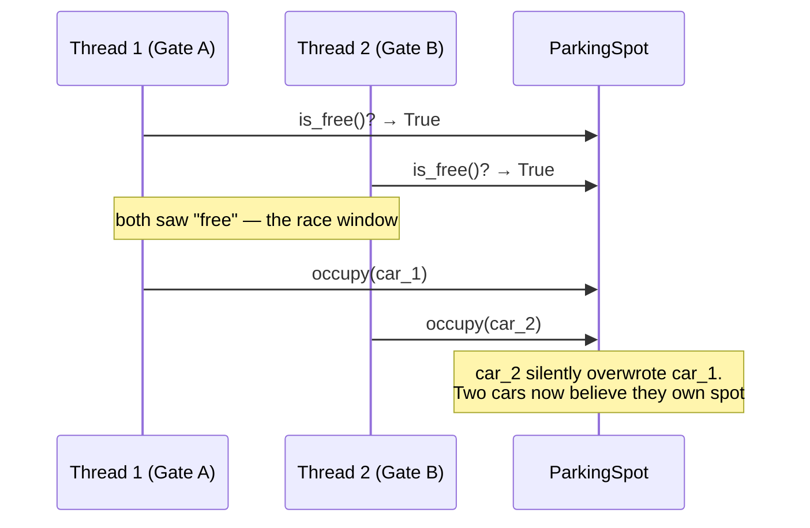
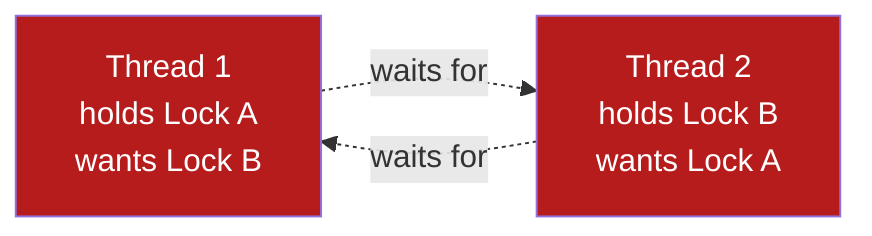

# Concurrency Basics

**Prerequisites:** [OOP Fundamentals](oop-fundamentals.md)

[← Design Patterns](design-patterns.md) | [Next: Concurrency Execution Models →](concurrency-execution-models.md)

---

## Why This Exists

A single-threaded `ParkingLot.park_vehicle()` that checks a spot is free and then marks it occupied works perfectly in every demo and fails the first time two threads (two entry gates, two API requests) call it at the same moment. **Concurrency correctness is invisible in a single-threaded walkthrough and is exactly what a Senior/Staff interviewer probes for once your class design looks clean.** This is step 9 from the [9-step approach](index.md) — the step candidates skip because the design "already works."

!!! tip "Mental model"
    Every concurrency bug in an LLD interview reduces to the same shape: **two threads observe a shared state, both decide based on what they observed, and the state changes between the observation and the action.** "Check-then-act" without atomicity is the pattern to hunt for in your own design before the interviewer finds it.

---

## Threads and Shared State

A thread is an independent path of execution within a process; multiple threads in the same process share memory — including the objects your LLD design created. That sharing is the entire source of concurrency bugs: two threads can read and write the same `ParkingSpot` instance simultaneously.

```python
import threading

class Counter:
    def __init__(self):
        self.count = 0

    def increment(self):
        self.count += 1     # NOT atomic: read, add, write — three steps
```

`count += 1` looks like one operation; it is read-modify-write. Two threads interleaving those three steps can both read `0`, both compute `1`, both write `1` — one increment is lost.

---

## Race Conditions

A race condition is any outcome that depends on the unpredictable timing/interleaving of concurrent operations. The parking lot version:



**Check-then-act** (`is_free()` then `occupy()`) is not atomic unless you make it so. The fix is collapsing the check and the act into one operation the runtime guarantees is indivisible:

```python
import threading

class ParkingSpot:
    def __init__(self, spot_id: str):
        self.spot_id = spot_id
        self._occupied_by = None
        self._lock = threading.Lock()

    def try_occupy(self, vehicle) -> bool:
        with self._lock:                    # check AND act inside one critical section
            if self._occupied_by is not None:
                return False
            self._occupied_by = vehicle
            return True
```

The method name change (`try_occupy` returning `bool` instead of separate `is_free()` + `occupy()`) is itself part of the fix — it makes atomicity part of the interface contract, not an accident of how callers happen to use it.

---

## Locks

A lock (mutex) ensures only one thread executes a critical section at a time; other threads block until it's released.

| Lock type | Behavior | When |
|-----------|----------|------|
| **Mutex / Lock** | Exclusive — one thread in, everyone else blocks | Default choice for protecting shared mutable state |
| **RLock (reentrant)** | Same thread can re-acquire a lock it already holds | A locked method calls another locked method on the same object |
| **Read-write lock** | Many readers concurrently, but writers get exclusive access | Read-heavy shared state (e.g. a cached lookup table) |
| **Semaphore** | Allows up to N concurrent holders, not just 1 | Limiting concurrent access to a pool of N resources (e.g. N parking spots of a size class) |

```python
class ParkingLot:
    def __init__(self, spots: list[ParkingSpot]):
        self._spots = spots
        self._lock = threading.Lock()

    def park_vehicle(self, vehicle) -> "Ticket | None":
        with self._lock:                          # coarse: whole lot locked per park() call
            for spot in self._spots:
                if spot.size == vehicle.spot_size_required() and spot.try_occupy(vehicle):
                    return Ticket(spot, vehicle)
            return None
```

!!! warning "Coarse-grained vs. fine-grained locking is a real trade-off"
    Locking the entire `ParkingLot` on every `park_vehicle()` call is simple and correct, but it means two cars looking for spots in *different* sections of the lot still serialize behind one lock — a throughput cost. Per-spot locks (as in `try_occupy` above) let unrelated spots be claimed concurrently, at the cost of more locks to reason about and a real risk of introducing deadlocks if you're not careful about acquisition order (below).

---

## Deadlocks

A deadlock is two or more threads each holding a lock the other needs, so neither can proceed — permanently, not just slowly.



The classic setup: a `transfer(from_account, to_account)` method that locks `from_account` then `to_account`. Two threads calling `transfer(A, B)` and `transfer(B, A)` simultaneously can each grab their first lock and then block forever waiting for the second.

```python
# Deadlock-prone: lock order depends on call argument order
def transfer(from_acct, to_acct, amount):
    with from_acct.lock:
        with to_acct.lock:
            from_acct.balance -= amount
            to_acct.balance += amount
```

**The fix: a consistent global lock ordering**, independent of call argument order — e.g. always lock the account with the lower account ID first:

```python
def transfer(from_acct, to_acct, amount):
    first, second = sorted([from_acct, to_acct], key=lambda a: a.account_id)
    with first.lock:
        with second.lock:
            from_acct.balance -= amount
            to_acct.balance += amount
```

Every thread now acquires locks in the same relative order, so the circular-wait condition that causes deadlock can't form.

**The four conditions all required for deadlock** (removing any one prevents it): mutual exclusion, hold-and-wait, no preemption, circular wait. Consistent lock ordering removes circular wait — usually the cheapest one to remove in an interview answer.

---

## Thread Safety Without Locks

Locks aren't the only tool — sometimes the cheaper fix is removing the shared mutable state entirely:

- **Immutability** — an object that can't change after construction can't have a race on its fields. A `Ticket` created once with `entry_time`, `spot_id`, `vehicle_id` set in the constructor and never mutated is safe to read from any thread with no lock.
- **Thread-confinement** — give each thread its own copy of the state instead of sharing one instance (e.g., a per-request object instead of a shared singleton).
- **Atomic types / compare-and-swap** — some languages provide atomic primitives (`AtomicInteger`, `compareAndSet`) that give you the check-and-act guarantee without an explicit lock, cheaper than a mutex for simple counters.
- **Concurrent collections** — a thread-safe queue or map (rather than a plain list/dict guarded by a lock you have to remember to take every time) removes an entire class of "forgot to lock this access site" bugs.

!!! tip "The interview-winning move"
    Don't reach for a lock as the first instinct. State out loud: "is there a way to avoid sharing mutable state here at all?" — an interviewer who hears you consider immutability before reaching for `threading.Lock()` is hearing staff-level judgment, not just correct syntax.

---

## Trade-offs

| Choice | Win | Cost |
|--------|-----|------|
| Coarse lock (whole object) | Simple, obviously correct | Serializes unrelated operations — throughput ceiling |
| Fine-grained locks (per field/resource) | Higher concurrency | More locks to reason about; real deadlock risk if ordering isn't disciplined |
| Immutable objects | No lock needed for reads, ever | Every "mutation" is a new object — more allocation |
| Consistent lock ordering | Eliminates deadlock's circular-wait condition | Requires a global convention every call site must follow |
| Semaphore for pooled resources | Naturally caps concurrent access to N | Wrong N either serializes unnecessarily or over-admits |

---

## Interview Questions

=== "Foundation"
    **Q: What's a race condition, and how would you fix one in a `ParkingSpot.occupy()` method?**

    "A race condition happens when the outcome depends on how two threads' operations interleave — here, thread A checks `is_free()`, thread B checks `is_free()`, both see true, both call `occupy()`, and the second overwrite silently loses the first car's claim on the spot. The fix is making check-and-act atomic: wrap both inside one lock-protected method, `try_occupy()`, so no other thread can observe the spot as free in between the check and the write."

=== "Senior"
    **Q: Your `ParkingLot` locks the entire lot on every `park_vehicle()` call. Under load, this becomes a bottleneck. How do you improve concurrency without introducing bugs?**

    "I'd move from one coarse lock on the whole lot to a lock per `ParkingSpot`, so two cars looking for spots in different areas aren't serialized behind each other — `try_occupy()` on each spot already does this correctly, I'd remove the outer lot-level lock and let the loop try spots without holding a lock across the whole scan. The risk I'd watch for is any operation that needs to lock more than one spot at once — if that ever comes up, I'd need a consistent ordering (e.g., always lock by ascending `spot_id`) to avoid introducing a deadlock that didn't exist under the coarse lock."

=== "Staff"
    **Q: A production incident report says the parking system deadlocked during a promotional event with heavy concurrent traffic. How do you diagnose it, and what's the systemic fix so it doesn't recur in a different code path next quarter?**

    "First, a thread dump at the time of the incident — deadlocked threads show up as blocked waiting on a lock another blocked thread holds, and most runtimes can detect and report the cycle directly. Once I've confirmed it's a lock-ordering issue (say, `transfer` locking accounts in argument order), the immediate fix is a consistent global ordering. The systemic fix is different: lock-ordering bugs recur because the convention lives in someone's head, not in the code. I'd introduce a lint rule or a wrapper type that only allows acquiring multiple locks through a helper that sorts by a canonical key — making the unsafe pattern (locking two resources in ad-hoc order) impossible to write, not just documented as forbidden. That's the same 'make the safe path the only path' move as the Kubernetes liveness-probe fix in the [Kubernetes](../kubernetes/index.md) staff interview answer — one incident is a bug, a repeatable category of incident is a missing guardrail."

---

## Key Takeaways

!!! success "Remember"
    1. Every concurrency bug in LLD reduces to check-then-act without atomicity — hunt for that shape in your own design
    2. A lock makes a critical section atomic; the method's *interface* should reflect that (`try_occupy()` returning bool, not separate check/act calls)
    3. Deadlock needs four conditions simultaneously; consistent lock ordering removes circular wait, usually the cheapest one to eliminate
    4. Prefer removing shared mutable state (immutability, thread-confinement) over adding a lock — fewer things to get wrong
    5. Coarse locks are simple and correct but cap throughput; fine-grained locks need disciplined ordering to stay deadlock-free
    6. This is step 9 of the [9-step approach](index.md) — bring it up unprompted, don't wait for the interviewer to ask "what about two threads?"

**Previous:** [Design Patterns](design-patterns.md) | **Next:** [Concurrency Execution Models](concurrency-execution-models.md)
