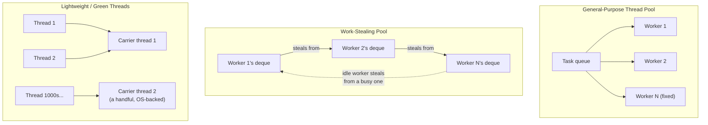
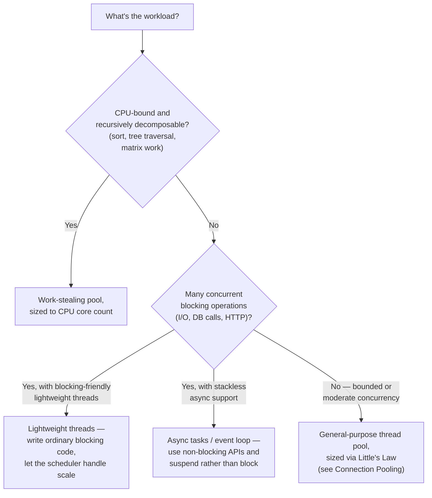
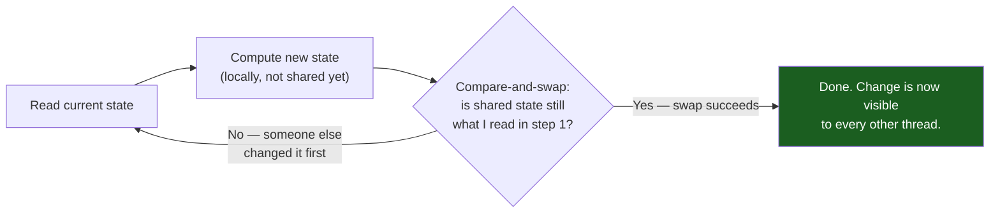
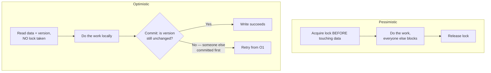
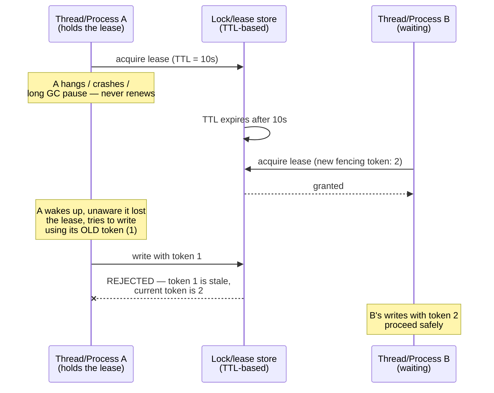

# Concurrency Execution Models

**Prerequisites:** [Concurrency Basics](concurrency-basics.md)

[← Concurrency Basics](concurrency-basics.md) | **Next:** [LLD Problem Roadmap →](../lld-exercises/index.md)

---

## Why This Exists

Mainstream runtimes repeatedly use a small set of execution models because they're solving the same underlying problems — not because any one language invented them. Java has `ExecutorService`, `ForkJoinPool`, virtual threads, and asynchronous APIs. Go has a built-in goroutine scheduler. .NET has the thread pool and `Task`; Python has `ThreadPoolExecutor` and `asyncio`; Kotlin has coroutines; Node.js has the event loop plus a small worker-thread pool. **The names differ, but the important questions transfer: what is being scheduled, how many OS threads execute it, and what happens when code waits or blocks?** Knowing those properties, not just one language's API, is what lets you answer "how would you handle this in Go" when everything you've built has been in Java.

---

## Three Core Thread-Oriented Shapes



- **General-purpose thread pool.** A fixed (or bounded, growable) set of OS threads pulling tasks off a shared queue. Simple, predictable, and the default building block for "run this asynchronously" in most languages — Java's `ExecutorService`, Python's `ThreadPoolExecutor`, .NET's `ThreadPool`, C++'s common thread-pool patterns. Every worker is a real OS thread — expensive to create (megabyte-scale stack, kernel scheduling overhead), so the pool size is capped and reused rather than spun up per task.
- **Work-stealing pool.** Built specifically for divide-and-conquer, recursive parallel work — split a big task into subtasks, and let idle workers "steal" queued subtasks from busy workers' local queues instead of sitting idle waiting for the shared queue. Java's `ForkJoinPool`, Rust's `rayon`, .NET's parallel LINQ, and the scheduler underneath Go's goroutines (partially) all use this shape. It shines specifically when task sizes are uneven — a naive fixed-worker pool leaves some workers idle while one worker grinds through a large subtree; work-stealing rebalances that automatically.
- **Lightweight / green threads.** Thousands to millions of user-space "threads" multiplexed onto a smaller number of real OS threads (often called carrier threads). The runtime scheduler — not just the OS kernel — decides which lightweight thread runs on which carrier. With scheduler-aware I/O, a blocked lightweight thread can be unmounted or parked while its carrier runs other work. This lets ordinary blocking-style code scale to high concurrency in runtimes such as Java virtual threads and Go goroutines. This category is distinct from stackless async tasks and coroutines: Python `asyncio`, Node.js callbacks, Rust futures, .NET `Task`, and Kotlin coroutines yield at suspension points; ordinary blocking code still blocks an executor or event-loop thread.

---

## Comparison

| Aspect | General-Purpose Pool | Work-Stealing Pool | Lightweight Threads |
|---|---|---|---|
| **Primary use case** | Run independent asynchronous tasks — I/O calls, background jobs | Recursive, divide-and-conquer, CPU-bound parallel computation | Massive concurrency, especially I/O-bound or blocking-heavy workloads |
| **Unit scheduled** | Real OS thread per worker | Real OS thread per worker | User-space thread; many per one real OS (carrier) thread |
| **Cost to create one** | High — real OS thread, ~1 per unit of pool size | High — same as above | Very low — often kilobytes, not megabytes; millions are feasible |
| **What happens when it blocks (I/O, a lock)** | The OS thread blocks — that pool slot is unusable until it returns | Same — blocking a worker starves that thread's local work | Scheduler-aware waits can unmount or park the lightweight thread so its carrier runs other work; native calls, some locks, or other unrecognized blocking can still pin or block the carrier |
| **Best for** | Bounded concurrent I/O, background job processing | CPU-heavy recursive algorithms (parallel merge sort, tree traversal) | Request-per-connection servers, anything with many concurrent blocking calls |
| **Parallelism ceiling** | Pool size, tuned to CPU core count for CPU-bound work | Pool size, same tuning logic, but self-balancing across uneven task sizes | Concurrency can greatly exceed the carrier count, but CPU parallelism is still capped by available carriers and cores |
| **Typical pitfall** | Fixed pool size becomes a bottleneck if tasks unexpectedly block for a long time (see [Connection Pool Exhaustion](../networking/index.md#the-three-things-that-cause-real-incidents)) | Recursive tasks that are too fine-grained spend more time on scheduling overhead than on real work | Blocking a *carrier* thread on something that isn't scheduler-aware (a native/FFI call, an OS-level blocking syscall the runtime doesn't intercept) still starves other lightweight threads sharing that carrier |

---

## Where Each Language Lands

| Language / runtime | General-Purpose Pool | Work-Stealing Pool | Lightweight Threads |
|---|---|---|---|
| Java | `ExecutorService` / `newFixedThreadPool` | `ForkJoinPool` / `parallelStream()` | Virtual threads (JEP 444, JDK 21+) |
| Go | N/A — goroutines commonly cover this role too | Partially, inside the runtime's own scheduler | Goroutines (the runtime's lightweight execution unit) |
| Kotlin | `Dispatchers.IO`-backed thread pool | N/A (delegates to JVM facilities where used) | No direct equivalent by default; coroutines are stackless async tasks and must suspend rather than block |
| Python | `ThreadPoolExecutor` (GIL-limited for CPU-bound Python code) | `ProcessPoolExecutor` for real CPU parallelism (separate processes, not work-stealing per se) | No direct equivalent in the standard runtime; `asyncio` tasks are stackless and cooperatively scheduled |
| C# / .NET | `ThreadPool` | Parallel LINQ / `Parallel.For` | No direct equivalent; `Task` represents asynchronous work and continuations, not a green thread |
| Rust | OS-thread pools from libraries and async-runtime worker pools | `rayon` | No standard direct equivalent; async-runtime tasks are stackless and cooperatively scheduled |
| Node.js | libuv's small internal thread pool (for FS/DNS/some crypto) | N/A | No direct equivalent; JavaScript callbacks and promises run through an event loop and must not block it |
| Erlang / Elixir | N/A | N/A | BEAM processes — the original, and arguably still the most mature, implementation of this shape |

!!! tip "The interview tell"
    A candidate who says "we'd use virtual threads" when asked about Go, or treats Python `asyncio` as blocking-friendly, has memorized vocabulary without checking semantics. The senior answer states the needed properties first (for example, "we need high-concurrency I/O and want blocking-style code") and then chooses the runtime mechanism that actually provides them.

---

## When to Use What



---

## Key Takeaways: Model Comparison

!!! success "Remember"
    1. **Classify mechanisms by behavior, not API names** — ask what is scheduled, what runs it, and whether waiting requires an explicit suspension point.
    2. **The one thing that changes everything: what happens when a unit of work blocks.** A general-purpose or work-stealing pool occupies a real OS thread. A scheduler-aware wait by a lightweight thread can free its carrier for other work. Stackless async tasks gain the same scalability only when code uses non-blocking APIs and reaches a suspension point; ordinary blocking code still occupies the executor or event-loop thread.
    3. **Work-stealing exists specifically for uneven, recursive task sizes** — a fixed-worker pool leaves workers idle when task sizes vary; stealing rebalances automatically.
    4. **Lightweight threads aren't magic — they can still starve if a call blocks the underlying carrier thread in a way the runtime's scheduler can't see** (a native call, a blocking syscall the runtime doesn't intercept).
    5. **Size a general-purpose pool with the same Little's Law logic used for [connection pools](../networking/index.md#the-three-things-that-cause-real-incidents)** — concurrency in flight = arrival rate × time each task holds a slot.

---

## Visual Reference

One diagram per concept below, kept outside the collapsible answers so they always render — expand the matching question underneath each one for the full explanation.

### Race condition vs. deadlock (Q1)

```
RACE CONDITION                              DEADLOCK
───────────────                             ────────
Program keeps running.                      Program stops running.
Wrong ANSWER, silently.                     No answer, ever, loudly.

T1: read count (0)                          T1: lock A ──┐
T2: read count (0)        ← both see 0            wants B │  waits
T1: write count = 1                                       │  forever
T2: write count = 1       ← one increment lost      T2: lock B ──┐
                                                            wants A │
Result: count = 1, not 2                                   waits forever
(WRONG, but the program                     Result: neither thread ever
 finished and returned)                     returns — request just hangs
```

A full sequence-diagram walkthrough of the race case, and the lock-cycle diagram for the deadlock case, are in [Concurrency Basics](concurrency-basics.md#race-conditions).

### The CAS retry loop behind every lock-free structure (Q3)



No thread ever blocks waiting for another — a "loser" just recomputes against the new state and tries again. This is what "lock-free" buys you, and also why it can burn CPU cycles retrying under heavy contention instead of the CPU-cheap sleep a blocked, lock-holding thread gets.

### Concurrency vs. parallelism (Q4)

```
CONCURRENT, NOT PARALLEL                    CONCURRENT AND PARALLEL
(single core, interleaved)                  (multiple cores, simultaneous)

Core 1: [Task A][Task B][Task A][Task B]    Core 1: [Task A][Task A][Task A]
                                             Core 2: [Task B][Task B][Task B]
   time ──────────────────────────►            time ──────────────────────►

Tasks make independent progress,            Tasks make independent progress
but never execute at the literal            AND actually execute at the
same instant — the illusion of              same physical instant, on
"at the same time" comes from               different cores.
fast switching, not true overlap.
```

Structure (concurrency) and execution (parallelism) are independent axes — you can have either without the other, or both together, as shown.

### Memory visibility and the barrier that fixes it (Q6, Q7)

```mermaid
sequenceDiagram
    participant CoreA as Core 1 (Thread A)
    participant CacheA as Core 1's local cache
    participant Mem as Main memory
    participant CacheB as Core 2's local cache
    participant CoreB as Core 2 (Thread B)

    CoreA->>CacheA: write done = true
    Note over CacheA,Mem: Without a barrier, this write can sit in<br/>Core 1's cache/store buffer indefinitely —<br/>not yet flushed to memory or Core 2's cache
    CoreB->>CacheB: read done
    CacheB-->>CoreB: false (stale — never saw the write)
    Note over CoreA,CoreB: A memory barrier at the write forces the<br/>flush; a barrier at the read forces Core 2<br/>to fetch fresh — standard locks/atomics<br/>include both automatically
```

### Optimistic vs. pessimistic locking (Q8)



Pessimistic pays the waiting cost up front, always. Optimistic pays it only when a conflict actually happens — cheap when conflicts are rare, expensive (repeated retries) when they're not.

### Throughput vs. thread count (Q9)

```
Throughput
    │              ╭──────╮
    │           ╭──╯      ╰──╮
    │        ╭──╯            ╰───╮        ← past this point, more threads
    │     ╭──╯                   ╰────    = more contention/context-switching
    │  ╭──╯                                overhead than added useful work
    │──╯
    └──────────────────────────────────► Thread count
       ideal range      saturation      over-provisioned
       (~core count)      point           (throughput FALLS)
```

The peak is usually near the CPU core count for CPU-bound work — past it, added threads buy scheduling overhead, not speed.

### A crashed lock holder — and why a fencing token matters (Q10)



Without the fencing token, A's delayed write after waking up would silently corrupt whatever B already did — this is the exact failure a bare TTL-expiry mechanism doesn't protect against on its own.

---

## Ten Questions Every Concurrent-Systems Engineer Should Be Able to Answer

These go past [Concurrency Basics](concurrency-basics.md)'s race-condition/deadlock/lock fundamentals into the mechanics that separate "has used a `Lock`" from "understands what the `Lock` is actually doing to the hardware and the scheduler." Expand each for a full answer — the diagram for each is above, in [Visual Reference](#visual-reference).

??? question "1. What's the actual difference between a race condition and a deadlock?"
    They're not different severities of the same bug — they're opposite failure shapes. A **race condition** is a *correctness* bug: the program keeps running, but the outcome depends on timing/interleaving that shouldn't matter, and it silently produces a wrong result (the lost-increment example in [Concurrency Basics](concurrency-basics.md#threads-and-shared-state)). A **deadlock** is a *liveness* bug: the program stops making progress entirely — threads are still "running" in the sense of existing, but every one of them is permanently blocked waiting on something another blocked thread holds. The practical distinction that matters in production: a race condition can run for months producing subtly wrong data before anyone notices, while a deadlock is usually loud and immediate — the request just never comes back. You debug them differently too: a race needs a way to reproduce a specific interleaving (often the hard part); a deadlock needs a thread dump showing the cycle, which most runtimes can produce directly.

??? question "2. Why does a mutex sometimes make things slower than no lock at all?"
    A mutex isn't free even when there's no contention — acquiring and releasing it typically requires a memory barrier (see question 6) and, in the contended case, a trip through the OS scheduler to park and wake threads, which costs far more than the few nanoseconds of work the lock might be protecting. If the critical section is tiny (incrementing a counter) and contention is high (many threads hitting it constantly), the overhead of lock acquisition/release and the resulting context switches can dwarf the actual work being protected — you can end up with threads spending more time fighting over the lock than doing useful work, a pattern sometimes called "lock convoy." This is exactly why atomic primitives (compare-and-swap-based counters) exist: they get the same correctness guarantee for simple operations without the scheduler-level cost of a full mutex, because they resolve contention with a hardware-level retry loop instead of blocking and waking threads.

??? question "3. What is a lock-free data structure, and when should you avoid one?"
    A lock-free structure guarantees *system-wide* progress: while operations continue taking steps, some operation completes even if another thread is delayed or suspended. It does **not** guarantee that every individual operation finishes within a bounded number of its own steps; an unlucky operation may repeatedly lose a race and starve. That stronger per-operation guarantee is called **wait-free**. Lock-free structures are typically built with atomic compare-and-swap operations in a retry loop instead of a mutex: read the current state, compute the new state, atomically swap only if nothing else changed it in between, and retry if it did. **Avoid one when:** the update logic is complex enough that expressing it atomically is awkward or requires copying large amounts of state per attempt; when you need composability across multiple operations; or, most practically, when a much simpler mutex-based version isn't actually your bottleneck yet. Lock-free code is meaningfully harder to implement and reason about, so profiling should justify that complexity.

??? question "4. What's the difference between concurrency and parallelism, really?"
    Concurrency is about *structure* — a program is designed to handle multiple tasks that can be in progress at the same time, making independent forward progress, without implying they execute at the literal same instant. Parallelism is about *execution* — multiple tasks actually running at the same physical instant, which requires multiple cores. A single-core machine running an event loop (Node.js-style) is concurrent but never parallel — it interleaves tasks, never truly overlapping their execution. A multi-core machine running a work-stealing pool over a CPU-bound recursive algorithm is both. The distinction matters practically because they solve different problems: concurrency is the right tool for *waiting well* (handling thousands of slow, mostly-idle connections without one blocking the rest); parallelism is the right tool for *going faster* on CPU-bound work by literally using more cores at once. Reaching for more threads to solve a problem that's actually I/O-wait-bound (concurrency) rather than compute-bound (parallelism) is a common and costly category error.

??? question "5. Why does thread starvation happen even when locks are 'fair'?"
    A "fair" lock guarantees threads acquire it in the order they requested it (typically FIFO), which prevents one specific starvation mode — a thread being perpetually skipped by an unlucky-timing unfair lock. But fairness only governs *that one lock*. A thread can still starve if: it's waiting on a fair lock that's simply held for a long time by whoever's ahead in the (fair) queue, so "fair" doesn't mean "fast"; it's competing for CPU scheduling time separately from the lock itself, and the OS scheduler (which fairness doesn't control) deprioritizes it; or it depends on a *chain* of resources where each individual lock is fair but the combined wait compounds. Fairness also has a real cost — a fair lock is typically slower under low contention than an unfair one, because it enforces strict ordering instead of letting whichever thread happens to be running grab the lock immediately, so "just make every lock fair" isn't a free fix and is itself a trade-off, not a default.

??? question "6. What is a memory barrier, and why do you rarely think about it?"
    Modern CPUs and compilers reorder instructions and cache memory operations aggressively for performance, as long as the reordering is invisible to a *single* thread's own view of its own execution. That guarantee says nothing about what *other* threads observe — without a memory barrier (a.k.a. fence), a write your thread makes might sit in a CPU's local cache or store buffer and simply not be visible to another core for an unbounded time, or become visible out of the order your code actually wrote it in. A memory barrier is an instruction that forces ordering and visibility guarantees at that point — "everything written before this barrier is visible to other cores that see this barrier." You rarely think about it directly because every standard synchronization primitive (a mutex, an atomic operation, a channel send in Go) has the necessary barriers built into its implementation — acquiring a lock implies an acquire barrier, releasing one implies a release barrier. You only need to reason about barriers explicitly when you're writing lock-free code yourself or using low-level atomic operations with relaxed memory ordering, which is precisely why that code is so much harder to get right than code built on standard locks.

??? question "7. Why can two threads reading the same variable still cause a bug?"
    Because "reading" a shared variable without synchronization gives no guarantee about *when* a write from another thread becomes visible to the reader — this is the visibility half of the memory-barrier problem in question 6, distinct from the atomicity problem race conditions are usually explained with. A classic case: thread A sets a `done` flag to `true` after finishing setup; thread B spins reading `done` waiting for it to flip. Without a memory barrier tying the flag to the setup work, the compiler or CPU is free to reorder A's writes so the flag becomes visible to B *before* the setup work it was supposed to signal is actually visible — B sees `done = true` and reads uninitialized or partially-initialized state. This is also the mechanism behind "torn reads": on some platforms, a multi-word value (a 64-bit value on a 32-bit system, or certain object references) can be read as an inconsistent mix of an old and new write if the write itself wasn't atomic. The fix, as with question 6, is using a properly synchronized primitive (an atomic type, a lock, a language-level "volatile"/happens-before construct) rather than a plain shared variable, even when it looks like "just reading" should be safe.

??? question "8. What's the difference between optimistic and pessimistic locking?"
    Pessimistic locking assumes conflict is likely and prevents it up front — acquire the lock *before* touching the shared resource, and every other thread blocks until you release it (a database `SELECT ... FOR UPDATE`, or the mutex-based `try_occupy()` in [Concurrency Basics](concurrency-basics.md#race-conditions)). Optimistic locking assumes conflict is rare and checks for it after the fact instead — read the current state and a version marker, do your work without holding any lock, then attempt to commit only if the version marker hasn't changed since you read it (a `WHERE version = ?` update, or a compare-and-swap loop), retrying if it has. The trade-off is about contention level: pessimistic locking wastes time making threads wait even when they'd never have actually conflicted, but guarantees no wasted work; optimistic locking lets everyone proceed without blocking, but wastes real work (and needs a retry) whenever a conflict actually does happen. Under low contention, optimistic wins easily — most attempts succeed on the first try with zero blocking. Under high contention, pessimistic can win, because optimistic's retry storm (many threads repeatedly recomputing and re-attempting) can cost more than blocking would have.

??? question "9. Why does adding more threads sometimes reduce throughput?"
    Past a certain point, more threads means more contention for the same finite resources — cores, memory bandwidth, cache lines, locks — and the *coordination cost* of managing that contention grows faster than the useful work being added. Concretely: more threads than CPU cores means the OS scheduler is now context-switching between them, and each context switch has real overhead (saving/restoring registers, flushing pipeline state, often invalidating cache locality) that produces zero useful work. If those threads are also contending for a shared lock, more threads past the point of saturation just means a longer queue waiting on the same serialized critical section — the *lock*, not the thread count, was the actual ceiling, and adding threads beyond it only adds scheduling overhead on top of an already-saturated bottleneck. This is a direct instance of Amdahl's Law: the speedup from parallelism is capped by the fraction of work that's inherently serial, and once you're past that ceiling, additional parallelism buys nothing and starts actively costing more in coordination than it returns.

??? question "10. What happens when a thread holding a lock crashes?"
    It depends on the lock and runtime; there is no safe general rule that a mutex is automatically released. A normal POSIX mutex, for example, may remain locked indefinitely if its owner terminates. A mutex explicitly configured as **robust** can instead report owner death to the next acquirer, which must repair the protected state before marking the mutex consistent. Runtime-managed monitors and language-level locks have their own termination semantics, so code must consult that primitive's contract. Even when ownership is released or recoverable, the protected data may be half-updated and must not simply be trusted. A distributed lock or lease has the same problem at another scale: TTLs and heartbeat renewal eventually remove a crashed holder, but fencing tokens or equivalent validation are needed to stop a delayed former holder from writing after its lease expires (see [distributed locks and leases](../distributed-systems/fundamentals.md)). A **lock-free** structure avoids abandoned lock ownership: one thread stopping mid-operation does not permanently prevent system-wide progress, although memory reclamation and multi-step invariants still require careful design.

---

**Previous:** [Concurrency Basics](concurrency-basics.md) | **Next:** [LLD Problem Roadmap](../lld-exercises/index.md)
