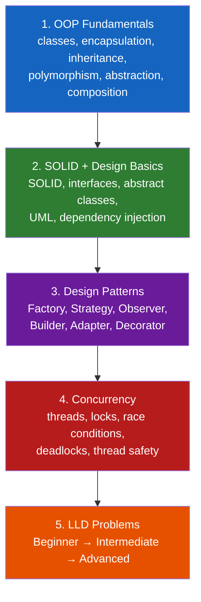
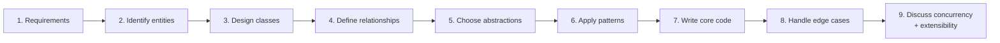

# Low-Level Design

**Prerequisites:** a language with classes/interfaces — examples here are Python, mirroring the rest of the site.

[← System Design Framework](../foundations/framework.md) | [Next: OOP Fundamentals →](oop-fundamentals.md)

---

## Why This Exists

[System design](../foundations/framework.md) asks "how do a million requests survive a network partition." **Low-level design asks a completely different question: given one machine and no scale pressure at all, is your code well-structured?** Can someone add a new payment method to your `PaymentProcessor` without editing five existing classes? Does your `ParkingLot` know too much about how a `Ticket` calculates its own fee?

The two interviews fail candidates for opposite reasons. HLD punishes premature detail — drawing a class diagram before you've picked a database is a red flag. LLD punishes the opposite: staying abstract ("I'd use a factory here") without ever writing the class, the method signature, or the edge case that breaks it. **LLD is graded on code you actually produce**, not boxes you gesture at.

!!! tip "Mental model"
    HLD asks "where does the data live and how does it survive failure." LLD asks "who owns this decision, and what happens when a new requirement arrives — do you edit existing code, or add new code next to it?" That second question is what SOLID (specifically Open/Closed) is actually testing, underneath the acronym.

---

## The Roadmap

Skipping straight to step 5 is the most common failure mode. You cannot productively practice "design a parking lot" if you haven't internalized *why* a `Vehicle` base class with a `ParkingSpot.canFit(vehicle)` method beats a `switch` statement on vehicle type scattered across three classes — that judgment is steps 1–4.

| Stage | Page |
|-------|------|
| 1. OOP Fundamentals | [OOP Fundamentals](oop-fundamentals.md) |
| 2. SOLID + Design Basics | [SOLID Principles](solid-principles.md) |
| 3. Design Patterns | [Design Patterns](design-patterns.md) |
| 4. Concurrency | [Concurrency Basics](concurrency-basics.md), [Concurrency Execution Models](concurrency-execution-models.md) |
| 5. LLD Problems | [LLD Problem Roadmap](../lld-exercises/index.md) |

---

## The 9-Step Approach — Use It On Every Problem

Every LLD interview, regardless of the product, works the same nine steps. Interviewers notice when you skip one — usually steps 7–9, because they're less fun than drawing classes.

| # | Step | What you're actually doing | Common failure |
|---|------|------------------------------|----------------|
| 1 | **Requirements** | Functional scope: what must this system do *today*? Explicitly park out-of-scope features. | Designing for a v3 feature nobody asked for, running out of time on v1 |
| 2 | **Identify entities** | The nouns in the problem statement that need to be modeled: `Vehicle`, `ParkingSpot`, `Ticket`. | Missing an entity (`Payment`) until it's needed mid-interview, then bolting it on badly |
| 3 | **Design classes** | Fields and methods per entity — what does each class *own* and what does it *know*? | God classes that own everything; anemic classes that are just data with no behavior |
| 4 | **Define relationships** | Composition, aggregation, inheritance, association — and which direction the dependency points. | Everything inherits from everything; or nothing is reused and it's all `if/elif` |
| 5 | **Choose abstractions** | Interfaces/abstract base classes at the seams that will vary — payment method, vehicle type, notification channel. | Abstracting things that never vary ("just in case"), adding indirection with no payoff |
| 6 | **Apply patterns** | Name the pattern *because it fits*, not to prove you know it. See [Design Patterns](design-patterns.md). | "I'd use a Factory here" with no factory actually written; pattern-dropping without code |
| 7 | **Write core code** | Actual method bodies for the 2-3 operations that matter — `parkVehicle()`, `calculateFee()` — not just signatures. | Staying at the diagram level for the entire interview; never proving the design compiles logically |
| 8 | **Handle edge cases** | Lot is full. Two threads book the same spot. Vehicle type has no matching spot size. | Only handling the happy path; edge cases surface for the first time in the interviewer's follow-up |
| 9 | **Discuss concurrency + extensibility** | What breaks with two threads? What changes if we add electric-vehicle charging spots next quarter? | Treating the design as finished at step 7; no answer for "what if requirement X changes" |

!!! warning "The step everyone skips"
    Step 9 is where Senior and Staff signal actually shows up. A design that works single-threaded and cannot state what happens when two threads call `parkVehicle()` concurrently on the same spot has not been finished — it has been demoed. See [Concurrency Basics](concurrency-basics.md).

---

## LLD Problem Tiers

Full roadmap, entities, and status: [LLD Problem Roadmap](../lld-exercises/index.md).

| Tier | Problems | Core skill being tested |
|------|----------|--------------------------|
| **Beginner** | Tic Tac Toe, Parking Lot, Library Management, Splitwise | Entity modeling, basic composition, simple state |
| **Intermediate** | Elevator System, ATM, Vending Machine, Chess, Car Rental | State machines, multi-entity coordination, strategy selection |
| **Advanced** | LRU Cache, Rate Limiter, Logger, Notification System, Pub/Sub, Task Scheduler | Data-structure design under constraints, concurrency, extensibility at scale |

---

## Trade-offs

| Choice | Win | Cost |
|--------|-----|------|
| Interface per varying behavior | New payment method = new class, zero edits elsewhere | More files, more indirection to trace through |
| Composition over inheritance | Flexible at runtime, avoids fragile deep hierarchies | Slightly more boilerplate wiring dependencies together |
| Pattern applied because it fits | Code that survives the next requirement change | Applying a pattern nobody asked for reads as over-engineering |
| Thread-safe by design from step 1 | No retrofit needed when concurrency comes up | Extra locking/immutability discipline even for the "toy" version |

---

## Interview Questions

=== "Foundation"
    **Q: What's the difference between low-level design and high-level design interviews?**

    "HLD is about a distributed system surviving scale and failure — where data lives, how it's replicated, what happens during a partition. LLD is about one machine's code being well-structured — can a new requirement be added without editing five existing classes, is state owned by the right object, are the class relationships correct. HLD is graded on trade-off reasoning about infrastructure; LLD is graded on actual class design and code you write during the interview."

=== "Senior"
    **Q: How do you know when to introduce a design pattern versus just writing straightforward code?**

    "I look for a *pressure*, the same discipline as picking an architecture pattern in system design — if the problem statement says 'support multiple payment methods' or 'the notification channel should be configurable,' that's a Strategy pattern seam. If there's no stated variation point, adding an interface and a factory for a single concrete implementation is speculative complexity that makes the code harder to read for no future benefit. I introduce the pattern when the requirement names the variation, not preemptively."

=== "Staff"
    **Q: A candidate's Parking Lot design works perfectly for the happy path but has no answer when you ask 'two cars pull into the same open spot at the same time.' How do you evaluate that, and what would you tell them?**

    "That's the step 9 gap, and it's disqualifying at senior+ regardless of how clean the class design is — a design that silently corrupts state under concurrency isn't finished, it's a demo. I'd walk them through it: the failure is a race between 'check spot is free' and 'mark spot occupied' — two threads can both pass the check before either writes. The fix is making spot allocation an atomic operation, either a lock around the check-and-set or a compare-and-swap on the spot's state, and I'd want them to say that out loud unprompted next time, the same way I'd expect an HLD candidate to volunteer failure modes without being asked."

---

## Key Takeaways

!!! success "Remember"
    1. LLD is graded on code you write, not patterns you name — get to step 7 (core code) in every problem
    2. The 9 steps are the same for every problem; skipping straight to class diagrams skips the requirements that justify them
    3. Apply a pattern because the requirement names a variation point — not to demonstrate you know the pattern's name
    4. Step 9 (concurrency + extensibility) is where senior/staff signal shows up — most candidates stop at step 7
    5. Composition over inheritance is the default; reach for inheritance only for genuine "is-a" relationships that won't need to change at runtime

**Previous:** [System Design Framework](../foundations/framework.md) | **Next:** [OOP Fundamentals](oop-fundamentals.md)
