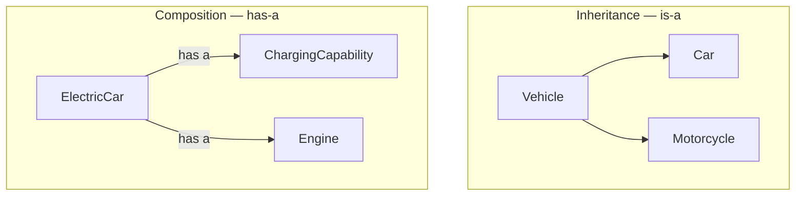

# OOP Fundamentals

**Prerequisites:** none beyond basic class syntax.

[← Low-Level Design](index.md) | [Next: SOLID Principles →](solid-principles.md)

---

## Why This Exists

Every LLD candidate can define "encapsulation" as "hiding data." Almost none can look at a `ParkingSpot` class with a public `is_occupied` field being set directly from three different places and say *that's* the encapsulation violation costing you the interview. The definitions are not the skill. **The skill is recognizing the violation in code you're about to write, before the interviewer has to point it out.**

!!! tip "Mental model"
    Four pillars, one job each: **Encapsulation** protects invariants (an object controls its own state changes). **Abstraction** hides complexity behind a simple contract (you call `.pay()`, you don't care how). **Inheritance** models genuine "is-a" relationships. **Polymorphism** lets calling code stay ignorant of which concrete type it's holding. The pillar that gets misused most in interviews is inheritance — reached for by habit when composition was the honest answer.

---

## Classes & Objects

A class is a blueprint; an object is a specific instance with its own state. The interview-relevant nuance: **decide what state an object owns, and refuse to let other objects mutate it directly.**

```python
class ParkingSpot:
    def __init__(self, spot_id: str, size: str):
        self.spot_id = spot_id
        self.size = size
        self._occupied_by: "Vehicle | None" = None

    def is_free(self) -> bool:
        return self._occupied_by is None

    def occupy(self, vehicle: "Vehicle") -> None:
        if not self.is_free():
            raise ValueError(f"Spot {self.spot_id} already occupied")
        self._occupied_by = vehicle

    def vacate(self) -> None:
        self._occupied_by = None
```

Nothing outside `ParkingSpot` sets `_occupied_by` directly. That single decision is most of what "good OOP" means in an LLD interview — not the vocabulary.

---

## Encapsulation

Bundling data with the methods that are allowed to change it, and refusing direct external mutation of internal state. The interview tell: a leading underscore or a property is not encapsulation by itself — encapsulation is real when **every state transition goes through a method that can enforce an invariant.**

```python
class BankAccount:
    def __init__(self, balance: float = 0):
        self._balance = balance          # not directly settable from outside

    @property
    def balance(self) -> float:
        return self._balance

    def withdraw(self, amount: float) -> None:
        if amount > self._balance:
            raise ValueError("Insufficient funds")   # invariant enforced here
        self._balance -= amount
```

!!! warning "The violation that shows up in every LLD interview"
    A `Ticket` class with a public `amount_due` field that three different classes (`ParkingLot`, `PaymentProcessor`, `ExitGate`) all mutate directly. Nobody can answer "who is allowed to change this and under what condition" — that's the actual bug encapsulation prevents, not just "the field has an underscore."

---

## Abstraction

Exposing *what* an object does, hiding *how*. The caller depends on a small, stable interface; the implementation can change freely behind it.

```python
from abc import ABC, abstractmethod

class PaymentMethod(ABC):
    @abstractmethod
    def pay(self, amount: float) -> bool:
        """Attempt payment; return True on success."""

class CreditCardPayment(PaymentMethod):
    def pay(self, amount: float) -> bool:
        # talk to card network, handle decline, etc. — caller doesn't know or care
        return True

class UpiPayment(PaymentMethod):
    def pay(self, amount: float) -> bool:
        return True
```

`ExitGate` calls `payment_method.pay(amount)` — it never branches on `if isinstance(payment_method, CreditCardPayment)`. That branch, if you write it, is the signal to an interviewer that abstraction hasn't actually happened yet; it's just been renamed.

---

## Inheritance

An **is-a** relationship: `Car` is-a `Vehicle`. Use it when the subtype genuinely is a more specific version of the supertype and should be substitutable wherever the supertype is expected (see [SOLID's Liskov Substitution Principle](solid-principles.md)).

```python
class Vehicle(ABC):
    def __init__(self, license_plate: str):
        self.license_plate = license_plate

    @abstractmethod
    def spot_size_required(self) -> str: ...

class Car(Vehicle):
    def spot_size_required(self) -> str:
        return "medium"

class Motorcycle(Vehicle):
    def spot_size_required(self) -> str:
        return "small"
```

!!! warning "Where inheritance goes wrong in interviews"
    Modeling `ElectricCar` as inheriting from both `Car` and `ChargeableVehicle` to "reuse" charging logic — most languages don't support clean multiple inheritance, and even where they do, `ElectricCar` isn't more accurately described as "the charging behavior" than as "a car that has a charging capability." That's a **has-a** relationship — composition, not inheritance. See below.

---

## Polymorphism

The same call — `vehicle.spot_size_required()` — resolves to different behavior depending on the concrete type, and the calling code never needs a type check to get there.

```python
def find_spot(vehicle: Vehicle, spots: list[ParkingSpot]) -> ParkingSpot | None:
    required = vehicle.spot_size_required()   # polymorphic call
    for spot in spots:
        if spot.size == required and spot.is_free():
            return spot
    return None
```

Add a `Truck` subclass tomorrow and `find_spot` does not change — this is the payoff, and it's the same payoff Open/Closed (SOLID) is built on.

---

## Composition vs. Inheritance



| | Inheritance | Composition |
|---|---|---|
| Relationship | is-a | has-a |
| Coupling | Tight — subclass depends on superclass internals | Loose — depends only on the composed object's interface |
| Reuse across unrelated hierarchies | Hard (a `FlyingCar` can't cleanly be both `Vehicle` and `Aircraft`) | Easy — attach the same `ChargingCapability` to a car, a scooter, a drone |
| Runtime flexibility | Fixed at instantiation | Can swap the composed behavior at runtime |
| Classic failure | Deep, fragile hierarchies; a change to the base class ripples everywhere | More boilerplate wiring dependencies through constructors |

**The interview default: favor composition.** Reach for inheritance only when the relationship is a genuine, stable is-a that will not need to vary at runtime. "Car has an Engine" survives requirements changes; "Car is-an Engine" is nonsensical, and the equivalent nonsense shows up constantly in real designs as inheritance chosen for code reuse rather than for a true taxonomy.

```python
class ChargingCapability:
    def charge(self, kwh: float) -> None: ...

class ElectricCar(Vehicle):
    def __init__(self, license_plate: str, charger: ChargingCapability):
        super().__init__(license_plate)
        self.charger = charger          # composition: has-a

    def spot_size_required(self) -> str:
        return "medium"
```

---

## Trade-offs

| Choice | Win | Cost |
|--------|-----|------|
| Deep inheritance hierarchy | Shared code lives in one place | Fragile — a base class change can silently break every subclass |
| Composition + interfaces | Flexible, swappable at runtime, no fragile base class | More classes, more constructor wiring |
| Public mutable fields | Fast to write | No invariant enforcement; any caller can corrupt state |
| Rich abstraction layer everywhere | Consistent seams for future variation | Over-abstraction when nothing actually varies — interview red flag |

---

## Interview Questions

=== "Foundation"
    **Q: What's the difference between abstraction and encapsulation?**

    "They're often taught together but answer different questions. Encapsulation is about protecting an object's internal state — bundling data with the methods that are allowed to change it, so invariants can't be violated from outside. Abstraction is about hiding implementation complexity behind a simple interface — the caller knows `pay()` exists and returns success/failure, not how the payment gateway integration works underneath. A class can have solid abstraction (clean interface) and still leak encapsulation (public fields anyone can mutate) — they're independent."

=== "Senior"
    **Q: You're designing a `Vehicle` hierarchy for a parking lot. When do you reach for inheritance versus composition?**

    "Inheritance when the relationship is genuinely is-a and stable — `Car` is-a `Vehicle`, that's not going to become false. Composition when I'm tempted to inherit purely for code reuse, or when the relationship is really has-a — an `ElectricCar` has a charging capability, it isn't a specialization of 'charging.' The test I actually apply: would this subtype need to be substitutable everywhere the supertype is used, unconditionally? If yes, inheritance is honest. If I find myself writing `if isinstance(vehicle, ElectricCar): vehicle.charge()` in calling code, that's a sign the capability should have been composed in and exposed through a shared interface instead."

=== "Staff"
    **Q: A codebase has a five-level-deep inheritance hierarchy (`Vehicle → MotorVehicle → Car → SedanCar → LuxurySedanCar`) and every new vehicle type requires touching three of those base classes. How do you evaluate and fix this?**

    "This is the classic fragile-base-class failure mode — the hierarchy was probably built for code reuse rather than genuine taxonomy, and now every change ripples upward and sideways in ways that are hard to reason about or test in isolation. I'd look for the actual variation points — is it size, is it fuel type, is it a luxury feature bundle — and pull each one out into its own composed capability (`SizeProfile`, `FuelType`, `FeatureBundle`) attached to a much flatter `Vehicle` class. The migration itself needs to be incremental: introduce the composed capabilities alongside the old hierarchy, migrate one leaf class at a time, and only collapse the hierarchy once nothing depends on the deep chain — the same discipline as any refactor under load, not a big-bang rewrite."

---

## Key Takeaways

!!! success "Remember"
    1. Encapsulation is real when every state change goes through a method that enforces an invariant — not just when a field has an underscore
    2. Abstraction fails the moment calling code needs an `isinstance` check to decide what to do
    3. Inheritance models a stable is-a relationship; reaching for it for code reuse alone produces fragile hierarchies
    4. Composition (has-a) is the interview default — more flexible, more testable, less coupled
    5. Polymorphism's payoff is that adding a new subtype doesn't require editing the code that already works — this is Open/Closed in practice, before you've named the principle

**Previous:** [Low-Level Design](index.md) | **Next:** [SOLID Principles](solid-principles.md)
