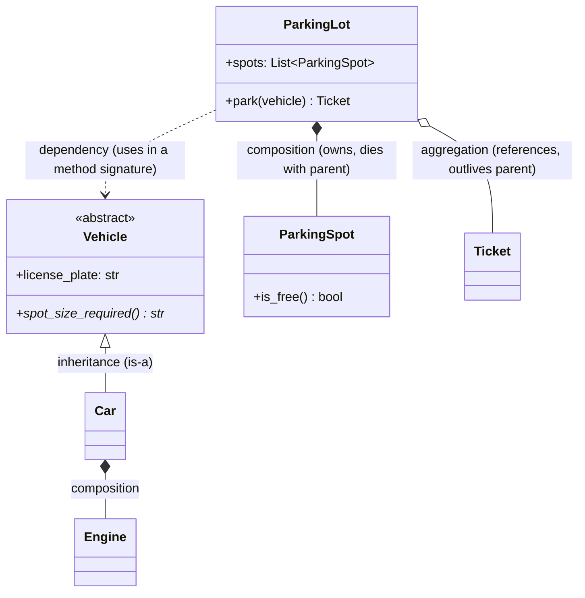

# SOLID Principles

**Prerequisites:** [OOP Fundamentals](oop-fundamentals.md)

[← OOP Fundamentals](oop-fundamentals.md) | [Next: Design Patterns →](design-patterns.md)

---

## Why This Exists

SOLID is five letters candidates can recite and almost never apply under pressure. The reason: each principle sounds like a rule about code style, when it's actually a rule about **where the pain shows up when a requirement changes.** Learn them as "what breaks and why," not as definitions, and you'll recognize a violation while you're writing the code instead of after the interviewer asks "what if we add a new payment type?"

!!! tip "Mental model"
    Four of the five letters are really one idea wearing different clothes: **don't make a class know about, or depend on, more than it has to.** SRP limits what a class does. ISP limits what it's forced to implement. DIP limits what it depends on directly. OCP is the payoff: if the other three are done, adding behavior means adding a class, not editing one.

---

## S — Single Responsibility Principle

A class should have one reason to change. Not "one method" — **one axis of change.**

```python
# Violation: Ticket owns pricing AND printing AND persistence
class Ticket:
    def calculate_fee(self) -> float: ...
    def print_receipt(self) -> None: ...
    def save_to_database(self) -> None: ...
```

A pricing-model change, a receipt-format change, and a storage-engine swap are three unrelated reasons this one class gets edited — and three unrelated teams stepping on the same file.

```python
class Ticket:
    def calculate_fee(self) -> float: ...

class ReceiptPrinter:
    def print(self, ticket: Ticket) -> None: ...

class TicketRepository:
    def save(self, ticket: Ticket) -> None: ...
```

!!! warning "SRP is not 'small classes'"
    Splitting a class into ten tiny pieces that all change together for the same reason is not SRP — it's fragmentation with extra steps. SRP is about reasons to change, not line count.

---

## O — Open/Closed Principle

Open for extension, closed for modification: adding new behavior should mean **adding a class**, not editing an existing, already-tested one.

```python
# Violation: every new payment type means editing this method
def process_payment(method: str, amount: float) -> bool:
    if method == "credit_card":
        return charge_credit_card(amount)
    elif method == "upi":
        return charge_upi(amount)
    elif method == "wallet":       # <- added today, and this whole function was re-tested
        return charge_wallet(amount)
```

```python
class PaymentMethod(ABC):
    @abstractmethod
    def pay(self, amount: float) -> bool: ...

class WalletPayment(PaymentMethod):     # new file, zero edits elsewhere
    def pay(self, amount: float) -> bool:
        return charge_wallet(amount)

def process_payment(method: PaymentMethod, amount: float) -> bool:
    return method.pay(amount)           # never changes again
```

This is the payoff of [polymorphism](oop-fundamentals.md) — OCP is what you get when abstraction is done right at the seam that actually varies.

---

## L — Liskov Substitution Principle

Any subtype must be usable anywhere the supertype is expected, without the caller needing to know which one it got, and without breaking the caller's expectations.

```python
# Violation: Square silently breaks Rectangle's contract
class Rectangle:
    def set_width(self, w): self.width = w
    def set_height(self, h): self.height = h
    def area(self): return self.width * self.height

class Square(Rectangle):
    def set_width(self, w):
        self.width = self.height = w        # side-effects the caller didn't ask for
    def set_height(self, h):
        self.width = self.height = h

def resize(rect: Rectangle):
    rect.set_width(5)
    rect.set_height(4)
    assert rect.area() == 20   # passes for Rectangle, FAILS for Square (area == 16)
```

`Square` **is-a** rectangle geometrically, but it is not substitutable for `Rectangle` in code that assumes width and height vary independently — the inheritance is a lie at the behavioral level, even though it looks correct at the type level.

!!! warning "Where this bites in LLD interviews"
    A `Bicycle` subclassing `Vehicle` where `Vehicle.spot_size_required()` assumes every vehicle needs a full spot — if `Bicycle` starts throwing `NotImplementedError` for some `Vehicle` method because "bicycles don't really do that," LSP is already violated. The fix is usually that the base class's contract was too broad — split the interface (see ISP) rather than forcing every subtype through it.

---

## I — Interface Segregation Principle

No client should be forced to depend on methods it doesn't use. A fat interface with ten methods forces every implementer to stub out the seven it doesn't need.

```python
# Violation: every worker must implement every method, even irrelevant ones
class Worker(ABC):
    @abstractmethod
    def work(self): ...
    @abstractmethod
    def eat(self): ...
    @abstractmethod
    def sleep(self): ...

class RobotWorker(Worker):
    def work(self): ...
    def eat(self): raise NotImplementedError   # a robot doesn't eat — forced stub
    def sleep(self): raise NotImplementedError
```

```python
class Workable(ABC):
    @abstractmethod
    def work(self): ...

class Eater(ABC):
    @abstractmethod
    def eat(self): ...

class RobotWorker(Workable):        # only implements what it actually does
    def work(self): ...
```

Any class implementing a method with `raise NotImplementedError` or a no-op stub is telling you the interface it's implementing was too fat.

---

## D — Dependency Inversion Principle

High-level modules should depend on abstractions, not on concrete low-level modules — and the concrete implementation should be injected in, not constructed inside.

```python
# Violation: ParkingLot is hard-wired to one specific notifier
class ParkingLot:
    def __init__(self):
        self.notifier = EmailNotifier()   # concrete dependency, buried inside

    def notify_full(self):
        self.notifier.send("Lot is full")
```

```python
class Notifier(ABC):
    @abstractmethod
    def send(self, message: str) -> None: ...

class ParkingLot:
    def __init__(self, notifier: Notifier):     # dependency injected, not constructed
        self.notifier = notifier

    def notify_full(self):
        self.notifier.send("Lot is full")

# test code can inject a FakeNotifier; production injects SmsNotifier — ParkingLot never changes
```

This is **dependency injection** — the mechanism, not a separate principle. DIP says depend on abstractions; DI is how you actually wire the concrete instance in, usually via the constructor. It's also why the class becomes trivially testable: swap in a test double without touching `ParkingLot` at all.

---

## Interfaces vs. Abstract Classes

| | Interface (ABC with only abstract methods) | Abstract class (some concrete methods) |
|---|---|---|
| Purpose | A pure contract — "can do X" | A partial implementation shared by related subtypes |
| Shared code | None | Yes — common logic lives once |
| Relationship implied | Capability (`Payable`, `Notifiable`) | Taxonomy (`Vehicle`, `Shape`) |
| Multiple per class | Typically yes — a class can implement several | Typically one — most languages don't support multiple concrete inheritance cleanly |

Rule of thumb: if you're tempted to write `class Foo(Bar, Baz)` with two abstract classes, at least one of them should probably be an interface instead.

---

## Class Relationships (UML Basics)



| Relationship | Symbol | Meaning | Example |
|---|---|---|---|
| **Inheritance** | `<\|--` | is-a | `Car` is-a `Vehicle` |
| **Composition** | `*--` | owns, and the owned object's lifecycle is bound to the owner | `ParkingLot` owns `ParkingSpot` — spots don't outlive the lot |
| **Aggregation** | `o--` | has-a, but the referenced object has independent lifecycle | `ParkingLot` references issued `Ticket`s, which outlive being "in" the lot |
| **Association** | `--` | a general "knows about" relationship | `Driver` knows their `Vehicle` |
| **Dependency** | `..>` | uses temporarily (e.g. a parameter), no stored reference | `ParkingLot.park(vehicle: Vehicle)` |

Getting composition vs. aggregation right matters for one concrete reason: it answers "if I delete the parent, does the child still exist?" — for a `ParkingLot` and its `ParkingSpot`s, no. For a `ParkingLot` and `Ticket`s it issued, yes (the ticket is handed to the customer and outlives the parking session).

---

## Trade-offs

| Choice | Win | Cost |
|--------|-----|------|
| Strict SRP everywhere | Easy to test and reason about each piece | More classes to navigate; over-splitting fragments cohesive logic |
| DI via constructor | Testable, swappable, no hidden dependencies | More constructor parameters to wire up as the object graph grows |
| Interface per capability (ISP) | No forced stub implementations | More types to define upfront, before you're sure of the shape |
| Deep OCP compliance (never edit, always extend) | Old code never re-breaks | Can lead to excessive abstraction for behavior that will only ever have one implementation |

---

## Interview Questions

=== "Foundation"
    **Q: What does the Open/Closed Principle actually mean, in your own words?**

    "A class should be open for extension but closed for modification — when a new requirement arrives, like a new payment method, I should be able to add a new class implementing an existing interface rather than editing the `if/elif` chain inside an already-tested function. The payoff is that adding behavior can't regress behavior that already worked, because nothing existing gets touched."

=== "Senior"
    **Q: Give an example where following the Liskov Substitution Principle changes how you'd model an inheritance hierarchy.**

    "The classic one is Square inheriting from Rectangle — geometrically a square is a rectangle, but if `Rectangle` exposes independent `set_width`/`set_height`, `Square` can't honor that contract without side-effecting both, which breaks any code that assumed setting width doesn't touch height. I'd either not model Square as a Rectangle subclass at all — make both implement a `Shape` interface with just `area()` — or make `Rectangle` immutable so 'set width without touching height' was never actually promised in the first place. LSP violations are usually a sign the base class's contract was too specific to hold for every subtype, not that the subtype is doing something wrong."

=== "Staff"
    **Q: Your team's `NotificationService` interface has grown to 12 methods over two years — email, SMS, push, plus admin methods like `configure_retry_policy()`. Every new channel forces every implementer to stub out methods they don't need. How do you fix this, and how do you prevent it recurring?**

    "This is ISP decay — the interface grew by accretion, one method added per feature request, without anyone asking whether every implementer actually needs every method. I'd split it: a `Notifier` interface with just `send()`, a separate `ConfigurableRetry` interface for the channels that support it, so implementers only take on the capabilities they genuinely have. To prevent recurrence, I'd add a review norm — any PR adding a method to a shared interface needs to state which existing implementers would have to stub it, and if the answer is 'more than zero,' that's a signal that a new, narrower interface should be introduced instead of extending the existing one. That's a cheap check that catches the problem at method #4, not method #12."

---

## Key Takeaways

!!! success "Remember"
    1. SRP is about reasons to change, not class size — group by what changes together
    2. OCP's payoff (add a class, don't edit one) only exists if the abstraction seam was chosen at the point that actually varies
    3. LSP violations mean the base class's contract was too specific for every subtype to honor — the fix is usually narrowing the base contract or the hierarchy, not "fixing" the subtype
    4. ISP: a stub implementation (`raise NotImplementedError`) is the interface telling you it's too fat
    5. DIP + dependency injection is what makes a class testable — depend on the interface, inject the concrete type from outside
    6. Composition vs. aggregation is decided by one question: does the child outlive the parent?

**Previous:** [OOP Fundamentals](oop-fundamentals.md) | **Next:** [Design Patterns](design-patterns.md)
