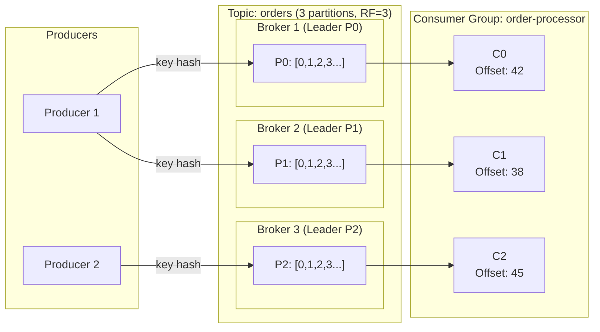

# Kafka Deep Dive

**Prerequisites:** [Message Queue Patterns](patterns.md), Basic distributed systems

---

## Why This Exists

Start with a simple problem: **1 producer → 1 topic → 1 consumer, 10 MB/s**.

Works perfectly. Now: what happens at **500 MB/s**?

A single consumer can't keep up. You need to parallelize consumption. But you can't just add random consumers — you'd process the same messages multiple times or miss messages.

This is why Kafka has **partitions** and **consumer groups**.

---

## Mental Model

```
Topic "orders" with 3 partitions:

Producer ──┬──> Partition 0: [msg1, msg4, msg7, msg10...]
           ├──> Partition 1: [msg2, msg5, msg8, msg11...]
           └──> Partition 2: [msg3, msg6, msg9, msg12...]

Consumer Group "order-processor":
  Consumer C0 ──> Partition 0
  Consumer C1 ──> Partition 1
  Consumer C2 ──> Partition 2
```

**Key rules:**
1. Each partition is consumed by **exactly one consumer** within a group at a time
2. Messages within a partition are strictly ordered
3. Messages across partitions have no ordering guarantee
4. More consumers than partitions → some consumers are idle

---

## Architecture



---

## Interactive Kafka Simulation

<div class="sim-container">
  <div class="sim-title">⚡ Kafka Partition & Consumer Group Simulator</div>

  <div class="sim-controls">
    <button class="sim-btn success" onclick="window._kafka && window._kafka.start()">▶ Start Producer</button>
    <button class="sim-btn" onclick="window._kafka && window._kafka.pause()">Pause</button>
    <button class="sim-btn" onclick="window._kafka && window._kafka.reset()">Reset</button>
    <button class="sim-btn" onclick="window._kafka && window._kafka.addPartition()">+ Partition</button>
    <button class="sim-btn" onclick="window._kafka && window._kafka.addConsumer()">+ Consumer</button>
    <button class="sim-btn danger" onclick="window._kafka && window._kafka.killConsumer(0)">Kill C0</button>
    <button class="sim-btn danger" onclick="window._kafka && window._kafka.killConsumer(1)">Kill C1</button>
    <button class="sim-btn success" onclick="window._kafka && window._kafka.reviveConsumer(0)">Revive C0</button>
    <button class="sim-btn danger" onclick="window._kafka && window._kafka.setHotKey(true)">Hot key</button>
  </div>

  <canvas id="kafka-canvas" class="sim-canvas" style="width:100%;height:220px;"></canvas>

  <div class="sim-stats">
    <div class="sim-stat">
      <div class="sim-stat-label">Total Lag</div>
      <div class="sim-stat-value" id="kafka-total-lag">0</div>
    </div>
    <div class="sim-stat">
      <div class="sim-stat-label">Throughput (msg/s)</div>
      <div class="sim-stat-value" id="kafka-throughput">0</div>
    </div>
    <div class="sim-stat">
      <div class="sim-stat-label">Partitions</div>
      <div class="sim-stat-value" id="kafka-partitions">3</div>
    </div>
    <div class="sim-stat">
      <div class="sim-stat-label">Active Consumers</div>
      <div class="sim-stat-value" id="kafka-consumers">3/3</div>
    </div>
  </div>

  <div class="sim-log" id="kafka-log"></div>
</div>

**Try:**
1. Start producer → observe lag stays near 0 when consumers keep up
2. Kill a consumer → watch lag build up, observe rebalancing
3. Add a partition → can increase throughput but note the rebalancing cost

---

## How It Works Internally

### Offsets

Every message in a partition has a monotonically increasing **offset**. Consumers track their position by committing the offset of the last processed message.

```
Partition 0: offset 0, 1, 2, 3, 4, 5, 6...
                                     ↑
                              Consumer committed here
                              → on restart, resume from 5
```

**Auto-commit pitfall:** Kafka can auto-commit the offset before the message is actually processed. If the consumer crashes between auto-commit and processing → **message loss**.

**Manual commit after processing** → at-least-once semantics (safe: possible duplicates, no losses).

### Rebalancing

When a consumer joins or leaves a group, Kafka triggers a **rebalance** — all consumers stop consuming, the group coordinator reassigns partitions, then consumers resume. During this time: **no consumption happens** (stop-the-world for the group).

**Cooperative Rebalancing (Kafka 2.4+):** Only affected partitions are reassigned — consumers keep consuming unaffected partitions. Significantly reduces pause duration.

### Consumer Lag

**Consumer lag** = (Latest offset in partition) − (Committed offset of consumer)

```
Partition 0: latest offset = 1,000,000
Consumer C0 committed offset = 999,500
Lag = 500 messages
```

High lag indicates:
- Consumer is too slow (processing bottleneck)
- Consumer is down
- Traffic spike outpacing consumption rate

### ISR (In-Sync Replicas)

Each partition has one **leader** and N-1 **followers** (replicas). The **ISR** is the set of replicas fully caught up with the leader.

- `acks=all` (strongest): producer waits for all ISR replicas to acknowledge
- `acks=1`: only leader acknowledges (risk: leader dies before replication = data loss)
- `acks=0`: fire and forget (highest throughput, data loss possible)

---

## Ordering Guarantees

| Scope | Guarantee |
|-------|-----------|
| Within a partition | Strict ordering (messages are appended, never reordered) |
| Across partitions | No ordering guarantee |
| Cross-topic | No ordering guarantee |

**How to ensure related messages are ordered:** Use the same **partition key**.

```python
# All events for user 123 go to the same partition
producer.send(
    topic="user-events",
    key=b"user:123",       # same key → same partition
    value=event_payload
)
```

**Pitfall:** If user 123 is extremely active, their partition becomes a **hot partition** — one consumer processes 10× more messages than others.

---

## Failure Modes

### Hot Partition
- **Cause:** Highly skewed key distribution (one key generates most messages)
- **Symptoms:** One partition's lag grows while others are fine; one consumer at 100% CPU
- **Detection:** Per-partition message rate; consumer lag by partition
- **Fix:** Add random suffix to hot key (`user:123:0`, `user:123:1`), or use null key (round-robin)

### Consumer Rebalance Loop
- **Cause:** Consumer takes too long to process → exceeds `max.poll.interval.ms` → Kafka assumes it's dead → rebalances → same consumer rejoins → repeat
- **Symptoms:** Frequent rebalances in logs, lag oscillates up and down
- **Detection:** Group coordinator logs, rebalance frequency metric
- **Fix:** Increase `max.poll.interval.ms` OR reduce `max.poll.records` (process fewer messages per poll) OR optimize consumer processing

### Poison Message
- **Cause:** A malformed message causes consumer to crash on every attempt
- **Symptoms:** Consumer restarts repeatedly, lag on specific partition never decreases
- **Detection:** Consumer crash logs with same offset repeatedly
- **Fix:** Dead Letter Queue (DLQ) — after N retries, move to DLQ topic; alerting on DLQ messages

### Unclean Leader Election
- **Cause:** All ISR replicas are down; Kafka elects an out-of-sync replica as leader (`unclean.leader.election.enable=true`)
- **Impact:** Data loss — messages produced after this replica's last sync are gone
- **Fix:** Set `unclean.leader.election.enable=false` for durability-critical topics

---

## Production Debugging

```
Symptom: Consumer lag growing steadily

Diagnostic steps:
1. Check consumer CPU/memory (is processing bottlenecked?)
   → JVM GC pauses? Processing logic slow?
2. Check if consumer is actually consuming
   → Consumer group offset progress over time
   → kafka-consumer-groups.sh --describe
3. Check for rebalances
   → group coordinator logs, rebalance metric
4. Check partition count vs consumer count
   → More partitions than consumers = parallelism bottleneck
5. Check producer throughput increase
   → Topic ingestion rate vs consumer throughput rate
6. Check for poison messages
   → Consumer crash logs, specific partition stuck at same offset

Key metrics:
- consumer_lag_messages (per partition)
- consumer_group_rebalance_count
- broker_network_io, broker_disk_io
- request_handler_avg_idle_percent (< 30% = broker overloaded)
- under_replicated_partitions (> 0 = replication issue)
```

---

## Scaling Limits

- Partition count is permanent — can increase, cannot decrease (without data migration)
- Each partition is a file on disk — too many partitions → too many file handles, slower leader election
- Rule of thumb: < 10,000 partitions per broker
- Consumer lag recovery: scale out consumers (up to partition count)
- Write throughput: scale out by adding partitions and brokers
- Retention: controlled by `retention.bytes` and `retention.ms`

---

## Trade-offs

| Decision | Option A | Option B | Consideration |
|----------|----------|----------|---------------|
| `acks` setting | `all` (durable) | `1` or `0` (fast) | Durability vs throughput |
| Partition count | More (parallelism) | Fewer (simpler) | Throughput vs operational complexity |
| Consumer commit | Manual (safe) | Auto (simple) | At-least-once vs potential duplicates |
| Retention | Long (replay) | Short (cost) | Debuggability vs cost |
| Compaction | Yes (latest per key) | No (time-based) | Lookup use cases vs streaming |

---

## Interview Questions

=== "Basic"
    **Q: How does Kafka ensure a message is processed exactly once?**

    "True exactly-once is complex. Kafka supports it via idempotent producers (deduplication on broker side) + transactional APIs (atomic produce + commit). For most use cases, at-least-once with idempotent consumers is simpler and sufficient — make the processing operation idempotent so duplicates are harmless. For example, an upsert by message ID rather than a blind insert."

=== "Senior"
    **Q: How do you handle a hot partition in Kafka?**

    "First, identify the hot key — look at per-partition message rates to see which partition is receiving disproportionate traffic. If it's a specific key (e.g., one large tenant), options are: (1) add a random suffix to the key to distribute across multiple partitions at the cost of losing ordering; (2) create a separate topic for that tenant; (3) handle the hot key at the application level — deduplicate or aggregate before producing. I'd also monitor consumer CPU for the hot partition's consumer and potentially create a separate consumer group for it with more dedicated resources."

=== "Staff"
    **Q: We're migrating from 3 to 30 partitions for a critical topic. What are the risks?**

    "Key risk: increasing partition count triggers a consumer group rebalance — all consumption stops during this window. For a critical topic this could mean seconds to minutes of lag buildup depending on data volume. Plan: (1) schedule during low-traffic window; (2) ensure downstream consumers can handle the backlog after rebalance; (3) understand that ordering is disrupted — existing messages for a key may now be on a different partition than new messages. If you use key-based ordering, existing consumers processing an old partition will interleave with new producers writing to the new partition for the same key. This is an architectural risk for order-sensitive workflows. I'd also validate that all consumer configurations (max.poll.records, session.timeout) are tuned for the new throughput per consumer."

---

## Key Takeaways

!!! success "Remember"
    1. Partitions are the unit of parallelism — more partitions = more consumers can run in parallel
    2. Each partition is consumed by exactly one consumer per group at a time
    3. Ordering is guaranteed only within a partition — use partition keys for related messages
    4. Consumer lag = production rate - consumption rate; high lag = consumer falling behind
    5. Rebalances stop consumption — minimize by using cooperative rebalancing, tuning `max.poll.interval.ms`
    6. Hot partitions require application-level fixes, not just Kafka configuration

