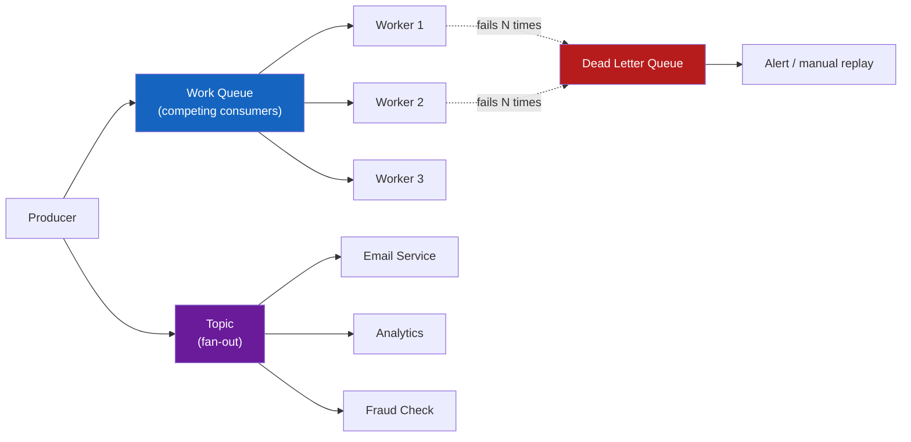
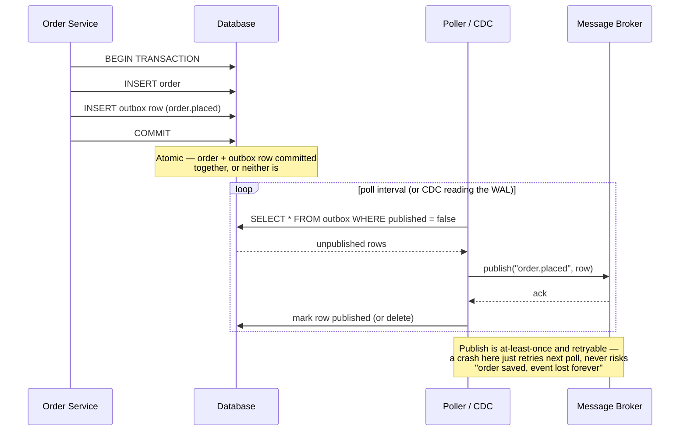

# Message Queue Patterns

**Prerequisites:** Basic distributed systems, [Requirements & Capacity Estimation](../foundations/requirements-estimation.md)

[← Messaging](index.md) | [Next: Kafka Deep Dive →](kafka.md)

---

## Why This Exists

Start with the simplest possible async system: **one producer writes a message, one consumer reads it, does the work.**

That works until any of these show up:

```
2 consumers both want the SAME work done exactly once  → who processes it?
100 downstream services all need a COPY of every event  → one queue isn't enough
a message keeps crashing the consumer                    → it blocks everything behind it
network blips and a message gets redelivered              → did we double-charge the customer?
"write to DB" and "publish event" aren't atomic            → DB commits, publish fails, silence
```

Kafka (or SQS, or RabbitMQ) doesn't solve these for you — the *pattern* you build on top does. This page is the vocabulary and the patterns that apply whether you're on Kafka, SQS, RabbitMQ, or Google Pub/Sub. See [Kafka Deep Dive](kafka.md) for how one specific broker implements partitions and consumer groups underneath these patterns.

!!! tip "Mental Model"
    Every messaging problem is answered by three questions: **who gets the message** (one consumer or many?), **what happens when a consumer fails** (retry, or dead-letter?), and **what does "delivered" promise** (at-most-once, at-least-once, or effectively-exactly-once?). Get the answers explicit before you draw a queue.

---

## Naive System → What Breaks

"Just put it on a queue" is not a design.

| Naive assumption | What breaks |
|---|---|
| One queue, multiple services listening | Each message is consumed by only ONE of them (point-to-point) — the other services never see it |
| Consumer crashes mid-processing | Message is lost (at-most-once) — or reprocessed and double-charges a customer (naive at-least-once) |
| A malformed message arrives | Consumer crashes on it, retries forever, blocks every message behind it |
| Order matters ("cancel" must come after "create") | At scale, parallel consumers process out of order — silent bug |
| Write order to DB, then publish event | Process crashes between the two — DB has the order, no one downstream ever hears about it |
| "We retry 3 times so it's reliable" | Retries without idempotency turn a blip into a double-send |

---

## Mental Model

```
Point-to-point (queue):              Pub/sub (topic):

Producer ──> [Queue] ──> Consumer A  Producer ──> [Topic] ──┬──> Subscriber A (all events)
                    (OR Consumer B,                          ├──> Subscriber B (all events)
                     not both — one                          └──> Subscriber C (all events)
                     message, one winner)
```

**Key distinction:** a queue delivers each message to exactly one consumer among a competing group. A topic delivers each message to every subscriber. Kafka blurs this: a topic partition delivered to one consumer *per group*, but many groups can each get their own full copy — pub/sub and point-to-point at the same time, depending on how you draw the consumer groups.

---

## Architecture



---

## How It Works

### Point-to-point (work queue) — competing consumers

Multiple workers pull from the same queue; each message goes to exactly one worker. This is how you **scale out processing** of a single stream of work — order-fulfillment jobs, image-resize jobs, email sends.

```
Queue: [job1, job2, job3, job4, job5, job6]

Worker A: job1, job3, job5   (whichever is free grabs next)
Worker B: job2, job4, job6
```

Add workers to increase throughput. This is horizontal scaling for consumption, and it's the pattern behind Kafka consumer groups (one partition, one consumer *within a group*), SQS (visibility timeout hides a message from other consumers while one is working it), and RabbitMQ work queues (`prefetch` limits how many unacked messages one consumer holds).

### Pub/sub (topic) — fan-out to many subscribers

Every subscriber gets its own copy of every message. Used when **multiple independent systems** need to react to the same event without producer coupling.

```
event "order.placed" published once →
  email service sends confirmation
  analytics service records the sale
  fraud service scores the transaction
  inventory service decrements stock

Producer knows about NONE of these consumers. New consumer can subscribe
tomorrow with zero producer changes.
```

This is the core value: **decoupling**. The order service doesn't need a growing if/else of "and also call fraud, and also call analytics" — new consumers subscribe independently.

### Fan-out / fan-in

**Fan-out**: one event triggers many parallel units of work (above — one order event, four subscribers, or one order fanned out into N inventory-reservation messages, one per warehouse to check).

**Fan-in**: many independent producers converge onto one queue/topic for a single consumer (or consumer group) to process together — e.g., every microservice emits its logs onto one `logs` topic for a single indexing pipeline to consume. Fan-in is also the shape of an aggregation step: wait for all N fanned-out replies before proceeding (a saga-like join — see [Sagas](../architecture-patterns/sagas.md)).

### Dead-letter queues and poison messages

A **poison message** is one that can never be processed successfully — malformed JSON, a foreign key that will never exist, a bug in the handler for this specific shape of payload. Left alone, it blocks every message behind it (in an ordered queue/partition) or burns retry budget forever (in an unordered one).

```
attempt 1: consumer crashes on message → redelivered
attempt 2: consumer crashes again      → redelivered
attempt 3: consumer crashes again      → redelivered
after N attempts: move to Dead Letter Queue (DLQ), ack the original
                  → alert on-call
                  → original queue keeps flowing
                  → someone inspects DLQ, fixes data or code, replays
```

Without a DLQ, a poison message either (a) blocks an ordered partition forever, or (b) gets endlessly redelivered, burning CPU and possibly re-triggering side effects each attempt if the handler isn't idempotent.

!!! note "DLQ vs. backpressure — different problem, easy to conflate"
    A DLQ quarantines a message that fails *regardless of load* — a malformed payload, a bug in the handler. It's not a volume-control mechanism. If a message is only failing because a downstream call is timing out under load, routing it to a DLQ hides a [backpressure](../reliability/backpressure.md) problem behind what looks like a poison-message problem — it'll "fail" every time until the load subsides, and a human debugging the DLQ will find nothing wrong with the message itself.

### Ordering guarantees — and when you can't have them

Strict global ordering and horizontal scale are in tension. A single ordered log can only be consumed by one worker without breaking order — that worker is your throughput ceiling.

| Ordering scope | How to get it | Cost |
|---|---|---|
| Global order across all messages | One partition, one consumer | Throughput capped at one worker |
| Order per entity (e.g. per user, per order ID) | Partition by key (same key → same partition) | Only that entity's events are ordered; cross-entity order is undefined |
| No ordering | Round-robin / random partitioning | Best throughput, best load balance |

If you need per-order ordering ("create" before "cancel"), partition by `order_id` and accept that order A's events and order B's events may interleave arbitrarily relative to each other. That's usually fine — you rarely need cross-entity ordering, you need per-entity ordering.

### Delivery semantics

| Semantic | What it means | How you get it | Risk |
|---|---|---|---|
| At-most-once | Message delivered 0 or 1 times | Fire-and-forget, no retry, ack before processing | Silent message loss on any failure |
| At-least-once | Message delivered 1 or more times | Retry until ack; ack only after successful processing | Duplicates on retry after a crash between processing and ack |
| Effectively-exactly-once | Duplicates are delivered but have no visible effect | At-least-once + **idempotent consumer** | None, if idempotency is implemented correctly — but it's on you, not the broker |

True broker-level exactly-once delivery across a network is not achievable in general (two-generals-problem territory) — what brokers like Kafka offer as "exactly-once semantics" is really atomic-produce + idempotent-producer + transactional consume-produce *within Kafka itself*, not an end-to-end guarantee once your side effect (charging a card, sending an email) leaves the broker.

**Idempotent consumers — the practical answer:**

```python
def handle_payment_event(event):
    # event.id is the same on every redelivery of this logical event
    if db.exists("processed_events", event.id):
        return  # already handled, no-op

    with db.transaction():
        db.insert("processed_events", event.id)
        charge_card(event.amount, idempotency_key=event.id)  # provider-side idempotency too
```

Two layers of idempotency matter: your own dedup table (or unique constraint) AND, when calling an external system (payment provider, email API), passing an idempotency key that system understands — because your consumer can also crash *after* charging the card but *before* recording that it did.

### Outbox pattern — reliably publishing alongside a DB write

The classic bug: `db.save(order)` succeeds, then `broker.publish(order_created)` fails (process dies, network blip). The DB has the order; nobody downstream ever finds out.

```
Naive (broken):
  1. INSERT order INTO orders          ✓ committed
  2. publish("order.placed", order)    ✗ crash here → event lost forever

Outbox pattern:
  1. BEGIN TRANSACTION
  2. INSERT order INTO orders
  3. INSERT event INTO outbox_table    (same transaction, same DB, atomic)
  4. COMMIT
  5. separate poller/CDC process reads outbox_table, publishes to broker,
     marks row published (or deletes it)
```



Because steps 2 and 3 are in the *same database transaction*, they're atomic together — either both happen or neither does. The publish to the broker becomes an at-least-once, retryable, decoupled step that can fail and be retried without ever risking "order saved but event never sent." Consumers downstream then need to be idempotent anyway (the outbox publisher is itself at-least-once), which ties back to idempotent consumers above.

Two common implementations: a **polling publisher** that scans `outbox_table WHERE published = false` on an interval, or **CDC (change data capture)** via something like Debezium reading the DB's write-ahead log and streaming inserts directly to Kafka — lower latency, no polling overhead, more moving parts.

---

## Realistic Example With Numbers

E-commerce checkout: 500 orders/sec at peak. Order service writes to Postgres and needs to notify inventory, email, and fraud — reliably, without slowing the checkout write path.

```
Naive: synchronous calls to 3 downstream services in the request path
  checkout p99 = write(20ms) + inventory(80ms) + email(150ms) + fraud(200ms)
             ≈ 450ms, and ANY of the three failing fails checkout

Outbox + pub/sub:
  checkout p99 = write(20ms) + outbox row insert(~2ms, same txn) ≈ 22ms
  poller publishes to "order.placed" topic within ~200ms (poll interval)
  inventory, email, fraud each subscribe independently, process async
  checkout latency no longer coupled to 3 downstream systems' latency or uptime
```

At 500 orders/sec, the outbox table needs a poller keeping up with 500 inserts/sec — a poll interval of 200ms scanning a few hundred unpublished rows is trivial; the real design work is indexing `WHERE published = false` so the scan doesn't degrade as the table grows (partial index, or delete-on-publish instead of a flag).

---

## Failure Modes

| Failure | Cause | Fix |
|---|---|---|
| Duplicate order confirmation emails | At-least-once delivery + non-idempotent handler | Dedup table keyed on event ID, or idempotency key on the email provider call |
| One malformed event blocks all processing | No DLQ, ordered partition stuck retrying forever | DLQ after N attempts; alert; keep the main queue flowing |
| Event published, but the DB write it described never happened (or vice versa) | Dual-write without a transaction (publish-then-save, or save-then-publish, either order) | Outbox pattern — one atomic DB transaction, async publish |
| Downstream consumer "silently" stopped getting updates | Assumed pub/sub, actually point-to-point queue — competing consumers steal each other's messages | Confirm topology: queue = one consumer per message; topic = one copy per subscriber |
| Events for the same user processed out of order | Random/round-robin partitioning when per-entity order was required | Partition key = entity ID |
| Retry storm after a downstream outage | Aggressive fixed-interval retry with no backoff, no jitter, no cap | Exponential backoff + jitter + max attempts before DLQ |

---

## Production Debugging

```
Symptom: "downstream service isn't getting some events"

1. Topology check    is this a queue (competing consumers) or a topic (fan-out)?
                      → wrong assumption here explains "missing" events instantly
2. Consumer group     for Kafka-style: is this consumer in its OWN group,
                      or sharing a group with something else (stealing messages)?
3. DLQ depth          are messages failing and landing in the DLQ instead of
                      reaching the "working" consumer?
4. Ack timing         is the consumer acking BEFORE processing (at-most-once
                      risk) or only after (at-least-once, safe but needs idempotency)?
5. Idempotency table  duplicate processing suppressed correctly? check for
                      unique constraint violations being silently swallowed
6. Outbox lag         SELECT count(*) FROM outbox WHERE published = false
                      — growing without bound = poller is stuck or too slow
7. Partition/key      messages for the affected entity — are they on a
                      partition with a stuck/slow consumer (hot key)?
```

---

## Scaling Limits

- A work queue's throughput ceiling is number of competing consumers × per-consumer processing rate — add consumers until you hit the partition/shard count (Kafka) or the broker's own limits (SQS, RabbitMQ).
- Pub/sub fan-out multiplies write amplification: N subscribers means N logical deliveries per message — cost and load scale with subscriber count, not producer count.
- Ordered-per-entity throughput is capped by the busiest single entity (hot key) — a viral order or a bot hammering one user ID saturates one partition while others idle.
- DLQ is a safety valve, not a queue — if DLQ volume is a steady percentage of traffic rather than a rare event, that's a correctness bug, not an infra problem.
- Outbox poller throughput is bounded by DB scan/index performance — at high volume, prefer CDC over polling to avoid the poller itself becoming the bottleneck.

---

## Trade-offs

| Dimension | Point-to-point (work queue) | Pub/sub (topic/fan-out) |
|---|---|---|
| Consumers | One wins per message | Every subscriber gets a copy |
| Use case | Scale out processing of one job stream | Decouple many independent reactions to one event |
| Adding a consumer | Increases throughput (shares the load) | Increases total delivery volume (doesn't share) |
| Coupling | Producer may know it needs "a worker" | Producer knows nothing about subscribers |
| Failure isolation | One slow consumer slows the shared pool | One slow subscriber doesn't affect others |

| Dimension | At-most-once | At-least-once + idempotent consumer |
|---|---|---|
| Implementation cost | Trivial | Requires dedup state, more code |
| Failure behavior | Silent loss | Possible duplicate delivery, zero duplicate effect |
| Correct for | Metrics/analytics pings, best-effort logs | Payments, order state, anything that must not silently vanish |

---

## Interview Questions

=== "Basic"
    **Q: What's the difference between a message queue and a pub/sub topic?**

    "A queue delivers each message to exactly one consumer among a competing group — it's for scaling out processing of a single stream of work, like a pool of workers pulling image-resize jobs. A pub/sub topic delivers a copy of each message to every subscriber — it's for decoupling, where multiple independent services each need to react to the same event without the producer knowing who they are. Kafka can do both at once: one consumer per partition within a group (queue-like), but multiple groups each get a full copy of the topic (pub/sub-like)."

=== "Senior"
    **Q: How do you achieve 'exactly-once' processing when the underlying delivery is at-least-once?**

    "You don't get true exactly-once delivery over a network in general — what you build instead is effectively-exactly-once via at-least-once delivery plus an idempotent consumer. Concretely: every event carries a stable ID, and the consumer checks a dedup table (or relies on a unique constraint) before applying the effect, inside the same transaction as recording that it processed the event. If the consumer also calls an external system — charging a card, sending an SMS — I'd pass an idempotency key that system understands too, because the consumer can crash between the external call succeeding and recording that fact locally. The broker's job is to guarantee delivery happens at least once; making duplicates harmless is the consumer's job."

=== "Staff"
    **Q: Your order service writes to Postgres and needs to publish an event so three other services can react. How do you guarantee the event is published if and only if the DB write succeeds?**

    "This is the dual-write problem, and the fix is the outbox pattern, not a distributed transaction across the DB and the broker. Write the order and an outbox row describing the event in the same local DB transaction — that's atomic for free, it's just Postgres. A separate poller or CDC process (Debezium reading the WAL is the lower-latency option at scale) reads unpublished outbox rows and publishes them to the broker, marking them published once acked. That publish step is itself at-least-once and retryable, which pushes the idempotency requirement onto the three downstream consumers — which they need anyway for any at-least-once system. I'd choose polling for a low-to-medium volume system for operational simplicity, and CDC once outbox-poll latency or DB load from polling becomes the bottleneck — that's usually a few hundred to low thousands of writes/sec, not a fixed number, so I'd measure before switching."

---

## Reasoning Exercises

1. You have a single Kafka topic with 6 partitions and need both "scale out generic processing" (work-queue behavior) and "notify 3 independent services" (pub/sub behavior) from the same events. How do consumer groups let you get both from one topic?
2. A poison message is stuck retrying on partition 3 of an ordered topic, blocking every message behind it for that key. Walk through the DLQ flow that unblocks the partition, and what has to be true about the messages behind the poison one for it to be safe to skip past it.
3. Your outbox poller is falling behind — `unpublished` row count grows through the day. List three distinct causes (DB-side, poller-side, broker-side) and how you'd tell them apart from a single dashboard.
4. Redesign a "send welcome email on signup" feature that currently does a synchronous API call to the email provider inside the signup request. Walk through the outbox + pub/sub version and state exactly where idempotency has to be enforced.

---

## Key Takeaways

!!! success "Remember"
    1. Queue = one consumer wins per message (scale-out); topic = every subscriber gets a copy (decoupling). Confusing the two explains most "why didn't service X get the event" bugs.
    2. Global ordering and horizontal scale are in tension — partition by entity key to get per-entity ordering without capping throughput at one consumer.
    3. At-least-once + idempotent consumer is the practical "exactly-once" — true exactly-once delivery across a network isn't achievable, making duplicates harmless is.
    4. A dead-letter queue exists so one bad message can't block or endlessly burn retries on everything behind it — DLQ volume trending up is a correctness bug, not infra noise.
    5. The outbox pattern solves the dual-write problem: write the event to the same DB transaction as the state change, publish asynchronously and idempotently from there.

**Previous:** [Messaging](index.md) | **Next:** [Kafka Deep Dive](kafka.md)

!!! info "Staff Engineer Lens"
    These patterns are broker-agnostic on purpose — the same vocabulary (queue vs topic, delivery semantics, outbox, DLQ) applies whether the box in the diagram says Kafka, SQS, RabbitMQ, or Pub/Sub. In a design review, naming the pattern ("this needs an outbox because we can't dual-write") is a stronger signal than naming the product. [Kafka Deep Dive](kafka.md) covers how one specific broker implements the "queue where partitions give you ordering and consumer groups give you scale-out" version of these ideas.

    !!! note "Interview Insight 🎯"
        When an interviewer says "how do you make sure this event isn't lost," the wrong answer starts with a product name. The right answer starts with "at-least-once delivery plus an idempotent consumer" — then you can mention which broker gives you the delivery guarantee cheaply.
