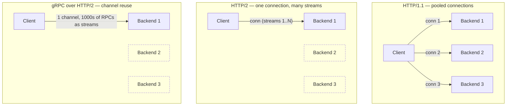
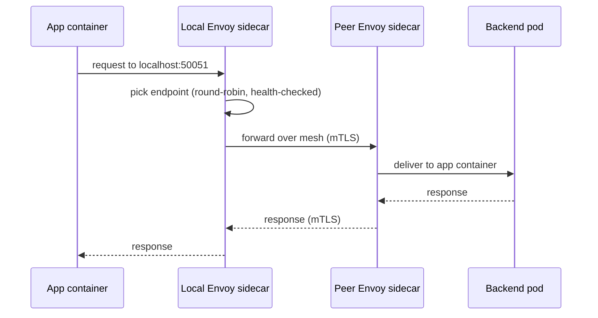
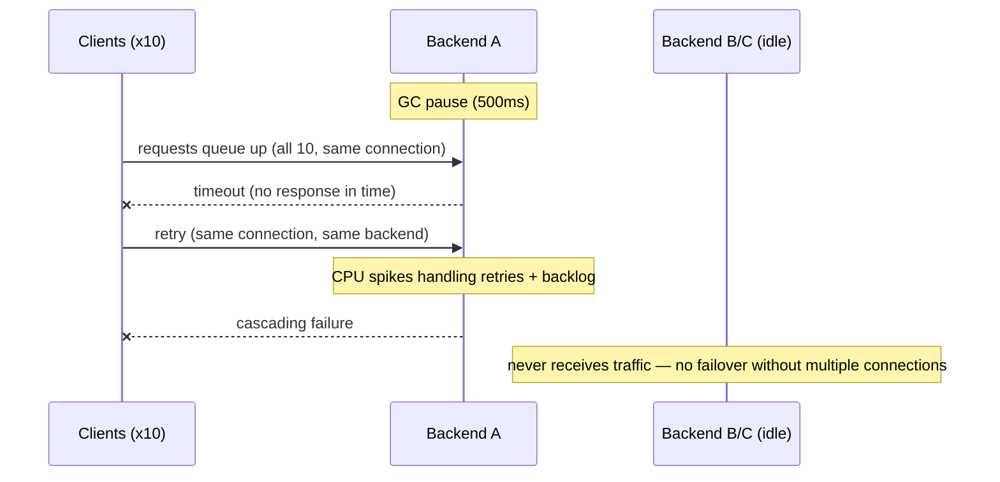

# gRPC vs HTTP vs HTTP/2 in Production

**Prerequisites:** [HTTP & TCP](http-tcp.md), [Load Balancing](load-balancing.md), [Cloud Load Balancers](load-balancers-cloud.md)

[← Networking Overview](index.md)

---

## Why This Exists

You've chosen your protocol (HTTP, gRPC, HTTP/2). Now you deploy it. In development, everything works. In production, 80% of traffic goes to one backend and that backend is now the bottleneck. This page explains why it happens and how to fix it.

The root cause is almost always **connection pooling + load balancer + service discovery** interacting in ways nobody expected.

---

## Part 1: Connection Model Fundamentals



Streams multiplex onto one connection; connections pin to one backend. HTTP/1.1 spreads load because it opens several connections. HTTP/2 and gRPC concentrate load because they deliberately reuse one — that's the root of the hotspot problem this page works through.

### HTTP/1.1

```
Model: One request per connection (or connection pooling)

Timeline:
Client connection 1:  [Request 1] ──→ [Response 1] ──→ CLOSE or IDLE
Client connection 2:  [Request 2] ──→ [Response 2] ──→ CLOSE or IDLE
Client connection 3:  [Request 3] ──→ [Response 3] ──→ CLOSE or IDLE

With connection pooling (realistic):
Client pool (size=10):
  Conn 1: [Req A] ──→ [Resp A] ──→ [Req D] ──→ [Resp D]  (backend-1)
  Conn 2: [Req B] ──→ [Resp B] ──→ [Req E] ──→ [Resp E]  (backend-2)
  Conn 3: [Req C] ──→ [Resp C] ──→ [Req F] ──→ [Resp F]  (backend-3)
  Conn 4-10: IDLE (waiting for work)

Distribution: If each connection is round-robin'd to a backend,
              then Req A,D → backend-1, Req B,E → backend-2, etc.
              Traffic distributed across backends.
```

**Key properties:**
- ✓ Traffic distributed (pooling across N backends)
- ✓ Connection setup cost amortized (connection reused)
- ✗ Pool size must match concurrency (if 1000 concurrent requests, need pool size ≥ 1000)
- ✗ Head-of-line blocking within connection (one slow request stalls others on same connection)

### HTTP/2

```
Model: One connection, many concurrent streams

Timeline:
Single client connection:
  ├─ Stream 1: [Request A] ──→ [Response A]
  ├─ Stream 2: [Request B] ──→ [Response B]  (concurrent!)
  ├─ Stream 3: [Request C] ──→ [Response C]
  └─ Stream N: [Request N] ──→ [Response N]
  
All streams multiplexed on one TCP connection.

Distribution: All streams on one connection → routed to ONE backend
              → That backend handles all traffic from this client
              → UNEVEN DISTRIBUTION (hotspot)
```

**Key properties:**
- ✓ Connection setup cost minimal (one connection carries 1000s of streams)
- ✓ No **HTTP-level** HOL (one slow *stream* does not wait for another stream's application data)
- ✗ **TCP HOL remains:** one lost packet stalls *all* streams on that connection (shared cwnd). HTTP/3/QUIC removes that
- ✗ All traffic on one connection → one backend → hotspot
- ✗ To distribute traffic, need multiple HTTP/2 connections

### gRPC

gRPC is built on HTTP/2 (or HTTP/1.1 with connection pooling). Inherits connection model from underlying protocol.

```
gRPC over HTTP/2:
  Client creates ONE connection (or small pool)
  Each RPC call = new stream on that connection
  → All calls to same backend → hotspot

Example (Python gRPC):
import grpc

# One channel per target
channel = grpc.aio.secure_channel("payment:50051", ...)
stub = PaymentServiceStub(channel)

for i in range(1000):
    response = await stub.Charge(ChargeRequest(...))
    # All 1000 calls on ONE connection to ONE backend
```

**Why gRPC has this problem:**
- Designed for efficient inter-service communication (one connection, amortize setup)
- Assumed client-side load balancing (create multiple channels)
- In Kubernetes, often deployed without explicit pooling

---

## Part 2: Load Balancing + Service Discovery Interaction

### Non-Kubernetes (Direct Connection)

```
Client code:
  hosts = ["backend-1:50051", "backend-2:50051", "backend-3:50051"]
  for host in hosts:
    channel = grpc.Channel(host)
    channels.append(channel)  # Pool of channels
  
  for i in range(1000):
    channel = channels[i % len(channels)]  # Round-robin
    response = stub.Call(channel)

Result: Traffic distributed round-robin across backends
        Each backend gets ~333 requests
```

**This works well but requires:**
- Application code to manage channel pool
- Discovery: hardcoded list or config management
- Failover: manual handling (try next host)

### Kubernetes with ClusterIP Service + Direct Connection

**A normal (non-headless) ClusterIP Service does not return pod IPs from DNS at all.** `payment.default.svc.cluster.local` resolves to exactly **one** stable virtual IP — the Service's own ClusterIP — every single query, not a rotating pod address:

```
Service: payment (ClusterIP 10.0.0.10)
  Endpoints: 10.0.1.5:50051 (pod-1)
            10.0.1.6:50051 (pod-2)
            10.0.1.7:50051 (pod-3)

DNS resolution (payment:50051 → ???):
  Every query returns the SAME answer: 10.0.0.10 (the Service ClusterIP)
  There is no "round-robin per query" at the DNS layer for ClusterIP —
  pod selection happens LATER, at the packet/connection level, via
  kube-proxy's iptables/IPVS rules (see below) — not via DNS.

Query 1: payment → 10.0.0.10 → client connects to 10.0.0.10:50051
Query 2: payment → 10.0.0.10 → same answer, always
Query 3: payment → 10.0.0.10 → same answer, always

The client's ONE TCP connection to 10.0.0.10 gets NAT'd by kube-proxy
to exactly one pod IP at connection-setup time (the SYN packet) —
and then every packet on that connection stays pinned to that pod
for the connection's lifetime. That's where the hotspot actually
comes from: not DNS variance, but a single long-lived gRPC connection
getting NAT'd to one pod once and reused forever.
```

**Why this happens:**
- ClusterIP DNS is deliberately stable — one name, one IP, so nothing needs to re-resolve on every pod add/remove
- kube-proxy does the actual pod selection, per new *connection* (not per request) — see the iptables/IPVS sections below
- gRPC's connection reuse means that one selection, made once at connect time, decides the backend for potentially millions of RPCs multiplexed on that one connection

!!! warning "Headless Services are the exception"
    A **headless Service** (`clusterIP: None`) is the one case where DNS *does* return individual pod IPs — one A record per ready pod, no ClusterIP or kube-proxy NAT in the path at all. That's the mechanism client-side gRPC load balancing (below) actually depends on: resolve the headless Service name to get the full pod list, then have the gRPC client itself round-robin across them. Confusing the two Service types is the single most common mistake in this area — "DNS round-robin" is real, but only for headless Services, never for ordinary ClusterIP ones.

### Kubernetes with Service Mesh (Envoy Sidecar)



```
Client pod:
  ├─ Application container
  └─ Envoy sidecar (intercepts all traffic)
     └─ Knows about all endpoints (via control plane)
     └─ Load-balances across endpoints
     └─ Health checks failing endpoints
     └─ Retries on failure

Traffic flow:
  App → localhost:50051 (local Envoy)
     → Envoy round-robins to backend pod Envoys
     → 10.0.1.5, 10.0.1.6, 10.0.1.7 equally
     
Result: Even distribution
        Each backend gets ~333 requests
```

**This works because:**
- Envoy has upstream list (updated dynamically)
- Envoy round-robins per request (or per connection, configurable)
- Health checks remove failing endpoints
- Retries on failure

### Kubernetes with kube-proxy (iptables mode)

```
Service: payment (ClusterIP 10.0.0.10)

iptables rules:
  -A KUBE-SERVICES -d 10.0.0.10/32 -p tcp -m tcp --dport 50051
    -j KUBE-SVC-XYZ123

  -A KUBE-SVC-XYZ123
    -m statistic --mode random --probability 0.33
      -j KUBE-SEP-POD1
    -m statistic --mode random --probability 0.50
      -j KUBE-SEP-POD2
    -j KUBE-SEP-POD3

  -A KUBE-SEP-POD1 -j DNAT --to-destination 10.0.1.5:50051
  -A KUBE-SEP-POD2 -j DNAT --to-destination 10.0.1.6:50051
  -A KUBE-SEP-POD3 -j DNAT --to-destination 10.0.1.7:50051
```

**Behavior:**
- iptables `statistic --mode random` looks per-packet, but **DNAT is conntrack**: the **first packet** (TCP SYN) wins, and later packets of that connection reuse the same NAT mapping
- It is **not** per-packet random for an established TCP connection
- Once the connection is established, all packets on it → same backend

**Result:**
- First packet (SYN) → random backend
- Connection lifetime: all packets → same backend
- But new connections → different backends (probabilistic)
- Over time: roughly even distribution (but with variance)

**Problem with gRPC:**
```
gRPC client creates 1 channel (1 TCP connection)
That connection established to random backend at SYN time
All 1000 gRPC calls on that connection → same backend
Result: UNEVEN if client created connection early (high traffic on one backend)
        EVEN only if connections are short-lived (unlikely for gRPC)
```

### Kubernetes with kube-proxy (IPVS mode)

```
IPVS (IP Virtual Server):
  More intelligent than iptables
  Per-connection or per-packet load balancing available
  Sticky session support
  
Configuration:
  ipvs.k8s.io/lb-algorithm: rr  (round-robin, per-connection)
                           wrr  (weighted round-robin)
                           lc   (least connections)
                           sh   (source hash)
```

**Behavior with gRPC:**
- `rr` (round-robin): Round-robin **per new connection**
- `lc` (least connections): New connections go to the backend with fewest *connections*. **It does not move an existing HTTP/2 channel.** A long-lived gRPC connection stays on the pod it landed on; least-conns only affects the next SYN
- `sh` (source hash): Same source IP always goes to same backend → bad for gRPC (one client = one backend)

**Result:** `lc` helps *new* connections land on quieter pods. It does not rebalance streams already multiplexed on an open channel.

---

## Part 3: Why Traffic Gets Skewed (The Hotspot Problem)

### Scenario: gRPC Through a Normal ClusterIP Service

```
Setup:
  3 backend pods
  10 client pods, each talking to a plain ClusterIP Service "payment"
  Each client creates 1 gRPC channel (1 TCP connection)

Expected: 10 * N calls / 3 backends = 3.33N calls per backend
Actual: could be anywhere from perfectly even to wildly skewed —
        it depends entirely on kube-proxy's per-CONNECTION selection,
        not on DNS (every client resolves the exact same ClusterIP).

Why:
1. All 10 clients resolve "payment" to the SAME ClusterIP (10.0.0.10) —
   there is no DNS-level variance to reason about here at all.
2. Each client opens ONE TCP connection to 10.0.0.10. kube-proxy's
   iptables rules pick a backend pod for that connection at SYN time,
   using weighted random selection (see the iptables section below) —
   this is where the actual randomness comes from.
3. With only 10 connections spread randomly across 3 backends,
   small-sample variance is entirely plausible without anything being
   "wrong" — 10 independent coin-weighted picks across 3 buckets does
   not reliably land near 3.33/3.33/3.33.

If each client sends 1000 calls on its one connection:
   A plausible unlucky draw: pod-1 gets 4 connections, pod-2 gets 3,
   pod-3 gets 3 → pod-1: 4000 calls, pod-2: 3000, pod-3: 3000
   (1.33x imbalance — small-sample variance in kube-proxy's random
   pick, not a DNS effect)

The lesson is the same either way: gRPC's one-connection-per-channel
model means the unit of load-balancing granularity is "which pod did
THIS connection land on," not "which pod did this request land on" —
and with few, long-lived connections, random per-connection selection
doesn't average out the way per-request selection would.
```

### Real Hotspot Scenario: Client + Backend Affinity

```
Setup:
  1 client pod (makes many requests)
  3 backend pods
  Client uses single gRPC channel (1 connection)

Timeline:
1. Client pod starts
2. DNS query for payment → resolves to the ClusterIP (same answer every
   time — no per-query variance; this is not where the randomness is)
3. Client creates single channel → TCP connects to the ClusterIP;
   kube-proxy's iptables rule picks ONE backend pod at SYN time
   (random selection happens here, not at DNS)
4. Client sends 100k requests → all multiplexed as HTTP/2 streams on
   that one already-established connection → all land on that one pod

Result:
   pod-1 (whichever pod kube-proxy happened to NAT the SYN to): 100k requests
   pod-2: 0 requests
   pod-3: 0 requests

Why:
   - gRPC connection pooling (single channel, reused for every RPC)
   - kube-proxy makes its pod selection ONCE, at connection setup, and
     that choice is then fixed for the connection's entire lifetime
   - No failover (pod-1 responsive, so connection stays)
```

### Multiple Clients, Bursty Traffic

```
Setup:
  10 clients, each makes requests
  3 backends
  
Scenario 1 (even clients):
  Each client's connection lands on a backend via kube-proxy's random
  per-connection pick (not DNS — DNS gives every client the same
  ClusterIP)
  Each client makes steady requests
  → Roughly even distribution IF the sample of connections is large
    enough for kube-proxy's randomness to average out, and IF load
    per client is balanced

Scenario 2 (bursty traffic):
  Client A starts (connects to backend-1)
  Client B starts (connects to backend-2)
  Client C starts (connects to backend-3)
  Clients D-J start (connect to backends 1-3)
  
  Traffic suddenly: All 10 clients make requests simultaneously
  Distributed across 3 backends (10/3 ≈ 3.33 clients per backend)
  
  BUT: If backend-1 is slower (GC pause, CPU spike):
    Requests queue up on backend-1
    Latency increases
    Clients retransmit
    More requests pile up
    Cascading failure

Result: Backend-1 becomes hotspot due to performance variance
```

---

## Part 4: K8s-Specific Issues and Solutions

### Problem 1: Java DNS Caching (TTL)

```java
// With a SecurityManager, the JDK used to cache successful lookups forever.
// Modern JDK *without* a security manager defaults networkaddress.cache.ttl to ~30s,
// not infinity. Still too long if you expect DNS to rotate pod IPs (headless Services).
InetAddress.getByName("payment");

// Pin an explicit TTL rather than assuming the default
java.security.Security.setProperty("networkaddress.cache.ttl", "10");

// Or: Use different resolver
new URL("http://payment:8080").openConnection();  // Uses resolver
```

**Impact:** A long TTL (or a stale cache) plus one HTTP/2/gRPC channel means you keep the same backend well after pods moved. ClusterIP is a single VIP either way — the TTL issue is mainly **headless** client-side LB.

### Problem 2: HTTP/2 Idle Connection Reuse

```go
// Go HTTP/2 client (http.Client with default transport)

client := &http.Client{
    Transport: &http.Transport{
        MaxIdleConns: 100,
        MaxIdleConnsPerHost: 100,  // ← Reuse connection to each host
        IdleConnTimeout: 90 * time.Second,
    },
}

// Each host (backend pod IP) gets ONE connection
// All requests to that IP reused on same connection
// If DNS resolves to one IP, all traffic on one connection
```

**Solution:**
```go
// For Kubernetes, create pool of connections to service IP
// OR use multiple hostnames and round-robin between them

// Option 1: Multiple backends, connect to each
hosts := []string{"backend-1", "backend-2", "backend-3"}
clients := make([]*http.Client, len(hosts))
for i, host := range hosts {
    clients[i] = &http.Client{...}
    clients[i].Get(fmt.Sprintf("http://%s:8080/api", host))
}

// Option 2: Service mesh handles this (Envoy)
// Don't worry about pooling, let Envoy do it
```

### Problem 3: Readiness Probe Affecting gRPC

```yaml
apiVersion: v1
kind: Pod
metadata:
  name: grpc-server
spec:
  containers:
    - name: grpc
      image: grpc-server:latest
      ports:
        - name: grpc
          containerPort: 50051
      livenessProbe:
        exec:
          command: ["/bin/grpc_health_probe", "-addr=:50051"]
        initialDelaySeconds: 10
        periodSeconds: 10
      readinessProbe:
        exec:
          command: ["/bin/grpc_health_probe", "-addr=:50051"]
        initialDelaySeconds: 5
        periodSeconds: 5
```

**Issue:** Health probe makes gRPC connection, takes up a slot in connection pool

**Better:** Use gRPC health check (protocol-native)

```protobuf
service Health {
  rpc Check(HealthCheckRequest) returns (HealthCheckResponse);
  rpc Watch(HealthCheckRequest) returns (stream HealthCheckResponse);
}
```

### Problem 4: Connection Pool Exhaustion

```
Setup:
  Backend service with gRPC connection pool
  Database query (20 ms latency)
  
Scenario:
1. 100 clients connect (100 connections to backend)
2. Each client makes 100 requests per second
3. Each request → database call (20 ms)
4. Backend goroutines: 1 per request = 100 * 100 = 10,000 goroutines
5. Each goroutine blocked on database call (20 ms) = 20ms wait

Normal case:
   Throughput: 100 * 1000 / 0.020 = 5,000,000 requests/sec (ideal)
   Actual: ~5,000 requests/sec (100 requests/sec/connection × 100 connections)

If connection limit is hit (OS default ~1024):
   New connections rejected (ECONNREFUSED)
   Clients see errors
   Retries overwhelm system
```

**Solution:**
```go
// Configure connection pool at load balancer
// AWS ALB: TargetGroup connection draining

// Or: Increase OS limits
// /etc/security/limits.conf
* soft nofile 65535
* hard nofile 65535

// Or: Limit connections per client (server-side)
maxConnectionsPerClient := 10
semaphore := make(chan struct{}, maxConnectionsPerClient)
```

---

## Part 5: HTTP/1.1 vs HTTP/2 vs gRPC — Comparison Table

| Aspect | HTTP/1.1 | HTTP/2 | gRPC |
|--------|----------|--------|------|
| **Connection model** | Pool of connections | One connection, many streams | One connection (HTTP/2) or pool (HTTP/1.1) |
| **Concurrent requests** | Limited by pool size | Unlimited (streams) | Depends on underlying protocol |
| **Default distribution** | Even (if pool round-robin'd) | Hotspot (all traffic on one connection) | Hotspot (gRPC reuses connection) |
| **Head-of-line blocking** | Yes (HTTP + TCP) | No HTTP-level HOL; **TCP HOL remains** | Same as HTTP/2 (TCP HOL); HTTP/3 would remove it |
| **Latency per request** | 1-5 ms (pool setup amortized) | 0.5-1 ms (stream overhead) | 0.5-1 ms (stream overhead) |
| **Total connections at scale** | Many (pool size × clients) | Few (1 per client) | Few (1 per client) |
| **Complexity (application)** | Simple (standard) | Medium (need multiplexing library) | Medium (need gRPC library) |
| **Complexity (operations)** | Simple | Medium (HTTP/2 specific tuning) | High (gRPC + connection pooling + LB) |
| **K8s friendliness** | Good (simple discovery) | Medium (needs smart LB/SM) | Medium (needs SM or client-side LB) |

---

## Part 6: Production Failure Modes and Recovery

### Failure Mode 1: Slow Backend Cascades Through gRPC



```
Setup:
  10 clients, 1 backend connection each (gRPC)
  Backend A: handling all 10 clients
  Backend B, C: idle

Failure:
  Backend A: GC pause (500 ms)
  → All 10 clients' requests timeout or queue
  → Clients retry
  → More requests pile up
  → Backend A CPU spikes
  → Cascading failure

Recovery depends on:
  ✓ Timeout on client (requests fail fast, retry to different backend)
  ✗ No timeout (requests wait, no retry, cascade)
  
Better: Multiple backend connections per client
        If one connection slow, other connections still work
```

### Failure Mode 2: Connection Leak + Gradual Exhaustion

```
Setup:
  Client makes N requests per day
  Each request creates gRPC channel (connection)
  Channels never closed

Day 1: 1000 connections open
Day 2: 2000 connections open
Day 3: 3000 connections open
...
Day 10: 10,000 connections open → OS limit reached → ECONNREFUSED

Production impact:
  Gradual degradation
  No obvious failure
  Only noticed after weeks
```

**Root cause:** Client-side connection leak

**Fix:**
```go
// Ensure channels are closed
defer channel.Close()

// Or use context cancellation
ctx, cancel := context.WithCancel(context.Background())
defer cancel()

// Client detects channel close and reconnects
```

### Failure Mode 3: DNS TTL Expiry + Stale Backend

```
Setup:
  Backend pod created at 9:00 AM (IP 10.0.1.5)
  DNS TTL: 30 seconds
  Client cached DNS result at 9:00:01 AM
  
9:00:31 AM:
  Backend pod killed (IP 10.0.1.5 no longer exists)
  New pod created (IP 10.0.1.99)
  Service updated to point to new pod
  
Client still holds connection to 10.0.1.5 (stale)
Requests timeout (connection reset)
After timeout, client retries
DNS query now returns 10.0.1.99
New connection to new pod
Requests succeed

Duration of outage: Request timeout (default 30s) before retry
```

**Better:** Use short DNS TTL + service mesh
- Service mesh: Envoy continuously probes endpoints, removes dead ones instantly
- DNS: Lower TTL (5-10s) so stale entries expire faster

---

## Part 7: Solutions and Best Practices

### Solution 1: Service Mesh (Istio/Linkerd)

```yaml
# Linkerd: automatic load balancing across connections

apiVersion: v1
kind: Service
metadata:
  name: payment
spec:
  selector:
    app: payment
  ports:
    - port: 50051

# Envoy sidecar handles:
#   - Service discovery (watches endpoints)
#   - Load balancing (round-robin across endpoints)
#   - Health checks (removes failing endpoints)
#   - Retries (automatic)
#   - Timeout (automatic)
#
# Client connects to localhost:50051 (local Envoy)
# Envoy round-robins to backend pods
# Result: Even distribution, automatic failover
```

**Pros:**
- Automatic load balancing
- No application code changes
- Observability (Prometheus metrics)
- Retries and timeouts centralized

**Cons:**
- Adds sidecar memory overhead (50-100MB per pod)
- Adds latency (1-2ms per hop)
- Operational complexity

### Solution 2: Client-Side Load Balancing (gRPC LB Policy)

```go
// gRPC with built-in load balancer

import "google.golang.org/grpc"
import "google.golang.org/grpc/balancer/roundrobin"

// Explicit round-robin balancer
conn, _ := grpc.Dial(
    "payment:50051",
    grpc.WithDefaultCallOptions(...),
    grpc.WithDefaultServiceConfig(`{
        "loadBalancingConfig": [{"round_robin":{}}]
    }`),
)

// gRPC now:
//   Resolves "payment" DNS to multiple addresses
//   Creates connection to EACH address (not just first)
//   Round-robins requests across connections
//
// Result: Even distribution
```

**Pros:**
- No service mesh overhead
- Application controls load balancing
- Works without Kubernetes

**Cons:**
- Requires gRPC client library support
- Application must manage balancer
- No automatic failover (unless client detects)

### Solution 3: Multiple Backends + External LB

```
Setup:
  AWS ALB with target group, HTTP/2 / gRPC listener configured
  Health checks per backend

ALB routing — this is the one place in this page where the
"connection-pinned" assumption does NOT automatically hold:
  ALB terminates the client's HTTP/2 connection itself, then parses
  individual gRPC calls (it understands HTTP/2 framing and can
  distinguish separate streams within one connection) and can forward
  each one to a different backend target — i.e. ALB can load-balance
  PER REQUEST, not just per connection, when configured for gRPC.
  This is a genuinely different capability from a plain L4 NLB or from
  kube-proxy's iptables NAT, both of which only see opaque TCP streams
  and must pin at the connection level because they have no visibility
  into what's inside it.

Result: Even distribution per-request IS achievable with ALB + gRPC
        target group configuration — this is not automatically true
        out of the box, but it's a real, supported ALB feature, unlike
        NLB/kube-proxy where per-request balancing isn't possible at all.
        Automatic failover (unhealthy backend removed)
```

**Pros:**
- Transparent to application
- Automatic failover
- Genuinely per-request load balancing when configured for gRPC — not just per-connection

**Cons:**
- External LB cost
- Requires explicit gRPC/HTTP/2 target group configuration to get per-request behavior — a misconfigured ALB (e.g. HTTP/1.1 target group in front of an HTTP/2 backend) falls back to connection-level behavior
- Not available for on-prem

### Solution 4: Connection Pooling + Explicit Round-Robin

```python
# gRPC connection pool (manual)

class PaymentServicePool:
    def __init__(self, hosts, pool_size=10):
        self.channels = []
        for host in hosts:
            for _ in range(pool_size // len(hosts)):
                channel = grpc.aio.secure_channel(host, ...)
                self.channels.append(channel)
        self.index = 0
    
    async def call(self, method, request):
        channel = self.channels[self.index % len(self.channels)]
        self.index += 1
        stub = PaymentServiceStub(channel)
        return await method(stub, request)

# Result: Requests distributed round-robin across all channels
#         → All backends get even traffic
```

**Pros:**
- Simple, explicit control
- No external dependencies

**Cons:**
- Application must implement
- Manual failover handling
- Doesn't scale (hardcoded host list)

---

## Part 8: Tuning and Monitoring

### Tuning: Connection Keepalive

```go
// gRPC server
import "google.golang.org/grpc/keepalive"

server := grpc.NewServer(
    grpc.KeepaliveParams(keepalive.ServerParameters{
        Time:    10 * time.Second,  // Ping client every 10s
        Timeout: 1 * time.Second,   // Wait 1s for pong
    }),
)

// gRPC client
conn, _ := grpc.Dial(
    "payment:50051",
    grpc.WithKeepaliveParams(keepalive.ClientParameters{
        Time:                10 * time.Second,
        Timeout:             1 * time.Second,
        PermitWithoutStream: true,  // Ping even if no active calls
    }),
)
```

**Why:** Detects stale connections early, enables faster failover

### Tuning: Connection Pool Size

**This is not the same calculation as HTTP/1.1 connection pooling.** For HTTP/1.1, one connection handles one request at a time, so "concurrent requests needed" and "connections needed" are the same number. gRPC over HTTP/2 multiplexes many concurrent RPCs as independent streams on a *single* connection — so the naive formula below massively overcounts how many actual TCP connections (and therefore how many *backend pods*) you need:

```
Naive (wrong for gRPC) formula: pool_size = target_rps × per_request_latency × headroom

Example:
  Target RPS: 10,000
  Per-request latency: 50 ms
  Headroom: 2

  "pool_size" = 10,000 × 0.050 × 2 = 1,000
  This is the number of CONCURRENT IN-FLIGHT RPCs you need capacity for
  — NOT the number of TCP connections. A single HTTP/2 connection can
  multiplex hundreds to low-thousands of concurrent streams (bounded by
  MAX_CONCURRENT_STREAMS, commonly 100–1000 depending on server config)
  before you need a second connection at all.
```

What you actually need to size is **channels for load-balancing spread**, not raw concurrency — the real question is "how many backend pods do I want this traffic spread across," which is a small number (one connection per pod you want to reach, typically single digits to a few dozen), not one connection per unit of target throughput:

```
Real sizing question: how many backend pods should share this load?
  If MAX_CONCURRENT_STREAMS per connection = 100, and you need 1,000
  concurrent in-flight RPCs of headroom, you need at least
  1,000 / 100 = 10 connections to avoid stream-limit backpressure —
  and separately, at least that many (or a multiple, for even spread)
  distinct backend pods to avoid concentrating all 10 connections on
  too few pods.

Implementation:
  Option 1: One channel per backend pod you want in the spread (via a
            headless Service + client-side round-robin resolver)
  Option 2: A service mesh sidecar, which handles per-request spread
            without the app managing channel count at all
```

### Monitoring: Connection Distribution

```prometheus
# Measure traffic per backend — grpc_server_handled_total is a COUNTER,
# not a histogram, so histogram_quantile doesn't apply here at all;
# histogram_quantile only makes sense against a _bucket metric emitted
# by a histogram (e.g. grpc_server_handling_seconds_bucket).

# Traffic volume per backend — just the request rate, no quantile:
sum(rate(grpc_server_handled_total[5m])) by (backend)

# Expected: ~equal (within 10% variance)
# Bad: One backend 3-4x higher than others

# If you actually want LATENCY per backend (a real use for
# histogram_quantile), use the histogram's _bucket series instead:
histogram_quantile(0.99,
  sum(rate(grpc_server_handling_seconds_bucket[5m])) by (le, backend)
)

# Check why traffic is uneven:
#   1. kube-proxy's per-connection pod selection (not DNS — see Part 2)
#   2. Connection reuse (client creating a single long-lived connection)
#   3. Backend performance (one backend slower, connections queue)
```

### Monitoring: Connection Count

```prometheus
# grpc_server_started_total - grpc_server_handled_total gives you
# IN-FLIGHT RPCs (started but not yet finished) — a proxy for load,
# but NOT the same thing as active TCP connections. One connection can
# have hundreds of in-flight streams; this metric can't tell you how
# many distinct connections are open.

sum(grpc_server_started_total - grpc_server_handled_total) by (instance)

# Expected: stable (within normal variance), tracks concurrent RPC load
# Bad: Continuously increasing (RPCs not completing — hung streams,
#      deadlocked handlers, or a genuine backlog building)
# Bad: Sudden spikes (thundering herd / cascade)

# To actually count active TCP CONNECTIONS, you need a connection-level
# metric, not an RPC-level one — e.g. Envoy's
# envoy_cluster_upstream_cx_active, or OS-level `ss -s` / conntrack
# counts against the target pods.
```

---

## Interview Questions

=== "Foundation"
    **Q: You deploy a gRPC service in Kubernetes. Traffic is uneven: 80% to pod-1, 10% each to pod-2 and pod-3. Why?**
    
"Most likely: kube-proxy's per-connection pod selection, combined with gRPC's connection reuse — not DNS. A plain ClusterIP Service always resolves to the same virtual IP regardless of which pod ends up serving the request, so DNS isn't where the imbalance comes from. What actually happens: the client opens one TCP connection to the ClusterIP, kube-proxy's iptables/IPVS rule picks one backend pod for that connection at SYN time, and because gRPC multiplexes every subsequent call onto that same connection, all traffic then goes to whichever pod was picked. Fix: (1) Use a service mesh (Envoy sidecar) to load-balance per-request instead of per-connection, (2) switch to a headless Service and use gRPC's client-side round-robin resolver — the client resolves the pod IPs directly and opens a connection to each, (3) or open multiple channels explicitly and round-robin between them at the application layer."
    
    **Q: What's the difference between HTTP/2 and HTTP/1.1 in terms of connection pooling?**
    
    "HTTP/1.1 creates a pool of connections (size N), each connection handles one request at a time, connections are reused. HTTP/2 creates one connection and multiplexes many concurrent requests as streams on that connection. Result: HTTP/1.1 needs larger pool (more memory, more TCP overhead) but distributes traffic across backends naturally. HTTP/2 uses minimal connections but all traffic on one connection goes to one backend (hotspot)."

=== "Senior"
    **Q: Design a gRPC client in Kubernetes that ensures even traffic distribution across backend pods.**
    
    "Use a service mesh (Istio/Linkerd) for transparent load balancing. Client connects to localhost:50051 (Envoy sidecar), which round-robins requests to backend pods. Envoy also handles health checks and retries. If SM is not available, implement client-side load balancing: (1) Use gRPC's built-in round-robin resolver (resolve 'payment:50051' to multiple IPs, create channel to each, round-robin calls), (2) Or manually create N channels to different backend IPs and round-robin between them. Key: Avoid single connection per client (causes hotspot)."
    
    **Q: Your Java service makes gRPC calls to a backend. Traffic shows 100% to one backend pod. How do you fix it?**
    
"Two real causes, and DNS caching is only a factor for the headless-Service client-side-LB approach — it doesn't apply if the client is going through a plain ClusterIP, since every DNS query already returns the same ClusterIP regardless of caching. The two causes that actually matter: (1) gRPC connection reuse — one channel means one underlying TCP connection carries every RPC, and (2) kube-proxy (or the L4/L7 LB in front) makes its pod-selection decision once, at connection setup, then pins to that pod for the connection's life. Fixes: (1) move to a headless Service plus gRPC's built-in round-robin resolver, so the client itself opens a connection per pod and balances across them — here Java DNS TTL matters (modern JDK default ~30s without a security manager, not infinite), so also set `networkaddress.cache.ttl` to a short value, (2) create multiple gRPC channels explicitly and round-robin between them, or (3) use a service mesh so balancing happens per-request via the sidecar, no code change. Test: Monitor traffic per backend (Prometheus), confirm it's now balanced."

=== "Staff"
    **Q: You're running 1000 microservices in Kubernetes with gRPC inter-service communication. 5% of service pairs show 3-4x traffic imbalance. How do you solve this systematically?**
    
    "I'd implement a multi-layered approach: (1) **Service mesh (Istio/Linkerd)** for automatic load balancing (transparent, no app changes, but adds 50MB memory + 1-2ms latency per sidecar), (2) **Client-side gRPC load balancing** where service mesh is too heavy (use gRPC's round-robin resolver with DNS SRV records), (3) **Monitoring**: continuously track traffic distribution (Prometheus histograms), alert if imbalance > 20%, (4) **Capacity testing**: for known hotspots, test with multiple connections and confirm linear scaling, (5) **DNS tuning**: short TTLs (5-10s) to detect pod changes quickly. Phased rollout: (a) Instrument all services (count connections/requests per backend), (b) Deploy service mesh to critical path services first, (c) Monitor and extend. Cost: SM adds ~$10k/month infrastructure, but prevents cascading failures worth 10x+ that."

---

## Key Takeaways

!!! success "Remember"
    1. **HTTP/1.1 pools connections** (many connections, traffic distributed by pool), **HTTP/2 multiplexes on one connection** (all traffic on one connection = hotspot).
    2. **gRPC inherits HTTP/2 behavior:** one channel = one connection = one backend = hotspot. Fix: create multiple channels or use service mesh.
    3. **ClusterIP DNS is a single VIP** — every lookup returns the Service IP, not rotating pod IPs. The hotspot is **headless DNS + gRPC channel reuse**, or **one connection NAT'd once** through kube-proxy. Java's default positive DNS TTL is ~30s without a security manager, not infinite.
    4. **K8s service discovery**: a plain ClusterIP Service's DNS name always resolves to the same virtual IP — it never round-robins across pod IPs. Pod selection happens later, at connection setup, via kube-proxy's iptables/IPVS NAT rules. Only a **headless Service** (`clusterIP: None`) returns individual pod IPs from DNS — that's the mechanism client-side gRPC load balancing actually relies on. Fix: service mesh (per-request LB via sidecar) or headless Service + client-side LB (per-connection LB via the client itself).
    5. **kube-proxy iptables/IPVS:** Round-robins per new connection. With gRPC (long-lived connection), that's one backend for entire lifetime.
    6. **L4 LB (NLB):** Sees TCP/gRPC as opaque flows. Pins connection to backend → hotspot.
    7. **L7 LB (ALB):** Genuinely different from L4 — ALB terminates the client's HTTP/2 connection and can parse individual gRPC calls within it, load-balancing **per-request**, not just per-connection, when the target group is explicitly configured for gRPC/HTTP/2. Without that configuration (e.g. an HTTP/1.1 target group), it falls back to connection-level pinning like an L4 LB.
    8. **Service mesh solves this:** Envoy sidecars load-balance across all backends, automatically. Cost: memory + latency.
    9. **Client-side load balancing:** Multiple connections, round-robin between them. No service mesh, but requires app changes.
    10. **Monitor constantly:** Track connection count and traffic per backend. Hotspots will appear; fix before they cascade.

---

**Previous:** [Modern Protocols & Service Mesh](modern-protocols-service-mesh.md)

