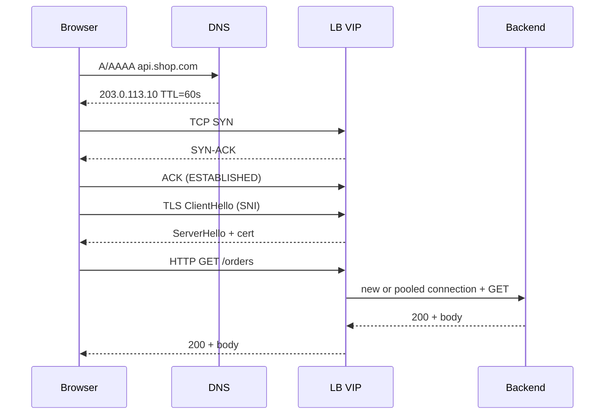

# HTTP & TCP Deep Dive

**Prerequisites:** Sockets at a glance, [Load Balancing](load-balancing.md)

[← Load Balancing](load-balancing.md) | [Next: Kubernetes →](../kubernetes/index.md)

---

## Why This Exists

A user types `https://api.shop.com/orders`. Twenty things happen before your handler runs. Interviews (and incidents) fail when someone says "the API is slow" without knowing **which hop** — DNS cache, SYN drop, TLS, HTTP/1.1 head-of-line, LB idle timeout, or the app.

This page is the path: **browser → DNS → TCP → TLS → HTTP → LB → backend**, and the failure modes hiding in each acronym.

!!! tip "Mental Model"
    IP is the postcard address. UDP is dropping the postcard in a mailbox. TCP is a phone call: you both agree you are talking (handshake), you number every sentence (seq), you repeat yourself if the other person says "what?" (ACK / retransmit), and you hang up politely (FIN) or slam the phone (RST). HTTP is the *conversation* you have once the call is up. HTTP/2 is several conversations on one call. HTTP/3 is the same conversations, but the "call" is QUIC over UDP so a lost packet does not mute every other sentence.

---

## The Pieces, Without Mythology

| Piece | Job | You touch it when |
|-------|-----|-------------------|
| **DNS** | Name → IP (and more: CNAME, MX, TXT) | "Works on my laptop," stale TTL, split-horizon |
| **IP** | Packet to a host; no connections | Blackhole routes, MTU, NAT |
| **Port** | 16-bit multiplex on a host (`:443`) | "Connection refused" vs timeout |
| **Socket** | OS object: `(proto, srcIP, srcPort, dstIP, dstPort)` | `ss -tan`, `Too many open files`, TIME_WAIT |
| **UDP** | Datagram, no handshake, no retry | DNS, QUIC, game ticks, metrics |
| **TCP** | Reliable *byte stream* (not messages) | Almost every API until HTTP/3 |
| **TLS** | Encryption + server (and optional client) auth | Cert expiry, SNI, handshake RTT |
| **HTTP** | Request/response *messages* on that stream | Status codes, keep-alive, versions |

A **socket** is not a port. Ten thousand sockets can share `:443` on the server; the 4-tuple distinguishes them. `TIME_WAIT` is a socket in a costume, still occupying the tuple.

---

## Lifecycle: One Browser Request



Budget on a cold cache, 80ms RTT to the VIP:

- DNS (if uncached): 1–2 extra RTTs
- TCP handshake: **1 RTT**
- TLS 1.3: **1 RTT** (1.2 often 2)
- HTTP request/response: **≥1 RTT**
- Total: ~3–4 RTT before the first byte of JSON — **240–320ms** — *before* app time

This is why **connection pooling**, **keep-alive**, **HTTP/2 multiplexing**, and **edge TLS** exist.

---

## Interactive Simulations

<div class="sim-container">
  <div class="sim-title">DNS Resolution</div>
  <div class="sim-controls">
    <button class="sim-btn" onclick="window._dns && window._dns.reset()">Reset</button>
    <button class="sim-btn" onclick="window._dns && window._dns.step()">Step</button>
    <button class="sim-btn success" onclick="window._dns && window._dns.run()">Resolve</button>
    <button class="sim-btn danger" onclick="window._dns && window._dns.failNs()">Fail NS</button>
  </div>
  <canvas id="dns-canvas" class="sim-canvas" style="width:100%;height:240px;"></canvas>
  <div class="sim-log" id="dns-log"></div>
</div>

<div class="sim-container">
  <div class="sim-title">TCP Lifecycle</div>
  <div class="sim-controls">
    <button class="sim-btn" onclick="window._tcp && window._tcp.reset()">Reset</button>
    <button class="sim-btn" onclick="window._tcp && window._tcp.step()">Step</button>
    <button class="sim-btn success" onclick="window._tcp && window._tcp.run()">Handshake</button>
    <button class="sim-btn danger" onclick="window._tcp && window._tcp.drop()">Drop packet</button>
    <button class="sim-btn danger" onclick="window._tcp && window._tcp.timeout()">Timeout</button>
  </div>
  <canvas id="tcp-canvas" class="sim-canvas" style="width:100%;height:240px;"></canvas>
  <div class="sim-log" id="tcp-log"></div>
</div>

**Try:** Fail NS — the user never reaches your LB. Drop a SYN — the app log is silent; the user waits for RTO.

---

## DNS Internals

Order of caches: **browser → OS stub → recursive resolver (ISP/8.8.8.8) → root → TLD → authoritative**.

- **TTL** is a promise, not a contract. Corporate resolvers clamp to 5 minutes; some clamp to hours.
- **NXDOMAIN** is cached too (negative TTL). A bad cutover can persist after you "fix DNS."
- **Failover via DNS** is coarse. Lower TTL to 30–60s *before* you need it; changing TTL at incident start does nothing for already-cached answers.

---

## TCP Internals

### Handshake and teardown

```
Client: SYN          seq=ISN_c
Server: SYN-ACK      seq=ISN_s ack=ISN_c+1
Client: ACK          ack=ISN_s+1          → ESTABLISHED
... data is a byte stream, not messages ...
Active close: FIN → ACK → FIN → ACK
Client then sits in TIME_WAIT (typically 60s, 2MSL)
```

`TIME_WAIT` exists so a delayed packet from the old conversation cannot corrupt a new one that reused the 4-tuple. At high connect rates, **pool connections** instead of opening one TCP per request — or you drown in `TIME_WAIT` and ephemeral port exhaustion (`EADDRNOTAVAIL`).

### Retransmission and congestion

- Loss → **RTO** (smoothed RTT + variance) or **fast retransmit** (usually 3 duplicate ACKs).
- Congestion control (Cubic, BBR) shrinks the window on loss or inferred delay. A burst of timeouts is not "the GC pause"; it can be **cwnd collapse** after a blip.
- **Head-of-line at TCP:** HTTP/1.1 pipelining is dead because one lost packet stalls every request on that connection. HTTP/2 multiplexes streams but *still* shares one TCP cwnd — a lost packet stalls all streams. HTTP/3/QUIC fixes that.

### Timeouts you actually configure

| Timer | Typical | If too low | If too high |
|-------|---------|------------|-------------|
| Connect | 200ms–2s | False failures on jitter | Threads stuck in SYN |
| TLS handshake | 1–5s | Same | Same |
| Request / read deadline | 1–30s, **inner shorter than caller** | Cut legitimate work | Inner still running after the caller gave up (wasted threads) |
| Socket idle / keep-alive | 30–350s | Idle churn | FD leak |
| LB idle vs app idle | LB idle **shorter** than app idle (LB closes first) | If **app** idle is shorter: app closes, LB still thinks the conn is live → next request hits RST → random 502s | If LB idle is so short it fires *during* an in-flight request, you mixed idle with a request deadline |

!!! warning "Production Trap"
    **Do not mix request deadlines with idle timeouts.**

    - **Request deadlines:** inner timeout **shorter** than the caller — `client > LB > app > dependency` (remaining budget). If nginx `proxy_read_timeout` is 30s and the app will run 90s, the app is still working after the client is gone. Make the app/dependency timeout shorter than the proxy's **read** timeout.
    - **Idle:** LB should close idle connections **before** the app (`LB idle < app idle`), so the app never thinks a conn the LB already dropped is still live. Backwards (app idle shorter than LB idle) → LB forwards onto a dead socket → random 502/RST.

    Keepalives exist so intermediate NATs do not silently drop idle state. `proxy_read_timeout` is a **request** timer, not an idle timer.

### Pooling

A pool is a set of **already ESTABLISHED (+ TLS)** sockets.

- Acquire, use, release. Never checkout forever.
- Cap per-host and global. Validate on borrow (`SELECT 1`, HTTP ping) after idle.
- On any protocol error, **destroy** the socket — do not return a half-read HTTP/1.1 connection or the next caller reads the previous body.

---

## HTTP/1.1 vs HTTP/2 vs HTTP/3

| | HTTP/1.1 | HTTP/2 | HTTP/3 |
|--|----------|--------|--------|
| Transport | TCP, one request at a time per conn (keep-alive) | TCP, many streams, HPACK headers | QUIC over UDP, TLS 1.3 baked in |
| HOL blocking | Connection (and TCP) | TCP loss blocks all streams | Per-stream |
| Server push | No (practical) | Yes (mostly unused) | — |
| Browsers | 6 conns per host hack | 1–2 conns | 1 QUIC conn |
| Middleboxes | Universally understood | Some corporate proxies break it | UDP 443 blocked in some networks |
| Ops cost | Simple to tcpdump | Need `nghttp` / Wireshark h2 | Harder to debug; falls back to h2 |

**Idempotency** is not a version feature. `GET` is supposed to be safe; `POST /charge` is not. Retries at the LB or HTTP/2 replay can double-submit. Use `Idempotency-Key` on writes.

---

## Realistic Example

Checkout API, 80ms RTT, 5k peak QPS, 2KB responses.

- **No pooling:** 5k NEW connection setups/second (one per request, since nothing is pooled) — the setup *rate* is fixed by request rate, not RTT. What RTT changes is how many of those setups are simultaneously in-flight at any instant: by Little's Law, concurrency = rate × latency = 5,000/s × (TCP+TLS ≈ 2 RTT ≈ 160ms) ≈ 800 handshakes concurrently in progress at any given moment, each holding a socket in a non-established state. Add TIME_WAIT (2×MSL after close) piling up behind that, and a single box's ephemeral ports (~28k) get exhausted in seconds.
- **Pooled HTTP/1.1, 200 conns to the DB:** one slow query HOL-blocks that connection; 199 others are fine. App thread pool may still stall if every thread waits on the pool.
- **HTTP/2 to the mesh sidecar:** 1 connection, 200 streams. A TCP loss now delays *all* 200. Tail latency becomes a congestion story, not an app story.

---

## Failure Modes

### SYN drop / backlog full
- **Symptom:** Client timeout; server access log empty
- **Fix:** `somaxconn`, accept loop not blocked, SYN cookies, more replicas

### DNS SERVFAIL / stale A record
- **Symptom:** Some ISPs work, some don't; "it's down" is geographic
- **Fix:** Check authoritative NS health, TTL, and *which* resolver the client uses

### Half-open after LB idle RST
- **Symptom:** 1% 502s after 60s quiet
- **Fix:** Align idle timeouts; HTTP pings; max connection age

### TLS cert / SNI mismatch
- **Symptom:** Browser works (SNI), old Java client fails
- **Fix:** Default cert, correct SAN, TLS 1.2 still on if you have dinosaurs

---

## Production Debugging

```
Symptom: p99 = 3s, p50 = 40ms, no app logs for the slow ones

1. Is it even TCP-established?
   → client: curl -w '%{time_namelookup} %{time_connect} %{time_appconnect} %{time_starttransfer}'
   → server: ss -tan state syn-recv | wc
2. DNS?
   → dig +trace, compare resolvers, check TTL vs last change
3. Idle reset?
   → packet capture: RST from VIP after ~60s idle
4. Retransmits?
   → nstat / netstat -s  RetransSegs climbing with traffic
5. HTTP version HOL?
   → compare h1 pool vs h2; one lost packet vs one slow stream
6. Pool exhaustion?
   → checkout wait histogram, not just "pool size 50"
```

---

## Trade-offs

| Choice | Win | Cost |
|--------|-----|------|
| Short DNS TTL | Fast failover | More resolver QPS, more cache misses |
| Aggressive connect timeout | Fail fast | False positives |
| Huge connection pool | Absorb bursts | FD, memory, thundering on restart |
| HTTP/2 everywhere | Fewer sockets | Shared cwnd, harder debug |
| HTTP/3 | Loss isolation, 0-RTT | UDP policy, 0-RTT replay risk |

---

## Interview Questions

=== "Foundation"
    **Q: Walk me through typing a URL.**

    "Browser checks DNS cache, then OS, then a recursive resolver. The resolver walks root → TLD → authoritative and returns an A/AAAA (cached for TTL). Browser opens a TCP connection to that IP: SYN, SYN-ACK, ACK. TLS 1.3 negotiates keys in about one more RTT. Then HTTP GET. The packet usually hits a load balancer, which picks a backend using a health-checked pool, and may reuse a pooled connection. The backend writes a response; the LB proxies it back. Later the TCP connection may stay open for keep-alive or go through FIN/TIME_WAIT."

=== "Senior"
    **Q: Why is connection pooling mandatory at 10k QPS, and what goes wrong in the pool?**

    "Handshake + TLS is multiple RTTs and CPU. At 10k new conns/s you also burn ephemeral ports and sit in TIME_WAIT. A pool amortizes that. It goes wrong when: idle connections are reset by a middlebox and reused anyway; you return a dirty HTTP/1.1 socket; you size the pool larger than the dependency can accept (you DDoS yourself on deploy); you have no max lifetime so a bad box keeps serving. I measure acquire wait, not just hit rate."

=== "Staff"
    **Q: p99 jumped 800ms after we enabled HTTP/2 to the mesh. p50 improved. What now?**

    "Shared TCP congestion window. We multiplexed away the 6-connection hack, so a single loss or a large response now HOL-blocks unrelated RPCs. I'd confirm with per-stream vs connection metrics, retransmits on the sidecar, and whether a fat download shares the conn. Mitigations: separate clusters/connections for bulk vs RPC, HTTP/3 where we control both ends, request hedging on idempotent reads, and not celebrating p50. I'd also check if we accidentally enabled retry-on-reset at the proxy — that's a double-submit risk, not a latency fix."

---

## Key Takeaways

!!! success "Remember"
    1. Name the hop: DNS, TCP, TLS, HTTP, LB, app — slowness has an address
    2. Handshake cost is why pools exist; dirty pools are worse than no pool
    3. TCP is a byte stream; HTTP messages are a layer on top
    4. HTTP/2 multiplexes; it does **not** remove TCP head-of-line
    5. **Request deadlines:** `client > LB > app > dependency` (inner shorter). **Idle:** LB closes first. Do not mix them.

**Previous:** [Load Balancing](load-balancing.md) | **Next:** [Kubernetes](../kubernetes/index.md)
