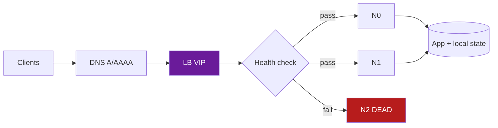
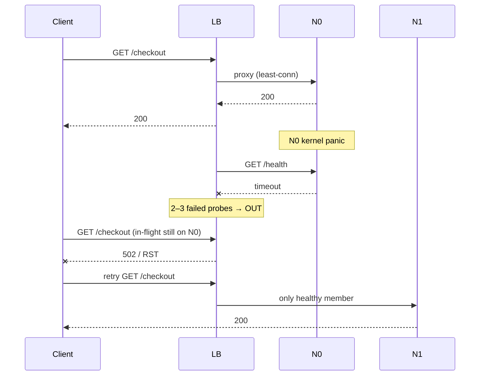
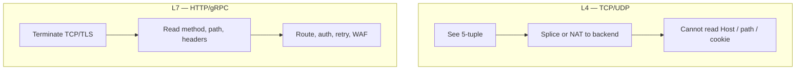

# Load Balancing

**Prerequisites:** [HTTP & TCP](http-tcp.md), [Consistent Hashing](../databases/consistent-hashing.md)

[← Networking Overview](index.md) | [Next: HTTP & TCP →](http-tcp.md)

---

## Why This Exists

You have three app servers behind `api.shop.com`. Friday 19:12, **N0 dies**.

Three questions interviewers (and 3 a.m. pages) actually ask:

1. **How does the load balancer know?** It does not. It only knows what its **health check** last observed — a failed TCP connect, a timeout, a non-200 on `/health`, or a connection reset mid-request.
2. **What happens to in-flight requests?** They error. The LB cannot teleport those TCP connections to N1. The client sees a reset or a 502. If the request was **not idempotent**, a blind retry may double-charge.
3. **What about sessions stored in N0's memory?** They are gone. Sticky sessions (cookie or IP affinity) now pin the user to a corpse until the affinity expires or the LB forgets the dead member.

A load balancer exists to hide a pool of backends behind one VIP. Everything interesting is what it does when the pool is **uneven, unhealthy, or stateful**.

!!! tip "Mental Model"
    A nightclub bouncer with a clipboard. People (requests) arrive at one door. The bouncer picks a room (backend) using a rule. If a room's lights go out, the bouncer stops sending people — but only after the next walk-by. Anyone already inside is on their own.

---

## Architecture





---

## Interactive Simulation

Three nodes. Change the algorithm. Kill N0. Watch new requests skip it and in-flight evaporate.

<div class="sim-container">
  <div class="sim-title">Load Balancer Visualizer</div>
  <div class="sim-controls">
    <button class="sim-btn success" onclick="window._lb && window._lb.run()">Run</button>
    <button class="sim-btn" onclick="window._lb && window._lb.pause()">Pause</button>
    <button class="sim-btn" onclick="window._lb && window._lb.reset()">Reset</button>
    <button class="sim-btn" onclick="window._lb && window._lb.addNode()">Add node</button>
    <button class="sim-btn danger" onclick="window._lb && window._lb.removeNode()">Remove node</button>
    <button class="sim-btn danger" onclick="window._lb && window._lb.killNode(0)">Kill N0</button>
    <select id="lb-algo" onchange="window._lb && window._lb.setAlgo(this.value)">
      <option value="rr">Round robin</option>
      <option value="wrr">Weighted</option>
      <option value="lc">Least connections</option>
      <option value="ch">Consistent hash</option>
    </select>
  </div>
  <canvas id="lb-canvas" class="sim-canvas" style="width:100%;height:260px;"></canvas>
  <div class="sim-stats">
    <div class="sim-stat"><div class="sim-stat-label">Algo</div><div class="sim-stat-value" id="lb-algo-stat">rr</div></div>
    <div class="sim-stat"><div class="sim-stat-label">Nodes</div><div class="sim-stat-value" id="lb-nodes">3</div></div>
    <div class="sim-stat"><div class="sim-stat-label">Routed</div><div class="sim-stat-value" id="lb-routed">0</div></div>
  </div>
  <div class="sim-log" id="lb-log"></div>
</div>

**Try:** Run → Kill N0. Then switch to consistent hash and add a node — only a slice of keys should move, unlike round robin which immediately reshuffles everyone.

---

## Algorithms

| Algorithm | Rule | Good for | Breaks when |
|-----------|------|----------|-------------|
| **Round robin** | Next healthy member, cycle | Homogeneous, stateless, similar latency | One box is slower — it still gets 1/N |
| **Weighted RR** | Cycle, but bigger boxes appear more often | Mixed instance sizes | Weights stale after a noisy neighbor |
| **Random** | Pick uniformly | Cheap, surprisingly even at high QPS | Same as RR under skew; no connection awareness |
| **Least connections** | Lowest outstanding requests | Long-lived or uneven request cost | Slow node accumulates conns *and* still looks "busy" correctly — until health checks lag |
| **Least latency** | EWMA of response time | Geo-uneven pools, mixed hardware | Measurement is the product; a cached 2ms path starves a correct-but-slower shard |
| **Consistent hash** | `hash(key)` on a ring → same backend for same key | Caches, sticky-without-cookies, gRPC streams | Hot key pins one node; membership change remaps K/N |

!!! note "Interview Insight 🎯"
    Least connections is not "smarter round robin." It is a **closed feedback loop**. A backend that starts swapping will hold connections longer, receive *fewer* new ones, and may recover. A backend that fails *open* (accepts then hangs) looks idle after those conns time out — unless your health check hits the same hang.

---

## L4 vs L7



| | **L4** (NLB, IPVS, Maglev) | **L7** (ALB, Envoy, nginx, HAProxy HTTP) |
|--|---------------------------|------------------------------------------|
| Sees | IP, port, protocol | HTTP/gRPC after TLS terminate (or with TLS inspect) |
| Cost | Cheap; millions of flows | Decrypt + parse; CPU-bound |
| Routing | Per connection | Per request (`/payments` vs `/search`) |
| Retries | Dangerous (may replay bytes) | Possible if method is idempotent / has idempotency key |
| Headers | Cannot add `X-Request-Id` | Can |
| Timeouts | Idle TCP | Idle + request + upstream + stream |

**Local vs global:**

- **Local (regional) LB** — one VIP per AZ/region, cheap, low RTT. A regional outage takes the VIP with it.
- **Global (GSLB / anycast)** — DNS or anycast steers to the nearest healthy region. Failover is **DNS TTL + resolver cache** (seconds to minutes) or BGP withdrawal (faster, but coarser). Users with a sticky resolver cache will keep hammering a dying region.

---

## How the LB Knows a Server Is Dead

Health checks are the entire control plane for "who is in the pool."

1. **Passive** — observe real traffic: connect errors, 5xx, latency outliers. Fast, but a bad deploy that returns 200 with empty bodies looks healthy.
2. **Active** — periodic probe (`GET /healthz`, TCP connect, gRPC health). Independent of user traffic. Slow: 3 fails × 5s interval = **15s of 502s** after a crash.
3. **Out-of-band** — service discovery (K8s Endpoints, Consul). The LB removes a pod when readiness fails, *before* it is dead — if you wired readiness correctly.

Concrete timeline for 3 servers, N0 dead:

| t | What is true | What clients see |
|---|--------------|------------------|
| 0 | N0 kernel panic | In-flight to N0: RST / timeout |
| 0–5s | LB still routes new work to N0 (last probe was OK) | ~1/3 of new requests fail |
| 5–15s | Failed probes accumulate | Same, plus retries amplify |
| 15s | N0 marked down | Traffic on N1, N2. Capacity −33% |
| later | N0 sticky cookies still sent | LB must **ignore affinity for down members** or users loop 502 |

Local sessions on N0: shopping carts, WebSocket rooms, in-memory rate-limit counters — **gone**. Design: store session in Redis / the client, or accept reconnect.

---

## Sticky Sessions

Affinity maps a client to one backend:

- **Cookie** (`AWSALB`, `SRV`) — L7 inserts a cookie. Survives NAT. Breaks if the box dies and you don't fall back.
- **IP hash** — L4, `hash(client_ip) % N`. Collapses behind CGNAT / corporate egress. One IP = millions of mobiles.
- **Consistent hash on a request key** — `user_id` or `session_id`. Same as cache sharding; membership change remaps a slice.

!!! warning "Production Trap"
    Sticky sessions are a **crutch for server-side memory**. They turn a stateless pool into N tiny monoliths. Autoscale, deploys, and AZ loss all become user-visible. Prefer externalizing state. If you must stick (WebSockets, gRPC streams), plan **drain**: stop new affinity, wait in-flight, then terminate.

---

## Failure Modes

### Dead backend, live VIP
- **Symptom:** 502/504 spike at ~1/N of traffic, then recovery after probe threshold
- **Impact:** Error budget, retry storms onto remaining boxes
- **Detection:** LB target `UnHealthyHostCount`, backend 5xx vs LB 5xx
- **Mitigation:** Fast probes, fail-open vs fail-closed policy, capacity headroom ≥ 1 AZ

### Slow backend (not dead)
- **Symptom:** p99 explodes; least-conn *helps*, RR *hurts*
- **Impact:** Thread/connection pool exhaustion on callers
- **Detection:** Per-target latency histogram, not just average
- **Mitigation:** Outlier ejection (Envoy), request hedging on idempotent reads, separate pools for slow tenants

### All health checks fail
- **Symptom:** Empty pool. Fail-closed → 503 for everyone. Fail-open → traffic to corpses.
- **Impact:** Total outage vs serving garbage
- **Detection:** `healthy_hosts == 0` page
- **Mitigation:** Last-known-good, panic threshold (keep last N), synthetic canary that is not the user path

### Connection imbalance after deploy
- **Symptom:** New pods idle; old pods hold keep-alives for minutes
- **Fix:** Max connection age, graceful drain, `Connection: close` on shutdown, L7 request balancing not L4 connection balancing

---

## Production Debugging

```
Symptom: 10% 502s after a deploy, then 33% after one AZ blip

1. Split LB 5xx vs backend 5xx
   → ALB "ELB 5XX" vs target 5XX. Different owners.
2. Healthy host count by AZ
   → one AZ at 0? subnet / SG / NACLs, not the app.
3. Target response time vs request count
   → slow vs dead vs never registered.
4. Drain / deregistration delay
   → in-flight killed at SIGTERM? need preStop + sleep ≥ deregistration_delay.
5. Sticky cookie after kill
   → curl -c / -b and watch if you keep hitting the same target.
6. DNS
   → are you even hitting this LB? stale CNAME, two VIPs, IPv6-only client.
```

**Metrics:** `RequestCount`, `HTTPCode_ELB_5XX`, `HealthyHostCount`, `TargetResponseTime` p50/p99, active connection count per target, retry rate.

---

## Scaling Limits

- L4 Maglev/IPVS: millions of flows; limited by state table and NIC PPS, not HTTP parsing.
- L7 Envoy/nginx: CPU for TLS + HPACK + filters. Rule of thumb: a few 10k–100k RPS per fat instance, then scale the *proxy tier*.
- Cross-AZ bytes are a bill. Keep LB and backends in-AZ when you can; use a regional VIP only if you accept the tax.
- Global DNS failover cannot beat TTL. Anycast can, but you debug BGP instead of nginx.

---

## Trade-offs

| Dimension | Round robin | Least conn | Consistent hash | Sticky cookie |
|-----------|-------------|------------|-----------------|---------------|
| Evenness | Good if work is equal | Best for mixed duration | Even keys, not even *load* | Worst (pinned) |
| Failover | Next tick | Next tick | Remap slice | Until cookie dies |
| Cache locality | None | None | Excellent | Accidental |
| Complexity | Low | Medium | Medium | High (state) |
| Use | Stateless HTTP | Mixed RPC | Caches, streams | Legacy sessions |

---

## Interview Questions

=== "Foundation"
    **Q: Three servers, one dies. How does the load balancer know?**

    "It doesn't instantly. An active health check — TCP connect or HTTP GET /health — fails a few times in a row, then the target is pulled from the pool. Passive checks can react to real 5xx/timeouts faster. In-flight requests on the dead box fail; the LB cannot migrate a TCP connection. New requests go to the remaining two. If we used sticky sessions pointing at the dead box, those clients keep failing until affinity is dropped."

=== "Senior"
    **Q: When do you choose L4 vs L7? When consistent hashing vs least connections?**

    "L4 when I need raw PPS, TLS passthrough (end-to-end to the app), or UDP. L7 when I need path-based routing, authn at the edge, per-request retries, or header injection. Least connections when request cost varies and backends are interchangeable. Consistent hashing when I want the *same* key on the *same* box — cache hit rate, or long-lived streams — and I accept remapping K/N on membership change. I never hash on client IP behind NAT."

=== "Staff"
    **Q: We need 'zero-downtime' deploys and an AZ loss without dropping in-flight checkouts. Design the LB policy.**

    "Three layers. (1) Capacity: N+1 AZ, each AZ can take 50% extra; autoscale on in-flight, not CPU only. (2) Drain: pod/instance gets SIGTERM → fail readiness immediately so the Service/LB stops *new* work → sleep ≥ deregistration delay → finish in-flight with a long enough graceful period. Checkout must be idempotent (Idempotency-Key) so a 502 can retry once. (3) State: no checkout session in process memory; payment intents live in the DB. Health checks hit a shallow /ready that verifies the process loop, not a deep dependency — otherwise a shared Redis blip removes the entire fleet. I'd also set a panic threshold so we never go to zero hosts because the health endpoint itself is wrong. Measure success as 'in-flight checkout completion rate during deploy,' not 'HTTP 200 on /health.'"

---

## Reasoning Exercises

1. RR vs least-conn when 1 of 10 boxes has a 10× slower disk. Who melts first?
2. You add a 4th cache node. Modular hash vs consistent hash: how much cache do you throw away?
3. Anycast VIP, one POP blackholes SYN packets. What does a user in that city see, and how long?
4. Sticky cookie + blue/green deploy. Why do 30% of users stay on blue after you shifted weight to 0?

---

## Key Takeaways

!!! success "Remember"
    1. The LB knows death only through **probes and observed errors** — budget that delay
    2. In-flight work on a dead box **dies**; design retries only for idempotent requests
    3. Sticky / in-memory sessions turn one failed node into a product outage
    4. L4 is cheap and blind; L7 is expensive and can retry, route, and drain
    5. Algorithms trade evenness vs locality; pick from the **workload**, not a blog default

**Previous:** [Networking Overview](index.md) | **Next:** [HTTP & TCP](http-tcp.md)
