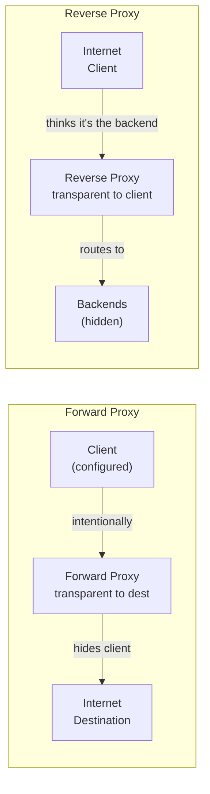
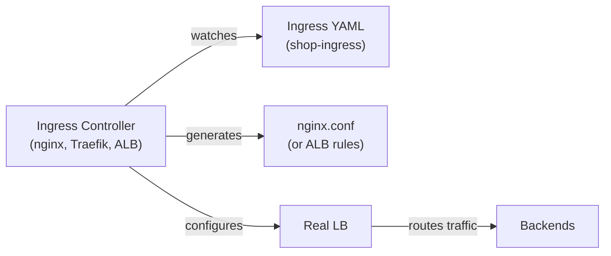

# Proxies, Ingress, and Egress Control

**Prerequisites:** [Load Balancing](load-balancing.md), [Kubernetes](../kubernetes/index.md)

[← Networking Overview](index.md)

---

## Why This Exists

**Forward proxy:** Client intentionally uses a proxy to hide their identity or route through a gateway.  
**Reverse proxy:** Backend hides behind a proxy; client doesn't know it exists.  
**Ingress:** How traffic *enters* a Kubernetes cluster.  
**Egress:** How traffic *leaves* a cluster.

Get these confused and you design architecture that cannot actually enforce policy.

---

## Forward Proxy vs. Reverse Proxy

### Forward Proxy (Client's Perspective)

```
Client → Forward Proxy → Internet
         (explicitly configured)
```

**Use cases:**
- **Corporate firewalls:** Employees' laptops must go through a corporate proxy to access the internet
- **Anonymization:** Hide client IP from destination (Tor, VPN)
- **Caching:** Proxy caches popular responses (CDN for internal networks)
- **Filtering:** Block malicious domains

**Client sees:**
```python
# Explicitly set proxy
requests.get("https://example.com", proxies={"https": "http://corporate-proxy:8080"})

# Or environment variable
export HTTPS_PROXY=http://corporate-proxy:8080
```

**Destination sees:** Proxy's IP, not client's IP.

### Reverse Proxy (Backend's Perspective)

```
Internet → Reverse Proxy → Backend servers
           (transparent to client)
```

**Use cases:**
- **Load balancing:** Distribute traffic across backends
- **TLS termination:** Proxy handles HTTPS; backend is HTTP
- **Request routing:** Route `/api` to API servers, `/media` to CDN
- **Caching:** Cache backend responses before sending to clients
- **WAF (Web Application Firewall):** Block malicious requests

**Client sees:** Only the proxy's IP.

**Backend never sees:** The client's IP (without a header like `X-Forwarded-For`).

### Visual Comparison



---

## Reverse Proxy Deep Dive

A reverse proxy sits between clients and backends, inspecting and modifying requests.

### What a Reverse Proxy Can Do

```python
# 1. TLS termination
# Client sends HTTPS to proxy
# Proxy decrypts, inspects, re-encrypts to backend (or sends plain HTTP)

# 2. Request routing (L7)
# GET /api/users → api-servers:8080
# GET /media/image.jpg → cdn-servers:8080
# POST /admin → admin-servers:8080

# 3. Request modification
# Add headers: X-Forwarded-For (client IP), X-Real-IP, X-Request-ID
# Remove headers: Server, X-Internal-ID
# Rewrite path: /api/v1/users → /users (backend is v1 only)

# 4. Response caching
# Cache GET /static/app.js for 1 hour
# Don't cache POST requests

# 5. Rate limiting
# Max 1000 requests/sec per IP

# 6. Access control (basic auth, IP whitelist)
# Only allow 10.0.0.0/8 to access /admin

# 7. Compression
# Compress responses with gzip if client accepts it

# 8. Health checks
# Periodically GET /health from each backend
# Stop routing if a backend fails checks
```

### Popular Reverse Proxies

| Proxy | Use Case | Example |
|-------|----------|---------|
| **nginx** | General-purpose, reverse proxy, load balancer | Most common; can handle 100k+ RPS on modern hardware |
| **HAProxy** | High-performance load balancing | Often paired with Keepalived for HA |
| **Envoy** | Service mesh sidecar, microservices proxy | Handles retries, timeouts, mTLS at the proxy level |
| **Traefik** | Kubernetes-native reverse proxy | Automatically discovers services from K8s annotations |
| **AWS ALB** | Cloud-native reverse proxy | Managed; integrates with ECS/EKS |
| **NGINX Plus** | Commercial nginx | Adds dynamic upstream configuration (reload without restart) |

### Real Example: nginx Reverse Proxy Config

```nginx
# Upstream backend pool
upstream api_backend {
    # Load balancing algorithm (default: round-robin)
    least_conn;  # or ip_hash, least_conn, etc.
    
    server api-1.internal:8080 max_fails=3 fail_timeout=30s;
    server api-2.internal:8080 max_fails=3 fail_timeout=30s;
    server api-3.internal:8080 max_fails=3 fail_timeout=30s;
}

# Cache configuration
proxy_cache_path /var/cache/nginx levels=1:2 keys_zone=api_cache:10m;

server {
    listen 443 ssl http2;
    server_name api.example.com;
    
    # TLS termination
    ssl_certificate /etc/ssl/cert.pem;
    ssl_certificate_key /etc/ssl/key.pem;
    ssl_protocols TLSv1.2 TLSv1.3;
    
    # Rate limiting
    limit_req_zone $binary_remote_addr zone=api_limit:10m rate=100r/s;
    limit_req zone=api_limit burst=200;
    
    # Proxy configuration
    location /api/ {
        # Add headers so backend knows client IP
        proxy_set_header X-Forwarded-For $remote_addr;
        proxy_set_header X-Forwarded-Proto $scheme;
        proxy_set_header X-Real-IP $remote_addr;
        proxy_set_header Host $host;
        
        # Proxy to backend pool
        proxy_pass http://api_backend;
        
        # Timeouts (critical!)
        proxy_connect_timeout 5s;
        proxy_send_timeout 60s;
        proxy_read_timeout 60s;
        
        # Caching
        proxy_cache api_cache;
        proxy_cache_valid 200 302 10m;
        proxy_cache_methods GET HEAD;
        proxy_cache_bypass $http_pragma $http_authorization;
    }
    
    # Health check endpoint
    location /health {
        access_log off;
        return 200 "ok";
    }
}
```

**Interview question:** "What happens if you set `proxy_read_timeout 30s` but the backend takes 60s to respond?"

Answer: "nginx waits 30s, then closes the connection with a 504 Gateway Timeout. The backend request continues running and completes 30s later, but the client never sees the response. This is the classic 'timeout without cleanup' problem. You need to coordinate timeouts: LB timeout < backend timeout, and both should be reasonable for your SLO."

---

## Kubernetes Ingress and Ingress Controllers

### The Problem Ingress Solves

Without Ingress:
```
User → AWS ALB (expensive, one per service)
       └→ Service → Deployment
       └→ Service → Deployment
       └→ Service → Deployment
```

Every service needs its own load balancer = expensive + complex.

With Ingress:
```
User → Ingress Controller (nginx, Traefik, AWS ALB)
       └→ Ingress objects (YAML, routing rules)
           └→ Route /api → api-service
           └→ Route /web → web-service
           └→ Route /admin → admin-service
```

### How Ingress Works

```yaml
# Ingress object: declare routing rules
apiVersion: networking.k8s.io/v1
kind: Ingress
metadata:
  name: shop-ingress
spec:
  ingressClassName: nginx  # Use the nginx controller
  tls:
    - hosts:
        - api.shop.com
      secretName: api-shop-cert
  rules:
    - host: api.shop.com
      http:
        paths:
          - path: /api/v1
            pathType: Prefix
            backend:
              service:
                name: api-service
                port:
                  number: 8080
          - path: /health
            pathType: Exact
            backend:
              service:
                name: api-service
                port:
                  number: 8080
    - host: web.shop.com
      http:
        paths:
          - path: /
            pathType: Prefix
            backend:
              service:
                name: web-service
                port:
                  number: 3000
```

### Ingress Controller: The Implementation

The Ingress **object** is just YAML. The **controller** watches Ingress objects and configures a real reverse proxy.



### Popular Ingress Controllers

| Controller | Type | Pros | Cons |
|-----------|------|------|------|
| **nginx-ingress** | Self-hosted | Simple, free, widely used | You manage the nginx pods |
| **Traefik** | Self-hosted | Dynamic, supports multiple backends | More complex than nginx |
| **AWS ALB Ingress** | Managed | AWS integrates with security groups, IAM | Expensive; vendor lock-in |
| **GCP Cloud Load Balancer** | Managed | Managed; scales automatically | Expensive |
| **Cert-Manager** | Not really a controller, but complementary | Auto-renews TLS certs via Let's Encrypt | One more thing to manage |

### What Can Go Wrong

**Problem 1: Ingress points to Service that doesn't exist**
```yaml
backend:
  service:
    name: api-service-typo  # ← This service doesn't exist
    port:
      number: 8080
# Result: User gets 502 or 503
```

**Problem 2: Service selector doesn't match any Pods**
```yaml
# Service has no endpoints
spec:
  selector:
    app: api  # ← No pods with this label
  ports:
    - port: 80
      targetPort: 8080
# Result: User gets 502 or 503
```

**Problem 3: Ingress controller wasn't installed**
```
You write Ingress YAML.
You expect a reverse proxy to appear.
Nothing happens (because no Ingress controller is running).
User sees "connection refused."
```

---

## Egress: How Traffic Leaves the Cluster

### The Problem

By default, all pods can connect to anywhere outside the cluster. An attacker inside the cluster can:
- Exfiltrate data to external servers
- Download malware
- Connect to C&C servers

Solution: **Egress control** (restrict outbound traffic).

### Methods

**1. Network Policy (K8s)**

```yaml
# Block all egress except DNS and specific services
apiVersion: networking.k8s.io/v1
kind: NetworkPolicy
metadata:
  name: checkout-egress
spec:
  podSelector:
    matchLabels:
      app: checkout
  policyTypes:
    - Egress
  egress:
    # Allow DNS (required for service discovery)
    - to:
        - namespaceSelector: {}
      ports:
        - protocol: UDP
          port: 53
    # Allow egress to payment service
    - to:
        - podSelector:
            matchLabels:
              app: payment-service
      ports:
        - protocol: TCP
          port: 8080
    # Allow HTTPS to external services
    - to:
        - podSelector: {}  # Any pod
      ports:
        - protocol: TCP
          port: 443
```

**2. Egress Gateway (Istio, Cilium)**

```yaml
# All external traffic goes through a gateway pod
# Gateway pod checks and logs all egress
apiVersion: networking.istio.io/v1alpha3
kind: EgressGateway
metadata:
  name: main-egressgateway
spec:
  selector:
    istio: egressgateway
  servers:
    - port:
        number: 443
        name: https
        protocol: HTTPS
      hosts:
        - example.com
---
apiVersion: networking.istio.io/v1alpha3
kind: VirtualService
metadata:
  name: external-api
spec:
  hosts:
    - api.example.com
  http:
    - route:
        - destination:
            host: api.example.com
            port:
              number: 443
          weight: 100
```

**3. Firewall Rules (Cloud Provider)**

```
# AWS Security Group outbound rules
Rule 1: Allow HTTPS to 1.2.3.4 (payment provider)
Rule 2: Allow HTTP to 8.8.8.8 (DNS)
Rule 3: Deny all other egress
```

---

## AAA (Authentication, Authorization, Accounting) in Proxy Context

**AAA** is a framework for access control:

- **Authentication (AuthN):** Who are you?
- **Authorization (AuthZ):** What are you allowed to do?
- **Accounting:** Log what you did (audit trail)

### Where AAA Fits

A reverse proxy can enforce AAA *before* requests reach backends:

```
Client request
    ↓
Proxy: Who is this? (Authentication)
    ├─ Check API key, JWT, mTLS certificate
    ├─ Reject if invalid
    ↓
Proxy: Are they allowed? (Authorization)
    ├─ Check roles/permissions
    ├─ Reject if unauthorized
    ↓
Backend (trusted)
    ↓
Proxy + Accounting log
    ├─ Log: user_id, endpoint, timestamp, status
```

### Example: API Key Authentication at Proxy

```nginx
# nginx authenticating with API keys
upstream backend {
    server backend:8080;
}

server {
    listen 443 ssl;
    
    location /api/ {
        # Check API key in Authorization header
        if ($http_authorization !~ ^Bearer\ .+$) {
            return 401 "Missing or invalid Authorization header";
        }
        
        # Extract key and validate (in production, check against a service)
        set $api_key $http_authorization;
        # $api_key is now "Bearer xyz123"
        
        # Log the access (accounting)
        access_log /var/log/nginx/api_access.log 
                   '$remote_addr - $api_key - $request - $status';
        
        # Proxy to backend
        proxy_pass http://backend;
    }
}
```

### Example: mTLS at Proxy (Authorization)

```
Client with valid cert
    ↓
Proxy: Do I trust this certificate? (AuthN)
    ├─ Check client cert is signed by our CA
    ├─ Check cert hasn't expired
    ├─ Reject if invalid
    ↓
Proxy: What can this client do? (AuthZ)
    ├─ Extract CN or SAN from cert
    ├─ Map to role (e.g., CN="payment-service" → role="payment")
    ├─ Check role has permission for this endpoint
    ↓
Backend
```

---

## Real-World Case: Payment API Gateway

**Requirements:**
- External clients call `api.shop.com/pay`
- Only authorized partners can call (API key + IP whitelist)
- All requests are logged (audit trail)
- Rate-limit to 100 RPS per partner
- TLS termination at gateway

**Architecture:**

```
Partner
    ↓ HTTPS
Reverse Proxy (nginx)
    ├─ TLS termination
    ├─ Extract API key from header
    ├─ Check rate limit
    ├─ Check IP whitelist
    ├─ Log request (accountinging)
    ↓
Payment Service (internal, HTTP only)
    └─ Trusts proxy did the auth
```

**Config:**

```nginx
upstream payment_api {
    server payment-service:8080;
}

# Rate limiting per API key
limit_req_zone $http_authorization zone=api_limit:10m rate=100r/s;

server {
    listen 443 ssl;
    server_name api.shop.com;
    ssl_certificate /etc/ssl/cert.pem;
    ssl_certificate_key /etc/ssl/key.pem;
    
    # Structured logging for audit
    log_format payment '$remote_addr - $http_authorization - $request - $status - $response_time';
    access_log /var/log/nginx/payment.log payment;
    
    location /pay {
        # Authentication: check API key
        if ($http_authorization !~ ^Bearer\ [a-z0-9]+$) {
            return 401 "Invalid API key";
        }
        
        # Authorization: check IP whitelist (mock)
        # In production, this would query a database
        set $ip_allowed "0";
        if ($remote_addr ~ ^203\.0\.113\.) {  # Partner's CIDR
            set $ip_allowed "1";
        }
        if ($ip_allowed = "0") {
            return 403 "IP not whitelisted";
        }
        
        # Rate limiting
        limit_req zone=api_limit burst=10 nodelay;
        
        # Add metadata headers for backend
        proxy_set_header X-API-Key $http_authorization;
        proxy_set_header X-Client-IP $remote_addr;
        
        # Proxy to backend (backend trusts we did auth)
        proxy_pass http://payment_api;
    }
}
```

---

## Interview Questions

=== "Foundation"
    **Q: What's the difference between a forward proxy and a reverse proxy?**
    
    "A forward proxy is configured by the client and hides the client's IP from the destination (like a corporate proxy or VPN). A reverse proxy sits between clients and backends, and the client doesn't know it's there — it hides the backend's IP from the client. Forward proxy: client sees it. Reverse proxy: backend sees it."

=== "Senior"
    **Q: You set up an Ingress object pointing to a Service, but users get 502. How do you debug?**
    
    "First, I'd check if the Ingress controller is running (`kubectl get pods -l app=ingress-nginx`). Then I'd check if the Ingress was reconciled (look at `kubectl describe ingress shop-ingress` for any errors). Then I'd verify the Service exists and has endpoints: `kubectl get svc service-name` and `kubectl get endpoints service-name`. If Endpoints is empty, the Service selector doesn't match any pods — I'd check pod labels. If the Ingress and Service are fine, I'd check the controller's logs to see what it generated (usually stored in a ConfigMap or visible in the controller logs). Finally, I'd curl the Ingress IP directly to see if it's a DNS or proxy issue."

=== "Staff"
    **Q: Design an egress control system for a microservices cluster where services should only talk to approved external APIs.**
    
    "I'd start with Kubernetes NetworkPolicy for deny-all egress, then allowlist specific external IPs/domains. But NetworkPolicy is IP-based, which breaks if a domain changes IPs. For production, I'd use an egress gateway: all external traffic goes through a centralized pod that checks a policy database (allowed destinations per service). The gateway logs every external call (accounting), and I can easily update policies without redeploying. Alternatively, use Istio's EgressGateway for similar behavior with less custom code. The key insight is that NetworkPolicy alone is brittle; you need an application-level gateway if you care about domains, not IPs."

---

## Key Takeaways

!!! success "Remember"
    1. **Forward proxy** hides client; **reverse proxy** hides backend
    2. **Reverse proxy** can do: TLS termination, routing, caching, rate limiting, auth
    3. **Ingress** is K8s YAML; **Ingress controller** is the reverse proxy that implements it
    4. **Egress control** requires NetworkPolicy + egress gateway for production
    5. **AAA at the proxy** means auth happens before traffic reaches backends (backends can be less trusted)
    6. **X-Forwarded-For** header preserves client IP through proxies (but can be spoofed; verify at the edge)
    7. **Timeouts**: LB timeout < backend timeout < client timeout (prevent hangs)
    8. **Ingress pointing to nonexistent Service** = 502 (debug with `kubectl get endpoints`)

**Previous:** [Load Balancing](load-balancing.md)
