# Real-Time Communication — WebSockets, Long Polling, SSE, Webhooks

**Prerequisites:** [HTTP & TCP Deep Dive](http-tcp.md), [Load Balancing](load-balancing.md)

[← Networking](index.md)

---

## Why This Exists

Plain HTTP is request-response: the client asks, the server answers, the connection's job is done. That model breaks the moment the server needs to tell the client something *without being asked* — a chat message arriving, a price ticking, a background job finishing. Several patterns exist to bridge that gap, and they get reached for almost interchangeably in interviews ("we'll use WebSockets" as a reflex) when they actually have real, different server-side costs: **connection lifetime, how many of them a single server can hold open, and what that does to your load balancer.** This page is deliberately about that side — the backend mechanics of holding a connection open and pushing through it, not the client-side API surface.

---

## The Four Patterns, By Who Initiates and What Stays Open

```mermaid
flowchart TB
    subgraph LP["Long Polling"]
        C1["Client"] -->|"GET /updates (blocks)"| S1["Server holds request<br/>open until data or timeout"]
        S1 -->|"response, then client<br/>immediately reconnects"| C1
    end
    subgraph SSE["Server-Sent Events"]
        C2["Client"] -->|"GET /stream (Accept: text/event-stream)"| S2["Server keeps ONE<br/>HTTP response open,<br/>streams events down it"]
    end
    subgraph WS["WebSockets"]
        C3["Client"] <-->|"persistent, bidirectional<br/>connection after HTTP Upgrade"| S3["Server"]
    end
    subgraph WH["Webhooks"]
        S4["Service A<br/>(event happens)"] -->|"POST to a URL<br/>Service B registered"| S5["Service B"]
    end
```

- **Long polling:** the client makes a normal HTTP request; the server just doesn't respond immediately — it holds the connection open until there's data to send (or a timeout), then the client immediately re-requests. It's real-time-ish HTTP request/response repeated in a loop, not a fundamentally different transport. **Server cost:** one held-open request per waiting client, same as any slow request — but at scale, that's a lot of threads or event-loop slots sitting idle-but-occupied, waiting for data that might not come for a while.
- **Server-Sent Events (SSE):** one HTTP response, kept open indefinitely, over which the server streams a sequence of events as plain text (`text/event-stream`). It's still plain HTTP under the hood — works through normal HTTP infrastructure, reconnects automatically on the client side per the spec, and browsers cap the number of concurrent SSE connections per origin. **One-directional only** — the server pushes, the client can't send anything back over the same connection (it goes back to normal HTTP requests for that).
- **WebSockets:** starts as an HTTP request that upgrades the connection to a persistent, full-duplex TCP-like channel — both sides can send at any time, with much lower per-message overhead than repeated HTTP requests (no headers re-sent every message). **This is the only one of the four that's genuinely bidirectional over one connection**, which is why it's the default reach for chat and collaborative editing — but it's also the most expensive to hold at scale, and the hardest to route through infrastructure that assumes short-lived requests.
- **Webhooks:** not a client-server real-time pattern at all — it's **server-to-server**, and it inverts who's the "server" in the usual sense. Service A registers a URL with Service B; when an event happens on B's side, B makes an outbound HTTP request *to* A. This is the standard pattern for third-party integrations (a payment provider notifying your backend that a charge succeeded) — no held-open connection on either side, just a normal request triggered by an event instead of a client action.

---

## The Backend Cost That Actually Decides This

The question that should drive the choice isn't "which feels more real-time" — it's **how many connections does this hold open simultaneously, and what does your server/infra actually do with an idle-but-open connection.**

| | Connections held open per active client | Load balancer implication | Typical ceiling per server |
|---|---|---|---|
| Long polling | One HTTP request, cycling | Any LB handles this — it's just a slow request, no special routing needed | Bound by thread/worker pool size in a thread-per-request model; much higher in an async/event-loop server |
| SSE | One open HTTP response | Needs a proxy/LB configured not to buffer or time out long-lived responses (`proxy_buffering off`, generous read timeout) | High with an async server (idle connections are cheap in an event loop); low in a thread-per-connection model |
| WebSockets | One persistent duplex connection | The upgrade request must reach a WebSocket-capable backend; after upgrade, that connection is already bound to the selected instance. Cross-instance delivery usually needs pub/sub; reconnect affinity is a separate, optional choice when session state is node-local | Similar order of magnitude to SSE; the real ceiling depends on framework overhead, per-connection buffers, heartbeats, TLS, and message rate—not merely whether the channel is duplex |
| Webhooks | Zero — no held-open connection at all | None — it's a normal outbound HTTP call per event | Not connection-bound; bound by outbound request rate and the receiver's availability |

!!! warning "Connection routing and event routing are different problems"
    A WebSocket lives on exactly one server instance for its lifetime; the load balancer does not independently route each frame, so an established connection does not need sticky-session machinery to remain on that instance. The scaling problem is delivering an event produced elsewhere to the instance that owns the recipient's socket. A fan-out mechanism (Redis pub/sub or a message broker) bridges "the event happened on instance A" to "the recipient's socket is on instance B." Affinity can still help a reconnect return to node-local session state, but it neither replaces fan-out nor guarantees that a disconnected client returns to a healthy former instance. Prefer externalized session state when reconnects must work across the fleet.

---

## Choosing Between Them

- **Need the server to notify the client, one direction, and want to reuse plain HTTP infrastructure (proxies, auth, standard load balancers)?** SSE — it's the lowest-complexity option that's still genuinely push-based, and browsers handle reconnection for you.
- **Need true bidirectional, low-latency exchange (chat, live cursors, multiplayer state)?** WebSockets — but budget for fleet-wide connection discovery/fan-out and reconnect behavior from day one. Add affinity only if there is a deliberate node-local-state requirement.
- **Infrastructure (corporate proxies, older load balancers, some serverless platforms) doesn't reliably support indefinite streaming connections?** Long polling — it uses ordinary HTTP requests that eventually complete, while still letting the server respond as soon as data arrives. The cost is request/reconnect churn and a small blind spot between one response completing and the next request being established, not latency equal to a fixed polling interval.
- **Notifying another *service*, not a browser client, about an event?** Webhooks — no connection to hold at all; the trade-off moves to delivery guarantees (see below) instead of connection scaling.

---

## Webhooks: The Delivery-Guarantee Problem

Because a webhook is just an outbound HTTP call triggered by an event, HTTP itself provides no end-to-end delivery guarantee. Without retries, the sender makes an at-most-once attempt and may lose the notification. With retries, delivery becomes more resilient but duplicates become possible: after a timeout, the sender cannot tell whether the receiver failed before processing or processed successfully and lost the response. This is the same ambiguous-outcome/idempotency problem as [retried remote calls](../distributed-systems/index.md#idempotency-the-one-tool-that-makes-retries-safe), and it resembles the duplicate-delivery behavior commonly handled around [message queues](../messaging/patterns.md).

- **Retries need to be idempotent-safe on the receiving end** — the same webhook (an "order paid" event) delivered twice because a retry raced a slow-but-successful first attempt shouldn't double-process. The standard fix: an event ID in the payload, deduplicated on the receiving side, same discipline as any other idempotency key.
- **Signature verification** — since a webhook endpoint is a public URL that accepts POST requests, anyone who finds the URL can send a forged payload unless the receiver verifies a signature (typically an HMAC over the payload, using a shared secret) proving the request actually came from the claimed sender.
- **Retry backoff and eventual dead-lettering** — if the receiver stays unreachable, the sender needs a bounded retry policy (exponential backoff, capped retries) and a way to surface "this webhook has been failing for N hours" rather than retrying forever or silently dropping it — the same dead-letter-queue discipline covered in [Message Queue Patterns](../messaging/patterns.md).

---

## Interview Questions

=== "Foundation"
    **Q: What's the core difference between long polling and Server-Sent Events?**

    "Long polling is a loop of normal HTTP requests — the client asks, the server holds the request open until it has data, responds immediately when data arrives, and the client then asks again. SSE is one HTTP response that stays open indefinitely, with the server streaming events down it as they happen. Both can deliver an available event promptly; SSE avoids the repeated request/reconnect cycle and its brief gaps, but it is still one-directional, server-to-client only. Long polling is often easier to use with infrastructure that does not support indefinite streaming connections reliably."

=== "Senior"
    **Q: Your team is scaling a WebSocket-based notification service from one instance to a fleet. What breaks, and how do you fix it?**

    "A WebSocket connection lives on one specific server instance — the client's connection is with that instance, not the fleet. Once upgraded, its frames already travel over that same connection; the load balancer does not choose a backend per message. What breaks at fleet scale is event routing: an event produced on instance A cannot directly reach a socket owned by instance B. The usual fix is a fan-out layer — Redis pub/sub or a message broker — plus a connection registry or subscription scheme so the owning instance receives 'deliver this to user X.' Reconnects are a separate concern: clients need backoff and session resumption, while session state should usually be externalized. Sticky affinity is optional when reconnecting to the same node has a specific benefit, not a substitute for fan-out."

=== "Staff"
    **Q: A partner integration relies on webhooks to notify your backend of payment events, but you're seeing occasional duplicate charges processed. Diagnose and fix.**

    "Duplicate processing from a webhook almost always means the receiving endpoint isn't idempotent against redelivery — the sender's retry policy fired because it didn't get a timely ack (maybe the first delivery actually succeeded but was slow, or the ack itself got lost), and the receiver processed the same event twice because it had no way to recognize it had already seen this specific event. The fix is the same idempotency discipline used everywhere else for retried remote calls: extract a unique event ID from the webhook payload (most providers include one), and before processing, check whether that ID has already been handled — store it with the processing result, and on a repeat, return the stored result instead of reprocessing. I'd also verify the endpoint's ack behavior — if processing is slow enough that the sender's timeout fires before an ack is sent, that's the actual root cause generating the retries in the first place, and fixing the idempotency check treats the symptom without addressing why retries are happening at that volume."

---

## Key Takeaways

!!! success "Remember"
    1. **The deciding factor is connection cost, not "which feels more real-time"** — how many connections stay open, and what your infra (load balancer, proxy timeouts) does with a long-lived one.
    2. **Only WebSockets are genuinely bidirectional over one connection** — SSE and long polling are server-to-client only; a client still needs a normal request to send data back.
    3. **WebSocket connection routing and event routing are separate concerns** — an established connection stays on its accepting instance automatically; fleet-wide delivery needs fan-out, while reconnect affinity is optional and depends on where session state lives.
    4. **Webhooks are server-to-server HTTP calls with no inherent delivery guarantee** — retries improve delivery but create duplicate-processing risk, so production receivers need idempotency and signature verification.
    5. **SSE is the underused middle option** — genuinely push-based, works over plain HTTP infrastructure, and far simpler to operate than WebSockets when you only need one direction.

**Back to:** [Networking](index.md)
