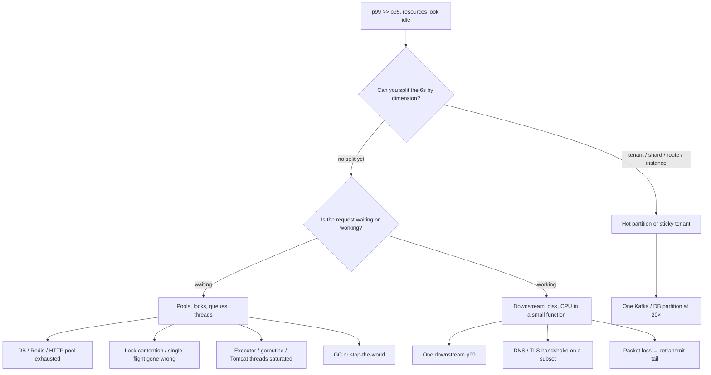

# Production Debugging Playbook

**Audience:** on-call seniors | **Use:** war-room first 15 minutes, and interview “walk me through this outage”

You do not start with a definition of p99. You start with a page that looks *almost* fine.

---

## A. Debugging High p99

**The page:** p50 = **80ms**, p95 = **180ms**, p99 = **6s**. CPU 40%. Memory flat. Primary DB CPU 25%, no lock waits on the top query dashboard. Error rate 0.2%. Deploy was 40 minutes ago.

Most of the traffic is healthy. A thin tail is in another universe. That is not “the service is slow.” That is **a subset of work taking a different path**.

!!! abstract "Mental Model"
    p99 is a mixture. Either a rare code path (cold cache, one shard, one tenant, one downstream), or a **queue** (pool, lock, GC, thread, TCP) that only the last requests sit in. Averages will lie. You need a dimension that separates the 6s from the 80ms.

### What do you inspect next?

Not “add more pods.” Not “the DB is fine so it’s the network.” Walk this tree:



=== "Pool exhaustion"
    **Why idle CPU + huge p99:** threads sit on `borrow()` while the pool is at max. The pool dashboard — not host CPU — is the truth.
    **Signals:** `hikari.connections.active == max`, Redis `connected_clients`, `httpclient.pending`, wait time >> execute time on traces.
    **Check next:** leak (connection not returned), slow downstream holding connections, pool sized for p50.

=== "Lock contention"
    One synchronized stripe / one row / one Redis key. 99% of keys are instant; the hot key waits seconds.
    **Signals:** traces stack on `lock`, `SELECT … FOR UPDATE`, Redis `CLIENT PAUSE` / hot key ops. p99 only for one `customer_id`.

=== "Downstream latency"
    Your p99 *is* their p99 plus queueing. DB can look fine if the 6s is Stripe, S3, or an internal neighbor.
    **Signals:** client span duration; their RED metrics; timeout settings equal to 6s (you are waiting the full timeout).

=== "GC / STW"
    Process looks “not busy” between pauses. p99 aligned across *all* endpoints on one pod.
    **Signals:** `jvm.gc.pause` p99, Go `debug=gctrace`, allocation rate, sawtooth heap. Only some pods if traffic is uneven.

=== "Queue depth / thread saturation"
    Ingress accepts work faster than the executor runs it. p50 still in-thread; p99 sat in the queue.
    **Signals:** executor queue length, load shedding not armed, `time_in_queue` histogram.

=== "Packet loss / DNS"
    Rare retransmit or a 5s DNS timeout on a subset of clients / AZs.
    **Signals:** `tcprtt`, retransmit counters, DNS latency histogram, AZ-skewed p99. App metrics look innocent.

=== "Hot partitions"
    One tenant, one `user_id` shard, one Kafka partition. Cluster averages are green.
    **Signals:** per-partition QPS, per-shard p99, top-K keys. See scenario below.

!!! tip "Interview Insight 🎯"
    The winning sentence is: *“p50 healthy means the common path is fine; I will break p99 by tenant, instance, route, and wait vs work.”* Then name two signals per branch.

### First 10 minutes (order)

1. **Confirm the window** — is p99 a spike or a step change at the deploy?
2. **RED + saturation** — RPS, errors, pools, GC, queue depth. CPU 40% does not close anything.
3. **Break the histogram** — by route, instance, AZ, tenant hash, downstream span.
4. **Trace 10 slow requests** — not one. Look for a shared wait.
5. **Mitigate** before a perfect RCA: shed the hot tenant, roll back, raise the pool *only* if you know why it emptied.

---

## B. Diagnosing Kafka Consumer Lag

**The page:** consumer group is **Running**. Members are assigned. Produce rate is normal. **Committed offsets are frozen** — the same offset for 12 minutes. Lag = `log_end - committed` only grows.

“Restart the pods” is how you turn a poison message into a rebalance storm.

```mermaid
flowchart TD
    L[Offsets frozen, state=Running] --> H{Heartbeat / join rate?}
    H -->|joins every few seconds| R[Rebalance storm]
    H -->|stable membership| P{Is max(partition offset) moving?}
    P -->|log end stuck too| U[Producer / leader / disk]
    P -->|log end climbing| C{Is the consumer processing?}
    C -->|busy, no commit| W[Processing slower than produce / stuck handler]
    C -->|one partition only| X[Poison message or hot partition]
    C -->|all paused, CPU 0| G[STW, deadlock, blocked on downstream]
    R --> R1[session.timeout vs max.poll.interval]
    W --> W1[slow DB, retry loop, stop-the-world GC]
```

=== "Rebalance storms"
    Every join resets ownership; work in flight is abandoned; offsets never commit.
    **Signals:** `rebalance_rate`, `last_rebalance_age_seconds` tiny, `JoinGroup` in broker logs, pods flapping readiness.
    **Usual cause:** `max.poll.interval` shorter than the worst handler; processing in `poll` loop; GC > session timeout.

=== "Poison message"
    One offset throws forever. That partition freezes; others may still move (so *group* lag looks “uneven”).
    **Signals:** error log on the same offset, `records_consumed` incrementing 0 or 1, DLQ empty (you never built one).

=== "Processing < produce"
    Consumers are honest and losing. Offsets move, just slower than log end — if they are *frozen*, this is not sufficient unless the handler blocks before commit.
    **Signals:** handler p99, downstream pool, `records_lag` growing on *all* partitions equally.

=== "ISR / disk / broker"
    Leader slow or replica fetch starved. Consumer cannot read.
    **Signals:** under-replicated partitions, ISR shrink, broker disk > 85%, `request_handler_avg_idle` ≈ 0.

=== "Stop-the-world / deadlock"
    JVM pause or a lock in the handler. Heartbeats die → *then* it becomes a rebalance story.
    **Signals:** GC logs, thread dump: all threads on one lock / one HTTP call without timeout.

!!! warning "Production Trap ⚠️"
    `max.poll.interval.ms` and `session.timeout.ms` are not synonyms. A live heartbeat with a blocked poll still gets kicked for poll interval. Tuning one and not the other is a standard self-inflicted outage.

---

## What Happens in Production?

Same template every time: **symptoms → causes → signals → diagnosis → mitigation → fix → prevention.**

### 1. One partition at 20× traffic

| | |
|--|--|
| **Symptoms** | Global p99 up; 5/6 Kafka partitions idle; one consumer pod at 90% CPU; others at 10%. |
| **Causes** | Key = `tenant_id` for a whale; hot group chat; time-bucket key collapsed to now(). |
| **Signals** | `bytes_in` per partition; consumer CPU per pod; produce key histogram. |
| **Diagnosis** | Confirm 20× on one `partition_id`. Correlate with one tenant in traces. |
| **Mitigation** | Isolate the tenant (dedicated topic or throttle). Scale *that* consumer. Do not autoscale the whole group blindly (rebalance). |
| **Fix** | Salting / two-level keys; break the whale into N keys with a fan-in table. |
| **Prevention** | Per-partition lag and QPS alerts, not only group lag. Load tests with a power-law keyspace. |

### 2. Redis loses half its nodes

| | |
|--|--|
| **Symptoms** | Timeout spike, then either thundering 429s or a cache stampede on the DB. Half of `CLUSTER SLOTS` missing during failover. |
| **Causes** | AZ loss, bad `CLUSTER FAILOVER`, OOM evictions that look like “loss.” |
| **Signals** | `cluster_state`, `connected_slaves`, error `MOVED`/`CLUSTERDOWN`, DB QPS cliff up. |
| **Diagnosis** | Is it slots unavailable, or just latency? Are we fail-open? |
| **Mitigation** | Shed non-critical reads; serve stale cache; disable expensive endpoints; block reconnect storms. |
| **Fix** | Replica promotion, restore slots, warm hottest keys. |
| **Prevention** | Multi-AZ replicas, client timeouts < SLO, request coalescing, known fail-open/closed matrix ([rate limiter](../system-design-exercises/rate-limiter.md)). |

### 3. Replication lag 25 minutes

| | |
|--|--|
| **Symptoms** | Users see missing rows they just wrote; “ghost delete”; catch-up APIs return holes that later fill. Primary fine. |
| **Causes** | Replica overloaded by analytics; large transaction; network; someone pointed chat catch-up at the replica. |
| **Signals** | `pg_last_xact_replay_timestamp`, MySQL `Seconds_Behind_Master`, 25 min flat. |
| **Diagnosis** | Writer path vs reader path. If product requires read-your-writes, this is a **routing bug**, not “eventual consistency.” |
| **Mitigation** | Steer user-facing reads to primary; cancel heavy replica queries; pause replica-side ETL. |
| **Fix** | Catch up, or rebuild replica from snapshot if it cannot. |
| **Prevention** | Lag SLO alerts at 5s for user-facing replicas; session-sticky to primary after write; separate analytics replicas. |

### 4. p50 = 90ms, p99 = 14s

| | |
|--|--|
| **Symptoms** | Same shape as Module A, worse tail. Often after a “harmless” timeout increase to 15s. |
| **Causes** | You are now *waiting* 14s for a dead downstream instead of failing at 2s. Or a pool wait that equals `connectionTimeout`. |
| **Signals** | Trace: 14s parked on one span; timeout config == 14–15s; pool wait histogram. |
| **Diagnosis** | Tail equals a configured wait. That is a clue, not a coincidence. |
| **Mitigation** | Drop the timeout back; fail fast; circuit-break the dependency. |
| **Fix** | Fix the dependency or remove it from the synchronous path. |
| **Prevention** | Timeouts budgeted from the SLO inward; never raise a timeout to “stop the errors” without a deadline budget. |

### 5. Pods healthy, Service has no endpoints

| | |
|--|--|
| **Symptoms** | Kube pods `Ready 1/1`. Service `Endpoints: 0`. Callers get connection refused or i/o timeout. LB health may still be green on another target group. |
| **Causes** | Selector mismatch after a label rename; `readinessProbe` never added to the new port; `publishNotReadyAddresses` forgotten for a headless StatefulSet; wrong namespace. |
| **Signals** | `kubectl get endpoints`; `endpoint_slices`; compare pod labels to Service selector; kube-proxy / Cilium drops. |
| **Diagnosis** | Workload is healthy; **discovery** is empty. App dashboards stay quiet because no traffic arrives. |
| **Mitigation** | Point the Service selector back; or send traffic to a known-good Service. |
| **Fix** | Restore label contract; add a CI check that selector ⊆ pod labels. |
| **Prevention** | Alert `endpoints == 0` while `desired_replicas > 0`. Canary must exercise the Service DNS name, not localhost. |

### 6. Retries multiply an outage

| | |
|--|--|
| **Symptoms** | Downstream p99 bad → your error rate up → *their* QPS 5–10× → total collapse. Your CPU still 40% (you are waiting). |
| **Causes** | Retry 3× on timeout without budget; no jitter; all clients share the same 1s cadence; gateway + service + SDK each retry. |
| **Signals** | Outbound QPS >> inbound QPS; retry counters; correlated 429/503. |
| **Diagnosis** | Draw the retry stack. If three layers retry 3×, one user click is 27 calls. |
| **Mitigation** | Kill retries at the edge; shed load; increase downstream *only* after retries stop. |
| **Fix** | One retry policy for the call chain; hedged requests only with a cap; 429 honored. |
| **Prevention** | Chaos: timeout the dependency and watch outbound QPS. Budget retries in the SLO. |

### 7. Consumers running, offsets frozen

| | |
|--|--|
| **Symptoms** | Module B’s page. Group `Stable` or flapping. Lag line is a ramp. |
| **Causes** | Poison offset; handler blocked; commit disabled after a “perf” change; `enable.auto.commit=false` and an exception before `commitSync`; rebalance loop. |
| **Signals** | Per-partition lag (one vs all); handler traces; commit meter = 0; join rate. |
| **Diagnosis** | If *one* partition: poison or hot key. If *all* and CPU 0: deadlock/STW. If *all* and CPU high: too slow or retrying. If membership flaps: rebalance. |
| **Mitigation** | Pause the group (stop the bleed on downstream). Seek+DLQ the poison offset. Freeze producers if lag threatens disk. |
| **Fix** | Repair handler; restore commit; tune poll interval after the handler is safe. |
| **Prevention** | Per-partition lag alerts, poison DLQ, timeouts on every outbound call in a handler, load test with a bad record. |

---

### Worked example — the 6s page, minute by minute

You have the Module A symptoms. Here is a senior walk, not a toolbox dump.

1. **Minute 0–2.** Confirm it is not a scrape artifact: compare two AZs, two clients. Histogram is a cliff at ~6s, not a ramp — smells like a **timeout or pool wait**, not a slow algorithm.
2. **Minute 2–4.** Split: one route (`POST /checkout/confirm`) owns the tail. One downstream span, `psp.authorize`, is 5.9s when it is slow and 70ms when it is fast. DB spans stay 12ms. CPU 40% is now explained: **threads are blocked in the client**.
3. **Minute 4–6.** Pool: `http-psp.active = 200/200`, `pending = 140`. You did not have a PSP outage dashboard, so you thought “DB is fine.” The 0.2% errors are only the calls that exceeded 6s; everyone else is still in the pool line.
4. **Mitigate.** Cut checkout to a “pending payment” path; drop PSP timeout 6s → 800ms; open the circuit. p99 falls to 900ms (fail-fast) in four minutes. Conversion is hurt less than a 6s hang.
5. **Fix / prevent.** PSP was rate-limiting *you* after a retry change (scenario 6). One retry policy, pool sized to `timeout × rps`, alert on `pool.pending > 0`.

That is the standard: **dimension → wait vs work → mitigate the wait → then the vendor.**

### Kafka: frozen offset vs slowly losing

Interviewers mash these together. Do not.

| Picture | Offset meter | Lag | Meaning |
|---------|--------------|-----|---------|
| Frozen | flat | ramp | Not committing — poison, deadlock, or rebalance |
| Losing | climbing, slower than log end | ramp | Healthy but under-provisioned |
| Stuck log end | flat | flat | Producer or leader dead — not a consumer bug |
| One partition frozen | mixed | mixed | Poison / hot key — do not restart the group |

Commit path to recite: `poll` → process → `commit` (auto or sync). If you process and crash before commit, **at-least-once** redelivers. If you commit then crash mid-batch, you skip. Frozen commits with a live handler almost always means the handler **never returns**.

---

## Debugging habits that survive contact with prod

!!! abstract "Staff Engineer Lens"
    Stabilize **user-visible** pain first (shed, roll back, fail fast). Assign one person to RCA and one to comms. Do not hold the mitigation hostage to a perfect root cause. Write the timeline while it is cheap.

| Do | Do not |
|----|--------|
| Split the tail by a dimension | Average two more dashboards |
| Compare wait time vs work time | “CPU is 40% so we need more pods” |
| Change one thing, watch one signal | Restart Redis, Kafka, and the app together |
| Capture traces *during* the event | Reproduce tomorrow on staging only |

---

## Interview follow-ups

1. **“CPU is only 40%, so we should scale out.”** No — scale-out adds more waiters if the bottleneck is a pool or one partition. Split the tail first.
2. **“Would you increase the Kafka `max.poll.interval`?”** Only after the handler has a timeout. Raising the interval on a poison loop hides the freeze for longer.
3. **“Pods are green.”** Ask for Endpoints, not `kubectl get pods`. Green pods plus zero endpoints is a discovery outage.
4. **“How do you know it is packet loss?”** AZ-skewed p99, retransmit counters, app traces with no slow span. If every span is fast and the client still saw 6s, look below the process.

---

## Self-Assessment

- [ ] I can name five causes of a 6s p99 with a 80ms p50 and idle CPU
- [ ] I know pool wait from downstream work on a trace
- [ ] I will not restart a Kafka group before checking per-partition lag
- [ ] I treat `Endpoints: 0` as a first-class outage class
- [ ] I can explain how three retry layers multiply a blip into a brownout
