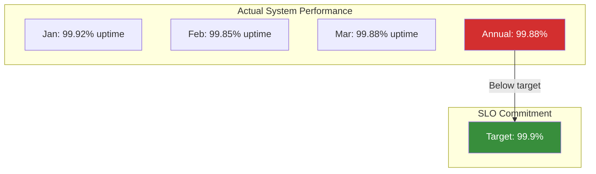
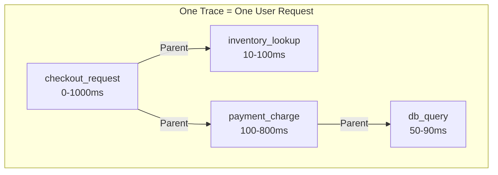

# Observability

You cannot debug what you cannot see. Start from the symptom, not the dashboard wallpaper.

---

## Why This Exists

At 3 a.m. the page fires: **"checkout p99 is 8 seconds."** You have forty dashboards. Which do you open?

Most engineers open the one they built, or the one they remember. They browse charts hoping something looks wrong, find a spiky graph, and start theorizing about it — usually the wrong graph, because in a system of any size *something* always looks spiky.

Observability is not "we have dashboards." It is the property that **you can answer a question you did not anticipate**, without shipping new code. Monitoring tells you *that* something is broken; observability lets you find out *why* when the cause is something nobody predicted.

The difference shows up precisely during novel incidents — which is to say, the ones that actually hurt.

---

## Mental Model: The Three Pillars Answer Different Questions

```
        METRICS                 TRACES                    LOGS
        ───────                 ──────                    ────
   "Is something wrong?"   "Where is it slow?"    "What exactly happened?"

   Cheap, aggregated       One request's full     Full detail for
   Numbers over time       path across services   a specific event
   Alert on these          Find the slow hop      Read after you know
                                                  where to look
   p99 = 8s ──────────────→ auth: 12ms
   (something is wrong)     cart: 8ms
                            inventory: 7.9s ──────→ "connection pool
                            payment: 30ms           timeout after 7900ms"
                            (found the hop)         (found the cause)
```

They are a **funnel, not alternatives**. Metrics detect, traces localize, logs explain. Debugging that skips a stage is guesswork: reading logs before you have a trace means grepping millions of lines with no idea which service to grep.

!!! tip "The senior debugging move"
    Start from the **symptom the user reported**, then walk down the funnel. Do not start from a dashboard you like. "Checkout is slow" → trace a slow checkout → find the hop → read that service's logs for that request ID.

---

## The One Thing That Makes Traces Work

A trace is only useful if you can follow a single request across service boundaries. That requires propagating a **correlation ID** through every call — and this is where most homegrown setups fail:

```python
"""Correlation IDs: how one request stays identifiable across many services."""

from __future__ import annotations

import uuid
from contextvars import ContextVar

# ContextVar (not a global) so concurrent requests never share state.
_request_id: ContextVar[str] = ContextVar("request_id", default="")


def begin_request(incoming_header: str | None) -> str:
    """Reuse the caller's ID if present; otherwise start a new trace.

    Reusing is the critical half — generating a fresh ID at every hop gives
    you five disconnected IDs instead of one traceable request.
    """
    rid = incoming_header or f"req-{uuid.uuid4().hex[:12]}"
    _request_id.set(rid)
    return rid


def outbound_headers() -> dict[str, str]:
    """Attach the current ID to every downstream call."""
    return {"X-Request-ID": _request_id.get()}


def log(message: str) -> None:
    """Structured log lines carry the ID so they are greppable per request."""
    print(f'{{"request_id": "{_request_id.get()}", "msg": "{message}"}}')


if __name__ == "__main__":
    rid = begin_request(None)          # edge service: no upstream header
    log("checkout received")
    headers = outbound_headers()        # passed to inventory service

    begin_request(headers["X-Request-ID"])  # inventory service reuses it
    log("inventory lookup slow: 7900ms")

    print(f"\nboth log lines share request_id={rid} → one greppable trace")
```

```
{"request_id": "req-a3f9c21b8e04", "msg": "checkout received"}
{"request_id": "req-a3f9c21b8e04", "msg": "inventory lookup slow: 7900ms"}

both log lines share request_id=req-a3f9c21b8e04 → one greppable trace
```

Without this, an incident becomes archaeology: you know checkout was slow at 03:14 and you have five services' logs with no way to tell which lines belong to the same request.

!!! warning "Sampling will hide your incident"
    Tracing every request is expensive, so most systems sample — often 1%. But the requests you need are the slow and failed ones, which are rare by definition. Use **tail-based sampling**: buffer the trace, then keep it if it was slow or errored. Head-based sampling at 1% discards 99% of your evidence.

---

## SLI, SLO, and Error Budgets: Quantifying Reliability

**SLI (Service Level Indicator)** = a measurement of what the user actually experiences.  
**SLO (Service Level Objective)** = a target for that measurement.  
**Error budget** = how much unreliability you can afford.

### Defining SLIs

An SLI is **user-visible**, not a server metric. Bad SLI: "CPU < 90%". Good SLI: "95% of requests complete within 200ms."

```python
# Good SLI: Latency
# 95th percentile latency ≤ 200ms on all endpoints

# Good SLI: Error rate  
# < 0.1% of requests return 5xx

# Good SLI: Availability
# System responds to requests 99.9% of the time
# (downtime ≤ 43 minutes per month)

# Good SLI: Completeness
# For a data pipeline, 99% of expected records processed

# Bad SLI: CPU < 90% (not user-visible; high CPU may not hurt users)
# Bad SLI: Disk space > 50GB free (not user-visible; depends on workload)
```

### SLO: The Contract With Users

Pick a number and commit to it. You'll measure it:

```python
SLO: "99.9% of checkout requests complete within 2 seconds"
│   │     │                      │
│   │     └─── The SLI ─────────┘
│   └───────────── The percentile
└────────────────── The target

SLO: "99% of requests return 2xx"
SLO: "95th percentile latency ≤ 500ms"
```

### Error Budget: Spending Permission

If your SLO is 99.9% availability, your error budget is 0.1%. Over a month:

```
0.1% of 30 days × 24 hours × 60 minutes = 43.2 minutes

Your error budget = 43 minutes of outage or errors per month.

Spent 10 minutes on a deploy that went wrong? 33 minutes left.
You can spend that on experimental features, risky deploys, etc.
Don't spend it all or you'll break your SLO.
```

**Intuition:** The error budget answers "can I do X risky thing this month?"

```
Is shipping a refactor risky? → Yes → Do it if you have budget
Did we hit our budget? → Yes → Freeze new features, focus on stability
p99 latency spiked? → OK if < 0.1% of requests were slow
Is the spike breaking SLO? → No → We're still fine
```

### Visual: SLO vs. Actual Reliability



---

## Instrumentation: Where to Emit Metrics

**The common pattern:**

```python
# Counter: How many total requests?
counter_requests_total.inc()

# Histogram (or summary): How long did the request take?
histogram_request_duration_seconds.observe(duration)

# Gauge: How many connections are open right now?
gauge_connections_open.set(len(active_connections))

# Gauge: How many items in the queue?
gauge_queue_depth.set(queue.size())
```

**Where to instrument:**

```python
def checkout(user_id, items):
    counter_checkout_requests_total.inc()
    start = time.time()
    
    try:
        # Call inventory
        inventory.reserve(items)
        counter_inventory_success.inc()
    except OutOfStock:
        counter_inventory_failed.inc()
        raise
    
    try:
        # Call payments
        receipt = payment.charge(user_id, total)
        counter_payment_success.inc()
    except PaymentFailed:
        counter_payment_failed.inc()
        raise
    
    duration = time.time() - start
    histogram_checkout_duration_seconds.observe(duration)
    
    return receipt

# Result: You can answer:
# - "How many checkouts?"
# - "What fraction failed at each step?"
# - "p50 / p95 / p99 checkout duration?"
```

### The Cardinality Trap

Don't emit high-cardinality labels:

```python
# Bad: Unique value per user
histogram_duration.observe(
    duration,
    labels={"user_id": user_id}  # ✗ millions of unique users
)

# Good: Group by status or endpoint
histogram_duration.observe(
    duration,
    labels={"endpoint": "/checkout", "status": "200"}
)

# High cardinality = memory explosion in Prometheus (each label value = a new time series)
```

---

## Profiling: Finding Real Bottlenecks

When you know latency is high, you need to know *where*. Profiling shows which lines of code are burning the most CPU or allocating the most memory.

### CPU Profile (Where is CPU time spent?)

```python
import cProfile
import pstats

def expensive_function():
    time.sleep(1)
    for i in range(10000):
        x = i ** 2

profiler = cProfile.Profile()
profiler.enable()
expensive_function()
profiler.disable()

stats = pstats.Stats(profiler)
stats.sort_stats("cumulative")
stats.print_stats(10)  # Top 10 functions

# Output:
#    cumtime = time spent in this function
#    tottime = time spent + called functions
#
# expensive_function:   1.05 sec (includes sleep)
# ** operator:          0.10 sec (squaring numbers)
```

**Interview intuition:** "Our p99 is 8 seconds. Before you blame the database, profile the code. Maybe there's an O(n²) loop copying strings for every request."

### Memory Profile (What's allocating?)

```python
import tracemalloc

tracemalloc.start()

# Your code here
big_list = [{"key": f"item-{i}", "data": "x" * 1000} for i in range(100000)]

current, peak = tracemalloc.get_traced_memory()
print(f"Current: {current / 1e6:.1f} MB")
print(f"Peak: {peak / 1e6:.1f} MB")

tracemalloc.stop()
```

**Interview question:** "You see a 50MB spike in memory for one request. How do you find it?"

Answer: "Allocate profiler like tracemalloc (Python) or pprof (Go). Look for what object is being created in that request path. Check if it's a collection growing unbounded or a cache not evicting old entries."

---

## What to Actually Alert On

The most common failure is alerting on causes rather than symptoms. "CPU > 80%" pages you at 3 a.m. for something that may be entirely fine. Nobody is harmed by high CPU; users are harmed by slow or failed requests.

Alert on the **four golden signals**, which are all user-visible:

| Signal | Question | Typical alert | SLI Example |
|---|---|---|---|
| **Latency** | Are requests slow? | p99 above 500ms for 5 min | p99 ≤ 500ms |
| **Traffic** | How much demand? | Sudden drop = something upstream broke | Expected requests/sec within bounds |
| **Errors** | Are requests failing? | Error rate > 1% | < 0.1% fail |
| **Saturation** | How full is the system? | Queue depth, pool > 80% | Queue ≤ 1000 items |

Note that **latency alerts must use percentiles, not averages** — for the [tail-amplification](../performance/index.md) reasons in the performance section. And measure latency for *failed* requests separately: fast failures can make your p99 look wonderful while everything is broken.

### Layering Alerts (Tight to Loose)

```
1. Tight (detects real problems fast, may false-alarm)
   p99 > 500ms for 30 seconds → triggers immediately
   
2. Medium (confirms the spike is real)
   error rate > 5% for 2 minutes → "user is probably noticing"
   
3. Loose (catches cascading failures)
   p99 > 1000ms for 5 minutes → "something downstream is really broken"

# Only the medium alert *pages* humans.
# Tight alerts create noise but are good for dashboards.
# Loose alerts catch everything else.
```

---

## Pages in This Section

| Page | Status |
|------|--------|
| [Debugging playbook](debugging-playbook.md) | First release — high p99 + Kafka lag |
| [Production Reliability Practices](production-reliability-practices.md) | **Complete** — chaos engineering, capacity/load testing, blameless postmortems |

The [debugging playbook](debugging-playbook.md) works two real incidents end to end — a high-p99 investigation and Kafka consumer lag — showing the hypothesis-and-eliminate loop rather than a list of tools. Related: [tail latency](../performance/tail-latency.md) for what p99 actually means, and the [failure library](../reliability/failure-library.md) for recognizing patterns quickly.

[Production Reliability Practices](production-reliability-practices.md) covers the three disciplines that find and close reliability gaps proactively: chaos engineering (deliberately injecting failure with a bounded blast radius to verify a system degrades the way you believe it does), capacity/load testing (finding the real capacity ceiling before real traffic hits it), and blameless postmortems (turning an incident that happened anyway into an owned, tracked system change instead of a story).

---

## Tracing Infrastructure: How Spans Connect

A **span** is a unit of work — one function call, one database query, one HTTP request. Spans have:
- A **name** (what is this doing)
- A **duration** (how long)
- **Tags** (metadata: user_id, error, retry_count)
- **Parent** (this span was called by another span)



```
Time: 0 ─────────────────────────── 1000ms
       ├─ [checkout] ──────────────────┤
          ├─ [inventory] ────┤
          └─ [payment] ─────────────────┤
             └─ [db] ────┤
```

**The signal:** If checkout took 1000ms and payment took 800ms, payment was the bottleneck. If payment spent 100ms in the DB, maybe add a cache.

---

## Interview Questions

=== "Foundation"
    **Q: Your checkout p99 is 500ms. Walk me through how you'd diagnose it.**
    
    "I'd start with metrics: is it the request volume suddenly high? Is error rate spiking? Then I'd pull a trace of a slow checkout request to see which hop took the time. If it's the payment service, I'd look at payment's traces to see if it's the DB, an external API, or client timeouts. Then I'd look at logs for that request ID to see if there were retries or warnings. The metric tells me something is wrong, the trace tells me where, the logs tell me why."

=== "Senior"
    **Q: Your error budget is blown 10 days into the month. What do you do?**
    
    "First, I'd understand what caused it — was it a deploy, a cascade, a traffic spike? Then I'd stop the bleeding: if it's ongoing, maybe roll back the deploy or degrade a feature. Then I'd communicate with the team and stakeholders: we've hit our SLO for the month, so we're freezing new feature deploys and focusing on stability until it recovers. Depending on the cause, I'd run a blameless postmortem to learn what let this happen. The key is: SLO is a commitment, not a suggestion — when you're out of budget, you're out."

=== "Staff"
    **Q: You're designing the observability system for a 50-microservice company. What do you build first?**
    
    "I'd start with correlation IDs everywhere (non-negotiable) and a minimum instrumentation bar: every service emits request latency, error rate, and request volume. Those four golden signals feed one dashboard that on-call watches. Then I'd implement distributed tracing: the company-wide span propagation so a trace can follow a request across all 50 services. Tail-based sampling keeps the slow/failed traces that matter. Finally, I'd build the runbook: how do you go from 'p99 is high' to 'it's the checkout→payment→inventory critical path' in under 2 minutes? That's a trace dashboard plus logs with the request ID pre-filtered. Don't build everything at once — start with the 80/20: one dashboard, one trace view, and the ability to grep logs by request ID."

---

## Key Takeaways

!!! success "Remember"
    1. **SLI = what users see; SLO = your target; Error budget = spending permission**
    2. **Monitoring says something is wrong; observability tells you why** — including for causes nobody predicted.
    3. **Metrics detect, traces localize, logs explain.** Use them in that order.
    4. **Correlation IDs must be propagated, not regenerated**, or traces fragment.
    5. **Tail-based sampling** keeps the slow and failed traces that head-based sampling throws away.
    6. **Alert on symptoms (golden signals), not causes** like CPU.
    7. **Instrument at service boundaries** (RPC, DB, message queue) to see the critical path.
    8. **Profile real requests**, not synthetic benchmarks, to find the real bottleneck.
    9. **Start from the user-reported symptom**, never from a favorite dashboard.
    10. **An SLO is a contract** — when you're out of budget, you pivot to stability until it recovers.
