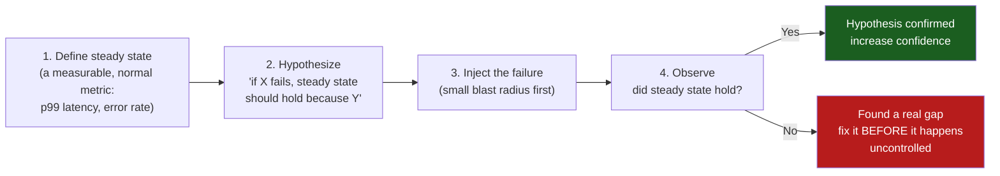
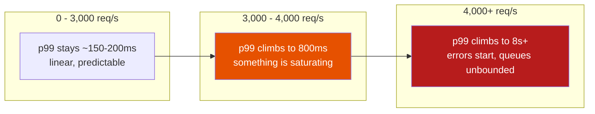

# Production Reliability Practices

**Prerequisites:** [Observability](index.md)

[← Observability](index.md)

---

## Why This Exists

SLIs, SLOs, and error budgets ([Observability](index.md#sli-slo-and-error-budgets-quantifying-reliability)) tell you *whether* you're meeting a reliability target. They don't tell you **what to do to actually hit it**: how do you find the failure modes you haven't seen yet, how do you know your system survives the load you're planning for before it actually arrives, and how do you turn an outage that already happened into a system that's less likely to have the next one?

Three practices answer those three questions:

```
"What breaks that we haven't found yet?"     → Chaos Engineering
"Will this survive Black Friday traffic?"     → Capacity & Load Testing
"We just had an outage — now what?"           → Blameless Postmortems
```

Each is a discipline, not a one-time event — the whole point of all three is that they're **run repeatedly, on purpose, before reality forces the issue.**

---

## Chaos Engineering: Breaking Things on Purpose, Safely

### The Core Insight

Most production failures are combinations nobody tested: a deploy *during* a traffic spike *while* a downstream dependency is degraded. Unit tests and staging environments can't reproduce this — they test components in isolation, not the emergent behavior of a live system under real, correlated failure.

```
✗ "We tested that the payment service handles a database failure" —
  tested in isolation, in staging, with synthetic load.

✓ "We injected a database failure into 5% of production traffic during
  peak hours and confirmed the circuit breaker actually opened, the
  fallback actually worked, and no customer noticed" — tested in the
  one environment that has real traffic patterns, real data skew, and
  real infrastructure quirks staging never replicates.
```

**Chaos engineering is the discipline of deliberately injecting failure into a system — usually production — to verify it degrades the way you believe it does, before an uncontrolled failure proves you wrong.**

### The Loop



```python
# A chaos experiment, concretely

# 1. Steady state (measurable, not vibes):
#    p99 checkout latency < 500ms, error rate < 0.1%

# 2. Hypothesis:
#    "If the recommendation service (non-critical, used for upsells)
#     becomes unavailable, checkout should be unaffected because
#     it's called with a 200ms timeout and a circuit breaker."

# 3. Inject (small blast radius — 1% of traffic, one region, business hours
#    with the team watching, NOT 2am unattended):
def chaos_experiment():
    with inject_fault(
        target="recommendation-service",
        fault_type="timeout",
        blast_radius="1% of us-east-1 traffic",
        auto_abort_if="checkout_error_rate > 1%",   # automatic circuit breaker
                                                       # on the experiment itself
    ):
        observe_metrics(duration_minutes=15)

# 4. Observe: did checkout p99/error-rate stay within steady state?
#    YES  → hypothesis held, confidence increases, expand blast radius next time
#    NO   → found a real gap: maybe the "200ms timeout" config was never
#           actually deployed, or the circuit breaker's fallback path has
#           its own bug that only triggers under real concurrent load.
#           This is EXACTLY the kind of gap that would otherwise be
#           discovered for the first time during a real incident.
```

**Why `auto_abort_if` is not optional**: the entire point is learning safely. An experiment that can spiral into a real outage defeats its own purpose — chaos engineering earns trust by proving it can be stopped instantly, which is what lets you eventually run experiments in full production with real customer traffic instead of only in a safe copy.

### Blast Radius: Start Small, Expand Only With Evidence

```
✗ Day 1 mistake: "let's chaos-test in full production, no blast-radius limit"
  → an untested hypothesis about a poorly-understood system, at 100% blast
  radius, IS an outage you're causing yourself.

✓ Progression:
  1. Staging, full blast radius — cheapest to get wrong, learn the tooling
  2. Production, 1% of traffic, one region, business hours, team watching
  3. Production, 10% of traffic, automated abort conditions proven reliable
  4. Production, "game day" — a scheduled, larger exercise simulating a
     real dependency outage, with the on-call team responding as if real
  5. Eventually: continuous, automated, low-blast-radius chaos running
     constantly (Netflix's Chaos Monkey model) — by this point, if a
     random instance dying causes any customer-visible impact, that's
     itself the alert, and it fires long before a real, larger failure would.
```

**Interview signal**: "Chaos engineering isn't 'randomly break things in prod' — it's the same scientific method as any experiment: a measurable steady state, a falsifiable hypothesis, a bounded blast radius with automatic abort, and a defined observation window. The blast radius only expands once smaller experiments build confidence — you don't start by testing your riskiest assumption on 100% of customers."

---

## Capacity & Load Testing: Knowing the Ceiling Before You Hit It

### Why "It Works Fine Right Now" Is the Wrong Question

```
Current traffic: 1,000 req/s, p99 = 150ms, everything green.

The actual question that matters: at what req/s does p99 start climbing
  non-linearly, and is that ceiling above or below what Black Friday /
  a viral moment / a marketing campaign will throw at you?

Nobody finds this out by watching a dashboard during normal traffic —
  normal traffic never reaches the ceiling. You have to go find it deliberately.
```

### Load Testing: Simulate the Traffic Before It's Real

```python
# A load test, structured as an experiment, not just "hit it with traffic"

import asyncio
import time

async def load_test(target_rps: int, duration_seconds: int, ramp_seconds: int):
    """Ramp traffic up gradually — a step function to full load hides
    WHERE the system starts to degrade; a ramp shows you the exact
    inflection point."""
    start = time.time()
    results = []

    while time.time() - start < duration_seconds:
        elapsed = time.time() - start
        # Linear ramp: 0 -> target_rps over ramp_seconds, then hold
        current_rps = min(target_rps, target_rps * (elapsed / ramp_seconds))

        latencies = await fire_requests(current_rps, window_seconds=1)
        results.append({
            "t": elapsed,
            "rps": current_rps,
            "p50": percentile(latencies, 50),
            "p99": percentile(latencies, 99),
            "error_rate": error_rate(latencies),
        })

    return results

# Reading the output: find the RPS where p99 stops scaling linearly
# with load — that inflection point is your real capacity ceiling,
# not whatever number marketing assumed.
```



**The inflection point (here, ~3,000 req/s) is the number that matters, not "it handled 1,000 req/s fine."** This is Little's Law territory (see [Engineering Mathematics](../foundations/math.md)) — past a certain utilization, queueing delay grows non-linearly, and a load test is how you find *your specific system's* threshold instead of assuming a textbook number.

### Capacity Planning: Turning the Ceiling Into a Number You Trust

```
Load test finds: system degrades above 3,000 req/s.
Current peak traffic: 1,200 req/s.
Projected traffic for a marketing campaign: 3.5x current peak = 4,200 req/s.

4,200 > 3,000 → the campaign WILL push past the degradation point.
Decision: either scale infrastructure before the campaign, add caching to
reduce backend load, or explicitly accept degraded performance during the
campaign window with stakeholders informed in advance — not discovered live.
```

**This is precisely why load testing has to happen before capacity planning decisions, not instead of them** — "we think we can handle it" without a measured ceiling is a guess dressed up as a plan.

### Common Load-Testing Mistakes

```
✗ Testing only the happy path — GET requests to a cached endpoint —
  while production traffic includes uncached reads, writes, and the
  occasional expensive report query. The load test's "capacity" number
  is meaningless if the traffic mix doesn't match reality.

✓ Model the realistic traffic mix: what % reads vs writes, what %
  hits cache vs misses, include the expensive/rare-but-real query
  patterns (large exports, admin dashboards) that skew p99 in production.

✗ Load testing against a scaled-down staging environment and
  extrapolating linearly — a database with 1/10th the data, on a
  smaller instance, doesn't degrade at 1/10th the load; it can degrade
  at a completely different point due to caching effects, connection
  pool sizing, or index behavior that only shows up at real data volume.

✓ Load test against production-equivalent infrastructure and, where
  possible, production-scale data — or explicitly caveat the results
  as directional, not a hard ceiling number.
```

---

## Blameless Postmortems: Turning an Incident Into a System Change

### Why "Blameless" Isn't a Nice-to-Have

```
✗ Blame-oriented postmortem: "Who deployed the change that caused this?"
  → the engineer who deployed it becomes defensive, downplays what they
    knew, and — more importantly — the NEXT engineer in a similar
    situation learns to hide near-misses rather than report them, because
    reporting them gets you blamed.
  → the org loses its best source of information: people who almost
    caused the SAME incident and caught it, who would otherwise have
    told you exactly where the danger was.

✓ Blameless postmortem: "What about our system, process, and tooling
  made it possible for this deploy to cause this outage, and why didn't
  we catch it sooner?"
  → the deploying engineer becomes the most valuable witness, not a
    suspect — they know exactly what the deploy process looked like
    from the inside, what warnings they did or didn't see, what they
    assumed.
```

**The mechanism, not just the sentiment**: blameless doesn't mean "no accountability" — it means the accountability is at the *systems* level (why did our review process, our monitoring, our deploy safeguards not catch this) rather than the *individual* level (why did this one person make this one mistake). Individuals will always make mistakes; a system that fails catastrophically from one person's single mistake is the actual defect.

### The Postmortem Document: What Actually Goes In It

```markdown
## Incident: Checkout 5xx spike, 2026-08-15, 14:02-14:38 UTC

### Impact
- 40 minutes, ~12,000 failed checkout attempts (estimated $ impact: $X)
- Affected: all customers attempting checkout during the window
- Not affected: browsing, cart additions, existing sessions

### Timeline (all times UTC, from monitoring + chat logs — not memory)
- 14:02 — Deploy of order-service v2.14.0 completes
- 14:03 — p99 latency begins climbing (first metric anomaly)
- 14:09 — PagerDuty alert fires (checkout error rate > 1%)
- 14:11 — On-call acknowledges, begins investigating
- 14:19 — Root cause identified: new DB query missing an index
- 14:22 — Rollback initiated
- 14:38 — Error rate returns to baseline, incident resolved

### Root Cause
The v2.14.0 deploy added a query filtering on `orders.customer_tier`,
a column with no index. Under production data volume (40M rows) this
triggered a full table scan per checkout request. Staging's dataset
(50K rows) didn't surface the problem — the scan was fast enough there
to be invisible in testing.

### What Went Well
- Alerting fired within 7 minutes of the anomaly starting
- Rollback was fast and well-rehearsed (3 minutes from decision to resolved)

### What Went Wrong / Contributing Factors
- No query-plan review step in the deploy checklist for schema-touching changes
- Staging data volume is 800x smaller than production — this class of bug
  is structurally invisible in staging as currently configured
- Time from anomaly start (14:03) to alert (14:09) was 6 minutes — the
  alert threshold could plausibly fire faster

### Action Items (each with an owner and a due date — not a wishlist)
- [ ] Add EXPLAIN ANALYZE to CI for any migration touching a table > 1M rows (@alice, due 08/22)
- [ ] Add a staging dataset generator that approximates production scale for high-traffic tables (@bob, due 09/05)
- [ ] Lower the checkout error-rate alert threshold from 1% to 0.3% (@carol, due 08/16)
```

**Why the timeline is reconstructed from logs/monitoring, not memory**: human memory of a stressful 40-minute incident is unreliable and tends to compress or reorder events — the timeline needs to be the actual source of truth for what happened, since the entire analysis depends on it being accurate.

**Why action items need an owner and a due date, not just a list**: a postmortem with unowned action items ("we should improve staging data") reliably produces zero follow-through. A postmortem with owned, dated action items is the actual mechanism by which an incident becomes a system improvement instead of a story people tell.

### The Trap: Postmortems That Don't Change Anything

```
✗ Same root cause (unindexed query on a schema change) causes a second
  incident 3 months later. The first postmortem's action items were
  written but never tracked to completion.

✓ Action items are tracked in the same system as other engineering work
  (the team's actual sprint board, not a separate "postmortem doc"
  nobody revisits), and a recurring incident with the same root cause
  is itself treated as a signal that the postmortem PROCESS is failing,
  not just that the system is.
```

---

## How These Three Connect

```
Chaos engineering finds failure modes BEFORE they cause an incident
  → fewer postmortems needed, because the gap was caught in a controlled
    experiment instead of live customer traffic

Load testing finds the CAPACITY ceiling before real traffic hits it
  → fewer incidents caused by "we didn't know we'd fall over at this load"

Blameless postmortems turn the incidents that DO happen (and some always
  will — neither of the above is perfect prevention) into concrete,
  owned action items — often including "let's chaos-test this specific
  scenario going forward" or "let's load-test this before the next
  campaign," closing the loop back to the first two practices.
```

**None of the three is sufficient alone.** Chaos engineering without load testing finds failure modes at current traffic, not future traffic. Load testing without chaos engineering finds capacity limits under clean conditions, not under simultaneous failure. Postmortems without the other two are purely reactive — learning only from what already went wrong, never from what you deliberately went looking for.

---

## Common Mistakes (Interviews)

### 1. Treating Chaos Engineering as "Randomly Break Prod"

```
✗ No steady-state metric, no hypothesis, no blast radius limit —
  indistinguishable from causing an outage on purpose.
✓ Steady state, falsifiable hypothesis, bounded blast radius, automatic
  abort condition — the scientific method, applied to production.
```

### 2. Load Testing the Happy Path Only

```
✗ Load test result: "handles 5,000 req/s" — but only tested cached GETs.
✓ Load test with a realistic traffic mix (reads, writes, cache misses,
  the rare expensive query) — the number is only meaningful if the
  traffic shape matches production.
```

### 3. Postmortems That Assign Blame

```
✗ "Root cause: engineer X forgot to add an index" — individual blame,
  discourages honest incident reporting going forward.
✓ "Root cause: our deploy process has no query-plan review step for
  schema-touching changes, and staging's data volume made this class
  of bug invisible before production" — systemic, actionable, and
  doesn't punish the person who happened to trigger a gap that existed
  before their change.
```

### 4. Postmortem Action Items With No Owner or Deadline

```
✗ "We should improve our staging environment" — a permanent wish,
  never actually done, resurfaces verbatim in the next postmortem.
✓ "@bob will add a production-scale staging dataset generator for
  high-traffic tables, due 09/05" — tracked like any other engineering
  commitment, because it is one.
```

---

## Interview Questions

=== "Foundation"
    **Q: What's the difference between a blameless postmortem and just "not blaming anyone"?**

    "Blameless doesn't mean nobody is accountable — it means accountability is aimed at the system, not the individual. The question isn't 'why did this engineer make a mistake,' it's 'why did our process, tooling, and monitoring allow one person's mistake to become a customer-facing outage.' This matters practically, not just ethically: if postmortems assign individual blame, people stop reporting near-misses and honest details, which removes the org's best source of information about where real danger lives."

=== "Senior"
    **Q: How would you decide the blast radius for a chaos engineering experiment testing what happens if your primary database becomes unreachable?**

    "I wouldn't start with the primary database in full production — that's the highest-blast-radius experiment in the whole system, since everything depends on it. I'd start in staging to validate the tooling and the hypothesis (e.g. 'the read-replica failover should complete within 5 seconds and error rate should stay under 1% during the transition'). Once that's proven, I'd move to production but scope the experiment as narrowly as I can — maybe injecting the failure for a single non-critical read replica first, or during a low-traffic window with the on-call team actively watching and an automatic abort if error rate crosses a threshold. Only after several successful, narrow experiments would I expand toward testing the actual primary failover in full production — and even then, with a defined rollback plan and stakeholders informed it's happening, not a surprise."

=== "Staff"
    **Q: Your org has postmortems for every major incident, but the same categories of incident keep recurring. How do you fix this?**

    "This usually means the postmortem process is producing documents, not system changes — action items are being written but not tracked to completion, or they're too vague to be actionable ('improve monitoring' instead of a specific, owned, dated change). First, I'd audit the last 10 postmortems' action items against what actually shipped — if the completion rate is low, that's the real problem, not the incidents themselves. I'd move action items into the same tracked backlog as regular engineering work, with the same visibility and prioritization pressure, instead of a postmortem doc nobody revisits. Second, I'd look for patterns across postmortems — if 'unindexed query causes latency spike' recurs, that's not three separate incidents, it's one systemic gap (missing query-plan review, staging data volume too small) that individual postmortems keep independently rediscovering without ever being addressed at the root. Third, I'd connect this back to chaos engineering and load testing: recurring incident categories are exactly the scenarios that should become standing chaos experiments or load-test scenarios, so the org catches the next instance in a controlled exercise instead of a fourth live incident."

---

## Key Takeaways

!!! success "Remember"
    1. **Chaos engineering is the scientific method applied to failure**: measurable steady state, falsifiable hypothesis, bounded blast radius, automatic abort — not "randomly break production"
    2. **Blast radius expands only with evidence** — staging first, then a sliver of production traffic, then larger, never starting with your riskiest untested assumption at 100% scale
    3. **Load testing exists to find the ceiling before real traffic does** — "it handles current load fine" says nothing about whether it survives 3x traffic; ramp load gradually to find the actual inflection point, not just a pass/fail at one target number
    4. **A load test is only meaningful if the traffic mix and data volume approximate production** — happy-path-only tests against a tiny staging dataset produce numbers that don't transfer
    5. **Blameless means systemic accountability, not no accountability** — the question is what about the system allowed one person's mistake to become customer-facing, which is also the only version of the question that produces honest incident reporting going forward
    6. **A postmortem's timeline comes from logs, not memory** — human recall of a stressful incident is unreliable, and the whole analysis depends on the timeline being accurate
    7. **Action items need an owner and a due date, tracked like any other engineering work** — an untracked action item reliably produces a repeat incident with the same root cause
    8. **The three practices close a loop**: chaos engineering and load testing find gaps before they cause incidents; postmortems turn the incidents that happen anyway into the next round of chaos experiments and load tests — none of the three is sufficient alone

**Previous:** [Observability](index.md) · **Related:** [Debugging Playbook](debugging-playbook.md), [Engineering Mathematics](../foundations/math.md), [Circuit Breakers](../reliability/circuit-breakers.md)
