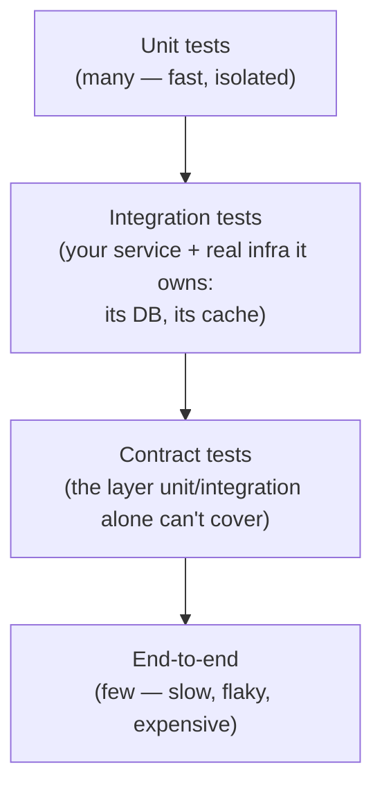
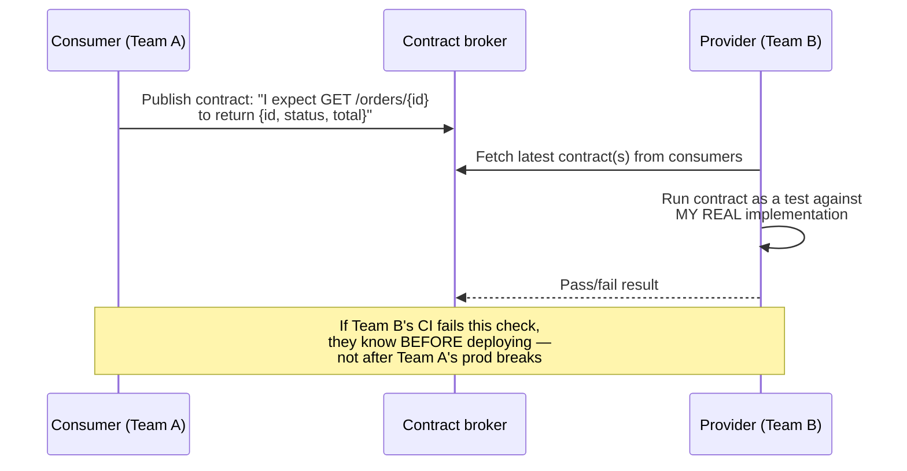

# Testing Strategy for Distributed Systems

**Prerequisites:** [Observability Overview](index.md), [Production Reliability Practices](production-reliability-practices.md)

[← Observability](index.md)

---

## Why This Exists

The test pyramid — many unit tests, fewer integration tests, few end-to-end tests — was designed for a single deployable. In a distributed system, "integration test" stops meaning "test how my modules interact" and starts meaning "test how *my service* interacts with *someone else's service*, which they deploy independently, on their own schedule, without asking me." That change breaks the pyramid's usual assumptions in a specific way: **you can't spin up every dependency's real implementation in a test environment, and a mock you wrote yourself will faithfully test against whatever you *believe* the dependency does — which silently diverges from what it actually does the moment either side changes.**

The interview signal here isn't "do you write tests" — it's whether the testing strategy accounts for the fact that **the biggest risk in a microservices system is the boundary between services, and that's exactly the boundary unit tests can't see and full end-to-end tests can't afford to cover exhaustively.**

---

## The Pyramid, Redrawn for Services

- **Unit tests** stay exactly as they were — fast, isolated, testing one function or class's logic. Nothing about distribution changes this layer.
- **Integration tests** now mean "my service plus the infrastructure *I own*" — my database, my cache, my message broker client — not another team's service. Spinning up a real Postgres in a test container is integration testing; spinning up another team's entire service (with *its* dependencies, recursively) is not integration testing, it's a fragile, slow imitation of production.
- **Contract tests** are the layer that doesn't exist in the classic pyramid and is the actual fix for the cross-service risk — covered in detail below.
- **End-to-end tests** run against a real (or close-to-real) deployed environment, exercising a full user journey across real services. Necessary for catching what nothing else can (a genuinely wrong end-to-end flow), but slow and prone to flakiness from causes that have nothing to do with the code under test (a flaky dependency, network noise, test-data pollution from another test) — which is exactly why they should be few and reserved for the highest-value journeys, not the primary safety net.

---

## Contract Testing: The Fix for "My Mock Lied to Me"

The failure this solves is specific and common: Team A calls Team B's API. Team A writes tests against a mock of Team B's API, built from documentation or from reading Team B's code at the time. Team B changes their API — removes a field, changes a status code's meaning — and Team A's tests keep passing, because the mock never changed, only reality did. **The tests were green and the integration was broken; nobody found out until it broke in production.**

A contract test flips who's responsible for keeping the mock honest:

The consumer (Team A) writes down what it actually expects from the provider — as a machine-checkable contract, not documentation that can silently drift. The provider (Team B) runs that contract against its *real* implementation as part of *its own* CI pipeline. If Team B's change breaks what Team A actually depends on, **Team B's build fails, on Team B's side, before the breaking change ships** — not weeks later when Team A's production traffic hits it. This is the consumer-driven contract testing pattern (Pact is the best-known open-source implementation), and its value is precisely that it moves the failure from "silent production incident" to "loud CI failure owned by the party that caused it."

!!! tip "Contract tests don't replace integration tests — they cover a different gap"
    An integration test proves "my service works correctly against its own infrastructure." A contract test proves "my assumptions about a dependency's API are still true today." Neither one proves "the full user journey across five services actually works end to end" — that's what the thin layer of end-to-end tests is for.

---

## Feature Flags as a Testing Tool, Not Just a Release Tool

Feature flags are usually introduced for progressive delivery (see [Deployment Strategies](../cloud/deployment-strategies.md)), but they're also a testing strategy in their own right: **a flag lets you deploy code to production disabled, verify it behaves correctly with real traffic patterns flowing past it (not just enabled for the user making the request), and enable it gradually** — which catches a category of bug that no pre-production test environment reliably reproduces, because pre-production traffic never has production's actual shape (scale, data skew, weird edge-case inputs real users generate). The trade-off: flags accumulate, and a codebase with stale flags left in "temporarily" months ago is its own form of technical debt — a flag needs an owner and a removal date the same way a TODO does.

---

## Testing Failure Modes Deliberately

Chaos engineering (see [Production Reliability Practices](production-reliability-practices.md)) is the production-facing half of this; the same discipline belongs earlier, in the test environment, before the failure mode is discovered live:

- Does your service handle a dependency timing out, not just a dependency returning an error? These are different code paths, and timeout handling is the one that's usually undertested (see [Distributed Systems Fundamentals](../distributed-systems/fundamentals.md) on why timeouts, not clean errors, are the default failure mode of a remote call).
- Does a retry actually behave safely — is the retried operation idempotent, or does the test suite only ever exercise the happy path where nothing needed retrying? (See the idempotency pattern in [Distributed Systems](../distributed-systems/index.md#idempotency-the-one-tool-that-makes-retries-safe).)
- Fault injection in a test environment (a proxy that deliberately delays or drops a percentage of calls to a dependency) surfaces these gaps before a chaos experiment does it in production, at a fraction of the blast radius.

---

## Realistic Example

A checkout service calls a separate inventory service to reserve stock. Team Checkout's integration tests use a hand-written mock of the inventory API that returns a successful reservation instantly. Team Inventory ships a change adding a required `warehouse_id` field to the reservation response, updates their own tests (which pass), and deploys — checkout starts failing to parse the response in production within minutes, because the hand-written mock never knew the field existed. Postmortem action: replace the hand-written mock with a consumer-driven contract — checkout publishes exactly what fields it reads from the response, inventory's CI runs that contract against its real implementation on every change. The next time inventory adds a field, nothing breaks (additive changes don't violate an existing contract); the time after that, when inventory considers *removing* a field checkout depends on, inventory's own CI fails the contract check before merge — the exact class of incident that just happened, now caught on the side that caused it, before it ships.

---

## Trade-offs

| Layer | Catches | Cost | Where it fails |
|---|---|---|---|
| Unit | Logic bugs in isolated code | Very low — fast, no infra | Nothing about how the service behaves with real dependencies or infra |
| Integration (own infra) | Bugs in how the service uses its own DB/cache/broker | Low–moderate | Doesn't touch other teams' services at all |
| Contract | Breaking changes to a dependency's API, caught on the provider's side pre-deploy | Moderate — requires cross-team process adoption | Doesn't catch a broken *user journey* spanning several correctly-contracted services |
| End-to-end | Full-journey correctness across real, deployed services | High — slow, flaky, expensive to maintain | Too slow/costly to run exhaustively; flakiness erodes trust if overused as the primary safety net |

---

## Interview Questions

=== "Foundation"
    **Q: Why doesn't the classic test pyramid work unchanged for a microservices architecture?**

    "The classic pyramid assumes 'integration test' means testing how your own modules interact, which you can do cheaply and reliably because you control all of it. In microservices, the real risk is at the boundary between services owned by different teams, deployed independently — and you can't cheaply spin up every dependency's real implementation for every test run, so teams end up mocking dependencies. A hand-written mock tests against what you believe the dependency does at the time you wrote it, and silently goes stale the moment the dependency actually changes — which is exactly the gap contract testing exists to close."

=== "Senior"
    **Q: Your team's test suite is green, but a dependency's breaking API change still caused a production incident. What was missing?**

    "The tests that were green were unit and integration tests against a mock of the dependency, not against the dependency's real, current behavior — so they proved internal logic was correct, not that the assumption about the dependency still held. I'd introduce consumer-driven contract tests: my team publishes what we actually depend on from their API as a machine-checkable contract, and their CI runs that contract against their real implementation on every change. That moves the failure to their build, before they deploy, instead of to our production after they do — and it specifically closes the gap unit and integration tests structurally can't, because neither one ever executes against the dependency's real, current code."

=== "Staff"
    **Q: You're introducing contract testing across an org with 40 services and no existing cross-team testing discipline. How do you roll it out?**

    "I wouldn't mandate it everywhere at once — with 40 services, that's a large adoption cost with no immediate payoff for teams that haven't been burned by a cross-service breaking change yet, and it'll be resented as process for its own sake. I'd start with the highest-traffic, highest-incident-history service pairs — the integrations that have actually caused production incidents from silent API drift — and prove the pattern there first: get one consumer-provider pair using a contract broker, show that a would-be breaking change actually got caught in the provider's CI before shipping, and use that as the case for expansion rather than a mandate.

    Operationally, I'd make the contract broker and the CI integration as close to zero-config as possible for a new team adopting it — most rollouts stall not because the concept is disputed but because the setup friction is real and nobody prioritizes it without a forcing function. And I'd track a concrete metric — cross-service incidents caused by undetected API changes, before and after adoption — because that's the number that gets the next team to opt in without me having to argue the abstract case again."

---

## Key Takeaways

!!! success "Remember"
    1. **"Integration test" means something different in a distributed system** — testing your service against infrastructure you own, not against another team's real service.
    2. **A hand-written mock of a dependency goes stale silently** — it tests your belief about the dependency at write time, and nothing keeps that belief current as the dependency evolves.
    3. **Contract testing moves the failure to the provider's CI, before deploy** — the party that causes a breaking change is the party whose build fails, not the consumer's production traffic weeks later.
    4. **End-to-end tests should be few and high-value, not the primary safety net** — they're slow, flaky for reasons unrelated to real bugs, and expensive to maintain at scale.
    5. **Feature flags and fault injection are testing tools, not just release tools** — they surface production-shaped bugs and failure-mode gaps before a chaos experiment (or an incident) does it live.

**Back to:** [Observability](index.md)
