# Cache Strategies

**Prerequisites:** [Cache Stampede](cache-stampede.md), Basic database access patterns

[← Caching & Performance](index.md) | [Next: Cache Stampede →](cache-stampede.md)

---

## Why This Exists

"We added a cache" is not a design — a cache in front of a database is five genuinely different systems depending on *when* it's read and *when* it's written:

```
cache-aside: app checks cache, misses, reads DB, writes cache        → stale-tolerant reads
write-through: app writes DB and cache together, synchronously       → consistent but slower writes
write-behind: app writes cache, cache writes DB later, async         → fast writes, can lose data
write-around: app writes DB only, cache untouched until next read    → avoids caching data that's never re-read
read-through: cache itself knows how to load from DB on miss         → app never talks to DB directly
refresh-ahead: cache proactively refreshes before expiry              → avoids the stampede at expiry
```

Pick the wrong one and you get a bug class, not a feature: write-through where you meant write-behind gives you unnecessarily slow writes; write-behind where you meant write-through silently loses data on a crash. This page is the decision, not just the diagram.

!!! tip "Mental Model"
    Every strategy answers two questions independently: **on a read miss, who loads the data — the app or the cache?** And **on a write, does the DB get updated before, after, or long after the cache?** Answer both and you've picked the strategy; the name is just a label for the combination.

---

## Naive System → What Breaks

You bolt a cache in front of the DB with `if cache.get(key): return; else: db.query() + cache.set()` and call it done.

| Naive assumption | What breaks |
|---|---|
| "Cache-aside is the only pattern, just use it everywhere" | Write-heavy workloads (counters, inventory) thrash the cache and hammer the DB on every write invalidation |
| "We'll evict with LRU, that's what everyone uses" | A nightly batch job scans 10M rows once, evicts your entire hot working set — LRU can't tell "scanned once" from "actually popular" |
| "TTL of 5 minutes keeps things fresh enough" | A price update at t+10s is invisible to users for up to 5 minutes — nobody decided that trade-off on purpose |
| "We invalidate on write" | Race: writer updates DB, invalidates cache, but a concurrent reader had already re-populated cache with the OLD value a moment before — stale entry survives until next write |
| "Write-behind is faster, let's use it for orders" | Process crashes with acknowledged writes still sitting in cache, never flushed to DB — orders vanish |

---

## Mental Model

```
Read path (does the APP or the CACHE own the miss?)

  Cache-aside:                        Read-through:
  App ──> Cache (miss) ──> App        App ──> Cache (miss) ──> Cache loads from DB
       ──> DB ──> App writes cache         (app never touches DB directly)

Write path (WHEN does the DB get the write, relative to the cache?)

  Write-through:                      Write-behind (write-back):
  App ──> Cache ──> DB (sync,         App ──> Cache (ack immediately)
          same request)                    Cache ──> DB (async, batched, later)

  Write-around:
  App ──> DB only (cache untouched)
  Next read of that key is a normal cache-aside miss — loads from DB then.

  Refresh-ahead:
  Cache proactively re-fetches hot keys BEFORE their TTL expires,
  so a real request never has to pay the miss cost.
```

---

## Architecture

```mermaid
flowchart TD
    subgraph "Cache-Aside"
        A1[App] -->|1 check| AC[Cache]
        A1 -->|2 miss, read| AD[(DB)]
        A1 -->|3 populate| AC
    end
    subgraph "Read-Through"
        B1[App] -->|read| BC[Cache]
        BC -->|miss: cache loads| BD[(DB)]
    end
    subgraph "Write-Through"
        C1[App] -->|write, sync| CC[Cache]
        CC -->|write, sync| CD[(DB)]
    end
    subgraph "Write-Behind"
        D1[App] -->|write, ack fast| DC[Cache]
        DC -.->|write, async/batched| DD[(DB)]
    end
    subgraph "Write-Around"
        E1[App] -->|write, bypasses cache| ED[(DB)]
        E1 -.->|next read: normal miss| EC[Cache]
        EC -.->|populate on miss| ED
    end
    style AC fill:#1565c0,color:#fff
    style BC fill:#6a1b9a,color:#fff
    style CC fill:#2e7d32,color:#fff
    style DC fill:#e65100,color:#fff
    style EC fill:#5d4037,color:#fff
```



---

## How It Works

### Cache-aside (lazy loading)

The application owns the logic. On read: check cache, miss → read DB → populate cache. On write: write DB, then either invalidate or update the cache entry.

```python
def get_product(product_id):
    cached = cache.get(f"product:{product_id}")
    if cached:
        return cached
    product = db.query("SELECT * FROM products WHERE id = ?", product_id)
    cache.setex(f"product:{product_id}", 300, product)
    return product

def update_product(product_id, fields):
    db.update("products", product_id, fields)
    cache.delete(f"product:{product_id}")  # invalidate, don't update — see below
```

**Consistency/durability:** eventually consistent — a read immediately after a concurrent write can still see a stale cached value until invalidation lands. Durability is entirely the DB's — the cache is disposable, can be flushed and rebuilt from nothing.

**Most common pattern in practice** because the cache is optional: if it's down, the app degrades to hitting the DB directly (slower, not broken).

### Read-through

Same read behavior as cache-aside, but the *cache* (or a library/proxy sitting at the cache layer) owns the DB-loading logic, not the application. The app only ever talks to the cache.

```
App ──read──> Cache
                │ (miss)
                └──> Cache's own loader queries DB, populates itself, returns to app
```

**Consistency/durability:** same as cache-aside — the difference is purely architectural (where the loading code lives), not a different consistency model. Useful when many services share a cache and you don't want the DB-loading logic duplicated in every client.

### Write-through

Every write goes to the cache AND the DB, synchronously, in the same request, before the write is acknowledged to the caller — but this is **not** a single atomic operation. The DB and the cache are two independent systems; nothing can wrap both in one transaction the way `BEGIN...COMMIT` covers multiple tables in the same database. "Write-through" means *ordered and synchronous*, not atomic — the two writes can still diverge if the second one fails or if a reader lands between them.

```python
def update_product(product_id, fields):
    db.update("products", product_id, fields)      # 1. DB write must land first
    cache.set(f"product:{product_id}", fields)      # 2. cache write — can independently fail
```

**Ordering matters and is not optional:** DB first, cache second. If `cache.set` fails after the DB commit, the cache still holds **whatever it held before this write** — either an older, now-stale value, or nothing (a genuine miss) if the key wasn't cached yet. A stale existing entry is a **cache hit that returns wrong data**, not a miss — that's the dangerous case, because nothing triggers a re-read until the entry's TTL expires or a later write invalidates it explicitly. If you instead wrote the cache first and the DB write then failed, the cache would show a value the DB never actually has — an even worse, silent failure, because the DB write failing usually surfaces as an error to the caller while the cache silently disagrees with a "rolled back" write. This is why write-through always orders DB-before-cache: the failure mode of "cache write fails" must be strictly less bad than the failure mode of "DB write fails," and treating a failed `cache.set` as "delete the key" (forcing the next read to repopulate from the now-correct DB) rather than "leave the old value in place" closes most of that gap.

There is also a real race with **no failure involved at all**: two concurrent writers updating the same key. Writer A does its DB update, then before A's `cache.set` runs, Writer B does its own DB update and its `cache.set` — now A's delayed `cache.set` executes last and overwrites the cache with A's older value, even though the DB correctly holds B's newer one. The cache and DB now permanently disagree until the next write to that key. Fixes: make the cache write conditional on the writer's version being the current one (a compare-and-swap keyed on the same version used for [versioned keys](#versioned-keys), so a late writer's stale `cache.set` is rejected), or skip caching the new value on write entirely and let the next reader repopulate it (i.e., invalidate instead of update-in-place — the same fix [Cache Invalidation](#cache-invalidation) recommends for cache-aside, for the same underlying reason).

**Consistency/durability:** correct **once both writes succeed**, with the ordering above bounding how bad it gets if the cache write fails — not an unconditional "always consistent" guarantee. Durability is DB-grade (nothing is acknowledged until the DB has it). Cost: every write pays cache-write latency on top of DB-write latency, and you're maintaining cache entries for data that might never be read again.

### Write-behind (write-back)

Writes go to the cache and are acknowledged immediately; the cache (or a background process) flushes to the DB asynchronously, often batched.

```
App ──write──> Cache (ack)
                  │ (async, batched every N ms or N writes)
                  └──> DB
```

**Consistency/durability:** fastest writes by far, but a window exists where the "committed" write lives only in cache — a cache crash before flush loses data that the caller was told succeeded. Only acceptable when either the data is reconstructible (metrics, counters that can be re-derived) or you've added durability underneath the cache (e.g., write-ahead log the cache itself persists before ack). Never use it for money movement or anything the business calls "durable" without an explicit durability layer.

### Write-around

Writes go straight to the DB; the cache is left alone entirely — not updated, not invalidated. The written key only enters the cache later, the normal way, if and when it's next read (a cache-aside-style miss).

```python
def update_product_bulk_import(product_id, fields):
    db.update("products", product_id, fields)
    # no cache.set(), no cache.delete() — cache is untouched
```

**Consistency/durability:** DB-grade durability (same as write-through — the DB has it before ack), but the cache can serve a **stale value indefinitely** for any key that was cached before the write and isn't explicitly invalidated. This is the trade-off write-around makes on purpose: it assumes the write path and the hot-read path are mostly disjoint keys, so paying to keep the cache in sync on every write is wasted work. If the same key *is* both written and hot-read, write-around alone reintroduces the exact staleness problem cache-aside's invalidation-on-write step exists to prevent — pair it with a short TTL or explicit invalidation for any key that isn't genuinely write-once-read-rarely.

**Best for:** bulk imports, write-heavy logs, or data written once and rarely re-read (audit trails, historical records) — anywhere caching the just-written value would only evict something actually hot to make room for data nobody's about to ask for again.

### Refresh-ahead

The cache proactively refreshes a key **before** it expires — typically triggered by access frequency (a hot key gets refreshed ahead of TTL) rather than waiting for a miss to happen.

```
TTL = 300s. At t=270s (90% of TTL), if this key has been accessed recently,
trigger an async refresh from the DB — the cache never actually misses for
hot keys, because it renews itself before expiry.
```

**Consistency/durability:** same eventual consistency as cache-aside, but it specifically defeats the *stampede at expiry* problem — see [Cache Stampede](cache-stampede.md) for the failure mode this prevents and mutex/jitter/stale-while-revalidate as the reactive alternatives. Refresh-ahead is the proactive version of the same idea: don't wait for 1,000 clients to all miss at once, refresh before anyone has to.

| Strategy | Who loads on miss | When DB gets written | Read consistency | Write durability risk | Best for |
|---|---|---|---|---|---|
| Cache-aside | App | N/A (read pattern) | Eventual | N/A | General-purpose, cache can be down without breaking writes |
| Read-through | Cache itself | N/A (read pattern) | Eventual | N/A | Many services sharing one cache layer |
| Write-through | N/A (write pattern) | Synchronously, same request | Immediate if both writes succeed — not atomic, DB-then-cache ordering bounds the failure case | None — DB has it before ack | Data that must be correct on next read |
| Write-behind | N/A (write pattern) | Asynchronously, later/batched | Immediate in cache, eventual in DB | Data loss if cache dies before flush | High write volume, reconstructible or non-critical data |
| Write-around | N/A (write pattern) | Synchronously, cache untouched | Cache can be stale for pre-existing entries | None — DB has it before ack | Bulk writes / write-once data rarely re-read |
| Refresh-ahead | Cache (proactively) | N/A (read pattern) | Eventual, but never "cold" for hot keys | N/A | Hot keys where stampede-at-expiry is the risk |

---

## Eviction Policies

The cache is smaller than the dataset — something has to be evicted when it's full.

| Policy | Evicts | Good for | Bad for |
|---|---|---|---|
| **LRU** (Least Recently Used) | The item not accessed longest | General-purpose, recency-correlated access | A single large sequential scan (batch job, report) evicts the entire real working set — scan pollution |
| **LFU** (Least Frequently Used) | The item accessed fewest times overall | Stable "always popular" items surviving scans | Slow to adapt — an item popular last week but dead now stays cached, crowding out today's actually-hot items ("cache pollution by history") |
| **TTL-based** | Whatever's oldest by wall-clock, regardless of access | Data with a natural freshness window (prices, session tokens) | Doesn't account for popularity at all — a hot key and a cold key with the same TTL evict at the same rate |
| **Random / FIFO** | Arbitrary / insertion order | Simplicity, when access pattern has no exploitable structure | Leaves performance on the table almost everywhere else |

**Why LRU thrashes under scan patterns:** a batch job that reads 10M rows once, in order, touches every key exactly once — LRU sees each as "most recently used" and evicts your actual hot working set to make room, even though none of the scanned rows will be read again soon. This is the classic **cache pollution** failure.

**Fixes — LRU-K and 2Q:**

- **LRU-K** (commonly LRU-2) tracks the time of the *K-th* most recent access, not just the most recent — an item touched once during a scan doesn't look "hot" until it's been accessed K times, so a one-pass scan can't evict genuinely hot data.
- **2Q** keeps two queues: a small FIFO for items seen once (scan traffic lands and dies here) and an LRU for items that get a second access and graduate into the "real" cache. Scan traffic never displaces the promoted, actually-hot set.

Both trade a little bookkeeping overhead for scan-resistance — worth it any time a periodic batch/report/crawl job shares a cache with latency-sensitive traffic.

---

## Cache Invalidation

> "There are only two hard things in Computer Science: cache invalidation and naming things." — Phil Karlton

The joke lands because invalidation is genuinely hard: the cache and the source of truth are two separate pieces of state, and keeping them coherent under concurrent writes is a distributed-consistency problem wearing a small hat.

### TTL-based (time-based expiry)

Set an expiry when writing the cache entry; let it go stale automatically. Simple, no coordination needed, but "freshness" is a number you picked, not a guarantee tied to actual writes — a value can be wrong for up to the full TTL after it changes.

### Explicit invalidation on write

Delete (or update) the cache entry as part of the write path — see the cache-aside `update_product` example above. Tighter freshness bound than TTL alone, but introduces a real race:

```
t0: Reader A misses cache, starts reading DB (sees old value, pre-update)
t1: Writer updates DB to new value, then deletes cache key
t2: Reader A finishes its DB read (still old value) and writes it to cache
    → cache now holds the OLD value, indefinitely, until the next write
```

Mitigations: short TTL as a backstop even when using explicit invalidation (bounds the damage of this race to the TTL window), or delete-then-set-with-version (below) so a stale write can detect it's stale and refuse to apply.

### Versioned keys

Instead of invalidating in place, embed a version (or the source data's own version/timestamp) in the cache key itself: `product:42:v17`. A write that produces v18 simply starts writing (and reading) under the new key — the old key ages out via TTL naturally, and there's no race window where a concurrent stale write can clobber a fresh one, because stale writers are writing to `v17` while everyone else has already moved to `v18`.

```python
def get_product(product_id):
    version = db.get_current_version(product_id)  # cheap, indexed lookup
    key = f"product:{product_id}:v{version}"
    cached = cache.get(key)
    if cached:
        return cached
    product = db.query_full(product_id)
    cache.setex(key, 300, product)
    return product
```

Cost: an extra cheap lookup (or embedding version in a parent object) to know the current version before you can even check the cache — worth it when the stale-write race above is unacceptable (pricing, inventory) and not worth it for genuinely tolerant data (a user's display name).

---

## Realistic Example With Numbers

Product catalog service: 50,000 read QPS, 500 write QPS (price/inventory updates), 90% cache hit target.

```
Cache-aside, TTL=300s, explicit invalidation on write:
  read QPS to cache            50,000
  cache hit (90%)              45,000/s served from cache, ~1ms
  cache miss (10%)             5,000/s hit DB, ~15ms
  write path                   500/s: DB write (~10ms) + cache delete (~1ms)

Under a price-update storm (flash sale, 5,000 writes/s for 30s):
  5,000 invalidations/s → next 5,000 reads/s for those keys miss cache
  DB read load spikes from 5,000/s baseline miss rate toward ~10,000/s
  → still within DB capacity IF DB was sized for peak, this is why the
    capacity math from Requirements & Estimation matters here too
```

**Refresh-ahead does not fix the storm above** — it's easy to reach for it here, but it solves a different problem. Refresh-ahead triggers on *TTL proximity* (a key nearing its natural expiry gets renewed early); it has no hook into the write path. When a write explicitly deletes a key mid-TTL — exactly what's happening in the flash-sale storm — that deletion has nothing to do with where the key was in its TTL countdown, so a scheduled pre-expiry refresh is irrelevant: the key is already gone, and the next 5,000 reads for it still race the DB as a synchronized miss.

What actually fixes a write-triggered stampede on hot keys:

- **Request coalescing / single-flight** — the first reader after invalidation acquires a lock (or registers as the "leader" for that key) and fetches from the DB; every other concurrent reader for the same key waits on that one in-flight fetch instead of independently hitting the DB. See [Cache Stampede](cache-stampede.md) for the mutex-based mechanics.
- **Stale-while-revalidate** — serve the just-invalidated (or about-to-expire) value for a short grace window while one background fetch refreshes it, so concurrent readers never see a hole in the cache at all.
- **Refresh from the write path itself** — instead of deleting the key on write, have the writer immediately repopulate it with the new value (update-in-place rather than invalidate-then-lazy-reload) for keys hot enough that a guaranteed-empty window is unacceptable; the versioned-keys approach above achieves the same effect without the stale-write race.

Refresh-ahead's actual job is the *organic* stampede — many independent keys all written once, long ago, and now aging out of TTL at roughly the same wall-clock time (e.g., a batch of prices all cached at the start of a sale). That's a different trigger than "a write just invalidated this specific key," and needs a different fix.

---

## Failure Modes

| Failure | Cause | Fix |
|---|---|---|
| Stale price shown after update | Cache-aside race: reader repopulates with old value after invalidation | Versioned keys, or shorter TTL as a backstop |
| Batch job tanks cache hit rate for the whole service | LRU eviction from a one-pass scan | LRU-K or 2Q; or route batch reads around the shared cache entirely |
| Orders "succeeded" but vanished after a crash | Write-behind used for durable data with no durability layer under the cache | Write-through (or write-behind with a persisted write-log before ack) for anything durability-critical |
| User sees their own just-written update as reverted | Write-around left a stale pre-existing cache entry in place after the write | Pair write-around with explicit invalidation (or short TTL) for any key that's also hot-read, not just write-once data |
| Cache and DB permanently disagree | Update cache directly instead of invalidating, and the update itself was based on stale data | Prefer delete-and-reload over update-in-place for cache-aside |
| Everything on the shelf goes stale at once | All entries written at login time with the same TTL, e.g. session cache | TTL jitter — see [Cache Stampede](cache-stampede.md) |
| Write-through writes slow down every request | Cache write on the synchronous path, cache having a bad day | Circuit-break the cache write, don't fail the whole request if only the cache leg is slow |

---

## Production Debugging

```
Symptom: cache hit rate dropped from 90% to 40%

1. Check eviction rate       cache stats: evictions/sec spiking?
                              → correlate with a batch job / deploy / traffic shift
2. Check key cardinality      did a deploy start minting new cache keys
                              (e.g. added a field to the key) — old keys orphaned
3. Check TTL config           did a config change shrink TTL across the board?
4. Check invalidation rate    write QPS × invalidations — is something
                              invalidating far more than it used to (bug, or
                              a legitimate bulk-update job)?
5. Check memory pressure      cache evicting due to memory limit, not TTL/LRU
                              logic — undersized cache instance
6. Check for cache restart    a redeploy/restart with no warm-up = cold cache,
                              looks identical to "hit rate dropped"
```

---

## Scaling Limits

- Write-through caps write throughput at the slower of (cache write, DB write) — every write pays both, serialized.
- Write-behind's async buffer has a bound — if DB flush falls behind sustained write rate, the buffer grows unbounded until you hit memory limits or start dropping writes.
- Versioned-key invalidation adds one extra lookup per cache read (to resolve current version) — cheap, but it's an extra network hop at your read QPS, not free.
- LRU-K/2Q bookkeeping costs more memory per entry than plain LRU — fine at moderate cache sizes, worth measuring at very large key counts.
- Refresh-ahead only pays off for genuinely hot keys — refreshing everything ahead of TTL just turns your background load into your foreground load with extra steps.

---

## Trade-offs

| Dimension | Cache-aside | Write-through | Write-behind | Write-around | Refresh-ahead |
|---|---|---|---|---|---|
| Read latency (hit) | Fast | Fast | Fast | Fast (for cached keys) | Fast, and hot keys rarely miss |
| Read latency (miss) | DB round trip | N/A (writes are what's synchronous) | N/A | DB round trip, incl. any just-written key | Rare for hot keys by design |
| Write latency | DB only | DB + cache, synchronous | Cache only, DB is async | DB only | N/A (read-side pattern) |
| Consistency | Eventual, race-prone | Immediate | Immediate in cache, lagging in DB | Stale cache possible for pre-existing entries | Eventual |
| Durability | DB-grade | DB-grade | Cache-grade until flush — risk | DB-grade | DB-grade |
| Complexity | Low | Medium | High (needs a durability story) | Low | Medium-high (needs access tracking) |
| Best for | General reads | Data that must be correct on next read | High write volume, reconstructible data | Write-once / rarely re-read data (bulk import, logs) | Hot keys prone to stampede |

---

## Interview Questions

=== "Basic"
    **Q: What's the difference between cache-aside and write-through caching?**

    "Cache-aside is about the read path: the application checks the cache, and on a miss, reads the database and populates the cache itself — writes typically just invalidate the cache entry rather than update it. Write-through is about the write path: every write goes to the cache and the database together, synchronously, so the cache is never stale on the next read. Cache-aside optimizes for simplicity and lets the cache be optional; write-through optimizes for read consistency at the cost of slower, coupled writes."

=== "Basic"
    **Q: When would you use write-around instead of cache-aside?**

    "Write-around is for data that's written but rarely re-read soon after — a bulk import, an audit log, historical records. The write goes straight to the DB and the cache is left alone; the key only gets cached later if something actually reads it, the normal cache-aside-miss way. The risk is if that key *was* already cached from before — write-around doesn't touch or invalidate it, so a hot key that also gets written needs explicit invalidation or a short TTL on top, otherwise readers keep seeing the pre-write value indefinitely."

=== "Senior"
    **Q: Why does LRU eviction sometimes perform badly, and how would you fix it?**

    "LRU assumes recent access predicts future access, which breaks under scan patterns — a batch job or report that reads a huge range of keys exactly once looks, to LRU, exactly like 'most recently used,' so it evicts your actual hot working set to make room for data that will never be read again. I'd fix it with either LRU-K, which only considers an item 'hot' after K accesses so a single scan pass can't evict real hot data, or a 2Q-style setup with a separate small queue for first-touch items that only get promoted to the main LRU cache on a second access. The other practical fix is architectural: route batch/reporting reads to a replica or a separate cache instance so they never share eviction pressure with latency-sensitive traffic in the first place."

=== "Staff"
    **Q: Your team wants to switch inventory-count updates from cache-aside to write-behind for latency. What do you push back on?**

    "Write-behind is the wrong tool here unless you add a durability layer, and I'd say so explicitly rather than let 'faster writes' win by default. The failure mode is: a write is acknowledged the moment it lands in cache, but if the cache process dies before it flushes to the DB, that inventory decrement is gone — the DB thinks the item is still in stock, and you oversell it. If latency is the real problem, I'd first check whether it's the DB write or something else causing it, and consider write-through with a faster underlying store, or batching writes at the application layer with an explicit ack only after DB commit. If write-behind is truly necessary — say, for a high-frequency counter like 'view count' that's reconstructible or doesn't need to be exact — I'd scope it to exactly that data, not extend it to inventory, which the business needs to be correct, not just fast."

---

## Reasoning Exercises

1. A social feed's "like count" needs to handle 20,000 likes/sec but doesn't need to be exactly accurate in real time. Which write strategy fits, and what's the acceptable failure mode if the cache process crashes?
2. Design the cache-key scheme for a product page that shows price (changes often), description (rarely changes), and review count (changes constantly but tolerates staleness). Do all three need the same strategy?
3. Your cache hit rate is 95% by the dashboard's own metric, but users still report seeing stale prices after updates. What's the likely gap between "hit rate" as measured and "correctness," and how would you specifically test for the invalidation race described in this page?
4. You're moving a read-through cache shared by 12 microservices to cache-aside owned by each service individually. What do you gain, what do you lose, and which of the 12 services would you migrate last?

---

## Key Takeaways

!!! success "Remember"
    1. Six strategies, two independent axes: who loads on a miss (app vs cache), and when the DB gets a write (sync, async, bypassed entirely, or not at all in the read-only patterns).
    2. Write-through trades write latency for consistency *if both writes succeed* — it's ordered and synchronous, not atomic; the DB write must land before the cache write so a failed cache write degrades to a stale-but-self-healing cache miss, not a cache silently ahead of the DB. Write-behind trades durability for write speed — never use write-behind for data the business calls durable without adding a durability layer underneath it.
    3. LRU thrashes under scan patterns because it can't distinguish "recently touched once" from "actually popular" — LRU-K and 2Q fix this by requiring a second access before promotion.
    4. Cache invalidation has a real race even when you "do it right": delete-then-read-repopulates-stale. Versioned keys close that race; TTL is a cheap backstop.
    5. Refresh-ahead is the proactive answer to the stampede problem — see [Cache Stampede](cache-stampede.md) for the reactive answers (mutex, jitter, stale-while-revalidate) when you can't predict which keys will be hot.

**Previous:** [Caching & Performance](index.md) | **Next:** [Cache Stampede](cache-stampede.md)

!!! info "Staff Engineer Lens"
    The strategy choice is a durability and consistency decision wearing a performance costume — "write-behind is faster" is true and also not the point. In a design review, ask what happens to an acknowledged write if the cache process dies right now; if the honest answer is "it's gone," that strategy is wrong for anything the business calls committed.

    !!! note "Interview Insight 🎯"
        If asked to design caching for a system, name the read pattern AND the write pattern separately — "cache-aside reads, write-through for the fields that must be correct next-read, TTL + jitter as a backstop" is a stronger answer than "we'll cache it," because it shows you know these are independent decisions.
