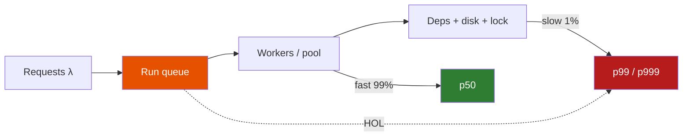

# Tail Latency

**Prerequisites:** [Caching & Performance](index.md), [Capacity Estimation](../foundations/requirements-estimation.md)

[← Cache Strategies](cache-strategies.md) | [Next: Cache Stampede →](cache-stampede.md)

---

## Why This Exists

Dashboard: **CPU 40%, avg 95ms, error rate 0.1%.** Slack is on fire. Checkout "takes forever."

You open percentiles:

```
p50 = 80ms     ← the average's friend; most users are fine
p95 = 180ms    ← still inside the 200ms SLO
p99 = 6s       ← 1 in 100 checkouts is a lost session
```

A 1k rps service produces **10 requests/s** that wait 6 seconds. That is 36,000 terrible checkouts per hour. Averages hid an outage because they are pulled by the 99, not named by them.

If 2% of users abandon at 3s, that tail is not a graph — it is revenue. The SLO belongs on **p99**, not on mean.

!!! tip "Mental Model"
    Latency is a **distribution**, not a number. The tail is where queues, locks, GC, and the slowest dependency live. Users and SLOs live in the tail. The mean lives in a slide deck.

    `p50 = typical` · `p99 = product` · `max = somebody's lawsuit`

---

## Naive System → What Breaks

You SLO on **average latency** and scale when CPU > 70%.

| Reality | Why the average lied |
|---------|----------------------|
| 1% of calls hit a cold disk / slow neighbor | 99 × 80ms + 1 × 6s = **139ms avg** — "fine" |
| One slow query on a shared connection | Everyone behind it waits — **HOL blocking** |
| Thread pool 50, in-flight 80 | Queue time ≫ service time; CPU still 40% |
| Fan-out to 20 microservices | p99_total ≈ 1 − (0.99)^20 ≈ **18%** of requests see *some* p99 |
| GC every 30s for 400ms | A slice of users get +400ms; avg barely moves |

---

## The Concept

**Percentile pN** = the latency that N% of requests beat. p99 = 99% faster than this; 1% slower.

**Why tails form:**

1. **Queueing** — when utilization ρ → 1, wait time explodes (not linearly).
2. **Little's Law** — `L = λW` (in-flight = arrival rate × time in system). Slow W inflates L; finite pools then inflate W. Spiral.
3. **Head-of-line (HOL) blocking** — one fat/slow request occupies a worker, connection, or HTTP/1.1 socket; the thin requests behind it inherit its wait.
4. **Pool exhaustion** — DB pool, GC threads, connection pool: waiters sit in a queue the CPU dashboard cannot see.
5. **Fan-out** — a page that calls N backends inherits the *max* of their tails.

**The 40% CPU, 6s p99 pattern:** you are not compute-bound. You are **concurrency-bound**. The missing 60% CPU is threads stuck on a lock, a disk, or a 1% dependency.

---

## Architecture



---

## Mechanics

### Queueing in one line

For an M/M/1-ish server, `E[wait] ≈ ρ / (1−ρ) × S`. At 50% busy, wait ≈ service. At 80%, wait = 4×. At 95%, wait = 19×. **p99 is much worse than the mean wait.** Headroom is a latency feature.

### Little's Law, used on-call

```
λ = 1,000 rps    W = 80ms = 0.08s    L ≈ 80 in-flight     — healthy
λ = 1,000 rps    W = 6s              L ≈ 6,000            — you do not have 6,000 workers
```

If the pool is 200, 5,800 requests sit in an accept/queue. Their latency is **queue time**, not handler time. CPU can be 40% (200 workers blocked on I/O).

### HOL blocking

HTTP/1.1 one-connection-per-client, a single JDBC connection reused serially, a single-threaded event loop doing a 200ms JSON parse, a Kafka partition whose consumer hits a poison 10s call — all HOL. The fix is **isolation**: HTTP/2 multiplexing (with care), separate pools for fast/slow, hedged requests, or cancel.

### Slow 1% dependency

```
page = auth + recs + ads + inventory + price
each p99 = 200ms independently
P(page > 200ms) ≈ 1 − 0.99^5 ≈ 5%
```

You are already at p95 of the *page* from five "p99=200ms" toys. This is why edge SLOs cannot equal the worst backend SLO.

### Hedge / tail chopping (use sparingly)

If p99 is 10× p50, a hedged retry after p95 wait can cut tail — and **double load** on the tail-causing dep. Pair with [retry budgets](../reliability/circuit-breakers.md).

### Coordinated omission

A closed-loop load test waits for each response before sending the next. When the system slows, the generator slows — **p99 looks better than production**, because the waits never entered the sample. Open-loop generators (constant λ) and measuring *intended* start time expose the real tail. If your load test p99 is 180ms and prod p99 is 6s at the same CPU, believe prod and suspect the test.

### What to chart together

Always plot **p50 / p95 / p99 / p99.9 + avg** on one graph, plus `in_flight`, `pool_wait_ms`, and CPU. The signature `avg≈p50≪p99`, CPU mid, pool_wait≈p99 is this entire page in one screenshot.

---

## Realistic Example With Numbers

Checkout API: 800 rps, 32 Java workers, DB pool 20, CPU 40%.

```
p50  80ms     handler 50ms + DB 30ms
p95  180ms    cache miss + lock wait
p99  6s       DB pool wait 5.8s + 200ms query
avg  140ms    looks "a bit slow"
```

What happened: a new query on `orders` full-scans for 1% of users (big accounts). Those hold a pool connection 2s. 800 rps × 1% = 8 slow/s. 8 × 2s = 16 extra connections — almost the whole pool of 20. Everyone else queues. **The 99% pay for the 1%.**

Fix order: index / kill the query (cause), then timeout the query at 100ms (bound), then split pools (isolate), then more connections (last — they amplify lock contention).

---

## Interactive Explainer

Run a healthy stream, then inject HOL blocking or a 1% slow dependency. Watch **avg stay polite** while **p99 detaches**.

<div class="sim-container">
  <div class="sim-title">Tail Latency</div>
  <div class="sim-controls">
    <button class="sim-btn success" onclick="window._tail && window._tail.run()">Run</button>
    <button class="sim-btn" onclick="window._tail && window._tail.pause()">Pause</button>
    <button class="sim-btn" onclick="window._tail && window._tail.reset()">Reset</button>
    <button class="sim-btn danger" onclick="window._tail && window._tail.injectHol()">HOL blocking</button>
    <button class="sim-btn danger" onclick="window._tail && window._tail.injectSlowDep()">Slow 1% dep</button>
  </div>
  <canvas id="tail-canvas" class="sim-canvas" style="width:100%;height:240px;"></canvas>
  <div class="sim-stats">
    <div class="sim-stat"><div class="sim-stat-label">p50</div><div class="sim-stat-value" id="tail-p50">—</div></div>
    <div class="sim-stat"><div class="sim-stat-label">p95</div><div class="sim-stat-value" id="tail-p95">—</div></div>
    <div class="sim-stat"><div class="sim-stat-label">p99</div><div class="sim-stat-value" id="tail-p99">—</div></div>
    <div class="sim-stat"><div class="sim-stat-label">avg</div><div class="sim-stat-value" id="tail-avg">—</div></div>
  </div>
  <div class="sim-log" id="tail-log"></div>
</div>

---

## Failure Modes

| Mode | p50 | p99 | CPU | Tell |
|------|-----|-----|-----|------|
| Slow 1% query | OK | Seconds | Low–mid | One query in traces |
| HOL on pool | Rises a bit | Seconds | Low | pool_wait ≈ p99 |
| GC thrash | OK | 200–800ms periodic | Spikes | pause histogram |
| Lock convoy | OK / rising | Huge | One core hot | `pg_locks` / Java lock profile |
| Saturated queue | All rise | Huge | High | ρ → 1; need capacity |
| Fan-out | OK | Inherits worst dep | Low | trace the max child |
| Noisy neighbor | Flaky | Flaky | Fine | only some pods |

!!! warning "Production Trap"
    Scaling out replicas because p99 is high and CPU is 40% gives you **more queues** waiting on the same hot row or the same 1% query. You have scaled the waiters. Fix the hold time.

---

## Production Debugging

```
CPU         40% + p99 6s         not a scale-out; find blockers
Memory      swap / GC old-gen    pauses become p99
Disk        fsync / read amp     one slow volume poisons a shard
Network     retrans, DNS         1% of calls take 5s (nscd / IPv6)
Queue depth run queue, LB, Kafka wait time is latency you own
Lag         consumer / replica   users read stale *and* wait
Pools       db, http, threads    active=max, wait_ms ≈ p99  → smoking gun
p50/p95/p99 always chart together if p99/p50 > 10, you have a tail problem
Error rate  may be *low*         timeouts not counted? they are the tail
Timeouts    client 3s, you 30s   user sees 3s; you still hold the pool
Retries     amplify the 1%       1% slow → 3% load on the slow path
GC          match pause to p99   if equal, the tail *is* the collector
Locks       one key / one row    celebrity user, global mutex, flights table
```

Trace one p99 request. If 5.8s is `pool.acquire`, you are done hunting the handler.

---

## Scaling Limits

- You cannot SLO p100. Hardware, GC, and the kernel have a max. SLO p99 or p99.9 and budget error + timeout.
- Fan-out of 50 serial deps: p99 becomes fiction. Collapse deps, parallelize with a deadline, or cache.
- Coordinated omission: if the load generator waits for a response before sending the next, it **understates** p99. Use a closed vs open model on purpose.
- Multi-tenant: one tenant's 1% is everyone's p99 on a shared pool — isolate or you will "optimize" the wrong customer.
- p99 of a 10 rps service is statistically noisy (1 sample / 10s). Collect longer windows or use p95.

---

## Trade-offs

| Dimension | Optimize p50 | Bound p99 | Over-provision ρ≪0.5 |
|-----------|--------------|-----------|----------------------|
| Latency | Great typical | Predictable tail | All percentiles drop |
| Throughput | High utilization | Some shed / timeout | Wasted boxes |
| Availability | Hidden outages | Timeouts as errors | Quiet |
| Consistency | — | Cancelled writes | — |
| Durability | — | — | — |
| Complexity | Low | Hedging, pools, traces | Low |
| Cost | Cheap until the tweet | Eng time | Cloud bill |
| Ops | Mean dashboards | Percentile + traces | "Just buy more" |

---

## Interview Questions

=== "Foundation"
    **Q: p50 is 80ms, p99 is 6s, CPU 40%. What is going on?**

    "The average and the CPU say we are not compute-bound. One in a hundred requests is waiting on something off-CPU: a queue, a lock, a pool, GC, or a slow dependency. I would look at pool wait, traces of the slow requests, and whether a 1% path (large tenant, cache miss, full scan) is holding a shared resource and HOL-blocking the rest."

=== "Senior"
    **Q: A page fans out to 20 backends, each p99=100ms. What is the page p99?**

    "If the calls are in parallel and we wait for all, page latency is the max of 20, so P(page ≤ 100ms) ≈ 0.99^20 ≈ 82%. That is roughly p82, not p99 — about 18% of pages see at least one backend's tail. Serial would be worse (sum). Fixes: cut fan-out, deadline each child, stale-while-revalidate the optional ones, cache, or hedge with a budget. I would not give the page a 100ms SLO."

=== "Staff"
    **Q: We auto-scale on CPU. p99 melts every day at noon. Design the SLO and the scale policy.**

    "CPU autoscaling cannot see pool wait. I'd SLO on p99 *and* on `pool_wait_ms` / in-flight vs limit. Scale on saturation: queue depth, not utilization. Concurrently I want a concurrency limiter (load shed) so L cannot walk to 6,000. Then a working group on the noon query — usually a report, a cron, or a partner API. Org: product sees p99, not avg, in the weekly review, or we will keep shipping features that tax the 1%. Cost: I will buy 2× headroom on the shared pool long before I buy 2× CPU."

---

## Reasoning Exercises

1. 500 rps, mean service 10ms, one worker. At what ρ does mean wait exceed 50ms (M/M/1)? What happens to p99 sooner than that?
2. DB pool 10. 2% of queries take 1s, the rest 10ms, 200 rps. Estimate connections held by the slow class. Who queues?
3. You add 3 retries with a 2s timeout to "fix" p99. What happens to L and to the dependency? Sketch the worse p99.
4. Two tenants share a pool. Tenant A is 1% of QPS and 90% of hold time. Propose isolation that does not require a rewrite.

---

## Key Takeaways

!!! success "Remember"
    1. Averages hide outages; always publish p50/p95/p99 together.
    2. CPU 40% + p99 seconds = queues, locks, pools, or a 1% dep — not "need more cores."
    3. Little's Law: slow W fills the pool; a full pool makes W worse.
    4. HOL: one slow occupant taxes everyone behind it.
    5. Fan-out multiplies tails; page SLO ≠ backend SLO.

**Previous:** [Cache Strategies](cache-strategies.md) | **Next:** [Cache Stampede](cache-stampede.md)

!!! info "Staff Engineer Lens"
    Tail latency is a product metric wearing an ops costume. Staff engineers put p99 (and the trace of a p99) in the same review as conversion. They refuse mean-only SLAs with vendors. They treat pool wait as a first-class SLO because it is the earliest honest signal that Little's Law is about to collect.

!!! note "Interview Insight 🎯"
    The "p50=80ms p99=6s CPU 40%" prompt is a filter. Name **queueing + shared pool + 1% slow holder**. If you say "add caches and more pods" first, you missed it. If you say "trace a p99, check pool_wait, isolate the slow class," you are senior.
