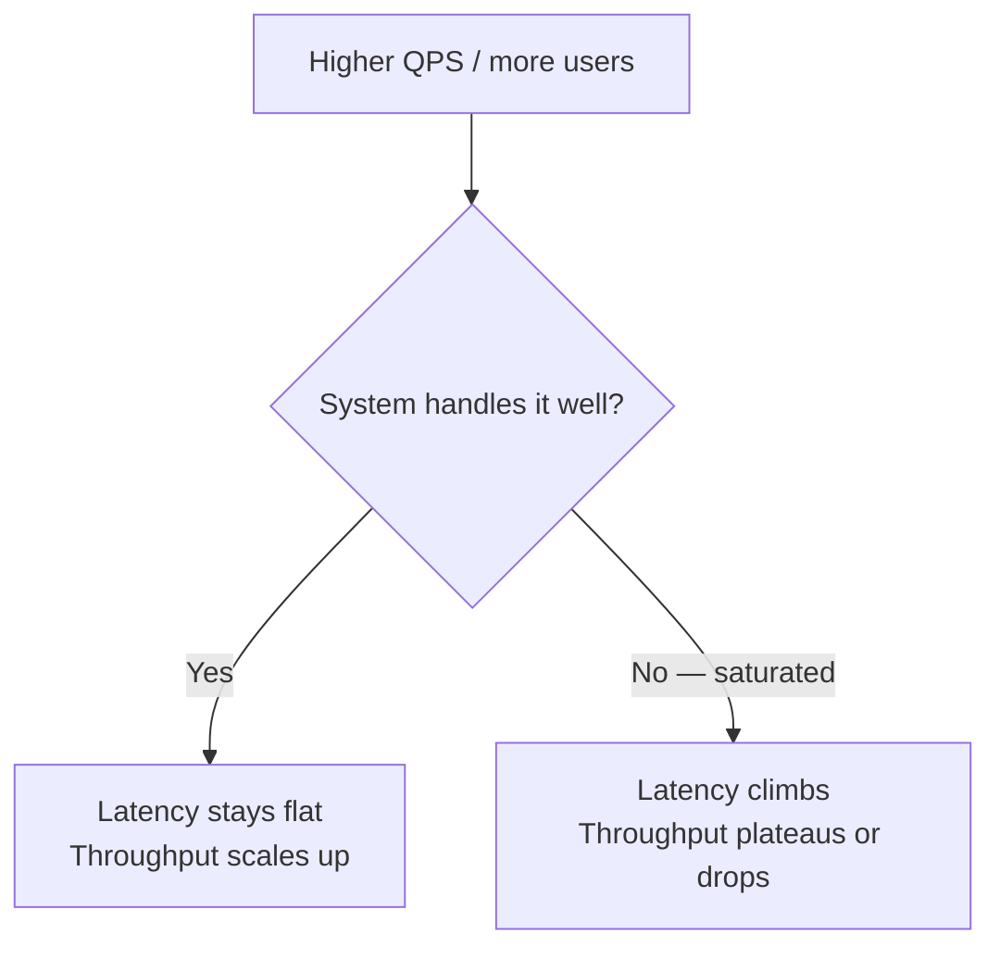

# Cheat Sheets

Reference material, not teaching material. For the "why," follow the links into the concept pages. For the "what do I say in the next five minutes," this page.

---

## System Design Interview Checklist

Work the steps in order. Naming a database before you have a requirement is the single most common way to lose a system design round.

| # | Step | What to actually do | Time budget (45 min round) |
|---|------|----------------------|------------------------------|
| 1 | **Clarify requirements** | Functional (what does it do) + non-functional (consistency, latency, availability targets). Ask about read/write ratio, scale, and what "correct" means for this domain. | 5 min |
| 2 | **Estimate scale** | Back-of-envelope: DAU, QPS (avg + peak), storage/day, bandwidth. See [Calculators](calculators.md). This decides "one Postgres box" vs "sharded cluster" before you draw anything. | 5 min |
| 3 | **High-level design** | Draw boxes: client → LB → services → data stores. Get one end-to-end request working on the whiteboard before going deep. | 10 min |
| 4 | **Deep dive** | Pick 1–2 components the interviewer cares about (usually the data model, the hot path, or a specific trade-off) and go deep — schema, algorithm, concurrency. | 15 min |
| 5 | **Identify bottlenecks** | Say the number out loud: "at 50k QPS the single Postgres primary is the ceiling." Name the first thing that breaks, not the tenth. | 3 min |
| 6 | **Discuss trade-offs** | CP vs AP, SQL vs NoSQL, sync vs async — justify with the requirements from step 1, not with defaults. See the [Trade-off Matrix](tradeoff-matrix.md). | 5 min |
| 7 | **Wrap up** | Summarize the design, name what you'd do differently with more time (monitoring, DR, cost), and flag known gaps. | 2 min |

!!! tip "Staff-level tell"
    Juniors jump straight to step 3. Staff engineers spend real time on step 1 — because the wrong requirement makes every later decision wrong too.

---

## The 7 Technical Areas That Actually Get Scored

The checklist above is the *process* — how to spend 45 minutes. This is the *content* — the technical ground you need to cover regardless of which product you're asked to design. Miss one of these and the interviewer has a specific, nameable gap to probe.

| # | Area | What "good" sounds like | Full page |
|---|------|--------------------------|-----------|
| 1 | **Requirements + numbers** | Read/write ratio, p95/p99 latency target, availability target, data size, growth rate, and named failure modes — before any box is drawn. No numbers = no design. | [Requirements & Estimation](../foundations/requirements-estimation.md), [System Design Framework](../foundations/framework.md) |
| 2 | **API + data model** | Endpoints/events and core entities, with idempotency keys and pagination called out early — not bolted on when the interviewer asks "what if the client retries?" | [System Design Framework](../foundations/framework.md) |
| 3 | **Storage choice + access patterns** | Relational vs. KV vs. document vs. time series, justified by the actual queries, indexes, hot keys, and consistency needs — not "I'd use Postgres" as a reflex. | [SQL vs NoSQL](../databases/sql-vs-nosql.md), [Indexing & Storage](../databases/indexing.md), [Database Sharding](../databases/sharding.md) |
| 4 | **Caching and invalidation** | Where to cache (CDN, edge, app, Redis), TTL choice, stampede control, and an explicit answer for what a stale read means for *this* product. | [Cache Strategies](../performance/cache-strategies.md), [Cache Stampede](../performance/cache-stampede.md) |
| 5 | **Scalability plan** | Partition/shard key choice, queueing for burst absorption, async vs. sync paths, and a named plan for a hot shard/partition — not "add more servers." | [Database Sharding](../databases/sharding.md), [Consistent Hashing](../databases/consistent-hashing.md), [Message Queue Patterns](../messaging/patterns.md) |
| 6 | **Consistency, retries, and ordering** | At-least-once is the default in distributed systems — design for duplicates and out-of-order events explicitly, with backoff, and be honest that "exactly-once" is usually at-least-once plus idempotency, not a delivery guarantee. | [Consistency Models](../distributed-systems/consistency-models.md), [Replication](../distributed-systems/replication.md) |
| 7 | **Ops: SLOs, deploys, and cost** | What pages on-call, how a new version rolls out without an outage, runbooks for the top 2-3 failure modes, and the cost drivers that actually dominate the bill (egress, storage, overprovisioning). | [Deployment Strategies](../cloud/deployment-strategies.md), [Circuit Breakers](../reliability/circuit-breakers.md), [Rate Limiting](../reliability/rate-limiting.md) |

!!! tip "How this differs from the checklist above"
    The checklist is a **timer** — it stops you from spending 20 minutes on requirements and 2 on trade-offs. This table is a **coverage check** — after you finish, run down all 7 rows and confirm you actually said something concrete for each, not just the ones the interviewer happened to probe.

---

## System Design: 10 Concepts That Actually Get Scored

A denser cut of the same ground as the two tables above — the failure modes that show up in real production incidents, not textbook chapter titles.

| # | Concept | Why it decides the architecture | Full page |
|---|---------|----------------------------------|-----------|
| 1 | **Numbers first** | QPS, payload size, p95, retention, and error budget decide the shape of the system more than any diagram does — a design justified only by "this is the standard pattern" hasn't met its actual constraints yet. | [Requirements & Estimation](../foundations/requirements-estimation.md) |
| 2 | **Timeouts + retries + backoff** | Every dependency call needs a deadline, jitter, and a retry cap — without them, a partial outage becomes a self-inflicted DDoS as every caller retries the same struggling downstream simultaneously. | [Circuit Breakers](../reliability/circuit-breakers.md) |
| 3 | **Idempotency + dedupe** | Assume retries, duplicates, and out-of-order delivery by default. Design idempotency keys, fencing tokens, and exactly-once *side effects* at the edges — the transport layer will not give you this for free. | [API Design](../foundations/api-design.md) |
| 4 | **Data modeling + indexes** | Pick the query shapes and the right indexes, and rule out hot partitions before caching enters the conversation — a cache in front of a bad data model just delays the outage. | [Indexing & Storage](../databases/indexing.md), [Database Sharding](../databases/sharding.md) |
| 5 | **Consistency trade-offs** | Know explicitly where stale reads are acceptable, where you need a real transaction, and what the user sees mid-failover — "it depends" without naming the specific trade-off isn't an answer. | [Consistency Models](../distributed-systems/consistency-models.md), [CAP Theorem](../distributed-systems/cap-theorem.md) |
| 6 | **Backpressure** | Queues, rate limits, circuit breakers, and bounded thread/connection pools stop one slow downstream from taking the whole fleet down with it. | [Rate Limiting](../reliability/rate-limiting.md) |
| 7 | **Deploy safety** | Feature flags, canaries, and a fast rollback path beat "we tested it thoroughly" — and every migration needs to be backward-compatible and reversible before it ships. | [Deployment Strategies](../cloud/deployment-strategies.md) |
| 8 | **Observability that answers pages** | Golden signals plus traces with useful spans, sane label cardinality, and logs carrying request IDs and business fields — an alert nobody can follow with a specific query is a false-alarm generator. | [Production Reliability Practices](../observability/production-reliability-practices.md) |
| 9 | **Debugging production fast** | Reproduce from metrics, narrow the blast radius, diff configs, check recent deploys, confirm with one targeted query — in that order, not by guessing. | [Debugging Playbook](../observability/debugging-playbook.md) |
| 10 | **Security as architecture** | Threat-model early: authn/authz boundaries, secrets handling, least privilege, audit logs, secure-by-default interfaces — security bolted on after the design is done is a checklist, not architecture. | [Threat Modeling](../security/threat-modeling.md) |

---

## ACID Properties Quick Table

The properties a transaction gives you — and what actually breaks if you drop one. See [DDIA Concepts](../databases/ddia-concepts.md) for the full transactions/isolation-level treatment.

| Property | Meaning | What it ensures | If it's missing |
|----------|---------|------------------|------------------|
| **A** — Atomicity | A transaction's operations all happen, or none do | No partial updates from a crash mid-transaction | A money transfer debits one account and never credits the other |
| **C** — Consistency | A transaction moves the DB from one valid state to another | Constraints, triggers, and foreign keys are never violated | Orphaned rows, a total that no longer matches its line items |
| **I** — Isolation | Concurrent transactions don't see each other's uncommitted changes | Results look as if transactions ran one at a time | Two withdrawals both read the same starting balance and double-spend |
| **D** — Durability | Once committed, a transaction survives a crash | Data on disk (WAL/redo log) survives a power failure | A "successful" payment vanishes on restart |

!!! note "Isolation is the one with levers"
    Atomicity, Consistency, and Durability are close to binary — a database either has them or it's broken. Isolation is a spectrum (Read Uncommitted → Read Committed → Repeatable Read → Serializable), and picking a level is a real trade-off between correctness and throughput. That's the one interviewers actually probe — see [DDIA Concepts § Isolation](../databases/ddia-concepts.md) for phantom reads, non-repeatable reads, and write skew.

---

## Performance Metrics: QPS, TPS, Latency, Throughput

Four numbers that get conflated constantly. Knowing which one moved — and why — is what separates "the system is slow" from an actual diagnosis.

| Metric | What it measures | Unit | Lower is better? | Example |
|--------|-------------------|------|--------------------|---------|
| **QPS** (Queries Per Second) | How many requests arrive/are handled per second | requests/sec | No (capacity signal) | 500 users searching at once → ~500 QPS |
| **TPS** (Transactions Per Second) | How many *complete* business transactions finish per second — one transaction may bundle several queries | transactions/sec | No (capacity signal) | A fund transfer = debit + credit + audit log = 1 transaction, made of 3+ queries |
| **Latency** | Time from request sent to response received, for a single request | ms / µs | Yes | Click a button, response shows up in 350 ms → latency = 350 ms |
| **Throughput** | Total volume of work/data processed over time | requests/sec, MB/s | No (capacity signal) | A system processes 150 MB in 10 s → throughput = 15 MB/s |

**How they relate under load:**

- QPS/TPS answer "how much load, and how much of it is real business work."
- Latency answers "how long did *one* user wait."
- Throughput answers "how much total work got done" — a system can have high throughput and terrible p99 latency at the same time (batching hides tail latency; see [Tail Latency](../performance/tail-latency.md)).

**Worked example:** an e-commerce flash sale — 10,000 concurrent users, 8,000 req/s, 2,000 orders/s successfully placed (TPS), average response time 420 ms, 120 MB/s transferred. The QPS number alone doesn't tell you the system is struggling; the fact that TPS (2,000) is well below QPS (8,000) and p95 latency has climbed does — most of the 8,000 requests/sec are retries and page-refreshes from users staring at a slow cart, not new demand. See [Requirements & Estimation](../foundations/requirements-estimation.md) for turning these into capacity numbers before you design.

---

## Big-O Complexity Cheat Table

### Data structure operations

| Structure | Access | Search | Insert | Delete | Notes |
|-----------|--------|--------|--------|--------|-------|
| Array | O(1) | O(n) | O(n) | O(n) | Insert/delete O(1) at the end |
| Linked List | O(n) | O(n) | O(1) | O(1) | O(1) insert/delete only with a node reference |
| Hash Table | — | O(1) avg / O(n) worst | O(1) avg | O(1) avg | Worst case from collisions/resize |
| Binary Search Tree (balanced) | O(log n) | O(log n) | O(log n) | O(log n) | Unbalanced BST degrades to O(n) |
| Heap (binary) | O(1) min/max | O(n) | O(log n) | O(log n) | Peek is O(1); arbitrary search is O(n) |
| Trie | — | O(k) | O(k) | O(k) | k = key length, not n |
| Skip List | O(log n) | O(log n) | O(log n) | O(log n) | Probabilistic balance |

### Sorting algorithms

| Algorithm | Best | Average | Worst | Space | Stable |
|-----------|------|---------|-------|-------|--------|
| Quicksort | O(n log n) | O(n log n) | O(n²) | O(log n) | No |
| Mergesort | O(n log n) | O(n log n) | O(n log n) | O(n) | Yes |
| Heapsort | O(n log n) | O(n log n) | O(n log n) | O(1) | No |
| Timsort (Python/Java default) | O(n) | O(n log n) | O(n log n) | O(n) | Yes |
| Bubble/Insertion sort | O(n) | O(n²) | O(n²) | O(1) | Yes |
| Counting/Radix sort | O(n+k) | O(n+k) | O(n+k) | O(n+k) | Yes |

### Graph algorithms

| Algorithm | Time | Space | Use When |
|-----------|------|-------|----------|
| BFS | O(V+E) | O(V) | Shortest path, unweighted |
| DFS | O(V+E) | O(V) | Cycle detection, topological sort, connectivity |
| Dijkstra | O((V+E) log V) | O(V) | Shortest path, non-negative weights |
| Bellman-Ford | O(V·E) | O(V) | Shortest path, negative weights (detects negative cycles) |
| Union-Find (path compression + rank) | ~O(α(n)) amortized | O(V) | Connectivity, Kruskal's MST |
| Topological sort (Kahn's / DFS) | O(V+E) | O(V) | DAG ordering, build/dependency graphs |

### Common algorithmic patterns (interview shorthand)

| Pattern | Typical complexity | Signal in the prompt |
|---------|--------------------|-----------------------|
| Two pointers | O(n) | Sorted array, pair sum, in-place partition |
| Sliding window | O(n) | Substring/subarray with a constraint |
| Binary search | O(log n) | Sorted or monotonic search space |
| Dynamic programming | O(n·m) typical | "Number of ways," "min/max cost," overlapping subproblems |
| Backtracking | Exponential (pruned) | "All combinations/permutations," constraint satisfaction |

See [DSA](../dsa/index.md) for the full pattern library.

---

## HTTP Status Code Quick Table

The ones interviewers actually ask about — know when to use which, not just the number.

| Code | Name | When to use it |
|------|------|-----------------|
| **200** | OK | Successful GET/PUT/POST with a body |
| **201** | Created | POST that created a resource — return the `Location` header |
| **202** | Accepted | Request accepted for async processing (queued, not yet done) |
| **204** | No Content | Success, nothing to return (e.g. DELETE) |
| **301 / 308** | Moved Permanently | Permanent redirect; 308 preserves the HTTP method, 301 may not |
| **302 / 307** | Found / Temporary Redirect | Temporary redirect; 307 preserves method |
| **304** | Not Modified | Conditional GET with matching `ETag`/`If-Modified-Since` — caching |
| **400** | Bad Request | Malformed request — client sent something the server can't parse |
| **401** | Unauthorized | Missing/invalid authentication (really means "unauthenticated") |
| **403** | Forbidden | Authenticated but not allowed — do not leak *why* to the client |
| **404** | Not Found | Resource doesn't exist (or you don't want to confirm it does, for security) |
| **409** | Conflict | Concurrent modification — optimistic locking, version mismatch |
| **422** | Unprocessable Entity | Syntactically valid, semantically invalid (validation failure) |
| **429** | Too Many Requests | Rate limit exceeded — always pair with `Retry-After`. See [Rate Limiting](../reliability/rate-limiting.md) |
| **500** | Internal Server Error | Unhandled exception — the server's fault, generically |
| **502** | Bad Gateway | Upstream/proxy got an invalid response from a downstream service |
| **503** | Service Unavailable | Overloaded or intentionally shedding load — pair with `Retry-After`. This is what an open [circuit breaker](../reliability/circuit-breakers.md) should return |
| **504** | Gateway Timeout | Upstream didn't respond in time — distinct from 502 (upstream responded, but badly) |

!!! note "Interview tell"
    Confusing 401 vs 403, or not knowing that 429/503 need `Retry-After`, reads as "hasn't operated a production API." Also: never use 200 with an error payload in the body — status codes exist so infra (LBs, retries, monitoring) can reason about the response without parsing it.

---

## Latency Numbers Every Engineer Should Know

Order-of-magnitude numbers for back-of-envelope math. Approximate, but the *ratios* between rows are the part that matters in an interview.

| Operation | Latency |
|-----------|---------|
| L1 cache reference | ~1 ns |
| Branch mispredict | ~5 ns |
| L2 cache reference | ~7 ns |
| Mutex lock/unlock | ~25 ns |
| Main memory reference (RAM) | ~100 ns |
| Compress 1 KB with a fast compressor | ~2,000 ns (2 µs) |
| Send 1 KB over 1 Gbps network | ~10,000 ns (10 µs) |
| Read 1 MB sequentially from RAM | ~10,000 ns (10 µs) |
| SSD random read | ~100,000 ns (100 µs) |
| Read 1 MB sequentially from SSD | ~1,000,000 ns (1 ms) |
| Round trip within same datacenter | ~500,000 ns (0.5 ms) |
| Disk seek (spinning HDD) | ~10,000,000 ns (10 ms) |
| Read 1 MB sequentially from HDD | ~20,000,000 ns (20 ms) |
| Round trip cross-country (US) | ~50,000,000 ns (50 ms) |
| Round trip intercontinental (US ↔ Europe/Asia) | ~150,000,000 ns (150 ms) |

**Rules of thumb this implies:**

- Memory is ~100× faster than SSD, and SSD is ~10-20× faster than spinning disk.
- A same-DC round trip (~0.5 ms) is cheap; a cross-region round trip (~150 ms) is 300× that — never do it in a hot request path if you can avoid it.
- Network beats disk seeks: sending 1 KB over the LAN is faster than one HDD disk seek.

See [Calculators](calculators.md) for Little's Law and capacity math built on these numbers, and [Engineering Math](../foundations/math.md) if it's filled in.

---

## Distributed Systems Glossary — Quick Table

One line each. Full treatment is one click away.

| Concept | One-liner | Full page |
|---------|-----------|-----------|
| **CAP theorem** | During a network partition, choose consistency or availability — not both. | [CAP Theorem](../distributed-systems/cap-theorem.md) |
| **PACELC** | Extends CAP: even without a partition, there's a latency vs consistency trade-off. | [CAP Theorem](../distributed-systems/cap-theorem.md) |
| **Quorum** | A majority (`⌊n/2⌋+1`) of nodes must agree before a read/write is considered durable/valid. | [Raft](../distributed-systems/raft.md) |
| **Consensus** | Getting a set of unreliable nodes to agree on a single value/log despite crashes and delays. | [Consensus & Raft](../distributed-systems/raft.md) |
| **Leader election** | Automatically picking one node to sequence writes after the previous leader fails. | [Consensus & Raft](../distributed-systems/raft.md) |
| **Replication lag** | The delay between a write committing on the primary and becoming visible on a replica. | [Replication](../distributed-systems/replication.md) |
| **Consistent hashing** | Maps keys and nodes onto a ring so only ~K/N keys move when a node is added or removed. | [Consistent Hashing](../databases/consistent-hashing.md) |
| **Sharding** | Horizontal partitioning of data across independent database instances by a shard key. | [Database Sharding](../databases/sharding.md) |
| **Split brain** | Two nodes both believe they are the leader/primary and both accept writes. | [Consensus & Raft](../distributed-systems/raft.md) |
| **Consumer lag** | How far behind a consumer is from the latest offset in a partition/queue. | [Kafka Deep Dive](../messaging/kafka.md) |
| **Cache stampede** | A hot key expires and many concurrent requests all miss the cache at once, flooding the DB. | [Cache Stampede](../performance/cache-stampede.md) |
| **Circuit breaker** | Trips open after too many failures to a dependency, failing fast instead of piling up threads. | [Circuit Breakers](../reliability/circuit-breakers.md) |
| **Rate limiting** | Bounds how many requests a client can make per window — fairness, stability, and cost control. | [Rate Limiting](../reliability/rate-limiting.md) |
| **Tail latency** | p99/p999 latency — dominated by queueing, GC pauses, and slow dependencies, not the median. | [Tail Latency](../performance/tail-latency.md) |
| **Saga** | A sequence of local transactions with compensations, used instead of a distributed 2PC transaction. | [Sagas](../architecture-patterns/sagas.md) |

---

## Kubernetes: 10 Concepts That Actually Get You Paged

The list that matters in an incident, not the API surface. Full walkthrough (objects, request flow, guided diagnosis by symptom) at [Kubernetes](../kubernetes/index.md).

| # | Concept | The mistake that pages you | Full page |
|---|---------|------------------------------|-----------|
| 1 | **Pod lifecycle + probes** | A bad liveness probe kills a pod that's just slow to start, not dead — you learn the difference between liveness (kills loops), readiness (gates traffic), and startup (delays premature restarts) the hard way. | [Kubernetes § Probes](../kubernetes/index.md#probes-three-different-questions) |
| 2 | **Requests/limits** | Requests drive scheduling, limits drive throttling/OOMKills — set neither and you're chasing "noisy neighbor" tickets forever. | [Kubernetes § Guided Diagnosis](../kubernetes/index.md#guided-diagnosis) |
| 3 | **Deployments + rollout strategy** | `maxUnavailable` not set to 0 for a latency-sensitive API means a rollout drops capacity mid-deploy; always have a fast rollback path ready before you ship. | [Deployment Strategies](../cloud/deployment-strategies.md) |
| 4 | **Services + DNS** | ClusterIP is stable, Pod IPs are not — most "random" outages trace back to a wrong port, a selector typo, or a headless-DNS assumption that doesn't hold. | [Kubernetes § Request Flow](../kubernetes/index.md#request-flow) |
| 5 | **Ingress/Gateway + TLS** | Where TLS terminates decides whether you get real client IPs, mTLS, sane timeouts, and large-body uploads — get this wrong and every downstream security decision inherits the mistake. | [Kubernetes § Ingress failure](../kubernetes/index.md#ingress-failure) |
| 6 | **Storage basics** | Treating a stateful workload like a stateless one — not understanding PV/PVC/StorageClass, access modes, and volume expansion — is how you lose data on a routine node drain. | [Kubernetes § Storage](../kubernetes/index.md#storage-dont-treat-stateful-like-stateless) |
| 7 | **RBAC + service accounts** | The default service account is not "fine for now" — least privilege, namespace scoping, and auditing who can `exec`/port-forward are what stop a compromised pod from becoming a cluster-wide incident. | [Kubernetes § RBAC](../kubernetes/index.md#rbac-service-accounts), [Zero Trust Architecture](../security/zero-trust-architecture.md) |
| 8 | **NetworkPolicy** | Great for blast-radius containment, easy to accidentally brick `kube-dns` — always explicitly allow DNS and egress to real dependencies before locking anything down. | [Kubernetes § NetworkPolicy](../kubernetes/index.md#networkpolicy) |
| 9 | **Observability plumbing** | One high-cardinality label (user ID, request ID as a metric label) can melt Prometheus and your monitoring budget in the same afternoon. | [Kubernetes § Production Debugging](../kubernetes/index.md#production-debugging), [Production Reliability Practices](../observability/production-reliability-practices.md) |
| 10 | **Debugging workflow** | `kubectl describe`/events first, then logs, then `exec` — most production issues are an image-pull failure, a crash loop, or a bad env var, in that order of likelihood. | [Kubernetes § Guided Diagnosis](../kubernetes/index.md#guided-diagnosis) |

---

*Pair this page with the [Trade-off Matrix](tradeoff-matrix.md) for comparisons and the [Glossary](glossary.md) for definitions outside distributed systems (databases, caching, general SWE terms).*
